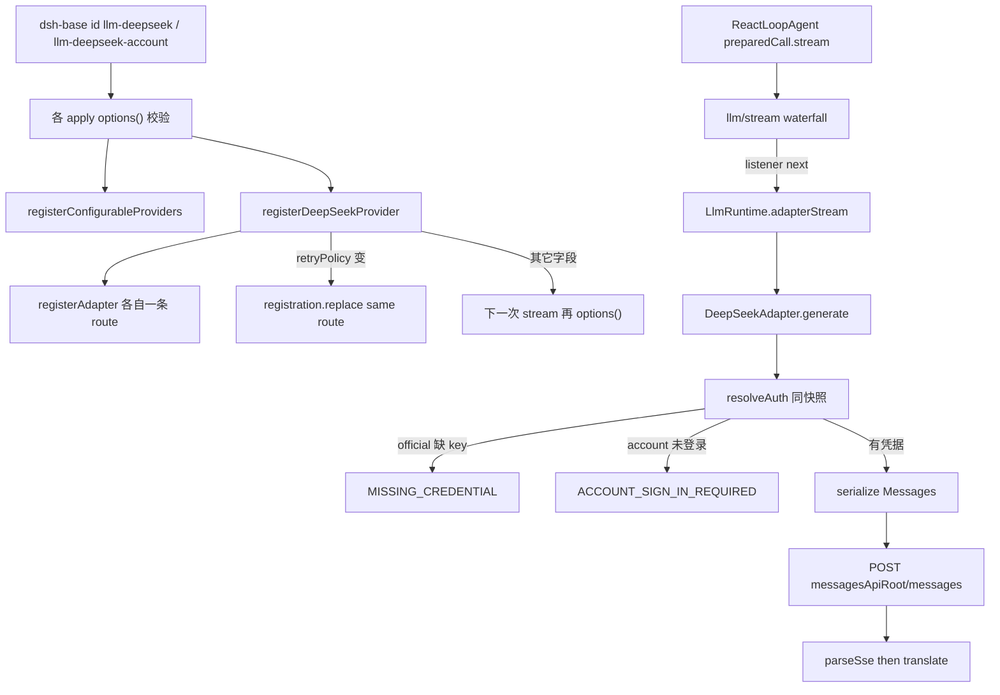

> DeepSeek 对话现在是 **一条 Messages 协议库 + 两条 host Provider**：`@deepseek-ai/dsh-llm-deepseek` 只提供 `DeepSeekAdapter` / serialize / `registerDeepSeekProvider`，**没有** Cordis `apply`。`@deepseek-ai/dsh-llm-deepseek-api-key` 始终登记 `deepseek-official`（`x-api-key`）；`@deepseek-ai/dsh-llm-deepseek-account` 始终登记 `deepseek-account`（`x-dsh-auth-token`，经 `ctx.deepseekAccount`）。这不是 pi-ai catalog 名 `deepseek`，也不是 `ctx.llm` 本身。

DSH 是 Cordis 组合运行时（`profile → bundle → agent preset`）。capability seam 是 Definition / Provider / Consumer。这三包都坐在 **host 面**（和 `ctx.llm` / `ctx.settings` / `ctx.credentials` / `ctx.deepseekAccount` 同一层），不进 agent-preset 的 tools / persona / isolate 树。调用方用 `GenerateOptions.provider` 选路由；仓库里没有 `ctx.llm.route`。进入模型请求的 `provider` / `model` 必须能从 session log 的 `request/header` 重建（`model-visible ⟺ logged`）。五个 shipped CLI profile 是 `web` / `headless` / `sdk` / `sdk-minimal` / `acp`。`PROFILE_TEMPLATES` **没有 `desktop`**。 [E: packages/boot/app-boot/src/profile.ts:179] [E: packages/boot/app-boot/src/profile.ts:193]

## 能回答的问题

- `deepseek-official` 和 `deepseek-account` 分别是谁在什么时候 `registerAdapter` 的？yml `id: llm-deepseek` 对应哪个 npm 包？
- 缺 `DEEPSEEK_API_KEY` / 未登录账号会不会让插件 load 失败？两条路由会不会互相回落到对方的凭据？
- 默认 catalog 有哪些 id？`deepseek-v4-flash` 还能不能发？ACP / TS SDK / Python SDK 默认模型是谁？
- settings 改 base URL / catalog / key 要不要重注册？什么变化才会 `replace`？
- 这条路由和 pi-ai catalog 名 `deepseek` 差在哪？`searchProvider: deepseek-official` 是不是本 adapter？
- `llm/stream` waterfall 谁必须 `next()`？本行有没有 isolate？

## 职责边界

协议库 `@deepseek-ai/dsh-llm-deepseek` 拥有： [E: packages/llm/llm-deepseek/package.json:2]

- `DeepSeekAdapter`：Messages `fetch` + SSE。 [E: packages/llm/llm-deepseek/src/adapter.ts:20]
- `registerDeepSeekProvider`：建 adapter、`registerAdapter`、可选 `settings.configure({ auto: false })`、`loader/volatile-update` 上只对 `retryPolicy` 做 `replace`。 [E: packages/llm/llm-deepseek/src/host.ts:18] [E: packages/llm/llm-deepseek/src/host.ts:39]
- 连接事实 `resolveAdapterOptions`（endpoint / catalog / thinking / 已 resolve 的 `retryPolicy`）。协议 `Config` **没有** `apiKey` / `apiKeyEnv`。 [E: packages/llm/llm-deepseek/src/config.ts:18] [E: packages/llm/llm-deepseek/src/config.ts:204]
- 默认 catalog、文本/图序列化、SSE 翻译、Files API。

API-key 插件 `@deepseek-ai/dsh-llm-deepseek-api-key` 拥有： [E: packages/llm/llm-deepseek-api-key/package.json:2]

- Cordis plugin 名 `llm-deepseek-api-key`，`inject = ['llm']`。 [E: packages/llm/llm-deepseek-api-key/src/index.ts:12] [E: packages/llm/llm-deepseek-api-key/src/index.ts:13]
- 唯一 provider 字符串 `deepseek-official`。`apply` 无条件 `registerDeepSeekProvider`。 [E: packages/llm/llm-deepseek-api-key/src/index.ts:15] [E: packages/llm/llm-deepseek-api-key/src/index.ts:39]
- 每请求解析 `apiKeyEnv`（默认 `DEEPSEEK_API_KEY`）成 header `x-api-key`。 [E: packages/llm/llm-deepseek-api-key/src/config.ts:16] [E: packages/llm/llm-deepseek-api-key/src/index.ts:41]
- directory 条目 displayName `DeepSeek`；`settingsNs` = fiber 行 `id`（base 里是 `llm-deepseek`）否则回落到 plugin `name`。 [E: packages/llm/llm-deepseek-api-key/src/index.ts:37]

账号插件 `@deepseek-ai/dsh-llm-deepseek-account` 拥有： [E: packages/llm/llm-deepseek-account/package.json:2]

- Cordis plugin 名 `llm-deepseek-account`，`inject = ['llm']`。 [E: packages/llm/llm-deepseek-account/src/index.ts:12] [E: packages/llm/llm-deepseek-account/src/index.ts:13]
- 唯一 provider 字符串 `deepseek-account`。同样无条件登记。 [E: packages/llm/llm-deepseek-account/src/index.ts:15] [E: packages/llm/llm-deepseek-account/src/index.ts:42]
- `Config` 复用协议 schema，**没有** `apiKeyEnv`。 [E: packages/llm/llm-deepseek-account/src/config.ts:5] [E: packages/llm/llm-deepseek-account/tests/provider.spec.ts:32]
- 每请求 `ctx.deepseekAccount.resolveToken(connection.baseURL)` → header `x-dsh-auth-token`。缺 token → `ACCOUNT_SIGN_IN_REQUIRED`；401 → `ACCOUNT_TOKEN_INVALID` 并 `rejectToken`；`QUOTA` → `ACCOUNT_QUOTA`。 [E: packages/llm/llm-deepseek-account/src/index.ts:22] [E: packages/llm/llm-deepseek-account/src/index.ts:25] [E: packages/llm/llm-deepseek-account/src/index.ts:29]
- 未登录时 `discoverModels` 返回空列表，不抛。 [E: packages/llm/llm-deepseek-account/src/index.ts:48]

账号缝 Definition 是 `@deepseek-ai/dsh-deepseek-account` 的抽象服务 `DeepSeekAccount`（`ctx.deepseekAccount`）。 [E: packages/credentials/deepseek-account/src/index.ts:32] [E: packages/credentials/deepseek-account/src/index.ts:34] shipped Provider 是 `@deepseek-ai/dsh-deepseek-account-platform` 的 `PlatformAccount`（base 行 `id: deepseek-account`）。 [E: packages/bundle/base/cordis.patch.yml:112] [E: packages/bundle/base/cordis.patch.yml:113]

本页 **不** 拥有：

- `ctx.llm` 服务、`registerAdapter` 合同、`llm/stream` waterfall、`prepareCall` — [subsys.llm.service](./service.md)。
- retry **执行**（`agent/request-error`）— [subsys.llm.retry](./retry.md)。本包只通过 `providerRetryPolicy` 交出策略值。 [E: packages/llm/llm-deepseek/src/adapter.ts:33]
- 默认「下一个新 Agent」的 `provider` / `model` 选择 — [subsys.core.agent-default-model](../core/agent-default-model.md)。`dsh-base` 把那一行写成 `provider: deepseek-official`、`model: deepseek-flash`。 [E: packages/bundle/base/cordis.patch.yml:85] [E: packages/bundle/base/cordis.patch.yml:86]
- pi-ai 多协议 adapter、catalog 名 `deepseek`、dormant 零 route — [subsys.llm.pi-ai](./pi-ai.md)。
- Web 搜索。`searchProvider: deepseek-official` 是 `@deepseek-ai/dsh-web` + `@deepseek-ai/dsh-web-search-deepseek`，另一条 seam、另一套 endpoint。 [E: packages/bundle/base/cordis.patch.yml:474] [E: packages/web/web-search-deepseek/src/provider.ts:27]
- session `request/header`、`deriveMessages()`、turn/step — [spine.turn-and-step](../../spine/turn-and-step.md)。
- Models 页字段表与用户可见文案 — [surface.providers.deepseek](../../surface/providers/deepseek.md)。
- credentials 文档与 PKCE 登录 UI — [subsys.persistence.credentials](../persistence/credentials.md)。本页只写推理请求怎样消费 `resolveToken`。

preset **不**挂这三包。四个 shipped preset 只叠在 `dsh-web-app` 的 `presets/*.patch.yml`，没有 `id: llm-deepseek` / `id: llm-deepseek-account`。`dsh-base` 无条件 insert 两行；`sdk-minimal` 作为不叠 base 的完整 insert **只**自挂 API-key 行（可带 `apiKeyEnv`），不挂账号行、不挂 pi-ai。 [E: packages/bundle/base/cordis.patch.yml:524] [E: packages/bundle/base/cordis.patch.yml:527] [E: packages/bundle/sdk-minimal/cordis.patch.yml:26]

## 关键文件

| 路径 | 角色 |
|---|---|
| `packages/llm/llm-deepseek/src/host.ts` | 两条 Provider 共用的 `registerDeepSeekProvider` |
| `packages/llm/llm-deepseek/src/adapter.ts` | `DeepSeekAdapter`：每请求冻连接事实 + auth，`POST …/messages` |
| `packages/llm/llm-deepseek/src/config.ts` | 协议 `Config` / `PUBLIC_BASE_URL` / `resolveAdapterOptions` |
| `packages/llm/llm-deepseek/src/models.ts` | 默认 catalog：`deepseek-flash` + `deepseek-v4-pro` |
| `packages/llm/llm-deepseek-api-key/src/index.ts` | `apply`：登记 `deepseek-official`，解析 API key |
| `packages/llm/llm-deepseek-account/src/index.ts` | `apply`：登记 `deepseek-account`，解析账号 token |
| `packages/credentials/deepseek-account/src/index.ts` | `DeepSeekAccount` 抽象：`resolveToken` / `rejectToken` |
| `packages/credentials/deepseek-account-platform/src/index.ts` | shipped `PlatformAccount`：PKCE grant + origin 门控 |
| `packages/bundle/base/cordis.patch.yml` | host 行 `id: llm-deepseek` / `id: llm-deepseek-account` / `id: deepseek-account` |
| `packages/bundle/sdk-minimal/cordis.patch.yml` | 不叠 base 时只挂 API-key |
| `packages/bundle/acp-app/cordis.patch.yml` | ACP 插件行硬编码 `model: deepseek-v4-flash` |

## 数据模型

六个名字不要混：

| 名字 | 是什么 |
|---|---|
| 协议库 `@deepseek-ai/dsh-llm-deepseek` | Messages adapter + `registerDeepSeekProvider`；**不是** Cordis plugin |
| yml `id: llm-deepseek` | base / sdk-minimal 的 host 行，`name: '@deepseek-ai/dsh-llm-deepseek-api-key'` [E: packages/bundle/base/cordis.patch.yml:524] |
| plugin 名 `llm-deepseek-api-key` | API-key 包的 `export const name` |
| settings ns `llm-deepseek` | 在有 Loader 行时 = 该行 `id`；无 entry 时回落到 plugin `name` |
| route `deepseek-official` | API-key 写入 `adapters` 的键 |
| route `deepseek-account` | 账号插件写入 `adapters` 的键；yml `id: llm-deepseek-account` |

| 符号 | 关键字段 | 含义 |
|---|---|---|
| `DeepSeekConnectionOptions` | `baseURL`、`defaults`、`models`、`retryPolicy`、`filePolicy` | 一次 `resolveAdapterOptions` 的快照；**不含**字面 key |
| `ResolvedDeepSeekOptions`（API-key） | 协议字段 + `apiKeyEnv` | 连接事实与 credential **引用**同一代 [E: packages/llm/llm-deepseek-api-key/src/config.ts:21] |
| `DeepSeekRequestAuth` | `headers`、`onRequestError?` | 官方是 `{ 'x-api-key': … }`；账号是 `{ 'x-dsh-auth-token': … }` 加 401/quota mapper [E: packages/llm/llm-deepseek/src/types.ts:85] |
| `DeepSeekCatalogModel` | `id`、`inputModalities?`、`systemPromptUpdate?`、`toolUpdate?` | 给 selector 的 **advisory** 列表；未列出的 id 仍可请求（按文本） |
| `PUBLIC_BASE_URL` | `https://api.deepseek.com/anthropic` | 缺 `baseURL` 且无 `$DEEPSEEK_BASE_URL` 时的 Messages 根 [E: packages/llm/llm-deepseek/src/config.ts:106] |

默认 catalog 两条：`deepseek-flash`（名 `DeepSeek-V41-Flash`，`inputModalities: ['text','image']`，`systemPromptUpdate: 'in-history'`，`toolUpdate: 'addition-only'`）与 `deepseek-v4-pro`（文本；schema 缺省 `inputModalities: ['text']`）。 [E: packages/llm/llm-deepseek/src/models.ts:8] [E: packages/llm/llm-deepseek/src/models.ts:16] [E: packages/llm/llm-deepseek/tests/runtime.spec.ts:1739] composition 默认选 **`deepseek-flash`**。`deepseek-v4-flash` **不在**默认 catalog，但仍可当作未列出 id 发请求（按文本）；ACP 插件行、TS SDK 构造、Python SDK dataclass **仍硬编码**它。部署可以把 `deepseek-v4-flash` 写回 `models:` 与 flash / pro 并存。 [E: packages/bundle/base/cordis.patch.yml:86] [E: packages/bundle/acp-app/cordis.patch.yml:21] [E: packages/sdk/client/src/api.ts:43] [E: python/sdk/src/deepseek_harness/api.py:23]

缺 `baseURL` 时：组合值 → 启动环境里的 `DEEPSEEK_BASE_URL` → `PUBLIC_BASE_URL`。 [E: packages/llm/llm-deepseek/src/config.ts:290] `messagesApiRoot` 在 pathname 尚未以 `/v1` 结尾时补 `/v1`。 [E: packages/llm/llm-deepseek/src/messages-api.ts:16] adapter 常量：`DEFAULT_CONTEXT_WINDOW = 1_000_000`、`DEFAULT_MAX_TOKENS = 256_000`、idle `300_000` ms。thinking 开着时 advertised efforts 是 `off` / `low` / `high` / `max`，缺配置时 `defaultEffort` 落到 `high`。 [E: packages/llm/llm-deepseek/src/model-info.ts:88] [E: packages/llm/llm-deepseek/src/model-info.ts:96]

`PlatformAccount` 默认 `platformOrigin: https://platform.deepseek.com`、`inferenceOrigin: https://api.deepseek.com`。`resolveToken` 只在请求 URL 的 **origin** 等于 `inferenceOrigin` 时交出 grant；mock token、loopback issuer 打生产 origin 都会拒绝。 [E: packages/credentials/deepseek-account-platform/src/index.ts:53] [E: packages/credentials/deepseek-account-platform/src/index.ts:56] [E: packages/credentials/deepseek-account-platform/src/index.ts:375]

## 控制流

```mermaid
flowchart TD
  Base["dsh-base id llm-deepseek / llm-deepseek-account"] --> Apply["各 apply options() 校验"]
  Apply --> Dir["registerConfigurableProviders"]
  Apply --> Host["registerDeepSeekProvider"]
  Host --> Reg["registerAdapter 各自一条 route"]
  Host -->|retryPolicy 变| Replace["registration.replace same route"]
  Host -->|其它字段| NextReq["下一次 stream 再 options()"]
  Loop["ReactLoopAgent preparedCall.stream"] --> WF["llm/stream waterfall"]
  WF -->|listener next| AdapterStream["LlmRuntime.adapterStream"]
  AdapterStream --> DS["DeepSeekAdapter.generate"]
  DS --> Auth["resolveAuth 同快照"]
  Auth -->|official 缺 key| Miss["MISSING_CREDENTIAL"]
  Auth -->|account 未登录| Sign["ACCOUNT_SIGN_IN_REQUIRED"]
  Auth -->|有凭据| Ser["serialize Messages"]
  Ser --> Fetch["POST messagesApiRoot/messages"]
  Fetch --> SSE["parseSse then translate"]
```

1. `dsh-base` 在 host 根 insert `id: llm-deepseek`（`name: '@deepseek-ai/dsh-llm-deepseek-api-key'`，无 `config:` / 无 `isolate:`）和 `id: llm-deepseek-account`（`name: '@deepseek-ai/dsh-llm-deepseek-account'`）。同一次 insert 里 `id: agent-default-model` 写 `provider: deepseek-official`、`model: deepseek-flash`；`id: deepseek-account` 挂 Platform 实现。ACP 插件行另写 `model: deepseek-v4-flash`，那是 ACP 包 config，不是本服务 overlay。四个 shipped preset **不**再挂这两行。`sdk-minimal` 自己 insert API-key 行（可带 `apiKeyEnv` / 超长 idle），**不** insert 账号行。 [E: packages/bundle/base/cordis.patch.yml:82] [E: packages/bundle/base/cordis.patch.yml:86] [E: packages/bundle/base/cordis.patch.yml:524] [E: packages/bundle/base/cordis.patch.yml:527] [E: packages/bundle/acp-app/cordis.patch.yml:21] [E: packages/bundle/sdk-minimal/cordis.patch.yml:26]

2. 两个 `apply` 进入后立刻 `options()` 一次：`resolveAdapterOptions` 校验 catalog / thinking / bounds，失败则 **load 抛错、不注册**。这一步只解析连接事实，不读 API key、不读账号 token。 [E: packages/llm/llm-deepseek-api-key/src/index.ts:19] [E: packages/llm/llm-deepseek-account/src/index.ts:19] [E: packages/llm/llm-deepseek/src/config.ts:209]

3. 各 `apply` 先 `registerConfigurableProviders([{ provider, displayName, settingsNs, settingsPath: [] }])`，再 `registerDeepSeekProvider` → **无条件** `ctx.llm.registerAdapter([provider], adapter)`。没有「零 route」分支。这和 `llm-pi-ai` 相反：后者 `routes.length === 0` 时直接 `return`，不 `registerAdapter`。 [E: packages/llm/llm-deepseek-api-key/src/index.ts:36] [E: packages/llm/llm-deepseek/src/host.ts:39] [E: packages/llm/llm-deepseek-account/src/index.ts:39]

4. `registerDeepSeekProvider` 用 `ctx.inject(['settings'], …)` 包住 `settings.configure({ auto: false }, ctx.fiber)`：这是把该 fiber 的 **Volatile Config** 交给 Settings 页，不是旧的 `installSection` overlay。没挂 `ctx.settings` 时这段 `inject` 不跑，`options()` 仍读组合 entry + 启动环境。 [E: packages/llm/llm-deepseek/src/host.ts:21]

5. `loader/volatile-update` 用 `deepEqualJson` 比新旧 `retryPolicy`。只有策略变了才 `registration.replace([provider])`——同一 adapter 实例、一次同步 `commitRoutes`，观察者看不到空窗口。base URL / models / thinking **不**重注册：下一次 `options()` 会读到新快照。 [E: packages/llm/llm-deepseek/src/host.ts:41] [E: packages/llm/llm-deepseek/src/host.ts:46] [E: packages/llm/llm-deepseek/tests/dynamic-config.spec.ts:252]

6. 默认对话路由从这里接上。`AgentDefaultModelConfig.currentSelection()` 在 composition 下是 `{ provider: 'deepseek-official', model: 'deepseek-flash' }`。`ReactLoopAgent.step` 走 `preparedCall?.stream(request) ?? this.loopCtx.llm.stream(request)`；`GenerateOptions.provider` 必须是 `'deepseek-official'` 或 `'deepseek-account'` 才命中对应 adapter。 [E: packages/bundle/base/cordis.patch.yml:86] [E: packages/core/agent-default-model/src/index.ts:70] [E: packages/core/agent-loop/src/agent.ts:419] [E: packages/llm/llm-deepseek/tests/assemble.ts:20]

7. **waterfall 必须 `next()`。** `LlmRuntime.streamWithRegistration` 把 innermost 设成 `adapterStream`。listener 不 `next()` 就不会 `cbs.shift()`，`DeepSeekAdapter` 一次都不会跑。本包 **不** 自己挂 `llm/stream`。 [E: packages/llm/llm/src/index.ts:1143] [E: vendor/cordis/src/events.ts:237]

8. `DeepSeekAdapter.generate` **每个 stream 调用解析一次**：`options()` 出连接快照，再 `resolveAuth(connection)` 解同一代的 bearer。进行中的流不再读 settings。 [E: packages/llm/llm-deepseek/src/adapter.ts:47] [E: packages/llm/llm-deepseek/src/adapter.ts:82]

9. **API-key 路径。** 有 `ctx.credentials` 就 `credentials.resolve(apiKeyEnv)`；否则读启动环境里同名变量。两边都空 → `LlmError` `MISSING_CREDENTIAL`，**不是** load 失败。命中值走 `assertUsableApiKey`，畸形 key 是 `INVALID_CREDENTIAL`。 [E: packages/llm/llm-deepseek-api-key/src/index.ts:23] [E: packages/llm/llm-deepseek-api-key/src/index.ts:30] [E: packages/llm/llm-deepseek/tests/adapter.spec.ts:571]

10. **账号路径。** `resolveToken(connection.baseURL)` 得到 token；`undefined` → `ACCOUNT_SIGN_IN_REQUIRED`，**不**去读 `DEEPSEEK_API_KEY`。测试钉死：环境里有 API key、未登录时 `deepseek-account` 0 次 `fetch`。401 映射成 `ACCOUNT_TOKEN_INVALID` 并 `rejectToken`；`QUOTA` 映射成 `ACCOUNT_QUOTA`（官方路由仍报 `QUOTA`）。 [E: packages/llm/llm-deepseek-account/src/index.ts:22] [E: packages/llm/llm-deepseek/tests/account-routing.spec.ts:45] [E: packages/llm/llm-deepseek-account/tests/account-quota.spec.ts:37]

11. `serialize` 把 harness `Message` 写成 Messages body（`thinking` / `tool_use` / `tool_result` / 可选 file 或 base64 image）。未 catalog 的 model id 按文本 resolve，`inputModalities: ['text']`，请求照发。runtime 对文本模型会先把 image 块投影成文本，再交给 adapter。 [E: packages/llm/llm-deepseek/src/serialize.ts:56] [E: packages/llm/llm-deepseek/src/model-info.ts:73] [E: packages/llm/llm/src/index.ts:1070]

12. HTTP 是 `POST ${messagesApiRoot(baseURL)}/messages`，带 `anthropic-version: 2023-06-01`、可选 `anthropic-beta`（Files / mid-conversation tool changes）、`x-deepseek-harness-user-id`。2xx 后 `extensions.accept()`，再 `yield* translate(parseSse(response.body))`。零 content 的 `stop` → `EMPTY_RESPONSE`。SSE 不再要求字面 `[DONE]`；非法 JSON / type mismatch → `MALFORMED_RESPONSE`。 [E: packages/llm/llm-deepseek/src/adapter.ts:120] [E: packages/llm/llm-deepseek/src/adapter.ts:145] [E: packages/llm/llm-deepseek/src/translate.ts:149] [E: packages/llm/llm-deepseek/src/sse.ts:19]

13. **isolate。** 两行都是 host 服务，yml 不写 `isolate`。registration 绑在 `apply` fiber 上，fiber `dispose` 卸掉各自 route（HMR 安全）。不要把这两包再挂进 preset：会跟 host 抢同一 provider 键，`registerAdapter` 抛 `DUPLICATE_ADAPTER`。 [E: packages/llm/llm/src/index.ts:438]

## 设计动机

- **默认对话必须始终有一条活 API-key route。** first-boot 可以没有 key，但 Models 页和 `listModels('deepseek-official')` 必须看得见 catalog。所以 load 只校验连接事实，把 `MISSING_CREDENTIAL` 留到请求。 [E: packages/llm/llm-deepseek/tests/runtime.spec.ts:1738]
- **账号是第二条 route，不是同一条 route 的另一种 header。** 未登录时 `deepseek-account` 仍在 `listProviders()` 里，但 discovery 为空、请求 `ACCOUNT_SIGN_IN_REQUIRED`。测试钉死它从不回落到 API key。 [E: packages/llm/llm-deepseek-account/tests/provider.spec.ts:24] [E: packages/llm/llm-deepseek/tests/account-routing.spec.ts:53]
- **和 pi-ai catalog 名刻意不同。** pi-ai 的 `catalogProviderIds()` 就是安装目录 `getBuiltinProviders()`；其中 `deepseek` 在 directory 里 `declared: false`。本包占用 `deepseek-official` / `deepseek-account`，三家能并排挂。
- **retryPolicy 是唯一注册期捕获的事实。** 其它连接事实走 thunk，改完立刻作用于下一请求，不必让观察者看见 route 消失。 [E: packages/llm/llm-deepseek/src/host.ts:40]
- **连接事实与凭据同一代。** `resolveAuth` 吃的是这次 `options()` 返回的 snapshot，不能拿新 key 打旧 gateway。
- **未 catalog 的 id 当文本。** 把未知模型标成 image 会让 host 持久化图再在 endpoint 炸；`modelInfo` 对 uncatalogued 写死 `inputModalities: ['text']`。 [E: packages/llm/llm-deepseek/src/model-info.ts:69]
- **默认 catalog 收成 V41 Flash + V4 Pro。** `deepseek-v4-flash` 仍可请求、仍可写进 `models:` 与默认两条并存；ACP / SDK 客户端构造尚未改默认，避免自动化入口 silently 换模型。

## Gotcha

- **没有 `ctx.llm.route`。** 调用方写 `GenerateOptions.provider: 'deepseek-official'` 或 `'deepseek-account'`。
- **`deepseek` ≠ `deepseek-official` ≠ `deepseek-account`。** 前者是 pi-ai catalog / 可选 settings profile 键。混用会打到另一家，或 `NO_ADAPTER`。
- **yml `id: llm-deepseek` 的 npm 名是 `dsh-llm-deepseek-api-key`。** `@deepseek-ai/dsh-llm-deepseek` 不再 `apply`。无 Loader entry 时 directory `settingsNs` 会变成 `llm-deepseek-api-key`（plugin `name`），和 shipped yml 不一致。 [E: packages/llm/llm-deepseek-account/tests/provider.spec.ts:30]
- **无 key 也能 load 官方路由。** `listProviders` / `listModels('deepseek-official')` 在空 `DEEPSEEK_API_KEY` 下成功（默认两条，含 `deepseek-flash`）。第一次 `stream` 才 `MISSING_CREDENTIAL`。 [E: packages/llm/llm-deepseek/tests/runtime.spec.ts:2175]
- **未登录也能 load 账号路由，但 discovery 为空。** `listModels('deepseek-account')` 在 `ACCOUNT_SIGN_IN_REQUIRED` 时返回 `[]`；登录后才露出 catalog。 [E: packages/llm/llm-deepseek-account/src/index.ts:48] [E: packages/llm/llm-deepseek-account/tests/provider.spec.ts:34]
- **账号请求不读 `DEEPSEEK_API_KEY`。** 环境里有 key、未登录时 `deepseek-account` 仍是 `ACCOUNT_SIGN_IN_REQUIRED`、0 次 HTTP。 [E: packages/llm/llm-deepseek/tests/account-routing.spec.ts:54]
- **只有 `retryPolicy` 变化会 `replace`。** 改 `baseURL` / `models` / thinking 不会发空拓扑；测试观察 `llm/adapters-updated` 在策略更新时仍是 `[['deepseek-official']]`。 [E: packages/llm/llm-deepseek/tests/dynamic-config.spec.ts:274]
- **`thinking: disabled` 时 `high` / `max` 在 I/O 前失败。** resolver 禁止这样的组合 config。 [E: packages/llm/llm-deepseek/src/config.ts:209]
- **默认 catalog 没有 `deepseek-v4-flash` / `deepseek-v4-flash-vision-exp`。** 未列出的 id 仍可发，但按文本；vision 必须在 catalog 条目上声明 `image`。ACP / SDK / 搜索默认模型仍可能是 `deepseek-v4-flash`。
- **HTTP 是 Messages `/messages`，不是 chat-completions。** `PUBLIC_BASE_URL` 已是 `https://api.deepseek.com/anthropic`。
- **`resolveToken` 认 origin，不认 pathname。** 默认 `inferenceOrigin` `https://api.deepseek.com` 与 Messages 根 `https://api.deepseek.com/anthropic` 同源，能交出 token；自定义 `DEEPSEEK_BASE_URL` 若换 origin，账号路由会一直 `ACCOUNT_SIGN_IN_REQUIRED`，直到把 Platform `inferenceOrigin` 对齐。 [E: packages/credentials/deepseek-account-platform/src/index.ts:375]
- **搜索同名不同包。** `dsh-web-search-deepseek` 的 `DEEPSEEK_PROVIDER_ID` 也是 `'deepseek-official'`，默认 endpoint 是 `https://api.deepseek.com/anthropic/v1`，默认模型 `deepseek-v4-flash`。chat 的 `$DEEPSEEK_BASE_URL` **不**给搜索用；搜索用 `$DEEPSEEK_SEARCH_BASE_URL`。 [E: packages/web/web-search-deepseek/src/provider.ts:27] [E: packages/web/web-search-deepseek/src/provider.ts:34] [E: packages/web/web-search-deepseek/src/provider.ts:37]
- **idle watchdog ≠ 调用方 abort。** 超时码 `TIMEOUT`；`options.signal` abort 码 `ABORTED`；裸 `fetch` 失败码 `TRANSPORT`。 [E: packages/llm/llm-deepseek/src/adapter.ts:63]
- **`sdk-minimal` 只挂 API-key。** 它不叠 `dsh-base`，因此没有 `deepseek-account`、没有 `llm-pi-ai`。 [E: packages/bundle/sdk-minimal/cordis.patch.yml:26]
- **账号 402 与官方 402 的 code 不同。** 账号是 `ACCOUNT_QUOTA`，官方是 `QUOTA`；有无 API key 都不改变账号这条分类。 [E: packages/llm/llm-deepseek-account/tests/account-quota.spec.ts:37]

## Seam 三角

| 角色 | 包 / 符号 | ctx 键 | bundle / preset 行 |
|---|---|---|---|
| Definition（LLM） | `@deepseek-ai/dsh-llm` 的 `LlmRuntime` / `LlmAdapter` / `registerAdapter` | `llm` | **host** `dsh-base`：`id: llm`。preset **不**挂 |
| Definition（账号） | `@deepseek-ai/dsh-deepseek-account` 的 `DeepSeekAccount` | `deepseekAccount` | 类型在包内 `declare module` |
| Provider（协议） | `@deepseek-ai/dsh-llm-deepseek` 的 `DeepSeekAdapter` + `registerDeepSeekProvider` | 无独立 ctx 键 | 被两个 plugin `apply` 调用；本身无 yml 行 |
| Provider（官方 route） | `@deepseek-ai/dsh-llm-deepseek-api-key`；route 键 `deepseek-official` | 写进 `ctx.llm` 的 `adapters` | **host** `id: llm-deepseek`；`sdk-minimal` 自挂。**无** preset 行 |
| Provider（账号 route） | `@deepseek-ai/dsh-llm-deepseek-account`；route 键 `deepseek-account` | 写进 `ctx.llm` 的 `adapters`；消费 `ctx.deepseekAccount` | **host** `id: llm-deepseek-account`。`sdk-minimal` **不**挂 |
| Provider（账号凭据） | `@deepseek-ai/dsh-deepseek-account-platform` 的 `PlatformAccount` | `deepseekAccount` | **host** `id: deepseek-account` |
| Consumer | `ReactLoopAgent`（`preparedCall.stream` / `ctx.llm.stream`）；`agent-default-model` 默认 `provider`；Web Models 页读 directory | `llm`；`agentDefaultModel`；`deepseekAccount` | host `id: agent-loop`、`id: agent-default-model`（`provider: deepseek-official`）。搜索 **不是** 本 adapter 的 Consumer |

换掉 `id: llm-deepseek` 会带走默认对话的 API-key HTTP。不会带走 `ctx.llm` 缝，也不会带走 `deepseek-account` 或 `searchProvider: deepseek-official` 的搜索包。换掉 `id: llm-deepseek-account` 只卸账号 route。换掉 `id: deepseek-account` 只失去 `resolveToken`；账号 adapter 仍登记，请求会 `ACCOUNT_SIGN_IN_REQUIRED`。换掉 `id: settings` 只失去 live overlay，composition 行仍能解析环境里的 `DEEPSEEK_API_KEY` / `DEEPSEEK_BASE_URL`。

## Sources

- packages/llm/llm-deepseek/src/host.ts
- packages/llm/llm-deepseek/src/adapter.ts
- packages/llm/llm-deepseek/src/serialize.ts
- packages/llm/llm-deepseek/src/config.ts
- packages/llm/llm-deepseek/src/models.ts
- packages/llm/llm-deepseek/src/model-info.ts
- packages/llm/llm-deepseek/src/messages-api.ts
- packages/llm/llm-deepseek/src/types.ts
- packages/llm/llm-deepseek/src/sse.ts
- packages/llm/llm-deepseek/src/translate.ts
- packages/llm/llm-deepseek/src/request-extensions.ts
- packages/llm/llm-deepseek/src/index.ts
- packages/llm/llm-deepseek/package.json
- packages/llm/llm-deepseek-api-key/src/index.ts
- packages/llm/llm-deepseek-api-key/src/config.ts
- packages/llm/llm-deepseek-api-key/package.json
- packages/llm/llm-deepseek-account/src/index.ts
- packages/llm/llm-deepseek-account/src/config.ts
- packages/llm/llm-deepseek-account/package.json
- packages/llm/llm-deepseek-account/tests/provider.spec.ts
- packages/llm/llm-deepseek-account/tests/account-quota.spec.ts
- packages/llm/llm-deepseek/tests/runtime.spec.ts
- packages/llm/llm-deepseek/tests/adapter.spec.ts
- packages/llm/llm-deepseek/tests/account-routing.spec.ts
- packages/llm/llm-deepseek/tests/dynamic-config.spec.ts
- packages/llm/llm-deepseek/tests/assemble.ts
- packages/credentials/deepseek-account/src/index.ts
- packages/credentials/deepseek-account-platform/src/index.ts
- packages/bundle/base/cordis.patch.yml
- packages/bundle/base/package.json
- packages/bundle/sdk-minimal/cordis.patch.yml
- packages/bundle/acp-app/cordis.patch.yml
- packages/core/agent-default-model/src/index.ts
- packages/core/agent-loop/src/agent.ts
- packages/llm/llm/src/index.ts
- packages/llm/llm-pi-ai/src/catalog.ts
- packages/sdk/client/src/api.ts
- python/sdk/src/deepseek_harness/api.py
- packages/web/web-search-deepseek/src/provider.ts
- packages/boot/app-boot/src/profile.ts
- vendor/cordis/src/events.ts

## 相关

- [spine.overview](../../spine/overview.md) — Cordis 组合运行时、host 面 vs agent-preset 面、默认 `ctx.llm` 走 `deepseek-official`
- [subsys.llm.service](./service.md) — `ctx.llm` Definition：`registerAdapter`、私有 `adapters` map、`llm/stream` waterfall、`prepareCall`
- [subsys.llm.pi-ai](./pi-ai.md) — 始终加载、零 adapter route 直到 Settings 写 profile；catalog 名 `deepseek`
- [subsys.core.agent-default-model](../core/agent-default-model.md) — 未来新 Agent 的默认 `ModelSelection`；composition `provider: deepseek-official` / `model: deepseek-flash`
- [surface.providers.deepseek](../../surface/providers/deepseek.md) — T1 官方 / 账号路由可见面
- [spine.turn-and-step](../../spine/turn-and-step.md) — loop 如何 `prepareCall` / `stream` 并把 chunk 记进 session
- [subsys.llm.retry](./retry.md) — `agent/request-error` 上执行本包交出的 `retryPolicy`
- [subsys.composition.bundle-base](../composition/bundle-base.md) — host insert 含 `id: llm-deepseek` 与 `id: llm-deepseek-account`
- [subsys.persistence.credentials](../persistence/credentials.md) — `ctx.credentials` 与账号 grant 落盘
