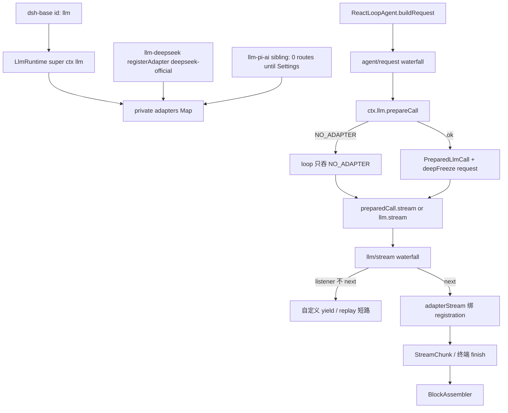

> `@deepseek-ai/dsh-llm` 是 **host 面** LLM 缝的 Definition：`ctx.llm` 的实现是 `LlmRuntime`，负责 adapter 注册表、把 `LlmCallConfig` 冻成一次性 `PreparedLlmCall`、以及可拦截的 `llm/stream` waterfall。它没有 plugin `Config`，也不发 HTTP。

DSH 是 Cordis 组合运行时（`profile → bundle → agent preset`），不是「又一个 coding agent」。capability seam 是 Definition / Provider / Consumer。本服务坐在 **host 面**（进程级，和 `sessions` / `agents` / `settings` 同一层），不进 agent-preset 的 tools / persona / isolate 树。默认产品路径是 `dsh web`（本地 Web GUI）；本仓没有 shipped TUI 包。进入模型请求的 `provider` / `model` / `messages` 必须能从 session log 重建（`model-visible ⟺ logged`）。

route 不是服务字段。仓库里**没有** `ctx.llm.route`。route = `registerAdapter(providers, adapter)` 写进私有 `adapters` map 的 **provider 字符串键**；调用方用 `GenerateOptions.provider` 选中它。shipped 默认对话路由是 `deepseek-official`（`agent-default-model` 的 composition `provider` + `llm-deepseek` 始终 `registerAdapter(['deepseek-official'], …)`）。`llm-pi-ai` 是兄弟页：base 始终加载，但零 adapter route，直到 Settings 写出 profile。

## 能回答的问题

- `ctx.llm` 是什么类型？yml 行有没有 plugin `Config`？仓库里有没有 `ctx.llm.route`？
- `registerAdapter([])` 和活 registration 上的 `replace([])` 差在哪？dormant 是不是 dispose？
- `prepareCall` 冻什么、绑哪一次 registration？缺 provider 的 `NO_ADAPTER` 谁吞、未 prepare 的 `stream` 还会不会失败？
- `llm/stream` waterfall 谁必须 `next()`？不调用会怎样？shipped retry 是否挂在这条缝上？
- `dsh-base` 的 `id: llm` 在 host 还是 preset？shipped preset 会不会再挂一次？
- HTTP / credentials / settings 文档 / retry **执行** / token 计量 / 默认模型选择分别交给哪个节点？

## 职责边界

本包 `@deepseek-ai/dsh-llm` 拥有： [E: packages/llm/llm/package.json:2]

- 服务键 `ctx.llm`（类 `LlmRuntime`，`super(ctx, 'llm')`）。 [E: packages/llm/llm/src/index.ts:48] [E: packages/llm/llm/src/index.ts:293]
- 抽象 `LlmAdapter` 与 `registerAdapter` / `AdapterRegistrationHandle.replace`。 [E: packages/llm/llm/src/index.ts:180] [E: packages/llm/llm/src/index.ts:338]
- 私有 `adapters` map（route = provider 字符串）以及并列的 configurable-provider `directory`、按 settings ns 的 `discoveries`。 [E: packages/llm/llm/src/index.ts:285]
- `prepareCall` / `stream` / 事件 `llm/stream`（waterfall）与 `llm/adapters-updated`（emit）。 [E: packages/llm/llm/src/index.ts:64] [E: packages/llm/llm/src/types.ts:23] [E: packages/llm/llm/src/index.ts:779]
- `LlmCallConfig`、`deepFreeze`、`markAgentLoopRequest`。 [E: packages/llm/llm/src/call-config.ts:23]
- 增量装配器 `BlockAssembler`。 [E: packages/llm/llm/src/assembler.ts:36]
- provider-neutral 失败类型 `LlmError` / `LlmFailure`，以及 adapter 抛错到终端 `finish` chunk 的 `normalizeLlmFailure`。 [E: packages/llm/llm/src/adapter-failure.ts:16]
- retry **policy 的 schema 与默认值**（`resolveRetryPolicy(undefined)` → `normal` / `maxRetries: 2`）。 [E: packages/llm/llm/src/retry-policy.ts:14] [E: packages/llm/llm/src/retry-policy.ts:151]

本包 **不** 拥有：

- HTTP、endpoint、API key、`MISSING_CREDENTIAL` 的请求时解析 — [`subsys.llm.deepseek`](./deepseek.md) / [`subsys.llm.pi-ai`](./pi-ai.md)。
- settings 文档（`$DSH_HOME/settings.yaml`）与 credentials 落盘。
- retry **执行**。shipped `dsh-llm-retry` 的 `inject = ['agents']`，挂 `agent/request-error`，不是 `llm/stream`。 [E: packages/llm/llm-retry/src/index.ts:21] [E: packages/llm/llm-retry/src/index.ts:210]
- token 计量 — [`subsys.llm.token-meter`](./token-meter.md)。
- 默认模型选择（新 Agent 的 `provider` / `model` 种子）— [`subsys.core.agent-default-model`](../core/agent-default-model.md)。
- turn / step / `deriveMessages()` — [`subsys.core.agent-loop`](../core/agent-loop.md) / [`spine.turn-and-step`](../../spine/turn-and-step.md)。
- `llm-pi-ai` 的 dormant catalog 与 Settings 激活（兄弟页 [`subsys.llm.pi-ai`](./pi-ai.md)）。不要把它写成默认路由。

本包没有 plugin `Config`：`LlmRuntime` 构造函数只收 `Context`，base 行也没有 `config:` 键。 [E: packages/llm/llm/src/index.ts:292] [E: packages/bundle/base/cordis.patch.yml:24] [E: packages/bundle/base/cordis.patch.yml:25]

## 关键文件

| 路径 | 角色 |
|---|---|
| `packages/llm/llm/src/index.ts` | `LlmRuntime`、`LlmAdapter`、`registerAdapter`、`prepareCall`、`llm/stream` |
| `packages/llm/llm/src/types.ts` | `GenerateOptions.provider`、`StreamChunk`、`LlmConfigurableProvider`、`llm/adapters-updated` |
| `packages/llm/llm/src/call-config.ts` | `LlmCallConfig`、`callConfigEquals`、`deepFreeze`、`markAgentLoopRequest` |
| `packages/llm/llm/src/retry-policy.ts` | `resolveRetryPolicy` 与 adapter 省略时的默认 `normal` 策略 |
| `packages/llm/llm/src/assembler.ts` | `BlockAssembler`：chunk → assistant `Message` |
| `packages/llm/llm/src/adapter-failure.ts` | adapter 抛错 → 终端 `LlmFailure` |
| `packages/llm/llm/src/error.ts` | `HarnessError`、`EMPTY_RESPONSE` / `INVALID_CREDENTIAL` 等稳定 code |
| `packages/llm/llm/src/message.ts` | 不可变 `Message` / `freezeMessage`；`replayState` 归属 |
| `packages/llm/llm/tests/service.spec.ts` | 路由、waterfall、`prepareCall` 一次性、`replace([])` |
| `packages/llm/llm/tests/topology.spec.ts` | `llm/adapters-updated`、directory、`replace([])` |
| `packages/core/agent-loop/src/agent.ts` | 谁 `prepareCall`、谁 `stream`、谁吞 `NO_ADAPTER` |
| `packages/bundle/base/cordis.patch.yml` | host 行 `id: llm`；默认对话 `provider: deepseek-official` |
| `vendor/cordis/src/events.ts` | waterfall 必须 `next()` 才会 `shift` |

## 数据模型

四个名字不要混：yml `id: llm`、包 `@deepseek-ai/dsh-llm`、ctx 键 `llm`、类 `LlmRuntime`。

| 符号 | 关键字段 | 含义 |
|---|---|---|
| `adapters`（私有 `Map`） | key = provider 字符串 | **活** route。`listProviders()` 读它。没有 `ctx.llm.route`。 |
| `directory` | `provider` / `displayName` / `settingsNs` / `settingsPath` | 可配置 provider 目录；dormant 时仍可非空。不是路由白名单。 |
| `discoveries` | key = settings ns | Models 页草稿探测；不读不写 settings / credentials。 |
| `LlmCallConfig` | `provider`, `model`, `reasoningEffort?`, `temperature?`, `maxTokens?`, `stop?` | 与 `GenerateOptions` 同名字段 1:1；loop 记进 `request/header`。 |
| `GenerateOptions.provider` | 字符串 | 选中 `adapters` 的键。 [E: packages/llm/llm/src/types.ts:322] |
| `PreparedLlmCall` | `config`, `retryPolicy`, `adapterDefaults`, `context?`, `stream()` | 冻住的一次性句柄，绑 **prepare 当时** 的 `AdapterRegistration`。 |
| `AdapterRegistrationHandle` | `()` dispose；`replace(providers)` | `replace([])` 合法（零 route 的活 registration）。 |
| `ResolvedRetryPolicy` | `mode: 'normal' \| 'always'` | 注册时捕获；执行权在 [`subsys.llm.retry`](./retry.md)。 |
| `StreamChunk` | `block-*` / `*-delta` / `usage` / `finish` | adapter 线协议。adapter 抛错被收成 `finish.reason.kind === 'error' \| 'aborted'`。 |
| `BlockAssembler` | `push` / `blocks` / `message` / `usage` / `finish` | loop 边记 `assistant/chunk` 边装配。 |

`resolveRetryPolicy(undefined)` 给出默认：`mode: 'normal'`、`maxRetries: 2`、可重试 code `EMPTY_RESPONSE` / `RATE_LIMIT` / `SERVER` / `TIMEOUT` / `TRANSPORT`。 [E: packages/llm/llm/src/retry-policy.ts:18] [E: packages/llm/llm/src/retry-policy.ts:152]

catalog（`listModels`）是 advisory：未列出的 model id 仍可 `resolveModel` / 发请求。消费方不得把「不在 catalog」当成拒绝条件。

## 控制流

1. `dsh-base` 在 host 根 insert 挂 `id: llm`，`name: '@deepseek-ai/dsh-llm'`。该行只有 `id` / `name`，没有 `config:`，也没有 `isolate:`。web-app / headless **不**再 patch 这行。shipped `{minimal,standard,code,cordis}` 的 `agent.cordis.yml` **不**挂本包 — host 留下一份进程级注册表，preset 只决定工具 / persona / isolate。 [E: packages/bundle/base/cordis.patch.yml:24] [E: packages/bundle/base/cordis.patch.yml:25] [I]

2. Loader 实例化 `LlmRuntime@packages/llm/llm/src/index.ts`（`export default LlmRuntime`）。`constructor` 调 `super(ctx, 'llm')`，把实现 publish 到当前 isolate 表；host 根上这就是 root realm 的 `ctx.llm`。构造函数不读 plugin config。 [E: packages/llm/llm/src/index.ts:947] [E: packages/llm/llm/src/index.ts:292] [E: packages/llm/llm/src/index.ts:293]

3. `registerAdapter@packages/llm/llm/src/index.ts` 把每个 provider 字符串写进私有 `adapters`。初始 `providers.length === 0` 抛 `LlmError` code `INVALID_ADAPTER`（「an adapter must register at least one provider」）。空名、与另一 adapter 冲突、`providerInfo` 不保 id，分别是 `INVALID_ADAPTER` / `DUPLICATE_ADAPTER`；校验失败时 map 不动。 [E: packages/llm/llm/src/index.ts:338] [E: packages/llm/llm/src/index.ts:346] [E: packages/llm/llm/src/index.ts:409] [E: packages/llm/llm/tests/service.spec.ts:1199]

4. 返回的 `AdapterRegistrationHandle.replace(providers)` 先 `prepareRoutes` 再一次同步 `commitRoutes`。`replace([])` 合法：`owned` 被清空，registration 仍活着（`released === false`），settings 清空时可以零 route 而不 dispose。测试随后还能 `replace(['m2'])` 把同一 handle 唤醒。dispose 之后再 `replace` 抛 `REGISTRATION_DISPOSED`。 [E: packages/llm/llm/src/index.ts:364] [E: packages/llm/llm/tests/service.spec.ts:1241] [E: packages/llm/llm/tests/service.spec.ts:1243]

5. shipped 默认对话路由：`agent-default-model` 的 composition `provider: deepseek-official`，`llm-deepseek` 的 `PROVIDER = 'deepseek-official'`，并 `ctx.llm.registerAdapter([PROVIDER], adapter)`。 [E: packages/bundle/base/cordis.patch.yml:66] [E: packages/llm/llm-deepseek/src/index.ts:47] [E: packages/llm/llm-deepseek/src/index.ts:256] `llm-pi-ai` 零 adapter route 直到 Settings 加 profile，细节在 [`subsys.llm.pi-ai`](./pi-ai.md)。

6. `ReactLoopAgent.buildRequest@packages/core/agent-loop/src/agent.ts` 先用 `this.options.provider/model` 组成**局部变量** `route`（这不是 `ctx.llm.route`），跑 `agent/request` waterfall 得到 `proposedConfig`，再 `await this.loopCtx.llm.prepareCall(proposedConfig, signal)`。`prepareCall` 按 `config.provider` 查 `adapters`，缺键立刻抛 `NO_ADAPTER`；命中则 `resolveCallFor` 物化 adapter 默认（`maxTokens` / `reasoningEffort`），`deepFreeze(structuredClone(…))` 冻住 `config` / `context` / `adapterDefaults`，并把 **当时那条** `AdapterRegistration` 关进一次性 `stream()`。 [E: packages/core/agent-loop/src/agent.ts:421] [E: packages/core/agent-loop/src/agent.ts:449] [E: packages/llm/llm/src/index.ts:779] [E: packages/llm/llm/src/index.ts:782] [E: packages/llm/llm/src/index.ts:818]

7. loop **只吞** `LlmError` 且 `code === 'NO_ADAPTER'`：注释写明 middleware 可能替未注册 route 短路；`preparedCall` 留空，header 仍按 `proposedConfig` 落盘。其它 prepare 失败原样抛出。未 prepare 的 dispatch 走 `this.loopCtx.llm.stream(request)`，`adapterStream` 里会再查一次 map，仍然变成终端 `finish` `NO_ADAPTER`，不会偷偷打到别的 adapter。 [E: packages/core/agent-loop/src/agent.ts:453] [E: packages/core/agent-loop/src/agent.ts:345] [E: packages/core/agent-loop/tests/request-reconstruction.spec.ts:381] [E: packages/llm/llm/tests/service.spec.ts:274]

8. header / context 记完之后，loop `markAgentLoopRequest(deepFreeze({ …header.config, messages: boundaryMessages, … }))`。`messages` 来自 `session.deriveMessages()`，`agent/request` 改不了对话内容。 [E: packages/core/agent-loop/src/agent.ts:486] [E: packages/llm/llm/src/call-config.ts:66]

9. `ReactLoopAgent.step` 调 `preparedCall?.stream(request) ?? this.loopCtx.llm.stream(request)`。两条入口都进 `streamWithRegistration` → `ctx.waterfall(this, 'llm/stream', options, () => this.adapterStream(…))`。`PreparedLlmCall.stream` 校验 `callConfigEquals(options, resolvedConfig)`，第二次调用或字段漂移抛 `INVALID_PREPARED_CALL`。 [E: packages/core/agent-loop/src/agent.ts:345] [E: packages/llm/llm/src/index.ts:923] [E: packages/llm/llm/src/index.ts:802]

10. **waterfall 必须 `next()`。** `Events.waterfall@vendor/cordis/src/events.ts` 把最后一个参数当 innermost `next`：listener 不调用传入的 `next()` 就不会 `cbs.shift()`，内层 listener 和 `adapterStream` 全部停住。checkpoint 挂 `llm/stream`：有活 session 时 `flush` 再 `yield* next()`；replay 在未声明 fake adapter 时 `ctx.on('llm/stream', (options, _next) => replay(options))`，故意不 `next()`，用自己的 chunk 短路。手写（未 freeze）的 `options` 允许 listener 改 `provider` 再 `next()`；loop 造的请求是 frozen，mutation 会抛，路由必须发生在 `agent/request` / `prepareCall`。 [E: vendor/cordis/src/events.ts:238] [E: vendor/cordis/src/events.ts:239] [E: packages/session/session-checkpoint-policy/src/index.ts:64] [E: packages/session/session-checkpoint-policy/src/index.ts:35] [E: packages/test-support/llm-replay/src/index.ts:751] [E: packages/core/agent-loop/src/invariant.ts:23]

11. `adapterStream@packages/llm/llm/src/index.ts` 若带 `prepared`，用那份 registration + 已冻 config，不再按「此刻 map 里是谁」重绑 — HMR / `replace` 换掉同名 route 之后，已经 prepare 的那一枪仍打旧 adapter。无 `prepared` 时才 `this.registration(options.provider)`。`forAdapter` 只在「历史 `source.provider` 与目标 route 属于同一 adapter **实例**」时保留 `replayState`。 [E: packages/llm/llm/src/index.ts:849] [E: packages/llm/llm/src/index.ts:823]

12. adapter 选择、iterator 构造、iteration 失败都变成终端 `finish` chunk（`normalizeLlmFailure`）；`signal.aborted` 或 code `ABORTED` 标 `kind: 'aborted'`，否则 `kind: 'error'`。middleware / consumer / cleanup（`iterator.return`）失败保持抛出，不改写成 chunk。 [E: packages/llm/llm/src/adapter-failure.ts:16] [E: packages/llm/llm/src/index.ts:931]

13. loop `new BlockAssembler()`，每个 chunk `session.append('assistant/chunk', …)` 再 `assembler.push`；流结束后 `createAssistantMessage` 用 `assembler.blocks()`。`finish.kind === 'max-tokens'` 时 assembler 丢掉未完成的 `tool-call`，且 loop **不执行**工具。 [E: packages/core/agent-loop/src/agent.ts:343] [E: packages/llm/llm/src/assembler.ts:47] [E: packages/core/agent-loop/src/agent.ts:391]

14. **isolate。** 本行不进 isolate realm，yml 无 `isolate:`。需要进程级一份注册表，就留在 host；不要为了「每会话一份 llm」去 preset remount。`directory` 的 `replace([])` 与 adapter 的 `replace([])` 对称：初始空注册抛错，活 handle 允许空集。 [E: packages/llm/llm/src/index.ts:464] [E: packages/llm/llm/tests/topology.spec.ts:192]

## 设计动机

- **route 是 map 键，不是服务属性。** 多家 adapter 共存靠互斥的 provider 字符串（`deepseek-official` 与 pi-ai catalog 名 `deepseek` 刻意不同名）。给 `ctx.llm` 再加一个 `.route` 字段会让「当前路由」看起来像单例，和 `registerAdapter` 的多键模型冲突。
- **`prepareCall` 把 capability 查询和 dispatch 钉在同一次 registration。** settings / HMR 可以 `replace` 同名 route；如果 resolve 用 A、stream 用 B，就会把一家的 `defaultMaxTokens` / `reasoningEffort` 送给另一家。一次性 handle 切断这条缝。
- **`llm/stream` 是拦截缝，不是 retry 引擎。** JSDoc 把 retry / replay / routing 都写在这条 waterfall 上；自定义 yield 与 replay 确实挂在这里。shipped retry 却走 `agent/request-error`，因为次数、backoff、`llm/retry` 事件属于 **session 可重建** 的 loop 恢复，不是 adapter I/O 包装。
- **`replace([])` ≠ dispose。** Settings 清空某一段时，插件必须保持活 registration（否则没有 owner 再 `replace` 回来）。`released` 旗标专门区分「零 route 的活 handle」和「effect 已卸」。
- **adapter 失败收成 chunk，plugin 失败继续抛。** 消费方（loop）把终端 `error`/`aborted` 送进 `agent/request-error`；监听者自己炸了不该被假装成模型失败。
- **catalog 不作白名单。** 发现面给 Models 页列选项；请求路由只认 `adapters` 键 + adapter 自己的 `stream`。

## Gotcha

- **没有 `ctx.llm.route`。** grep 整仓为零。loop 里的 `const route = { provider, model }` 是 `buildRequest` 局部对象。 [E: packages/core/agent-loop/src/agent.ts:421]
- **初始 `registerAdapter([])` 抛 `INVALID_ADAPTER`；`replace([])` 合法。** 把「空」写成 dispose 会让 Settings 清空再也注册不回来。 [E: packages/llm/llm/tests/service.spec.ts:1199] [E: packages/llm/llm/tests/service.spec.ts:1241]
- **loop 吞掉 `NO_ADAPTER` 只为让 `llm/stream` middleware 短路。** header 仍会按未注册的 `proposedConfig` 落盘；若没有人 yield 自己的 chunk，后续 `llm.stream` 仍以 `NO_ADAPTER` finish 失败。 [E: packages/core/agent-loop/src/agent.ts:453]
- **`PreparedLlmCall.stream` 只能派一次。** 复用或改 `model` / `provider` / sampling 字段 → `INVALID_PREPARED_CALL`。 [E: packages/llm/llm/src/index.ts:802]
- **loop 请求 frozen。** `llm/stream` listener 改 `options.provider` 只对未冻的手写调用有效；loop 路径要改路由，走 `agent/request`，并且必须 `next()`。 [E: packages/core/agent-loop/src/invariant.ts:23] [E: vendor/cordis/src/events.ts:239]
- **shipped retry 不在 `llm/stream` 上。** 在 `agent/request-error` 上读 `preparedCall.retryPolicy`。本页只提供 policy 默认值。 [E: packages/llm/llm-retry/src/index.ts:210]
- **`llm-pi-ai` 不是默认路由。** 默认对话是 `deepseek-official`。pi-ai 的 dormant / directory 非空写在 [`subsys.llm.pi-ai`](./pi-ai.md)。
- **directory 非空 ≠ 有 route。** `listConfigurableProviders()` 可以列出尚未 `registerAdapter` 的项；`prepareCall` 仍然 `NO_ADAPTER`。
- **`replayState` 跨 adapter 实例会被剥掉。** 同一实例兼有历史 provider 与目标 provider 才交给 `adapter.stream`。 [E: packages/llm/llm/src/index.ts:828]
- **preset 再挂 `@deepseek-ai/dsh-llm` 且不 isolate** 会撞 host 已 publish 的 `ctx.llm`。本行必须留在 host。
- **不要把 `id: llm` 写成带 Config 的可调插件。** 调 key / endpoint / retry 次数分别在 adapter 行、credentials、`retryPolicy`（各 provider）和 `dsh-llm-retry`。

## Seam 三角

| 角色 | 包 / 符号 | ctx 键 | bundle / preset 行 |
|---|---|---|---|
| Definition | `@deepseek-ai/dsh-llm` 的 `LlmRuntime`、`LlmAdapter`、`Context.llm`、`Events['llm/stream']` | `llm` | 无（类型与服务名在包内 `declare module`）；**无** plugin `Config` |
| Provider（缝本身） | 同包 `export default LlmRuntime` | `llm` | **host** `dsh-base`：`id: llm`（无 `config`、无 `isolate`）。**无** preset 行 |
| Provider（route） | `dsh-llm-deepseek` 始终 `registerAdapter(['deepseek-official'], …)`；`dsh-llm-pi-ai` 见兄弟页（零 route 直到 Settings） | `llm.registerAdapter` 写入的 provider 键 | host `id: llm-deepseek`、`id: llm-pi-ai`。默认对话键 `deepseek-official` |
| Consumer | `ReactLoopAgent.buildRequest` / `step`（`prepareCall` + `stream`）；`session-checkpoint-policy` 的 `llm/stream`；`dsh-llm-retry` 读 `retryPolicy`（挂在 `agent/request-error`）；replay 可短路 `llm/stream` | `llm`；loop 另用 `agents` | host `id: agent-loop`、`id: session-checkpoint-policy`、`id: llm-retry`。preset **不**消费此服务 |

换掉 `id: llm` 的插件等于换整张注册表与 waterfall。换掉 `id: llm-deepseek` 只换默认 route 的 HTTP / catalog，不换 `ctx.llm` 本身。

## Sources

- packages/llm/llm/src/index.ts
- packages/llm/llm/src/assembler.ts
- packages/llm/llm/src/adapter-failure.ts
- packages/llm/llm/src/types.ts
- packages/llm/llm/src/call-config.ts
- packages/llm/llm/src/retry-policy.ts
- packages/llm/llm/src/error.ts
- packages/llm/llm/src/message.ts
- packages/llm/llm/tests/service.spec.ts
- packages/llm/llm/tests/topology.spec.ts
- packages/llm/llm/package.json
- packages/core/agent-loop/src/agent.ts
- packages/core/agent-loop/src/invariant.ts
- packages/core/agent-loop/tests/request-reconstruction.spec.ts
- packages/bundle/base/cordis.patch.yml
- packages/llm/llm-deepseek/src/index.ts
- packages/llm/llm-retry/src/index.ts
- packages/session/session-checkpoint-policy/src/index.ts
- packages/test-support/llm-replay/src/index.ts
- vendor/cordis/src/events.ts

## 相关

- [`spine.overview`](../../spine/overview.md) — Cordis 组合主线、host 面 vs agent-preset 面、`model-visible ⟺ logged`。
- [`spine.turn-and-step`](../../spine/turn-and-step.md) — `agent/request` → `prepareCall` → `llm.stream` → `BlockAssembler`。
- [`subsys.llm.deepseek`](./deepseek.md) — 默认对话路由 `deepseek-official` 的 adapter。
- [`subsys.llm.pi-ai`](./pi-ai.md) — 始终加载、零 adapter route 直到 Settings；directory 在 dormant 时仍可非空。
- [`subsys.llm.retry`](./retry.md) — `agent/request-error` 上执行 `retryPolicy`，不是 adapter。
- [`subsys.core.agent-loop`](../core/agent-loop.md) — 谁 `prepareCall` / `stream`，谁吞 `NO_ADAPTER`。
- [`surface.providers.deepseek`](../../surface/providers/deepseek.md) — 模型可见路由名 `deepseek-official`。
- [`subsys.llm.token-meter`](./token-meter.md) — host 面计量，不在请求路径上。
- [`subsys.core.agent-default-model`](../core/agent-default-model.md) — 新 Agent 的默认 `provider: deepseek-official`。
- [`subsys.composition.bundle-base`](../composition/bundle-base.md) — host insert 含 `id: llm`；preset 不挂本包。
