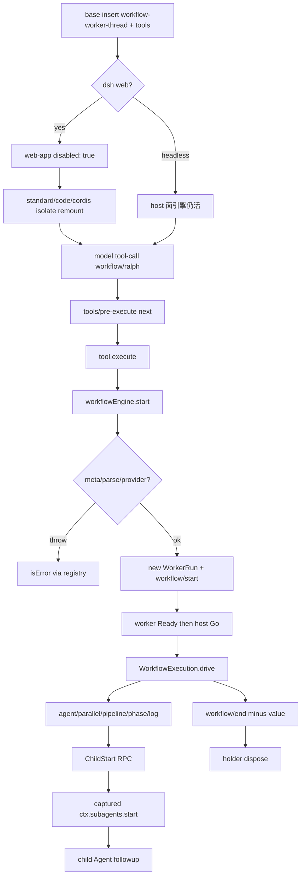

> `ctx.workflowEngine` 是 **host / preset 两面共用的 workflow 能力缝**：Definition 包 `@deepseek-ai/dsh-workflow` 只声明服务与 `workflow/*` emit 事件，**不是** composition 行；shipped Provider 是 `@deepseek-ai/dsh-workflow-worker-thread`（`WorkerThreadWorkflowEngine`）；Consumer 是 `dsh-tool-workflow` / `dsh-tool-ralph`。脚本在 worker-thread 的 vm 里跑，`agent()` 经 `ctx.subagents.start` 拉子代理。这是 Cordis 组合运行时（`profile → bundle → agent preset`）上的编排缝，不是又一个 coding agent。

## 能回答的问题

- `dsh-workflow`、`dsh-workflow-worker-thread`、`tool-workflow` / `tool-ralph` 各是 Definition / Provider / Consumer 的哪一角？哪一个**没有** bundle 行？
- `dsh web` 上引擎为什么必须进 `isolate: { workflowEngine: true }`？漏 isolate 时 `leakedServices` 怎样拒 `mountPreset`？
- 模型调 `workflow` 之后，谁 `start()`、谁 spawn Worker、谁 `ctx.subagents.start`？`result` 会不会 reject？
- `workflow/*` 是 emit 还是 waterfall？父工具管线的 `tools/pre-execute` 不 `next()` 会停在哪？
- worker-thread 为什么是 containment 而不是 security boundary？脚本里的 `effort` / `isolation` / `agentType` 会怎样？

## 职责边界

本页拥有：**workflow 缝本身**（`ctx.workflowEngine` / `WorkflowEngine.start` / holder-owned `WorkflowRun` / `workflow/*` emit）、**shipped worker-thread Provider**（host 预解析、Worker 协议、vm hooks、caps、`agent()` → `ctx.subagents.start`）、以及 **Consumer 怎样挂上这缝**（`tool-workflow` / `tool-ralph` 的 `inject` 与 `start()` 调用；不写模型可见字段表）。

本页**不**拥有：

- 模型看见的 `workflow` / `ralph` JSON schema、卡片、截断文案 —— [surface.tools.workflow](../../surface/tools/workflow.md) / [surface.tools.ralph](../../surface/tools/ralph.md)
- `ctx.subagents` 注册表、`registerProvider`、spawn/fork 后端 —— [subsys.orchestration.subagent](subagent.md)
- preset standing mount / `leakedServices` 扫描本身 —— [subsys.composition.agent-presets](../composition/agent-presets.md)
- `dsh-base` 整条 insert 表 —— [subsys.composition.bundle-base](../composition/bundle-base.md)
- 父 turn 的 `tools/pre-execute → execute → post-execute` 全管线 —— [spine.tool-call-anatomy](../../spine/tool-call-anatomy.md)
- client 的 `ui-workflow-run` 卡片（观察 `tool-workflow/*` 记录，不执行脚本）

`@deepseek-ai/dsh-workflow` **不能**当 bundle 行加载：它是抽象 `Service`（`export abstract class WorkflowEngine`），没有 `apply` 插件入口。[E: packages/workflow/workflow/src/index.ts:157] base manifest 依赖 `dsh-tool-ralph` / `dsh-tool-workflow` / `dsh-workflow-worker-thread`，**没有** `@deepseek-ai/dsh-workflow` 这一行。[E: packages/bundle/base/package.json:100] [E: packages/bundle/base/package.json:109] [E: packages/bundle/base/package.json:117]

`dsh-base` **不**装 Codex / Claude 子代理包。workflow 的默认 child 路由是 Config `provider: 'spawn'`，走 host 面已经登记的 `ctx.subagents`；那两家后端不在本缝、也不在 base 行表。

## 关键文件

| 路径 | 角色 |
|---|---|
| `packages/workflow/workflow/src/index.ts` | Definition：`ctx.workflowEngine`、`WorkflowEngine`、`WorkflowError`、`emitWorkflowEvent` |
| `packages/workflow/workflow/src/runtime-types.ts` | `WorkflowStartRequest` / `WorkflowRun`（host-only；含 `parent: Agent`） |
| `packages/workflow/workflow/src/types.ts` | `WorkflowMeta` / `WorkflowResult` / `workflow/*` 事件载荷 |
| `packages/workflow/workflow-worker-thread/src/index.ts` | Provider：`WorkerThreadWorkflowEngine.start`、host 预解析、捕获 `ctx.subagents` |
| `packages/workflow/workflow-worker-thread/src/host.ts` | `WorkerRun`：Worker、child registry、cancel/dispose grace |
| `packages/workflow/workflow-worker-thread/src/session.ts` | worker 半边：`Ready`/`Go` 门闩、`drive()`、child RPC |
| `packages/workflow/workflow-worker-thread/src/runtime.ts` | vm hooks：`agent` / `parallel` / `pipeline` / `phase` / `log`；拒绝 `effort` |
| `packages/workflow/workflow-worker-thread/src/meta.ts` | `validateMeta`：meta 是 JSON 数据，不是脚本 |
| `packages/workflow/workflow-worker-thread/src/protocol.ts` | host⇄worker 闭集消息标签 |
| `packages/workflow/tool-workflow/src/index.ts` | Consumer：`inject = ['tools', 'workflowEngine', 'systemPrompt']`，调 `start()` |
| `packages/core/session/src/surface.ts` | `SURFACE_EVENT_TYPES`：`tool-workflow/*` 不进 `deriveMessages()` |
| `packages/workflow/tool-ralph/src/index.ts` | Consumer：固定脚本 + `subagentProvider`，同样 `start()` |
| `packages/bundle/base/cordis.patch.yml` | host 插入引擎 + 两个 tool |
| `packages/bundle/web-app/cordis.patch.yml` | 三行 `disabled: true`，留给 preset remount |
| `apps/cli/config/agent-presets/standard/agent.cordis.yml` | `delegation` 组 `isolate: { workflowEngine: true }` |

## 数据模型

| 符号 | 位置 | 要点 |
|---|---|---|
| `WorkflowEngine` | `workflow/src/index.ts` | `Service` 名 `'workflowEngine'`；唯一抽象方法 `start(request): WorkflowRun`。[E: packages/workflow/workflow/src/index.ts:159] [E: packages/workflow/workflow/src/index.ts:168] |
| `WorkflowStartRequest` | `runtime-types.ts` | `script` + `meta` + 可选 `args` / `subagentProvider` / `maxTotalAgents` + 必填 `parent` + 可选 `signal` |
| `WorkflowRun` | `runtime-types.ts` | `id` / `meta` / `result`（**永不 reject**）/ `cancel` / `dispose` |
| `WorkflowMeta` | `types.ts` | 必填 `name`/`description`；可选 `whenToUse`/`phases`。未知字段 → `META_INVALID` |
| `WorkflowResult` | `types.ts` | `value` + `stopReason: 'completed' \| 'cancelled' \| 'error'` + 可选 `error` + `agentsStarted` |
| `WorkflowResultInfo` | `types.ts` | `workflow/end` 载荷 = 结果减去 `value`（监听者拿不到返回值） |
| `WorkflowError` | `index.ts` | 默认 `fatal: true`；combinator 只把非 fatal / 普通 throw 收成 per-item `null` |
| `WorkerLimits` | worker-thread `types.ts` | `maxConcurrentAgents` / `maxTotalAgents` / `maxItemsPerCall` / `syncTimeoutMs` |
| `Config`（Provider） | `WorkerThreadWorkflowEngine` | `provider` 默认 `'spawn'`；`maxConcurrentAgents` 默认 `0`，`start()` 里解析成 `min(16, max(1, cores-2))`。[E: packages/workflow/workflow-worker-thread/src/index.ts:116] [E: packages/workflow/workflow-worker-thread/src/index.ts:117] [E: packages/workflow/workflow-worker-thread/src/index.ts:151] [E: packages/workflow/workflow-worker-thread/src/index.ts:152] |

`workflow/*` 事件名是闭集 `workflow/start`、`workflow/phase`、`workflow/log`、`workflow/agent-start`、`workflow/agent-end`、`workflow/end`。[E: packages/workflow/workflow/src/index.ts:95] [E: packages/workflow/workflow/src/index.ts:96] [E: packages/workflow/workflow/src/index.ts:97] [E: packages/workflow/workflow/src/index.ts:98] [E: packages/workflow/workflow/src/index.ts:99] [E: packages/workflow/workflow/src/index.ts:100] 分发走 `emitWorkflowEvent` → `dispatch('emit', …)`，不是 waterfall。[E: packages/workflow/workflow/src/index.ts:176]

Consumer 另写父 session 记录：`SessionEventMap` 声明 `tool-workflow/run-start` / `agent-start` / `agent-end` / `run-end`。[E: packages/workflow/tool-workflow/src/types.ts:47] [E: packages/workflow/tool-workflow/src/types.ts:52] [E: packages/workflow/tool-workflow/src/types.ts:57] [E: packages/workflow/tool-workflow/src/types.ts:62] Consumer 用两参数 `session.append` 写入父 log，不传 `surfaceOp`。[E: packages/workflow/tool-workflow/src/index.ts:87] `SURFACE_EVENT_TYPES` 只有 `user/message` / `assistant/message` / `tool/result`；非此三类不能带 `surfaceOp`，`deriveEventMessage` 走 `default` 返回 `null`，不进 `deriveMessages()`。[E: packages/core/session/src/surface.ts:16] [E: packages/core/session/src/surface.ts:17] [E: packages/core/session/src/surface.ts:18] [E: packages/core/session/src/surface.ts:189] [E: packages/core/session/src/surface.ts:112]

## 控制流

1. **Definition 只挂键，不进树。** `WorkflowEngine` 构造函数 `super(ctx, 'workflowEngine')`，把实现 publish 到 `ctx.workflowEngine`。[E: packages/workflow/workflow/src/index.ts:159] 测试：`ctx.plugin` 子类后 `ctx.get('workflowEngine')` 有实例，fiber `dispose` 后变 `undefined`。[E: packages/workflow/workflow/tests/workflow.spec.ts:49] [E: packages/workflow/workflow/tests/workflow.spec.ts:51] `@deepseek-ai/dsh-workflow` 没有任何 `cordis.patch.yml` / `agent.cordis.yml` 行。

2. **Provider 才是 composition 行。** `WorkerThreadWorkflowEngine` `static inject = ['subagents']`，默认 export 就是这个类。[E: packages/workflow/workflow-worker-thread/src/index.ts:113] [E: packages/workflow/workflow-worker-thread/src/index.ts:205] `dsh-base` insert `id: workflow-worker-thread`，`name: '@deepseek-ai/dsh-workflow-worker-thread'`，`config.provider: spawn`；同组再 insert `tool-workflow` 与 `tool-ralph`。[E: packages/bundle/base/cordis.patch.yml:335] [E: packages/bundle/base/cordis.patch.yml:336] [E: packages/bundle/base/cordis.patch.yml:338] [E: packages/bundle/base/cordis.patch.yml:340] [E: packages/bundle/base/cordis.patch.yml:378]

3. **Web 把引擎与 Consumer 从进程根挪到 preset。** `dsh-web-app` 对 `workflow-worker-thread` / `tool-workflow` / `tool-ralph` 写 `disabled: true`。[E: packages/bundle/web-app/cordis.patch.yml:392] [E: packages/bundle/web-app/cordis.patch.yml:393] [E: packages/bundle/web-app/cordis.patch.yml:395] [E: packages/bundle/web-app/cordis.patch.yml:396] [E: packages/bundle/web-app/cordis.patch.yml:398] [E: packages/bundle/web-app/cordis.patch.yml:399] host 面的 `ctx.subagents` **留下**（跨会话查询、provider 名全局唯一）。`dsh-headless` 只额外 insert `code-runtime` / `headless-startup` / `headless-runner`，不 disable 这三行，也不挂 `agent-presets`：headless 上引擎与工具留在 **host 全局层**。[E: packages/bundle/headless/cordis.patch.yml:24] [E: packages/bundle/headless/cordis.patch.yml:27] [E: packages/bundle/headless/cordis.patch.yml:31]

4. **standard / code / cordis 在 `delegation` 组 isolate remount。** 组是 `cordis:group`，`isolate.workflowEngine: true`，组内再挂 `workflow-worker-thread` + `tool-workflow` + `tool-ralph`。[E: apps/cli/config/agent-presets/standard/agent.cordis.yml:174] [E: apps/cli/config/agent-presets/standard/agent.cordis.yml:178] [E: apps/cli/config/agent-presets/standard/agent.cordis.yml:221] [E: apps/cli/config/agent-presets/code/agent.cordis.yml:179] [E: apps/cli/config/agent-presets/cordis/agent.cordis.yml:166] Loader 见 `isolate?.[name] === true` 时建 `LocalRealm`，服务存到 realm-private symbol，而不是 root。[E: vendor/loader/src/config/isolate.ts:81] [E: vendor/loader/src/config/isolate.ts:82] `mountPreset` settle 后跑 `leakedServices`：子树若把实现 publish 进 `ctx.root[Context.isolate][name]`，抛「must sit behind an `isolate` realm or move to the host composition」。[E: packages/preset/agent-presets/src/mount.ts:189] [E: packages/preset/agent-presets/src/mount.ts:365] shipped `minimal` **没有**这三行；web 上 host 行又已 disable，minimal 会话看不到 `workflow` / `ralph`。[I]

5. **父工具进入必须走 waterfall。** 模型发出 wire 名 `workflow`（或 `ralph`）的 tool-call 后，`ToolRuntime` 先 `ctx.waterfall(..., 'tools/pre-execute', exec, () => allow)`。[E: packages/core/tools/src/index.ts:1476] [E: packages/core/tools/src/index.ts:1477] Cordis `Events.waterfall` 把最后一个参数当 innermost `next`；监听器不调用传入的 `next()`，就不会 `shift` 到下一层，内建 `allow` 与后续 `tools/execute` 都到不了。[E: vendor/cordis/src/events.ts:234] [E: vendor/cordis/src/events.ts:237] [E: vendor/cordis/src/events.ts:242] body 外包在 `tools/execute` waterfall 里。[E: packages/core/tools/src/index.ts:1574] 收尾再 `tools/post-execute`，默认 `next` 是 `{ kind: 'accept' }`。[E: packages/core/tools/src/index.ts:1744] [E: packages/core/tools/src/index.ts:1745] 本缝**没有**「故意不 next 的 reject」；要拦一次 `workflow` 调用，监听器必须自己 `return` 一个非 `allow` 的 decision，而不是默默吞掉 `next`。

6. **Consumer 调缝，不自己跑脚本。** `tool-workflow` `inject = ['tools', 'workflowEngine', 'systemPrompt']`。[E: packages/workflow/tool-workflow/src/index.ts:30] `execute` 没有 `exec.agent` 就抛；否则 `ctx.workflowEngine.start({ script, meta, args?, parent, signal })`。[E: packages/workflow/tool-workflow/src/index.ts:284] `ralph` 同样 `inject` 含 `workflowEngine`，但脚本是包内常量 `RALPH_SCRIPT`，再带 `subagentProvider` / `maxTotalAgents`。[E: packages/workflow/tool-ralph/src/index.ts:20] [E: packages/workflow/tool-ralph/src/index.ts:447] 字段表留给 T1。

7. **`start()` 同步门：过不了就不发 `workflow/start`。** `WorkerThreadWorkflowEngine.start` 依次 `validateMeta`、`assertBodyParses`、解析 `subagentProvider`、解析 `maxTotalAgents`，再 mint `WorkflowRunId`。[E: packages/workflow/workflow-worker-thread/src/index.ts:144] [E: packages/workflow/workflow-worker-thread/src/index.ts:145] [E: packages/workflow/workflow-worker-thread/src/index.ts:146] [E: packages/workflow/workflow-worker-thread/src/index.ts:147] meta 未知字段 / 空 `name` → `META_INVALID`。[E: packages/workflow/workflow-worker-thread/src/meta.ts:21] [E: packages/workflow/workflow-worker-thread/src/meta.ts:23] [E: packages/workflow/workflow-worker-thread/src/meta.ts:78] body 以 `export const meta` 开头 → `SCRIPT_PARSE`。[E: packages/workflow/workflow-worker-thread/src/index.ts:66] `vm.Script` 包一层 `(async () => { … })()` 失败同样 → `SCRIPT_PARSE`。[E: packages/workflow/workflow-worker-thread/src/index.ts:72] 空串或未经 `trim` 的 `subagentProvider` → `INVALID_ARGUMENT`。[E: packages/workflow/workflow-worker-thread/src/index.ts:79] [E: packages/workflow/workflow-worker-thread/src/index.ts:82] provider 未登记 → `AGENT_START`。[E: packages/workflow/workflow-worker-thread/src/index.ts:85] [E: packages/workflow/workflow-worker-thread/src/index.ts:86] 这些 throw 发生在返回 `WorkflowRun` **之前**，测试钉死此时 `workflow/start` 计数仍为 0。[E: packages/workflow/workflow-worker-thread/tests/workflow-worker-thread.spec.ts:282]

8. **返回 run 之前捕获 `ctx.subagents`。** `const subagents = runCtx.subagents`，再 `new WorkerRun(..., subagents, ...)`。[E: packages/workflow/workflow-worker-thread/src/index.ts:171] [E: packages/workflow/workflow-worker-thread/src/index.ts:172] 这样引擎 fiber 被 HMR unload、`ctx.workflowEngine` 变 `undefined` 之后，已经返回给 holder 的 run 仍能 `start` 孩子。[E: packages/workflow/workflow-worker-thread/tests/workflow-worker-thread.spec.ts:1450] [E: packages/workflow/workflow-worker-thread/tests/workflow-worker-thread.spec.ts:1451] 然后 `emitWorkflowEvent('workflow/start', info)`；`result` settle 时再发 `workflow/end`，载荷只有 `stopReason` / 可选 `error` / `agentsStarted`，**没有** `value`。[E: packages/workflow/workflow-worker-thread/src/index.ts:190] [E: packages/workflow/workflow-worker-thread/tests/workflow-worker-thread.spec.ts:208]

9. **`workflow/*` 是 emit，失败被含住。** `emitWorkflowEvent` 对 `this.ctx.events.dispatch('emit', [name, ...args])` 逐个 callback 包 try/catch；同步 throw 与 rejected thenable 都 `logger.warn`，不饿死后续监听者。[E: packages/workflow/workflow/src/index.ts:176] 这里**没有** `next()` 可调用——它不是 waterfall。Invariant companion 只观察配对（start/end、agent-start/agent-end），不参与执行。

10. **Worker handshake。** `WorkerRun` 用 scrubbed `env` + `execArgv: []` spawn 线程；`workerData` 是已校验的 `WorkerInit`（structured clone，兼作 caller isolation）。[E: packages/workflow/workflow-worker-thread/src/host.ts:70] worker `runWorkerSession` 先 `post(Ready)`，等 `Go` 或 `Cancel` 才 `drive()`。[E: packages/workflow/workflow-worker-thread/src/session.ts:167] [E: packages/workflow/workflow-worker-thread/src/session.ts:170] [E: packages/workflow/workflow-worker-thread/src/session.ts:197] [E: packages/workflow/workflow-worker-thread/src/session.ts:198] [E: packages/workflow/workflow-worker-thread/src/session.ts:199] host 收到 `Ready` 回 `Go`。[E: packages/workflow/workflow-worker-thread/src/host.ts:276] 已 abort 的 start signal 在构造时直接 `cancel`，worker 侧 `Cancel` 也会放开门闩且 **不执行** body。

11. **脚本只看见五个 hook + `args`。** `WorkflowExecution` `vm.createContext` 后挂冻结的 `agent` / `parallel` / `pipeline` / `phase` / `log` 与 `args`。[E: packages/workflow/workflow-worker-thread/src/runtime.ts:98] [E: packages/workflow/workflow-worker-thread/src/runtime.ts:101] `drive()` 永不 reject：`completed` 带 materialized `value`；hook / 脚本失败 → `stopReason: 'error'`；`cancel()` 之后任何 hook 再入抛 `CANCELLED`。[E: packages/workflow/workflow-worker-thread/src/runtime.ts:162] `agent()` 选项只认 `label` / `phase` / `schema` / `provider` / `model`。[E: packages/workflow/workflow-worker-thread/src/runtime.ts:39] `effort` / `isolation` / `agentType` 落在 `DEFERRED_AGENT_OPTIONS`，抛 `UNSUPPORTED_OPTION`（fatal，会杀整个 script，不会变成 per-item `null`）。[E: packages/workflow/workflow-worker-thread/src/runtime.ts:41] [E: packages/workflow/workflow-worker-thread/src/runtime.ts:371] 测试原文就是 `agent('p', { effort: 'high' })`。[E: packages/workflow/workflow-worker-thread/tests/session.spec.ts:344]

12. **`agent()` = child RPC + host `ctx.subagents.start`。** runtime 经 `ChildPort.startAgent` 发 `ChildStart`；host `startChild` 调**捕获到的** `this.subagents.start(this.provider, { prompt, parent, signal, outputSchema?, agentOptions? })`。[E: packages/workflow/workflow-worker-thread/src/host.ts:352] 这是 one-shot `start`，不是 `startContinuable`。孩子走 host 面已经登记的 provider（默认 `spawn`：新 session、不继承父对话）。发布成功才 `workflow/agent-start`；孩子 `result` 以 JSON 投影回 worker。child 自己失败（非 `completed`）→ 脚本看到 `null`；provider `result` reject → fatal `AGENT_RESULT`。每条已 start 的 agent 在任何 stop 路径上都有恰好一次 `workflow/agent-end`（worker 报或 host 合成 `'cancelled'`）。

13. **containment，不是 security boundary。** spawn env 默认 `{}`（win32 只补 `TMP`/`TEMP`）；测试用 `globalThis.constructor.constructor('return process')()` 逃出 vm 后读不到 harness 的 `WORKFLOW_ENV_CANARY`。[E: packages/workflow/workflow-worker-thread/src/host.ts:49] [E: packages/workflow/workflow-worker-thread/tests/workflow-worker-thread.spec.ts:35] [E: packages/workflow/workflow-worker-thread/tests/workflow-worker-thread.spec.ts:585] 线程能打断同步死循环、能 `terminate`，但脚本与 `bash` 同级信任：getter / proxy 会在 `materializeFromRealm` 里跑，vm **不**防敌意值。

14. **settle 与 dispose。** worker 发一条 `Result`；host `onResult` first-wins。`cancel` 发 `Cancel`、abort 共享 child signal、武装 `disposeGraceMs` timer；超时 force-settle `cancelled` 并 `worker.terminate()`。[E: packages/workflow/workflow-worker-thread/src/host.ts:180] `dispose()` 先 `cancel`，再 race(`result`+child quiescence, grace)，然后无条件 `terminate`。[E: packages/workflow/workflow-worker-thread/src/host.ts:221] Consumer `finally` 里 `await run.dispose()`。[E: packages/workflow/tool-workflow/src/index.ts:321] 非 `completed` 被映射成 tool `isError`，不把部分 `value` 交给模型。

15. **model-visible ⟺ logged。** 模型看见的是父 session 的 `tool/call`（`script`/`meta`/`args`）与 `tool/result`（`runId` / `agentsStarted` / `result`）。`tool-workflow` 仅当 `exec.parent === undefined`（顶层调用）时把 `workflow/agent-*` 投影成 `tool-workflow/*` 记进父 log。[E: packages/workflow/tool-workflow/src/index.ts:291] [E: packages/workflow/tool-workflow/tests/tool-workflow.spec.ts:210] `SURFACE_EVENT_TYPES` 只有 `user/message` / `assistant/message` / `tool/result`；`tool-workflow/*` 不能带 `surfaceOp`，`deriveEventMessage` 对它们返回 `null`，不进 `deriveMessages()`。[E: packages/core/session/src/surface.ts:16] [E: packages/core/session/src/surface.ts:17] [E: packages/core/session/src/surface.ts:18] [E: packages/core/session/src/surface.ts:189] [E: packages/core/session/src/surface.ts:112] 孩子中间 step 留在**孩子自己的** session log，经 subagent 缝，不灌回父请求。`workflow/end` 故意不含 `value`：要值就持有 `WorkflowRun`。

## 设计动机

- **缝与引擎拆开。** Definition 包零 I/O、零 Worker，让测试和替换引擎只依赖 `start()` 合同。shipped 产品选 worker-thread，是为了不让模型写的同步死循环卡住 host 事件循环，并允许 `terminate`。
- **meta 是数据。** 不在脚本里 `export const meta`，避免在 host 上 eval 带 getter 的对象（那会绕过 worker 的 `syncTimeoutMs`）。
- **holder-owned run。** 引擎不维护活体表。unload Provider 只拿走「再 `start` 一次」的能力；已返回的 run 继续用捕获的 `SubagentRuntime` 管孩子。
- **isolate 的是引擎，不是 `subagents`。** web 上每个 standing preset 一份 `workflowEngine`，避免两会话抢 root 服务名；孩子仍进进程单例 `ctx.subagents`，browser RPC / `listChildren` 才能看见。组注释写明：consumer 若挂在 isolate 组外，会解析到本 preset **没有** populate 的 host registry。
- **fatal vs per-item `null`。** 拼写错的 option、越 cap、schema 超集必须杀脚本；单个 child 失败才 `null`，方便 `filter(Boolean)`。fatality 用 host-realm `instanceof WorkflowError`，脚本伪造的对象过不了。
- **观察事件不含控制面。** `workflow/*` 是 emit + listener containment；拿不到 `cancel`/`dispose`，也拿不到 `value`。

## Gotcha

- **不要把 `dsh-workflow` 写进 bundle。** 抽象类没有 plugin `apply`；组合真树认 `id: workflow-worker-thread`。
- **`effort` 不是运行时选项。** `DEFERRED_AGENT_OPTIONS` 显式拒绝 `effort` / `isolation` / `agentType`。不要在文档或调用里发明 effort 档位。
- **默认 child 路由是 `spawn`，不是 `fork`，更不是 Codex/Claude。** `dsh-base` 不装那两家 backend。`agent({ provider, model })` 只改孩子的 `agentOptions` LLM 目标，不改 subagent provider 名；换 child **后端** 用 start 请求的 `subagentProvider` 或引擎 Config `provider`。
- **没有 `ctx.llm.route`。** 孩子的模型选择走 subagent 请求里的 `agentOptions.provider` 字符串，最终仍由 `LlmRuntime` 私有 `adapters` map 解析。默认对话路由仍是 `deepseek-official`。
- **web 上漏 isolate 会整次 mount 失败。** `WorkerThreadWorkflowEngine` 会 `provide('workflowEngine')`；preset 行若不在 `isolate: { workflowEngine: true }` 里，`leakedServices` 拒站。
- **Consumer 放错组会解析到空 host 缝。** web 已 disable host 引擎。`tool-workflow` 若挂在 `delegation` 组外，`inject: workflowEngine` 会走到未被 populate 的 root 键。
- **`result` 永不 reject；失败在 `stopReason`。** 工具层把非 `completed` 再变成 `isError`。不要 `try/catch` 去等引擎抛结算错误。
- **worker 挡不住逃逸。** 测试自己用 `constructor.constructor` 拿到 `process`。信任模型与信任 `bash` 同一档；scrub env 只是减少凭据泄漏，不是沙箱证明。
- **顶层记录 vs Code Mode 嵌套。** `exec.parent !== undefined` 时 `tool-workflow` 不写 `tool-workflow/*`。从 `run_code` 程序里调 `workflow` 仍会 `start()`，但父 session 没有那条 durable member 时间线。
- **Ralph 是固定脚本 Consumer，不是第二种引擎。** 同一 `ctx.workflowEngine.start`；模型只能改 `objective` / `maxRounds`，不能改 loop。

## Seam 三角

| 角色 | 包 | ctx 键 / inject | bundle / preset 行 |
|---|---|---|---|
| **Definition** | `@deepseek-ai/dsh-workflow`（`WorkflowEngine`） | 声明 `ctx.workflowEngine`；无 plugin Config | **不是** composition 行；无 `id:` |
| **Provider** | `@deepseek-ai/dsh-workflow-worker-thread`（`WorkerThreadWorkflowEngine`） | `inject = ['subagents']`；`provide('workflowEngine')` | host：`id: workflow-worker-thread`（`provider: spawn`）。web：`disabled: true`。standard / code / cordis：在 `delegation` 组 `isolate: { workflowEngine: true }` 里 remount |
| **Consumer** | `@deepseek-ai/dsh-tool-workflow`、`@deepseek-ai/dsh-tool-ralph` | `inject` 含 `workflowEngine`（ralph 另要 `subagents`） | host：`id: tool-workflow` / `id: tool-ralph`。web disable。三份 shipped 委托 preset 与引擎同组 remount。minimal 无 |

换掉 Provider 行（例如换成进程内 stub 引擎）会带走脚本执行与 caps，但模型看见的 tool 名仍由 Consumer 注册。孩子世界由 host 面 `ctx.subagents` 的 Provider 集合决定，与本缝正交。

## Sources

- packages/workflow/workflow/src/index.ts
- packages/workflow/workflow/src/types.ts
- packages/workflow/workflow/src/runtime-types.ts
- packages/workflow/workflow/tests/workflow.spec.ts
- packages/workflow/workflow-worker-thread/src/index.ts
- packages/workflow/workflow-worker-thread/src/host.ts
- packages/workflow/workflow-worker-thread/src/runtime.ts
- packages/workflow/workflow-worker-thread/src/meta.ts
- packages/workflow/workflow-worker-thread/src/protocol.ts
- packages/workflow/workflow-worker-thread/src/session.ts
- packages/workflow/workflow-worker-thread/src/types.ts
- packages/workflow/workflow-worker-thread/src/realm.ts
- packages/workflow/workflow-worker-thread/tests/workflow-worker-thread.spec.ts
- packages/workflow/workflow-worker-thread/tests/session.spec.ts
- packages/workflow/tool-workflow/src/index.ts
- packages/workflow/tool-workflow/src/types.ts
- packages/workflow/tool-workflow/tests/tool-workflow.spec.ts
- packages/workflow/tool-ralph/src/index.ts
- packages/bundle/base/cordis.patch.yml
- packages/bundle/base/package.json
- packages/bundle/web-app/cordis.patch.yml
- packages/bundle/headless/cordis.patch.yml
- apps/cli/config/agent-presets/standard/agent.cordis.yml
- apps/cli/config/agent-presets/code/agent.cordis.yml
- apps/cli/config/agent-presets/cordis/agent.cordis.yml
- packages/preset/agent-presets/src/mount.ts
- vendor/loader/src/config/isolate.ts
- vendor/cordis/src/events.ts
- packages/core/session/src/surface.ts
- packages/core/tools/src/index.ts

## 相关

- [spine.overview](../../spine/overview.md) — Cordis 组合运行时总图；host 面 vs agent-preset 面。
- [spine.composition-boot](../../spine/composition-boot.md) — `profile → bundle → preset` 叠层；web 为何 disable 后再 remount。
- [spine.turn-and-step](../../spine/turn-and-step.md) — 父 Agent 的 turn/step；workflow 是其中一次 tool-call。
- [spine.trace-subagent](../../spine/trace-subagent.md) — `ctx.subagents.start('spawn')` 孩子路径（workflow `agent()` 走同一条 `start`）。
- [spine.capability-seams](../../spine/capability-seams.md) — Definition / Provider / Consumer 通例。
- [spine.tool-call-anatomy](../../spine/tool-call-anatomy.md) — 父 `tools/pre-execute → execute → post-execute` 必须 `next()`。
- [surface.tools.workflow](../../surface/tools/workflow.md) — 模型可见 `workflow` 字段与渲染（T1）。
- [surface.tools.ralph](../../surface/tools/ralph.md) — 模型可见 `ralph` 字段与固定脚本合同（T1）。
- [surface.presets.standard](../../surface/presets/standard.md) — shipped `standard` 成员；`delegation` 组与 `workflowEngine` isolate。
- [subsys.orchestration.subagent](subagent.md) — `ctx.subagents` / `registerProvider` / `start`。
- [subsys.composition.agent-presets](../composition/agent-presets.md) — standing mount 与 `leakedServices`。
- [subsys.composition.bundle-base](../composition/bundle-base.md) — `dsh-base` 插入 `workflow-worker-thread` 的那一行。
