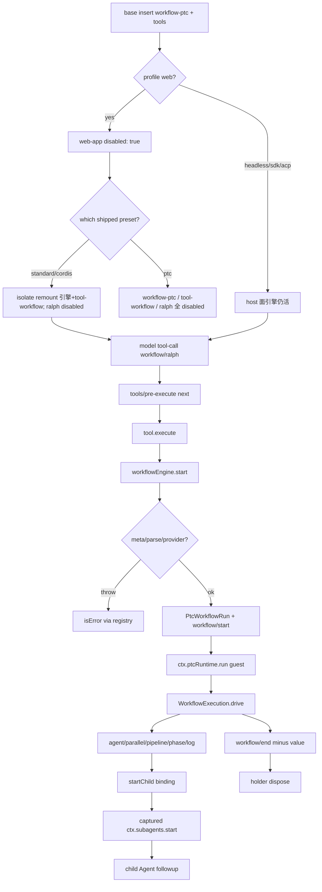

> `ctx.workflowEngine` 是 **host / preset 两面共用的 workflow 能力缝**：Definition 包 `@deepseek-ai/dsh-workflow` 只声明服务与 `workflow/*` emit 事件，**不是** composition 行；shipped Provider 是 `@deepseek-ai/dsh-workflow-ptc`（`PtcWorkflowEngine`）；Consumer 是 `dsh-tool-workflow` / `dsh-tool-ralph`。脚本在 confined Node PTC 进程的 guest `vm` 里跑，`agent()` 经 `ctx.subagents.start` 拉子代理。这是 Cordis 组合运行时（`profile → bundle → agent preset`）上的编排缝，不是又一个 coding agent。

## 能回答的问题

- `dsh-workflow`、`dsh-workflow-ptc`、`tool-workflow` / `tool-ralph` 各是 Definition / Provider / Consumer 的哪一角？哪一个**没有** bundle 行？
- `dsh --profile web` 上引擎为什么必须进 `isolate: { workflowEngine: true }`？漏 isolate 时 `leakedServices` 怎样拒 `mountPreset`？`headless` / `sdk` / `sdk-minimal` / `acp` 是否 disable 这三行？
- shipped `standard` / `cordis` 与 `ptc` 对 `workflow-ptc` / `tool-workflow` / `tool-ralph` 的 `disabled` 差在哪？
- 模型调 `workflow` 之后，谁 `start()`、谁跑 PTC guest、谁 `ctx.subagents.start`？`result` 会不会 reject？
- `workflow/*` 是 emit 还是 waterfall？父工具管线的 `tools/pre-execute` 不 `next()` 会停在哪？
- PTC guest 为什么是 containment 而不是 security boundary？脚本里的 `effort` / `isolation` / `agentType` 会怎样？从 PTC `run_code` 嵌套调 `workflow` 会不会写 `tool-workflow/*`？

## 职责边界

本页拥有：**workflow 缝本身**（`ctx.workflowEngine` / `WorkflowEngine.start` / holder-owned `WorkflowRun` / `workflow/*` emit）、**shipped PTC Provider**（host 预解析、PTC guest 程序、vm hooks、caps、`agent()` → `ctx.subagents.start`）、以及 **Consumer 怎样挂上这缝**（`tool-workflow` / `tool-ralph` 的 `inject` 与 `start()` 调用；不写模型可见字段表）。

本页**不**拥有：

- 模型看见的 `workflow` / `ralph` JSON schema、卡片、截断文案 —— [surface.tools.workflow](../../surface/tools/workflow.md) / [surface.tools.ralph](../../surface/tools/ralph.md)
- `ctx.subagents` 注册表、`registerProvider`、spawn/fork 后端 —— [subsys.orchestration.subagent](subagent.md)
- 子代理 `composeFrom` 父 preset 的 registry 合同 —— [subsys.composition.agent-presets](../composition/agent-presets.md)；本页只点名孩子走 `applyChildComposition` → `ctx.get('agentPresets')?.composeFrom`
- `leakedServices` / `mountPreset` 实现 —— 同一 composition 页
- `dsh-base` 整条 insert 表 —— [subsys.composition.bundle-base](../composition/bundle-base.md)
- 父 turn 的 `tools/pre-execute → execute → post-execute` 全管线 —— [spine.tool-call-anatomy](../../spine/tool-call-anatomy.md)
- PTC `run_code` 传输与 flavor —— [subsys.core.code-mode](../core/code-mode.md)
- client 的 `ui-workflow-run` 卡片（观察 `tool-workflow/*` 记录，不执行脚本）

`@deepseek-ai/dsh-workflow` **不能**当 bundle 行加载：它是抽象 `Service`（`export abstract class WorkflowEngine`），没有 `apply` 插件入口。[E: packages/workflow/workflow/src/index.ts:157] base manifest 依赖 `dsh-tool-ralph` / `dsh-tool-workflow` / `dsh-workflow-ptc`，**没有** `@deepseek-ai/dsh-workflow` 这一行。[E: packages/bundle/base/package.json:105] [E: packages/bundle/base/package.json:112] [E: packages/bundle/base/package.json:121]

`dsh-base` **不**装 Codex / Claude 子代理包。workflow 的默认 child 路由是 Config `provider: 'spawn'`，走 host 面已经登记的 `ctx.subagents`；那两家后端不在本缝、也不在 base 行表。旧包 `dsh-workflow-worker-thread` 已删除，shipped 引擎是 PTC。

## 关键文件

| 路径 | 角色 |
|---|---|
| `packages/workflow/workflow/src/index.ts` | Definition：`ctx.workflowEngine`、`WorkflowEngine`、`WorkflowError`、`emitWorkflowEvent` |
| `packages/workflow/workflow/src/runtime-types.ts` | `WorkflowStartRequest` / `WorkflowRun`（host-only；含 `parent: Agent`） |
| `packages/workflow/workflow/src/types.ts` | `WorkflowMeta` / `WorkflowResult` / `workflow/*` 事件载荷 |
| `packages/workflow/workflow-ptc/src/index.ts` | Provider：`PtcWorkflowEngine.start`、host 预解析、捕获 `ctx.subagents` / `ctx.ptcRuntime` |
| `packages/workflow/workflow-ptc/src/host.ts` | `PtcWorkflowRun`：PTC `run()`、child registry、cancel/dispose |
| `packages/workflow/workflow-ptc/src/guest.ts` | guest 半边：`runWorkflowGuest`、progress 批、child RPC |
| `packages/workflow/workflow-ptc/src/runtime.ts` | vm hooks：`agent` / `parallel` / `pipeline` / `phase` / `log`；拒绝 `effort` |
| `packages/workflow/workflow-ptc/src/meta.ts` | `validateMeta`：meta 是 JSON 数据，不是脚本 |
| `packages/workflow/tool-workflow/src/index.ts` | Consumer：`inject = ['tools', 'workflowEngine', 'systemPrompt']`，调 `start()`；可选 `jobs` 后台 |
| `packages/core/session/src/surface.ts` | `SURFACE_EVENT_TYPES`：`tool-workflow/*` 不进 `deriveMessages()` |
| `packages/workflow/tool-ralph/src/index.ts` | Consumer：固定脚本 + `subagentProvider`，同样 `start()` |
| `packages/bundle/base/cordis.patch.yml` | host 插入引擎 + 两个 tool |
| `packages/bundle/web-app/cordis.patch.yml` | 三行 `disabled: true`，留给 preset remount |
| `packages/bundle/web-app/presets/standard.patch.yml` | `delegation` 组 `isolate: { workflowEngine: true }` |
| `packages/preset/agent-preset-registry/src/mount.ts` | `leakedServices` / `mountPreset` |

## 数据模型

| 符号 | 位置 | 要点 |
|---|---|---|
| `WorkflowEngine` | `workflow/src/index.ts` | `Service` 名 `'workflowEngine'`；唯一抽象方法 `start(request): WorkflowRun`。[E: packages/workflow/workflow/src/index.ts:159] [E: packages/workflow/workflow/src/index.ts:168] |
| `WorkflowStartRequest` | `runtime-types.ts` | `script` + `meta` + 可选 `args` / `subagentProvider` / `maxTotalAgents` + 必填 `parent` + 可选 `signal`。[E: packages/workflow/workflow/src/runtime-types.ts:19] |
| `WorkflowRun` | `runtime-types.ts` | `id` / `meta` / `result`（**永不 reject**）/ `cancel` / `dispose`。[E: packages/workflow/workflow/src/runtime-types.ts:40] |
| `WorkflowMeta` | `types.ts` | 必填 `name`/`description`；可选 `whenToUse`/`phases`。未知字段 → `META_INVALID`。[E: packages/workflow/workflow/src/types.ts:48] |
| `WorkflowResult` | `types.ts` | `value` + `stopReason: 'completed' \| 'cancelled' \| 'error'` + 可选 `error` + `agentsStarted`。[E: packages/workflow/workflow/src/types.ts:72] |
| `WorkflowResultInfo` | `types.ts` | `workflow/end` 载荷 = 结果减去 `value`（监听者拿不到返回值）。[E: packages/workflow/workflow/src/types.ts:124] |
| `WorkflowError` | `index.ts` | 默认 `fatal: true`；combinator 只把非 fatal / 普通 throw 收成 per-item `null`。[E: packages/workflow/workflow/src/index.ts:137] |
| `WorkerLimits` | workflow-ptc `types.ts` | `maxConcurrentAgents` / `maxTotalAgents` / `maxItemsPerCall` / `syncTimeoutMs`。[E: packages/workflow/workflow-ptc/src/types.ts:14] |
| `Config`（Provider） | `PtcWorkflowEngine` | `provider` 默认 `'spawn'`；`maxConcurrentAgents` 默认 `0`，`start()` 里解析成 `min(16, max(1, cores-2))`。[E: packages/workflow/workflow-ptc/src/index.ts:106] [E: packages/workflow/workflow-ptc/src/index.ts:107] [E: packages/workflow/workflow-ptc/src/index.ts:141] [E: packages/workflow/workflow-ptc/src/index.ts:142] |

`workflow/*` 事件名是闭集 `workflow/start`、`workflow/phase`、`workflow/log`、`workflow/agent-start`、`workflow/agent-end`、`workflow/end`。[E: packages/workflow/workflow/src/index.ts:95] [E: packages/workflow/workflow/src/index.ts:96] [E: packages/workflow/workflow/src/index.ts:97] [E: packages/workflow/workflow/src/index.ts:98] [E: packages/workflow/workflow/src/index.ts:99] [E: packages/workflow/workflow/src/index.ts:100] 分发走 `emitWorkflowEvent` → `dispatch('emit', …)`，不是 waterfall。[E: packages/workflow/workflow/src/index.ts:176]

Consumer 另写父 session 记录：`SessionEventMap` 声明 `tool-workflow/run-start` / `agent-start` / `agent-end` / `run-end`。[E: packages/workflow/tool-workflow/src/types.ts:47] [E: packages/workflow/tool-workflow/src/types.ts:52] [E: packages/workflow/tool-workflow/src/types.ts:57] [E: packages/workflow/tool-workflow/src/types.ts:62] Consumer 用两参数 `session.append` 写入父 log，不传 `surfaceOp`。[E: packages/workflow/tool-workflow/src/index.ts:102] `SURFACE_EVENT_TYPES` 是 `system/message` / `developer/message` / `user/message` / `assistant/message` / `tool/result`；非此集合不能带 `surfaceOp`，不进 `deriveMessages()`。[E: packages/core/session/src/surface.ts:50] [E: packages/core/session/src/surface.ts:51] [E: packages/core/session/src/surface.ts:52] [E: packages/core/session/src/surface.ts:53] [E: packages/core/session/src/surface.ts:54] [E: packages/core/session/src/surface.ts:55]

## 控制流

```mermaid
flowchart TD
  Base["base insert workflow-ptc + tools"] --> Web{"profile web?"}
  Web -->|yes| Disable["web-app disabled: true"]
  Web -->|headless/sdk/acp| HostLive["host 面引擎仍活"]
  Disable --> Preset{"which shipped preset?"}
  Preset -->|standard/cordis| Enable["isolate remount 引擎+tool-workflow; ralph disabled"]
  Preset -->|ptc| AllOff["workflow-ptc / tool-workflow / ralph 全 disabled"]
  Enable --> Tool["model tool-call workflow/ralph"]
  HostLive --> Tool
  Tool --> Waterfall["tools/pre-execute next"]
  Waterfall --> Exec["tool.execute"]
  Exec --> Start["workflowEngine.start"]
  Start --> Sync{"meta/parse/provider?"}
  Sync -->|throw| ToolErr["isError via registry"]
  Sync -->|ok| Guest["PtcWorkflowRun + workflow/start"]
  Guest --> PTC["ctx.ptcRuntime.run guest"]
  PTC --> Drive["WorkflowExecution.drive"]
  Drive --> Hook["agent/parallel/pipeline/phase/log"]
  Hook --> RPC["startChild binding"]
  RPC --> Sub["captured ctx.subagents.start"]
  Sub --> Child["child Agent followup"]
  Drive --> Result["workflow/end minus value"]
  Result --> Dispose["holder dispose"]
```

1. **Definition 只挂键，不进树。** `WorkflowEngine` 构造函数 `super(ctx, 'workflowEngine')`，把实现 publish 到 `ctx.workflowEngine`。[E: packages/workflow/workflow/src/index.ts:159] 测试：`ctx.plugin` 子类后 `ctx.get('workflowEngine')` 有实例，fiber `dispose` 后变 `undefined`。[E: packages/workflow/workflow/tests/workflow.spec.ts:49] [E: packages/workflow/workflow/tests/workflow.spec.ts:51] `@deepseek-ai/dsh-workflow` 没有任何 `cordis.patch.yml` / preset patch 行。

2. **Provider 才是 composition 行。** `PtcWorkflowEngine` `static inject = ['subagents', 'ptcRuntime', 'sandboxPolicy']`，默认 export 就是这个类。[E: packages/workflow/workflow-ptc/src/index.ts:103] [E: packages/workflow/workflow-ptc/src/index.ts:191] 构造要求 `ctx.ptcRuntime.language === 'typescript'`。[E: packages/workflow/workflow-ptc/src/index.ts:117] `dsh-base` insert `id: workflow-ptc`，`name: '@deepseek-ai/dsh-workflow-ptc'`，`config.provider: spawn`；同组再 insert `tool-workflow` 与 `tool-ralph`（ralph 默认 `disabled: true`）。[E: packages/bundle/base/cordis.patch.yml:392] [E: packages/bundle/base/cordis.patch.yml:393] [E: packages/bundle/base/cordis.patch.yml:397] [E: packages/bundle/base/cordis.patch.yml:446] [E: packages/bundle/base/cordis.patch.yml:448]

3. **Web 把引擎与 Consumer 从进程根挪到 preset。** `dsh-web-app` 对 `workflow-ptc` / `tool-workflow` / `tool-ralph` 写 `disabled: true`。[E: packages/bundle/web-app/cordis.patch.yml:534] [E: packages/bundle/web-app/cordis.patch.yml:535] [E: packages/bundle/web-app/cordis.patch.yml:537] [E: packages/bundle/web-app/cordis.patch.yml:538] [E: packages/bundle/web-app/cordis.patch.yml:543] [E: packages/bundle/web-app/cordis.patch.yml:544] host 面的 `ctx.subagents` **留下**。四个 shipped preset 只叠在 `dsh-web-app`：`package.json` `dsh.bundle.patch` = `cordis.patch.yml` + `presets/{standard,ptc,minimal,cordis}.patch.yml`。[E: packages/bundle/web-app/package.json:44] [E: packages/bundle/web-app/package.json:45] [E: packages/bundle/web-app/package.json:46] [E: packages/bundle/web-app/package.json:47] [E: packages/bundle/web-app/package.json:48] `dsh-headless` 只额外 insert `headless-startup` / `headless-runner`，不 disable 这三行，也不挂 preset registry：headless（以及叠 `dsh-base` 的 `sdk` / `acp`）上引擎与工具留在 **host 全局层**。[E: packages/bundle/headless/cordis.patch.yml:21] [E: packages/bundle/headless/cordis.patch.yml:25] 五个 shipped profile 是 `web` / `headless` / `sdk` / `sdk-minimal` / `acp`。

4. **standard / cordis 在 `delegation` 组 isolate remount 并启用引擎；ptc 同组但全 disabled。** 组是 `cordis:group`，`isolate.workflowEngine: true`。[E: packages/bundle/web-app/presets/standard.patch.yml:80] [E: packages/bundle/web-app/presets/standard.patch.yml:84] `standard` / `cordis` 组内挂启用的 `workflow-ptc` + `tool-workflow`，`tool-ralph` `disabled: true`。[E: packages/bundle/web-app/presets/standard.patch.yml:119] [E: packages/bundle/web-app/presets/standard.patch.yml:123] [E: packages/bundle/web-app/presets/standard.patch.yml:125] [E: packages/bundle/web-app/presets/standard.patch.yml:127] [E: packages/bundle/web-app/presets/cordis.patch.yml:118] [E: packages/bundle/web-app/presets/cordis.patch.yml:122] [E: packages/bundle/web-app/presets/cordis.patch.yml:124] [E: packages/bundle/web-app/presets/cordis.patch.yml:126] **`ptc` 把 `workflow-ptc` / `tool-workflow` / `tool-ralph` 都写成 `disabled: true`**——PTC preset 不把 workflow 引擎留给 ralph，三行全关。[E: packages/bundle/web-app/presets/ptc.patch.yml:119] [E: packages/bundle/web-app/presets/ptc.patch.yml:121] [E: packages/bundle/web-app/presets/ptc.patch.yml:124] [E: packages/bundle/web-app/presets/ptc.patch.yml:126] [E: packages/bundle/web-app/presets/ptc.patch.yml:127] [E: packages/bundle/web-app/presets/ptc.patch.yml:129] Loader 见 `isolate?.[name] === true` 时建 `LocalRealm`，服务存到 realm-private symbol。[E: vendor/loader/src/config/isolate.ts:81] [E: vendor/loader/src/config/isolate.ts:82] `mountPreset` settle 后跑 `leakedServices`：子树若把实现 publish 进 root isolate 槽，抛 `Preset services require isolate realms: …`。[E: packages/preset/agent-preset-registry/src/mount.ts:86] [E: packages/preset/agent-preset-registry/src/mount.ts:265] [E: packages/preset/agent-preset-registry/src/mount.ts:267] shipped `minimal` **没有**这三行；web 上 host 行又已 disable，minimal 会话看不到 `workflow` / `ralph`。[I]

5. **父工具进入必须走 waterfall。** 模型发出 wire 名 `workflow`（或 `ralph`）的 tool-call 后，`ToolRuntime` 先 `ctx.waterfall(..., 'tools/pre-execute', exec, () => allow)`。[E: packages/core/tools/src/index.ts:1505] [E: packages/core/tools/src/index.ts:1506] Cordis `Events.waterfall` 把最后一个参数当 innermost `next`；监听器不调用传入的 `next()`，就不会 `shift` 到下一层，内建 `allow` 与后续 `tools/execute` 都到不了。[E: vendor/cordis/src/events.ts:234] [E: vendor/cordis/src/events.ts:238] body 外包在 `tools/execute` waterfall 里。[E: packages/core/tools/src/index.ts:1605] 收尾再 `tools/post-execute`，默认 `next` 是 `{ kind: 'accept' }`。[E: packages/core/tools/src/index.ts:1782] [E: packages/core/tools/src/index.ts:1784] 本缝**没有**「故意不 next 的 reject」；要拦一次 `workflow` 调用，监听器必须自己 `return` 一个非 `allow` 的 decision。

6. **Consumer 调缝，不自己跑脚本。** `tool-workflow` `inject = ['tools', 'workflowEngine', 'systemPrompt']`。[E: packages/workflow/tool-workflow/src/index.ts:41] `execute` 没有 `exec.agent` 就抛；否则 `ctx.workflowEngine.start({ script, meta, args?, parent, signal })`。[E: packages/workflow/tool-workflow/src/index.ts:412] [E: packages/workflow/tool-workflow/src/index.ts:433] `ralph` 同样 `inject` 含 `workflowEngine`，但脚本是包内常量 `RALPH_SCRIPT`，再带 `subagentProvider` / `maxTotalAgents`。[E: packages/workflow/tool-ralph/src/index.ts:18] [E: packages/workflow/tool-ralph/src/index.ts:445] `run_in_background: true` 走 `ctx.jobs.start({ kind: 'workflow', … })`，引擎 `start` 发生在 job starter 里。[E: packages/workflow/tool-workflow/src/index.ts:274] [E: packages/workflow/tool-workflow/src/index.ts:282] 字段表留给 T1。

7. **`start()` 同步门：过不了就不发 `workflow/start`。** `PtcWorkflowEngine.start` 依次 `validateMeta`、`assertBodyParses`、解析 `subagentProvider`、解析 `maxTotalAgents`，再 mint `WorkflowRunId`。[E: packages/workflow/workflow-ptc/src/index.ts:134] [E: packages/workflow/workflow-ptc/src/index.ts:135] [E: packages/workflow/workflow-ptc/src/index.ts:136] [E: packages/workflow/workflow-ptc/src/index.ts:137] meta 未知字段 / 空 `name` → `META_INVALID`。[E: packages/workflow/workflow-ptc/src/meta.ts:21] [E: packages/workflow/workflow-ptc/src/meta.ts:23] [E: packages/workflow/workflow-ptc/src/meta.ts:79] body 以 `export const meta` 开头 → `SCRIPT_PARSE`。[E: packages/workflow/workflow-ptc/src/index.ts:55] `vm.Script` 包一层 `(async () => { … })()` 失败同样 → `SCRIPT_PARSE`。[E: packages/workflow/workflow-ptc/src/index.ts:60] 空串或未经 `trim` 的 `subagentProvider` → `INVALID_ARGUMENT`。[E: packages/workflow/workflow-ptc/src/index.ts:69] [E: packages/workflow/workflow-ptc/src/index.ts:70] provider 未登记 → `AGENT_START`。[E: packages/workflow/workflow-ptc/src/index.ts:75] [E: packages/workflow/workflow-ptc/src/index.ts:76] 这些 throw 发生在返回 `WorkflowRun` **之前**，测试钉死此时 `workflow/start` 计数仍为 0。[E: packages/workflow/workflow-ptc/tests/workflow-ptc.spec.ts:271] [E: packages/workflow/workflow-ptc/tests/workflow-ptc.spec.ts:293]

8. **返回 run 之前捕获 `ctx.subagents` 与 `ctx.ptcRuntime`。** `const subagents = runCtx.subagents`，再 `new PtcWorkflowRun(..., subagents, runCtx.ptcRuntime, …)`。[E: packages/workflow/workflow-ptc/src/index.ts:156] [E: packages/workflow/workflow-ptc/src/index.ts:157] 这样引擎 fiber 被 HMR unload、`ctx.workflowEngine` 变 `undefined` 之后，已经返回给 holder 的 run 仍能 `start` 孩子。然后 `emitWorkflowEvent('workflow/start', info)`；`result` settle 时再发 `workflow/end`，载荷只有 `stopReason` / 可选 `error` / `agentsStarted`，**没有** `value`。[E: packages/workflow/workflow-ptc/src/index.ts:176] [E: packages/workflow/workflow-ptc/src/index.ts:180]

9. **`workflow/*` 是 emit，失败被含住。** `emitWorkflowEvent` 对 `this.ctx.events.dispatch('emit', [name, ...args])` 逐个 callback 包 try/catch；同步 throw 与 rejected thenable 都 `logger.warn`，不饿死后续监听者。[E: packages/workflow/workflow/src/index.ts:176] 这里**没有** `next()` 可调用——它不是 waterfall。

10. **PTC guest handshake。** `PtcWorkflowRun.drive` 调 `this.runtime.run({ program, bindings: [{ global: 'workflowHost', functions: this.bindings() }], cwd: policy.workspaceRoot, sandboxPolicy, timeoutMs: null, signal })`。[E: packages/workflow/workflow-ptc/src/host.ts:276] guest `runWorkflowGuest` 先 `host.begin({})` 拿 `WorkerInit`，再 `new WorkflowExecution(...).drive()`。[E: packages/workflow/workflow-ptc/src/guest.ts:17] [E: packages/workflow/workflow-ptc/src/guest.ts:66] 已 abort 的 start signal 在构造时直接 `cancel`。[E: packages/workflow/workflow-ptc/src/host.ts:137]

11. **脚本只看见五个 hook + `args`。** `WorkflowExecution` `vm.createContext` 后挂 `agent` / `parallel` / `pipeline` / `phase` / `log` 与 `args`（函数被 `Object.freeze`）。[E: packages/workflow/workflow-ptc/src/runtime.ts:85] [E: packages/workflow/workflow-ptc/src/runtime.ts:86] [E: packages/workflow/workflow-ptc/src/runtime.ts:97] `drive()` 永不 reject：`completed` 带 materialized `value`；hook / 脚本失败 → `stopReason: 'error'`。[E: packages/workflow/workflow-ptc/src/runtime.ts:110] `agent()` 选项只认 `label` / `phase` / `schema` / `provider` / `model`。[E: packages/workflow/workflow-ptc/src/runtime.ts:33] `effort` / `isolation` / `agentType` 落在 `DEFERRED_AGENT_OPTIONS`，抛 `UNSUPPORTED_OPTION`（fatal，会杀整个 script，不会变成 per-item `null`）。[E: packages/workflow/workflow-ptc/src/runtime.ts:35] [E: packages/workflow/workflow-ptc/src/runtime.ts:255] 测试原文就是 `agent("x", {effort: "high"})`。[E: packages/workflow/workflow-ptc/tests/guest.spec.ts:325]

12. **`agent()` = child binding + host `ctx.subagents.start`。** guest 经 `host.startChild`；host `startChild` 调**捕获到的** `this.subagents.start(this.provider, { prompt, parent, signal, outputSchema?, agentOptions? })`。[E: packages/workflow/workflow-ptc/src/host.ts:200] 这是 one-shot `start`，不是 `startContinuable`。孩子走 host 面已经登记的 provider（默认 `spawn`：新 session、不继承父对话）。in-process 孩子在创建窗口 `applyChildComposition`：`childCtx.get('agentPresets')?.composeFrom(childCtx, parent.ctx)`，join 父 preset 的 **当前 registry revision**（`bindScopeParent`），不是按 id 再 resolve 一份新树。[E: packages/subagent/subagent/src/child-agent.ts:205] [E: packages/preset/agent-preset-registry/src/index.ts:273] [E: packages/preset/agent-preset-registry/src/index.ts:242] 发布成功才 `workflow/agent-start`；孩子 `result` 以 JSON 投影回 guest。child 自己失败（非 `completed`）→ 脚本看到 `null`；provider `result` reject → fatal `AGENT_RESULT`。[E: packages/workflow/workflow-ptc/src/runtime.ts:205] 每条已 start 的 agent 在任何 stop 路径上都有恰好一次 `workflow/agent-end`（guest 报或 host 合成 `'cancelled'`）。[E: packages/workflow/workflow-ptc/src/host.ts:302]

13. **containment，不是 security boundary。** 工具 description 写脚本「has no filesystem, network, timer, or Node.js APIs」。[E: packages/workflow/tool-workflow/src/index.ts:166] shipped `PtcWorkflowEngine` 在 confined Node 进程里跑 guest `vm`；测试仍用 `globalThis.constructor.constructor('return process')()` 摸到 `process`，只钉死 guest `process.env` 为空对象（不含 ambient 凭据 / proxy / loader 路径）。[E: packages/workflow/workflow-ptc/tests/egress.spec.ts:28] [E: packages/workflow/workflow-ptc/tests/egress.spec.ts:35] 正文按 containment + session file policy 写，不把「无 Node API」当成可执行安全边界。[U]

14. **settle 与 dispose。** `PtcWorkflowRun.dispose()` 先 `cancel`，再 await 共享的 `result`。[E: packages/workflow/workflow-ptc/src/host.ts:159] [E: packages/workflow/workflow-ptc/src/host.ts:161] Consumer `finally` 里 `await run.dispose()`。[E: packages/workflow/tool-workflow/src/index.ts:470] 非 `completed` 被映射成 tool `isError`，不把部分 `value` 交给模型。[E: packages/workflow/tool-workflow/src/index.ts:454]

15. **model-visible ⟺ logged。** 模型看见的是父 session 的 `tool/call`（`script`/`meta`/`args`）与 `tool/result`（`runId` / `agentsStarted` / `result`）。`tool-workflow` 仅当 `exec.parent === undefined`（顶层调用）时把 `workflow/agent-*` 投影成 `tool-workflow/*` 记进父 log。[E: packages/workflow/tool-workflow/src/index.ts:440] `SURFACE_EVENT_TYPES` 不含 `tool-workflow/*`；这些记录不能带 `surfaceOp`，不进 `deriveMessages()`。[E: packages/core/session/src/surface.ts:50] 孩子中间 step 留在**孩子自己的** session log，经 subagent 缝，不灌回父请求。`workflow/end` 故意不含 `value`：要值就持有 `WorkflowRun`。

## 设计动机

- **缝与引擎拆开。** Definition 包零 I/O、零 PTC 进程，让测试和替换引擎只依赖 `start()` 合同。shipped 产品选 `workflow-ptc`，是为了复用 `ctx.ptcRuntime` 的 confined Node 进程与 session file policy，而不是再维护一套独立 worker-thread 运行时。
- **meta 是数据。** 不在脚本里 `export const meta`，避免在 host 上 eval 带 getter 的对象。
- **holder-owned run。** 引擎不维护活体表。unload Provider 只拿走「再 `start` 一次」的能力；已返回的 run 继续用捕获的 `SubagentRuntime` / `PtcRuntime` 管孩子。
- **isolate 的是引擎，不是 `subagents`。** web 上每个 standing preset 一份 `workflowEngine`，避免两会话抢 root 服务名；孩子仍进进程单例 `ctx.subagents`，browser RPC / `listChildren` 才能看见。
- **ptc preset 关掉 workflow。** PTC 会话的模型面是 `run_code`；再挂 `workflow` 会让同一 PTC runtime 上叠两套脚本入口。`standard` / `cordis` 才启用 `workflow-ptc` + `tool-workflow`。
- **fatal vs per-item `null`。** 拼写错的 option、越 cap、schema 超集必须杀脚本；单个 child 失败才 `null`。fatality 用 host-realm `instanceof WorkflowError`，脚本伪造的对象过不了。
- **观察事件不含控制面。** `workflow/*` 是 emit + listener containment；拿不到 `cancel`/`dispose`，也拿不到 `value`。

## Gotcha

- **不要把 `dsh-workflow` 写进 bundle。** 抽象类没有 plugin `apply`；组合真树认 `id: workflow-ptc`。旧 `workflow-worker-thread` 已删除。
- **`effort` 不是运行时选项。** `DEFERRED_AGENT_OPTIONS` 显式拒绝 `effort` / `isolation` / `agentType`。不要在文档或调用里发明 effort 档位。
- **默认 child 路由是 `spawn`，不是 `fork`，更不是 Codex/Claude。** `dsh-base` 不装那两家 backend。`agent({ provider, model })` 只改孩子的 `agentOptions` LLM 目标，不改 subagent provider 名；换 child **后端** 用 start 请求的 `subagentProvider` 或引擎 Config `provider`。
- **没有 `ctx.llm.route`。** 孩子的模型选择走 subagent 请求里的 `agentOptions.provider` 字符串。默认对话路由仍是 `deepseek-official`。
- **web 上漏 isolate 会整次 mount 失败。** `PtcWorkflowEngine` 会 `provide('workflowEngine')`；preset 行若不在 `isolate: { workflowEngine: true }` 里，`leakedServices` 拒站。
- **Consumer 放错组会解析到空 host 缝。** web 已 disable host 引擎。`tool-workflow` 若挂在 `delegation` 组外，`inject: workflowEngine` 会走到未被 populate 的 root 键。
- **`ptc` preset 看不到 `workflow` / `ralph`。** 三行都 `disabled: true`。不要写成「ptc 把引擎留给 ralph」。
- **`result` 永不 reject；失败在 `stopReason`。** 工具层把非 `completed` 再变成 `isError`。不要 `try/catch` 去等引擎抛结算错误。
- **guest 挡不住逃逸。** 测试自己用 `constructor.constructor` 拿到 `process`。信任模型与信任 `bash` 同一档；空 `process.env` 只是减少凭据泄漏，不是沙箱证明。[U]
- **顶层记录 vs PTC 嵌套。** `exec.parent !== undefined` 时 `tool-workflow` 不写 `tool-workflow/*`。从 `run_code`（`packages/core/tools/src/ptc.ts`）程序里调 `workflow` 仍会 `start()`，但父 session 没有那条 durable member 时间线。
- **Ralph 是固定脚本 Consumer，不是第二种引擎。** 同一 `ctx.workflowEngine.start`；模型只能改 `objective` / `maxRounds`，不能改 loop。
- **`headless` / `sdk` / `acp` 不走 preset remount。** 只有 web-app disable 这三行；叠 `dsh-base` 的非 web profile 在 host 全局层跑引擎。`sdk-minimal` 不叠 `dsh-base`，不要假定它一定有 `workflow-ptc` 行。
- **后台 `workflow` 是 Job，不是 continuable 子代理。** `kind: 'workflow'` 由 `dsh-tool-workflow` declaration merge 进 `JobKindMap`；需要 host `ctx.jobs` + `tool-jobs` controller。

## Seam 三角

| 角色 | 包 | ctx 键 / inject | bundle / preset 行 |
|---|---|---|---|
| **Definition** | `@deepseek-ai/dsh-workflow`（`WorkflowEngine`） | 声明 `ctx.workflowEngine`；无 plugin Config | **不是** composition 行；无 `id:` |
| **Provider** | `@deepseek-ai/dsh-workflow-ptc`（`PtcWorkflowEngine`） | `inject = ['subagents', 'ptcRuntime', 'sandboxPolicy']`；`provide('workflowEngine')` | host：`id: workflow-ptc`（`provider: spawn`）。web：`disabled: true`。`standard` / `cordis`：在 `delegation` 组 `isolate: { workflowEngine: true }` 里 remount 并启用。`ptc`：同组 remount 但 `disabled: true` |
| **Consumer** | `@deepseek-ai/dsh-tool-workflow`、`@deepseek-ai/dsh-tool-ralph` | `inject` 含 `workflowEngine`（ralph 另要 `subagents`） | host：`id: tool-workflow` / `id: tool-ralph`（ralph 默认 disabled）。web disable。`standard` / `cordis` 与引擎同组 remount（ralph 仍 disabled）。`ptc` 两行都 disabled。minimal 无 |

换掉 Provider 行（例如换成进程内 stub 引擎）会带走脚本执行与 caps，但模型看见的 tool 名仍由 Consumer 注册。孩子世界由 host 面 `ctx.subagents` 的 Provider 集合决定，与本缝正交。孩子若走 in-process spawn/fork，preset 绑定走 registry `composeFrom`，不是再 `mount()` 一份新声明。

## Sources

- packages/workflow/workflow/src/index.ts
- packages/workflow/workflow/src/types.ts
- packages/workflow/workflow/src/runtime-types.ts
- packages/workflow/workflow/tests/workflow.spec.ts
- packages/workflow/workflow-ptc/src/index.ts
- packages/workflow/workflow-ptc/src/host.ts
- packages/workflow/workflow-ptc/src/runtime.ts
- packages/workflow/workflow-ptc/src/guest.ts
- packages/workflow/workflow-ptc/src/meta.ts
- packages/workflow/workflow-ptc/src/types.ts
- packages/workflow/workflow-ptc/tests/workflow-ptc.spec.ts
- packages/workflow/workflow-ptc/tests/egress.spec.ts
- packages/workflow/workflow-ptc/tests/guest.spec.ts
- packages/workflow/tool-workflow/src/index.ts
- packages/workflow/tool-workflow/src/types.ts
- packages/workflow/tool-ralph/src/index.ts
- packages/bundle/base/cordis.patch.yml
- packages/bundle/base/package.json
- packages/bundle/web-app/cordis.patch.yml
- packages/bundle/web-app/package.json
- packages/bundle/web-app/presets/standard.patch.yml
- packages/bundle/web-app/presets/ptc.patch.yml
- packages/bundle/web-app/presets/cordis.patch.yml
- packages/bundle/headless/cordis.patch.yml
- packages/preset/agent-preset-registry/src/mount.ts
- packages/preset/agent-preset-registry/src/index.ts
- vendor/loader/src/config/isolate.ts
- vendor/cordis/src/events.ts
- packages/core/session/src/surface.ts
- packages/core/tools/src/index.ts
- packages/subagent/subagent/src/child-agent.ts

## 相关

- [spine.overview](../../spine/overview.md) — Cordis 组合运行时总图；host 面 vs agent-preset 面。
- [spine.composition-boot](../../spine/composition-boot.md) — `profile → bundle → preset` 叠层；web 为何 disable 后再 remount。
- [spine.turn-and-step](../../spine/turn-and-step.md) — 父 Agent 的 turn/step；workflow 是其中一次 tool-call。
- [spine.trace-subagent](../../spine/trace-subagent.md) — `ctx.subagents.start('spawn')` 孩子路径（workflow `agent()` 走同一条 `start`）。
- [spine.capability-seams](../../spine/capability-seams.md) — Definition / Provider / Consumer 通例。
- [spine.tool-call-anatomy](../../spine/tool-call-anatomy.md) — 父 `tools/pre-execute → execute → post-execute` 必须 `next()`。
- [surface.tools.workflow](../../surface/tools/workflow.md) — 模型可见 `workflow` 字段与渲染（T1）。
- [surface.tools.ralph](../../surface/tools/ralph.md) — 模型可见 `ralph` 字段与固定脚本合同（T1）。
- [surface.presets.standard](../../surface/presets/standard.md) — shipped `standard` 成员；`delegation` 组与 `workflowEngine` isolate。
- [surface.presets.code](../../surface/presets/code.md) — shipped PTC preset（文件 `presets/ptc.patch.yml`；稳定 id 仍为 `surface.presets.code`）。
- [subsys.core.code-mode](../core/code-mode.md) — PTC `run_code`；嵌套 `workflow` 调用不写 `tool-workflow/*`。
- [subsys.orchestration.subagent](subagent.md) — `ctx.subagents` / `registerProvider` / `start`。
- [subsys.composition.agent-presets](../composition/agent-presets.md) — standing mount、`composeFrom`、`leakedServices`。
- [subsys.composition.bundle-base](../composition/bundle-base.md) — `dsh-base` 插入 `workflow-ptc` 的那一行。
