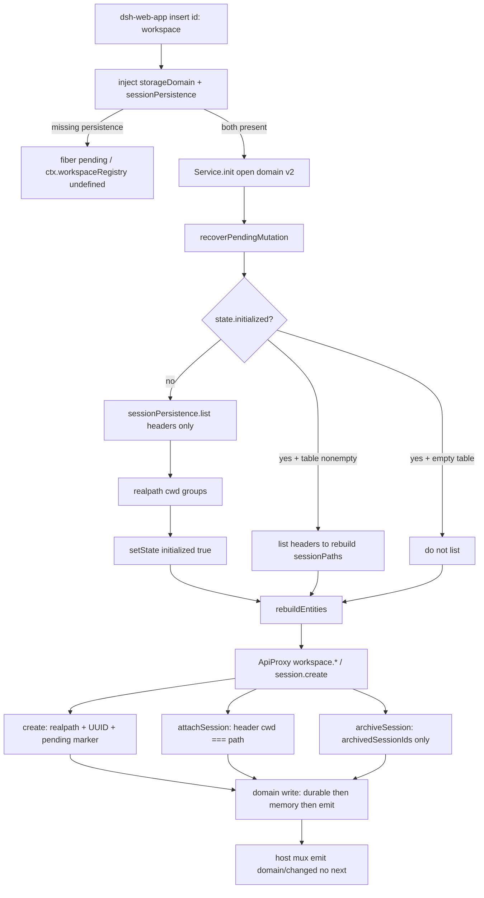

> `WorkspaceRegistry`（`ctx.workspaceRegistry`）是 **只 web-app** 的 **host 面** 实体注册表：用 UUID `WorkspaceId` 钉住一个经 `fs.realpath` 规范化的已存在目录，并把 session 记账写进 domain `workspace` v2（shipped JSON 盘是 `$DSH_HOME/storages/workspace.json`）。它不拥有 append-only session log，也不进入 `deriveMessages()`。缺 `sessionPersistence` 时服务不激活，避免把「peer 不可用」当成「空历史」并盖上 `initialized`。这是 Cordis 组合运行时（`profile → bundle → agent preset`）的 capability seam（Definition / Provider / Consumer），不是又一个 coding agent 的项目列表。

## 能回答的问题

- `ctx.workspaceRegistry` 挂在 host 面还是 agent-preset 面？`dsh-base` / `dsh-web-app` / `dsh-headless` 各有没有 `id: workspace`？
- 缺 `sessionPersistence` 时服务会不会启动？bootstrap 读的是 `list()` header 还是 `load` / `inspect` 整本 log？`list()` 会不会拒外国 `SESSION_FORMAT_VERSION`？
- shipped `session-query-sqlite` 的 `openAt` 是什么？workspace 会不会 `inject` `sessionQuery`？`session-projection-cache` 挂在 base 还是只 web-app？
- `WorkspaceId` 是 path 还是 UUID？两个拼写不同的目录何时算同一个 workspace？
- `attachSession` 校验什么？`archiveSession` 会不会 `detach`？有没有 `unarchive`？
- 标题 uniqueness 是 registry 还是 gateway 的门？`domain/changed` 是 emit、parallel 还是 waterfall，谁必须 `next()`？

## 职责边界

本包拥有：`WorkspaceRegistry`（`ctx.workspaceRegistry`）的启动、一次性 header 历史 bootstrap、`realpath` 路径唯一、create / delete / 注册表排序、header-validated 的 session 记账（`attach` / `insertSessionBefore` / `detach`）、以及覆盖在记账之上的全局 `archivedSessionIds`。

本包**不**拥有：`ctx.storage` / `storage-json` / `storage-domain` 的介质与写链（[subsys.persistence.storage](storage.md)）；append-only `SessionEvent` log、`SessionHeader` 深冻、`deriveMessages()`（[subsys.core.session](../core/session.md)、[spine.session-log](../../spine/session-log.md)）；JSONL 写窗与 `session/flush`（[subsys.persistence.session-persistence](session-persistence.md)）；gateway 上的标题查重、`workspace.*` RPC、以及 `session.create` 成功后再 `attachSession` 的编排（[subsys.host.apiproxy](../host/apiproxy.md)）；浏览器侧边栏（`dsh-client-ui-workspace`，client 面，只吃 `WorkspaceView`）。

workspace 是 **host 面**进程级服务。agent-preset 面不 remount 一份 registry；会话只把 `header.cwd` 当 attach 校验输入。默认产品路径是本地 Web GUI（`dsh web`），本仓没有 shipped TUI 包。

正交、写错会污染邻页的事实（本页只点名，不展开实现）：

- 新 header 的 `version` 必须等于 `SESSION_FORMAT_VERSION`（现为 `0`）。跨 version **没有**自动 migration：更新的盘叫人升级 harness，更旧的盘「本 build 无升级路径」。`assertVersion` 只出现在 coordinator 的 `readFrom` / `load` 前缀 / `prepare` / `adoptLivePrefix`；`PersistenceCoordinator` **没有** `list()`。workspace bootstrap 只 `await this.ctx.sessionPersistence.list()`。JSONL `list()` 走 `parseHeaderMeta`：JSON.parse 之后只跑 `isHeaderLine`（`version` 只要是 number），**不**调用 `refuseForeignFormatVersion`（那条门只在全量 `parseHeaderRecord` / `scanLog` 上）。sqlite `list()` 是 `SELECT` + `rowToMeta`，同样不拒外国 version。形状仍像今天 header 但 `version !== 0` 的记录会进 cwd 分组；version 门要等之后某次 `load` / `prepare` / `readFrom` / `scanLog`。 [E: packages/core/session/src/types.ts:56] [E: packages/session/session-persistence/src/coordinator.ts:79] [E: packages/session/session-persistence/src/coordinator.ts:80] [E: packages/session/session-persistence/src/coordinator.ts:858] [E: packages/session/session-persistence/src/coordinator.ts:882] [E: packages/session/session-persistence/src/coordinator.ts:898] [E: packages/session/session-persistence/src/coordinator.ts:1307] [E: packages/workspace/workspace/src/index.ts:129] [E: packages/session/session-persistence-jsonl/src/index.ts:496] [E: packages/session/session-persistence-jsonl/src/format.ts:93] [E: packages/session/session-persistence-jsonl/src/format.ts:259] [E: packages/session/session-persistence-jsonl/src/format.ts:411] [E: packages/session/session-persistence-sqlite/src/index.ts:349]
- SQLite **session 盘** `SCHEMA_VERSION = 15`：`user_version` 非 0 且不等于 15 → 拒开，原地不迁。该值 ≠ session event `version` ≠ workspace domain version 2 ≠ session-query schema 8 ≠ storage-sqlite schema 1。该 backend **不**在任何 shipped bundle。 [E: packages/session/session-persistence-sqlite/src/schema.ts:20] [E: packages/session/session-persistence-sqlite/src/schema.ts:108] [E: packages/session/session-persistence-sqlite/src/schema.ts:109] [E: packages/session-query/session-query-sqlite/src/schema.ts:8] [E: packages/storage/storage-sqlite/src/schema.ts:20]
- checkpoint 在 `llm/stream` 进 adapter **之前**、以及 top-level `tools/execute` 进 tool body **之前** `sessions.flush`。嵌套 `exec.parent` 不再刷。`agent/pre-step` 另有一条耐久刷盘，不是副作用门。 [E: packages/session/session-checkpoint-policy/src/index.ts:35] [E: packages/session/session-checkpoint-policy/src/index.ts:36] [E: packages/session/session-checkpoint-policy/src/index.ts:71] [E: packages/session/session-checkpoint-policy/src/index.ts:72] [E: packages/session/session-checkpoint-policy/src/index.ts:80]
- compaction 只有 `surfaceOp: { op: 'replace', start, end }`，没有 delete。workspace 记账**不是** surface 节点，不走 `replace`。 [E: packages/core/session/src/types.ts:372] [E: packages/core/session/src/types.ts:374]
- settings 分层：schema defaults → composition `base` → 用户文档 section。`resolve` 是 `schema(mergeLayers(base, section))`。 [E: packages/settings/settings/src/index.ts:705]
- 组合 / adapter Config 里放 `CredentialRef`（`role('credential-ref')` / `apiKeyEnv`）。`.credentials.yaml` 写入 map 的是非空 secret 字符串，不是 ref。 [E: packages/llm/llm-deepseek/src/index.ts:92] [E: packages/credentials/credentials-local/src/index.ts:52] [E: packages/credentials/credentials-local/src/index.ts:183]
- shipped JSONL 后端挂在 base：`id: session-persistence-jsonl`，`root: dshHomePath('sessions')`。headless / web 继承这一行，自己不重挂。workspace 的 `sessionPersistence.list()` 默认落这条盘。 [E: packages/bundle/base/cordis.patch.yml:98] [E: packages/bundle/base/cordis.patch.yml:101]
- shipped `session-query-sqlite` 写出 `openAt: never`（base 挂载；web-app 用同一键重述 `path: ':memory:'` + `openAt: never`）。search 默认关，不 import/open sqlite。workspace **不** `inject` `sessionQuery`；bootstrap 不走 query 缝。 [E: packages/bundle/base/cordis.patch.yml:117] [E: packages/bundle/base/cordis.patch.yml:120] [E: packages/bundle/base/cordis.patch.yml:121] [E: packages/bundle/web-app/cordis.patch.yml:30] [E: packages/bundle/web-app/cordis.patch.yml:32] [E: packages/bundle/web-app/cordis.patch.yml:33] [E: packages/workspace/workspace/src/index.ts:93]
- `session-projection-cache` **只 web-app**：与 `storage*` / `workspace` / `session-stats` 同层 insert，`writeEveryEvents: 200`，`writeIntervalMs: 5000`。base / headless **没有**这一行。 [E: packages/bundle/web-app/cordis.patch.yml:76] [E: packages/bundle/web-app/cordis.patch.yml:79] [E: packages/bundle/web-app/cordis.patch.yml:80]

## 关键文件

| 路径 | 角色 |
|---|---|
| `packages/workspace/workspace/src/index.ts` | `WorkspaceRegistry`；`WorkspaceId()`；`inject`；`Service.init` bootstrap；create / delete / order / archive |
| `packages/workspace/workspace/src/entity.ts` | 包私有 `WorkspaceEntity`：`attachSession` / `insertSessionBefore` / `detachSession` / `setTitle` / `status` / `mutate` |
| `packages/workspace/workspace/src/spec.ts` | `workspaceDomainSpec`（name `workspace`、version 2）、`workspaceRecord`、`workspaceDomainState` |
| `packages/workspace/workspace/src/paths.ts` | `realpathNormalize`：路径唯一 canon |
| `packages/workspace/workspace/src/types.ts` | `Workspace` 接口、`WorkspaceId` brand |
| `packages/workspace/workspace/src/invariant.ts` | companion：`domain/changed` 与 entity cache 必须同步 |
| `packages/workspace/workspace/tests/workspace.spec.ts` | inject 挂起、header-only bootstrap、重名、archive 不 detach |
| `packages/bundle/web-app/cordis.patch.yml` | **只 web-app** insert：`storage*` + `id: workspace` + `id: session-projection-cache` + `api-gateway`；同文件重述 `session-query-sqlite` `openAt: never` |
| `packages/bundle/headless/cordis.patch.yml` | insert 只有 `code-runtime` / `headless-startup` / `headless-runner` |
| `packages/bundle/base/cordis.patch.yml` | 继承给 web/headless 的 JSONL 盘；`session-query-sqlite` `openAt: never` |
| `packages/storage/storage-json/src/index.ts` | `$DSH_HOME/storages/<unit>.json` |
| `packages/storage/storage-domain/src/domain.ts` | 先耐久、再改内存、再 `emit('domain/changed')` |
| `packages/host/apiproxy/src/api-proxy.ts` | 标题查重；`session.create` 后 `attachSession`；mux `domain/changed` |
| `packages/host/apiproxy/src/api/workspace.ts` | `WorkspaceApi` 合同（止于 `archiveSession`） |
| `packages/session/session-persistence/src/index.ts` | `list(): Promise<SessionHeader[]>`，不解析 event body |
| `packages/session/session-persistence/src/coordinator.ts` | `assertVersion`：只 `load` / `prepare` / `readFrom` / live adopt |
| `packages/session/session-persistence-jsonl/src/index.ts` | shipped `list()`：首行 `parseHeaderMeta`，不扫 event body |
| `packages/session/session-persistence-jsonl/src/format.ts` | `parseHeaderMeta` 不调 `refuseForeignFormatVersion`；后者只在 `parseHeaderRecord` |

## 数据模型

| 符号 | 要点 |
|---|---|
| `WorkspaceId` | `Branded<'WorkspaceId'>`。工厂是 `WorkspaceId(randomUUID())`。**不是** path：path 会经 `realpath` 改写，引用锚必须稳定。 [E: packages/workspace/workspace/src/types.ts:15] [E: packages/workspace/workspace/src/index.ts:293] |
| `Workspace` | 消费者接口：`id` / `path` / `title` / `createdAt` / `updatedAt` / `sessionIds`，外加 `setTitle` / `attachSession` / `insertSessionBefore` / `detachSession` / `status`。实现类 `WorkspaceEntity` 不从包入口 re-export。 |
| `workspaceDomainSpec` | `defineDomain({ name: 'workspace', version: 2 })`。一张 `workspaces` 表 + global singleton。 [E: packages/workspace/workspace/src/spec.ts:67] [E: packages/workspace/workspace/src/spec.ts:68] [E: packages/workspace/workspace/src/spec.ts:69] |
| `WorkspaceRecord` | `path`（create 时的 `realpath` canon，之后不改写）/ `title` / `sessionIds`（数组序 = 展示序）/ `createdAt` / `updatedAt`。 |
| `WorkspaceDomainState` | `initialized`（空注册表 vs 尚未跑 header bootstrap）/ `workspaceIds`（权威展示序）/ `archivedSessionIds`（缺省 `[]`，旧盘可升）/ 可选 `pendingMutation`。 [E: packages/workspace/workspace/src/spec.ts:51] [E: packages/workspace/workspace/src/spec.ts:54] |
| `pendingMutation` | `create` 或 `delete` + `workspaceId`。两步写（表行 + 次序）可能分叉时，启动只完成**显式**标出的那一步，不猜。 |
| 成员资格 | 记账数组里有 id，**并且** header 的 canonical cwd === workspace `path`。getter 同步过滤；下一次被接受的 `mutate` 才把过滤结果耐久 prune。 [E: packages/workspace/workspace/src/entity.ts:102] |
| 盘路径 | shipped `storage-json` `root: dshHomePath('storages')`，unit 名 = domain 名 `workspace` → `$DSH_HOME/storages/workspace.json`。 [E: packages/bundle/web-app/cordis.patch.yml:57] [E: packages/storage/storage-json/src/index.ts:65] [E: packages/storage/storage-domain/src/spec.ts:107] |

## 控制流

1. **组合真树只在 web-app 挂 workspace 行。** `dsh-web-app` 的 `- insert:` 同时放上 `storage` / `storage-json`（`root: dshHomePath('storages')`）/ `storage-domain`（`backend: json`）、`id: workspace` / `name: '@deepseek-ai/dsh-workspace'`、以及 `id: session-projection-cache`（`writeEveryEvents: 200`，`writeIntervalMs: 5000`）。`dsh-base` 没有这些行。`dsh-base` 另挂 `id: session-query-sqlite`，`path: ':memory:'`，`openAt: never`；`dsh-web-app` 用同一 id 重述同一对值。`dsh-headless` 的 insert 只有 `code-runtime` / `headless-startup` / `headless-runner`，**不**重挂 workspace / storage / projection-cache，query 行继承 base 的 `never`。默认安装是 `dsh web`。 [E: packages/bundle/web-app/cordis.patch.yml:51] [E: packages/bundle/web-app/cordis.patch.yml:54] [E: packages/bundle/web-app/cordis.patch.yml:73] [E: packages/bundle/web-app/cordis.patch.yml:74] [E: packages/bundle/web-app/cordis.patch.yml:76] [E: packages/bundle/web-app/cordis.patch.yml:79] [E: packages/bundle/web-app/cordis.patch.yml:80] [E: packages/bundle/base/cordis.patch.yml:117] [E: packages/bundle/base/cordis.patch.yml:121] [E: packages/bundle/web-app/cordis.patch.yml:33] [E: packages/bundle/headless/cordis.patch.yml:24] [E: packages/bundle/headless/cordis.patch.yml:27] [E: packages/bundle/headless/cordis.patch.yml:31]

2. **`inject` 是激活门，不是可选增强。** `WorkspaceRegistry.static inject = ['storageDomain', 'sessionPersistence']`。构造只做 `super(ctx, 'workspaceRegistry')`。缺 `sessionPersistence` 时 fiber 停在 pending：`ctx.get('workspaceRegistry')` 为 `undefined`，domain 介质也不会被 open / 盖 `initialized`。测试先只挂 storage，再补 `provide('sessionPersistence')` 才 `fiber.await()`。persistence 是强制依赖，这样「list 调不到」不会被误写成「历史上没有 session」。 [E: packages/workspace/workspace/src/index.ts:93] [E: packages/workspace/workspace/src/index.ts:115] [E: packages/workspace/workspace/tests/workspace.spec.ts:191] [E: packages/workspace/workspace/tests/workspace.spec.ts:192]

3. **`Service.init` 打开 domain，按 `initialized` 决定要不要 bootstrap。** `ctx.storageDomain.open(workspaceDomainSpec)` 之后登记 `domain.close` disposer，读 global。先 `recoverPendingMutation`，再 `validateStoredState`。`initialized === false`：`await this.ctx.sessionPersistence.list()`，用返回的 `SessionHeader[]` 建 cwd 索引并 `bootstrap`。`initialized === true` 且表非空：再 `list()` 一次只为重建 `sessionPaths`，**不再**跑 bootstrap。`initialized === true` 且表空：第二次启动 **不**调用 `list()`，迟到的 header 不会自动长出 workspace。然后 `indexLiveSessions`（若有 `ctx.sessions`）、再校验、`rebuildEntities`、对过滤掉的 candidate 打 warn。 [E: packages/workspace/workspace/src/index.ts:120] [E: packages/workspace/workspace/src/index.ts:128] [E: packages/workspace/workspace/src/index.ts:129] [E: packages/workspace/workspace/src/index.ts:132] [E: packages/workspace/workspace/src/index.ts:133] [E: packages/workspace/workspace/tests/workspace.spec.ts:259]

4. **bootstrap / attach 的 persistence 面只有 `list()`。** `SessionPersistence.list` 的合同是「只返回 materialized header，不做 full-log parse」。`PersistenceCoordinator` 不实现 `list()`。测试把 `load` / `inspect` stub 成抛错：一次成功 bootstrap 之后 `list` 恰好 1 次，`load` / `inspect` 次数为 0。shipped JSONL 读首行后走 `parseHeaderMeta`，sqlite 走 `rowToMeta`，两者都不调用 `assertVersion`，也都不调用 `refuseForeignFormatVersion`。按 canonical cwd 把 header 分成组，组内 `createdAt` 降序（并列比 session id），组间比最新 header 时间（并列比 path）。缺 cwd、`realpath` 失败、非目录的 header 进 `invalidSessionPaths`，不建组。 [E: packages/session/session-persistence/src/index.ts:228] [E: packages/session/session-persistence-jsonl/src/index.ts:496] [E: packages/session/session-persistence-jsonl/src/format.ts:411] [E: packages/session/session-persistence-sqlite/src/index.ts:349] [E: packages/workspace/workspace/tests/workspace.spec.ts:221] [E: packages/workspace/workspace/tests/workspace.spec.ts:222] [E: packages/workspace/workspace/tests/workspace.spec.ts:223]

5. **`initialized` 一旦盖上就是「空也是有效空」。** bootstrap 末尾无条件 `setState({ initialized: true, workspaceIds, … })`。空 header 列表也会把空注册表标成已初始化。之后再出现的盘上 session **不会**自动建 workspace；必须走 `create` + `attachSession`（Web 路径上由 ApiProxy 编排）。 [E: packages/workspace/workspace/src/index.ts:507] [E: packages/workspace/workspace/tests/workspace.spec.ts:260]

6. **`create`：先 canon，再串行写。** `realpathNormalize` 就是 `fs.realpath`：trailing slash / `..` / symlink 全解开；不存在的路径把原始 `ENOENT` 抛给调用方。非目录再拒。随后 `enqueueOperation` → `createCanonical`：已有相同 `entity.path` 的记录原样返回，**不**改 title。新记录 `WorkspaceId(randomUUID())`，title 默认 `basename(canonical)`，`sessionIds: []`，prepend 进 `workspaceIds`。两步写用 `pendingMutation: { operation: 'create' }` 夹住：先标 pending，再 `table.put`，再写最终次序并清 marker；任一步失败回滚 cache / 行 / 旧 state。 [E: packages/workspace/workspace/src/paths.ts:21] [E: packages/workspace/workspace/src/index.ts:159] [E: packages/workspace/workspace/src/index.ts:160] [E: packages/workspace/workspace/src/index.ts:293] [E: packages/workspace/workspace/src/index.ts:306] [E: packages/workspace/workspace/src/index.ts:315] [E: packages/workspace/workspace/src/index.ts:332]

7. **路径唯一、标题不唯一。** 指向同一目录的 symlink 第二次 `create` 返回同一 entity，传入的新 title 被忽略。两个不同 canonical path 可以都叫 `Shared`。标题 uniqueness 是 gateway 的 `workspace.rename`：在 `workspaceCreationChain` 上扫 `list()`，别的 workspace 已用该 title 则抛 `WorkspaceNameConflictError` → wire `workspace-name-conflict`。registry 自己没有这道门。 [E: packages/workspace/workspace/tests/workspace.spec.ts:364] [E: packages/workspace/workspace/tests/workspace.spec.ts:388] [E: packages/workspace/workspace/tests/workspace.spec.ts:391] [E: packages/host/apiproxy/src/api-proxy.ts:2838] [E: packages/host/apiproxy/src/api-proxy.ts:2839]

8. **`attachSession` 校验的是冻结 header 的 cwd，不是调用方口中的 path。** 记账数组里还没有该 id 时：`readSessionHeader`（先 live `ctx.sessions.get`，再 cache，再 `list()`）→ 无 cwd / `realpath` 失败 / 非目录 / canon ≠ `record.path` 全部抛错且不写盘；通过则 `rememberSessionPath` 后 `mutate` prepend。已经在 `record.sessionIds` 里的 id 跳过校验（header cwd 与 workspace path 都不可变）。`sessionIds` getter 再过滤一遍：`sessionPath(id) === record.path` 才对外可见。`insertSessionBefore` 只重排已记账 id（DOM-insertBefore：有锚插到锚前，无锚追加）；未记账的 id 或锚抛 `WorkspaceMoveInvalidError`。`detachSession` 只改记账数组，不碰 session 自己的 log。 [E: packages/workspace/workspace/src/entity.ts:114] [E: packages/workspace/workspace/src/entity.ts:115] [E: packages/workspace/workspace/src/entity.ts:138] [E: packages/workspace/workspace/src/entity.ts:148] [E: packages/workspace/workspace/src/entity.ts:154] [E: packages/workspace/workspace/src/entity.ts:175] [E: packages/workspace/workspace/src/index.ts:616]

9. **Web 创建会话时 attach 是 gateway 的后置步骤。** `ApiProxyService.static inject` 含 `workspaceRegistry`。`session.create` 若带 `workspaceId`，先解析 entity，用 `workspace.path` 当 cwd 建/复用 session，成功后再 `await workspace.attachSession(sessionId)`；失败返回 `workspace-attach-failed`（会话已经 publish）。这是 Consumer 编排，不是 registry 听 `session/created`。 [E: packages/host/apiproxy/src/index.ts:72] [E: packages/host/apiproxy/src/api-proxy.ts:2171] [E: packages/host/apiproxy/src/api-proxy.ts:2220]

10. **`archiveSession` 不 detach，也没有 unarchive。** registry 只把 id append 进 global `archivedSessionIds`；已经在集合里则不写盘。会话必须 live，或已在 header 索引里，或新一次 `list()` 能看见——确定 miss 才 `WorkspaceUnknownSessionError`；`list()` 自己抛错原样冒泡，不伪装成 unknown。归档后 `workspace.sessionIds` **仍含**该 id。`WorkspaceApi` 合同止于 `archiveSession`，没有 `unarchive` 方法；`WorkspaceRegistry` 公开写接口同样没有配对的 unarchive。注释里的「future unarchive restores position」是预留语义，不是本 build 的 API。 [E: packages/workspace/workspace/src/index.ts:248] [E: packages/workspace/workspace/src/index.ts:253] [E: packages/workspace/workspace/tests/workspace.spec.ts:885] [E: packages/host/apiproxy/src/api/workspace.ts:107]

11. **两条写链，都不是 waterfall。** registry 级 `create` / `delete` / `insertBefore` / `archiveSession` 走 `enqueueOperation`（单 tail Promise，下一次先 `recoverPendingMutation`）。entity 级 `setTitle` / attach / move / detach 走 `table.update` 的 domain 写槽：`fn` 看见的是轮到自己时的 current，所以 attach/detach 竞态在槽上拍板。domain 的 put/update：**先** `unit.putRecord` / `setGlobal`，**再**改内存，**再** `this.ctx.emit('domain/changed', change)`。这是 `ctx.emit` 派发，调用没有 `next`；listener 失败只 `logger.warn`，不能回滚已提交的耐久写。workspace 包自己不挂任何 waterfall，也就没有「必须 `next()`」的本包义务。`session/flush` 是 persistence 的 **parallel** 耐久屏障，workspace 不订阅。 [E: packages/workspace/workspace/src/index.ts:648] [E: packages/workspace/workspace/src/entity.ts:205] [E: packages/storage/storage-domain/src/domain.ts:309] [E: packages/storage/storage-domain/src/domain.ts:310] [E: packages/storage/storage-domain/src/domain.ts:195] [E: packages/storage/storage-domain/src/domain.ts:253] [E: packages/storage/storage-domain/src/domain.ts:259]

12. **host mux 把 emit 推成 RPC 帧。** `host()` 流听 `domain/changed`：`domain !== 'workspace'` 直接 return（这是过滤，不是 waterfall veto）。global 写（`table === ''`）推 `host/workspace-changed` / `host/workspace-order-changed` / `host/archived-sessions-changed`；`workspaces` 表 delete 推 `host/workspace-removed`。没有 `next()` 可调。 [E: packages/host/apiproxy/src/api-proxy.ts:3566] [E: packages/host/apiproxy/src/api-proxy.ts:3567]

13. **delete 只撕注册，不撕目录、不撕 log。** `delete` 先把 id 从 `workspaceIds` 拿掉并标 `pendingMutation: delete`，再 `table.delete`。目录仍在，header 仍在 persistence。`load` / `inspect` 次数仍是 0。同一 path 再 `create` 得到**新的** UUID，`sessionIds` 从空开始。 [E: packages/workspace/workspace/src/index.ts:369] [E: packages/workspace/workspace/tests/workspace.spec.ts:485] [E: packages/workspace/workspace/tests/workspace.spec.ts:493] [E: packages/workspace/workspace/tests/workspace.spec.ts:497]

14. **`status()` 是现场 `stat`，不写盘。** 目录暂时消失或变成文件 → `'missing-dir'`；`path` 字段保持 create 时的 canon。 [E: packages/workspace/workspace/src/entity.ts:182] [E: packages/workspace/workspace/src/entity.ts:186]

## 设计动机

DSH 把「模型下一轮看见什么」钉在 append-only session log 上（**model-visible ⟺ logged**）。Web 工作台还需要另一份 **host 面** 索引：按目录把许多 session 编成可排序、可归档、可重命名的分组。那份索引若写进 log，会污染 `deriveMessages()`；若用 path 当主键，symlink / `..` / 目录改名会让引用漂移。所以 identity 是 UUID，uniqueness canon 是 `realpath`，介质是非会话 storage domain，而不是 JSONL。

`inject` 强制 `sessionPersistence`，是为了让第一次启动的 header bootstrap 有权威输入。没有这份 peer 就激活 registry，空 `list()` 会被当成「从来没有过会话」并盖上 `initialized`，之后永远不再扫描历史。这和 peer harness 常见的「内存里先有一份 project 列表、session 事后再挂上去」相反：DSH 先有 header 上的 `cwd` 事实，再决定 workspace 记账。

标题查重放在 gateway 而不是 registry，是因为 registry 的身份是 path，不是 display name；同一 basename 的两个目录在磁盘上本来就可以共存。归档不 detach，是为了将来若补 unarchive，仍能回到原来的 `sessionIds` 槽位——本 build 只实现了 archive 这一半。

## Gotcha

- **只 web-app。** 在 headless 或裸 base 里找 `ctx.workspaceRegistry` 会得到 `undefined`。headless 继承 base 的 JSONL / checkpoint / settings / `session-query-sqlite`（`openAt: never`），**不**继承 workspace / storage / `session-projection-cache`。 [E: packages/bundle/web-app/cordis.patch.yml:73] [E: packages/bundle/web-app/cordis.patch.yml:76] [E: packages/bundle/base/cordis.patch.yml:121]
- **无 persistence = 服务不激活。** 不是「当成空注册表继续跑」。 [E: packages/workspace/workspace/tests/workspace.spec.ts:191]
- **bootstrap 只跑一次。** `initialized: true` 的空盘不会因为后来多了 session header 而自动建 workspace。 [E: packages/workspace/workspace/tests/workspace.spec.ts:259]
- **永远不要对 bootstrap 调 `load` / `inspect`。** 那会把整本 event body 拉进启动路径。合同与测试都只允许 `list()`。`list()` 也不跑 `assertVersion`。 [E: packages/workspace/workspace/tests/workspace.spec.ts:222] [E: packages/session/session-persistence-jsonl/src/format.ts:411]
- **shipped query 默认 `openAt: never`。** `ctx.sessionQuery` 仍在；workspace bootstrap 不走这条缝。 [E: packages/bundle/base/cordis.patch.yml:121]
- **bootstrap 不撞 version 门。** `list()` + `parseHeaderMeta` / sqlite `rowToMeta` 会收下形状合法、`version !== 0` 的 header；`assertVersion` / `refuseForeignFormatVersion` 要等 `load` / `prepare` / `readFrom` / `scanLog`。 [E: packages/session/session-persistence-jsonl/src/format.ts:411] [E: packages/session/session-persistence-sqlite/src/index.ts:349] [E: packages/workspace/workspace/src/index.ts:129] [E: packages/session/session-persistence/src/coordinator.ts:858]
- **id ≠ path。** 删掉注册再 `create` 同一目录，UUID 变了，旧 bookmark 失效。 [E: packages/workspace/workspace/tests/workspace.spec.ts:497]
- **registry 允许重名。** 只在 `workspace.rename` 上会撞 `workspace-name-conflict`。 [E: packages/host/apiproxy/src/api-proxy.ts:2838] [E: packages/host/apiproxy/src/api-proxy.ts:2839]
- **archive 不是 detach。** grouping 表面把归档 session 藏起来，但 `sessionIds` 槽还在；本 build 没有 `unarchive`。 [E: packages/workspace/workspace/tests/workspace.spec.ts:885]
- **getter 过滤 ≠ 盘上已 prune。** `list()` 可以少返回几个 candidate，耐久数组要等下一次成功的 `mutate`（例如 `setTitle`）才缩短。 [E: packages/workspace/workspace/tests/workspace.spec.ts:751] [E: packages/workspace/workspace/tests/workspace.spec.ts:754]
- **损坏的盘 fail-loud。** 重复 path、同一 session 被两个 workspace 记账、`initialized` 后次序与表行对不上、pending 行仍留在 `workspaceIds` 里——一律抛，不猜。 [E: packages/workspace/workspace/src/index.ts:535] [E: packages/workspace/workspace/src/index.ts:544]
- **`domain/changed` 没有 `next()`。** 把它当成 waterfall、指望不调用 next 就挡住别人，是错的。写在 `ctx.emit` 之前已经提交。 [E: packages/storage/storage-domain/src/domain.ts:253] [E: packages/storage/storage-domain/src/domain.ts:259]

## Seam 三角

| 角色 | 包 | ctx 键 / 合同 | base | web-app | headless |
|---|---|---|---|---|---|
| Definition | `@deepseek-ai/dsh-workspace`（`types.ts` + `workspaceDomainSpec`） | `Workspace` / `WorkspaceId`；domain 名 `workspace` version 2 | 无行 | 类型随包进 host 进程 | 无行 |
| Provider | `WorkspaceRegistry` | `ctx.workspaceRegistry`；`static inject = ['storageDomain', 'sessionPersistence']` | 无 | `id: workspace` / `name: '@deepseek-ai/dsh-workspace'` | 无；insert 只有 `code-runtime` / `headless-startup` / `headless-runner` |
| Consumer | `ApiProxyService`（`@deepseek-ai/dsh-host-apiproxy`） | `static inject` 含 `workspaceRegistry`；RPC `workspace.*`；`session.create` 后 `attachSession` | 无 `api-gateway` | `id: api-gateway` | 无 Host / HTTP |

`storage` + `storage-json` + `storage-domain` 是 workspace **inject 的 peer seam**（[subsys.persistence.storage](storage.md)），不是本缝的 Provider：换 json backend 只换 `$DSH_HOME/storages/workspace.json` 的落盘，不换 `Workspace` 合同。同层 web-app insert 还有 `session-projection-cache`（[subsys.persistence.projection](projection.md)）；base / headless **没有** cache。shipped `session-query-sqlite` 写 `openAt: never`（[subsys.persistence.session-query](session-query.md)），workspace 不消费这条缝。浏览器 `ui-workspace` 消费的是 `WorkspaceView` RPC，不 `inject` `workspaceRegistry`。workspace 记账不进 session log，因此也不进 `deriveMessages()`——**model-visible ⟺ logged** 管的是对话表面，不管 Web 侧栏分组。

## Sources

- packages/workspace/workspace/src/index.ts
- packages/workspace/workspace/src/entity.ts
- packages/workspace/workspace/src/spec.ts
- packages/workspace/workspace/src/paths.ts
- packages/workspace/workspace/src/types.ts
- packages/workspace/workspace/src/invariant.ts
- packages/workspace/workspace/tests/workspace.spec.ts
- packages/bundle/web-app/cordis.patch.yml
- packages/bundle/headless/cordis.patch.yml
- packages/bundle/base/cordis.patch.yml
- packages/storage/storage-json/src/index.ts
- packages/storage/storage-domain/src/spec.ts
- packages/storage/storage-domain/src/domain.ts
- packages/storage/storage-domain/src/events.ts
- packages/host/apiproxy/src/index.ts
- packages/host/apiproxy/src/api-proxy.ts
- packages/host/apiproxy/src/api/workspace.ts
- packages/session/session-persistence/src/index.ts
- packages/session/session-persistence/src/coordinator.ts
- packages/session/session-persistence-jsonl/src/index.ts
- packages/session/session-persistence-jsonl/src/format.ts
- packages/core/session/src/types.ts
- packages/session/session-persistence-sqlite/src/schema.ts
- packages/session/session-persistence-sqlite/src/index.ts
- packages/session-query/session-query-sqlite/src/schema.ts
- packages/storage/storage-sqlite/src/schema.ts
- packages/session/session-checkpoint-policy/src/index.ts
- packages/settings/settings/src/index.ts
- packages/llm/llm-deepseek/src/index.ts
- packages/credentials/credentials-local/src/index.ts

## 相关

- [非会话 storage](storage.md)（`subsys.persistence.storage`）— `ctx.storage` + domain 写链；workspace.json 落在这条缝上。
- [API proxy / BFF](../host/apiproxy.md)（`subsys.host.apiproxy`）— `workspace.*` RPC、标题查重、`session.create` 后 attach、host mux。
- [会话日志与 deriveMessages](../../spine/session-log.md)（`spine.session-log`）— append-only log 与 **model-visible ⟺ logged**；workspace 记账不在这条表面上。
- [能力缝](../../spine/capability-seams.md)（`spine.capability-seams`）— Definition / Provider / Consumer 三角。
- [SessionEvent 日志](../core/session.md)（`subsys.core.session`）— `SessionHeader.cwd` 是 attach 的冻结输入。
- [session persistence 缝](session-persistence.md)（`subsys.persistence.session-persistence`）— `list()` 只回 header；`assertVersion` 在 `load` / `prepare` / `readFrom`，不在 `list()`。
- [JSONL 后端](jsonl.md)（`subsys.persistence.jsonl`）— shipped 默认盘；`parseHeaderMeta` 不调 `refuseForeignFormatVersion`。
- [session-query 检索](session-query.md)（`subsys.persistence.session-query`）— shipped `openAt: never`；workspace 不 inject 这条缝。
- [session projection](projection.md)（`subsys.persistence.projection`）— registry 在 base；`session-projection-cache` **只 web-app**。
