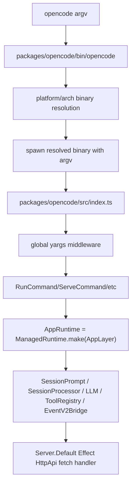

> V1 boot 节点描述 `opencode` 可执行文件怎样找到平台二进制、进入 yargs CLI、再把 Effect service graph 装配成 V1 runtime。

## 能回答的问题
- `bin/opencode` 如何找到真正执行的 native/bundled binary?
- V1 CLI 在哪里设置全局 env 与日志开关?
- `AppLayer` 把哪些 V1 service 组合进默认 runtime?
- V1 server 为什么是 Effect HttpApi 而不是 Hono?

## 端到端步骤

1. `bin/opencode` 以 node shebang 启动,保留用户传入的 argv,并定义 `run(target)` 使用 `spawn(target, process.argv.slice(2), { stdio: "inherit" })` 启动解析出的二进制。[E: packages/opencode/bin/opencode:1][E: packages/opencode/bin/opencode:10][E: packages/opencode/bin/opencode:11]

2. `bin/opencode` 为子进程转发 `SIGINT`、`SIGTERM`、`SIGHUP`,并优先读取 `process.env.OPENCODE_BIN_PATH` 作为 resolved binary override。[E: packages/opencode/bin/opencode:20][E: packages/opencode/bin/opencode:46][E: packages/opencode/bin/opencode:189]

3. `bin/opencode` 用 `os.platform()` 与 `os.arch()` 生成平台后缀;Linux x64 会读取 `/proc/cpuinfo` 探测 AVX2,读取失败则 `supportsAvx2()` 返回 false,后续候选名优先 baseline binary。[E: packages/opencode/bin/opencode:54][E: packages/opencode/bin/opencode:76][E: packages/opencode/bin/opencode:81][E: packages/opencode/bin/opencode:83][E: packages/opencode/bin/opencode:158]

4. `bin/opencode` 生成候选 package 名,从 wrapper 目录向上查找 `node_modules/<candidate>/bin/opencode`,用 `fs.existsSync(candidate)` 判定命中;全部失败时打印错误并退出。[E: packages/opencode/bin/opencode:126][E: packages/opencode/bin/opencode:171][E: packages/opencode/bin/opencode:177][E: packages/opencode/bin/opencode:178][E: packages/opencode/bin/opencode:190]

5. `index@packages/opencode/src/index.ts:45` 创建 yargs CLI,设置 parser config、script name、版本号和全局参数,再通过 middleware 设置 `OPENCODE_PRINT_LOGS`、`OPENCODE_LOG_LEVEL`、`OPENCODE_PURE`、`AGENT`、`OPENCODE`、`OPENCODE_PID` 等进程环境。[E: packages/opencode/src/index.ts:45][E: packages/opencode/src/index.ts:51][E: packages/opencode/src/index.ts:66]

6. `index@packages/opencode/src/index.ts:85` 注册 `RunCommand`,并在同一个 yargs chain 中注册 `ServeCommand`。[E: packages/opencode/src/index.ts:85][E: packages/opencode/src/index.ts:93]

7. `AppLayer@packages/opencode/src/effect/app-runtime.ts:55` 通过 `Layer.mergeAll` 汇集 V1 服务:Agent、Session、SessionPrompt、SessionProcessor、RuntimeFlags、EventV2Bridge、LLM、ToolRegistry 等都在这个默认 layer 里装配。[E: packages/opencode/src/effect/app-runtime.ts:55][E: packages/opencode/src/effect/app-runtime.ts:69][E: packages/opencode/src/effect/app-runtime.ts:75][E: packages/opencode/src/effect/app-runtime.ts:78][E: packages/opencode/src/effect/app-runtime.ts:79][E: packages/opencode/src/effect/app-runtime.ts:81][E: packages/opencode/src/effect/app-runtime.ts:85][E: packages/opencode/src/effect/app-runtime.ts:87][E: packages/opencode/src/effect/app-runtime.ts:93]

8. `AppRuntime@packages/opencode/src/effect/app-runtime.ts:108` 由 `ManagedRuntime.make(AppLayer)` 创建,并导出 `runSync`、`runPromise`、`runPromiseExit`、`runFork`、`runCallback`、`dispose` wrapper。[E: packages/opencode/src/effect/app-runtime.ts:108][E: packages/opencode/src/effect/app-runtime.ts:115][E: packages/opencode/src/effect/app-runtime.ts:116][E: packages/opencode/src/effect/app-runtime.ts:119][E: packages/opencode/src/effect/app-runtime.ts:122]

9. `Server.Default@packages/opencode/src/server/server.ts:55` 构造 process-local fetch handler 时使用 `HttpApiApp.webHandler().handler`;server listen 路径使用 `HttpRouter.serve(HttpApiApp.createRoutes(opts), ...)`,所以 V1 server 是 Effect HttpApi/HttpRouter 实现。[E: packages/opencode/src/server/server.ts:55][E: packages/opencode/src/server/server.ts:56][E: packages/opencode/src/server/server.ts:100][E: packages/opencode/src/server/server.ts:101]

## 关键决策点

- `AppLayer` 同时包含 `RuntimeFlags.defaultLayer` 与 `EventV2Bridge.defaultLayer`,因此 V1 runtime 图里已经装配 runtime flags 和 EventV2 bridge 这两个服务。[E: packages/opencode/src/effect/app-runtime.ts:78][E: packages/opencode/src/effect/app-runtime.ts:79]
- `AppLayer` 通过 `Layer.provideMerge(InstanceLayer.layer)` 补入 instance/workspace 相关上下文,这解释了 V1 runtime 中许多服务可以读取当前 instance scope。[E: packages/opencode/src/effect/app-runtime.ts:104]
- `Server.Default` 返回的 `app.fetch` 直接调用 `handler(request, HttpApiApp.context)`,这是 process-local server 能被 CLI 内部 fetch wrapper 复用的代码基础。[E: packages/opencode/src/server/server.ts:58]

## 深挖入口
- CLI 如何把 run 命令转成 session prompt: `spine.cli-to-session`
- V1 SessionPrompt/SessionProcessor/LLM 细节: `spine.v1-turn-loop`
- 项目、实例、location 的持久化边界: `persistence.project-instance-location`

## Sources
- packages/opencode/bin/opencode
- packages/opencode/src/index.ts
- packages/opencode/src/effect/app-runtime.ts
- packages/opencode/src/server/server.ts

## 相关
- [spine.cli-to-session](cli-to-session.md)
- [persistence.project-instance-location](../subsystems/persistence/project-instance-location.md)
