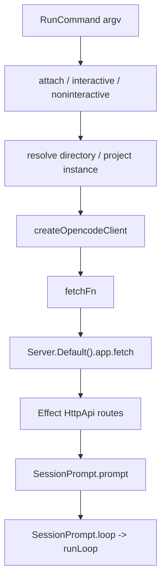

> V1 CLI-to-session 节点描述 `opencode run` 如何解析 directory/session/mode,创建 SDK client,再经 process-local Effect HttpApi server 调到 `SessionPrompt.prompt`。

## 能回答的问题
- `opencode run` 何时 attach 到已有 server,何时使用进程内 server?
- 非交互模式怎样创建或复用 session?
- CLI 怎样调用 `session.prompt` 或 `session.command`?
- process-local `fetch` 到底落到哪个 server handler?

## 端到端步骤

1. `RunCommand@packages/opencode/src/cli/cmd/run.ts:126` 声明 command 名为 `run [message..]`,并把 `instance` 设为 `(args) => !args.attach`;也就是说 attach 模式会避免启动新的 instance。[E: packages/opencode/src/cli/cmd/run.ts:126][E: packages/opencode/src/cli/cmd/run.ts:127][E: packages/opencode/src/cli/cmd/run.ts:131]

2. `RunCommand.handler@packages/opencode/src/cli/cmd/run.ts:263` 进入 Effect generator 后解析服务,包括 `Agent.Service`、`RuntimeFlags.Service`、`InstanceRef.Service`、`ServerAuth.Service`。[E: packages/opencode/src/cli/cmd/run.ts:263][E: packages/opencode/src/cli/cmd/run.ts:264][E: packages/opencode/src/cli/cmd/run.ts:268]

3. `handler@packages/opencode/src/cli/cmd/run.ts:333` 在 `args.dir` 存在时解析目标 root,并在非 attach 路径执行 `process.chdir(root)`;没有 `args.dir` 时非 attach 使用当前工作目录 root,attach 则不传本地 directory。[E: packages/opencode/src/cli/cmd/run.ts:333][E: packages/opencode/src/cli/cmd/run.ts:335][E: packages/opencode/src/cli/cmd/run.ts:336][E: packages/opencode/src/cli/cmd/run.ts:339]

4. attach 模式通过 `attachSDK` 调 `createOpencodeClient({ baseUrl: args.attach!, directory, headers })` 连接已有 server;本地非 attach 模式会构造 `fetchFn` 调 `Server.Default().app.fetch(request)`。[E: packages/opencode/src/cli/cmd/run.ts:349][E: packages/opencode/src/cli/cmd/run.ts:350][E: packages/opencode/src/cli/cmd/run.ts:351][E: packages/opencode/src/cli/cmd/run.ts:943][E: packages/opencode/src/cli/cmd/run.ts:949]

5. `Server.Default@packages/opencode/src/server/server.ts:56` 返回的 `app.fetch` 调用 `HttpApiApp.webHandler().handler`,因此 CLI 的本地 fetch wrapper 进入同一个 V1 Effect HttpApi handler。[E: packages/opencode/src/server/server.ts:56][E: packages/opencode/src/server/server.ts:57][E: packages/opencode/src/server/server.ts:59]

6. `session(sdk)@packages/opencode/src/cli/cmd/run.ts:456` 根据 `--session`、`--continue`、`--fork` 等参数选择已有 session、fork session、continue 最近 session 或创建新 session。[E: packages/opencode/src/cli/cmd/run.ts:456][E: packages/opencode/src/cli/cmd/run.ts:462][E: packages/opencode/src/cli/cmd/run.ts:492][E: packages/opencode/src/cli/cmd/run.ts:519]

7. `execute@packages/opencode/src/cli/cmd/run.ts:670` 获取 session id;非交互分支订阅 event stream,再调用 `client.session.command` 或 `client.session.prompt`。[E: packages/opencode/src/cli/cmd/run.ts:670][E: packages/opencode/src/cli/cmd/run.ts:828][E: packages/opencode/src/cli/cmd/run.ts:840][E: packages/opencode/src/cli/cmd/run.ts:859]

8. `loop@packages/opencode/src/cli/cmd/run.ts:697` 消费 SDK event stream,打印 message part 增量,并在收到当前 session 的 `session.status` 且状态为 `idle` 时结束等待;permission asked 事件在同一 loop 后段处理。[E: packages/opencode/src/cli/cmd/run.ts:697][E: packages/opencode/src/cli/cmd/run.ts:715][E: packages/opencode/src/cli/cmd/run.ts:788][E: packages/opencode/src/cli/cmd/run.ts:796]

9. API 进入 `SessionPrompt.prompt@packages/opencode/src/session/prompt.ts:1052` 后会创建 user message、更新 session 时间、记录输入权限;如果 `noReply` 不是 true,最后调用 `loop({ sessionID: input.sessionID })` 进入 V1 turn loop。[E: packages/opencode/src/session/prompt.ts:1052][E: packages/opencode/src/session/prompt.ts:1057][E: packages/opencode/src/session/prompt.ts:1058][E: packages/opencode/src/session/prompt.ts:1061][E: packages/opencode/src/session/prompt.ts:1069][E: packages/opencode/src/session/prompt.ts:1070]

## 关键决策点

- 非交互模式会要求必须有 message 或 command,否则打印 `You must provide a message or a command` 并 `process.exit(1)`;同一段还把 question/plan permission 默认设为 deny,避免 headless run 卡在用户交互上。[E: packages/opencode/src/cli/cmd/run.ts:420][E: packages/opencode/src/cli/cmd/run.ts:421][E: packages/opencode/src/cli/cmd/run.ts:422][E: packages/opencode/src/cli/cmd/run.ts:430]
- 本地交互路径也使用同一个 process-local fetch trick:`runInteractiveLocalMode` 收到的 fetch handler 同样调用 `Server.Default().app.fetch(request)`。[E: packages/opencode/src/cli/cmd/run.ts:902][E: packages/opencode/src/cli/cmd/run.ts:905][E: packages/opencode/src/cli/cmd/run.ts:911]
- `SessionPrompt.prompt` 的 `noReply` 分支会只写 user input 而不启动 assistant loop,这是 CLI/API 层能注入输入但不立即跑模型的 V1 控制点。[E: packages/opencode/src/session/prompt.ts:1069]

## 深挖入口
- V1 turn loop 的具体处理: `spine.v1-turn-loop`
- V1 HTTP API route 与 SDK client: `server.http-server`, `sdk.overview`

## Sources
- packages/opencode/src/cli/cmd/run.ts
- packages/opencode/src/server/server.ts
- packages/opencode/src/session/prompt.ts

## 相关
- [spine.v1-turn-loop](v1-turn-loop.md)
- [server.http-server](../subsystems/server/http-server.md)
- [sdk.overview](../surface/sdk/overview.md)
