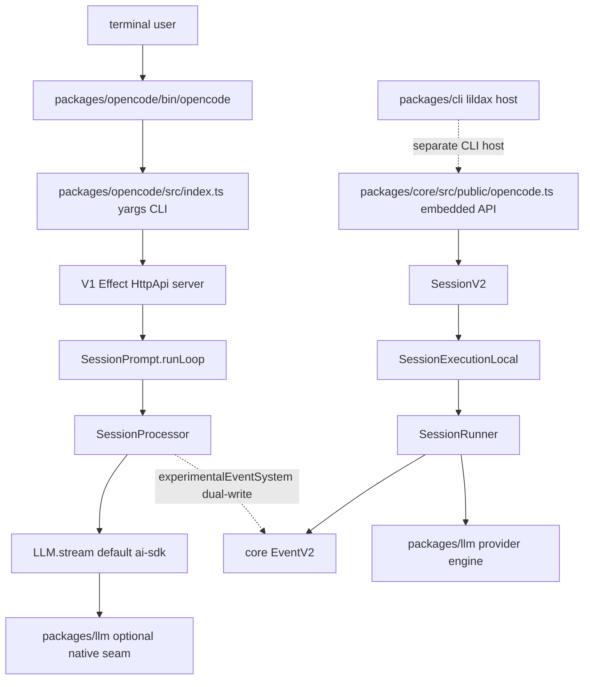

> opencode 是一个 Bun/TypeScript/Effect 多包 monorepo,当前默认用户路径仍由 `packages/opencode` 的 V1 CLI 与 V1 session loop 承担,V2 `packages/core` 是 Effect-native durable/event-sourced 新内核。

## 能回答的问题
- opencode 当前默认在跑的是 V1 还是 V2?
- `packages/opencode`、`packages/core`、`packages/llm` 各自负责什么?
- V1 为什么仍然会写入一部分 V2 event?
- `packages/cli` 与 `packages/opencode/src/cli` 是什么关系?
- 哪些命名容易误导 agent 检索?

## V1

`packages/opencode` 的 package 名称是 `opencode`,当前 package manifest 标记为 `private: true`,其 `bin` 字段声明 `opencode` 指向 `./bin/opencode`。[E: packages/opencode/package.json:4][E: packages/opencode/package.json:7][E: packages/opencode/package.json:18] 这个包依赖 `@opencode-ai/llm`、`@opencode-ai/sdk`、`@opencode-ai/server`、`@opencode-ai/tui`,并且仍直接依赖 Vercel AI SDK 的 `ai` 包。[E: packages/opencode/package.json:87][E: packages/opencode/package.json:110]

V1 CLI 入口是 `packages/opencode/src/index.ts`:它创建 yargs 实例,注册 `RunCommand`、`ServeCommand`、`AgentCommand` 等命令,最后调用 `cli.parse(...)` 或 `cli.parse()`。[E: packages/opencode/src/index.ts:45][E: packages/opencode/src/index.ts:85][E: packages/opencode/src/index.ts:90][E: packages/opencode/src/index.ts:93][E: packages/opencode/src/index.ts:120][E: packages/opencode/src/index.ts:126] V1 非 attach prompt 链可核为 `RunCommand -> process-local fetch SDK client -> session handler -> SessionPrompt.prompt -> SessionProcessor.process -> LLM.stream`:RunCommand 本地路径创建带 fetch wrapper 的 SDK client,非交互 prompt 调 `client.session.prompt`,session handler 调 `promptSvc.prompt`,SessionPrompt 再进入 `state.ensureRunning(... runLoop(...))`,processor 在 `llm.stream(streamInput)` 打开模型流。[E: packages/opencode/src/cli/cmd/run.ts:875][E: packages/opencode/src/cli/cmd/run.ts:793][E: packages/opencode/src/server/routes/instance/httpapi/handlers/session.ts:298][E: packages/opencode/src/session/prompt.ts:1392][E: packages/opencode/src/session/processor.ts:974]

V1 的 LLM runtime 默认走 AI SDK: `packages/opencode/src/session/llm.ts` 导入 `streamText` 与 `wrapLanguageModel`,并在默认分支调用 `streamText`。[E: packages/opencode/src/session/llm.ts:9][E: packages/opencode/src/session/llm.ts:280] `OPENCODE_EXPERIMENTAL_NATIVE_LLM` 对应的 native seam 会先尝试 `LLMNativeRuntime.stream`,不支持时回落到默认 runtime。[E: packages/opencode/src/session/llm.ts:226][E: packages/opencode/src/session/llm.ts:278]

## V2

`packages/core` 的 package 名称是 `@opencode-ai/core`,其 `exports` 显式暴露 `./public` 与 `./session/runner`,并通过 `./*` wildcard 暴露 `./src/*.ts` 下的 core modules。[E: packages/core/package.json:4][E: packages/core/package.json:18][E: packages/core/package.json:22] V2 session service 的 tag 是 `@opencode/v2/Session`,这也是区分 V2 core 与 V1 `packages/opencode/src/session/*` 的最短可靠锚点。[E: packages/core/src/session.ts:162]

V2 不是 V1 yargs CLI 的默认执行内核[I];当前源码中真正把 `SessionV2`、`SessionExecutionLocal`、`SessionProjector`、`EventV2`、`LocationServicesLayer` 接通成可调用 runtime 的公开入口是 `packages/core/src/public/opencode.ts` 的 `OpenCode.layer`。[E: packages/core/src/public/opencode.ts:70][E: packages/core/src/public/opencode.ts:83] `packages/cli` 是另一个 package,包名为 `@opencode-ai/cli`,bin 名为 `lildax`,并依赖 `@opencode-ai/core`、`@opencode-ai/server`、`@opencode-ai/tui`。[E: packages/cli/package.json:3][E: packages/cli/package.json:7][E: packages/cli/package.json:20]

V2 的设计约束来自根 `AGENTS.md`:prompt admission 必须 durable 且与 execution 分离,`SessionExecution` 是 process-global 且基于 `sessionID`,而 `SessionRunner`、model、tool registry、permission 等服务是 location-scoped。[E: AGENTS.md:150][E: AGENTS.md:152][E: AGENTS.md:153] 同一约束还要求每个 provider turn 只有一次显式 `llm.stream(request)`,provider/tool/history 的 continuation 由 runner 驱动,而不是把 provider stream 藏进多层 helper。[E: AGENTS.md:154]

## packages/llm

`packages/llm` 是 shared provider 协议引擎:它的架构文档把 `LLM.request(...)` 描述为构建 `LLMRequest`,把 `LLMClient.stream(request)` / `LLMClient.generate(request)` 描述为增量事件流或聚合响应入口,并把 route 分解为 Protocol、Endpoint、Auth、Framing 四个轴。[E: packages/llm/AGENTS.md:47][E: packages/llm/AGENTS.md:49][E: packages/llm/AGENTS.md:55] 在 V1 中,`packages/llm` 是 `OPENCODE_EXPERIMENTAL_NATIVE_LLM` 的可选 seam;在 V2 中,`SessionRunner` 文件直接从 `@opencode-ai/llm` 导入 `LLMClient`。[E: packages/opencode/src/session/llm.ts:226][E: packages/core/src/session/runner/llm.ts:3]

## 命名陷阱

两个 HTTP server 都是 Effect HttpApi/HttpRouter,不是 Hono:V1 server 通过 `HttpApiApp.webHandler` 与 `HttpRouter.serve(HttpApiApp.createRoutes(opts), ...)` 建路由,V2 server 通过 `HttpApi.make("server")` 与 `HttpApiBuilder.layer(Api, ...)` 建路由。[E: packages/opencode/src/server/server.ts:55][E: packages/opencode/src/server/server.ts:100][E: packages/server/src/api.ts:20][E: packages/server/src/routes.ts:14]

`packages/opencode/src/session/message-v2.ts` 的名字容易误导:该文件导入 V1 session 类型,同时导入 AI SDK 的 `convertToModelMessages` 和 `ModelMessage`,实际职责是 V1 message 与 AI SDK model message 的转换层,不是 `packages/core` 的 V2 session implementation。[E: packages/opencode/src/session/message-v2.ts:3][E: packages/opencode/src/session/message-v2.ts:23][E: packages/opencode/src/session/message-v2.ts:417]

`packages/core/src/connector.ts` 是本地 credential/login registry:它定义 connector `Info`、OAuth/key method、`Credential` 存取接口和 registry editor,不是云端连接器控制面。[E: packages/core/src/connector.ts:74][E: packages/core/src/connector.ts:96][E: packages/core/src/connector.ts:180][E: packages/core/src/connector.ts:191]

## 深挖入口
- V1 默认 turn loop: `spine.v1-turn-loop`
- V1/V2 dual-write 与嵌入式 V2 API: `spine.v1-v2-relationship`
- V2 admission/coordinator/provider turn: `spine.v2-admission`, `spine.v2-coordinator`, `spine.v2-provider-turn`
- 具体 trace: `spine.trace-first-prompt`, `spine.trace-tool-call`, `spine.trace-steer-mid-turn`, `spine.trace-compaction-overflow`

## Sources
- packages/opencode/src/index.ts
- packages/opencode/src/cli/cmd/run.ts
- packages/opencode/src/server/routes/instance/httpapi/handlers/session.ts
- packages/opencode/src/session/prompt.ts
- packages/opencode/src/session/processor.ts
- AGENTS.md
- package.json
- packages/opencode/package.json
- packages/core/package.json
- packages/cli/package.json
- packages/core/src/session.ts
- packages/core/src/public/opencode.ts
- packages/core/src/session/runner/llm.ts
- packages/llm/AGENTS.md
- packages/opencode/src/session/llm.ts
- packages/opencode/src/server/server.ts
- packages/server/src/api.ts
- packages/server/src/routes.ts
- packages/opencode/src/session/message-v2.ts
- packages/core/src/connector.ts

## 相关
- [spine.v1-v2-relationship](v1-v2-relationship.md)
- [ref.package-index](../reference/package-index.md)
