> Compaction overflow 在 V1 与 V2 中是两套实现:V1 在 `SessionPrompt.runLoop` 内创建 compaction user message 并用 V1 processor 生成 summary,V2 在 runner request budget 或 provider overflow recovery 中发布 V2 compaction events 并重建 turn。

## 能回答的问题
- V1 是在哪里判断 token overflow 并创建 compaction message?
- V1 provider context overflow 如何变成 `"compact"` 返回值?
- V2 request 超预算与 provider overflow 分别走哪条 compaction path?
- `session.next.compaction.ended.2` 为什么会触发 Context Epoch replacement?

```mermaid
flowchart TD
  subgraph V1["V1"]
    V1Loop["SessionPrompt.runLoop"] --> V1Check["compaction.isOverflow"]
    V1Check --> V1Create["compaction.create user compaction part"]
    V1Create --> V1Process["SessionCompaction.process"]
    V1Process --> V1Processor["SessionProcessor.process summary"]
    V1Processor --> V1Continue["continue/replay/autocontinue"]
  end
  subgraph V2["V2"]
    V2Runner["SessionRunner.runTurnAttempt"] --> V2Budget["compactIfNeeded request estimate"]
    V2Budget --> V2Started["Compaction.Started"]
    V2Started --> V2Summary["llm.stream summary request"]
    V2Summary --> V2Ended["Compaction.Ended v2"]
    V2Runner --> V2Overflow["provider overflow before assistant"]
    V2Overflow --> V2Recovery["compactAfterOverflow once"]
    V2Ended --> V2Rebuild["rebuild prepared turn + epoch replacement"]
  end
```

## V1

1. V1 regular loop 在每个 assistant step 前检查上一个 finished assistant 是否 summary 之外且 token overflow;命中时调用 `compaction.create({ auto: true })` 并继续 loop。[E: packages/opencode/src/session/prompt.ts:1214][E: packages/opencode/src/session/prompt.ts:1217][E: packages/opencode/src/session/prompt.ts:1219]

2. `SessionCompaction.isOverflow@packages/opencode/src/session/compaction.ts:178` 用配置、assistant tokens、model 与 `outputTokenMax` 判断 overflow。[E: packages/opencode/src/session/compaction.ts:178][E: packages/opencode/src/session/compaction.ts:182][E: packages/opencode/src/session/compaction.ts:186]

3. `SessionCompaction.create@packages/opencode/src/session/compaction.ts:554` 创建一个 V1 user message 和 compaction part;如果 experimental event system 打开,它同时发布 `SessionEvent.Compaction.Started`。[E: packages/opencode/src/session/compaction.ts:554][E: packages/opencode/src/session/compaction.ts:561][E: packages/opencode/src/session/compaction.ts:569][E: packages/opencode/src/session/compaction.ts:577]

4. 下一次 loop 看到 `task?.type === "compaction"` 时调用 `compaction.process`,并在 result 为 `"stop"` 时 break。[E: packages/opencode/src/session/prompt.ts:1202][E: packages/opencode/src/session/prompt.ts:1203][E: packages/opencode/src/session/prompt.ts:1210]

5. `SessionCompaction.process@packages/opencode/src/session/compaction.ts:299` 选择 compaction agent/model,计算 selected head/recent,把 V1 messages 转成 model messages,再创建 summary assistant message。[E: packages/opencode/src/session/compaction.ts:299][E: packages/opencode/src/session/compaction.ts:338][E: packages/opencode/src/session/compaction.ts:347][E: packages/opencode/src/session/compaction.ts:361][E: packages/opencode/src/session/compaction.ts:378]

6. V1 summary generation 复用 `SessionProcessor`:它创建 processor 并调用 `processor.process({ tools: {}, system: [], messages: [...modelMessages, user nextPrompt] })`。[E: packages/opencode/src/session/compaction.ts:405][E: packages/opencode/src/session/compaction.ts:410][E: packages/opencode/src/session/compaction.ts:414]

7. 如果 provider/processor 因 context overflow 抛 V1 `ContextOverflowError`,`SessionProcessor.halt` 在 auto compaction 允许时设置 `ctx.needsCompaction = true`;`process` 最后返回 `"compact"`。[E: packages/opencode/src/session/processor.ts:926][E: packages/opencode/src/session/processor.ts:934][E: packages/opencode/src/session/processor.ts:1030]

8. V1 compaction result 为 continue 且 auto 时,`SessionCompaction.process` 可以 replay overflow 前的 user message,或创建 synthetic continue prompt;完成 summary 后在 experimental event system 下发布 `SessionEvent.Compaction.Ended`。[E: packages/opencode/src/session/compaction.ts:444][E: packages/opencode/src/session/compaction.ts:445][E: packages/opencode/src/session/compaction.ts:495][E: packages/opencode/src/session/compaction.ts:538]

## V2

1. V2 runner 在 provider request 执行前调用 `compaction.compactIfNeeded({ sessionID, entries, model, request })`;如果 compaction 发生,runner die with `rebuildPreparedTurn()` 以重建同一 logical turn。[E: packages/core/src/session/runner/llm.ts:228][E: packages/core/src/session/runner/llm.ts:229]

2. `compactIfNeeded@packages/core/src/session/compaction.ts:230` 先检查 config auto、model context limit、request estimate;只有估算请求超过 `context - max(output, buffer)` 时才调用 `compactAfterOverflow`。[E: packages/core/src/session/compaction.ts:230][E: packages/core/src/session/compaction.ts:231][E: packages/core/src/session/compaction.ts:232][E: packages/core/src/session/compaction.ts:235][E: packages/core/src/session/compaction.ts:240]

3. `compactAfterOverflow@packages/core/src/session/compaction.ts:177` 选择要总结的 transcript head/recent,构造 summary prompt,发布 `SessionEvent.Compaction.Started`,再调用 `dependencies.llm.stream(LLM.request(...))` 生成 summary。[E: packages/core/src/session/compaction.ts:177][E: packages/core/src/session/compaction.ts:181][E: packages/core/src/session/compaction.ts:184][E: packages/core/src/session/compaction.ts:191][E: packages/core/src/session/compaction.ts:200]

4. V2 compaction summary 成功后发布 `SessionEvent.Compaction.Ended` v2 payload,包含 messageID、reason、text、recent。[E: packages/core/src/session/compaction.ts:220][E: packages/core/src/session/event.ts:457][E: packages/core/src/session/event.ts:462][E: packages/core/src/session/event.ts:464]

5. provider stream 中如果收到 context overflow provider error 且 assistant 尚未 started,runner 保存 `overflowFailure` 并停止发布该 error;stream closure 后如果 `recoverOverflow` 可用,runner 调 `compactAfterOverflow` 尝试一次恢复。[E: packages/core/src/session/runner/llm.ts:249][E: packages/core/src/session/runner/llm.ts:250][E: packages/core/src/session/runner/llm.ts:292][E: packages/core/src/session/runner/llm.ts:295]

6. overflow recovery 成功后,runner die with `continueAfterOverflowCompaction`;外层 `runTurn` 捕获该 transition 并调用 `runAfterOverflowCompaction(sessionID, undefined)` 重新执行 logical turn。[E: packages/core/src/session/runner/llm.ts:297][E: packages/core/src/session/runner/llm.ts:359][E: packages/core/src/session/runner/llm.ts:365]

7. 第二次 overflow recovery 被禁止:`runAfterOverflowCompaction` 捕获 `ContinueAfterOverflowCompaction` 时 die with `"Post-compaction provider attempt cannot recover another overflow"`。[E: packages/core/src/session/runner/llm.ts:345][E: packages/core/src/session/runner/llm.ts:350]

8. V2 `Compaction.Ended` projector 会忽略 v1 beta event,对 version 2 event 先投影 session message,再调用 `SessionContextEpoch.requestReplacement`,使后续 provider turn 使用新的 baseline boundary。[E: packages/core/src/session/projector.ts:438][E: packages/core/src/session/projector.ts:439][E: packages/core/src/session/projector.ts:443][E: packages/core/src/session/projector.ts:444]

## 关键决策点

- V1 compaction 是 V1 message/part 驱动:创建 user compaction part,再用 V1 processor 生成 summary assistant。[E: packages/opencode/src/session/compaction.ts:561][E: packages/opencode/src/session/compaction.ts:405]
- V2 compaction 是 event-sourced checkpoint:Started/Ended 是 session events,Ended v2 才携带 final summary 与 recent context。[E: packages/core/src/session/event.ts:424][E: packages/core/src/session/event.ts:457]
- V2 overflow recovery 只在 provider overflow 且 publisher 尚未 started assistant 时尝试;若已经有 overflow failure 需要发布,runner 会走普通 provider error 发布路径。[E: packages/core/src/session/runner/llm.ts:250][E: packages/core/src/session/runner/llm.ts:292][E: packages/core/src/session/runner/llm.ts:298]

## Sources
- packages/core/src/session/compaction.ts
- packages/opencode/src/session/compaction.ts
- packages/core/src/session/runner/llm.ts
- packages/core/src/session/projector.ts
- packages/opencode/src/session/prompt.ts
- packages/opencode/src/session/processor.ts
- packages/core/src/session/event.ts

## 相关
- [session-v2.compaction](../subsystems/session-v2/compaction.md)
- [session-v1.compaction-overflow](../subsystems/session-v1/compaction-overflow.md)
