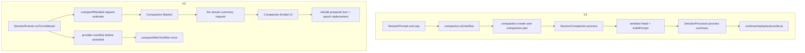

> Compaction overflow 在 V1 与 V2 中是两套实现:V1 在 `SessionPrompt.runLoop` 内创建 compaction user message，把 head history `serialize` 后复用 V2 `buildPrompt` 生成 summary；V2 在 runner request budget 或 provider overflow recovery 中发布 V2 compaction events 并重建 turn。

## 能回答的问题
- V1 是在哪里判断 token overflow 并创建 compaction message?
- V1 provider context overflow 如何变成 `"compact"` 返回值?
- V2 request 超预算与 provider overflow 分别走哪条 compaction path?
- `session.next.compaction.ended.2` 为什么会触发 Context Epoch replacement?

```mermaid
flowchart TD
  subgraph V1["V1"]
    V1Loop["SessionPrompt.runLoop"] --> V1Check["compaction.isOverflow"]
    V1Check --> V1Create["compaction.create user compaction part"]
    V1Create --> V1Process["SessionCompaction.process"]
    V1Process --> V1Serialize["serialize head + buildPrompt"]
    V1Serialize --> V1Processor["SessionProcessor.process summary"]
    V1Processor --> V1Continue["continue/replay/autocontinue"]
  end
  subgraph V2["V2"]
    V2Runner["SessionRunner.runTurnAttempt"] --> V2Budget["compactIfNeeded request estimate"]
    V2Budget --> V2Started["Compaction.Started"]
    V2Started --> V2Summary["llm.stream summary request"]
    V2Summary --> V2Ended["Compaction.Ended v2"]
    V2Runner --> V2Overflow["provider overflow before assistant"]
    V2Overflow --> V2Recovery["compactAfterOverflow once"]
    V2Ended --> V2Rebuild["rebuild prepared turn + epoch replacement"]
  end
```

## V1

1. V1 regular loop 在每个 assistant step 前检查上一个 finished assistant 是否 summary 之外且 token overflow;命中时调用 `compaction.create({ auto: true })` 并继续 loop。[E: packages/opencode/src/session/prompt.ts:1161][E: packages/opencode/src/session/prompt.ts:1164][E: packages/opencode/src/session/prompt.ts:1166][E: packages/opencode/src/session/prompt.ts:1167]

2. `SessionCompaction.isOverflow@packages/opencode/src/session/compaction.ts:203` 用配置、assistant tokens、model 与 `outputTokenMax` 判断 overflow。[E: packages/opencode/src/session/compaction.ts:203][E: packages/opencode/src/session/compaction.ts:207][E: packages/opencode/src/session/compaction.ts:211]

3. `SessionCompaction.create@packages/opencode/src/session/compaction.ts:559` 创建一个 V1 user message 和 compaction part;当前 V1 create path 只写 V1 message/part,不发布 V2 `Compaction.Started` mirror。[E: packages/opencode/src/session/compaction.ts:559][E: packages/opencode/src/session/compaction.ts:566][E: packages/opencode/src/session/compaction.ts:574][E: packages/opencode/src/session/compaction.ts:578]

4. 下一次 loop 看到 `task?.type === "compaction"` 时调用 `compaction.process`,并在 result 为 `"stop"` 时 break。[E: packages/opencode/src/session/prompt.ts:1149][E: packages/opencode/src/session/prompt.ts:1150][E: packages/opencode/src/session/prompt.ts:1157]

5. `SessionCompaction.process@packages/opencode/src/session/compaction.ts:319` 选择 compaction agent/model,计算 selected head/recent,把 head `serialize` 成 transcript,再复用 V2 `buildPrompt` 并创建 summary assistant message。[E: packages/opencode/src/session/compaction.ts:319][E: packages/opencode/src/session/compaction.ts:358][E: packages/opencode/src/session/compaction.ts:367][E: packages/opencode/src/session/compaction.ts:380][E: packages/opencode/src/session/compaction.ts:384][E: packages/opencode/src/session/compaction.ts:393]

6. V1 summary generation 复用 `SessionProcessor`:它创建 processor 并调用 `processor.process({ tools: {}, system: [], messages: [user nextPrompt] })`。`nextPrompt` 已包含 serialized conversation,不再把 head 作为独立 model messages 传入。[E: packages/opencode/src/session/compaction.ts:420][E: packages/opencode/src/session/compaction.ts:425][E: packages/opencode/src/session/compaction.ts:429][E: packages/opencode/src/session/compaction.ts:431][E: packages/opencode/src/session/compaction.ts:438]

7. 如果 provider/processor 因 context overflow 抛 V1 `ContextOverflowError`,`SessionProcessor.halt` 在 auto compaction 允许时设置 `ctx.needsCompaction = true`;`process` 最后返回 `"compact"`。[E: packages/opencode/src/session/processor.ts:607][E: packages/opencode/src/session/processor.ts:615][E: packages/opencode/src/session/processor.ts:679]

8. V1 compaction result 为 continue 且 auto 时,`SessionCompaction.process` 可以 replay overflow 前的 user message,或创建 synthetic continue prompt;完成 summary 后发布 V1 `SessionCompaction.Event.Compacted`。[E: packages/opencode/src/session/compaction.ts:469][E: packages/opencode/src/session/compaction.ts:471][E: packages/opencode/src/session/compaction.ts:497][E: packages/opencode/src/session/compaction.ts:540][E: packages/opencode/src/session/compaction.ts:554]

## V2

1. V2 runner 在 provider request 执行前调用 `compaction.compactIfNeeded({ sessionID, entries, model, request })`;如果 compaction 发生,runner die with `continueAfterCompaction(currentStep)` 以重建同一 logical turn。[E: packages/core/src/session/runner/llm.ts:215][E: packages/core/src/session/runner/llm.ts:216]

2. `compactIfNeeded@packages/core/src/session/compaction.ts:231` 先检查 config auto、model context limit、request estimate;只有估算请求超过 `context - max(output, buffer)` 时才调用 `compactAfterOverflow`。[E: packages/core/src/session/compaction.ts:231][E: packages/core/src/session/compaction.ts:232][E: packages/core/src/session/compaction.ts:233][E: packages/core/src/session/compaction.ts:237][E: packages/core/src/session/compaction.ts:241]

3. `compactAfterOverflow@packages/core/src/session/compaction.ts:178` 选择要总结的 transcript head/recent,构造 summary prompt,发布 `SessionEvent.Compaction.Started`,再调用 `dependencies.llm.stream(LLM.request(...))` 生成 summary。[E: packages/core/src/session/compaction.ts:178][E: packages/core/src/session/compaction.ts:182][E: packages/core/src/session/compaction.ts:185][E: packages/core/src/session/compaction.ts:192][E: packages/core/src/session/compaction.ts:202]

4. V2 compaction summary 成功后发布 `SessionEvent.Compaction.Ended` payload,包含 messageID、reason、text、recent。[E: packages/core/src/session/compaction.ts:221][E: packages/schema/src/session-event.ts:420][E: packages/schema/src/session-event.ts:425][E: packages/schema/src/session-event.ts:426][E: packages/schema/src/session-event.ts:427][E: packages/schema/src/session-event.ts:428]

5. provider stream 中如果收到 context overflow provider error 且 assistant 尚未 started,runner 保存 `overflowFailure` 并停止发布该 error;stream closure 后如果 `recoverOverflow` 可用,runner 调 `compactAfterOverflow` 尝试一次恢复。[E: packages/core/src/session/runner/llm.ts:231][E: packages/core/src/session/runner/llm.ts:236][E: packages/core/src/session/runner/llm.ts:237][E: packages/core/src/session/runner/llm.ts:238][E: packages/core/src/session/runner/llm.ts:283][E: packages/core/src/session/runner/llm.ts:286]

6. overflow recovery 成功后,runner die with `continueAfterOverflowCompaction`;外层 `runTurn` 捕获该 transition 并调用 `runAfterOverflowCompaction(sessionID, undefined)` 重新执行 logical turn。[E: packages/core/src/session/runner/llm.ts:288][E: packages/core/src/session/runner/llm.ts:370][E: packages/core/src/session/runner/llm.ts:375][E: packages/core/src/session/runner/llm.ts:376]

7. 第二次 overflow recovery 被禁止:`runAfterOverflowCompaction` 捕获 `ContinueAfterOverflowCompaction` 时 die with `"Post-compaction provider attempt cannot recover another overflow"`。[E: packages/core/src/session/runner/llm.ts:355][E: packages/core/src/session/runner/llm.ts:360][E: packages/core/src/session/runner/llm.ts:361]

8. V2 `Compaction.Ended` projector 通过通用 projection 写入 compaction message;后续 Context Epoch prepare 会读取 latest compaction seq,当 compaction seq 晚于 stored baseline 时走 replacement/reconcile 分支,使后续 provider turn 使用新的 baseline boundary。[E: packages/core/src/session/projector.ts:393][E: packages/core/src/session/history.ts:13][E: packages/core/src/session/history.ts:17][E: packages/core/src/session/context-epoch.ts:46][E: packages/core/src/session/context-epoch.ts:59][E: packages/core/src/session/context-epoch.ts:61]

## 关键决策点

- V1 compaction 是 V1 message/part 驱动:创建 user compaction part,serialize head transcript,再用 V1 processor 生成 summary assistant。[E: packages/opencode/src/session/compaction.ts:578][E: packages/opencode/src/session/compaction.ts:380][E: packages/opencode/src/session/compaction.ts:420][E: packages/opencode/src/session/compaction.ts:425]
- V1 与 V2 现在共享 `buildPrompt` / `SUMMARY_TEMPLATE`,但 V1 仍把 summary 写成 assistant message,V2 则发布 event-sourced checkpoint。[E: packages/opencode/src/session/compaction.ts:23][E: packages/core/src/session/compaction.ts:160][E: packages/schema/src/session-event.ts:420]
- V2 compaction 是 event-sourced checkpoint:Started/Ended 是 session events,Ended 才携带 final summary 与 recent context。[E: packages/schema/src/session-event.ts:399][E: packages/schema/src/session-event.ts:420][E: packages/schema/src/session-event.ts:427][E: packages/schema/src/session-event.ts:428]
- V2 overflow recovery 只在 provider overflow 且 publisher 尚未 started assistant 时尝试;若已经有 overflow failure 需要发布,runner 会走普通 provider error 发布路径。[E: packages/core/src/session/runner/llm.ts:237][E: packages/core/src/session/runner/llm.ts:283][E: packages/core/src/session/runner/llm.ts:289]

## Sources
- packages/core/src/session/compaction.ts
- packages/opencode/src/session/compaction.ts
- packages/core/src/session/runner/llm.ts
- packages/core/src/session/projector.ts
- packages/core/src/session/context-epoch.ts
- packages/core/src/session/history.ts
- packages/opencode/src/session/prompt.ts
- packages/opencode/src/session/processor.ts
- packages/schema/src/session-event.ts

## 相关
- [session-v2.compaction](../subsystems/session-v2/compaction.md)
- [session-v1.compaction-overflow](../subsystems/session-v1/compaction-overflow.md)
