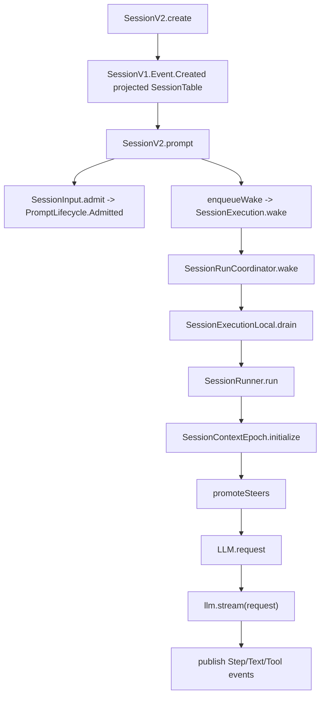

> 这条 trace 走读 V2 新 session 的第一次 prompt:session 已创建后,用户 prompt 先进入 durable inbox,execution wake 触发 runner,runner 初始化 Context Epoch,再执行第一轮 provider turn。

## 能回答的问题
- V2 first prompt 从 API 到模型调用的最短路径是什么?
- `PromptLifecycle.Admitted` 与 `PromptLifecycle.Promoted` 在 first prompt 中先后如何出现?
- 首次 System Context baseline 是在 prompt 可见前还是可见后初始化?
- 第一轮 provider stream 结束后怎样判断是否继续?

## 端到端步骤

1. `SessionV2.create@packages/core/src/session.ts:200` 为未提供 id 的 caller 生成 session id,先查 `SessionStore`,再解析 project 并发布 `SessionV1.Event.Created` 以投影 session read model。[E: packages/core/src/session.ts:200][E: packages/core/src/session.ts:201][E: packages/core/src/session.ts:202][E: packages/core/src/session.ts:233]

2. caller 调 `SessionV2.prompt@packages/core/src/session.ts:348` 时,service 先确认 session 存在,再准备 `returnPrompt` helper;该 helper 会在 `resume !== false` 时调用 `enqueueWake`。[E: packages/core/src/session.ts:348][E: packages/core/src/session.ts:351][E: packages/core/src/session.ts:352][E: packages/core/src/session.ts:353]

3. prompt id 未传入时,`SessionV2.prompt` 生成 `SessionMessage.ID`;delivery 未传入时默认 `"steer"`。[E: packages/core/src/session.ts:356][E: packages/core/src/session.ts:357]

4. `SessionInput.admit@packages/core/src/session.ts:359` 写入 durable admission;底层 `SessionInput.admit` 发布 `PromptLifecycle.Admitted`,并把 event seq 写成 `Admitted.admittedSeq`。[E: packages/core/src/session.ts:359][E: packages/core/src/session/input.ts:67][E: packages/core/src/session/input.ts:81]

5. `enqueueWake@packages/core/src/session.ts:176` 把 admission seq 交给 `execution.wake(admitted.sessionID, admitted.admittedSeq)`,并 fork 到当前 scope,所以 prompt admission 返回值与后续 execution drain 分离。[E: packages/core/src/session.ts:176][E: packages/core/src/session.ts:177][E: packages/core/src/session.ts:184]

6. 在 local execution layer 里,`wake` 映射到 `SessionRunCoordinator.wake`;如果 session idle,coordinator 会创建 wake entry 并 start owner fiber。[E: packages/core/src/session/execution/local.ts:28][E: packages/core/src/session/run-coordinator.ts:161][E: packages/core/src/session/run-coordinator.ts:172][E: packages/core/src/session/run-coordinator.ts:174]

7. owner fiber 的 drain 是 `SessionExecutionLocal.drain`:它通过 `SessionStore.get` 读取 session,用 `LocationServiceMap.get(session.location)` 取得 location-scoped services,再调用 `SessionRunner.run({ sessionID, force: mode === "run" })`。[E: packages/core/src/session/execution/local.ts:16][E: packages/core/src/session/execution/local.ts:18][E: packages/core/src/session/execution/local.ts:21]

8. `SessionRunner.run@packages/core/src/session/runner/llm.ts:373` 看到 pending steer 后进入 active loop;第一次 logical turn 的 promotion 值为 `"steer"`。[E: packages/core/src/session/runner/llm.ts:373][E: packages/core/src/session/runner/llm.ts:377][E: packages/core/src/session/runner/llm.ts:381]

9. `runTurnAttempt@packages/core/src/session/runner/llm.ts:180` 读取 session,选择 agent,然后在 promotion 之前调用 `SessionContextEpoch.initialize`。[E: packages/core/src/session/runner/llm.ts:180][E: packages/core/src/session/runner/llm.ts:183][E: packages/core/src/session/runner/llm.ts:184]

10. 首次 epoch 不存在时,`initializeOnce` 调 `SystemContext.initialize` 并 insert baseline/snapshot;runner 在 prompt promotion 前调用 initialize,随后把 `system.baseline` 放入 provider request system parts。[E: packages/core/src/session/context-epoch.ts:119][E: packages/core/src/session/context-epoch.ts:120][E: packages/core/src/session/context-epoch.ts:121][E: packages/core/src/session/runner/llm.ts:184][E: packages/core/src/session/runner/llm.ts:222]

11. runner 取得 cutoff seq 后调用 `SessionInput.promoteSteers`;promotion publish helper 发布 `PromptLifecycle.Promoted`,projector 再通过 `projectPromoted` 与 `insertMessage` 把 inbox row 转成 `SessionMessage.User` 并写入 projected messages。[E: packages/core/src/session/runner/llm.ts:193][E: packages/core/src/session/runner/llm.ts:194][E: packages/core/src/session/runner/llm.ts:195][E: packages/core/src/session/input.ts:300][E: packages/core/src/session/input.ts:280][E: packages/core/src/session/input.ts:144][E: packages/core/src/session/input.ts:345][E: packages/core/src/session/projector.ts:397][E: packages/core/src/session/projector.ts:401]

12. runner 重新读取 session/model/history,materialize tools,构造 `LLM.request`,并把 `system.baseline` 放入 provider system parts。[E: packages/core/src/session/runner/llm.ts:211][E: packages/core/src/session/runner/llm.ts:214][E: packages/core/src/session/runner/llm.ts:215][E: packages/core/src/session/runner/llm.ts:219][E: packages/core/src/session/runner/llm.ts:222]

13. provider turn 在 `llm.stream(request)` 处打开一次 stream;每个 LLM event 经过 `publisher.publish(event)` 投影成 session events。[E: packages/core/src/session/runner/llm.ts:245][E: packages/core/src/session/runner/llm.ts:255]

14. publisher 在收到 text start/delta/end 时发布 Text events,step finish 时 flush 并发布 `SessionEvent.Step.Ended`。[E: packages/core/src/session/runner/publish-llm-event.ts:226][E: packages/core/src/session/runner/publish-llm-event.ts:235][E: packages/core/src/session/runner/publish-llm-event.ts:245][E: packages/core/src/session/runner/publish-llm-event.ts:117][E: packages/core/src/session/runner/publish-llm-event.ts:376]

15. stream 成功结束且没有 provider error 时,runner 返回 `needsContinuation`;outer loop 若没有 continuation 也没有新的 steer,再检查 queue,没有 queue 就退出 drain。[E: packages/core/src/session/runner/llm.ts:332][E: packages/core/src/session/runner/llm.ts:336][E: packages/core/src/session/runner/llm.ts:388][E: packages/core/src/session/runner/llm.ts:393]

## 关键决策点

- first prompt 的 user text 在 `PromptLifecycle.Promoted` 前只是 durable inbox;V2 spec 明确说 admitted inputs 在 runner 发布 `PromptLifecycle.Promoted` 前不进入 model-visible Session history。[E: packages/core/src/session/input.ts:21][E: packages/core/src/session/input.ts:280][E: specs/v2/session.md:30]
- first prompt 的 baseline 初始化早于 prompt promotion;如果 context source unavailable,`SystemContext.initialize` 会阻塞 initialization,runner 不会把 pending prompt 提前变成 model-visible history。[E: packages/core/src/session/runner/llm.ts:184][E: packages/core/src/system-context/index.ts:197]
- execution wake 是 advisory:prompt admission 可以返回 `Admitted`,而 drain 失败通过 forked wake 的 log path 处理。[E: packages/core/src/session.ts:176][E: packages/core/src/session.ts:178]

## Sources
- packages/core/src/session.ts
- packages/core/src/session/input.ts
- packages/core/src/session/context-epoch.ts
- packages/core/src/system-context/index.ts
- packages/core/src/session/projector.ts
- packages/core/src/session/execution/local.ts
- packages/core/src/session/run-coordinator.ts
- packages/core/src/session/runner/llm.ts
- packages/core/src/session/runner/publish-llm-event.ts
- specs/v2/session.md

## 相关
- [spine.v2-admission](v2-admission.md)
- [spine.v2-provider-turn](v2-provider-turn.md)
