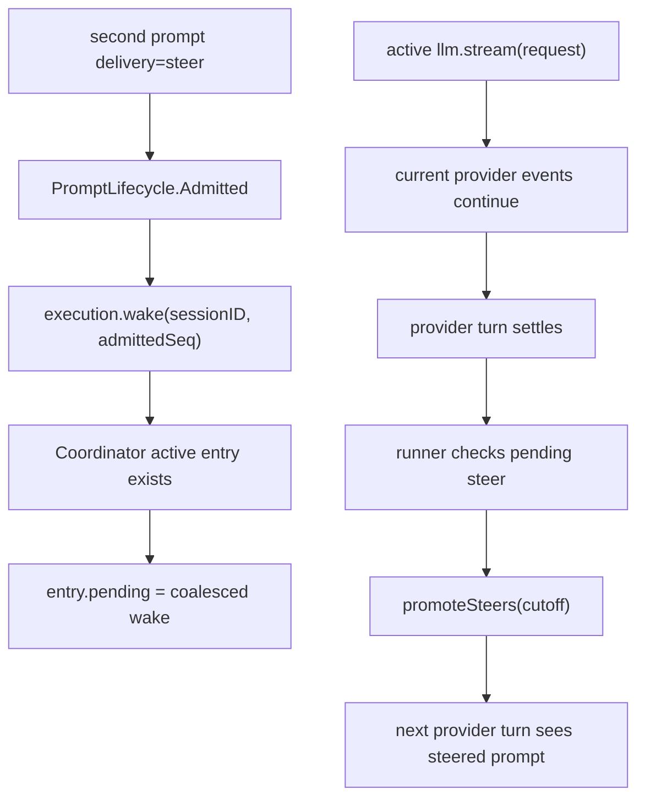

> V2 mid-turn steer 是把新的 user prompt 作为 durable steer input 入列,再通过 coordinator wake/coalesce 让当前或下一次 safe boundary promote;它不会直接改写已经打开的 provider stream。[I]

## 能回答的问题
- 用户在 V2 provider turn 进行中再次 prompt 会发生什么?
- active drain 中的 wake 如何 coalesce?
- steer prompt 在哪个安全边界进入 model-visible history?
- mid-turn steer 会不会直接插入正在进行的 provider stream?

## 端到端步骤

1. mid-turn user input still enters through `SessionV2.prompt@packages/core/src/session.ts:348`;the method requires the session to exist, generates/uses a message id, and defaults delivery to `"steer"` if caller omits delivery。[E: packages/core/src/session.ts:348][E: packages/core/src/session.ts:351][E: packages/core/src/session.ts:356][E: packages/core/src/session.ts:357]

2. `SessionInput.admit@packages/core/src/session.ts:359` calls the admission path that publishes `PromptLifecycle.Admitted`;the projector stores the input row without `promoted_seq`, pending checks look for `promoted_seq IS NULL`, and promotion is the path that sets `promoted_seq`。[E: packages/core/src/session.ts:359][E: packages/core/src/session/input.ts:68][E: packages/core/src/session/input.ts:128][E: packages/core/src/session/input.ts:156][E: packages/core/src/session/input.ts:188]

3. `returnPrompt@packages/core/src/session.ts:352` calls `enqueueWake` unless `resume === false`;`enqueueWake` forwards the admitted seq to `execution.wake` in a forked fiber。[E: packages/core/src/session.ts:352][E: packages/core/src/session.ts:353][E: packages/core/src/session.ts:176][E: packages/core/src/session.ts:177]

4. 如果同一 session 的 drain 正在 active,`SessionRunCoordinator.wake` 会读取 active entry,检查 `acceptsWake`,并把 `{ _tag: "wake", seq }` 合并到 `entry.pending`。[E: packages/core/src/session/run-coordinator.ts:165][E: packages/core/src/session/run-coordinator.ts:167][E: packages/core/src/session/run-coordinator.ts:168]

5. wake coalesce 使用 `maxSeq`,所以多个 steer wake 在同一 active drain 中会合并成一个 pending wake,保留最新 admitted seq。[E: packages/core/src/session/run-coordinator.ts:53][E: packages/core/src/session/run-coordinator.ts:55]

6. 当前 provider stream 的 event loop 仍围绕已经构造好的 `request` 运行;源码中的 stream loop只处理 provider event、publisher 与 local tool settle,没有读取新的 inbox row 来修改当前 request。[E: packages/core/src/session/runner/llm.ts:245][E: packages/core/src/session/runner/llm.ts:255][I]

7. 当前 provider turn 结束后,outer runner loop 把下一轮 promotion 设为 `"steer"`;如果本轮没有 continuation,它会调用 `SessionInput.hasPending(..., "steer")` 检查是否已有新 steer input。[E: packages/core/src/session/runner/llm.ts:386][E: packages/core/src/session/runner/llm.ts:387][E: packages/core/src/session/runner/llm.ts:388]

8. 当 runner 进入下一次 `runTurnAttempt` 且 promotion 为 `"steer"` 时,它先读取 latest seq 作为 cutoff,再调用 `SessionInput.promoteSteers(db, events, session.id, cutoff)`。[E: packages/core/src/session/runner/llm.ts:193][E: packages/core/src/session/runner/llm.ts:194][E: packages/core/src/session/runner/llm.ts:195]

9. `promoteSteers@packages/core/src/session/input.ts:300` 选择当前 session 中 `promoted_seq IS NULL`、delivery 为 `"steer"`、且 `admitted_seq <= cutoff` 的 rows,按 admitted seq 升序交给 `publish`,而 `publish` 对每行发布 `PromptLifecycle.Promoted`。[E: packages/core/src/session/input.ts:300][E: packages/core/src/session/input.ts:311][E: packages/core/src/session/input.ts:312][E: packages/core/src/session/input.ts:313][E: packages/core/src/session/input.ts:314][E: packages/core/src/session/input.ts:317][E: packages/core/src/session/input.ts:280][E: packages/core/src/session/input.ts:320]

10. 如果当前 drain 在看到 pending steer 前已经完全结束,coordinator `settle` 会在发现 `entry.pending` 后把 pending 升为 current 并 start successor drain。[E: packages/core/src/session/run-coordinator.ts:131][E: packages/core/src/session/run-coordinator.ts:132][E: packages/core/src/session/run-coordinator.ts:136]

11. interrupt 会改变这条路径:coordinator `interrupt` 记录 interrupt seq 并调用 `suppressPendingAtOrBefore`,所以不晚于 interrupt seq 的 pending wake 会被清理。[E: packages/core/src/session/run-coordinator.ts:193][E: packages/core/src/session/run-coordinator.ts:199][E: packages/core/src/session/run-coordinator.ts:215][E: packages/core/src/session/run-coordinator.ts:257]

## 关键决策点

- steer 是 durable inbox 语义: admission 先发布 lifecycle event 并投影到 `SessionInputTable`,之后 promotion 才把 row 提升到 model-visible message;它不是 provider stream 的即时 stdin,因为当前 stream loop 只消费已建立的 `llm.stream(request)` 事件。[E: packages/core/src/session/input.ts:68][E: packages/core/src/session/input.ts:128][E: packages/core/src/session/input.ts:280][E: packages/core/src/session/runner/llm.ts:193][E: packages/core/src/session/runner/llm.ts:245][I]
- coordinator pending wake 是兜底机制:当前 drain 如果自己看到 pending steer 会继续,如果没看到也会由 pending successor drain 重新检查。[E: packages/core/src/session/runner/llm.ts:388][E: packages/core/src/session/run-coordinator.ts:132]
- `resume: false` 会跳过 `enqueueWake`,因此只 admission 而不主动唤醒 runner。[E: packages/core/src/session.ts:352][E: packages/core/src/session.ts:353]

## Sources
- packages/core/src/session.ts
- packages/core/src/session/input.ts
- packages/core/src/session/run-coordinator.ts
- packages/core/src/session/runner/llm.ts

## 相关
- [spine.v2-coordinator](v2-coordinator.md)
- [session-v2.inbox](../subsystems/session-v2/inbox.md)
