> Tool call trace 在 V1 与 V2 中不是同一条机制:V1 依赖 AI SDK tool execution wrapper 与 `SessionProcessor` 更新 V1 parts,V2 由 runner 在 durable `Tool.Called` 后 settle local tool 并发布 `Tool.Success/Failed`。

## 能回答的问题
- V1 tool execute wrapper 在哪里创建 `ctx.ask` 与 plugin hook?
- V1 `tool-call` / `tool-result` 事件如何更新 message part?
- V2 什么时候认为 tool call 已 durable?
- V2 local tool execution 的 result 怎样回到同一个 LLM event publisher?

```mermaid
flowchart TD
  subgraph V1["V1 AI SDK path"]
    V1Resolve["SessionTools.resolve"] --> V1AITool["AI SDK tool({ execute })"]
    V1AITool --> V1LLM["LLM.stream"]
    V1LLM --> V1Processor["SessionProcessor handleEvent"]
    V1Processor --> V1Part["V1 tool part running/completed/error"]
  end
  subgraph V2["V2 runner path"]
    V2Stream["llm.stream(request)"] --> V2Publish["publisher.publish(tool-call)"]
    V2Publish --> V2Called["SessionEvent.Tool.Called"]
    V2Called --> V2Settle["toolMaterialization.settle"]
    V2Settle --> V2Result["LLMEvent.toolResult"]
    V2Result --> V2Publish2["publisher.publish(tool-result)"]
    V2Publish2 --> V2Done["Tool.Success / Tool.Failed"]
  end
```

## V1

1. `SessionPrompt.runLoop@packages/opencode/src/session/prompt.ts:1226` 调 `SessionTools.resolve` 生成 AI SDK tools,随后 `handle.process` input 把 `tools` 传给 model runtime。[E: packages/opencode/src/session/prompt.ts:1226][E: packages/opencode/src/session/prompt.ts:1271][E: packages/opencode/src/session/prompt.ts:1282]

2. `SessionTools.resolve@packages/opencode/src/session/tools.ts:39` 构造每个 tool 的 execution context;context 包含 sessionID、messageID、callID、agent、messages、metadata updater 与 `ask` permission helper。[E: packages/opencode/src/session/tools.ts:39][E: packages/opencode/src/session/tools.ts:56][E: packages/opencode/src/session/tools.ts:57][E: packages/opencode/src/session/tools.ts:59][E: packages/opencode/src/session/tools.ts:60][E: packages/opencode/src/session/tools.ts:62][E: packages/opencode/src/session/tools.ts:63][E: packages/opencode/src/session/tools.ts:64][E: packages/opencode/src/session/tools.ts:78]

3. 对 registry tools,`SessionTools.resolve` 调 AI SDK `tool({ description, inputSchema, execute })`;execute 触发 `tool.execute.before`,执行 `item.execute(args, ctx)`,再触发 `tool.execute.after`。[E: packages/opencode/src/session/tools.ts:89][E: packages/opencode/src/session/tools.ts:95][E: packages/opencode/src/session/tools.ts:98][E: packages/opencode/src/session/tools.ts:102][E: packages/opencode/src/session/tools.ts:107][E: packages/opencode/src/session/tools.ts:117]

4. 对 MCP resource tools,wrapper 会先调用 `ctx.ask({ permission: "read", ... })`,再从 MCP server 读取 resources 并排序/转换为 tool output。[E: packages/opencode/src/session/tools.ts:136][E: packages/opencode/src/session/tools.ts:151][E: packages/opencode/src/session/tools.ts:176][E: packages/opencode/src/session/tools.ts:183][E: packages/opencode/src/session/tools.ts:186]

5. `SessionProcessor.process@packages/opencode/src/session/processor.ts:625` 从 V1 `LLM.stream` 读 LLM events;`tool-call` 分支确保 V1 tool part 存在,并把 tool part 置为 running。[E: packages/opencode/src/session/processor.ts:625][E: packages/opencode/src/session/processor.ts:638][E: packages/opencode/src/session/processor.ts:329][E: packages/opencode/src/session/processor.ts:333][E: packages/opencode/src/session/processor.ts:335][E: packages/opencode/src/session/processor.ts:342]

6. V1 `tool-result` 分支会按 result error/success 把 V1 tool part fail 或 complete,并对 image attachments 做 normalize。[E: packages/opencode/src/session/processor.ts:381][E: packages/opencode/src/session/processor.ts:384][E: packages/opencode/src/session/processor.ts:385][E: packages/opencode/src/session/processor.ts:388][E: packages/opencode/src/session/processor.ts:389][E: packages/opencode/src/session/processor.ts:410]

7. V1 cleanup 会在 processor 结束时等待短暂 tool call settle,并把剩余 running tool 标成 interrupted/error,避免悬挂 part 留在 assistant message 中。[E: packages/opencode/src/session/processor.ts:537][E: packages/opencode/src/session/processor.ts:569][E: packages/opencode/src/session/processor.ts:571][E: packages/opencode/src/session/processor.ts:575][E: packages/opencode/src/session/processor.ts:581][E: packages/opencode/src/session/processor.ts:585][E: packages/opencode/src/session/processor.ts:586]

## V2

1. V2 runner 在构造 request 前调用 `tools.materialize(agent.info?.permissions)`,把当前 location/agent 下可用 tool materialize 成 provider definitions 与 settlement handle。[E: packages/core/src/session/runner/llm.ts:198]

2. provider request 把 `toolMaterialization.definitions` 放进 `LLM.request({ ..., tools })`,随后一次 `llm.stream(request)` 打开 provider stream。[E: packages/core/src/session/runner/llm.ts:200][E: packages/core/src/session/runner/llm.ts:207][E: packages/core/src/session/runner/llm.ts:227]

3. `publisher.publish(tool-call)` 会确保 tool input 已 start/end,检查重复 call,记录 `providerExecuted` 与 provider metadata,然后发布 `SessionEvent.Tool.Called`;publisher 返回的 `publish`/`flush`/`failUnsettledTools` 等接口只持久化 provider turn 事件,tool side effect 由 runner 执行。[E: packages/core/src/session/runner/publish-llm-event.ts:313][E: packages/core/src/session/runner/publish-llm-event.ts:316][E: packages/core/src/session/runner/publish-llm-event.ts:319][E: packages/core/src/session/runner/publish-llm-event.ts:321][E: packages/core/src/session/runner/publish-llm-event.ts:323][E: packages/core/src/session/runner/publish-llm-event.ts:413]

4. runner 只对非 provider-executed tool call 启动 local settlement;它先通过 `publisher.assistantMessageID(event.id)` 取得 durable assistant message id,再调用 `toolMaterialization.settle({ sessionID, agent, assistantMessageID, call })`。[E: packages/core/src/session/runner/llm.ts:238][E: packages/core/src/session/runner/llm.ts:244][E: packages/core/src/session/runner/llm.ts:247]

5. settlement 成功后,runner 构造 `LLMEvent.toolResult({ id, name, result, output })` 并交回同一个 `publish` 函数;outputPaths 也随 settlement 传入 publisher。[E: packages/core/src/session/runner/llm.ts:255][E: packages/core/src/session/runner/llm.ts:256][E: packages/core/src/session/runner/llm.ts:262]

6. `publisher.publish(tool-result)` 校验 tool 已 called 且未 settled,然后把成功映射为 `SessionEvent.Tool.Success`,把 error result 映射为 `SessionEvent.Tool.Failed`。[E: packages/core/src/session/runner/publish-llm-event.ts:337][E: packages/core/src/session/runner/publish-llm-event.ts:339][E: packages/core/src/session/runner/publish-llm-event.ts:346][E: packages/core/src/session/runner/publish-llm-event.ts:352][E: packages/core/src/session/runner/publish-llm-event.ts:364]

7. V2 historical replay 会把 completed/error tool state 转回 provider message:completed/error tool result 都在 `toLLMMessage` 的 toolResult 分支里处理,assistant-local tool result 会以 `Message.tool` 形式单独返回。[E: packages/core/src/session/runner/to-llm-message.ts:39][E: packages/core/src/session/runner/to-llm-message.ts:70]

## 关键决策点

- V1 tool execution 与 permission ask 包在 AI SDK tool execute wrapper 中;V2 local tool execution 包在 runner 的 `toolMaterialization.settle` 中。[E: packages/opencode/src/session/tools.ts:98][E: packages/opencode/src/session/tools.ts:78][E: packages/core/src/session/runner/llm.ts:247]
- V2 ordering 是 runner 先 `publisher.publish(tool-call)`,再对 local tool call 执行 `toolMaterialization.settle`,随后把 settlement 转成 `LLMEvent.toolResult` 并交回 publisher;publisher 再发布 `Tool.Success` 或 `Tool.Failed`。[E: packages/core/src/session/runner/llm.ts:237][E: packages/core/src/session/runner/llm.ts:247][E: packages/core/src/session/runner/llm.ts:255][E: packages/core/src/session/runner/llm.ts:256][E: packages/core/src/session/runner/publish-llm-event.ts:352][E: packages/core/src/session/runner/publish-llm-event.ts:364]
- V1 tool call state is V1 part state;V2 Tool events are produced by V2 publisher/runner, so V1 AI SDK tool execution is not equivalent to V2 durable settlement。[E: packages/opencode/src/session/processor.ts:335][E: packages/opencode/src/session/processor.ts:381][E: packages/core/src/session/runner/publish-llm-event.ts:323][E: packages/core/src/session/runner/publish-llm-event.ts:364]

## Sources
- packages/core/src/session/runner/llm.ts
- packages/core/src/session/runner/publish-llm-event.ts
- packages/core/src/session/runner/to-llm-message.ts
- packages/opencode/src/session/prompt.ts
- packages/opencode/src/session/tools.ts
- packages/opencode/src/session/processor.ts

## 相关
- [spine.v2-provider-turn](v2-provider-turn.md)
- [subsys.tools.v2](../subsystems/tools/v2.md)
