> Tool call trace 在 V1 与 V2 中不是同一条机制:V1 依赖 AI SDK tool execution wrapper 与 `SessionProcessor` 更新 V1 parts,V2 由 runner 在 durable `Tool.Called` 后 settle local tool 并发布 `Tool.Success/Failed`。

## 能回答的问题
- V1 tool execute wrapper 在哪里创建 `ctx.ask` 与 plugin hook?
- V1 `tool-call` / `tool-result` 事件如何更新 message part?
- V2 什么时候认为 tool call 已 durable?
- V2 local tool execution 的 result 怎样回到同一个 LLM event publisher?

```mermaid
flowchart TD
  subgraph V1["V1 AI SDK path"]
    V1Resolve["SessionTools.resolve"] --> V1AITool["AI SDK tool({ execute })"]
    V1AITool --> V1LLM["LLM.stream"]
    V1LLM --> V1Processor["SessionProcessor handleEvent"]
    V1Processor --> V1Part["V1 tool part running/completed/error"]
    V1Processor -. "experimentalEventSystem" .-> V1Mirror["V2 Tool events mirror"]
  end
  subgraph V2["V2 runner path"]
    V2Stream["llm.stream(request)"] --> V2Publish["publisher.publish(tool-call)"]
    V2Publish --> V2Called["SessionEvent.Tool.Called"]
    V2Called --> V2Settle["toolMaterialization.settle"]
    V2Settle --> V2Result["LLMEvent.toolResult"]
    V2Result --> V2Publish2["publisher.publish(tool-result)"]
    V2Publish2 --> V2Done["Tool.Success / Tool.Failed"]
  end
```

## V1

1. `SessionPrompt.runLoop@packages/opencode/src/session/prompt.ts:1279` 调 `SessionTools.resolve` 生成 AI SDK tools,随后 `handle.process` input 把 `tools` 传给 model runtime。[E: packages/opencode/src/session/prompt.ts:1279][E: packages/opencode/src/session/prompt.ts:1336][E: packages/opencode/src/session/prompt.ts:1344]

2. `SessionTools.resolve@packages/opencode/src/session/tools.ts:24` 构造每个 tool 的 execution context;context 包含 sessionID、messageID、callID、agent、messages、metadata updater 与 `ask` permission helper。[E: packages/opencode/src/session/tools.ts:24][E: packages/opencode/src/session/tools.ts:41][E: packages/opencode/src/session/tools.ts:63]

3. 对 registry tools,`SessionTools.resolve` 调 AI SDK `tool({ description, inputSchema, execute })`;execute 触发 `tool.execute.before`,执行 `item.execute(args, ctx)`,再触发 `tool.execute.after`。[E: packages/opencode/src/session/tools.ts:80][E: packages/opencode/src/session/tools.ts:83][E: packages/opencode/src/session/tools.ts:87][E: packages/opencode/src/session/tools.ts:92][E: packages/opencode/src/session/tools.ts:102]

4. 对 MCP tools,wrapper 会先调用 `ctx.ask({ permission: key, ... })`,再执行 MCP 原始 `execute(args, opts)`,并把 text/image/resource content 转成 V1 output/attachments。[E: packages/opencode/src/session/tools.ts:124][E: packages/opencode/src/session/tools.ts:134][E: packages/opencode/src/session/tools.ts:152][E: packages/opencode/src/session/tools.ts:183]

5. `SessionProcessor.process@packages/opencode/src/session/processor.ts:974` 从 V1 `LLM.stream` 读 LLM events;`tool-call` 分支会在 experimental mirror 下发布 `SessionEvent.Tool.Called`,并把 V1 tool part 置为 running。[E: packages/opencode/src/session/processor.ts:974][E: packages/opencode/src/session/processor.ts:468]

6. V1 `tool-result` 分支会按 result error/success 发布 mirrored V2 `Tool.Failed` 或 `Tool.Success`,再把 V1 tool part fail 或 complete。[E: packages/opencode/src/session/processor.ts:549][E: packages/opencode/src/session/processor.ts:556][E: packages/opencode/src/session/processor.ts:569][E: packages/opencode/src/session/processor.ts:631][E: packages/opencode/src/session/processor.ts:645]

7. V1 cleanup 会在 processor 结束时等待短暂 tool call settle,并把剩余 running tool 标成 interrupted/error,避免悬挂 part 留在 assistant message 中。[E: packages/opencode/src/session/processor.ts:846][E: packages/opencode/src/session/processor.ts:879][E: packages/opencode/src/session/processor.ts:901][E: packages/opencode/src/session/processor.ts:905][E: packages/opencode/src/session/processor.ts:907][E: packages/opencode/src/session/processor.ts:1027]

## V2

1. V2 runner 在构造 request 前调用 `tools.materialize(agent.info?.permissions)`,把当前 location/agent 下可用 tool materialize 成 provider definitions 与 settlement handle。[E: packages/core/src/session/runner/llm.ts:217]

2. provider request 把 `toolMaterialization.definitions` 放进 `LLM.request({ ..., tools })`,随后一次 `llm.stream(request)` 打开 provider stream。[E: packages/core/src/session/runner/llm.ts:219][E: packages/core/src/session/runner/llm.ts:226][E: packages/core/src/session/runner/llm.ts:245]

3. `publisher.publish(tool-call)` 会确保 tool input 已 start/end,检查重复 call,记录 `providerExecuted` 与 provider metadata,然后发布 `SessionEvent.Tool.Called`;publisher 文件的职责注释是持久化一个 provider turn,不执行 tools 或启动 continuation turn。[E: packages/core/src/session/runner/publish-llm-event.ts:293][E: packages/core/src/session/runner/publish-llm-event.ts:300][E: packages/core/src/session/runner/publish-llm-event.ts:303][E: packages/core/src/session/runner/publish-llm-event.ts:53]

4. runner 只对非 provider-executed tool call 启动 local settlement;它先通过 `publisher.assistantMessageID(event.id)` 取得 durable assistant message id,再调用 `toolMaterialization.settle({ sessionID, agent, assistantMessageID, call })`。[E: packages/core/src/session/runner/llm.ts:256][E: packages/core/src/session/runner/llm.ts:258][E: packages/core/src/session/runner/llm.ts:261]

5. settlement 成功后,runner 构造 `LLMEvent.toolResult({ id, name, result, output })` 并交回同一个 `publish` 函数;outputPaths 也随 settlement 传入 publisher。[E: packages/core/src/session/runner/llm.ts:269][E: packages/core/src/session/runner/llm.ts:270][E: packages/core/src/session/runner/llm.ts:276]

6. `publisher.publish(tool-result)` 校验 tool 已 called 且未 settled,然后把成功映射为 `SessionEvent.Tool.Success`,把 error result 映射为 `SessionEvent.Tool.Failed`。[E: packages/core/src/session/runner/publish-llm-event.ts:317][E: packages/core/src/session/runner/publish-llm-event.ts:326][E: packages/core/src/session/runner/publish-llm-event.ts:333][E: packages/core/src/session/runner/publish-llm-event.ts:344]

7. V2 historical replay 会把 completed/error tool state 转回 provider message:completed/error tool result 都在 `toLLMMessage` 的 toolResult 分支里处理,assistant-local tool result 会以 `Message.tool` 形式单独返回。[E: packages/core/src/session/runner/to-llm-message.ts:39][E: packages/core/src/session/runner/to-llm-message.ts:70]

## 关键决策点

- V1 tool execution 与 permission ask 包在 AI SDK tool execute wrapper 中;V2 local tool execution 包在 runner 的 `toolMaterialization.settle` 中。[E: packages/opencode/src/session/tools.ts:83][E: packages/core/src/session/runner/llm.ts:261]
- V2 ordering 是 runner 先 `publisher.publish(tool-call)`,再对 local tool call 执行 `toolMaterialization.settle`,随后把 settlement 转成 `LLMEvent.toolResult` 并交回 publisher;publisher 再发布 `Tool.Success` 或 `Tool.Failed`。[E: packages/core/src/session/runner/llm.ts:255][E: packages/core/src/session/runner/llm.ts:261][E: packages/core/src/session/runner/llm.ts:269][E: packages/core/src/session/runner/llm.ts:270][E: packages/core/src/session/runner/publish-llm-event.ts:333][E: packages/core/src/session/runner/publish-llm-event.ts:344]
- V1 mirrored Tool events 受 `experimentalEventSystem` 和 `mirrorAssistant` 限制,V1 V2 dual-write 不等价于 V2 runner 执行;`experimentalEventSystem` 由 `OPENCODE_EXPERIMENTAL_EVENT_SYSTEM` 单独设置,伞形 `OPENCODE_EXPERIMENTAL=true` 也同样启用它(经由 `enabledByExperimental`)。[E: packages/opencode/src/session/processor.ts:129][E: packages/opencode/src/session/processor.ts:468][E: packages/opencode/src/effect/runtime-flags.ts:48][E: packages/opencode/src/effect/runtime-flags.ts:11]

## Sources
- packages/core/src/session/runner/llm.ts
- packages/core/src/session/runner/publish-llm-event.ts
- packages/core/src/session/runner/to-llm-message.ts
- packages/opencode/src/session/prompt.ts
- packages/opencode/src/session/tools.ts
- packages/opencode/src/session/processor.ts

## 相关
- [spine.v2-provider-turn](v2-provider-turn.md)
- [subsys.tools.v2](../subsystems/tools/v2.md)
