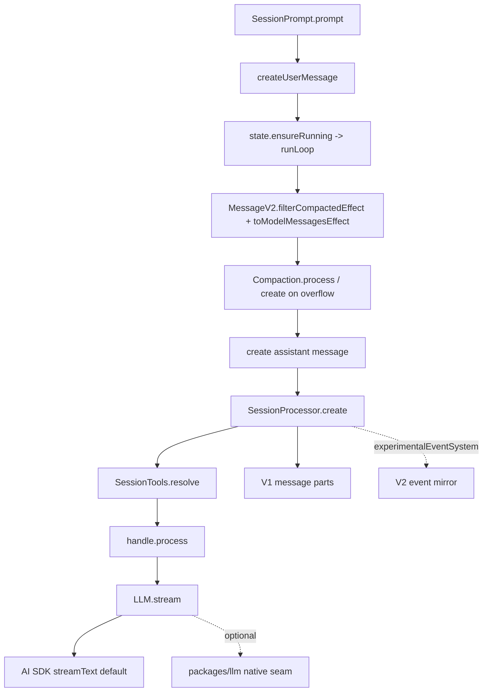

> V1 turn loop 是 `packages/opencode/src/session/prompt.ts` 内部的 assistant loop:它从 V1 user message 组装模型输入,调用 `SessionProcessor`,再由 `LLM.stream` 把 AI SDK/native seam event 转成 V1 message part 与可选 V2 event。

## 能回答的问题
- V1 一轮 prompt 什么时候创建 user message,什么时候进入 assistant loop?
- `SessionPrompt.runLoop` 何时继续、停止或触发 compaction?
- V1 的模型调用是在哪里真正发生的?
- `message-v2.ts` 为什么不是 V2 session core?

## 端到端步骤

1. `SessionPrompt.prompt@packages/opencode/src/session/prompt.ts:1105` 先读取 session,执行 `revert.cleanup(session)`,再调用 `createUserMessage` 构造 V1 user message。[E: packages/opencode/src/session/prompt.ts:1105][E: packages/opencode/src/session/prompt.ts:1108][E: packages/opencode/src/session/prompt.ts:1109][E: packages/opencode/src/session/prompt.ts:1110]

2. `createUserMessage@packages/opencode/src/session/prompt.ts:636` 解析 agent、model、variant,把输入 parts 写入 V1 message/part 存储,并把 text/file/agent/synthetic 归一化成 `nextPrompt`。[E: packages/opencode/src/session/prompt.ts:636][E: packages/opencode/src/session/prompt.ts:1029][E: packages/opencode/src/session/prompt.ts:1031]

3. 当 `RuntimeFlags.experimentalEventSystem` 打开时,V1 prompt admission 会额外发布 `SessionEvent.Prompted`,并把 delivery 标成 `"steer"`;synthetic prompt 也会发布 `SessionEvent.Synthetic`。该 flag 由 `OPENCODE_EXPERIMENTAL_EVENT_SYSTEM` 单独设置,伞形 `OPENCODE_EXPERIMENTAL=true` 也同样启用它(经由 `enabledByExperimental`)。[E: packages/opencode/src/session/prompt.ts:1077][E: packages/opencode/src/session/prompt.ts:1090][E: packages/opencode/src/effect/runtime-flags.ts:48][E: packages/opencode/src/effect/runtime-flags.ts:11]

4. `prompt@packages/opencode/src/session/prompt.ts:1122` 在 `noReply` 为 true 时只返回 user message;正常 assistant 回复路径调用 `loop({ sessionID: input.sessionID })`。[E: packages/opencode/src/session/prompt.ts:1122][E: packages/opencode/src/session/prompt.ts:1123]

5. `loop@packages/opencode/src/session/prompt.ts:1392` 使用 `state.ensureRunning(input.sessionID, lastAssistant(...), runLoop(...))` 保证同一 V1 session 的 run loop 受 runner state 管理。[E: packages/opencode/src/session/prompt.ts:1392]

6. `runLoop@packages/opencode/src/session/prompt.ts:1134` 进入 `while (true)` 后先把 session status 置为 busy,再读取 compacted-filtered messages 与最新 message。[E: packages/opencode/src/session/prompt.ts:1141][E: packages/opencode/src/session/prompt.ts:1142][E: packages/opencode/src/session/prompt.ts:1145]

7. `runLoop@packages/opencode/src/session/prompt.ts:1164` 如果最新 assistant message 已 finish、finish reason 不是 `tool-calls`、没有未完成 tool calls、且 last user id 早于 assistant id,循环会记录 exiting loop 并 break;第一步还会触发 session title 更新。[E: packages/opencode/src/session/prompt.ts:1164][E: packages/opencode/src/session/prompt.ts:1166][E: packages/opencode/src/session/prompt.ts:1167][E: packages/opencode/src/session/prompt.ts:1168][E: packages/opencode/src/session/prompt.ts:1181][E: packages/opencode/src/session/prompt.ts:1185]

8. 每个 step 会先解析模型、处理 subtask 或已排队的 compaction task;若上一个 finished assistant 非 summary 且 `compaction.isOverflow` 命中,`SessionPrompt` 会调用 `compaction.create({ auto: true })` 并继续下一轮,随后才解析当前 agent。[E: packages/opencode/src/session/prompt.ts:1194][E: packages/opencode/src/session/prompt.ts:1197][E: packages/opencode/src/session/prompt.ts:1202][E: packages/opencode/src/session/prompt.ts:1214][E: packages/opencode/src/session/prompt.ts:1219][E: packages/opencode/src/session/prompt.ts:1223]

9. `runLoop@packages/opencode/src/session/prompt.ts:1239` 创建新的 assistant message 并写入 session,随后 `processor.create` 捕获本轮 assistant context,`SessionTools.resolve` 生成可用 tool 列表。[E: packages/opencode/src/session/prompt.ts:1239][E: packages/opencode/src/session/prompt.ts:1240][E: packages/opencode/src/session/prompt.ts:1254][E: packages/opencode/src/session/prompt.ts:1266][E: packages/opencode/src/session/prompt.ts:1279]

10. `MessageV2.toModelMessagesEffect@packages/opencode/src/session/prompt.ts:1327` 把 V1 messages 转成 AI SDK model messages;`message-v2.ts` 之所以是命名陷阱,是因为该文件导入 `SessionV1` 与 AI SDK `ModelMessage`,并在 `toModelMessagesEffect` 中调用 AI SDK `convertToModelMessages`。[E: packages/opencode/src/session/prompt.ts:1327][E: packages/opencode/src/session/message-v2.ts:3][E: packages/opencode/src/session/message-v2.ts:23][E: packages/opencode/src/session/message-v2.ts:417]

11. `handle.process@packages/opencode/src/session/prompt.ts:1336` 把 `system`、`messages`、`tools`、`model`、`toolChoice` 交给 `SessionProcessor`。[E: packages/opencode/src/session/prompt.ts:1336]

12. `SessionProcessor.process@packages/opencode/src/session/processor.ts:960` 设置 session busy,然后在 `llm.stream(streamInput)` 处真正打开模型 event stream。[E: packages/opencode/src/session/processor.ts:960][E: packages/opencode/src/session/processor.ts:974]

13. `LLM.stream@packages/opencode/src/session/llm.ts:357` 创建 abort controller 并调用 `run`;默认 `run` 分支调用 AI SDK `streamText`,experimental native 分支则尝试 `LLMNativeRuntime.stream`。[E: packages/opencode/src/session/llm.ts:357][E: packages/opencode/src/session/llm.ts:271][E: packages/opencode/src/session/llm.ts:226]

14. `SessionProcessor` 逐个处理 LLM event:text-start/text-delta/text-end 更新 V1 text part,tool-call/tool-result 更新 V1 tool part,step-finish 写 usage 与 finish 状态;当 `mirrorAssistant` 为 true 时,同一处理过程还发布 V2 Step/Text/Tool events。[E: packages/opencode/src/session/processor.ts:759][E: packages/opencode/src/session/processor.ts:784][E: packages/opencode/src/session/processor.ts:822][E: packages/opencode/src/session/processor.ts:490][E: packages/opencode/src/session/processor.ts:631][E: packages/opencode/src/session/processor.ts:704]

15. `SessionProcessor.process` 的返回值把下游结果压成 `"compact" | "stop" | "continue"`:`ctx.needsCompaction` 为 true 时返回 `compact`,`ctx.blocked` 或 assistant message error 时返回 `stop`,其余返回 `continue` 让 `runLoop` 判断是否进入下一 step。[E: packages/opencode/src/session/processor.ts:1030][E: packages/opencode/src/session/processor.ts:1031][E: packages/opencode/src/session/processor.ts:1032]

## 关键决策点

- V1 loop 的 compaction 有两条入口:step-finish overflow 会在 processor 中设置 `ctx.needsCompaction`,而 `handle.process()` 返回 `"compact"` 后由 `SessionPrompt.runLoop` 调 `compaction.create({ auto: true, overflow: !handle.message.finish })`。[E: packages/opencode/src/session/processor.ts:750][E: packages/opencode/src/session/prompt.ts:1369][E: packages/opencode/src/session/prompt.ts:1370][E: packages/opencode/src/session/prompt.ts:1375]
- V1 dual-write 不是无条件开启:processor 在创建 context 时计算 `mirrorAssistant = flags.experimentalEventSystem && !input.assistantMessage.summary`。[E: packages/opencode/src/session/processor.ts:110][E: packages/opencode/src/session/processor.ts:129]
- V1 默认模型 runtime 仍是 AI SDK;native provider engine 是 `experimentalNativeLlm` flag 下的可选 seam。[E: packages/opencode/src/effect/runtime-flags.ts:53][E: packages/opencode/src/session/llm.ts:278]

## 深挖入口
- `session-v1.prompt`: V1 prompt/message part 结构
- `session-v1.processor`: LLM event 到 V1/V2 event 的映射细节
- `session-v1.llm-runtime`: AI SDK 与 native seam 适配

## Sources
- packages/opencode/src/session/prompt.ts
- packages/opencode/src/session/processor.ts
- packages/opencode/src/session/llm.ts
- packages/opencode/src/effect/runtime-flags.ts
- packages/opencode/src/session/message-v2.ts

## 相关
- [session-v1.prompt](../subsystems/session-v1/prompt.md)
- [session-v1.processor](../subsystems/session-v1/processor.md)
- [session-v1.llm-runtime](../subsystems/session-v1/llm-runtime.md)
