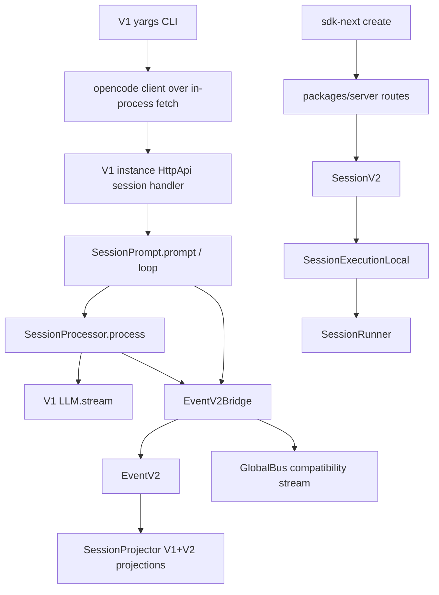

> V1/V2 迁移边界是:默认 opencode CLI/server 仍保留 V1 session prompt loop,但 V1 durable events 与 V2 durable events 共享 EventV2/manifest/projector 基础设施;current V2 embedded API 通过 server routes 与 sdk-next 接入,不再通过已删除的 `packages/core/src/public/opencode.ts`。

## 能回答的问题
- 现在默认 CLI prompt 跑 V1 还是 V2?
- V1 event 到 V2 read model 的桥在哪里?
- V2 的当前公开接通点是什么?
- `SessionV2` 哪些操作已经可用,哪些仍抛 `OperationUnavailableError`?
- `EventV2Bridge` 与 `GlobalBus` 的当前关系是什么?

## V1

默认 CLI 非 attach 路径创建带 in-process fetch 的 SDK client,非交互 prompt 调 `client.session.prompt`;server session handler 取 `SessionPrompt.Service` 并在 prompt handler 中调用 `promptSvc.prompt`;V1 prompt 随后进入 `state.ensureRunning(... runLoop(...))`,processor 的 `process` 方法在 `llm.stream(streamInput)` 处打开模型流。[E: packages/opencode/src/cli/cmd/run.ts:943][E: packages/opencode/src/cli/cmd/run.ts:951][E: packages/opencode/src/cli/cmd/run.ts:859][E: packages/opencode/src/server/routes/instance/httpapi/handlers/session.ts:51][E: packages/opencode/src/server/routes/instance/httpapi/handlers/session.ts:298][E: packages/opencode/src/session/prompt.ts:1345][E: packages/opencode/src/session/processor.ts:625][E: packages/opencode/src/session/processor.ts:638]

V1 prompt/processor 当前通过 `EventV2Bridge.Service` 取得 event service;`EventV2Bridge` 包装 `EventV2.Service.publish`,没有 location 时从 `InstanceRef`/`WorkspaceRef` 补 location,并监听 EventV2 后 fan-out 到 `GlobalBus`。[E: packages/opencode/src/session/prompt.ts:140][E: packages/opencode/src/session/processor.ts:95][E: packages/opencode/src/event-v2-bridge.ts:12][E: packages/opencode/src/event-v2-bridge.ts:19][E: packages/opencode/src/event-v2-bridge.ts:22][E: packages/opencode/src/event-v2-bridge.ts:24][E: packages/opencode/src/event-v2-bridge.ts:25][E: packages/opencode/src/event-v2-bridge.ts:39]

V1 durable events 是 EventV2 durable manifest 的一部分:global durable manifest 合并 `SessionV1.Event.Definitions` 中 durable 的定义与 V2 `SessionEvent.DurableDefinitions`。[E: packages/schema/src/event-manifest.ts:34][E: packages/schema/src/event-manifest.ts:37]

`RuntimeFlags.experimentalEventSystem` 仍由 `OPENCODE_EXPERIMENTAL_EVENT_SYSTEM` 或伞形 `OPENCODE_EXPERIMENTAL` 启用,但当前 session prompt/processor 源文件没有用该 flag gate EventV2Bridge 发布路径;它仍被 TUI plugin plumbing 使用。[E: packages/opencode/src/effect/runtime-flags.ts:10][E: packages/opencode/src/effect/runtime-flags.ts:11][E: packages/opencode/src/effect/runtime-flags.ts:48][I]

## V2

`SessionV2` 的 service tag 是 `@opencode/v2/Session`,它的接口包含 `list/create/get/messages/message/context/events/history/switchAgent/switchModel/prompt/shell/skill/compact/wait/active/resume/interrupt/revert`。[E: packages/core/src/session.ts:182][E: packages/core/src/session.ts:113][E: packages/core/src/session.ts:147][E: packages/core/src/session.ts:154][E: packages/core/src/session.ts:169][E: packages/core/src/session.ts:171]

`SessionV2.node` 依赖 `SessionExecution.node`;core 里有低层 `SessionExecution.noopLayer`,但 current server composition 用 `SessionExecutionLocal.node` 替换 execution node 来接通 runner。[E: packages/core/src/session.ts:474][E: packages/core/src/session.ts:481][E: packages/core/src/session/execution.ts:26][E: packages/server/src/routes.ts:52]

当前 V2 HTTP/embedded composition point 是 `packages/server/src/routes.ts`:application services 包含 `SessionV2.node` 与 `LocationServiceMap.node`,并用 `AppNodeBuilder.build(applicationServices, [[SessionExecution.node, SessionExecutionLocal.node]])` 接入本地 execution。[E: packages/server/src/routes.ts:26][E: packages/server/src/routes.ts:31][E: packages/server/src/routes.ts:36][E: packages/server/src/routes.ts:52]

legacy opencode server 也在 instance HttpApi server layer 中提供 V2 session graph:它构建 `locationServiceMapV2`,并把 `SessionV2.node` 的 `LocationServiceMap.node` 和 `SessionExecution.node` 分别替换成 V2 location map 与 `SessionExecutionLocal.node`。[E: packages/opencode/src/server/routes/instance/httpapi/server.ts:274][E: packages/opencode/src/server/routes/instance/httpapi/server.ts:301][E: packages/opencode/src/server/routes/instance/httpapi/server.ts:302][E: packages/opencode/src/server/routes/instance/httpapi/server.ts:303]

`packages/sdk-next/src/opencode.ts` 的 embedded SDK 通过 `createEmbeddedRoutes()` 建本地 web handler,再用 generated `OpenCode.make` 创建 client,并额外暴露 `tools.register`。[E: packages/sdk-next/src/opencode.ts:10][E: packages/sdk-next/src/opencode.ts:23][E: packages/sdk-next/src/opencode.ts:35][E: packages/sdk-next/src/opencode.ts:41]

`SessionExecutionLocal` 的 drain 会从 `SessionStore` 读 session,用 `LocationServiceMap.get(session.location)` 找 location-scoped services,再调用 `SessionRunner.Service.use(runner => runner.run(...))`。[E: packages/core/src/session/execution/local.ts:18][E: packages/core/src/session/execution/local.ts:20][E: packages/core/src/session/execution/local.ts:21]

## Stub 与可用面

`SessionV2` 明确把 `move/shell/skill/switchAgent/compact/wait` 的错误类型建成 `OperationUnavailableError`,但当前实现里 `shell`、`skill`、`compact`、`wait` 直接返回 unavailable;`switchAgent` 当前已发布 `SessionEvent.AgentSwitched` 而不是 stub。[E: packages/core/src/session.ts:95][E: packages/core/src/session.ts:98][E: packages/core/src/session.ts:387][E: packages/core/src/session.ts:390][E: packages/core/src/session.ts:393][E: packages/core/src/session.ts:395][E: packages/core/src/session.ts:417][E: packages/core/src/session.ts:421]

`SessionV2.prompt` 已经可用:它读取 session,归一化 prompt,为 prompt 生成或接收 message id,默认 `delivery` 为 `"steer"`,调用 `SessionInput.admit` 持久化 admission,并在 `resume !== false` 时调用 `execution.wake(admitted.sessionID)`。[E: packages/core/src/session.ts:360][E: packages/core/src/session.ts:363][E: packages/core/src/session.ts:364][E: packages/core/src/session.ts:365][E: packages/core/src/session.ts:366][E: packages/core/src/session.ts:368][E: packages/core/src/session.ts:382]

`SessionV2.resume` 与 `SessionV2.interrupt` 已接到 execution:resume 先 `result.get(sessionID)` 再调 `execution.resume(sessionID)`,interrupt 直接转到 `execution.interrupt(sessionID)`。[E: packages/core/src/session.ts:426][E: packages/core/src/session.ts:427][E: packages/core/src/session.ts:428][E: packages/core/src/session.ts:430][E: packages/core/src/session.ts:431]

## 迁移阅读规则

- 看到 `packages/opencode/src/session/*` 时,默认先按 V1 live path 理解;其中 `message-v2.ts` 导入 `SessionV1` 与 AI SDK `ModelMessage`,并在 `toModelMessagesEffect` 中调用 `convertToModelMessages`,所以它是 V1 到 AI SDK message 的转换层而不是 V2 core。[E: packages/opencode/src/session/message-v2.ts:2][E: packages/opencode/src/session/message-v2.ts:20][E: packages/opencode/src/session/message-v2.ts:417]
- 看到 `packages/core/src/session/*` 时,默认按 V2 durable/event-sourced core 理解;是否真的会执行 runner,要检查调用路径有没有把 `SessionExecution.node` 替换成 `SessionExecutionLocal.node`。[E: packages/core/src/session.ts:474][E: packages/core/src/session.ts:481][E: packages/server/src/routes.ts:52]
- 看到 `packages/llm` 时,在 V1 中它是 experimental native seam,在 V2 中它是 provider engine;同名 `LLM.stream` 不能自动说明 caller 属于哪一代。[E: packages/opencode/src/session/llm.ts:226][E: packages/core/src/session/runner/llm.ts:227]

## Sources
- packages/opencode/src/cli/cmd/run.ts
- packages/opencode/src/server/routes/instance/httpapi/handlers/session.ts
- packages/opencode/src/server/routes/instance/httpapi/server.ts
- packages/opencode/src/session/processor.ts
- packages/opencode/src/session/prompt.ts
- packages/opencode/src/session/llm.ts
- packages/opencode/src/session/message-v2.ts
- packages/opencode/src/effect/runtime-flags.ts
- packages/opencode/src/event-v2-bridge.ts
- packages/schema/src/event-manifest.ts
- packages/core/src/session.ts
- packages/core/src/session/execution.ts
- packages/core/src/session/execution/local.ts
- packages/core/src/session/runner/llm.ts
- packages/server/src/routes.ts
- packages/sdk-next/src/opencode.ts

## 相关
- [spine.v1-turn-loop](v1-turn-loop.md)
- [spine.v2-overview](v2-overview.md)
