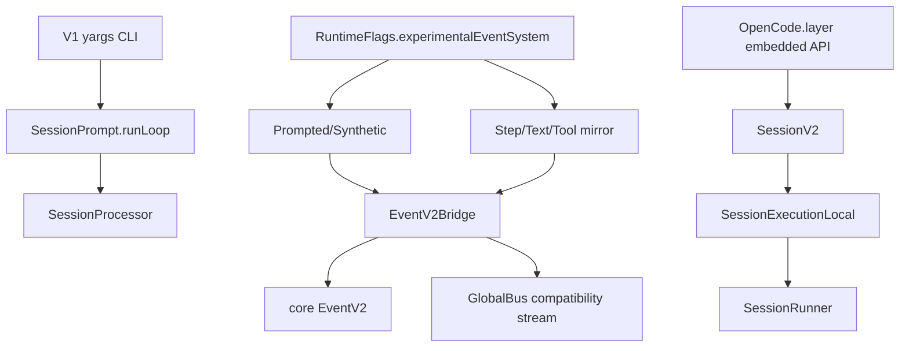

> V1/V2 迁移边界是:默认 CLI 活跑路径仍是 V1,但 V1 可在 `experimentalEventSystem` 下 dual-write V2 events;V2 core 通过 `packages/core/src/public/opencode.ts` 的嵌入式 API 接通执行,许多 `SessionV2` facade 操作仍是 stub。

## 能回答的问题
- 现在默认跑 V1 还是 V2?
- V1 dual-write 到 V2 event 的开关在哪里?
- V2 的公开接通点是什么?
- `SessionV2` 哪些操作已经可用,哪些仍抛 `OperationUnavailableError`?
- `EventV2Bridge` 与 `GlobalBus` 的当前关系是什么?

## V1

默认 V1 CLI 非 attach 路径创建带 process-local fetch 的 SDK client,非交互 prompt 调 `client.session.prompt`,server session handler 取 `SessionPrompt.Service` 并在 prompt handler 中调用 `promptSvc.prompt`;V1 prompt 随后进入 `state.ensureRunning(... runLoop(...))`,processor 的 `process` 方法在 `llm.stream(streamInput)` 处打开模型流。[E: packages/opencode/src/cli/cmd/run.ts:878][E: packages/opencode/src/cli/cmd/run.ts:793][E: packages/opencode/src/server/routes/instance/httpapi/handlers/session.ts:51][E: packages/opencode/src/server/routes/instance/httpapi/handlers/session.ts:298][E: packages/opencode/src/session/prompt.ts:1404][E: packages/opencode/src/session/processor.ts:974]

V1 dual-write 的入口受 `RuntimeFlags.experimentalEventSystem` 控制,该 flag 由 `OPENCODE_EXPERIMENTAL_EVENT_SYSTEM` 单独设置,也可通过伞形 `OPENCODE_EXPERIMENTAL=true` 启用(二者均经由 `enabledByExperimental`)。[E: packages/opencode/src/effect/runtime-flags.ts:48][E: packages/opencode/src/effect/runtime-flags.ts:11] 在 V1 prompt admission 处,打开该 flag 会发布 `SessionEvent.Prompted`;在 synthetic prompt 处会发布 `SessionEvent.Synthetic`。[E: packages/opencode/src/session/prompt.ts:1077][E: packages/opencode/src/session/prompt.ts:1090]

V1 assistant mirroring 也不是全量无条件写:processor 创建 context 时计算 `mirrorAssistant = flags.experimentalEventSystem && !input.assistantMessage.summary`,因此 summary assistant 不会走同一 mirror path。[E: packages/opencode/src/session/processor.ts:110][E: packages/opencode/src/session/processor.ts:129]

当 mirroring 打开时,processor 会为 assistant step 发布 `SessionEvent.Step.Started`,为 tool call 发布 `SessionEvent.Tool.Called`,为 text start/delta/end 发布 `SessionEvent.Text.*`,并在 step finish 时发布 `SessionEvent.Step.Ended`。[E: packages/opencode/src/session/processor.ts:147][E: packages/opencode/src/session/processor.ts:490][E: packages/opencode/src/session/processor.ts:763][E: packages/opencode/src/session/processor.ts:789][E: packages/opencode/src/session/processor.ts:822][E: packages/opencode/src/session/processor.ts:704]

`EventV2Bridge` 是 V1 到 core event 的发布边界:它包装 `EventV2.Service.publish`,没有 location 时从 `InstanceRef`/`WorkspaceRef` 补 location,并监听 EventV2 后把事件 fan-out 到 `GlobalBus`。[E: packages/opencode/src/event-v2-bridge.ts:22][E: packages/opencode/src/event-v2-bridge.ts:25][E: packages/opencode/src/event-v2-bridge.ts:38][E: packages/opencode/src/event-v2-bridge.ts:42]

## V2

`SessionV2` 的 service tag 是 `@opencode/v2/Session`,它的接口包含 `create/get/list/prompt/switchModel/resume/interrupt/messages/context/events` 以及若干尚未实现的操作。[E: packages/core/src/session.ts:105][E: packages/core/src/session.ts:162]

单独使用 `SessionV2.defaultLayer` 时,`SessionExecution` 默认是 noop layer;这说明 V2 facade 本身不保证 execution runner 已接通,需要外层提供 execution implementation。[E: packages/core/src/session.ts:428][E: packages/core/src/session/execution.ts:20]

真正把 V2 session execution 接到本地 runner 的公开嵌入式入口是 `OpenCode.layer`:它把 `SessionV2.layer` 依次提供 `SessionProjector.layer`、`SessionExecutionLocal.layer`、`SessionStore.layer`、`EventV2.layer`、`Database.defaultLayer`、`ProjectV2.defaultLayer`,再提供 location services。[E: packages/core/src/public/opencode.ts:70][E: packages/core/src/public/opencode.ts:73][E: packages/core/src/public/opencode.ts:81]

`SessionExecutionLocal` 的 drain 会从 `SessionStore` 读 session,用 `LocationServiceMap.get(session.location)` 找 location-scoped services,再调用 `SessionRunner.Service.use(runner => runner.run(...))`。[E: packages/core/src/session/execution/local.ts:16][E: packages/core/src/session/execution/local.ts:18][E: packages/core/src/session/execution/local.ts:21]

`OpenCode.layer` 暴露的 public API 把 `sessions.prompt` 映射到 `SessionV2.prompt`,但这段 wrapper 只向 core prompt 转发 `id/sessionID/prompt/delivery`,没有转发 `resume` 字段。[E: packages/core/src/public/opencode.ts:107][E: packages/core/src/public/opencode.ts:112]

## Stub 与可用面

`SessionV2` 明确把 `move/shell/skill/switchAgent/compact/wait` 的错误类型建成 `OperationUnavailableError`,并在 `shell`、`skill`、`switchAgent`、`compact`、`wait` 方法里直接返回对应 unavailable error。[E: packages/core/src/session.ts:89][E: packages/core/src/session.ts:377][E: packages/core/src/session.ts:380][E: packages/core/src/session.ts:383][E: packages/core/src/session.ts:395][E: packages/core/src/session.ts:399]

`SessionV2.prompt` 已经可用:它读取 session,在 `resume !== false` 时调用 `enqueueWake`,为 prompt 生成或接收 message id,默认 `delivery` 为 `"steer"`,再调用 `SessionInput.admit` 持久化 admission。[E: packages/core/src/session.ts:348][E: packages/core/src/session.ts:351][E: packages/core/src/session.ts:353][E: packages/core/src/session.ts:356][E: packages/core/src/session.ts:357][E: packages/core/src/session.ts:359]

`SessionV2.resume` 与 `SessionV2.interrupt` 也已接到 execution:resume 调 `execution.resume(sessionID)`,interrupt 在存在 session 时发布 `InterruptRequested` 并调用 `execution.interrupt(sessionID, event.seq)`。[E: packages/core/src/session.ts:403][E: packages/core/src/session.ts:405][E: packages/core/src/session.ts:407][E: packages/core/src/session.ts:412][E: packages/core/src/session.ts:418]

## 迁移阅读规则

- 看到 `packages/opencode/src/session/*` 时,默认先按 V1 live path 理解;其中 `message-v2.ts` 导入 `SessionV1` 与 AI SDK `ModelMessage`,并在 `toModelMessagesEffect` 中调用 `convertToModelMessages`,所以它是 V1 到 AI SDK message 的转换层而不是 V2 core。[E: packages/opencode/src/session/message-v2.ts:3][E: packages/opencode/src/session/message-v2.ts:23][E: packages/opencode/src/session/message-v2.ts:417]
- 看到 `packages/core/src/session/*` 时,默认按 V2 durable/event-sourced core 理解;是否真的会执行 runner,要检查调用路径有没有提供 `SessionExecutionLocal.layer`。[E: packages/core/src/session.ts:428][E: packages/core/src/public/opencode.ts:73]
- 看到 `packages/llm` 时,在 V1 中它是 experimental native seam,在 V2 中它是 provider engine;同名 `LLM.stream` 不能自动说明 caller 属于哪一代。[E: packages/opencode/src/session/llm.ts:226][E: packages/core/src/session/runner/llm.ts:245]

## Sources
- packages/opencode/src/session/processor.ts
- packages/opencode/src/cli/cmd/run.ts
- packages/opencode/src/server/routes/instance/httpapi/handlers/session.ts
- packages/opencode/src/session/prompt.ts
- packages/opencode/src/session/llm.ts
- packages/opencode/src/session/message-v2.ts
- packages/opencode/src/effect/runtime-flags.ts
- packages/opencode/src/event-v2-bridge.ts
- packages/core/src/public/opencode.ts
- packages/core/src/session.ts
- packages/core/src/session/execution.ts
- packages/core/src/session/execution/local.ts
- packages/core/src/session/runner/llm.ts

## 相关
- [spine.v1-turn-loop](v1-turn-loop.md)
- [spine.v2-overview](v2-overview.md)
