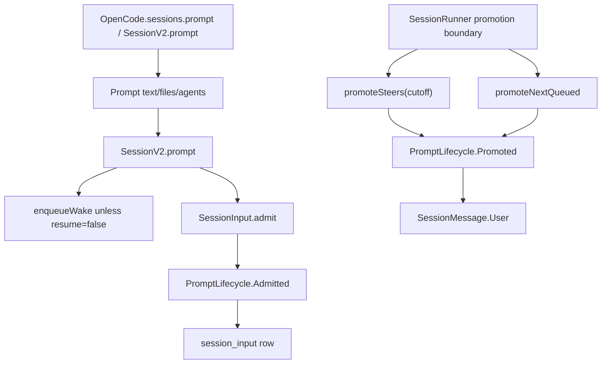

> V2 admission 是把用户 prompt 先写成 durable inbox event,再由 runner promotion 与 projector 转成 model-visible user history 的机制。

## 能回答的问题
- `sessions.prompt` 为什么不会直接把 user message 放进 history?
- `delivery: "steer"` 与 `delivery: "queue"` 在哪里定义?
- prompt admission 怎样保证 idempotency?
- admission event 与 promotion event 分别做什么?

## 端到端步骤

1. `Prompt@packages/core/src/session/prompt.ts:32` 是 V2 admission payload 的结构:必填 `text`,可选 `files` 与 `agents`;file attachment 包含 `uri/mime/name/description/source`,agent attachment 包含 `name/source`。[E: packages/core/src/session/prompt.ts:9][E: packages/core/src/session/prompt.ts:27][E: packages/core/src/session/prompt.ts:32]

2. `SessionInput.Delivery@packages/core/src/session/input.ts:18` 只允许 `"steer"` 与 `"queue"` 两个 admission delivery 值;`SessionInput.Admitted` 记录 `admittedSeq`、`id`、`sessionID`、`prompt`、`delivery`、`timeCreated` 和可选 `promotedSeq`。[E: packages/core/src/session/input.ts:18][E: packages/core/src/session/input.ts:21]

3. `SessionV2.prompt@packages/core/src/session.ts:348` 先读取 session,若 `resume !== false` 则准备调用 execution wake;message id 未提供时用 `SessionMessage.ID.create()` 生成。[E: packages/core/src/session.ts:348][E: packages/core/src/session.ts:351][E: packages/core/src/session.ts:353][E: packages/core/src/session.ts:356]

4. `SessionV2.prompt@packages/core/src/session.ts:357` 把 delivery 默认成 `"steer"`,随后调用 `SessionInput.admit`;`LifecycleConflict` 会被包装成 `PromptConflictError`。[E: packages/core/src/session.ts:357][E: packages/core/src/session.ts:359][E: packages/core/src/session.ts:365][E: packages/core/src/session.ts:366]

5. `SessionInput.admit@packages/core/src/session/input.ts:54` 先按 message id 查已有 inbox row,命中则直接返回已有 admission,这是 admission idempotency 的第一道路径。[E: packages/core/src/session/input.ts:54][E: packages/core/src/session/input.ts:64]

6. 没有既有 row 时,`SessionInput.admit` 发布 `SessionEvent.PromptLifecycle.Admitted`,payload 包含 `messageID/sessionID/timestamp/prompt/delivery`;返回的 EventV2 seq 会成为 `Admitted.admittedSeq`。[E: packages/core/src/session/input.ts:67][E: packages/core/src/session/input.ts:68][E: packages/core/src/session/input.ts:81]

7. `SessionEvent.PromptLifecycle.Admitted` 使用 session event sync options,其 schema 字段同样是 `sessionID/messageID/timestamp/prompt/delivery`,并且 `DurableDefinitions` 包含 `PromptLifecycle.Admitted`。[E: packages/core/src/session/event.ts:29][E: packages/core/src/session/event.ts:95][E: packages/core/src/session/event.ts:99][E: packages/core/src/session/event.ts:476]

8. `projectAdmitted@packages/core/src/session/input.ts:109` 检查同 id 是否已存在 projected message;然后把 prompt 编码进 `SessionInputTable`,并用 `onConflictDoNothing` 防重复插入。[E: packages/core/src/session/input.ts:109][E: packages/core/src/session/input.ts:120][E: packages/core/src/session/input.ts:127][E: packages/core/src/session/input.ts:137]

9. runner promotion 时不直接写 message row,而是发布 `SessionEvent.PromptLifecycle.Promoted`;`publish@packages/core/src/session/input.ts:272` 对每个 inbox row 发布 promoted event。[E: packages/core/src/session/input.ts:272][E: packages/core/src/session/input.ts:280]

10. `projectPromoted@packages/core/src/session/input.ts:144` 将 matching inbox row 的 `promoted_seq` 更新为 promoted event seq,再用 `toMessage` 转成 `SessionMessage.User`;Session projector 在 `PromptLifecycle.Promoted` projector 中调用 `insertMessage(... projectPromoted(...))` 写入 projected history。[E: packages/core/src/session/input.ts:154][E: packages/core/src/session/input.ts:174][E: packages/core/src/session/input.ts:345][E: packages/core/src/session/projector.ts:397][E: packages/core/src/session/projector.ts:401]

11. `promoteSteers@packages/core/src/session/input.ts:300` 按 `admitted_seq <= cutoff` 批量 promote 未 promoted 的 steer rows;`promoteNextQueued` 只取最早一个 queue row。[E: packages/core/src/session/input.ts:300][E: packages/core/src/session/input.ts:314][E: packages/core/src/session/input.ts:323][E: packages/core/src/session/input.ts:338]

12. V2 spec 对同一设计的文字定义是:session input 是 durable admission inbox,admitted inputs 在 runner 发布 `PromptLifecycle.Promoted` 前不进入 model-visible Session history。[E: specs/v2/session.md:30]

## 关键决策点

- admission 与 model-visible history 分离:admit 写 `PromptLifecycle.Admitted` 和 inbox row,promote 写 `PromptLifecycle.Promoted`,而 projected user message 由 `PromptLifecycle.Promoted` projector 插入。[E: packages/core/src/session/input.ts:68][E: packages/core/src/session/input.ts:280][E: packages/core/src/session/projector.ts:397][E: packages/core/src/session/projector.ts:401]
- `steer` 是默认 delivery;runner 在 promotion 为 `"steer"` 时调用 `promoteSteers`,而 `queue` 由 `promoteNextQueued` 一次只推进一个。[E: packages/core/src/session.ts:357][E: packages/core/src/session/runner/llm.ts:193][E: packages/core/src/session/runner/llm.ts:195][E: packages/core/src/session/input.ts:323]
- `guardReservedID` 会阻止非 lifecycle event 使用已被 admission inbox 保留的 message id,以避免同一 message id 同时属于 inbox 和其他事件类型。[E: packages/core/src/session/input.ts:211][E: packages/core/src/session/input.ts:222][E: packages/core/src/session/input.ts:229]

## 深挖入口
- execution wake/coalesce: `spine.v2-coordinator`
- inbox 表与 projector: `session-v2.inbox`

## Sources
- packages/core/src/session.ts
- packages/core/src/session/input.ts
- packages/core/src/session/prompt.ts
- packages/core/src/session/event.ts
- packages/core/src/session/projector.ts
- packages/core/src/session/runner/llm.ts
- specs/v2/session.md

## 相关
- [spine.v2-coordinator](v2-coordinator.md)
- [session-v2.inbox](../subsystems/session-v2/inbox.md)
