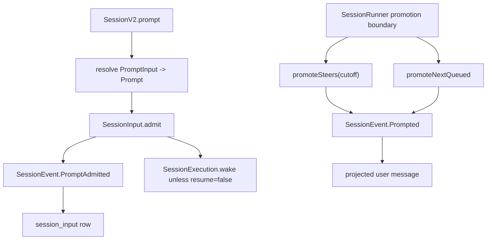

> V2 admission 是把用户 prompt 先写成 durable inbox event,再由 runner promotion 与 projector 转成 model-visible user history 的机制。

## 能回答的问题
- `sessions.prompt` 为什么不会直接把 user message 放进 history?
- `delivery: "steer"` 与 `delivery: "queue"` 在哪里定义?
- prompt admission 怎样处理 retry/idempotency?
- admission event 与 promotion event 分别做什么?

## 端到端步骤

1. API-facing `PromptInput.Prompt` 接收必填 `text`、可选 `files` 与 `agents`;input file attachment 不要求 mime,只要求 `uri` 与可选 `name/description/source`。[E: packages/schema/src/prompt-input.ts:21][E: packages/schema/src/prompt-input.ts:22][E: packages/schema/src/prompt-input.ts:24][E: packages/schema/src/prompt-input.ts:25][E: packages/schema/src/prompt-input.ts:8]

2. Core `Prompt` 保存必填 `text`、可选 `files/agents`;core file attachment 包含 `uri/mime/name/description/source`。[E: packages/schema/src/prompt.ts:41][E: packages/schema/src/prompt.ts:42][E: packages/schema/src/prompt.ts:43][E: packages/schema/src/prompt.ts:44][E: packages/schema/src/prompt.ts:13][E: packages/schema/src/prompt.ts:15]

3. `SessionV2.resolvePrompt` 会把 `PromptInput` file 的 mime 补成 data URI mime 或 `FSUtil.mimeType(target)`,目录则落到 `application/x-directory`。[E: packages/core/src/session.ts:460][E: packages/core/src/session.ts:465][E: packages/core/src/session.ts:466][E: packages/core/src/session.ts:469]

4. `SessionInput.Delivery` 只允许 `"steer"` 与 `"queue"` 两个 delivery 值;`SessionInput.Admitted` 记录 `admittedSeq/id/sessionID/prompt/delivery/timeCreated/promotedSeq`。[E: packages/schema/src/session-delivery.ts:5][E: packages/schema/src/session-input.ts:15][E: packages/schema/src/session-input.ts:16][E: packages/schema/src/session-input.ts:22]

5. `SessionV2.prompt` 先读取 session,把 input prompt 归一化,生成或接收 message id,把 delivery 默认成 `"steer"`,再调用 `SessionInput.admit`。[E: packages/core/src/session.ts:360][E: packages/core/src/session.ts:363][E: packages/core/src/session.ts:364][E: packages/core/src/session.ts:365][E: packages/core/src/session.ts:366][E: packages/core/src/session.ts:368]

6. `SessionInput.admit` 先按 message id 查已有 inbox row,命中则直接返回已有 admission;这是 admission idempotency 的第一道路径。[E: packages/core/src/session/input.ts:41][E: packages/core/src/session/input.ts:51][E: packages/core/src/session/input.ts:52]

7. 没有既有 row 时,`SessionInput.admit` 发布 `SessionEvent.PromptAdmitted`,payload 包含 `messageID/sessionID/timestamp/prompt/delivery`;返回的 durable seq 会成为 `Admitted.admittedSeq`。[E: packages/core/src/session/input.ts:54][E: packages/core/src/session/input.ts:55][E: packages/core/src/session/input.ts:56][E: packages/core/src/session/input.ts:60][E: packages/core/src/session/input.ts:67][E: packages/core/src/session/input.ts:68]

8. `SessionEvent.Prompted` 与 `SessionEvent.PromptAdmitted` 共享 `PromptFields`,字段是 `timestamp/sessionID/messageID/prompt/delivery`,二者都使用 durable session aggregate options。[E: packages/schema/src/session-event.ts:31][E: packages/schema/src/session-event.ts:34][E: packages/schema/src/session-event.ts:35][E: packages/schema/src/session-event.ts:38][E: packages/schema/src/session-event.ts:87][E: packages/schema/src/session-event.ts:94]

9. `projectAdmitted` 检查同 id 是否已经存在 projected message,然后把 prompt 编码进 `SessionInputTable`,并用 `onConflictDoNothing` 防重复插入;冲突会 die 成 `LifecycleConflict`。[E: packages/core/src/session/input.ts:83][E: packages/core/src/session/input.ts:94][E: packages/core/src/session/input.ts:100][E: packages/core/src/session/input.ts:102][E: packages/core/src/session/input.ts:111][E: packages/core/src/session/input.ts:115]

10. `SessionV2.prompt` 对返回 admission 做等价性检查;如果同 message id 已属于不同 session、prompt 或 delivery,会返回 `PromptConflictError`。[E: packages/core/src/session.ts:367][E: packages/core/src/session.ts:380][E: packages/core/src/session.ts:381]

11. `SessionV2.prompt` 只有在 `resume !== false` 时才调用 `execution.wake(admitted.sessionID)`;wake 不携带 admitted seq。[E: packages/core/src/session.ts:382]

12. runner promotion 时发布 `SessionEvent.Prompted`;`publish` 对每个 selected inbox row 发布 Prompted event,而不是直接写 message row。[E: packages/core/src/session/input.ts:216][E: packages/core/src/session/input.ts:222][E: packages/core/src/session/input.ts:225]

13. Prompted projector 先调用 `SessionInput.projectPrompted` 标记 inbox row 的 `promotedSeq`,再调用 `run(db,event)` 把事件投影成 visible user message。[E: packages/core/src/session/projector.ts:350][E: packages/core/src/session/projector.ts:353][E: packages/core/src/session/projector.ts:359][E: packages/core/src/session/projector.ts:361]

14. PromptAdmitted projector 只调用 `SessionInput.projectAdmitted`,因此 admitted prompt 在 Prompted 之前停留在 durable inbox 中。[E: packages/core/src/session/projector.ts:364][E: packages/core/src/session/projector.ts:367][E: packages/core/src/session/projector.ts:367]

15. `promoteSteers` 按 `admitted_seq <= cutoff` 批量 promote 未 promoted 的 steer rows;`promoteNextQueued` 只取最早一个 queue row。[E: packages/core/src/session/input.ts:245][E: packages/core/src/session/input.ts:259][E: packages/core/src/session/input.ts:265][E: packages/core/src/session/input.ts:268][E: packages/core/src/session/input.ts:283][E: packages/core/src/session/input.ts:287]

16. runner 在 provider-turn boundary 读取 latest sequence 作为 cutoff;`steer` promote steer rows,`queue` 先 promote 一个 queued row 再 promote eligible steers。[E: packages/core/src/session/runner/llm.ts:182][E: packages/core/src/session/runner/llm.ts:183][E: packages/core/src/session/runner/llm.ts:185][E: packages/core/src/session/runner/llm.ts:187][E: packages/core/src/session/runner/llm.ts:188]

17. V2 spec 对同一设计的文字定义是:`session_input` 是 durable admission inbox,admitted inputs 在 serialized runner 发布 `Prompted` 前不进入 model-visible Session history。[E: specs/v2/session.md:35]

## 关键决策点

- admission 与 model-visible history 分离:admit 写 `PromptAdmitted` 和 inbox row,promote 写 `Prompted`,projector 再插入 projected history。[E: packages/core/src/session/input.ts:55][E: packages/core/src/session/projector.ts:364][E: packages/core/src/session/input.ts:225][E: packages/core/src/session/projector.ts:350]
- `steer` 是默认 delivery;runner 在 promotion 为 `"steer"` 时调用 `promoteSteers`,而 `queue` 由 `promoteNextQueued` 一次只推进一个。[E: packages/core/src/session.ts:366][E: packages/core/src/session/runner/llm.ts:185][E: packages/core/src/session/runner/llm.ts:187]
- 当前源码没有 `PromptLifecycle.*` 命名空间;durable admission/promotion 事件名是 `SessionEvent.PromptAdmitted` 与 `SessionEvent.Prompted`。[E: packages/schema/src/session-event.ts:87][E: packages/schema/src/session-event.ts:94]

## 深挖入口
- execution wake/coalesce: `spine.v2-coordinator`
- inbox 表与 projector: `session-v2.inbox`

## Sources
- packages/core/src/session.ts
- packages/core/src/session/input.ts
- packages/schema/src/prompt.ts
- packages/schema/src/prompt-input.ts
- packages/schema/src/session-input.ts
- packages/schema/src/session-delivery.ts
- packages/schema/src/session-event.ts
- packages/core/src/session/projector.ts
- packages/core/src/session/runner/llm.ts
- specs/v2/session.md

## 相关
- [spine.v2-coordinator](v2-coordinator.md)
- [session-v2.inbox](../subsystems/session-v2/inbox.md)
