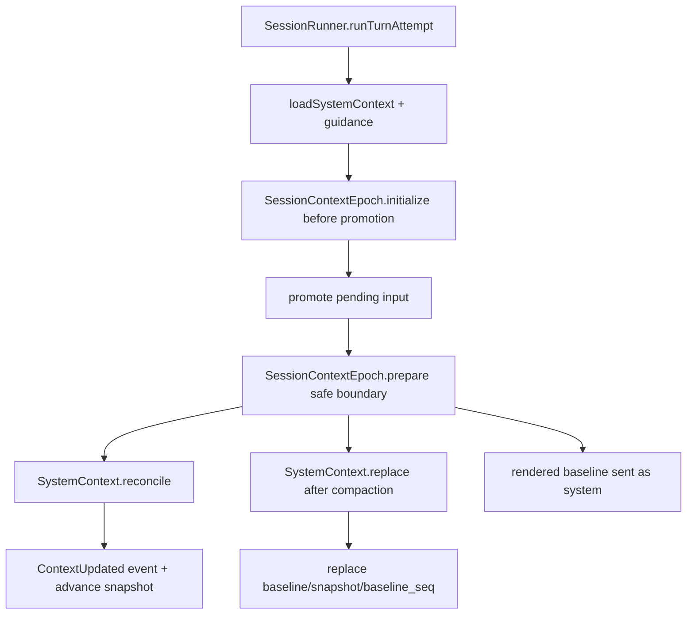

> V2 Context Epoch 是一代已准入的 privileged System Context:它保存 baseline 文本、结构化 snapshot 与 baseline seq;首次 baseline admission 在 prompt promotion 前完成,后续 reconcile/replace 在 safe provider-turn boundary 完成。

## 能回答的问题
- System Context 与 Session History 的边界是什么?
- 第一次 prompt 为什么要等完整 context observation?
- compaction 或 session movement 如何影响 context epoch?
- unavailable source 在 reconcile 与 replace 中有什么不同?

## 端到端步骤

1. `CONTEXT.md` 把 System Context 定义为呈现给模型的结构化 contextual facts 集合;Context Snapshot 是 model-hidden JSON state,Context Epoch 是 initially rendered System Context 保持 immutable 的时期。[E: CONTEXT.md:8][E: CONTEXT.md:8][E: CONTEXT.md:27][E: CONTEXT.md:27][E: CONTEXT.md:34][E: CONTEXT.md:34]

2. `SystemContext.Source` 定义每个 source 的 `key/codec/load/baseline/update/removed`;`SystemContext` 本身是 opaque carrier,内部保存 packed sources。[E: packages/core/src/system-context/index.ts:32][E: packages/core/src/system-context/index.ts:32][E: packages/core/src/system-context/index.ts:33][E: packages/core/src/system-context/index.ts:38][E: packages/core/src/system-context/index.ts:44][E: packages/core/src/system-context/index.ts:45]

3. `SystemContext.unavailable` 表示 source 暂时不可观测;这与 source 被移除不同,因为 reconcile 会保留已准入 snapshot,replace 会阻塞不完整 replacement。[E: packages/core/src/system-context/index.ts:28][E: packages/core/src/system-context/index.ts:28][E: packages/core/src/system-context/index.ts:251][E: packages/core/src/system-context/index.ts:252][E: packages/core/src/system-context/index.ts:287][E: packages/core/src/system-context/index.ts:289]

4. `SessionContextEpochTable` 现在只保存 `session_id/baseline/snapshot/baseline_seq`,当前表结构不再保存 selected agent 或 replacement marker。[E: packages/core/src/session/sql.ts:168][E: packages/core/src/session/sql.ts:173][E: packages/core/src/session/sql.ts:174][E: packages/core/src/session/sql.ts:175]

5. `SessionRunner.loadSystemContext` 把 location-wide system context、skill guidance、reference guidance 合并成 turn context input。[E: packages/core/src/session/runner/llm.ts:163][E: packages/core/src/session/runner/llm.ts:164][E: packages/core/src/session/runner/llm.ts:166]

6. `runTurnAttempt` 在 promote pending input 前调用 `SessionContextEpoch.initialize`;这保证首次完整 baseline 在 pending prompt 变成 model-visible history 前准备好。[E: packages/core/src/session/runner/llm.ts:168][E: packages/core/src/session/runner/llm.ts:177][E: packages/core/src/session/runner/llm.ts:178][E: packages/core/src/session/runner/llm.ts:182]

7. `SessionContextEpoch.initialize` 调 `initializeOnce`;若 epoch 不存在,`initializeOnce` 观察 context 并调用 `SystemContext.initialize`,随后 insert baseline/snapshot。[E: packages/core/src/session/context-epoch.ts:23][E: packages/core/src/session/context-epoch.ts:28][E: packages/core/src/session/context-epoch.ts:80][E: packages/core/src/session/context-epoch.ts:85][E: packages/core/src/session/context-epoch.ts:86][E: packages/core/src/session/context-epoch.ts:87]

8. `SystemContext.initialize` 对 sources 做 unbounded 并发 observe;只要有 unavailable entry 就返回 `InitializationBlocked`,否则 `initializeObservation` 生成 baseline 与 snapshot。[E: packages/core/src/system-context/index.ts:182][E: packages/core/src/system-context/index.ts:194][E: packages/core/src/system-context/index.ts:198][E: packages/core/src/system-context/index.ts:201][E: packages/core/src/system-context/index.ts:202][E: packages/core/src/system-context/index.ts:203]

9. `insert` 读取 `EventV2.latestSequence` 作为 baseline seq,再插入 `SessionContextEpochTable` 的 baseline、snapshot 与 baseline_seq。[E: packages/core/src/session/context-epoch.ts:122][E: packages/core/src/session/context-epoch.ts:127][E: packages/core/src/session/context-epoch.ts:129][E: packages/core/src/session/context-epoch.ts:132][E: packages/core/src/session/context-epoch.ts:133][E: packages/core/src/session/context-epoch.ts:134]

10. prompt promotion 后,runner 使用 initialized result 或调用 `SessionContextEpoch.prepare`;prepare 会并发读取当前 context、stored epoch 与 latest compaction。[E: packages/core/src/session/runner/llm.ts:192][E: packages/core/src/session/runner/llm.ts:193][E: packages/core/src/session/context-epoch.ts:31][E: packages/core/src/session/context-epoch.ts:37][E: packages/core/src/session/context-epoch.ts:46][E: packages/core/src/session/context-epoch.ts:47]

11. `prepareOnce` 用 latest compaction seq 决定 replacement boundary:compaction seq 大于 stored baseline_seq 时走 `SystemContext.replace`,否则走 `SystemContext.reconcile`。[E: packages/core/src/session/context-epoch.ts:56][E: packages/core/src/session/context-epoch.ts:59][E: packages/core/src/session/context-epoch.ts:60][E: packages/core/src/session/context-epoch.ts:61][E: packages/core/src/session/context-epoch.ts:62]

12. `SystemContext.reconcile` 会比较当前 sources 与 previous snapshot:unavailable source 保留旧 snapshot,新 source 追加 baseline text,changed source 追加 update text,可渲染 removal 时追加 removed text。[E: packages/core/src/system-context/index.ts:228][E: packages/core/src/system-context/index.ts:251][E: packages/core/src/system-context/index.ts:252][E: packages/core/src/system-context/index.ts:256][E: packages/core/src/system-context/index.ts:257][E: packages/core/src/system-context/index.ts:268][E: packages/core/src/system-context/index.ts:276]

13. reconcile 产生 `Updated` 时,`prepareOnce` 发布 `SessionEvent.ContextUpdated`,并用 EventV2 local commit hook 调 `advance` 原子更新 epoch snapshot。[E: packages/core/src/session/context-epoch.ts:72][E: packages/core/src/session/context-epoch.ts:73][E: packages/core/src/session/context-epoch.ts:75][E: packages/core/src/session/context-epoch.ts:161][E: packages/core/src/session/context-epoch.ts:168]

14. replacement ready 时,`prepareOnce` 以 compaction seq 或 latest seq 作为新 baseline seq,调用 `replace` 写入新 baseline/snapshot/baseline_seq。[E: packages/core/src/session/context-epoch.ts:66][E: packages/core/src/session/context-epoch.ts:67][E: packages/core/src/session/context-epoch.ts:68][E: packages/core/src/session/context-epoch.ts:147][E: packages/core/src/session/context-epoch.ts:150][E: packages/core/src/session/context-epoch.ts:152]

15. `SessionHistory.latestCompaction` 从 projected `SessionMessageTable` 里找最新 `type = "compaction"` 的 seq;Session projector 会投影 `Compaction.Ended`,但当前文件没有注册 `Compaction.Started` projector。[E: packages/core/src/session/history.ts:13][E: packages/core/src/session/history.ts:17][E: packages/core/src/session/history.ts:18][E: packages/core/src/session/projector.ts:395]

16. Session movement 与 revert commit 会调用 `SessionContextEpoch.reset`,删除该 session 的 epoch row,使下一次 prepare/initialize 重新建立 baseline。[E: packages/core/src/session/projector.ts:256][E: packages/core/src/session/projector.ts:452][E: packages/core/src/session/context-epoch.ts:111][E: packages/core/src/session/context-epoch.ts:116]

## 关键决策点

- Safe provider-turn boundary 是 Context Epoch 的核心约束:runner promote input 后才 reconcile,变更作为 chronological System message 进入 history,并让 snapshot advance 与事件提交绑定。[E: packages/core/src/session/runner/llm.ts:182][E: packages/core/src/session/runner/llm.ts:192][E: packages/core/src/session/context-epoch.ts:72][E: packages/core/src/session/context-epoch.ts:75]
- Replacement 与 reconcile 不同:replacement 要构造完整新 baseline,如果已准入 source unavailable 则返回 `ReplacementBlocked`,不会构造不完整 baseline。[E: packages/core/src/system-context/index.ts:283][E: packages/core/src/system-context/index.ts:283][E: packages/core/src/system-context/index.ts:287][E: packages/core/src/system-context/index.ts:289]
- `SystemContext.Key` 是 context source 的 namespaced identity,`SystemContext.combine` 会立即拒绝重复 key。[E: packages/core/src/system-context/index.ts:22][E: packages/core/src/system-context/index.ts:176][E: packages/core/src/system-context/index.ts:178][E: packages/core/src/system-context/index.ts:314][E: packages/core/src/system-context/index.ts:317]

## 深挖入口
- System Context algebra: `session-v2.system-context-algebra`
- Compaction 如何影响 epoch replacement: `session-v2.compaction`

## Sources
- packages/core/src/session/context-epoch.ts
- packages/core/src/session/sql.ts
- packages/core/src/session/history.ts
- packages/core/src/system-context/index.ts
- packages/core/src/session/runner/llm.ts
- packages/core/src/session/projector.ts
- CONTEXT.md
- specs/v2/session.md

## 相关
- [session-v2.system-context-algebra](../subsystems/session-v2/system-context-algebra.md)
- [session-v2.compaction](../subsystems/session-v2/compaction.md)
