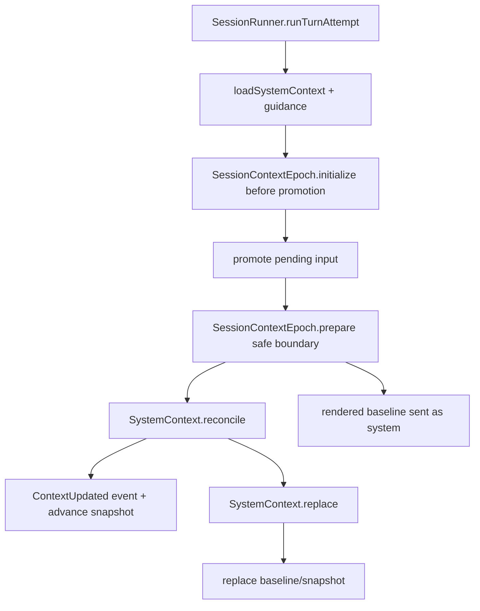

> V2 Context Epoch 是一代已准入的 privileged System Context:它保存 baseline 文本、结构化 snapshot、effective agent、baseline seq 与 revision;baseline/snapshot admission 和 model-visible context updates 在 safe provider-turn boundary 完成,而 replacement request marker 可由 projector 事件处理器提前记录。

## 能回答的问题
- System Context 与 Session History 的边界是什么?
- 第一次 prompt 为什么要等完整 context observation?
- agent/model/compaction 何时触发 context replacement?
- unavailable source 在 reconcile 与 replace 中有什么不同?

## 端到端步骤

1. `CONTEXT.md` 把 System Context 定义为呈现给模型的结构化 contextual facts 集合;Context Snapshot 才是 model-hidden JSON state,Context Epoch 是一段 initially rendered System Context 保持 immutable 的时期。[E: CONTEXT.md:8][E: CONTEXT.md:27][E: CONTEXT.md:34]

2. `SystemContext.Source@packages/core/src/system-context/index.ts:32` 定义每个 source 的 `key/codec/load/baseline/update/removed`;`SystemContext` 本身是 opaque carrier,内部保存 packed sources。[E: packages/core/src/system-context/index.ts:32][E: packages/core/src/system-context/index.ts:44]

3. `SystemContext.unavailable@packages/core/src/system-context/index.ts:28` 表示 source 暂时不可观测;这与 source 被移除不同,因为 reconcile 会保留已准入 snapshot,replace 会阻塞不完整 replacement。[E: packages/core/src/system-context/index.ts:28][E: packages/core/src/system-context/index.ts:247][E: packages/core/src/system-context/index.ts:283]

4. `SessionRunner.loadSystemContext@packages/core/src/session/runner/llm.ts:170` 把 location-wide system context、skill guidance、reference guidance 合并成 turn context input。[E: packages/core/src/session/runner/llm.ts:170]

5. `runTurnAttempt@packages/core/src/session/runner/llm.ts:184` 在 promote pending input 前调用 `SessionContextEpoch.initialize`;这保证首次完整 baseline 在 pending prompt 变成 model-visible Session history 前准备好,随后 baseline 作为 provider request 的 system part 发送。[E: packages/core/src/session/runner/llm.ts:184][E: specs/v2/session.md:51][E: packages/core/src/session/runner/llm.ts:222]

6. `SessionContextEpoch.initialize@packages/core/src/session/context-epoch.ts:42` 调 `initializeOnce`;若 epoch 不存在,`initializeOnce` 观察 context 并调用 `SystemContext.initialize`,随后 insert baseline/snapshot。[E: packages/core/src/session/context-epoch.ts:42][E: packages/core/src/session/context-epoch.ts:119][E: packages/core/src/session/context-epoch.ts:120]

7. `SystemContext.initialize@packages/core/src/system-context/index.ts:194` 对 sources 做 unbounded 并发 observe;只要有 unavailable entry 就返回 `InitializationBlocked`,否则 `initializeObservation` 生成 baseline 与 snapshot。[E: packages/core/src/system-context/index.ts:178][E: packages/core/src/system-context/index.ts:194][E: packages/core/src/system-context/index.ts:197][E: packages/core/src/system-context/index.ts:204]

8. `insert@packages/core/src/session/context-epoch.ts:189` 在 immediate transaction 中校验 session 仍在指定 location 且 agent 没变,读取 `SessionInput.latestSeq` 作为 baseline seq,再插入 `SessionContextEpochTable`。[E: packages/core/src/session/context-epoch.ts:189][E: packages/core/src/session/context-epoch.ts:200][E: packages/core/src/session/context-epoch.ts:216][E: packages/core/src/session/context-epoch.ts:217][E: packages/core/src/session/context-epoch.ts:236]

9. prompt promotion 后,runner 使用 initialized result 或调用 `SessionContextEpoch.prepare`;prepare 会读取当前 context 与 stored epoch,如果 stored 不存在就初始化,否则 decode snapshot 并判断是否需要 reconcile 或 replace。[E: packages/core/src/session/runner/llm.ts:201][E: packages/core/src/session/context-epoch.ts:67][E: packages/core/src/session/context-epoch.ts:75][E: packages/core/src/session/context-epoch.ts:82]

10. `prepareOnce@packages/core/src/session/context-epoch.ts:85` 在 selected agent 没变且没有 `replacement_seq` 时走 `SystemContext.reconcile`;否则走 `SystemContext.replace`。[E: packages/core/src/session/context-epoch.ts:85][E: packages/core/src/session/context-epoch.ts:87][E: packages/core/src/session/context-epoch.ts:89]

11. `SystemContext.reconcile@packages/core/src/system-context/index.ts:214` 会比较当前 sources 与 previous snapshot:unavailable source 保留旧 snapshot,新 source 追加 baseline text,changed source 追加 update text,可渲染 removal 时追加 removed text。[E: packages/core/src/system-context/index.ts:214][E: packages/core/src/system-context/index.ts:247][E: packages/core/src/system-context/index.ts:251][E: packages/core/src/system-context/index.ts:264][E: packages/core/src/system-context/index.ts:268]

12. reconcile 产生 `Updated` 时,`prepareOnce` 发布 `SessionEvent.ContextUpdated`,并用 EventV2 commit hook 调 `advance` 原子更新 epoch snapshot/revision。[E: packages/core/src/session/context-epoch.ts:104][E: packages/core/src/session/context-epoch.ts:107][E: packages/core/src/session/context-epoch.ts:323]

13. replacement ready 时,`prepareOnce` 以 `replacement_seq` 或 latest seq 作为新 baseline seq,调用 `replace` 写入新 baseline/snapshot/agent 并清空 replacement marker。[E: packages/core/src/session/context-epoch.ts:98][E: packages/core/src/session/context-epoch.ts:99][E: packages/core/src/session/context-epoch.ts:241][E: packages/core/src/session/context-epoch.ts:256]

14. `requestReplacement@packages/core/src/session/context-epoch.ts:159` 只在现有 baseline seq 小于触发 seq 时更新 `replacement_seq` 并 bump revision;Session projector 会在 agent switch、model switch、以及 version 2 `Compaction.Ended` 后调用它,并显式忽略 version 1 compaction ended event。[E: packages/core/src/session/context-epoch.ts:159][E: packages/core/src/session/context-epoch.ts:170][E: packages/core/src/session/projector.ts:333][E: packages/core/src/session/projector.ts:346][E: packages/core/src/session/projector.ts:438][E: packages/core/src/session/projector.ts:439][E: packages/core/src/session/projector.ts:444]

15. fence/current/advance 都检查 revision 或 selected agent,防止 stale observation 把过期 baseline 写入 durable epoch。[E: packages/core/src/session/context-epoch.ts:280][E: packages/core/src/session/context-epoch.ts:298][E: packages/core/src/session/context-epoch.ts:323]

## 关键决策点

- Safe provider-turn boundary 是 Context Epoch 的核心约束:runner promote input 后才 reconcile,变更作为 chronological System message 进入 history,并让 snapshot advance 与事件提交绑定。[E: packages/core/src/session/runner/llm.ts:193][E: packages/core/src/session/runner/llm.ts:201][E: packages/core/src/session/context-epoch.ts:104]
- Replacement 与 reconcile 不同:replacement 要构造完整新 baseline,如果已准入 source unavailable 则返回 `ReplacementBlocked`,不会把上一 agent 的 privileged baseline 暴露给下一 agent。[E: packages/core/src/system-context/index.ts:279][E: packages/core/src/system-context/index.ts:283][E: packages/core/src/session/context-epoch.ts:90]
- `SystemContext.Key` 是 context source 的 namespaced identity,`SystemContext.combine` 会立即拒绝重复 key。[E: packages/core/src/system-context/index.ts:22][E: packages/core/src/system-context/index.ts:172][E: packages/core/src/system-context/index.ts:310]

## 深挖入口
- System Context algebra: `session-v2.system-context-algebra`
- Compaction 如何请求 epoch replacement: `session-v2.compaction`

## Sources
- packages/core/src/session/context-epoch.ts
- packages/core/src/system-context/index.ts
- packages/core/src/session/runner/llm.ts
- packages/core/src/session/projector.ts
- CONTEXT.md
- specs/v2/session.md

## 相关
- [session-v2.system-context-algebra](../subsystems/session-v2/system-context-algebra.md)
- [session-v2.compaction](../subsystems/session-v2/compaction.md)
