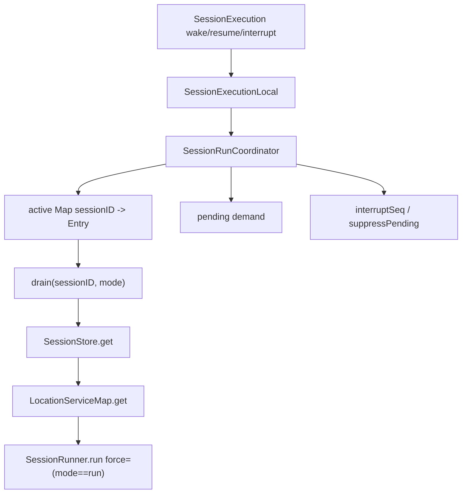

> V2 coordinator 是 process-local 的 session drain lane:它把 advisory wake、explicit run 和 interrupt 合并成每个 session 最多一个 active drain 和一个 coalesced follow-up。

## 能回答的问题
- `wake` 与 `run` 在 coordinator 中有什么区别?
- 同一个 session 同时进来多个 prompt 时怎样合并?
- interrupt 如何抑制旧 wake?
- runner 为什么能按 location-scoped services 执行?

## 端到端步骤

1. `SessionExecution.Interface@packages/core/src/session/execution.ts:7` 只定义 `resume`、`wake`、`interrupt`;execution 与 coordinator 之间没有携带 full session object,只携带 session id 与可选 seq。[E: packages/core/src/session/execution.ts:7]

2. `SessionExecutionLocal.layer@packages/core/src/session/execution/local.ts:11` 从 `SessionStore`、`LocationServiceMap`、`SessionRunCoordinator` 取依赖,并定义本地 `drain(sessionID, mode)`。[E: packages/core/src/session/execution/local.ts:11][E: packages/core/src/session/execution/local.ts:13]

3. `drain@packages/core/src/session/execution/local.ts:16` 读取 session,根据 `session.location` 获取 location-scoped layer,再在该 layer 内调用 `SessionRunner.run({ sessionID, force: mode === "run" })`。[E: packages/core/src/session/execution/local.ts:16][E: packages/core/src/session/execution/local.ts:18][E: packages/core/src/session/execution/local.ts:21]

4. `SessionExecutionLocal` 把 `resume` 映射为 `coordinator.run`,把 `wake` 映射为 `coordinator.wake`,把 `interrupt` 映射为 `coordinator.interrupt`。[E: packages/core/src/session/execution/local.ts:27][E: packages/core/src/session/execution/local.ts:28][E: packages/core/src/session/execution/local.ts:30]

5. `SessionRunCoordinator.make@packages/core/src/session/run-coordinator.ts:65` 创建 scoped coordinator,内部 `active` 是 `Map<Key, Entry>`;一个 Entry 保存 `current` demand、可选 `pending` demand、owner fiber、interrupt seq 与 deferred waiters。[E: packages/core/src/session/run-coordinator.ts:65][E: packages/core/src/session/run-coordinator.ts:70][E: packages/core/src/session/run-coordinator.ts:41]

6. `coalesce@packages/core/src/session/run-coordinator.ts:53` 的规则是 run demand 覆盖 wake demand,两个 wake 合并时保留最大 seq。[E: packages/core/src/session/run-coordinator.ts:53][E: packages/core/src/session/run-coordinator.ts:54][E: packages/core/src/session/run-coordinator.ts:55]

7. `wake@packages/core/src/session/run-coordinator.ts:161` 如果 session 已 active,会检查 interrupt 边界与 wake 接受条件,然后把 follow-up demand 合并到 `entry.pending`;如果 idle,会创建 wake entry 并 start owner fiber。[E: packages/core/src/session/run-coordinator.ts:161][E: packages/core/src/session/run-coordinator.ts:164][E: packages/core/src/session/run-coordinator.ts:166][E: packages/core/src/session/run-coordinator.ts:172]

8. `run@packages/core/src/session/run-coordinator.ts:221` 是 explicit drain:如果当前 active demand 是 wake,它会把 pending 升级成 run 并让调用方等待 explicit waiter;如果当前已经是 run,调用方等待同一个 done deferred。[E: packages/core/src/session/run-coordinator.ts:221][E: packages/core/src/session/run-coordinator.ts:229][E: packages/core/src/session/run-coordinator.ts:230][E: packages/core/src/session/run-coordinator.ts:234]

9. `start@packages/core/src/session/run-coordinator.ts:93` fork owner fiber 执行 `options.drain(key, demand._tag)`,并在 exit 时调用 `settle`。[E: packages/core/src/session/run-coordinator.ts:93][E: packages/core/src/session/run-coordinator.ts:95][E: packages/core/src/session/run-coordinator.ts:103]

10. `settle@packages/core/src/session/run-coordinator.ts:112` 在成功且不 stopping 时,若有 pending demand 就把 pending 升为 current 并启动 successor;否则从 active map 删除 entry 并完成 waiters。[E: packages/core/src/session/run-coordinator.ts:112][E: packages/core/src/session/run-coordinator.ts:131][E: packages/core/src/session/run-coordinator.ts:132][E: packages/core/src/session/run-coordinator.ts:139]

11. `interrupt@packages/core/src/session/run-coordinator.ts:193` 记录最新 interrupt seq,中断 owner fiber,并调用 `suppressPendingAtOrBefore`;该 helper 仅保留 seq 晚于 interrupt seq 的 pending wake,否则清空 pending demand。[E: packages/core/src/session/run-coordinator.ts:193][E: packages/core/src/session/run-coordinator.ts:199][E: packages/core/src/session/run-coordinator.ts:215][E: packages/core/src/session/run-coordinator.ts:257][E: packages/core/src/session/run-coordinator.ts:262][E: packages/core/src/session/run-coordinator.ts:265]

12. `SessionRunCoordinator.layer@packages/core/src/session/run-coordinator.ts:273` 把 generic coordinator 固化成 session runner coordinator,其 drain 函数就是 `runner.run({ sessionID, force: mode === "run" })`。[E: packages/core/src/session/run-coordinator.ts:273][E: packages/core/src/session/run-coordinator.ts:278]

## 关键决策点

- `wake` 是 durable work 到达后的 advisory signal;`run` 是 explicit drain request,会等待当前或后续 drain 的完成结果。[E: packages/core/src/session/run-coordinator.ts:31][E: packages/core/src/session/run-coordinator.ts:33][E: packages/core/src/session/run-coordinator.ts:221]
- coordinator 是 process-local 结构,因为 `active` 与 `interruptSeq` 都是内存 `Map`;跨进程 ownership 不是这个文件已经完成的能力。[E: packages/core/src/session/run-coordinator.ts:70][E: packages/core/src/session/run-coordinator.ts:71]
- location wiring 在 execution local 层完成,runner 本身拿到的是 location-scoped service graph,不是全局 service graph。[E: packages/core/src/session/execution/local.ts:18][E: packages/core/src/session/execution/local.ts:21]

## 深挖入口
- Provider turn 的 runner 逻辑: `spine.v2-provider-turn`
- Location scoped layer 组成: `session-v2.location-wiring`

## Sources
- packages/core/src/session/run-coordinator.ts
- packages/core/src/session/execution/local.ts
- packages/core/src/session/execution.ts
- packages/core/src/session/runner/index.ts

## 相关
- [spine.v2-provider-turn](v2-provider-turn.md)
- [session-v2.location-wiring](../subsystems/session-v2/location-wiring.md)
