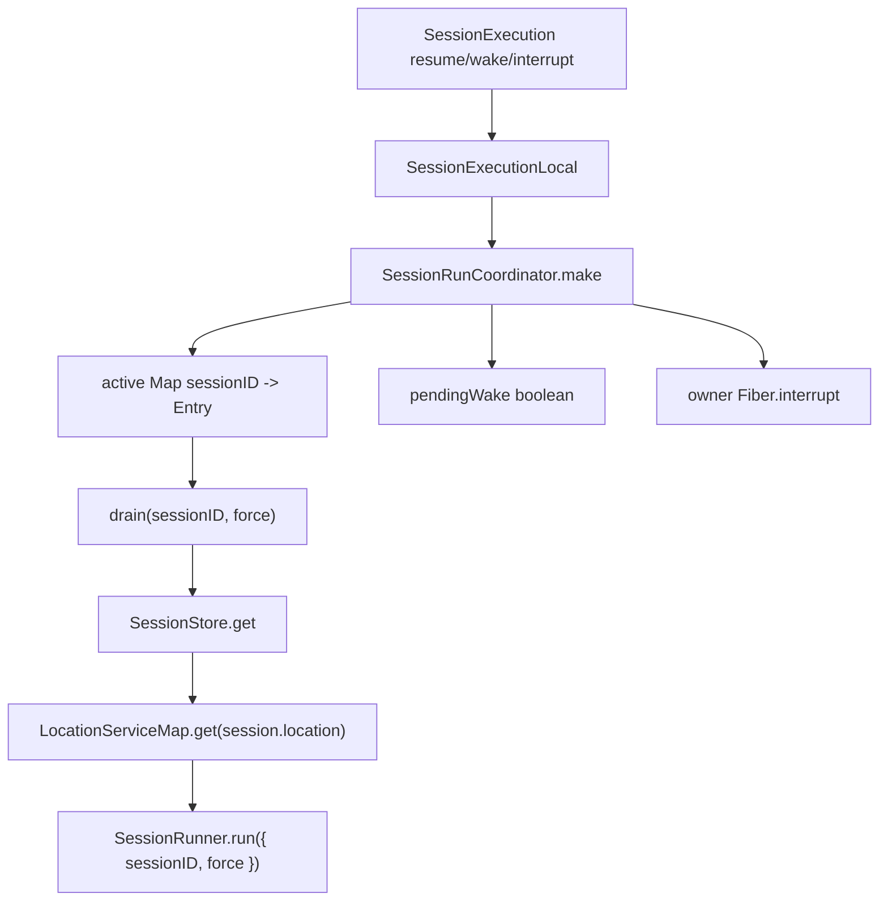

> V2 coordinator 是 process-local 的 session drain lane:它让每个 session key 同时最多一个 owner fiber,把 prompt wake 合并成一个 follow-up,并让 explicit resume 等待当前 drain 完成。

## 能回答的问题
- `wake` 与 `resume/run` 在 coordinator 中有什么区别?
- 同一个 session 同时进来多个 prompt 时怎样合并?
- interrupt 如何停止当前 owner 并清掉 follow-up wake?
- runner 为什么能按 location-scoped services 执行?

## 端到端步骤

1. `SessionExecution.Interface` 只定义 `active/resume/wake/interrupt`;execution 与 coordinator 之间只携带 session id,没有携带 full session object。[E: packages/core/src/session/execution.ts:9][E: packages/core/src/session/execution.ts:13][E: packages/core/src/session/execution.ts:15][E: packages/core/src/session/execution.ts:17]

2. `SessionExecutionLocal.layer` 从 `SessionStore`、`LocationServiceMap` 与 `SessionRunCoordinator.make` 取依赖,并把 coordinator drain 定义为读取 session 后进入该 session 的 location-scoped layer。[E: packages/core/src/session/execution/local.ts:11][E: packages/core/src/session/execution/local.ts:14][E: packages/core/src/session/execution/local.ts:16][E: packages/core/src/session/execution/local.ts:18][E: packages/core/src/session/execution/local.ts:21]

3. `drain` 在 location layer 内调用 `SessionRunner.Service.use(runner => runner.run({ sessionID, force }))`,因此 runner 看到的是 location-scoped service graph,不是全局 service graph。[E: packages/core/src/session/execution/local.ts:20][E: packages/core/src/session/execution/local.ts:21]

4. `SessionExecutionLocal` 把 `resume` 映射为 `coordinator.run`,把 `wake` 映射为 `coordinator.wake`,把 `interrupt` 映射为 `coordinator.interrupt`。[E: packages/core/src/session/execution/local.ts:31][E: packages/core/src/session/execution/local.ts:33][E: packages/core/src/session/execution/local.ts:34][E: packages/core/src/session/execution/local.ts:35]

5. `SessionRunCoordinator.make` 创建 scoped coordinator,内部 `active` 是 `Map<Key, Entry>`;一个 Entry 保存 `done` deferred、可选 owner fiber、`pendingWake` 与 `stopping`。[E: packages/core/src/session/run-coordinator.ts:24][E: packages/core/src/session/run-coordinator.ts:28][E: packages/core/src/session/run-coordinator.ts:17][E: packages/core/src/session/run-coordinator.ts:20][E: packages/core/src/session/run-coordinator.ts:21]

6. `start` fork owner fiber 执行 `options.drain(key, force)`,并在 exit 时调用 `settle`。[E: packages/core/src/session/run-coordinator.ts:37][E: packages/core/src/session/run-coordinator.ts:39][E: packages/core/src/session/run-coordinator.ts:41][E: packages/core/src/session/run-coordinator.ts:42]

7. `run` 是 explicit drain:如果 key 已 active,调用方等待当前 `done`;如果 idle,它创建 entry、用 `force=true` 启动 owner,并等待该 entry 完成。[E: packages/core/src/session/run-coordinator.ts:67][E: packages/core/src/session/run-coordinator.ts:70][E: packages/core/src/session/run-coordinator.ts:72][E: packages/core/src/session/run-coordinator.ts:75][E: packages/core/src/session/run-coordinator.ts:77]

8. `wake` 是 advisory signal:如果 key 已 active,只设置 `entry.pendingWake = true`;如果 idle,它创建 entry 并用 `force=false` 启动 owner。[E: packages/core/src/session/run-coordinator.ts:81][E: packages/core/src/session/run-coordinator.ts:83][E: packages/core/src/session/run-coordinator.ts:85][E: packages/core/src/session/run-coordinator.ts:89][E: packages/core/src/session/run-coordinator.ts:91]

9. `settle` 在成功且未 stopping 且有 `pendingWake` 时复用同一个 entry 启动 successor;否则根据是否仍有 pending wake 建新 entry 或删除 active key,最后完成当前 `done`。[E: packages/core/src/session/run-coordinator.ts:51][E: packages/core/src/session/run-coordinator.ts:52][E: packages/core/src/session/run-coordinator.ts:54][E: packages/core/src/session/run-coordinator.ts:58][E: packages/core/src/session/run-coordinator.ts:59][E: packages/core/src/session/run-coordinator.ts:64]

10. `interrupt` 若存在 owner fiber,会设置 `stopping=true`、清空 `pendingWake=false`,再中断 owner fiber;idle interruption 是 no-op。[E: packages/core/src/session/run-coordinator.ts:94][E: packages/core/src/session/run-coordinator.ts:97][E: packages/core/src/session/run-coordinator.ts:98][E: packages/core/src/session/run-coordinator.ts:99][E: packages/core/src/session/run-coordinator.ts:100]

## 关键决策点

- `wake` 只合并为一个 follow-up boolean,当前源码不再携带 admitted seq 或 run/wake demand object。[E: packages/core/src/session/run-coordinator.ts:20][E: packages/core/src/session/run-coordinator.ts:85]
- coordinator 是 process-local 结构,因为 `active`、owner fiber 与 pending wake 都是内存状态。[E: packages/core/src/session/run-coordinator.ts:28][E: packages/core/src/session/run-coordinator.ts:19][E: packages/core/src/session/run-coordinator.ts:20]
- location wiring 在 execution local 层完成,runner 本身拿到的是 location-scoped service graph。[E: packages/core/src/session/execution/local.ts:18][E: packages/core/src/session/execution/local.ts:21]

## 深挖入口
- Provider turn 的 runner 逻辑: `spine.v2-provider-turn`
- Location scoped layer 组成: `session-v2.location-wiring`

## Sources
- packages/core/src/session/run-coordinator.ts
- packages/core/src/session/execution/local.ts
- packages/core/src/session/execution.ts
- packages/core/src/session/runner/index.ts

## 相关
- [spine.v2-provider-turn](v2-provider-turn.md)
- [session-v2.location-wiring](../subsystems/session-v2/location-wiring.md)
