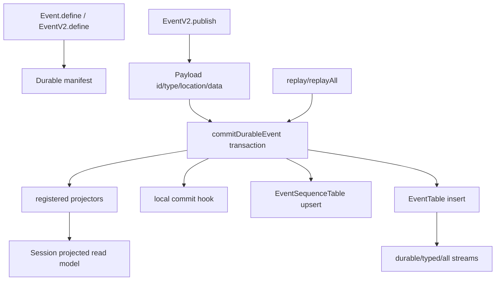

> V2 event sourcing 是 core 的同步 durable event 层:durable event 以 aggregate seq 写入 EventTable,同一 SQLite immediate transaction 内运行 projectors 与 local commit hook,再通知 live subscribers。

## 能回答的问题
- EventV2 durable event 的 seq/version/location 从哪里来?
- event table 与 event_sequence table 存什么?
- projector 是在事件写入前还是写入后运行?
- replay 如何保证 sequence 与 owner 不发散?
- Session projector 怎样把 events 投影成 session tables?

## 端到端步骤

1. `Event.Definition` 可带 `durable` 配置;durable 配置指定 `version` 与 aggregate field 名。[E: packages/schema/src/event.ts:15][E: packages/schema/src/event.ts:20][E: packages/schema/src/event.ts:21][E: packages/schema/src/event.ts:22]

2. `Event.Payload` 的公共字段包括 `id/type/data/durable/location/metadata`;其中 `durable.seq` 是 durable event commit 时填充的 aggregate order。[E: packages/schema/src/event.ts:29][E: packages/schema/src/event.ts:30][E: packages/schema/src/event.ts:33][E: packages/schema/src/event.ts:35][E: packages/schema/src/event.ts:38][E: packages/schema/src/event.ts:39]

3. `Event.define` 根据 input schema 创建 payload schema,并把 static `type/durable/data` 附到 schema 上;`EventV2.define` 当前是 `Event.define` 的 re-export alias。[E: packages/schema/src/event.ts:42][E: packages/schema/src/event.ts:53][E: packages/schema/src/event.ts:54][E: packages/schema/src/event.ts:65][E: packages/schema/src/event.ts:66][E: packages/schema/src/event.ts:67][E: packages/core/src/event.ts:115]

4. `Event.durable` 把 durable definitions 编成 versioned type map;全局 durable manifest 合并 V1 durable definitions 与 V2 session durable definitions。[E: packages/schema/src/event.ts:98][E: packages/schema/src/event.ts:101][E: packages/schema/src/event.ts:102][E: packages/schema/src/durable-event-manifest.ts:12][E: packages/schema/src/durable-event-manifest.ts:13][E: packages/schema/src/durable-event-manifest.ts:14]

5. `EventSequenceTable` 以 `aggregate_id` 为 primary key,保存最新 `seq` 与可选 `owner_id`;`EventTable` 以 event id 为 primary key,并把 `(aggregate_id, seq)` 设为 unique index。[E: packages/core/src/event/sql.ts:4][E: packages/core/src/event/sql.ts:5][E: packages/core/src/event/sql.ts:6][E: packages/core/src/event/sql.ts:7][E: packages/core/src/event/sql.ts:10][E: packages/core/src/event/sql.ts:13][E: packages/core/src/event/sql.ts:22]

6. `EventV2.publish` 会从 `Location.Service` 或 options 补 location,填充 event id、type、metadata、location、data,然后进入 `publishEvent`。[E: packages/core/src/event.ts:419][E: packages/core/src/event.ts:421][E: packages/core/src/event.ts:423][E: packages/core/src/event.ts:430][E: packages/core/src/event.ts:431][E: packages/core/src/event.ts:432][E: packages/core/src/event.ts:433][E: packages/core/src/event.ts:434]

7. `publishEvent` 拒绝给非 durable event 使用 local commit hook;durable event 调 `commitDurableEvent` 并把返回 seq/version 填回 event 后通知 subscribers。[E: packages/core/src/event.ts:369][E: packages/core/src/event.ts:371][E: packages/core/src/event.ts:379][E: packages/core/src/event.ts:383][E: packages/core/src/event.ts:385][E: packages/core/src/event.ts:386][E: packages/core/src/event.ts:389]

8. `commitDurableEvent` 先验证 aggregate field 是 string,再取得该 event type 注册的 projectors。[E: packages/core/src/event.ts:205][E: packages/core/src/event.ts:217][E: packages/core/src/event.ts:219][E: packages/core/src/event.ts:220][E: packages/core/src/event.ts:236]

9. durable commit 在 SQLite immediate transaction 中执行:读取 current sequence/owner,处理 strict owner、replay divergence、sequence mismatch 与重复 event id,再按顺序运行 projectors 与 local commit hook。[E: packages/core/src/event.ts:239][E: packages/core/src/event.ts:240][E: packages/core/src/event.ts:243][E: packages/core/src/event.ts:254][E: packages/core/src/event.ts:262][E: packages/core/src/event.ts:284][E: packages/core/src/event.ts:295][E: packages/core/src/event.ts:303][E: packages/core/src/event.ts:320][E: packages/core/src/event.ts:323]

10. 同一 transaction 末尾 upsert `EventSequenceTable` 并 insert `EventTable`,因此 projector 或 local commit hook 失败会阻止 event row 落库。[E: packages/core/src/event.ts:324][E: packages/core/src/event.ts:336][E: packages/core/src/event.ts:337][E: packages/core/src/event.ts:347]

11. transaction 成功后,commit 会 wake durable aggregate subscribers;`publishEvent` 再通知 typed pubsub 与 all pubsub。[E: packages/core/src/event.ts:354][E: packages/core/src/event.ts:355][E: packages/core/src/event.ts:357][E: packages/core/src/event.ts:389][E: packages/core/src/event.ts:406][E: packages/core/src/event.ts:413][E: packages/core/src/event.ts:415]

12. `durable({ aggregateID, after })` 会先注册 aggregate wake subscription,读取 historical rows,再把 historical stream 与 live reread stream 串接。[E: packages/core/src/event.ts:585][E: packages/core/src/event.ts:588][E: packages/core/src/event.ts:590][E: packages/core/src/event.ts:597][E: packages/core/src/event.ts:598][E: packages/core/src/event.ts:602]

13. `replay` 从 durable manifest 解码 serialized event,用传入 seq/aggregateID/ownerID/strictOwner 调 `commitDurableEvent`;如果 options.publish 为真,再把 committed payload 通知 subscribers。[E: packages/core/src/event.ts:441][E: packages/core/src/event.ts:446][E: packages/core/src/event.ts:452][E: packages/core/src/event.ts:455][E: packages/core/src/event.ts:457][E: packages/core/src/event.ts:458][E: packages/core/src/event.ts:463]

14. `replayAll` 要求所有 replay events 属于同一 aggregate,并检查序列连续;`claim` 则把 aggregate 的 owner 写到 `EventSequenceTable.owner_id`。[E: packages/core/src/event.ts:480][E: packages/core/src/event.ts:485][E: packages/core/src/event.ts:487][E: packages/core/src/event.ts:495][E: packages/core/src/event.ts:498][E: packages/core/src/event.ts:525][E: packages/core/src/event.ts:528]

15. `SessionProjector.layer` 在 layer 启动时注册 session 相关 projector;当前 EventV2 文件没有 before-commit guard 注册接口,session input 冲突由 projector 内部 die 处理。[E: packages/core/src/session/projector.ts:211][E: packages/core/src/session/projector.ts:215][E: packages/core/src/session/projector.ts:350][E: packages/core/src/session/projector.ts:364]

16. Session projector 把 V1 session created/updated/deleted、V1 message/part update、V2 prompt admitted/prompted、context/tool/text/step/reasoning events 与 `Compaction.Ended` 等投影到 session read model;这个文件没有注册 `Compaction.Started` 或 `Compaction.Delta` projector。[E: packages/core/src/session/projector.ts:215][E: packages/core/src/session/projector.ts:235][E: packages/core/src/session/projector.ts:259][E: packages/core/src/session/projector.ts:262][E: packages/core/src/session/projector.ts:331][E: packages/core/src/session/projector.ts:350][E: packages/core/src/session/projector.ts:364][E: packages/core/src/session/projector.ts:377][E: packages/core/src/session/projector.ts:381][E: packages/core/src/session/projector.ts:388][E: packages/core/src/session/projector.ts:395]

17. `SessionEvent.DurableDefinitions` 包含 durable V2 session events,其中包含 `Compaction.Started` 与 `Compaction.Ended`;`Definitions` 额外包含 live-only deltas,包括 `Text.Delta`、`Reasoning.Delta`、`Tool.Input.Delta`、`Compaction.Delta`。[E: packages/schema/src/session-event.ts:448][E: packages/schema/src/session-event.ts:472][E: packages/schema/src/session-event.ts:473][E: packages/schema/src/session-event.ts:479][E: packages/schema/src/session-event.ts:493][E: packages/schema/src/session-event.ts:496][E: packages/schema/src/session-event.ts:499][E: packages/schema/src/session-event.ts:507]

## 关键决策点

- EventV2 的 projector 是 commit-time projection:projector 在 event row insert 前运行,而不是异步消费落库后的 log。[E: packages/core/src/event.ts:320][E: packages/core/src/event.ts:336]
- `PublishOptions.commit` 只允许 durable event 使用,这让 local operational projection hook 与 event seq 在同一个 durable commit 内绑定。[E: packages/core/src/event.ts:118][E: packages/core/src/event.ts:123][E: packages/core/src/event.ts:371][E: packages/core/src/event.ts:323]
- replay owner 与 sequence 检查在 `commitDurableEvent` 内,因此 replay divergent event 会 die,不会静默覆盖本地 aggregate log。[E: packages/core/src/event.ts:254][E: packages/core/src/event.ts:262][E: packages/core/src/event.ts:284][E: packages/core/src/event.ts:295]

## 深挖入口
- Session projector: `session-v2.projector`
- Event SQL/persistence: `persistence.eventing`
- Event definition catalog: `ref.events`

## Sources
- packages/schema/src/event.ts
- packages/schema/src/session-event.ts
- packages/schema/src/durable-event-manifest.ts
- packages/core/src/event.ts
- packages/core/src/event/sql.ts
- packages/core/src/session/projector.ts

## 相关
- [session-v2.projector](../subsystems/session-v2/projector.md)
- [persistence.eventing](../subsystems/persistence/eventing.md)
- [ref.events](../reference/events.md)
