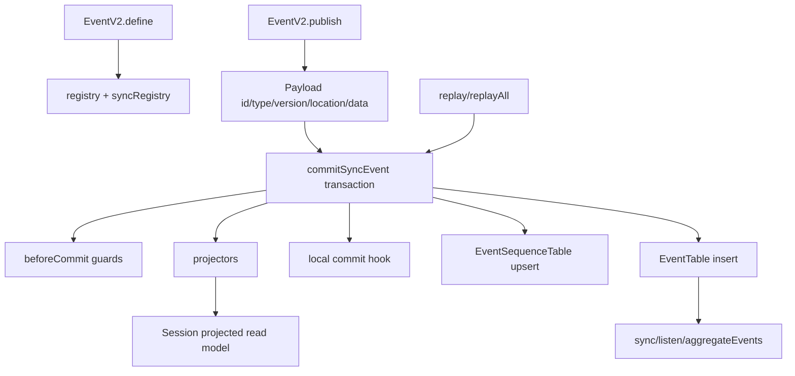

> V2 event sourcing 是 core 的同步事件层:每个 synchronized event 以 aggregate seq 写入 EventTable,同一 transaction 内运行 commit guards、projectors 与 local commit hook,再通知 live subscribers。

## 能回答的问题
- EventV2 synchronized event 的 seq/version/location 从哪里来?
- event table 与 event_sequence table 存什么?
- projector 是在事件写入前还是写入后运行?
- replay 如何保证 sequence 与 owner 不发散?
- Session projector 怎样把 events 投影成 session tables?

## 端到端步骤

1. `EventV2.Definition@packages/core/src/event.ts:29` 可带 `sync` 配置;同步配置指定 `version` 与 aggregate field 名。[E: packages/core/src/event.ts:29][E: packages/core/src/event.ts:31]

2. `EventV2.Payload@packages/core/src/event.ts:40` 的公共字段包括 `id/type/data/seq/version/location/metadata/replay`;其中 `seq` 是 synchronized event 投影时填充的 aggregate order。[E: packages/core/src/event.ts:40][E: packages/core/src/event.ts:45]

3. `EventV2.define@packages/core/src/event.ts:96` 根据 input schema 创建 payload schema,注册 latest definition 到 `registry`,并把 versioned sync definition 注册到 `syncRegistry`。[E: packages/core/src/event.ts:96][E: packages/core/src/event.ts:114][E: packages/core/src/event.ts:119][E: packages/core/src/event.ts:123]

4. `EventSequenceTable@packages/core/src/event/sql.ts:4` 以 `aggregate_id` 为 primary key,保存最新 `seq` 与可选 `owner_id`;`EventTable` 以 event id 为 primary key,并把 `(aggregate_id, seq)` 设为 unique index。[E: packages/core/src/event/sql.ts:4][E: packages/core/src/event/sql.ts:10][E: packages/core/src/event/sql.ts:22]

5. `EventV2.publish@packages/core/src/event.ts:431` 会从 `Location.Service` 或 options 补 location,填充 event id、type、version、data,然后进入 `publishEvent`。[E: packages/core/src/event.ts:431][E: packages/core/src/event.ts:433][E: packages/core/src/event.ts:439]

6. `publishEvent@packages/core/src/event.ts:385` 先判断 definition 是否 synchronized;非 synchronized event 不能使用 local commit hook,synchronized event 调 `commitSyncEvent` 并把返回 seq 填回 event。[E: packages/core/src/event.ts:385][E: packages/core/src/event.ts:387][E: packages/core/src/event.ts:395][E: packages/core/src/event.ts:398]

7. `commitSyncEvent@packages/core/src/event.ts:215` 先验证 event version 与 aggregate field,并取得该 event type 注册的 projectors。[E: packages/core/src/event.ts:215][E: packages/core/src/event.ts:226][E: packages/core/src/event.ts:237][E: packages/core/src/event.ts:254]

8. durable commit 在 SQLite immediate transaction 中执行:读取当前 sequence/owner,处理 replay owner 与 sequence mismatch,拒绝重复 event id,再按顺序运行 commit guards、projectors、local commit hook。[E: packages/core/src/event.ts:257][E: packages/core/src/event.ts:271][E: packages/core/src/event.ts:311][E: packages/core/src/event.ts:320][E: packages/core/src/event.ts:333][E: packages/core/src/event.ts:336][E: packages/core/src/event.ts:339][E: packages/core/src/event.ts:367]

9. 同一 transaction 末尾 upsert `EventSequenceTable` 并 insert `EventTable`,因此 projector 失败会阻止 event row 落库。[E: packages/core/src/event.ts:340][E: packages/core/src/event.ts:352]

10. transaction 成功后,`publishEvent` 通知 sync handlers、typed pubsub 与 all pubsub;`aggregateEvents` 会先订阅该 aggregate 的 synchronized signal,再读取 historical rows,最后把 historical stream 与 live reread stream 串接。[E: packages/core/src/event.ts:399][E: packages/core/src/event.ts:418][E: packages/core/src/event.ts:606][E: packages/core/src/event.ts:612][E: packages/core/src/event.ts:621][E: packages/core/src/event.ts:626]

11. `replay@packages/core/src/event.ts:453` 从 `syncRegistry` 解码 serialized event,把 payload 标记为 `replay: true`,并用传入 seq/aggregateID/ownerID 调 `commitSyncEvent`。[E: packages/core/src/event.ts:453][E: packages/core/src/event.ts:464][E: packages/core/src/event.ts:469][E: packages/core/src/event.ts:471]

12. `replayAll@packages/core/src/event.ts:484` 要求所有 replay events 属于同一 aggregate,并检查序列连续;`claim` 则把 aggregate 的 owner 写到 `EventSequenceTable.owner_id`。[E: packages/core/src/event.ts:484][E: packages/core/src/event.ts:491][E: packages/core/src/event.ts:500][E: packages/core/src/event.ts:529]

13. `SessionProjector.layer@packages/core/src/session/projector.ts:212` 在 layer 启动时注册 session 相关 projector,并注册 `SessionInput.guardReservedID` 作为 before-commit guard。[E: packages/core/src/session/projector.ts:212][E: packages/core/src/session/projector.ts:216]

14. Session projector 把 V1 session created/updated/deleted、V1 message/part update、V2 prompt lifecycle、context/tool/text/step events 与 `Compaction.Ended` 投影到 session read model;这个文件没有注册 `Compaction.Started` projector。[E: packages/core/src/session/projector.ts:217][E: packages/core/src/session/projector.ts:237][E: packages/core/src/session/projector.ts:261][E: packages/core/src/session/projector.ts:264][E: packages/core/src/session/projector.ts:314][E: packages/core/src/session/projector.ts:383][E: packages/core/src/session/projector.ts:397][E: packages/core/src/session/projector.ts:415][E: packages/core/src/session/projector.ts:424][E: packages/core/src/session/projector.ts:431][E: packages/core/src/session/projector.ts:438]

15. `SessionEvent.DurableDefinitions@packages/core/src/session/event.ts:471` 把 durable session event definitions 列为数组;`EphemeralDefinitions` 包含 `Text.Delta`、`Tool.Input.Delta`、`Reasoning.Delta`、`Compaction.Delta`,而 `All` 由 durable 与 ephemeral 拼接得到。[E: packages/core/src/session/event.ts:471][E: packages/core/src/session/event.ts:500][E: packages/core/src/session/event.ts:505]

## 关键决策点

- EventV2 的 projector 是 commit-time projection:projector 在 event row insert 前运行,而不是异步消费落库后的 log。[E: packages/core/src/event.ts:336][E: packages/core/src/event.ts:352]
- `PublishOptions.commit` 只允许 synchronized event 使用,这让 local operational projection hook 与 event seq 在同一个 durable commit 内绑定。[E: packages/core/src/event.ts:139][E: packages/core/src/event.ts:388][E: packages/core/src/event.ts:339]
- replay owner 与 sequence 检查在 `commitSyncEvent` 内,因此 replay divergent event 会 die,不会静默覆盖本地 aggregate log。[E: packages/core/src/event.ts:271][E: packages/core/src/event.ts:301]

## 深挖入口
- Session projector: `session-v2.projector`
- Event SQL/persistence: `persistence.eventing`
- Event definition catalog: `ref.events`

## Sources
- packages/core/src/event.ts
- packages/core/src/event/sql.ts
- packages/core/src/session/projector.ts
- packages/core/src/session/event.ts

## 相关
- [session-v2.projector](../subsystems/session-v2/projector.md)
- [persistence.eventing](../subsystems/persistence/eventing.md)
- [ref.events](../reference/events.md)
