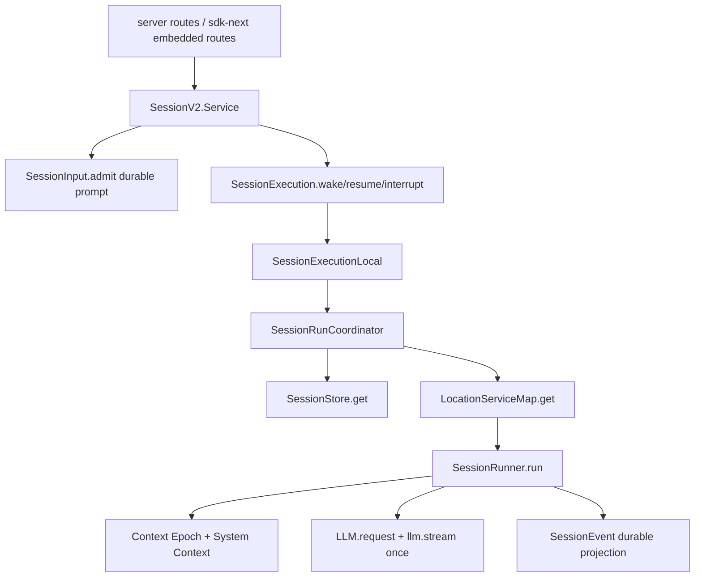

> V2 Session Core 是 `packages/core` 中的 Effect-native session engine:它把 durable prompt admission、process-local execution coordination、location-scoped runner/provider/tool 服务和 event sourcing 分开。

## 能回答的问题
- V2 session core 的边界在哪里?
- `prompt`、`wake`、`resume`、`run` 分别由哪个服务处理?
- 为什么 V2 说 admission 与 execution 分离?
- `SessionRunner` 如何约束 provider turn?

## 端到端步骤

1. V2 设计规范要求 durable prompt admission 与 model execution 分离,并要求 `SessionExecution` 是 process-global、以 `sessionID` 为 key。[E: AGENTS.md:153][E: AGENTS.md:155]

2. `SessionV2.Interface` 定义 public-facing session service,其中 `prompt` 返回 `SessionInput.Admitted`;实现层的 `resume` 调 `execution.resume(sessionID)`,实现层的 `interrupt` 直接调 `execution.interrupt(sessionID)`。[E: packages/core/src/session.ts:113][E: packages/core/src/session.ts:147][E: packages/core/src/session.ts:153][E: packages/core/src/session.ts:426][E: packages/core/src/session.ts:428][E: packages/core/src/session.ts:430][E: packages/core/src/session.ts:431]

3. `SessionV2.prompt` 读取 session 后,通过 `SessionInput.admit` 写入 durable admission event,并在 `resume !== false` 时调用 `execution.wake(admitted.sessionID)`。[E: packages/core/src/session.ts:360][E: packages/core/src/session.ts:363][E: packages/core/src/session.ts:368][E: packages/core/src/session.ts:382]

4. admission 与 execution 的代码边界是:`SessionInput.admit` 先返回 durable `Admitted`,然后 `SessionExecution.wake` 只收到 session id,不直接运行 runner 或携带 prompt payload。[E: packages/core/src/session.ts:368][E: packages/core/src/session.ts:380][E: packages/core/src/session.ts:382][E: packages/core/src/session/execution.ts:15]

5. `SessionExecution.Interface` 只暴露 `active/resume/wake/interrupt`;`SessionExecution.noopLayer` 存在于 core 中,而真正执行 runner 需要外层把 `SessionExecution.node` 替换成 local implementation。[E: packages/core/src/session/execution.ts:9][E: packages/core/src/session/execution.ts:13][E: packages/core/src/session/execution.ts:15][E: packages/core/src/session/execution.ts:17][E: packages/core/src/session/execution.ts:26][E: packages/server/src/routes.ts:52]

6. `SessionV2.node` 依赖 `SessionExecution.node`、`SessionStore.node`、`LocationServiceMap.node` 与 `SessionProjector.node`;因此 SessionV2 facade 本身不 hard-code runner placement。[E: packages/core/src/session.ts:474][E: packages/core/src/session.ts:481][E: packages/core/src/session.ts:482][E: packages/core/src/session.ts:483][E: packages/core/src/session.ts:484]

7. `SessionExecutionLocal.layer` 提供本地执行实现:drain 读取 session,从 `LocationServiceMap` 取 location-scoped layer,再在该 layer 中调用 `SessionRunner.run`。[E: packages/core/src/session/execution/local.ts:11][E: packages/core/src/session/execution/local.ts:18][E: packages/core/src/session/execution/local.ts:20][E: packages/core/src/session/execution/local.ts:21]

8. `SessionRunCoordinator` 为每个 sessionID 维护一个 active lane;`wake` 在 active 时只设置 `pendingWake = true`,而 `run` 在 idle 时以 `force=true` 启动 owner fiber并等待 done。[E: packages/core/src/session/run-coordinator.ts:28][E: packages/core/src/session/run-coordinator.ts:81][E: packages/core/src/session/run-coordinator.ts:85][E: packages/core/src/session/run-coordinator.ts:67][E: packages/core/src/session/run-coordinator.ts:77][E: packages/core/src/session/run-coordinator.ts:78]

9. `SessionRunner.run` 先判断 pending steer/queue,再失败化已中断 tool,然后在 provider-turn loop 内运行直到没有 immediate continuation 或 pending queue。[E: packages/core/src/session/runner/llm.ts:378][E: packages/core/src/session/runner/llm.ts:382][E: packages/core/src/session/runner/llm.ts:383][E: packages/core/src/session/runner/llm.ts:384][E: packages/core/src/session/runner/llm.ts:385][E: packages/core/src/session/runner/llm.ts:388][E: packages/core/src/session/runner/llm.ts:398]

10. 每个 provider turn 由 `runTurnAttempt` 构造 context、materialize tools、创建 `LLM.request`,再在 `llm.stream(request)` 处执行一次 provider stream。[E: packages/core/src/session/runner/llm.ts:168][E: packages/core/src/session/runner/llm.ts:192][E: packages/core/src/session/runner/llm.ts:198][E: packages/core/src/session/runner/llm.ts:200][E: packages/core/src/session/runner/llm.ts:207][E: packages/core/src/session/runner/llm.ts:227]

11. V2 规范也把这条链写成 `SessionExecution.resume(sessionID) -> SessionStore.get -> LocationServiceMap.get(session.location) -> SessionRunner.run`,并要求每个 provider turn 正好一次 `llm.stream(request)`。[E: specs/v2/session.md:39][E: specs/v2/session.md:42][E: specs/v2/session.md:44][E: specs/v2/session.md:45][E: specs/v2/session.md:50]

12. `packages/server/src/routes.ts` 是 V2 HTTP server 的 current embedded composition point:application services 包含 `SessionV2.node` 与 `LocationServiceMap.node`,并用 `AppNodeBuilder.build(... [[SessionExecution.node, SessionExecutionLocal.node]])` 接入本地 execution。[E: packages/server/src/routes.ts:26][E: packages/server/src/routes.ts:31][E: packages/server/src/routes.ts:36][E: packages/server/src/routes.ts:52]

13. `packages/sdk-next/src/opencode.ts` 的 embedded SDK 通过 `createEmbeddedRoutes()` 建本地 web handler,再用 generated `OpenCode.make` 创建 client,并额外暴露 `tools.register`。[E: packages/sdk-next/src/opencode.ts:10][E: packages/sdk-next/src/opencode.ts:23][E: packages/sdk-next/src/opencode.ts:35][E: packages/sdk-next/src/opencode.ts:41]

## 关键决策点

- 已删除的 `packages/core/src/public/opencode.ts` 不再是当前 V2 public composition point;current embedded composition 分散在 `packages/server/src/routes.ts` 与 `packages/sdk-next/src/opencode.ts`。[E: packages/server/src/routes.ts:47][E: packages/sdk-next/src/opencode.ts:10]
- V2 runner 服务是 location-scoped:根设计约束明确要求 `SessionRunner`、model、tool registry、permissions 和 filesystem Location-scoped。[E: AGENTS.md:156]
- V2 provider turn 不把 tool continuation 藏到 provider stream 内部:runner 在 stream event 中 settle local tool fibers,再根据 publisher/context 判断是否需要 continuation。[E: packages/core/src/session/runner/llm.ts:238][E: packages/core/src/session/runner/llm.ts:247][E: packages/core/src/session/runner/llm.ts:340]

## 深挖入口
- Admission 与 delivery: `spine.v2-admission`
- Run coordinator drain/coalesce: `spine.v2-coordinator`
- Provider turn 逐行走读: `spine.v2-provider-turn`
- V1/V2 迁移边界: `spine.v1-v2-relationship`

## Sources
- packages/core/src/session.ts
- packages/core/src/session/execution.ts
- packages/core/src/session/execution/local.ts
- packages/core/src/session/run-coordinator.ts
- packages/core/src/session/runner/llm.ts
- packages/server/src/routes.ts
- packages/sdk-next/src/opencode.ts
- AGENTS.md
- specs/v2/session.md

## 相关
- [spine.v2-admission](v2-admission.md)
- [spine.v2-provider-turn](v2-provider-turn.md)
- [spine.v1-v2-relationship](v1-v2-relationship.md)
