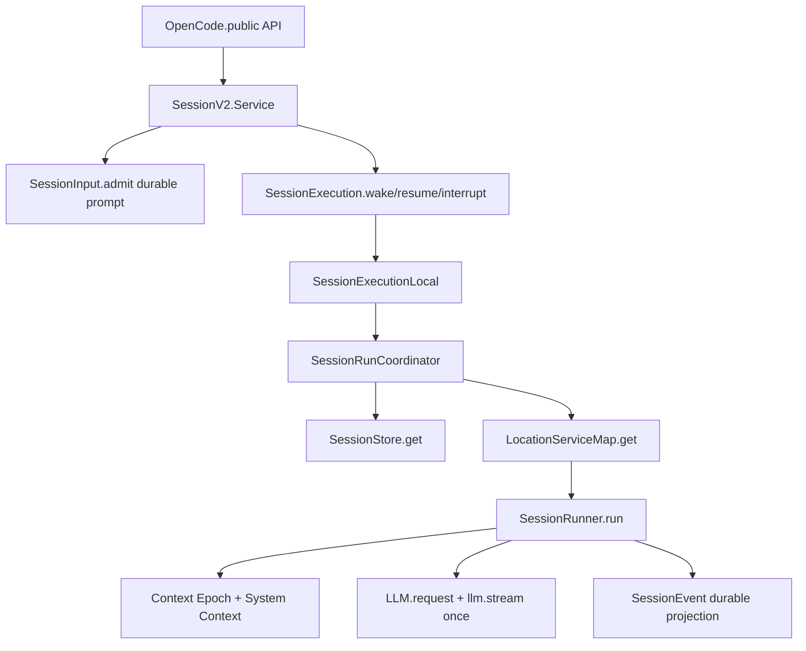

> V2 Session Core 是 `packages/core` 中的 Effect-native session engine:它把 durable prompt admission、process-global execution coordination、location-scoped runner/provider/tool 服务和 event sourcing 分开。

## 能回答的问题
- V2 session core 的边界在哪里?
- `prompt`、`wake`、`resume`、`run` 分别由哪个服务处理?
- 为什么 V2 说 admission 与 execution 分离?
- `SessionRunner` 如何约束 provider turn?

## 端到端步骤

1. V2 设计规范要求 prompt admission durable 且与 execution 分离,并要求 `SessionExecution` 是 process-global、以 `sessionID` 为 key。[E: AGENTS.md:150][E: AGENTS.md:152]

2. `SessionV2.Interface@packages/core/src/session.ts:105` 定义 public-facing session service,其中 `prompt` 返回 `SessionInput.Admitted`;实现层的 `resume` 调 `execution.resume(sessionID)`,实现层的 `interrupt` 调 `execution.interrupt(sessionID, event.seq)`。[E: packages/core/src/session.ts:105][E: packages/core/src/session.ts:137][E: packages/core/src/session.ts:405][E: packages/core/src/session.ts:418]

3. `SessionV2.prompt@packages/core/src/session.ts:348` 读取 session 后,在 `resume !== false` 时调用 `enqueueWake(admitted)`,同时通过 `SessionInput.admit` 写入 durable admission event。[E: packages/core/src/session.ts:348][E: packages/core/src/session.ts:351][E: packages/core/src/session.ts:353][E: packages/core/src/session.ts:359]

4. `enqueueWake@packages/core/src/session.ts:176` 不直接运行 runner,而是 fork 一个 `execution.wake(admitted.sessionID, admitted.admittedSeq)` fiber;这就是 admission 与 execution 分离的代码形态。[E: packages/core/src/session.ts:176][E: packages/core/src/session.ts:177][E: packages/core/src/session.ts:184]

5. `SessionExecution.Interface@packages/core/src/session/execution.ts:7` 只暴露 `resume/wake/interrupt`;`SessionV2.defaultLayer` 提供的是 `SessionExecution.noopLayer`,所以 V2 runner 必须由外层 layer 选择性接入。[E: packages/core/src/session/execution.ts:7][E: packages/core/src/session.ts:428][E: packages/core/src/session.ts:429]

6. `SessionExecutionLocal.layer@packages/core/src/session/execution/local.ts:11` 提供本地执行实现:drain 读取 session,从 `LocationServiceMap` 取 location-scoped layer,再在该 layer 中调用 `SessionRunner.run`。[E: packages/core/src/session/execution/local.ts:11][E: packages/core/src/session/execution/local.ts:16][E: packages/core/src/session/execution/local.ts:21]

7. `SessionRunCoordinator` 为每个 sessionID 维护一个 active lane;`coalesce` 规则保证 `"run"` demand 覆盖 `"wake"`,而 wake 会保留最大 admitted seq。[E: packages/core/src/session/run-coordinator.ts:41][E: packages/core/src/session/run-coordinator.ts:53]

8. `SessionRunner.run@packages/core/src/session/runner/llm.ts:373` 先判断 pending steer/queue,再失败化已中断 tool,然后在一个 open activity loop 内最多执行 `MAX_STEPS = 25` 次 provider turn。[E: packages/core/src/session/runner/llm.ts:373][E: packages/core/src/session/runner/llm.ts:377][E: packages/core/src/session/runner/llm.ts:380][E: packages/core/src/session/runner/llm.ts:383][E: packages/core/src/session/runner/llm.ts:385][E: packages/core/src/session/runner/llm.ts:88]

9. 每个 provider turn 由 `runTurnAttempt` 构造 context、materialize tools、创建 `LLM.request`,再在 `llm.stream(request)` 处执行一次 provider stream。[E: packages/core/src/session/runner/llm.ts:175][E: packages/core/src/session/runner/llm.ts:217][E: packages/core/src/session/runner/llm.ts:219][E: packages/core/src/session/runner/llm.ts:245]

10. V2 规范也把这条链写成 `SessionExecution.resume(sessionID) -> SessionStore.get -> LocationServiceMap.get(location) -> SessionRunner.run`,并要求 `llm.stream(request)` 每个 provider turn 正好发生一次。[E: specs/v2/session.md:35][E: specs/v2/session.md:43]

## 关键决策点

- `OpenCode.layer` 是当前可核到的嵌入式 V2 runtime 组合点,因为它在同一个 layer graph 中提供 `LocationServiceMap.layer`、`SessionV2.layer`、`SessionExecutionLocal.layer`、`SessionProjector.layer` 与 `EventV2.layer`。[E: packages/core/src/public/opencode.ts:36][E: packages/core/src/public/opencode.ts:70][E: packages/core/src/public/opencode.ts:73][E: packages/core/src/public/opencode.ts:127]
- V2 runner 服务是 location-scoped:根设计约束明确要求 `SessionRunner`、model、tool registry、permission、storage handles 等服务按 location 绑定。[E: AGENTS.md:153]
- V2 provider turn 不把 tool continuation 藏到 provider stream 内部:runner 在 stream event 中 settle local tool fibers,再根据 publisher/context 判断是否需要 continuation。[E: packages/core/src/session/runner/llm.ts:256][E: packages/core/src/session/runner/llm.ts:336]

## 深挖入口
- Admission 与 delivery: `spine.v2-admission`
- Run coordinator drain/coalesce: `spine.v2-coordinator`
- Provider turn 逐行走读: `spine.v2-provider-turn`
- V1/V2 迁移边界: `spine.v1-v2-relationship`

## Sources
- packages/core/src/session.ts
- packages/core/src/session/execution.ts
- packages/core/src/session/execution/local.ts
- packages/core/src/session/run-coordinator.ts
- packages/core/src/session/runner/llm.ts
- packages/core/src/public/opencode.ts
- AGENTS.md
- specs/v2/session.md

## 相关
- [spine.v2-admission](v2-admission.md)
- [spine.v2-provider-turn](v2-provider-turn.md)
- [spine.v1-v2-relationship](v1-v2-relationship.md)
