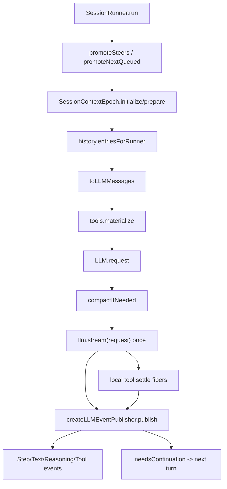

> V2 provider turn 是 `SessionRunner` 的单次模型调用单元:它在安全边界 promote input、准备 context epoch、构造 `LLM.request`,执行一次 `llm.stream(request)`,并把 LLM events 投影为 durable session events。

## 能回答的问题
- V2 何时把 pending prompt promoted 给模型?
- provider request 的 system/messages/tools 在哪里组装?
- 一次 provider turn 是否会调用多次 `llm.stream`?
- local tool call 的执行与 settlement 在哪里发生?
- LLM event 如何变成 `SessionEvent.Text/Tool/Step`?

## 端到端步骤

1. `SessionRunner.run@packages/core/src/session/runner/llm.ts:373` 先检查 pending steer 与 queue;没有 pending input 且不是 forced run 时直接返回。[E: packages/core/src/session/runner/llm.ts:373][E: packages/core/src/session/runner/llm.ts:377][E: packages/core/src/session/runner/llm.ts:379]

2. runner 进入循环前会调用 `failInterruptedTools`,把历史中遗留的 pending/running local tool 标记为 interrupted,避免崩溃后静默重放副作用。[E: packages/core/src/session/runner/llm.ts:115][E: packages/core/src/session/runner/llm.ts:380]

3. `runTurnAttempt@packages/core/src/session/runner/llm.ts:175` 每次 provider turn 开始时读取 session,检查 location 是否还匹配,并选择当前 agent。[E: packages/core/src/session/runner/llm.ts:175][E: packages/core/src/session/runner/llm.ts:180][E: packages/core/src/session/runner/llm.ts:181][E: packages/core/src/session/runner/llm.ts:183]

4. context epoch 在 prompt promotion 前处理:runner 先尝试 `SessionContextEpoch.initialize`,随后按 promotion 类型调用 `SessionInput.promoteSteers` 或 `SessionInput.promoteNextQueued`。[E: packages/core/src/session/runner/llm.ts:184][E: packages/core/src/session/runner/llm.ts:193][E: packages/core/src/session/input.ts:300][E: packages/core/src/session/input.ts:323]

5. promotion 后,runner 使用 initialized system context 或调用 `SessionContextEpoch.prepare`;随后重新读取 current session 并检查 agent/model 是否仍与 prepared turn 匹配,不匹配则触发 rebuild。[E: packages/core/src/session/runner/llm.ts:201][E: packages/core/src/session/runner/llm.ts:211][E: packages/core/src/session/runner/llm.ts:212][E: packages/core/src/session/runner/llm.ts:213]

6. runner 解析模型、读取 projected history、生成 context,再 materialize tools;`tools.materialize(agent.info?.permissions)` 是本 turn 的 V2 tool availability 边界。[E: packages/core/src/session/runner/llm.ts:214][E: packages/core/src/session/runner/llm.ts:215][E: packages/core/src/session/runner/llm.ts:217]

7. `LLM.request@packages/core/src/session/runner/llm.ts:219` 组装 provider request:字段包括 `model`、`providerOptions`、render 后的 `system`、`toLLMMessages(context, model)`、以及 tool definitions。[E: packages/core/src/session/runner/llm.ts:219][E: packages/core/src/session/runner/llm.ts:222][E: packages/core/src/session/runner/to-llm-message.ts:148]

8. `toLLMMessage@packages/core/src/session/runner/to-llm-message.ts:93` 把 projected session history 转成 provider messages:user message 变 user role text 加 file media,synthetic/shell 变 user role content,system 变 system message,compaction 变 user role checkpoint,assistant history 会按 selected model 决定 provider-native reasoning 与 hosted tool metadata 是否保留。[E: packages/core/src/session/runner/to-llm-message.ts:93][E: packages/core/src/session/runner/to-llm-message.ts:98][E: packages/core/src/session/runner/to-llm-message.ts:103][E: packages/core/src/session/runner/to-llm-message.ts:110][E: packages/core/src/session/runner/to-llm-message.ts:112][E: packages/core/src/session/runner/to-llm-message.ts:114][E: packages/core/src/session/runner/to-llm-message.ts:125][E: packages/core/src/session/runner/to-llm-message.ts:70][E: packages/core/src/session/runner/to-llm-message.ts:148]

9. provider request 执行前,runner 调用 `compaction.compactIfNeeded(request, context)`;如果压缩发生,它会触发 `rebuildPreparedTurn`,由 `runTurn` 的 defect handler 递归重跑 prepared turn。[E: packages/core/src/session/runner/llm.ts:228][E: packages/core/src/session/runner/llm.ts:229][E: packages/core/src/session/runner/llm.ts:359][E: packages/core/src/session/runner/llm.ts:367]

10. `createLLMEventPublisher@packages/core/src/session/runner/llm.ts:230` 绑定 session/model/tool call state,随后 runner 在 `const providerStream = llm.stream(request).pipe(...)` 处执行本 provider turn 唯一的 provider stream。[E: packages/core/src/session/runner/llm.ts:230][E: packages/core/src/session/runner/llm.ts:245][E: specs/v2/session.md:43]

11. stream event 循环先处理 provider context overflow failure,再调用 `publisher.publish(event)` 投影 LLM event。[E: packages/core/src/session/runner/llm.ts:249][E: packages/core/src/session/runner/llm.ts:255]

12. 对非 provider-executed 的 local tool call,runner 在收到完整 tool call 后通过 `toolMaterialization.settle(event)` 启动 tool execution,再把结果转回 `LLMEvent.toolResult` 交给同一个 publisher。[E: packages/core/src/session/runner/llm.ts:256][E: packages/core/src/session/runner/llm.ts:262][E: packages/core/src/session/runner/llm.ts:269]

13. publisher 把 text event 映射成 `SessionEvent.Text.Started/Delta/Ended`,把 tool input/call/result 映射成 `SessionEvent.Tool.Input.*` 与 `Tool.Called/Success/Failed`,把 step finish 映射成 `SessionEvent.Step.Ended`。[E: packages/core/src/session/runner/publish-llm-event.ts:226][E: packages/core/src/session/runner/publish-llm-event.ts:271][E: packages/core/src/session/runner/publish-llm-event.ts:317][E: packages/core/src/session/runner/publish-llm-event.ts:376]

14. stream closure 后,runner flush publisher,等待 tool fibers;如果 provider overflow 发生在 durable assistant output 或 tool activity 之前,runner 可以进入 overflow compaction recovery;否则失败成为 terminal provider error。[E: packages/core/src/session/runner/llm.ts:283][E: packages/core/src/session/runner/llm.ts:286][E: packages/core/src/session/runner/llm.ts:312][E: packages/core/src/session/runner/llm.ts:292][E: packages/core/src/session/runner/llm.ts:298]

15. 如果 publisher/context 表示需要 continuation,`runTurnAttempt` 返回 boolean `true`;outer `run` 在每轮后把下一轮 promotion 设为 `"steer"`,优先检查新的 steer input,并在单个 open activity 内最多循环 `MAX_STEPS = 25`。[E: packages/core/src/session/runner/llm.ts:336][E: packages/core/src/session/runner/llm.ts:386][E: packages/core/src/session/runner/llm.ts:387][E: packages/core/src/session/runner/llm.ts:388][E: packages/core/src/session/runner/llm.ts:391]

## 关键决策点

- 一次 provider turn 的 provider stream 是一个显式 `llm.stream(request)` call;tool continuation、overflow recovery、steer handling 都发生在 runner 的外层控制流中。[E: packages/core/src/session/runner/llm.ts:245][E: packages/core/src/session/runner/llm.ts:336]
- V2 tool call 的 durable event 顺序由 publisher 管:tool input、tool called、tool success/failure 都是 session event,local tool execution 只是 runner 在 tool call durable 后启动的 child work。[E: packages/core/src/session/runner/publish-llm-event.ts:271][E: packages/core/src/session/runner/llm.ts:262]
- V2 historical assistant replay 会检查 selected model:同 provider/model 才保留 provider-native reasoning 和 hosted tool metadata,model switch 后这些 provider-native metadata 会被省略。[E: packages/core/src/session/runner/to-llm-message.ts:70]

## 深挖入口
- Context Epoch: `spine.v2-context-epoch`
- LLM event publisher: `session-v2.llm-event-publisher`
- packages/llm provider protocol engine: `model-layer.llm-protocol-engine`

## Sources
- packages/core/src/session/runner/llm.ts
- packages/core/src/session/runner/publish-llm-event.ts
- packages/core/src/session/runner/to-llm-message.ts
- packages/core/src/session/input.ts
- packages/core/src/session/context-epoch.ts
- specs/v2/session.md

## 相关
- [spine.v2-context-epoch](v2-context-epoch.md)
- [session-v2.llm-event-publisher](../subsystems/session-v2/llm-event-publisher.md)
- [model-layer.llm-protocol-engine](../subsystems/model-layer/llm-protocol-engine.md)
