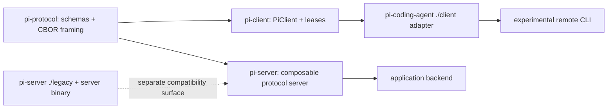

> `ref.package-index` 枚举 Pi monorepo 的九个源码 package workspace、五个 extension-example workspace、公开入口与发布边界；`packages/protocol` 和 `packages/client` 是本轮新增的远程会话协议层与客户端层。

## 能回答的问题

- Pi 当前有多少个源码 package workspace，哪些进入正式 publish pipeline？
- `pi-protocol`、`pi-client`、`pi-server` 与 `pi-coding-agent` 如何形成远程会话栈？
- 哪个 package 是 private eval consumer，哪个 server surface 仍是 experimental？
- 根 build、test、model-catalog 与 release 命令覆盖哪些包？

## Workspace 与发布边界

根 workspace 使用 `packages/*`、`packages/storage/*`，并显式纳入五个 coding-agent extension example；目标树因此有九个源码 package workspace与五个 example workspace。[E: package.json:5] [E: package.json:12]

根 build 顺序是 TUI → AI → agent-core → SQLite storage → protocol → client → coding-agent → server；`evals` 不在根 build 链中。[E: package.json:16] [E: packages/evals/package.json:4]

`scripts/publish.mjs` 的锁步发布清单包含 AI、agent-core、protocol、client、SQLite storage、TUI、coding-agent 七包；`pi-server` 不在该清单，`pi-evals` 明确 `private: true`。[E: scripts/publish.mjs:7] [E: scripts/publish.mjs:14] [E: packages/evals/package.json:4]

## Package catalog

| pkg | package / directory | 角色与公开面 | 关键依赖或发布事实 |
|---|---|---|---|
| `ai` | `@earendil-works/pi-ai` / `packages/ai` | 统一 LLM API，默认入口外还导出 compat、provider、wire API、OAuth 与 Bedrock/Bun OAuth 子路径，并提供 `pi-ai` binary。[E: packages/ai/package.json:2] [E: packages/ai/package.json:13] [E: packages/ai/package.json:44] | build 会在线生成 model data；offline build 先校验本地 model data 再编译。[E: packages/ai/package.json:52] [E: packages/ai/package.json:59] |
| `agent` | `@earendil-works/pi-agent-core` / `packages/agent` | 可复用 agent runtime、harness、session repository 与 Node execution environment；公开 `.`、`./node` 和 package metadata。[E: packages/agent/package.json:2] [E: packages/agent/package.json:8] [E: packages/agent/package.json:17] | 依赖 `pi-ai`，不依赖 coding-agent 产品层。[E: packages/agent/package.json:31] [E: packages/agent/package.json:36] |
| `protocol` | `@earendil-works/pi-protocol` / `packages/protocol` | transport-neutral remote-session protocol；入口公开 CBOR codec、framing 与 TypeBox schemas。[E: packages/protocol/package.json:2] [E: packages/protocol/package.json:4] [E: packages/protocol/src/index.ts:1] [E: packages/protocol/src/index.ts:4] | 公开发布，Node ≥22.19，运行依赖只有 `typebox`。[E: packages/protocol/package.json:29] [E: packages/protocol/package.json:30] |
| `client` | `@earendil-works/pi-client` / `packages/client` | transport-neutral `PiClient` 与 session lease/handle；另导出 `./unix` transport。[E: packages/client/package.json:2] [E: packages/client/package.json:4] [E: packages/client/package.json:13] [E: packages/client/src/index.ts:1] | 只依赖 `pi-protocol`，因此不会反向依赖 coding-agent 或 server 实现。[E: packages/client/package.json:37] |
| `coding-agent` | `@earendil-works/pi-coding-agent` / `packages/coding-agent` | `pi` CLI、SDK/extension surface、RPC entry，并新增 `./client` remote-session adapter。[E: packages/coding-agent/package.json:2] [E: packages/coding-agent/package.json:9] [E: packages/coding-agent/package.json:14] [E: packages/coding-agent/package.json:22] | 产品装配依赖 agent-core、AI、client、protocol 与 TUI。[E: packages/coding-agent/package.json:45] [E: packages/coding-agent/package.json:50] |
| `tui` | `@earendil-works/pi-tui` / `packages/tui` | 差分终端 UI；入口当前导出 type-only `TUI` interface 与 `TuiMainScreen`、`TuiAltScreen` 两种实现。[E: packages/tui/package.json:2] [E: packages/tui/src/index.ts:123] [E: packages/tui/src/index.ts:130] | 依赖 terminal-width 与 Markdown 库。[E: packages/tui/package.json:39] [E: packages/tui/package.json:41] |
| `server` | `@earendil-works/pi-server` / `packages/server` | experimental server；默认入口同时导出 composable listener/server/protocol 与 legacy supervisor API，另有 `./unix`、`./testing`、`./legacy` exports。[E: packages/server/package.json:2] [E: packages/server/package.json:4] [E: packages/server/package.json:8] [E: packages/server/package.json:21] [E: packages/server/src/index.ts:1] [E: packages/server/src/index.ts:6] | `server` binary 仍指向 legacy CLI；包不在根 publish 脚本清单。[E: packages/server/package.json:26] [E: packages/server/package.json:27] [E: scripts/publish.mjs:7] [E: scripts/publish.mjs:14] |
| `storage` | `@earendil-works/pi-storage-sqlite-node` / `packages/storage/sqlite-node` | Node `node:sqlite` session repository/search backend。[E: packages/storage/sqlite-node/package.json:2] [E: packages/storage/sqlite-node/package.json:4] | 依赖 AI 与 agent-core；build 会复制 migrations。[E: packages/storage/sqlite-node/package.json:21] [E: packages/storage/sqlite-node/package.json:34] [E: packages/storage/sqlite-node/package.json:36] |
| `evals` | `@earendil-works/pi-evals` / `packages/evals` | private behavioral-eval consumer，包含 Pi harness 与 comparative Vitest tooling。[E: packages/evals/package.json:2] [E: packages/evals/package.json:4] | 通过 dev dependencies 消费 AI、coding-agent 与 `vitest-evals`，不发布。[E: packages/evals/package.json:11] [E: packages/evals/package.json:18] |

## 远程会话依赖链

`pi-protocol` 与 `pi-client` 都是公开锁步发布包；coding-agent 把 client/protocol 引入产品层，而 server 直接依赖 protocol 与 coding-agent。[E: scripts/publish.mjs:10] [E: scripts/publish.mjs:14] [E: packages/coding-agent/package.json:48] [E: packages/coding-agent/package.json:49] [E: packages/server/package.json:56] [E: packages/server/package.json:59]

## 根工具链

- 模型目录有 `generate:models`、`hydrate:model-data`、`check:model-data`、`generate:model-catalog` 与 catalog diff/check 命令。[E: package.json:24] [E: package.json:30]
- 根 `test` 先跑 scripts tests，再对所有有 test script 的 workspace 执行测试。[E: package.json:33] [E: package.json:34]
- check pipeline 覆盖 Biome、依赖固定、TypeScript import、shrinkwrap、install lock、`tsgo` 与 browser smoke。[E: package.json:18] [E: package.json:23]
- 所有 package 要求 Node ≥22.19；根工具链使用 TypeScript native preview (`tsgo`)。[E: package.json:54] [E: package.json:64]

## Sources

- package.json
- README.md
- packages/ai/package.json
- packages/agent/package.json
- packages/protocol/package.json
- packages/protocol/src/index.ts
- packages/client/package.json
- packages/client/src/index.ts
- packages/coding-agent/package.json
- packages/tui/package.json
- packages/tui/src/index.ts
- packages/server/package.json
- packages/server/src/index.ts
- packages/storage/sqlite-node/package.json
- packages/evals/package.json
- scripts/publish.mjs

## 相关

- [spine.layered-architecture](../spine/layered-architecture.md) - 远程会话新增层与本地 agent 主路径的边界。
- [spine.overview](../spine/overview.md) - CLI、agent loop、provider、TUI 和 remote stack 总览。
