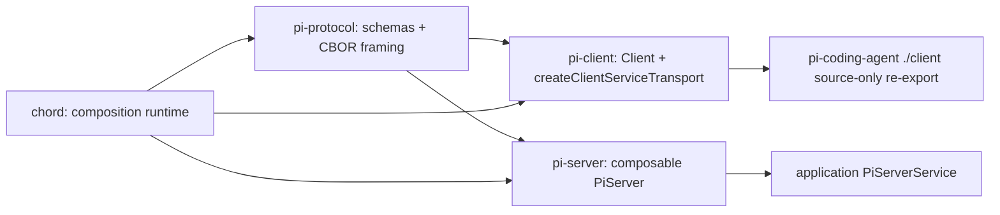

> `ref.package-index` 枚举 Pi monorepo 当前 workspace、公开 npm 包名、build / publish 边界。源码 workspace 仍是 `packages/*`（**10** 个一阶包，含 `@earendil-works/chord`）+ `packages/session-backends/*` + 五个 extension examples，公开包版本仍 **0.85.1**，本轮无新 workspace 包；`packages/storage/*` 已不存在。

## 能回答的问题

- Pi 当前有多少个源码 package workspace，哪些进入正式 publish pipeline？
- 根 `build` 顺序为什么从 `chord` 开始，并包含 `telemetry` 与 `session-backends/sqlite-node`？
- `pi-protocol`、`pi-client`、`pi-server` 与 `pi-coding-agent` 如何形成远程会话栈？公开 client 类名是什么？
- 哪个 package 是 private eval consumer？`pi-server` 还剩什么 surface？
- coding-agent 的 `./client` 与 `./experimental/plugin` 是不是 shipped npm API？
- npm 包名 `@earendil-works/chord` 和 `@earendil-works/pi-session-backend-sqlite-node` 分别对应哪个目录？

## Workspace 与发布边界

根 workspace 使用 `packages/*`、`packages/session-backends/*`，并显式纳入五个 coding-agent extension examples。[E: package.json:5] [E: package.json:6] [E: package.json:7] [E: package.json:8] [E: package.json:9] [E: package.json:10] [E: package.json:11] [E: package.json:12]

`packages/*` 下一层是 **10** 个一阶源码目录：`ai`、`agent`、`chord`、`client`、`coding-agent`、`evals`、`protocol`、`server`、`telemetry`、`tui`。另有 `packages/session-backends/sqlite-node`。五个 example workspace 只出现在显式 workspace 列表里，不是 `packages/*` 的一阶子目录。

根 `build` / `build:offline` 顺序是 **chord → tui → telemetry → ai → agent → session-backends/sqlite-node → protocol → client → server → coding-agent**。`evals` 不在根 build 链中。[E: package.json:16]

`scripts/publish.mjs` 不再硬编码包清单，而是调用 `getPublicWorkspacePackages()`：递归扫描 `packages/` 下所有含 `package.json` 的目录，过滤 `private !== true` 后按目录排序发布。[E: scripts/publish.mjs:6] [E: scripts/release-packages.mjs:5] [E: scripts/release-packages.mjs:11] [E: scripts/package-workspaces.mjs:6]

因此当前会进入 publish 清单的公开包是：`chord`、`pi-ai`、`pi-agent-core`、`pi-client`、`pi-coding-agent`、`pi-protocol`、`pi-server`、`pi-session-backend-sqlite-node`、`pi-telemetry`、`pi-tui`。`pi-evals`、五个 extension examples 以及 `packages/coding-agent/install-lock` 都标了 `private: true`，被过滤掉。[E: packages/evals/package.json:4]

## Package catalog

| pkg | package / directory | 角色与公开面 | 关键依赖或发布事实 |
|---|---|---|---|
| `chord` | `@earendil-works/chord` / `packages/chord` | Standalone application-composition runtime：facets / services / replicated state / delta / remote service boundary。根入口导出 `defineFacet`、`defineService`、`createFacetHost`、`replicatedState` 等；另导出 `./context`、`./delta`、`./bundler`、`./node`。[E: packages/chord/package.json:2] [E: packages/chord/package.json:8] [E: packages/chord/package.json:14] [E: packages/chord/package.json:19] [E: packages/chord/package.json:24] [E: packages/chord/package.json:29] [E: packages/chord/src/index.ts:5] [E: packages/chord/src/index.ts:9] | **不依赖任何其它 Pi workspace 包**；运行依赖只有 `esbuild`。[E: packages/chord/package.json:65] |
| `ai` | `@earendil-works/pi-ai` / `packages/ai` | 统一 LLM API；默认入口外还导出 `./compat`、`./providers/*`、`./api/*`、`./oauth`、`./bedrock-provider`、`./bun-oauth`，并提供 `pi-ai` binary。[E: packages/ai/package.json:2] [E: packages/ai/package.json:13] [E: packages/ai/package.json:48] | 依赖 `pi-telemetry`；`build` 会在线生成 model data，`build:offline` 先校验本地 model data 再编译。[E: packages/ai/package.json:61] [E: packages/ai/package.json:62] [E: packages/ai/package.json:69] |
| `agent` | `@earendil-works/pi-agent-core` / `packages/agent` | 可复用 agent runtime、`AgentHarness`、v4 session 与 Node execution environment；公开 `.`、`./node`、`./harness/context`、`./harness/env/nodejs`、`./harness/runtime/reducer`、`./harness/session`、`./harness/session/testing`。[E: packages/agent/package.json:2] [E: packages/agent/package.json:9] [E: packages/agent/package.json:13] [E: packages/agent/package.json:33] [E: packages/agent/package.json:21] [E: packages/agent/package.json:25] [E: packages/agent/package.json:29] | 依赖 `pi-ai` 与 `pi-telemetry`，不依赖 coding-agent 产品层。[E: packages/agent/package.json:59] [E: packages/agent/package.json:60] |
| `protocol` | `@earendil-works/pi-protocol` / `packages/protocol` | transport-neutral remote-session protocol；入口公开 CBOR codec、framing 与 TypeBox schemas。[E: packages/protocol/package.json:2] [E: packages/protocol/package.json:4] [E: packages/protocol/src/index.ts:1] [E: packages/protocol/src/index.ts:3] | 运行依赖 `chord` 与 `typebox`。[E: packages/protocol/package.json:43] [E: packages/protocol/package.json:43] |
| `client` | `@earendil-works/pi-client` / `packages/client` | transport-neutral **`Client`** + `createClientServiceTransport`（Chord 风格 service transport）；另导出 `./unix`。公开面不是 `PiClient` / `PiSessionHandle`。[E: packages/client/package.json:2] [E: packages/client/package.json:8] [E: packages/client/package.json:13] [E: packages/client/src/index.ts:1] | 依赖 `chord` 与 `pi-protocol`，不反向依赖 coding-agent 或 server 实现。[E: packages/client/package.json:50] [E: packages/client/package.json:51] |
| `coding-agent` | `@earendil-works/pi-coding-agent` / `packages/coding-agent` | `pi` CLI、SDK / extension surface、RPC entry。`bin.pi` 与 `./rpc-entry` 指向 bundled `dist/bundle/cli.js` / `dist/bundle/rpc-entry.js`；library `.` 走 unbundled `dist/`。[E: packages/coding-agent/package.json:2] [E: packages/coding-agent/package.json:10] [E: packages/coding-agent/package.json:15] [E: packages/coding-agent/package.json:19] | `./client` 与 `./experimental/plugin` 只有 `"source"` 条件，是 **source-only**（给 `pi-test.sh` / 本地源码消费），不是 shipped npm 公共 API。`files` 明确排除 `dist/client`、`dist/experimental`、`dist/cli/experimental`。[E: packages/coding-agent/package.json:22] [E: packages/coding-agent/package.json:25] [E: packages/coding-agent/package.json:31] [E: packages/coding-agent/package.json:32] [E: packages/coding-agent/package.json:33] [E: packages/coding-agent/src/client/index.ts:1] `build` = `build:unbundled` + `scripts/build-coding-agent-bundle.mjs`。产品装配依赖 chord、agent-core、AI 与 TUI；`pi-client` / `pi-protocol` / `pi-server` 是 devDependencies。[E: packages/coding-agent/package.json:42] [E: packages/coding-agent/package.json:52] [E: packages/coding-agent/package.json:76] |
| `tui` | `@earendil-works/pi-tui` / `packages/tui` | 差分终端 UI；入口导出 type-only `TUI` interface 与 `TuiAltScreen`、`TuiMainScreen` 两种实现。[E: packages/tui/package.json:2] [E: packages/tui/src/index.ts:135] [E: packages/tui/src/index.ts:146] [E: packages/tui/src/index.ts:147] | 依赖 east-asian-width 与 Markdown 库。[E: packages/tui/package.json:55] [E: packages/tui/package.json:56] |
| `server` | `@earendil-works/pi-server` / `packages/server` | experimental composable protocol server；exports 只有 `.`、`./testing`、`./unix`。根入口 re-export errors / listener / `PiServer` / types。[E: packages/server/package.json:2] [E: packages/server/package.json:8] [E: packages/server/package.json:13] [E: packages/server/package.json:17] [E: packages/server/src/index.ts:1] [E: packages/server/src/index.ts:3] | 无 `server` binary，无 `./legacy`。运行依赖 `chord`、`pi-agent-core`、`pi-protocol`。[E: packages/server/package.json:52] [E: packages/server/package.json:52] [E: packages/server/package.json:52] 因为包未标 `private`，会被 `getPublicWorkspacePackages()` 纳入 publish 清单。[E: scripts/release-packages.mjs:11] |
| `session-backends` | `@earendil-works/pi-session-backend-sqlite-node` / `packages/session-backends/sqlite-node` | Node `node:sqlite` session backend，实现 agent-core 的 `SessionRepo` seam。[E: packages/session-backends/sqlite-node/package.json:2] [E: packages/session-backends/sqlite-node/package.json:4] | 依赖 AI 与 agent-core；`build` 会复制 sqlite migrations。[E: packages/session-backends/sqlite-node/package.json:21] [E: packages/session-backends/sqlite-node/package.json:38] |
| `telemetry` | `@earendil-works/pi-telemetry` / `packages/telemetry` | vendor-neutral telemetry contracts、typed schema helpers、`NOOP_TELEMETRY_CONTEXT` 与 `InMemoryTelemetryContext`；另导出 `./testing` conformance。[E: packages/telemetry/package.json:2] [E: packages/telemetry/package.json:4] [E: packages/telemetry/package.json:13] [E: packages/telemetry/src/index.ts:24] | 无运行时依赖；被 `pi-ai` 与 `pi-agent-core` 消费。[E: packages/ai/package.json:69] [E: packages/agent/package.json:60] |
| `evals` | `@earendil-works/pi-evals` / `packages/evals` | private behavioral-eval consumer，用真实 `AgentSession` 适配 `vitest-evals`。[E: packages/evals/package.json:2] [E: packages/evals/package.json:4] | 通过 devDependencies 消费 AI、coding-agent 与 `vitest-evals`，不发布。[E: packages/evals/package.json:12] [E: packages/evals/package.json:17] |

## Extension-example workspaces

| workspace 目录 | package name | 发布 |
|---|---|---|
| `packages/coding-agent/examples/extensions/with-deps` | `pi-extension-with-deps` | `private: true` [E: packages/coding-agent/examples/extensions/with-deps/package.json:2] [E: packages/coding-agent/examples/extensions/with-deps/package.json:3] |
| `packages/coding-agent/examples/extensions/custom-provider-anthropic` | `pi-extension-custom-provider-anthropic` | `private: true` [E: packages/coding-agent/examples/extensions/custom-provider-anthropic/package.json:2] [E: packages/coding-agent/examples/extensions/custom-provider-anthropic/package.json:3] |
| `packages/coding-agent/examples/extensions/custom-provider-gitlab-duo` | `pi-extension-custom-provider-gitlab-duo` | `private: true` [E: packages/coding-agent/examples/extensions/custom-provider-gitlab-duo/package.json:2] [E: packages/coding-agent/examples/extensions/custom-provider-gitlab-duo/package.json:3] |
| `packages/coding-agent/examples/extensions/sandbox` | `pi-extension-sandbox` | `private: true` [E: packages/coding-agent/examples/extensions/sandbox/package.json:2] [E: packages/coding-agent/examples/extensions/sandbox/package.json:3] |
| `packages/coding-agent/examples/extensions/gondolin` | `pi-extension-gondolin` | `private: true` [E: packages/coding-agent/examples/extensions/gondolin/package.json:2] [E: packages/coding-agent/examples/extensions/gondolin/package.json:3] |

这五条路径写在根 `workspaces` 数组里，用于 npm workspace 解析 example 依赖，不进入 `getPublicWorkspacePackages()` 发布清单。[E: package.json:8] [E: scripts/release-packages.mjs:11] `packages/coding-agent/install-lock` 也是 `private: true`，会被 publish 扫描发现但被过滤。[E: packages/coding-agent/install-lock/package.json:2] [E: packages/coding-agent/install-lock/package.json:4]

## 远程会话依赖链

`pi-protocol` 与 `pi-client` 是公开包；coding-agent 的 `./client` 只是 `export * from "@earendil-works/pi-client"` 的 source-only re-export，不要当成独立 shipped adapter 实现。[E: packages/coding-agent/src/client/index.ts:1] [E: packages/coding-agent/package.json:22] `pi-server` 依赖 chord、agent-core 与 protocol，由应用提供 `PiServerService`；它不再封装 coding-agent RPC 子进程，也不再提供 legacy JSONL IPC / supervisor。[E: packages/server/package.json:52] [E: packages/server/package.json:52] [E: packages/server/package.json:52] [E: packages/server/src/index.ts:3] 本地 RPC mode 仍在 `pi-coding-agent` 进程内，不等于这条 remote 栈。[I]

## 根工具链

- 模型目录有 `generate:models`、`hydrate:model-data`、`check:model-data`、`generate:model-catalog` 与 catalog diff / check 命令。[E: package.json:30] [E: package.json:39]
- 根 `test` 先跑 scripts tests，再对所有有 test script 的 workspace 执行测试。[E: package.json:39] [E: package.json:40]
- check pipeline 覆盖 Biome、依赖固定、TypeScript import、shrinkwrap、install lock、`tsgo` 与 browser smoke。[E: package.json:21]
- 根 monorepo 与各公开 package 的 `engines.node` 都是 `>=22.19.0`；`pi-evals` 与五个 extension examples 未写 `engines`。根工具链使用 TypeScript native preview (`tsgo`)。[E: package.json:69]
- README 的公开产品表现在列出 chord、telemetry、ai、agent-core、coding-agent、tui；protocol / client / server / session-backends / evals 不在该短表里。[E: README.md:26] [E: README.md:31] [E: README.md:32] [E: README.md:33] [E: README.md:34] [E: README.md:35] [E: README.md:35]
- coding-agent 发布面把 CLI/RPC 收成 bundled Node runtime(`dist/bundle/`);公开 library `.` 仍用 modular `dist/`。`./client` / `./experimental/plugin` 不进 `files` 的 dist 产物。[E: packages/coding-agent/package.json:10] [E: packages/coding-agent/package.json:19] [E: packages/coding-agent/package.json:31] [E: scripts/build-coding-agent-bundle.mjs:161]

## Sources

- package.json
- README.md
- scripts/publish.mjs
- scripts/release-packages.mjs
- scripts/package-workspaces.mjs
- scripts/build-coding-agent-bundle.mjs
- packages/chord/package.json
- packages/chord/src/index.ts
- packages/ai/package.json
- packages/agent/package.json
- packages/protocol/package.json
- packages/protocol/src/index.ts
- packages/client/package.json
- packages/client/src/index.ts
- packages/coding-agent/package.json
- packages/coding-agent/src/client/index.ts
- packages/tui/package.json
- packages/tui/src/index.ts
- packages/server/package.json
- packages/server/src/index.ts
- packages/session-backends/sqlite-node/package.json
- packages/telemetry/package.json
- packages/telemetry/src/index.ts
- packages/evals/package.json
- packages/coding-agent/examples/extensions/with-deps/package.json
- packages/coding-agent/examples/extensions/custom-provider-anthropic/package.json
- packages/coding-agent/examples/extensions/custom-provider-gitlab-duo/package.json
- packages/coding-agent/examples/extensions/sandbox/package.json
- packages/coding-agent/examples/extensions/gondolin/package.json
- packages/coding-agent/install-lock/package.json

## 相关

- [spine.layered-architecture](../spine/layered-architecture.md) - 远程会话层与本地 agent 主路径的边界。
- [spine.overview](../spine/overview.md) - CLI、agent loop、provider、TUI 和 remote 栈总览。
- [subsys.chord.runtime](../subsystems/chord/runtime.md) - chord facets / services / host。
- [subsys.session-backends.sqlite-node](../subsystems/session-backends/sqlite-node.md) - SQLite `SessionRepo` backend。
- [subsys.telemetry.contracts](../subsystems/telemetry/contracts.md) - vendor-neutral telemetry contracts。
- [subsys.server.session-server](../subsystems/server/session-server.md) - composable `PiServer`。
