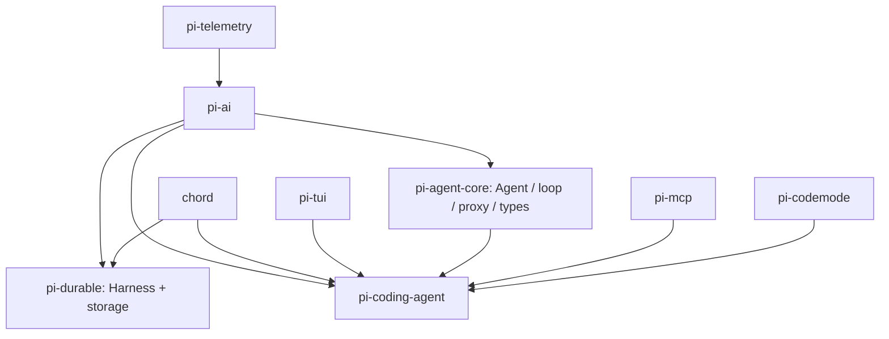
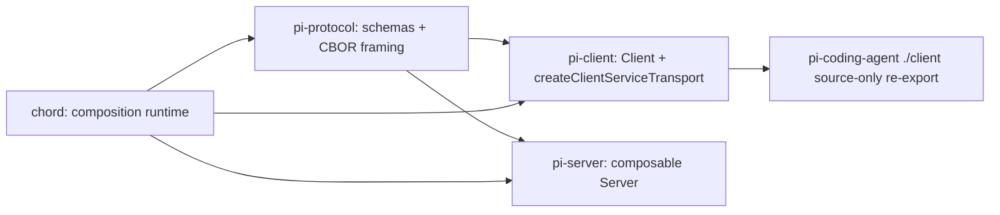

> `ref.package-index` 枚举 Pi monorepo 当前 workspace、公开 npm 包名、build / publish 边界。源码一阶目录是 `packages/*` 下的 **13** 个包（含 1.0 新增的 `@earendil-works/pi-codemode` 与 `@earendil-works/pi-mcp`），公开包版本 **1.0.1**。`@earendil-works/pi-session-backend-sqlite-node` 已在 1.0 删除；SQLite 现在住在 `pi-durable`。

## 能回答的问题

- Pi 当前有多少个一阶 `packages/*` 目录，哪些进入正式 publish pipeline？
- 根 `build` 顺序为什么是 chord → tui → telemetry → **codemode → mcp** → ai → durable → agent → protocol → client → server → coding-agent？
- `@earendil-works/pi-codemode` 与 `@earendil-works/pi-mcp` 分别导出什么，谁消费它们？
- 1.0 之后 `pi-agent-core` 还剩什么？可复用 Harness / SQLite 在哪个包？
- `pi-protocol`、`pi-client`、`pi-server` 与 `pi-coding-agent` 如何形成远程会话栈？公开类名是 `Client` / `Server` 还是旧名 `PiClient` / `PiServer`？
- coding-agent 的 `./client` 与 `./experimental/plugin` 是不是 shipped npm API？

## Workspace 与发布边界

根 workspace 使用 `packages/*`，并显式纳入五个 coding-agent extension examples。[E: package.json:6] [E: package.json:7] [E: package.json:8] [E: package.json:9] [E: package.json:10] [E: package.json:11]

`packages/*` 下一层是 **13** 个一阶源码目录：`agent`、`ai`、`chord`、`client`、`codemode`、`coding-agent`、`durable`、`evals`、`mcp`、`protocol`、`server`、`telemetry`、`tui`。没有 `packages/session-backends`。五个 example 路径只出现在显式 workspace 列表里，不是 `packages/*` 的一阶子目录。

根 `build` / `build:offline` 顺序是 **chord → tui → telemetry → codemode → mcp → ai → durable → agent → protocol → client → server → coding-agent**。`evals` 不在根 build 链中。[E: package.json:15] [E: package.json:16]

`@earendil-works/pi-session-backend-sqlite-node` 已在 1.0 删除；SQLite 现在住在 `pi-durable` 的 `./storage/sqlite` 与 `./storage/sqlite/node`。[E: packages/durable/package.json:51] [E: packages/durable/package.json:57] [I]

`scripts/publish.mjs` 不硬编码包清单，而是调用 `getPublicWorkspacePackages()`：递归扫描 `packages/` 下所有含 `package.json` 的目录，过滤 `private !== true` 后发布。[E: scripts/publish.mjs:6] [E: scripts/release-packages.mjs:5] [E: scripts/release-packages.mjs:11] [E: scripts/package-workspaces.mjs:6]

`scripts/local-release.mjs` 把当前可打包公开包写成 12 条（不含 private 的 `pi-evals`）：chord、telemetry、**codemode**、**mcp**、ai、durable、tui、agent、protocol、client、server、coding-agent。[E: scripts/local-release.mjs:10] [E: scripts/local-release.mjs:12] [E: scripts/local-release.mjs:13] [E: scripts/local-release.mjs:21]

因此会进入 publish 清单的公开包是上述 12 个，版本锁步 **1.0.1**。`pi-evals`、五个 extension examples、`packages/coding-agent/install-lock` 以及 `packages/coding-agent/examples/plugins/pi-example-plugin` 都标了 `private: true`，被过滤掉。[E: packages/evals/package.json:4] [E: packages/coding-agent/install-lock/package.json:4] [E: packages/coding-agent/examples/plugins/pi-example-plugin/package.json:4]

## Package catalog

每个 `packages/*` 一阶目录一行。版本列是该 `package.json` 的 `version`（公开包与 `pi-evals` 均为 **1.0.1**）。

| pkg | package / directory | version | 角色与公开面 | 关键依赖或发布事实 |
|---|---|---|---|---|
| `chord` | `@earendil-works/chord` / `packages/chord` | 1.0.1 | Standalone application-composition runtime：facets / services / replicated state / delta / remote service boundary。根入口导出 `defineFacet`、`defineService`、`createFacetHost`、`replicatedState` 等；另导出 `./context`、`./delta`、`./bundler`、`./node`。[E: packages/chord/package.json:2] [E: packages/chord/package.json:3] [E: packages/chord/package.json:8] [E: packages/chord/package.json:14] [E: packages/chord/package.json:19] [E: packages/chord/package.json:24] [E: packages/chord/package.json:29] [E: packages/chord/src/index.ts:9] [E: packages/chord/src/index.ts:10] [E: packages/chord/src/index.ts:11] | **不依赖任何其它 Pi workspace 包**；运行依赖只有 `esbuild`。[E: packages/chord/package.json:66] |
| `tui` | `@earendil-works/pi-tui` / `packages/tui` | 1.0.1 | 差分终端 UI。`package.json` 没有 `exports` map，用 `main` 指向 `dist/index.js`、`types` 指向 `./dist/index.d.ts`。入口导出 type-only `TUI` interface 与 `TuiAltScreen`、`TuiMainScreen` 两种实现。[E: packages/tui/package.json:2] [E: packages/tui/package.json:3] [E: packages/tui/package.json:6] [E: packages/tui/package.json:53] [E: packages/tui/src/index.ts:170] [E: packages/tui/src/index.ts:181] [E: packages/tui/src/index.ts:182] | 依赖 east-asian-width 与 Markdown 库；`files` 另带 darwin/linux/win32 native clipboard prebuilds。[E: packages/tui/package.json:20] [E: packages/tui/package.json:24] [E: packages/tui/package.json:28] [E: packages/tui/package.json:55] [E: packages/tui/package.json:56] |
| `telemetry` | `@earendil-works/pi-telemetry` / `packages/telemetry` | 1.0.1 | vendor-neutral telemetry contracts、typed schema helpers、`NOOP_TELEMETRY_CONTEXT` 与 `InMemoryTelemetryContext`；另导出 `./testing` conformance。[E: packages/telemetry/package.json:2] [E: packages/telemetry/package.json:3] [E: packages/telemetry/package.json:8] [E: packages/telemetry/package.json:13] [E: packages/telemetry/src/index.ts:24] [E: packages/telemetry/src/index.ts:357] | 无运行时依赖；被 `pi-ai` 消费。[E: packages/ai/package.json:72] |
| `codemode` | `@earendil-works/pi-codemode` / `packages/codemode` | 1.0.1 | QuickJS WASM sandbox：脚本里唯一能力是调用注入的 tools。根入口导出 `CodemodeSandbox`、`renderDeclarations`、`parseCodemodeSource`、`loadQuickJSWasm`；另导出 `./declarations`、`./source`、`./worker`。[E: packages/codemode/package.json:2] [E: packages/codemode/package.json:3] [E: packages/codemode/package.json:8] [E: packages/codemode/package.json:14] [E: packages/codemode/package.json:19] [E: packages/codemode/package.json:24] [E: packages/codemode/src/index.ts:13] | **不依赖任何其它 Pi workspace 包**；运行依赖只有 `quickjs-wasi`。被 `pi-coding-agent` 消费。[E: packages/codemode/package.json:57] [E: packages/coding-agent/package.json:53] |
| `mcp` | `@earendil-works/pi-mcp` / `packages/mcp` | 1.0.1 | 独立 MCP client（不绑官方 MCP SDK）。根入口导出 `McpClient`、`StdioTransport`、`StreamableHttpTransport`、`toLlmContent`；另导出 `./oauth` 与 `./testing`。[E: packages/mcp/package.json:2] [E: packages/mcp/package.json:3] [E: packages/mcp/package.json:8] [E: packages/mcp/package.json:14] [E: packages/mcp/package.json:19] [E: packages/mcp/src/index.ts:2] | 运行依赖只有 `cross-spawn`。被 `pi-coding-agent` 消费。[E: packages/mcp/package.json:53] [E: packages/coding-agent/package.json:54] |
| `ai` | `@earendil-works/pi-ai` / `packages/ai` | 1.0.1 | 统一 LLM API；默认入口外还导出 `./models`、`./compat`、`./providers/*`、`./api/*`、`./utils/*`、`./oauth`、`./bedrock-provider`、`./bun-oauth`，并提供 `pi-ai` binary。[E: packages/ai/package.json:2] [E: packages/ai/package.json:3] [E: packages/ai/package.json:13] [E: packages/ai/package.json:18] [E: packages/ai/package.json:51] | 依赖 `pi-telemetry`；`build` 会在线生成 model data，`build:offline` 先校验本地 model data 再编译。[E: packages/ai/package.json:64] [E: packages/ai/package.json:65] [E: packages/ai/package.json:72] |
| `durable` | `@earendil-works/pi-durable` / `packages/durable` | 1.0.1 | **Harness + storage**：根 `.` 导出 `Harness`、`createSession`、`MemoryStorage`、`defineTask`、`defineTool`、`ROOT_CONVERSATION_ID`。另导出 `./env`、`./env/node`、`./tools`（`createReadTool` / `createWriteTool` / `createEditTool` / `createBashTool` + `CodingTools`）、`./storage/memory`、`./storage/jsonl`、`./storage/jsonl/node`、`./storage/sqlite`、`./storage/sqlite/node`、`./testing`。[E: packages/durable/package.json:2] [E: packages/durable/package.json:3] [E: packages/durable/package.json:27] [E: packages/durable/package.json:51] [E: packages/durable/src/index.ts:24] [E: packages/durable/src/index.ts:38] [E: packages/durable/src/index.ts:98] [E: packages/durable/src/index.ts:99] [E: packages/durable/src/index.ts:100] [E: packages/durable/src/index.ts:181] [E: packages/durable/src/tools/index.ts:19] | 依赖 `chord` 与 `pi-ai`，**不**依赖 `pi-agent-core` 或 coding-agent。不是 coding-agent `SessionManager` JSONL。[E: packages/durable/package.json:103] [E: packages/durable/package.json:104] |
| `agent` | `@earendil-works/pi-agent-core` / `packages/agent` | 1.0.1 | **只含 Agent / loop / proxy / types**。根入口 re-export `./agent.ts`、`./agent-loop.ts`、`./proxy.ts`、`setDefaultStreamFn`、`./types.ts`。`exports` 只剩 `.` 与 `./package.json`；`./node`、`./harness/*`、`./experimental/pico3` 已删除。[E: packages/agent/package.json:2] [E: packages/agent/package.json:3] [E: packages/agent/package.json:8] [E: packages/agent/src/index.ts:1] [E: packages/agent/src/index.ts:2] [E: packages/agent/src/index.ts:3] [E: packages/agent/src/index.ts:5] [E: packages/agent/CHANGELOG.md:11] | 依赖 `pi-ai` 与 `typebox`，**不**依赖 chord、`pi-durable`、telemetry 或 coding-agent。1.0 起可复用 session/harness 用 `pi-durable`。[E: packages/agent/package.json:26] [E: packages/agent/package.json:27] |
| `protocol` | `@earendil-works/pi-protocol` / `packages/protocol` | 1.0.1 | transport-neutral remote-session protocol；单一 `.` 入口公开 CBOR codec、framing 与 envelope types。[E: packages/protocol/package.json:2] [E: packages/protocol/package.json:3] [E: packages/protocol/package.json:8] [E: packages/protocol/src/index.ts:1] [E: packages/protocol/src/index.ts:2] [E: packages/protocol/src/index.ts:3] | 运行依赖 `chord` 与 `typebox`。[E: packages/protocol/package.json:42] [E: packages/protocol/package.json:43] |
| `client` | `@earendil-works/pi-client` / `packages/client` | 1.0.1 | transport-neutral **`Client`** + `createClientServiceTransport`（Chord 风格 service transport）；另导出 `./unix`。公开面不是 `PiClient` / `PiSessionHandle`。[E: packages/client/package.json:2] [E: packages/client/package.json:3] [E: packages/client/package.json:8] [E: packages/client/package.json:13] [E: packages/client/src/index.ts:1] | 依赖 `chord` 与 `pi-protocol`，不反向依赖 coding-agent 或 server 实现。[E: packages/client/package.json:50] [E: packages/client/package.json:51] |
| `server` | `@earendil-works/pi-server` / `packages/server` | 1.0.1 | experimental composable protocol server；exports 只有 `.`、`./testing`、`./unix`。根入口 re-export errors / listener / **`Server`** / types。公开类名是 `Server`，不是 `PiServer`。[E: packages/server/package.json:2] [E: packages/server/package.json:3] [E: packages/server/package.json:8] [E: packages/server/package.json:13] [E: packages/server/package.json:17] [E: packages/server/src/index.ts:3] [E: packages/server/src/server.ts:46] | 无 `server` binary。运行依赖 `chord` 与 `pi-protocol`，**不再**依赖 `pi-agent-core`。[E: packages/server/package.json:50] [E: packages/server/package.json:51] 因为包未标 `private`，会被 `getPublicWorkspacePackages()` 纳入 publish 清单。[E: scripts/release-packages.mjs:11] |
| `coding-agent` | `@earendil-works/pi-coding-agent` / `packages/coding-agent` | 1.0.1 | `pi` CLI、SDK / extension surface、RPC entry。`bin.pi` 与 `./rpc-entry` 指向 bundled `dist/bundle/cli.js` / `dist/bundle/rpc-entry.js`；library `.` 走 unbundled `dist/`。[E: packages/coding-agent/package.json:2] [E: packages/coding-agent/package.json:3] [E: packages/coding-agent/package.json:10] [E: packages/coding-agent/package.json:15] [E: packages/coding-agent/package.json:19] | `./client` 与 `./experimental/plugin` 只有 `"source"` 条件，是 **source-only**（给 `pi-test.sh` / 本地源码消费），不是 shipped npm 公共 API。`files` 明确排除 `dist/client`、`dist/experimental`、`dist/cli/experimental`。[E: packages/coding-agent/package.json:22] [E: packages/coding-agent/package.json:25] [E: packages/coding-agent/package.json:31] [E: packages/coding-agent/package.json:32] [E: packages/coding-agent/package.json:33] [E: packages/coding-agent/src/client/index.ts:1] `build` = `build:unbundled` + `scripts/build-coding-agent-bundle.mjs`。产品装配依赖 chord、agent-core、AI、**codemode**、**mcp** 与 TUI；`pi-client` / `pi-protocol` / `pi-server` 是 devDependencies。**不**依赖 `pi-durable`。[E: packages/coding-agent/package.json:41] [E: packages/coding-agent/package.json:50] [E: packages/coding-agent/package.json:53] [E: packages/coding-agent/package.json:54] [E: packages/coding-agent/package.json:78] |
| `evals` | `@earendil-works/pi-evals` / `packages/evals` | 1.0.1 | private behavioral-eval consumer。`eval:host` 跑本机 Vitest；`eval:docs` 用 Node type stripping 跑 `src/cli.ts` 的 Docker 文档对照。[E: packages/evals/package.json:2] [E: packages/evals/package.json:3] [E: packages/evals/package.json:4] [E: packages/evals/package.json:9] [E: packages/evals/package.json:10] | 通过 devDependencies 消费 AI、coding-agent 与 `vitest-evals`，不发布。根 `eval` 脚本转发到该 workspace。[E: packages/evals/package.json:14] [E: packages/evals/package.json:15] [E: package.json:34] |

## Extension-example 与其它嵌套 package.json

| workspace 目录 | package name | version | 发布 |
|---|---|---|---|
| `packages/coding-agent/examples/extensions/with-deps` | `pi-extension-with-deps` | 1.0.1 | `private: true` [E: packages/coding-agent/examples/extensions/with-deps/package.json:2] [E: packages/coding-agent/examples/extensions/with-deps/package.json:3] [E: packages/coding-agent/examples/extensions/with-deps/package.json:4] |
| `packages/coding-agent/examples/extensions/custom-provider-anthropic` | `pi-extension-custom-provider-anthropic` | 1.0.1 | `private: true` [E: packages/coding-agent/examples/extensions/custom-provider-anthropic/package.json:2] [E: packages/coding-agent/examples/extensions/custom-provider-anthropic/package.json:3] |
| `packages/coding-agent/examples/extensions/custom-provider-gitlab-duo` | `pi-extension-custom-provider-gitlab-duo` | 1.0.1 | `private: true` [E: packages/coding-agent/examples/extensions/custom-provider-gitlab-duo/package.json:2] [E: packages/coding-agent/examples/extensions/custom-provider-gitlab-duo/package.json:3] |
| `packages/coding-agent/examples/extensions/sandbox` | `pi-extension-sandbox` | 1.0.1 | `private: true` [E: packages/coding-agent/examples/extensions/sandbox/package.json:2] [E: packages/coding-agent/examples/extensions/sandbox/package.json:3] |
| `packages/coding-agent/examples/extensions/gondolin` | `pi-extension-gondolin` | 1.0.1 | `private: true` [E: packages/coding-agent/examples/extensions/gondolin/package.json:2] [E: packages/coding-agent/examples/extensions/gondolin/package.json:3] |

这五条路径写在根 `workspaces` 数组里，用于 npm workspace 解析 example 依赖，不进入 `getPublicWorkspacePackages()` 发布清单。[E: package.json:7] [E: scripts/release-packages.mjs:11]

另外两个嵌套 `package.json` **不在**根 `workspaces` 里，但仍会被 `findPackageDirectories()` 扫到：

- `packages/coding-agent/install-lock`：`@earendil-works/pi-coding-agent-install` **1.0.1**，`private: true`，给 installer / updater 钉 lockfile。[E: packages/coding-agent/install-lock/package.json:2] [E: packages/coding-agent/install-lock/package.json:3] [E: packages/coding-agent/install-lock/package.json:4]
- `packages/coding-agent/examples/plugins/pi-example-plugin`：`@earendil-works/pi-example-plugin` **1.0.0**（未跟 lockstep 1.0.1），`private: true`。[E: packages/coding-agent/examples/plugins/pi-example-plugin/package.json:2] [E: packages/coding-agent/examples/plugins/pi-example-plugin/package.json:3] [E: packages/coding-agent/examples/plugins/pi-example-plugin/package.json:4]

## 分层与远程会话依赖链

```mermaid
flowchart TB
  Chord["chord"]
  Tel["pi-telemetry"]
  CM["pi-codemode"]
  MCP["pi-mcp"]
  AI["pi-ai"]
  Dur["pi-durable: Harness + storage"]
  Ag["pi-agent-core: Agent / loop / proxy / types"]
  TUI["pi-tui"]
  CA["pi-coding-agent"]
  Chord --> Dur
  Tel --> AI
  AI --> Dur
  AI --> Ag
  CM --> CA
  MCP --> CA
  Ag --> CA
  TUI --> CA
  Chord --> CA
  AI --> CA
```

```mermaid
flowchart LR
  Chord["chord: composition runtime"] --> P["pi-protocol: schemas + CBOR framing"]
  P --> C["pi-client: Client + createClientServiceTransport"]
  P --> S["pi-server: composable Server"]
  Chord --> C
  Chord --> S
  C --> CA["pi-coding-agent ./client source-only re-export"]
```

`pi-protocol` 与 `pi-client` 是公开包；coding-agent 的 `./client` 只是 `export * from "@earendil-works/pi-client"` 的 source-only re-export，不要当成独立 shipped adapter 实现。[E: packages/coding-agent/src/client/index.ts:1] [E: packages/coding-agent/package.json:22] `pi-server` 依赖 chord 与 protocol，公开类是 `Server`；它不再依赖 agent-core，也不再封装 coding-agent RPC 子进程。[E: packages/server/package.json:50] [E: packages/server/package.json:51] [E: packages/server/src/server.ts:46] 本地 RPC mode 仍在 `pi-coding-agent` 进程内，不等于这条 remote 栈。[I]

`pi-durable` 的 `Harness` 与 coding-agent 的 `AgentSession` / `SessionManager` JSONL 是两条并行产品路径：coding-agent **不**把 `pi-durable` 列为 dependency。[E: packages/durable/src/index.ts:38] [E: packages/coding-agent/package.json:50]

## 根工具链

- 模型目录有 `generate:models`、`hydrate:model-data`、`check:model-data`、`generate:model-catalog` 与 catalog diff / check 命令。[E: package.json:28] [E: package.json:31]
- 根 `test` 先跑 scripts tests，再对所有有 test script 的 workspace 执行测试。[E: package.json:38] [E: package.json:39]
- check pipeline 覆盖 Biome、pinned deps、runtime deps、TypeScript import、entry graphs、install lock、`tsc --noEmit` 与 browser smoke。[E: package.json:20]
- 根 monorepo 与各公开 package 的 `engines.node` 都是 `>=22.19.0`；`pi-evals` 与五个 extension examples 未写 `engines`。根 `devDependencies.typescript` 是 **7.0.2**。根自身 `version` 是 **0.0.3**，与包 lockstep 1.0.1 不是同一字段。[E: package.json:63] [E: package.json:66] [E: package.json:68]
- README 的公开产品短表列出 chord、telemetry、ai、durable、agent-core、coding-agent、tui；**codemode / mcp / protocol / client / server / evals 不在该短表里**。[E: README.md:76] [E: README.md:78] [E: README.md:79] [E: README.md:80] [E: README.md:81] [E: README.md:82] [E: README.md:83] [E: README.md:84]
- coding-agent 发布面把 CLI/RPC 收成 bundled Node runtime（`dist/bundle/`）；公开 library `.` 仍用 modular `dist/`。`./client` / `./experimental/plugin` 不进 `files` 的 dist 产物。[E: packages/coding-agent/package.json:10] [E: packages/coding-agent/package.json:19] [E: packages/coding-agent/package.json:31] [E: scripts/build-coding-agent-bundle.mjs:165] [E: scripts/build-coding-agent-bundle.mjs:167]

## Sources

- package.json
- README.md
- scripts/publish.mjs
- scripts/release-packages.mjs
- scripts/package-workspaces.mjs
- scripts/local-release.mjs
- scripts/build-coding-agent-bundle.mjs
- packages/chord/package.json
- packages/chord/src/index.ts
- packages/tui/package.json
- packages/tui/src/index.ts
- packages/telemetry/package.json
- packages/telemetry/src/index.ts
- packages/codemode/package.json
- packages/codemode/src/index.ts
- packages/mcp/package.json
- packages/mcp/src/index.ts
- packages/ai/package.json
- packages/durable/package.json
- packages/durable/src/index.ts
- packages/durable/src/tools/index.ts
- packages/agent/package.json
- packages/agent/src/index.ts
- packages/agent/CHANGELOG.md
- packages/protocol/package.json
- packages/protocol/src/index.ts
- packages/client/package.json
- packages/client/src/index.ts
- packages/server/package.json
- packages/server/src/index.ts
- packages/server/src/server.ts
- packages/coding-agent/package.json
- packages/coding-agent/src/client/index.ts
- packages/evals/package.json
- packages/coding-agent/examples/extensions/with-deps/package.json
- packages/coding-agent/examples/extensions/custom-provider-anthropic/package.json
- packages/coding-agent/examples/extensions/custom-provider-gitlab-duo/package.json
- packages/coding-agent/examples/extensions/sandbox/package.json
- packages/coding-agent/examples/extensions/gondolin/package.json
- packages/coding-agent/examples/plugins/pi-example-plugin/package.json
- packages/coding-agent/install-lock/package.json

## 相关

- [spine.layered-architecture](../spine/layered-architecture.md) - 远程会话层与本地 agent 主路径的边界。
- [spine.overview](../spine/overview.md) - CLI、agent loop、provider、TUI、durable 和 remote 栈总览。
- [subsys.chord.runtime](../subsystems/chord/runtime.md) - chord facets / services / host。
- [subsys.durable.runtime](../subsystems/durable/runtime.md) - `createSession` / document tokens。
- [subsys.durable.storage](../subsystems/durable/storage.md) - Memory / JSONL / SQLite backends。
- [subsys.durable.harness](../subsystems/durable/harness.md) - 1.0 可复用 `Harness` / tasks / tools / registry。
- [subsys.mcp.client](../subsystems/mcp/client.md) - `@earendil-works/pi-mcp` client / transports / OAuth。
- [subsys.codemode.runtime](../subsystems/codemode/runtime.md) - `@earendil-works/pi-codemode` QuickJS WASM sandbox。
- [subsys.telemetry.contracts](../subsystems/telemetry/contracts.md) - vendor-neutral telemetry contracts。
- [subsys.server.session-server](../subsystems/server/session-server.md) - composable `Server`。
