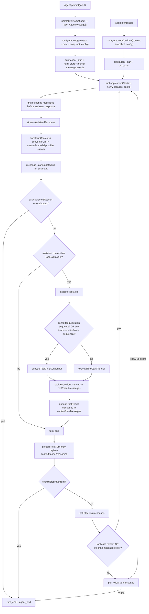

> `spine.agent-loop` 说明 `pi-agent-core` 如何把一次用户输入或 continuation 变成 provider streaming、assistant message、tool calls、tool results，以及下一轮 turn 的停止或续跑。

## 能回答的问题

- `runAgentLoop` 和 `runAgentLoopContinue` 在进入同一个 `runLoop` 前有什么差别？
- 一次 turn 的事件顺序是什么，哪些事件会改变 `Agent.state`？
- `streamAssistantResponse` 在哪里把 `AgentMessage[]` 转成 provider 可用的 `Message[]`？
- assistant message 里有多个 tool call 时，`executeToolCalls` 怎么选择 sequential 或 parallel？
- steering message、follow-up message、`prepareNextTurn`、`shouldStopAfterTurn` 分别在哪个时机影响下一次 provider request？
- `agent` 包和 `coding-agent` 产品层在 agent loop 上的边界在哪里？

## 端到端步骤

1. `Agent.prompt` 是新 prompt 的有状态入口：它拒绝并发 active run，把字符串或消息归一成 `AgentMessage[]`，再进入 `runPromptMessages`。[E: packages/agent/src/agent.ts:327] [E: packages/agent/src/agent.ts:328] [E: packages/agent/src/agent.ts:333] [E: packages/agent/src/agent.ts:334] `runPromptMessages` 调用 `runAgentLoop(messages, createContextSnapshot(), createLoopConfig(), processEvents, signal, streamFn)`，所以低层 loop 接收的是状态快照和一组新 prompt。[E: packages/agent/src/agent.ts:386] [E: packages/agent/src/agent.ts:391] [E: packages/agent/src/agent.ts:392] [E: packages/agent/src/agent.ts:393] [E: packages/agent/src/agent.ts:394] [E: packages/agent/src/agent.ts:395] [E: packages/agent/src/agent.ts:397]

2. `Agent.continue` 是 continuation 入口：如果当前最后一条消息是 assistant，它会优先把 queued steering 或 follow-up 作为新的 prompt 跑；没有队列时才抛出 `Cannot continue from message role: assistant`。[E: packages/agent/src/agent.ts:338] [E: packages/agent/src/agent.ts:348] [E: packages/agent/src/agent.ts:349] [E: packages/agent/src/agent.ts:351] [E: packages/agent/src/agent.ts:355] [E: packages/agent/src/agent.ts:357] [E: packages/agent/src/agent.ts:361] 如果最后一条不是 assistant，`runContinuation` 调用 `runAgentLoopContinue`，不额外加入 prompt。[E: packages/agent/src/agent.ts:364] [E: packages/agent/src/agent.ts:402] [E: packages/agent/src/agent.ts:404]

3. `runAgentLoop` 会把 prompts 同时放进 `newMessages` 和 `currentContext.messages`，先发 `agent_start`、`turn_start`，再为每个 prompt 发 `message_start`/`message_end`。[E: packages/agent/src/agent-loop.ts:103] [E: packages/agent/src/agent-loop.ts:106] [E: packages/agent/src/agent-loop.ts:109] [E: packages/agent/src/agent-loop.ts:110] [E: packages/agent/src/agent-loop.ts:112] [E: packages/agent/src/agent-loop.ts:113] `runAgentLoopContinue` 则要求 context 非空且最后一条不是 assistant，然后以空 `newMessages` 进入同一个 `runLoop`。[E: packages/agent/src/agent-loop.ts:127] [E: packages/agent/src/agent-loop.ts:131] [E: packages/agent/src/agent-loop.ts:135] [E: packages/agent/src/agent-loop.ts:141]

4. `runLoop` 有外层 follow-up loop 和内层 turn loop：外层只在 agent 本来要停时检查 follow-up messages，内层在还有 tool calls 或 pending steering messages 时继续发起 assistant response。[E: packages/agent/src/agent-loop.ts:170] [E: packages/agent/src/agent-loop.ts:174] [E: packages/agent/src/agent-loop.ts:257] [E: packages/agent/src/agent-loop.ts:258] 开始时和每个 turn 结束后都会通过 `getSteeringMessages` 取 steering queue，存在 pending messages 时会把它们作为普通 message 事件追加到 context 与 `newMessages`，再进入下一次 assistant response。[E: packages/agent/src/agent-loop.ts:167] [E: packages/agent/src/agent-loop.ts:182] [E: packages/agent/src/agent-loop.ts:184] [E: packages/agent/src/agent-loop.ts:185] [E: packages/agent/src/agent-loop.ts:186] [E: packages/agent/src/agent-loop.ts:187] [E: packages/agent/src/agent-loop.ts:253]

5. `streamAssistantResponse` 是 agent loop 到 provider stream 的边界：它可先运行 `transformContext`，再调用 `convertToLlm` 把 `AgentMessage[]` 转为 `Message[]`，然后用 `systemPrompt`、转换后的 messages 和 tools 构造 LLM `Context`。[E: packages/agent/src/agent-loop.ts:275] [E: packages/agent/src/agent-loop.ts:284] [E: packages/agent/src/agent-loop.ts:285] [E: packages/agent/src/agent-loop.ts:289] [E: packages/agent/src/agent-loop.ts:292] [E: packages/agent/src/agent-loop.ts:293] [E: packages/agent/src/agent-loop.ts:294] [E: packages/agent/src/agent-loop.ts:295] 它每次 provider request 前动态解析 API key，并调用 `streamFn || streamSimple`；`Agent` 默认把 `streamFn` 设为 `streamSimple`，因此默认 provider 细节属于 `spine.provider-stream`。[E: packages/agent/src/agent-loop.ts:298] [E: packages/agent/src/agent-loop.ts:301] [E: packages/agent/src/agent-loop.ts:304] [E: packages/agent/src/agent.ts:205]

6. provider stream 的事件被折叠为一个 mutable assistant message：`start` 时把 partial message push 进 context 并发 `message_start`；text/thinking/toolcall delta 类事件更新最后一条 context message 并发 `message_update`；`done` 或 `error` 时读取 `response.result()`，替换 partial 或追加 final message，然后发 `message_end` 并返回 final assistant message。[E: packages/agent/src/agent-loop.ts:313] [E: packages/agent/src/agent-loop.ts:316] [E: packages/agent/src/agent-loop.ts:317] [E: packages/agent/src/agent-loop.ts:319] [E: packages/agent/src/agent-loop.ts:331] [E: packages/agent/src/agent-loop.ts:332] [E: packages/agent/src/agent-loop.ts:333] [E: packages/agent/src/agent-loop.ts:334] [E: packages/agent/src/agent-loop.ts:344] [E: packages/agent/src/agent-loop.ts:346] [E: packages/agent/src/agent-loop.ts:348] [E: packages/agent/src/agent-loop.ts:353] [E: packages/agent/src/agent-loop.ts:354]

7. `runLoop` 收到 assistant message 后把它放进 `newMessages`；如果 `stopReason` 是 `error` 或 `aborted`，本 turn 不执行工具，直接发 `turn_end` 和 `agent_end` 后退出。[E: packages/agent/src/agent-loop.ts:193] [E: packages/agent/src/agent-loop.ts:194] [E: packages/agent/src/agent-loop.ts:196] [E: packages/agent/src/agent-loop.ts:197] [E: packages/agent/src/agent-loop.ts:198] [E: packages/agent/src/agent-loop.ts:199]

8. 正常 assistant message 会从 content 中筛出 `toolCall` blocks；没有 tool calls 时，本 turn 的 `toolResults` 为空。[E: packages/agent/src/agent-loop.ts:203] [E: packages/agent/src/agent-loop.ts:205] 有 tool calls 时，`executeToolCalls` 返回一批 `ToolResultMessage` 和一个 batch-level `terminate` 标志；loop 把所有结果追加到 context 与 `newMessages`，再发 `turn_end`。[E: packages/agent/src/agent-loop.ts:208] [E: packages/agent/src/agent-loop.ts:210] [E: packages/agent/src/agent-loop.ts:212] [E: packages/agent/src/agent-loop.ts:214] [E: packages/agent/src/agent-loop.ts:218]

9. `executeToolCalls` 的分派规则很小：如果全局 `config.toolExecution === "sequential"`，或任一目标 tool 的 `executionMode` 是 `"sequential"`，整批走 sequential；否则走 parallel。[E: packages/agent/src/agent-loop.ts:381] [E: packages/agent/src/agent-loop.ts:384] [E: packages/agent/src/agent-loop.ts:385] [E: packages/agent/src/agent-loop.ts:387] `Agent` 的默认 `toolExecution` 是 `"parallel"`。[E: packages/agent/src/agent.ts:218]

10. 工具调用准备阶段会按 tool name 查找工具、可选运行 `prepareArguments`、用 schema 做 `validateToolArguments`，然后调用 `beforeToolCall`；找不到 tool、校验或 hook 报错、hook block、abort 都会变成 immediate error result，而不是执行工具。[E: packages/agent/src/agent-loop.ts:569] [E: packages/agent/src/agent-loop.ts:570] [E: packages/agent/src/agent-loop.ts:573] [E: packages/agent/src/agent-loop.ts:579] [E: packages/agent/src/agent-loop.ts:580] [E: packages/agent/src/agent-loop.ts:581] [E: packages/agent/src/agent-loop.ts:591] [E: packages/agent/src/agent-loop.ts:594] [E: packages/agent/src/agent-loop.ts:598] [E: packages/agent/src/agent-loop.ts:601] [E: packages/agent/src/agent-loop.ts:606] [E: packages/agent/src/agent-loop.ts:609] [E: packages/agent/src/agent-loop.ts:620] [E: packages/agent/src/agent-loop.ts:622] 具体工具 payload、`prepareToolCall`、`executePreparedToolCall` 与 result anatomy 由 `spine.tool-call-anatomy` 深挖。

11. sequential 模式按 assistant source order 一个个 prepare、execute、finalize、emit end，再产生 toolResult message；parallel 模式仍先逐个 prepare，但把可执行项包装为 promise 并用 `Promise.all` 并发执行，最后按 `finalizedCalls` 数组顺序发 toolResult message artifacts。[E: packages/agent/src/agent-loop.ts:406] [E: packages/agent/src/agent-loop.ts:414] [E: packages/agent/src/agent-loop.ts:423] [E: packages/agent/src/agent-loop.ts:424] [E: packages/agent/src/agent-loop.ts:434] [E: packages/agent/src/agent-loop.ts:435] [E: packages/agent/src/agent-loop.ts:459] [E: packages/agent/src/agent-loop.ts:461] [E: packages/agent/src/agent-loop.ts:469] [E: packages/agent/src/agent-loop.ts:484] [E: packages/agent/src/agent-loop.ts:502] [E: packages/agent/src/agent-loop.ts:506]

12. 每个真实执行的 tool call 通过 `tool.execute(toolCall.id, args, signal, onUpdate)` 运行；partial updates 会发 `tool_execution_update`，工具抛错会被转成 error tool result。[E: packages/agent/src/agent-loop.ts:637] [E: packages/agent/src/agent-loop.ts:638] [E: packages/agent/src/agent-loop.ts:639] [E: packages/agent/src/agent-loop.ts:640] [E: packages/agent/src/agent-loop.ts:641] [E: packages/agent/src/agent-loop.ts:645] [E: packages/agent/src/agent-loop.ts:659] [E: packages/agent/src/agent-loop.ts:663] `afterToolCall` 可在 `tool_execution_end` 和 toolResult message 事件之前覆盖 content、details、terminate、isError。[E: packages/agent/src/agent-loop.ts:423] [E: packages/agent/src/agent-loop.ts:434] [E: packages/agent/src/agent-loop.ts:436] [E: packages/agent/src/agent-loop.ts:486] [E: packages/agent/src/agent-loop.ts:494] [E: packages/agent/src/agent-loop.ts:508] [E: packages/agent/src/agent-loop.ts:682] [E: packages/agent/src/agent-loop.ts:695] [E: packages/agent/src/agent-loop.ts:697] [E: packages/agent/src/agent-loop.ts:698] [E: packages/agent/src/agent-loop.ts:699] [E: packages/agent/src/agent-loop.ts:701]

13. tool batch 的 early termination 只有在所有 finalized tool result 都设置 `terminate === true` 时成立；`runLoop` 用这个结果把 `hasMoreToolCalls` 置为 false，从而不再因为本批工具结果自动进入下一次 assistant response。[E: packages/agent/src/agent-loop.ts:210] [E: packages/agent/src/agent-loop.ts:544] [E: packages/agent/src/agent-loop.ts:545] 如果此时还有 steering 或 follow-up message，loop 仍可能继续，因为内外层条件还会检查消息队列。[E: packages/agent/src/agent-loop.ts:174] [E: packages/agent/src/agent-loop.ts:257]

14. `turn_end` 之后，`prepareNextTurn` 可替换下一次 provider request 使用的 context、model、reasoning；`shouldStopAfterTurn` 返回 true 会在 polling steering 或 follow-up 前发 `agent_end` 并退出。[E: packages/agent/src/agent-loop.ts:218] [E: packages/agent/src/agent-loop.ts:226] [E: packages/agent/src/agent-loop.ts:228] [E: packages/agent/src/agent-loop.ts:231] [E: packages/agent/src/agent-loop.ts:232] [E: packages/agent/src/agent-loop.ts:241] [E: packages/agent/src/agent-loop.ts:249] [E: packages/agent/src/agent-loop.ts:253] [E: packages/agent/src/agent-loop.ts:257] 这里的 `reasoning` 映射把 `"off"` 转成 `undefined`，与 `Agent.createLoopConfig` 的初始映射一致。[E: packages/agent/src/agent-loop.ts:233] [E: packages/agent/src/agent-loop.ts:236] [E: packages/agent/src/agent.ts:426]

## 关键决策点

### 新 prompt vs continuation

新 prompt 的 `newMessages` 包含本次传入 prompts，continuation 的 `newMessages` 从空数组开始；因此 `agent_end.messages` 对 continuation 只代表本次 continuation 新产生的消息，而不是整个历史 transcript。[E: packages/agent/src/agent-loop.ts:103] [E: packages/agent/src/agent-loop.ts:135] [E: packages/agent/src/agent-loop.ts:268] 运行中的完整 transcript 由 `Agent.processEvents` 在 `message_end` 时追加到 `_state.messages`。[E: packages/agent/src/agent.ts:519] [E: packages/agent/src/agent.ts:521]

### 事件流 vs 状态流

低层 `agent-loop.ts` 通过 `AgentEventSink` emit events，并维护本轮的 `currentContext`/`newMessages`；有状态的 `Agent` 通过 `processEvents` 把 `message_start/update/end`、tool pending set、errorMessage 归约进 `_state`，再同步通知订阅者。[E: packages/agent/src/agent-loop.ts:25] [E: packages/agent/src/agent-loop.ts:155] [E: packages/agent/src/agent-loop.ts:157] [E: packages/agent/src/agent-loop.ts:163] [E: packages/agent/src/agent-loop.ts:186] [E: packages/agent/src/agent-loop.ts:187] [E: packages/agent/src/agent.ts:509] [E: packages/agent/src/agent.ts:512] [E: packages/agent/src/agent.ts:516] [E: packages/agent/src/agent.ts:519] [E: packages/agent/src/agent.ts:521] [E: packages/agent/src/agent.ts:524] [E: packages/agent/src/agent.ts:526] [E: packages/agent/src/agent.ts:531] [E: packages/agent/src/agent.ts:533] [E: packages/agent/src/agent.ts:539] [E: packages/agent/src/agent.ts:553]

### tool execution ordering

parallel 模式不是把所有阶段都并行：prepare 阶段仍按 source order 串行执行，只有 prepared tool 的 `execute()` 阶段被延后并发；toolResult message artifacts 再按 `orderedFinalizedCalls` 顺序发出。[E: packages/agent/src/agent-loop.ts:461] [E: packages/agent/src/agent-loop.ts:469] [E: packages/agent/src/agent-loop.ts:484] [E: packages/agent/src/agent-loop.ts:502] [E: packages/agent/src/agent-loop.ts:506]

### graceful stop vs hard failure

`shouldStopAfterTurn` 是 graceful stop：它在 assistant response 和本 turn 工具执行都完成、`turn_end` 已经发出之后才截断后续轮次。[E: packages/agent/src/agent-loop.ts:218] [E: packages/agent/src/agent-loop.ts:241] `runLoop` 还专门检查 assistant `stopReason` 是否为 `"error"` 或 `"aborted"`，并在该分支直接结束本轮与整个 run。[E: packages/agent/src/agent-loop.ts:196] [E: packages/agent/src/agent-loop.ts:197] [E: packages/agent/src/agent-loop.ts:198] [I]

## 跨包关系

- `spine.provider-stream`：`agent` 包在 `streamAssistantResponse` 构造 `Context` 并调用 stream function；provider 的 wire protocol、event-stream 归一化和 `Models.stream` 分派不在本节点展开。[E: packages/agent/src/agent-loop.ts:292] [E: packages/agent/src/agent-loop.ts:304] [I]
- `spine.tool-call-anatomy`：本节点只讲 turn 何时执行工具和如何续轮；工具 lookup、执行、hook override、toolResult message 构造在 loop 层只作为流程节点出现，字段语义由工具调用解剖节点覆盖。[E: packages/agent/src/agent-loop.ts:569] [E: packages/agent/src/agent-loop.ts:637] [E: packages/agent/src/agent-loop.ts:682] [E: packages/agent/src/agent-loop.ts:733] [I]
- `subsys.agent-core.turn-control`：本节点是 T0 端到端视角；turn-control 子系统应细化 `runLoop` 的 while 条件、queue drain 点、`prepareNextTurn`/`shouldStopAfterTurn` 的组合行为。[E: packages/agent/src/agent-loop.ts:155] [E: packages/agent/src/agent-loop.ts:174] [E: packages/agent/src/agent-loop.ts:226]
- `subsys.agent-core.message-queue`：`Agent` 提供 `steer` 与 `followUp` 两个 queue API，并通过 `createLoopConfig` 暴露为 `getSteeringMessages` 与 `getFollowUpMessages`；queue 的 drain mode 和产品侧使用场景应在 message-queue 节点详写。[E: packages/agent/src/agent.ts:264] [E: packages/agent/src/agent.ts:269] [E: packages/agent/src/agent.ts:440] [E: packages/agent/src/agent.ts:447]

## 包边界

`pi-agent-core` 的 loop 是可复用 runtime：`Agent.createContextSnapshot` 只交给低层 loop system prompt、messages、tools，`Agent.createLoopConfig` 接收 model、stream function options、hooks、queues、tool execution mode 等运行时注入点。[E: packages/agent/src/agent.ts:414] [E: packages/agent/src/agent.ts:416] [E: packages/agent/src/agent.ts:417] [E: packages/agent/src/agent.ts:418] [E: packages/agent/src/agent.ts:422] [E: packages/agent/src/agent.ts:425] [E: packages/agent/src/agent.ts:427] [E: packages/agent/src/agent.ts:428] [E: packages/agent/src/agent.ts:429] [E: packages/agent/src/agent.ts:433] [E: packages/agent/src/agent.ts:434] [E: packages/agent/src/agent.ts:435] [E: packages/agent/src/agent.ts:439] [E: packages/agent/src/agent.ts:440] [E: packages/agent/src/agent.ts:447] `pi-coding-agent` 产品层不在这两个 source 文件中定义；它应通过构造 `Agent` state、tools、model、hooks、stream options 来装配 runtime，而不是改写 loop 本体。[I]

## 指向 T1/T2 深挖

- 读 `spine.provider-stream` 理解 `streamFn` 如何从 `Context` 进入 provider wire protocol，并如何产生 `AssistantMessageEventStream`。
- 读 `spine.tool-call-anatomy` 理解 tool schema validation、`beforeToolCall`/`afterToolCall`、partial update、toolResult message 的字段。
- 读 `subsys.agent-core.turn-control` 聚焦 `runLoop` 的停止条件、queue drain 点、turn update。
- 读 `subsys.agent-core.message-queue` 聚焦 `steer`/`followUp` queue mode、drain 时机与 interactive 产品行为。

## Sources

- packages/agent/src/agent-loop.ts
- packages/agent/src/agent.ts

## 相关

- spine.tool-call-anatomy
- spine.provider-stream
- subsys.agent-core.turn-control
- subsys.agent-core.message-queue
