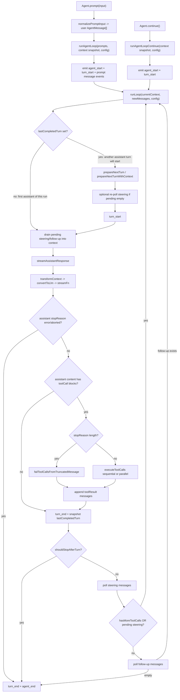

> `spine.agent-loop` 说明 `pi-agent-core` 如何把一次用户输入或 continuation 变成 provider streaming、assistant message、tool calls、tool results，以及何时调用 `prepareNextTurn` / `shouldStopAfterTurn` 来停止或续跑。

## 能回答的问题

- `runAgentLoop` 和 `runAgentLoopContinue` 在进入同一个 `runLoop` 前有什么差别？
- 一次 turn 的事件顺序是什么，哪些事件会改变 `Agent.state`？
- `prepareNextTurn` / `prepareNextTurnWithContext` 在 0.84.4 之后何时运行，终局 turn 还会不会调用？
- assistant message 里有多个 tool call 时，`executeToolCalls` 怎么选择 sequential 或 parallel？
- 同一 run 内 tool 执行与下一轮模型请求之间，谁插入 compaction？
- `agent` 包和 `coding-agent` 产品层在 agent loop 上的边界在哪里？

```mermaid
flowchart TD
  A["Agent.prompt(input)"] --> B["normalizePromptInput -> user AgentMessage[]"]
  B --> C["runAgentLoop(prompts, context snapshot, config)"]
  A2["Agent.continue()"] --> C2["runAgentLoopContinue(context snapshot, config)"]
  C --> D["emit agent_start + turn_start + prompt message events"]
  C2 --> D2["emit agent_start + turn_start"]
  D --> E["runLoop(currentContext, newMessages, config)"]
  D2 --> E
  E --> F{"lastCompletedTurn set?"}
  F -- "yes: another assistant turn will start" --> PNT["prepareNextTurn / prepareNextTurnWithContext"]
  PNT --> STEER2["optional re-poll steering if pending empty"]
  STEER2 --> TS["turn_start"]
  F -- "no: first assistant of this run" --> G
  TS --> G["drain pending steering/follow-up into context"]
  G --> H["streamAssistantResponse"]
  H --> I["transformContext -> convertToLlm -> streamFn"]
  I --> J{"assistant stopReason error/aborted?"}
  J -- "yes" --> Z["turn_end + agent_end"]
  J -- "no" --> K{"assistant content has toolCall blocks?"}
  K -- "yes" --> L{"stopReason length?"}
  L -- "yes" --> FAIL["failToolCallsFromTruncatedMessage"]
  L -- "no" --> EX["executeToolCalls sequential or parallel"]
  FAIL --> Q
  EX --> Q["append toolResult messages"]
  K -- "no" --> R
  Q --> R["turn_end + snapshot lastCompletedTurn"]
  R --> STOP{"shouldStopAfterTurn?"}
  STOP -- "yes" --> Z
  STOP -- "no" --> STEER["poll steering messages"]
  STEER --> MORE{"hasMoreToolCalls OR pending steering?"}
  MORE -- "yes" --> E
  MORE -- "no" --> FU["poll follow-up messages"]
  FU -- "follow-up exists" --> E
  FU -- "empty" --> Z
```

## 端到端步骤

1. `Agent.prompt` 是新 prompt 的有状态入口：它拒绝并发 active run，把字符串或消息归一成 `AgentMessage[]`，再进入 `runPromptMessages`。[E: packages/agent/src/agent.ts:350] [E: packages/agent/src/agent.ts:351] [E: packages/agent/src/agent.ts:356] [E: packages/agent/src/agent.ts:357] `runPromptMessages` 调用 `runAgentLoop(messages, createContextSnapshot(), createLoopConfig(), processEvents, signal, streamFunction)`，所以低层 loop 接收的是状态快照和一组新 prompt。[E: packages/agent/src/agent.ts:413] [E: packages/agent/src/agent.ts:414] [E: packages/agent/src/agent.ts:415] [E: packages/agent/src/agent.ts:416] [E: packages/agent/src/agent.ts:417] [E: packages/agent/src/agent.ts:418] [E: packages/agent/src/agent.ts:420]

2. `Agent.continue` 是 continuation 入口：如果当前最后一条消息是 assistant，它会优先把 queued steering 或 follow-up 作为新的 prompt 跑；没有队列时才抛出 `Cannot continue from message role: assistant`。[E: packages/agent/src/agent.ts:361] [E: packages/agent/src/agent.ts:371] [E: packages/agent/src/agent.ts:372] [E: packages/agent/src/agent.ts:374] [E: packages/agent/src/agent.ts:378] [E: packages/agent/src/agent.ts:380] [E: packages/agent/src/agent.ts:384] 如果最后一条不是 assistant，`runContinuation` 调用 `runAgentLoopContinue`，不额外加入 prompt。[E: packages/agent/src/agent.ts:387] [E: packages/agent/src/agent.ts:425] [E: packages/agent/src/agent.ts:427]

3. `runAgentLoop` 会把 prompts 同时放进 `newMessages` 和 `currentContext.messages`，先发 `agent_start`、`turn_start`，再为每个 prompt 发 `message_start`/`message_end`。[E: packages/agent/src/agent-loop.ts:104] [E: packages/agent/src/agent-loop.ts:107] [E: packages/agent/src/agent-loop.ts:110] [E: packages/agent/src/agent-loop.ts:111] [E: packages/agent/src/agent-loop.ts:113] [E: packages/agent/src/agent-loop.ts:114] `runAgentLoopContinue` 则要求 context 非空且最后一条不是 assistant，然后以空 `newMessages` 进入同一个 `runLoop`。[E: packages/agent/src/agent-loop.ts:128] [E: packages/agent/src/agent-loop.ts:132] [E: packages/agent/src/agent-loop.ts:136] [E: packages/agent/src/agent-loop.ts:142]

4. `runLoop` 有外层 follow-up loop 和内层 turn loop：外层只在 agent 本来要停时检查 follow-up messages，内层在还有 tool calls 或 pending steering messages 时继续发起 assistant response。[E: packages/agent/src/agent-loop.ts:171] [E: packages/agent/src/agent-loop.ts:175] [E: packages/agent/src/agent-loop.ts:261] [E: packages/agent/src/agent-loop.ts:262] 开始时和每个 turn 的 `shouldStopAfterTurn` 通过之后都会通过 `getSteeringMessages` 取 steering queue；存在 pending messages 时会把它们作为普通 message 事件追加到 context 与 `newMessages`，再进入下一次 assistant response。[E: packages/agent/src/agent-loop.ts:168] [E: packages/agent/src/agent-loop.ts:201] [E: packages/agent/src/agent-loop.ts:203] [E: packages/agent/src/agent-loop.ts:205] [E: packages/agent/src/agent-loop.ts:206] [E: packages/agent/src/agent-loop.ts:257]

5. `streamAssistantResponse` 是 agent loop 到 provider stream 的边界：它可先运行 `transformContext`，再调用 `convertToLlm` 把 `AgentMessage[]` 转为 `Message[]`，然后用 `systemPrompt`、转换后的 messages 和 tools 构造 LLM `Context`。[E: packages/agent/src/agent-loop.ts:279] [E: packages/agent/src/agent-loop.ts:288] [E: packages/agent/src/agent-loop.ts:289] [E: packages/agent/src/agent-loop.ts:293] [E: packages/agent/src/agent-loop.ts:296] [E: packages/agent/src/agent-loop.ts:297] [E: packages/agent/src/agent-loop.ts:298] [E: packages/agent/src/agent-loop.ts:299] 每次 provider request 前会动态解析 API key，再调用本轮已经解析好的 `streamFunction`。[E: packages/agent/src/agent-loop.ts:303] [E: packages/agent/src/agent-loop.ts:306] 若 caller 没传 `streamFn`，低层 loop 与 `Agent` 都改用 `getDefaultStreamFn()`；agent-core 本身不再直接依赖 `streamSimple`。[E: packages/agent/src/agent-loop.ts:117] [E: packages/agent/src/agent-loop.ts:142] [E: packages/agent/src/agent.ts:222] [I]

6. provider stream 的事件被折叠为一个 mutable assistant message：`start` 时把 partial message push 进 context 并发 `message_start`；text/thinking/toolcall delta 类事件更新最后一条 context message 并发 `message_update`；`done` 或 `error` 时读取 `response.result()`，替换 partial 或追加 final message，然后发 `message_end` 并返回 final assistant message。[E: packages/agent/src/agent-loop.ts:315] [E: packages/agent/src/agent-loop.ts:318] [E: packages/agent/src/agent-loop.ts:319] [E: packages/agent/src/agent-loop.ts:321] [E: packages/agent/src/agent-loop.ts:333] [E: packages/agent/src/agent-loop.ts:334] [E: packages/agent/src/agent-loop.ts:335] [E: packages/agent/src/agent-loop.ts:336] [E: packages/agent/src/agent-loop.ts:346] [E: packages/agent/src/agent-loop.ts:348] [E: packages/agent/src/agent-loop.ts:350]

7. `runLoop` 收到 assistant message 后把它放进 `newMessages`；如果 `stopReason` 是 `error` 或 `aborted`，本 turn 不执行工具，直接发 `turn_end` 和 `agent_end` 后退出。[E: packages/agent/src/agent-loop.ts:212] [E: packages/agent/src/agent-loop.ts:213] [E: packages/agent/src/agent-loop.ts:215] [E: packages/agent/src/agent-loop.ts:216] [E: packages/agent/src/agent-loop.ts:217] [E: packages/agent/src/agent-loop.ts:218]

8. 正常 assistant message 会从 content 中筛出 `toolCall` blocks；没有 tool calls 时，本 turn 的 `toolResults` 为空，`hasMoreToolCalls` 为 false。[E: packages/agent/src/agent-loop.ts:222] [E: packages/agent/src/agent-loop.ts:224] [E: packages/agent/src/agent-loop.ts:225] 有 tool calls 且 `stopReason === "length"` 时，整批走 `failToolCallsFromTruncatedMessage`，不执行工具；否则走 `executeToolCalls`。loop 把所有结果追加到 context 与 `newMessages`，再发 `turn_end`。[E: packages/agent/src/agent-loop.ts:230] [E: packages/agent/src/agent-loop.ts:231] [E: packages/agent/src/agent-loop.ts:232] [E: packages/agent/src/agent-loop.ts:233] [E: packages/agent/src/agent-loop.ts:237] [E: packages/agent/src/agent-loop.ts:243]

9. `executeToolCalls` 的分派规则很小：如果全局 `config.toolExecution === "sequential"`，或任一目标 tool 的 `executionMode` 是 `"sequential"`，整批走 sequential；否则走 parallel。[E: packages/agent/src/agent-loop.ts:417] [E: packages/agent/src/agent-loop.ts:420] [E: packages/agent/src/agent-loop.ts:421] [E: packages/agent/src/agent-loop.ts:423] `Agent` 的默认 `toolExecution` 是 `"parallel"`。[E: packages/agent/src/agent.ts:237]

10. 工具调用准备阶段会按 tool name 查找工具、可选运行 `prepareArguments`、用 schema 做 `validateToolArguments`，然后调用 `beforeToolCall`；找不到 tool、校验或 hook 报错、hook block、abort 都会变成 immediate error result，而不是执行工具。[E: packages/agent/src/agent-loop.ts:614] [E: packages/agent/src/agent-loop.ts:615] [E: packages/agent/src/agent-loop.ts:624] [E: packages/agent/src/agent-loop.ts:625] [E: packages/agent/src/agent-loop.ts:626] [E: packages/agent/src/agent-loop.ts:643] [E: packages/agent/src/agent-loop.ts:655] [E: packages/agent/src/agent-loop.ts:669] 具体工具 payload、`prepareToolCall`、`executePreparedToolCall` 与 result anatomy 由 `spine.tool-call-anatomy` 深挖。

11. sequential 模式按 assistant source order 一个个 prepare、execute、finalize、emit end，再产生 toolResult message；parallel 模式仍先逐个 prepare，但把可执行项包装为 promise 并用 `Promise.all` 并发执行，最后按 `orderedFinalizedCalls` 数组顺序发 toolResult message artifacts。[E: packages/agent/src/agent-loop.ts:442] [E: packages/agent/src/agent-loop.ts:450] [E: packages/agent/src/agent-loop.ts:459] [E: packages/agent/src/agent-loop.ts:470] [E: packages/agent/src/agent-loop.ts:497] [E: packages/agent/src/agent-loop.ts:505] [E: packages/agent/src/agent-loop.ts:520] [E: packages/agent/src/agent-loop.ts:547] [E: packages/agent/src/agent-loop.ts:551]

12. 每个真实执行的 tool call 通过 `tool.execute(toolCall.id, args, signal, onUpdate)` 运行；partial updates 会发 `tool_execution_update`，工具抛错会被转成 error tool result。[E: packages/agent/src/agent-loop.ts:686] [E: packages/agent/src/agent-loop.ts:689] [E: packages/agent/src/agent-loop.ts:694] [E: packages/agent/src/agent-loop.ts:708] [E: packages/agent/src/agent-loop.ts:712] `afterToolCall` 可在 `tool_execution_end` 和 toolResult message 事件之前覆盖 content、details、usage、terminate、isError。[E: packages/agent/src/agent-loop.ts:731] [E: packages/agent/src/agent-loop.ts:744] [E: packages/agent/src/agent-loop.ts:747] [E: packages/agent/src/agent-loop.ts:748] [E: packages/agent/src/agent-loop.ts:749] [E: packages/agent/src/agent-loop.ts:750] [E: packages/agent/src/agent-loop.ts:752]

13. tool batch 的 early termination 只有在所有 finalized tool result 都设置 `terminate === true` 时成立；`runLoop` 用这个结果把 `hasMoreToolCalls` 置为 false，从而不再因为本批工具结果自动进入下一次 assistant response。[E: packages/agent/src/agent-loop.ts:235] [E: packages/agent/src/agent-loop.ts:589] [E: packages/agent/src/agent-loop.ts:590] 如果此时还有 steering 或 follow-up message，loop 仍可能继续，因为内外层条件还会检查消息队列。[E: packages/agent/src/agent-loop.ts:175] [E: packages/agent/src/agent-loop.ts:261]

14. **`prepareNextTurn` 新时序（0.84.4 breaking）**：`turn_end` 之后 loop 先写入 `lastCompletedTurn`，再调用 `shouldStopAfterTurn`。若它返回 true，立即发 `agent_end` 并退出，**不**调用 `prepareNextTurn`。[E: packages/agent/src/agent-loop.ts:243] [E: packages/agent/src/agent-loop.ts:245] [E: packages/agent/src/agent-loop.ts:252] [E: packages/agent/src/agent-loop.ts:253] [E: packages/agent/CHANGELOG.md:18] 若未停止，先 poll steering；只有内层 `hasMoreToolCalls || pendingMessages.length > 0` 或外层 follow-up 决定**还会再开一轮 assistant turn** 时，下一轮循环入口才调用 `prepareNextTurn`，然后可选再 poll 一次 steering，再发 `turn_start`。[E: packages/agent/src/agent-loop.ts:176] [E: packages/agent/src/agent-loop.ts:177] [E: packages/agent/src/agent-loop.ts:194] [E: packages/agent/src/agent-loop.ts:197] [E: packages/agent/src/agent-loop.ts:257] [E: packages/agent/src/agent-loop.ts:262] 终局 / terminating turn（`shouldStopAfterTurn`、error/aborted、或队列耗尽后的 `agent_end`）不再运行 `prepareNextTurn`；end-of-run 工作应放到 `agent_end`。[E: packages/agent/src/types.ts:223] [E: packages/agent/src/types.ts:230] [E: packages/agent/CHANGELOG.md:18] `prepareNextTurn` 的 `thinkingLevel: "off"` 映射成 `undefined`，与 `Agent.createLoopConfig` 的初始映射一致。[E: packages/agent/src/agent-loop.ts:184] [E: packages/agent/src/agent-loop.ts:187] [E: packages/agent/src/agent.ts:450]

15. `Agent.createLoopConfig` 把 `prepareNextTurnWithContext(context, signal)` 优先于无 context 的 `prepareNextTurn(signal)` 包装成 `AgentLoopConfig.prepareNextTurn`。[E: packages/agent/src/agent.ts:463] [E: packages/agent/src/agent.ts:466] [E: packages/agent/src/agent.ts:467] [E: packages/agent/src/agent.ts:469] coding-agent 在这个 hook 里对当前 context 做 threshold auto-compaction，因此同一 run 内 tool 执行与下一轮模型请求之间可以插入 compaction。[E: packages/agent/src/agent-loop.ts:177] [E: packages/agent/src/agent-loop.ts:194] 产品装配见 `subsys.coding-agent.agent-session`。[I]

## 关键决策点

### 新 prompt vs continuation

新 prompt 的 `newMessages` 包含本次传入 prompts，continuation 的 `newMessages` 从空数组开始；因此 `agent_end.messages` 对 continuation 只代表本次 continuation 新产生的消息，而不是整个历史 transcript。[E: packages/agent/src/agent-loop.ts:104] [E: packages/agent/src/agent-loop.ts:136] [E: packages/agent/src/agent-loop.ts:272] 运行中的完整 transcript 由 `Agent.processEvents` 在 `message_end` 时追加到 `_state.messages`。[E: packages/agent/src/agent.ts:554] [E: packages/agent/src/agent.ts:556]

### 事件流 vs 状态流

低层 `agent-loop.ts` 通过 `AgentEventSink` emit events，并维护本轮的 `currentContext`/`newMessages`；有状态的 `Agent` 通过 `processEvents` 把 `message_start/update/end`、tool pending set、errorMessage 归约进 `_state`，再同步通知订阅者。[E: packages/agent/src/agent-loop.ts:26] [E: packages/agent/src/agent-loop.ts:156] [E: packages/agent/src/agent-loop.ts:164] [E: packages/agent/src/agent-loop.ts:205] [E: packages/agent/src/agent-loop.ts:206] [E: packages/agent/src/agent.ts:544] [E: packages/agent/src/agent.ts:547] [E: packages/agent/src/agent.ts:551] [E: packages/agent/src/agent.ts:554] [E: packages/agent/src/agent.ts:556] [E: packages/agent/src/agent.ts:559] [E: packages/agent/src/agent.ts:566] [E: packages/agent/src/agent.ts:574] [E: packages/agent/src/agent.ts:579]

### tool execution ordering

parallel 模式不是把所有阶段都并行：prepare 阶段仍按 source order 串行执行，只有 prepared tool 的 `execute()` 阶段被延后并发；toolResult message artifacts 再按 `orderedFinalizedCalls` 顺序发出。[E: packages/agent/src/agent-loop.ts:497] [E: packages/agent/src/agent-loop.ts:505] [E: packages/agent/src/agent-loop.ts:520] [E: packages/agent/src/agent-loop.ts:547] [E: packages/agent/src/agent-loop.ts:551]

### graceful stop vs hard failure vs prepareNextTurn skip

`shouldStopAfterTurn` 是 graceful stop：它在 assistant response 和本 turn 工具执行都完成、`turn_end` 已经发出之后截断后续轮次，并且**先于** `prepareNextTurn`。[E: packages/agent/src/agent-loop.ts:243] [E: packages/agent/src/agent-loop.ts:252] [E: packages/agent/src/types.ts:223] `runLoop` 还专门检查 assistant `stopReason` 是否为 `"error"` 或 `"aborted"`，并在该分支直接结束本轮与整个 run，同样不调用 `prepareNextTurn`。[E: packages/agent/src/agent-loop.ts:215] [E: packages/agent/src/agent-loop.ts:216] [E: packages/agent/src/agent-loop.ts:217]

### stream function 默认值是 host 安装的全局 seam

`setDefaultStreamFn()` 修改 module-global fallback；`getDefaultStreamFn()` 在尚未安装时抛出错误，要求 caller 显式传 `streamFn` 或先安装默认值。coding-agent host 在 SDK 装配时用 compat `streamSimple` 安装它，而 agent-core 顶层只公开 setter，不把 provider compatibility layer 重新变成 core 的硬依赖。[E: packages/agent/src/stream-fn.ts:11] [E: packages/agent/src/stream-fn.ts:15] [E: packages/agent/src/stream-fn.ts:16] [E: packages/agent/src/stream-fn.ts:17] [E: packages/coding-agent/src/core/sdk.ts:2] [E: packages/coding-agent/src/core/sdk.ts:3] [E: packages/coding-agent/src/core/sdk.ts:37] [I]

## 跨包关系

- `spine.provider-stream`：`agent` 包在 `streamAssistantResponse` 构造 `Context` 并调用 stream function；provider 的 wire protocol、event-stream 归一化和 `Models.stream` 分派不在本节点展开。[E: packages/agent/src/agent-loop.ts:296] [E: packages/agent/src/agent-loop.ts:306] [I]
- `spine.tool-call-anatomy`：本节点只讲 turn 何时执行工具和如何续轮；工具 lookup、执行、hook override、toolResult message 构造在 loop 层只作为流程节点出现，字段语义由工具调用解剖节点覆盖。[E: packages/agent/src/agent-loop.ts:614] [E: packages/agent/src/agent-loop.ts:686] [E: packages/agent/src/agent-loop.ts:731] [E: packages/agent/src/agent-loop.ts:784] [I]
- `spine.compaction-flow`：harness `compact()` API 仍是准备 cut point 与生成 summary；产品层把 threshold auto-compaction 挂在 `prepareNextTurnWithContext` 上，因此 compaction 可以发生在同一 run 的 tool batch 与下一轮 `streamAssistantResponse` 之间。[E: packages/agent/src/agent-loop.ts:177] [E: packages/agent/src/agent-loop.ts:194] [I]
- `subsys.agent-core.turn-control`：本节点是 T0 端到端视角；turn-control 子系统应细化 `runLoop` 的 while 条件、queue drain 点、`prepareNextTurn`/`shouldStopAfterTurn` 的组合行为。[E: packages/agent/src/agent-loop.ts:156] [E: packages/agent/src/agent-loop.ts:175] [E: packages/agent/src/agent-loop.ts:252]
- `subsys.agent-core.hooks`：`AgentLoopConfig.prepareNextTurn` 的类型合同写在 `types.ts`；`Agent.prepareNextTurnWithContext` 是带 turn context 的 Agent 包装。[E: packages/agent/src/types.ts:230] [E: packages/agent/src/agent.ts:200]
- `subsys.agent-core.message-queue`：`Agent` 提供 `steer` 与 `followUp` 两个 queue API，并通过 `createLoopConfig` 暴露为 `getSteeringMessages` 与 `getFollowUpMessages`；queue 的 drain mode 和产品侧使用场景应在 message-queue 节点详写。[E: packages/agent/src/agent.ts:475] [E: packages/agent/src/agent.ts:482]

## 包边界

`pi-agent-core` 的 loop 是可复用 runtime：`Agent.createContextSnapshot` 只交给低层 loop system prompt、messages、tools，`Agent.createLoopConfig` 接收 model、stream function options、hooks、queues、tool execution mode 等运行时注入点。[E: packages/agent/src/agent.ts:437] [E: packages/agent/src/agent.ts:439] [E: packages/agent/src/agent.ts:440] [E: packages/agent/src/agent.ts:441] [E: packages/agent/src/agent.ts:445] [E: packages/agent/src/agent.ts:449] [E: packages/agent/src/agent.ts:463] [E: packages/agent/src/agent.ts:472] [E: packages/agent/src/agent.ts:475] [E: packages/agent/src/agent.ts:482] `pi-coding-agent` 通过全局 stream seam 和构造参数装配 provider runtime；agent-core 不直接选择 provider 或 compatibility implementation。[E: packages/agent/src/stream-fn.ts:11] [E: packages/coding-agent/src/core/sdk.ts:37] [I]

## 指向 T1/T2 深挖

- 读 `spine.provider-stream` 理解 `streamFn` 如何从 `Context` 进入 provider wire protocol，并如何产生 `AssistantMessageEventStream`。
- 读 `spine.tool-call-anatomy` 理解 tool schema validation、`beforeToolCall`/`afterToolCall`、partial update、toolResult message 的字段。
- 读 `subsys.agent-core.turn-control` 聚焦 `runLoop` 的停止条件、queue drain 点、turn update。
- 读 `subsys.agent-core.hooks` 聚焦 `prepareNextTurn` 类型合同与 `shouldStopAfterTurn` 的先后关系。
- 读 `subsys.coding-agent.agent-session` 聚焦产品层如何在 `prepareNextTurnWithContext` 里插入 threshold compaction。

## Sources

- packages/agent/src/agent-loop.ts
- packages/agent/src/agent.ts
- packages/agent/src/types.ts
- packages/agent/src/stream-fn.ts
- packages/coding-agent/src/core/sdk.ts
- packages/agent/CHANGELOG.md

## 相关

- spine.tool-call-anatomy
- spine.provider-stream
- spine.compaction-flow
- subsys.agent-core.turn-control
- subsys.agent-core.hooks
- subsys.agent-core.message-queue
