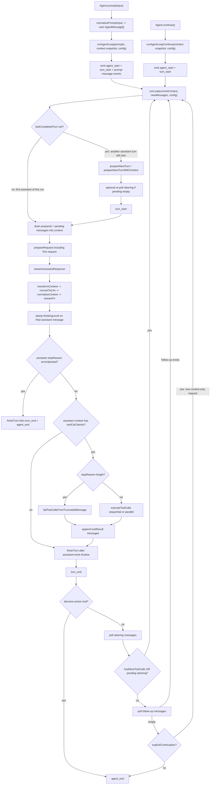

> `spine.agent-loop` 说明 `@earendil-works/pi-agent-core` **1.0.1** 如何把一次用户输入或 continuation 变成 provider streaming、assistant message、tool calls、tool results，以及现行 hook `prepareRequest` / `finishTurn` / `prepareNextTurn` 如何插入每次请求与每轮收尾。agent-core 在 1.0.0 已删除 experimental harness：包内只剩 `Agent`、agent loop、proxy stream 与 types。

## 能回答的问题

- `runAgentLoop` 和 `runAgentLoopContinue` 在进入同一个 `runLoop` 前有什么差别？
- 一次 turn 的 `AgentEvent` 有哪 10 个 variant，哪些事件会改变 `Agent.state`？
- `prepareRequest` / `finishTurn` 仍在吗？`shouldStopAfterTurn` 还在吗？`{ action: "end" }` 与 error/aborted hard exit 有何不同？
- assistant message 上的 `thinkingLevel` 是谁写入的？
- 同一 run 内 tool 执行与下一轮模型请求之间，谁插入 compaction？agent-core 自己有没有 harness / compaction？
- `pi-agent-core`、`pi-coding-agent` 产品会话、`pi-durable` 可复用 session 在 loop 上的边界在哪里？

```mermaid
flowchart TD
 A["Agent.prompt(input)"] --> B["normalizePromptInput -> user AgentMessage[]"]
 B --> C["runAgentLoop(prompts, context snapshot, config)"]
 A2["Agent.continue()"] --> C2["runAgentLoopContinue(context snapshot, config)"]
 C --> D["emit agent_start + turn_start + prompt message events"]
 C2 --> D2["emit agent_start + turn_start"]
 D --> E["runLoop(currentContext, newMessages, config)"]
 D2 --> E
 E --> F{"lastCompletedTurn set?"}
 F -- "yes: another assistant turn will start" --> PNT["prepareNextTurn / prepareNextTurnWithContext"]
 PNT --> STEER2["optional re-poll steering if pending empty"]
 STEER2 --> TS["turn_start"]
 F -- "no: first assistant of this run" --> G
 TS --> G["drain prepared + pending messages into context"]
 G --> PR["prepareRequest including first request"]
 PR --> H["streamAssistantResponse"]
 H --> I["transformContext -> convertToLlm -> normalizeContext -> streamFn"]
 I --> TL["stamp thinkingLevel on final assistant message"]
 TL --> J{"assistant stopReason error/aborted?"}
 J -- "yes" --> FT1["finishTurn then turn_end + agent_end"]
 J -- "no" --> K{"assistant content has toolCall blocks?"}
 K -- "yes" --> L{"stopReason length?"}
 L -- "yes" --> FAIL["failToolCallsFromTruncatedMessage"]
 L -- "no" --> EX["executeToolCalls sequential or parallel"]
 FAIL --> Q
 EX --> Q["append toolResult messages"]
 K -- "no" --> R
 Q --> R["finishTurn after assistant+tools finalize"]
 R --> TE["turn_end"]
 TE --> STOP{"decision.action end?"}
 STOP -- "yes" --> Z["agent_end"]
 STOP -- "no" --> STEER["poll steering messages"]
 STEER --> MORE{"hasMoreToolCalls OR pending steering?"}
 MORE -- "yes" --> E
 MORE -- "no" --> FU["poll follow-up messages"]
 FU -- "follow-up exists" --> E
 FU -- "empty" --> CONT{"explicitContinuation?"}
 CONT -- "yes: one context-only request" --> E
 CONT -- "no" --> Z
```

## 包边界

`@earendil-works/pi-agent-core` 版本 **1.0.1**。[E: packages/agent/package.json:3] 1.0.0 breaking 删除 experimental harness：`AgentHarness`、sessions/storage、pico3、harness tools、compaction、skills、prompt templates、system prompt helpers、telemetry schemas、search、以及 `./node` / `./harness/*` / `./experimental/pico3` 子路径。现行包只导出 `Agent`、agent loop、proxy stream 与 types；可复用 durable session 用 `@earendil-works/pi-durable`。[E: packages/agent/CHANGELOG.md:11] 公开入口只 re-export `agent.ts`、`agent-loop.ts`、`proxy.ts`、`setDefaultStreamFn`、`types.ts`；`package.json` `exports` 也只有 `"."` 与 `"./package.json"`，没有 `./harness/*`。[E: packages/agent/src/index.ts:1] [E: packages/agent/src/index.ts:2] [E: packages/agent/src/index.ts:3] [E: packages/agent/src/index.ts:4] [E: packages/agent/src/index.ts:5] [E: packages/agent/package.json:8] [E: packages/agent/package.json:13]

低层 loop 是可复用 runtime：`Agent.createContextSnapshot` 只交给 `runLoop` 一份 messages + executable tools 快照；`Agent.createLoopConfig` 注入 model、stream options、hooks、queues、tool execution mode。[E: packages/agent/src/agent.ts:460] [E: packages/agent/src/agent.ts:462] [E: packages/agent/src/agent.ts:463] [E: packages/agent/src/agent.ts:467] [E: packages/agent/src/agent.ts:470] [E: packages/agent/src/agent.ts:482] [E: packages/agent/src/agent.ts:483] [E: packages/agent/src/agent.ts:503] `pi-coding-agent` 通过全局 stream seam 与 `AgentSession` 装配产品会话（`SessionManager` JSONL 投影、threshold compaction）；agent-core 不选择 provider，也不再携带 session/harness。[E: packages/agent/src/stream-fn.ts:11] [E: packages/coding-agent/src/core/sdk.ts:39] [E: packages/coding-agent/src/core/agent-session.ts:761] [E: packages/coding-agent/src/core/agent-session.ts:876]

## 端到端步骤

1. `Agent.prompt@packages/agent/src/agent.ts` 是新 prompt 的有状态入口：拒绝并发 active run，把字符串或消息归一成 `AgentMessage[]`，再进入 `runPromptMessages`。[E: packages/agent/src/agent.ts:373] [E: packages/agent/src/agent.ts:374] [E: packages/agent/src/agent.ts:379] [E: packages/agent/src/agent.ts:380] `runPromptMessages` 调用 `runAgentLoop(messages, createContextSnapshot(), createLoopConfig(), processEvents, signal, streamFunction)`，所以低层 loop 接收的是状态快照和一组新 prompt。[E: packages/agent/src/agent.ts:436] [E: packages/agent/src/agent.ts:437] [E: packages/agent/src/agent.ts:438] [E: packages/agent/src/agent.ts:439] [E: packages/agent/src/agent.ts:440] [E: packages/agent/src/agent.ts:441] [E: packages/agent/src/agent.ts:443]

2. `Agent.continue@packages/agent/src/agent.ts` 是 continuation 入口：如果当前最后一条消息是 assistant，它会优先把 queued steering 或 follow-up 作为新的 prompt 跑；没有队列时才抛出 `Cannot continue from message role: assistant`。[E: packages/agent/src/agent.ts:384] [E: packages/agent/src/agent.ts:394] [E: packages/agent/src/agent.ts:395] [E: packages/agent/src/agent.ts:397] [E: packages/agent/src/agent.ts:401] [E: packages/agent/src/agent.ts:403] [E: packages/agent/src/agent.ts:407] 如果最后一条不是 assistant，`runContinuation` 调用 `runAgentLoopContinue`，不额外加入 prompt。[E: packages/agent/src/agent.ts:410] [E: packages/agent/src/agent.ts:448] [E: packages/agent/src/agent.ts:450]

3. `runAgentLoop@packages/agent/src/agent-loop.ts` 先用 `declareToolChanges` 把 prompts 转成 `initialMessages`，再同时放进 `newMessages` 和 `currentContext.messages`，先发 `agent_start`、`turn_start`，再为每条 initial message 发 `message_start`/`message_end`。[E: packages/agent/src/agent-loop.ts:110] [E: packages/agent/src/agent-loop.ts:111] [E: packages/agent/src/agent-loop.ts:114] [E: packages/agent/src/agent-loop.ts:117] [E: packages/agent/src/agent-loop.ts:118] [E: packages/agent/src/agent-loop.ts:119] `runAgentLoopContinue` 则要求 context 非空且最后一条不是 assistant，然后以空 `newMessages` 进入同一个 `runLoop`。[E: packages/agent/src/agent-loop.ts:135] [E: packages/agent/src/agent-loop.ts:139] [E: packages/agent/src/agent-loop.ts:143] [E: packages/agent/src/agent-loop.ts:149]

4. `runLoop@packages/agent/src/agent-loop.ts` 有外层 follow-up loop 和内层 turn loop：外层只在 agent 本来要停时检查 follow-up messages，内层在还有 tool calls 或 pending steering messages 时继续发起 assistant response。[E: packages/agent/src/agent-loop.ts:179] [E: packages/agent/src/agent-loop.ts:183] [E: packages/agent/src/agent-loop.ts:302] 开始时通过 `getSteeringMessages` 取 steering queue；每轮 `finishTurn` 未 `{ action: "end" }` 之后也会再 poll steering。[E: packages/agent/src/agent-loop.ts:176] [E: packages/agent/src/agent-loop.ts:289] [E: packages/agent/src/agent-loop.ts:295] 存在 pending 或 `prepareNextTurn` 返回的 `messages` 时，`declareToolChanges` 后作为普通 message 事件追加到 context 与 `newMessages`，再进入下一次 assistant response。[E: packages/agent/src/agent-loop.ts:189] [E: packages/agent/src/agent-loop.ts:211] [E: packages/agent/src/agent-loop.ts:214] [E: packages/agent/src/agent-loop.ts:215]

5. 每次 provider 请求前（含本 run 第一次）都会调用 **仍然存在的** `prepareRequest`：它发生在 pending/prepared messages 已经 append 并发出事件之后、`streamAssistantResponse` 之前，返回值可以替换本轮及后续的 `context` / `model` / `thinkingLevel`，但不能追加 messages，也不会 poll 队列。[E: packages/agent/src/agent-loop.ts:219] [E: packages/agent/src/agent-loop.ts:227] [E: packages/agent/src/types.ts:186] [E: packages/agent/src/types.ts:271] [E: packages/agent/src/agent.ts:126] [E: packages/agent/CHANGELOG.md:48] `AgentOptions` / `AgentLoopConfig` 没有 `shouldStopAfterTurn`；0.87.0 已删除该 hook，正常 turn 用 `finishTurn` 返回 `{ action: "end" }` 停轮。[E: packages/agent/src/agent.ts:125] [E: packages/agent/src/types.ts:264] [E: packages/agent/CHANGELOG.md:30] `streamAssistantResponse` 可先运行 `transformContext`，再 `convertToLlm` 把 `AgentMessage[]` 转为 `Message[]`，然后 `normalizeContext({ messages: llmMessages })` 得到 transcript context；system prompt 与 tool declarations 由 transcript 里的 system messages 携带，而不是旧的 `context.systemPrompt` / `context.tools` 字段。[E: packages/agent/src/agent-loop.ts:389] [E: packages/agent/src/agent-loop.ts:391] [E: packages/agent/src/agent-loop.ts:395] [E: packages/agent/src/agent-loop.ts:397] [E: packages/agent/src/types.ts:33] 每次 provider request 前会动态解析 API key，再调用本轮已经解析好的 `streamFunction`。[E: packages/agent/src/agent-loop.ts:400] [E: packages/agent/src/agent-loop.ts:403] 若 caller 没传 `streamFn`，低层 loop 与 `Agent` 都改用 `getDefaultStreamFn()`；agent-core 本身不 import `streamSimple`。[E: packages/agent/src/agent-loop.ts:124] [E: packages/agent/src/agent-loop.ts:149] [E: packages/agent/src/agent.ts:236] [E: packages/coding-agent/src/core/sdk.ts:4] [E: packages/coding-agent/src/core/sdk.ts:39]

6. provider stream 的事件被折叠为一个 mutable assistant message：`start` 时把 partial message push 进 context 并发 `message_start`；text/thinking/toolcall delta 类事件更新最后一条 context message 并发 `message_update`；`done` 或 `error` 时读取 `response.result()`，替换 partial 或追加 final message，然后发 `message_end` 并返回 final assistant message。[E: packages/agent/src/agent-loop.ts:414] [E: packages/agent/src/agent-loop.ts:417] [E: packages/agent/src/agent-loop.ts:418] [E: packages/agent/src/agent-loop.ts:420] [E: packages/agent/src/agent-loop.ts:432] [E: packages/agent/src/agent-loop.ts:433] [E: packages/agent/src/agent-loop.ts:434] [E: packages/agent/src/agent-loop.ts:435] [E: packages/agent/src/agent-loop.ts:443] [E: packages/agent/src/agent-loop.ts:445] [E: packages/agent/src/agent-loop.ts:454] **`thinkingLevel` 写在 assistant message 上**：`streamAssistantResponse` 用 `Object.assign(await response.result(), { thinkingLevel: config.reasoning ?? "off" })` 把本轮请求的 reasoning 级（`undefined` 映射成 `"off"`）盖到最终 assistant message，不依赖具体 stream function 是否自己带回该字段。[E: packages/agent/src/agent-loop.ts:409] [E: packages/agent/CHANGELOG.md:22] `Agent.createLoopConfig` 把 `state.thinkingLevel === "off"` 编成 `reasoning: undefined`，其它级别原样传入 stream options。[E: packages/agent/src/agent.ts:471] [E: packages/agent/src/types.ts:393]

7. `runLoop` 收到 assistant message 后把它放进 `newMessages`；如果 `stopReason` 是 `error` 或 `aborted`，本 turn 不执行工具，仍调用 `finishTurn`，然后发 `turn_end` 和 `agent_end` 后退出。这条路径是 hard exit：`finishTurn` 的返回值被忽略，不会 poll 队列，也不会开下一轮。[E: packages/agent/src/agent-loop.ts:242] [E: packages/agent/src/agent-loop.ts:245] [E: packages/agent/src/agent-loop.ts:252] [E: packages/agent/src/agent-loop.ts:253] [E: packages/agent/src/agent-loop.ts:254] [E: packages/agent/src/agent-loop.ts:255] [E: packages/agent/CHANGELOG.md:49]

8. 正常 assistant message 会从 content 中筛出 `toolCall` blocks；没有 tool calls 时，本 turn 的 `toolResults` 为空，`hasMoreToolCalls` 为 false。[E: packages/agent/src/agent-loop.ts:259] [E: packages/agent/src/agent-loop.ts:261] [E: packages/agent/src/agent-loop.ts:262] 有 tool calls 且 `stopReason === "length"` 时，整批走 `failToolCallsFromTruncatedMessage`，不执行工具；否则走 `executeToolCalls`。loop 把所有结果追加到 context 与 `newMessages`。[E: packages/agent/src/agent-loop.ts:267] [E: packages/agent/src/agent-loop.ts:268] [E: packages/agent/src/agent-loop.ts:269] [E: packages/agent/src/agent-loop.ts:270] [E: packages/agent/src/agent-loop.ts:274]

9. `executeToolCalls@packages/agent/src/agent-loop.ts` 的分派规则很小：如果全局 `config.toolExecution === "sequential"`，或任一目标 tool 的 `executionMode` 是 `"sequential"`，整批走 sequential；否则走 parallel。[E: packages/agent/src/agent-loop.ts:516] [E: packages/agent/src/agent-loop.ts:519] [E: packages/agent/src/agent-loop.ts:520] [E: packages/agent/src/agent-loop.ts:522] `Agent` 的默认 `toolExecution` 是 `"parallel"`。[E: packages/agent/src/agent.ts:253]

10. 工具调用准备阶段会按 tool name 查找工具、可选运行 `prepareArguments`、用 schema 做 `validateToolArguments`，然后调用 `beforeToolCall`；找不到 tool、校验或 hook 报错、hook block、abort 都会变成 immediate error result，而不是执行工具。[E: packages/agent/src/agent-loop.ts:710] [E: packages/agent/src/agent-loop.ts:716] [E: packages/agent/src/agent-loop.ts:725] [E: packages/agent/src/agent-loop.ts:726] [E: packages/agent/src/agent-loop.ts:727] [E: packages/agent/src/agent-loop.ts:744] [E: packages/agent/src/agent-loop.ts:756] [E: packages/agent/src/agent-loop.ts:770] 具体工具 payload、`prepareToolCall`、`executePreparedToolCall` 与 result anatomy 由 `spine.tool-call-anatomy` 深挖。

11. sequential 模式按 assistant source order 一个个 prepare、execute、finalize、emit end，再产生 toolResult message；parallel 模式仍先逐个 prepare，但把可执行项包装为 promise 并用 `Promise.all` 并发执行，最后按 `orderedFinalizedCalls` 数组顺序发 toolResult message artifacts。[E: packages/agent/src/agent-loop.ts:541] [E: packages/agent/src/agent-loop.ts:549] [E: packages/agent/src/agent-loop.ts:555] [E: packages/agent/src/agent-loop.ts:569] [E: packages/agent/src/agent-loop.ts:596] [E: packages/agent/src/agent-loop.ts:604] [E: packages/agent/src/agent-loop.ts:619] [E: packages/agent/src/agent-loop.ts:646] [E: packages/agent/src/agent-loop.ts:650]

12. 每个真实执行的 tool call 通过 `tool.execute(toolCall.id, args, signal, onUpdate)` 运行；partial updates 会发 `tool_execution_update`，工具抛错会被转成 error tool result。[E: packages/agent/src/agent-loop.ts:829] [E: packages/agent/src/agent-loop.ts:832] [E: packages/agent/src/agent-loop.ts:780] [E: packages/agent/src/agent-loop.ts:841] [E: packages/agent/src/agent-loop.ts:845] `afterToolCall` 可在 `tool_execution_end` 和 toolResult message 事件之前覆盖 content、details、usage、terminate、isError。[E: packages/agent/src/agent-loop.ts:864] [E: packages/agent/src/agent-loop.ts:877] [E: packages/agent/src/agent-loop.ts:883] [E: packages/agent/src/agent-loop.ts:884] [E: packages/agent/src/agent-loop.ts:885] [E: packages/agent/src/agent-loop.ts:886] [E: packages/agent/src/agent-loop.ts:890]

13. tool batch 的 early termination 只有在所有 finalized tool result 都设置 `terminate === true` 时成立；`runLoop` 用这个结果把 `hasMoreToolCalls` 置为 false，从而不再因为本批工具结果自动进入下一次 assistant response。[E: packages/agent/src/agent-loop.ts:272] [E: packages/agent/src/agent-loop.ts:689] [E: packages/agent/src/agent-loop.ts:690] 如果此时还有 steering 或 follow-up message，或 `finishTurn` 返回 `{ action: "continue" }`，loop 仍可能继续，因为内外层条件还会检查消息队列和 `explicitContinuation`。[E: packages/agent/src/agent-loop.ts:183] [E: packages/agent/src/agent-loop.ts:294] [E: packages/agent/src/agent-loop.ts:302] [E: packages/agent/src/agent-loop.ts:311]

14. **`finishTurn` 时序（hook 仍在）**：assistant 与本 turn 全部 tool-result messages 都 finalize 并写入 `lastCompletedTurn` 之后、`turn_end` 之前调用 `finishTurn`。决策在 `turn_end` 之后应用。[E: packages/agent/src/agent-loop.ts:280] [E: packages/agent/src/agent-loop.ts:286] [E: packages/agent/src/agent-loop.ts:287] [E: packages/agent/src/types.ts:155] [E: packages/agent/CHANGELOG.md:44] `{ action: "end" }` 在 `turn_end` 后立刻发 `agent_end` 并退出，不 poll steering / follow-up，也不调用 `prepareNextTurn`。[E: packages/agent/src/agent-loop.ts:289] [E: packages/agent/src/agent-loop.ts:290] [E: packages/agent/src/types.ts:264] 返回 `undefined` 保留正常调度。`{ action: "continue" }` 保证还会有一次 provider 请求：若 tool results、steering 或 follow-up 已经会触发那次请求，它们满足该决策且不再额外加一轮；否则 loop 用当前 context 再跑一轮 context-only 请求。[E: packages/agent/src/agent-loop.ts:294] [E: packages/agent/src/agent-loop.ts:296] [E: packages/agent/src/agent-loop.ts:311] [E: packages/agent/src/types.ts:147] 已删除 `shouldStopAfterTurn`；迁移时对正常 turn 返回 `{ action: "end" }`，并对 error/aborted 提前 return，以保留旧 hook 只在正常响应上求值的语义。[E: packages/agent/CHANGELOG.md:30] [E: packages/agent/CHANGELOG.md:37]

15. **`prepareNextTurn` 仍只在还会再开一轮 assistant turn 时运行**：`lastCompletedTurn` 已设置后，下一轮内层循环入口才调用它，然后可选再 poll 一次 steering，再发 `turn_start`。[E: packages/agent/src/agent-loop.ts:185] [E: packages/agent/src/agent-loop.ts:186] [E: packages/agent/src/agent-loop.ts:204] [E: packages/agent/src/agent-loop.ts:207] 终局 turn（`{ action: "end" }`、error/aborted hard exit、或队列耗尽后的 `agent_end`）不再运行 `prepareNextTurn`；end-of-run 工作应放到 `agent_end`。[E: packages/agent/src/agent-loop.ts:289] [E: packages/agent/src/agent-loop.ts:254] [E: packages/agent/src/agent-loop.ts:320] [E: packages/agent/src/types.ts:278] `prepareNextTurn` 的 `thinkingLevel: "off"` 映射成 `undefined`，与 `Agent.createLoopConfig` 的初始映射一致。[E: packages/agent/src/agent-loop.ts:194] [E: packages/agent/src/agent-loop.ts:197] [E: packages/agent/src/agent.ts:471]

16. `Agent.createLoopConfig` 把 `finishTurn` / `prepareRequest` 原样注入 `AgentLoopConfig`，并把 `prepareNextTurnWithContext(context, signal)` 优先于无 context 的 `prepareNextTurn(signal)` 包装成 `AgentLoopConfig.prepareNextTurn`。[E: packages/agent/src/agent.ts:482] [E: packages/agent/src/agent.ts:483] [E: packages/agent/src/agent.ts:484] [E: packages/agent/src/agent.ts:487] [E: packages/agent/src/agent.ts:490] coding-agent `AgentSession._installAgentRequestProjection` 把 `prepareRequest` 接到 `SessionManager.buildSessionProjection()`，把 canonical messages 安装为本次 provider context；`_installAgentNextTurnRefresh` 在 `prepareNextTurnWithContext` 里先跑 `_compactBeforeNextAssistantResponse`，因此同一 run 内 tool 执行与下一轮模型请求之间可以插入 threshold auto-compaction。compaction 不在 agent-core。[E: packages/coding-agent/src/core/agent-session.ts:761] [E: packages/coding-agent/src/core/agent-session.ts:765] [E: packages/coding-agent/src/core/agent-session.ts:876] [E: packages/coding-agent/src/core/agent-session.ts:877] [E: packages/agent/src/agent-loop.ts:186] [E: packages/agent/src/agent-loop.ts:219]

## 关键决策点

### 新 prompt vs continuation

新 prompt 的 `newMessages` 包含本次传入 prompts，continuation 的 `newMessages` 从空数组开始；因此 `agent_end.messages` 对 continuation 只代表本次 continuation 新产生的消息，而不是整个历史 transcript。[E: packages/agent/src/agent-loop.ts:111] [E: packages/agent/src/agent-loop.ts:143] [E: packages/agent/src/agent-loop.ts:320] 运行中的完整 transcript 由 `Agent.processEvents` 在 `message_end` 时追加到 `_state.messages`。[E: packages/agent/src/agent.ts:575] [E: packages/agent/src/agent.ts:577]

### AgentEvent 10 个 variant

`AgentEvent` 是 `types.ts` 里的 10-arm discriminated union，覆盖 run / turn / message / tool execution，不含任何 harness event。[E: packages/agent/src/types.ts:514] [E: packages/agent/src/types.ts:516] 十个 variant：`agent_start`、`agent_end`、`turn_start`、`turn_end`、`message_start`、`message_update`、`message_end`、`tool_execution_start`、`tool_execution_update`、`tool_execution_end`。[E: packages/agent/src/types.ts:516] [E: packages/agent/src/types.ts:517] [E: packages/agent/src/types.ts:519] [E: packages/agent/src/types.ts:520] [E: packages/agent/src/types.ts:522] [E: packages/agent/src/types.ts:524] [E: packages/agent/src/types.ts:525] [E: packages/agent/src/types.ts:527] [E: packages/agent/src/types.ts:528] [E: packages/agent/src/types.ts:529] 字段级 catalog 见 `ref.agent.agent-events`。低层 `agent-loop.ts` 通过 `AgentEventSink` emit 这些事件，并维护本轮的 `currentContext`/`newMessages`；有状态的 `Agent` 通过 `processEvents` 把 `message_start/update/end`、tool pending set、errorMessage 归约进 `_state`，再同步通知订阅者。[E: packages/agent/src/agent-loop.ts:32] [E: packages/agent/src/agent-loop.ts:163] [E: packages/agent/src/agent.ts:565] [E: packages/agent/src/agent.ts:568] [E: packages/agent/src/agent.ts:572] [E: packages/agent/src/agent.ts:575] [E: packages/agent/src/agent.ts:577] [E: packages/agent/src/agent.ts:580] [E: packages/agent/src/agent.ts:587] [E: packages/agent/src/agent.ts:595] [E: packages/agent/src/agent.ts:600]

### tool execution ordering

parallel 模式不是把所有阶段都并行：prepare 阶段仍按 source order 串行执行，只有 prepared tool 的 `execute()` 阶段被延后并发；toolResult message artifacts 再按 `orderedFinalizedCalls` 顺序发出。[E: packages/agent/src/agent-loop.ts:596] [E: packages/agent/src/agent-loop.ts:604] [E: packages/agent/src/agent-loop.ts:619] [E: packages/agent/src/agent-loop.ts:646] [E: packages/agent/src/agent-loop.ts:650]

### finishTurn vs hard failure vs prepareRequest

`finishTurn` 与 `prepareRequest` 是现行控制面，不是已删除的 `shouldStopAfterTurn`。[E: packages/agent/src/types.ts:264] [E: packages/agent/src/types.ts:271] [E: packages/agent/CHANGELOG.md:30] `finishTurn` 在 assistant response 和本 turn 工具执行都完成之后、`turn_end` 之前运行，决策在 `turn_end` 之后应用。[E: packages/agent/src/agent-loop.ts:286] [E: packages/agent/src/agent-loop.ts:287] [E: packages/agent/src/types.ts:155] `{ action: "end" }` 截断后续轮次且先于 `prepareNextTurn`。[E: packages/agent/src/agent-loop.ts:289] [E: packages/agent/src/types.ts:264] `stopReason` 为 `"error"` 或 `"aborted"` 仍是 hard exit：loop 也会调用 `finishTurn`，但随后立刻 `turn_end` + `agent_end` 返回，忽略决策。[E: packages/agent/src/agent-loop.ts:245] [E: packages/agent/src/agent-loop.ts:252] [E: packages/agent/src/agent-loop.ts:254] [E: packages/agent/CHANGELOG.md:49] `prepareRequest` 覆盖每一次 conversational provider request（含第一次），用来在已选出的 input 发出之后安装 canonical context，而不引入另一次 queue poll。[E: packages/agent/src/agent-loop.ts:219] [E: packages/agent/src/types.ts:186] [E: packages/agent/CHANGELOG.md:48]

### thinkingLevel 记录在 assistant message

`AgentState.thinkingLevel` 是后续 turn 的请求级；loop 在每次 `streamAssistantResponse` 收尾时把它写成最终 assistant message 的 `thinkingLevel` 字段（`config.reasoning ?? "off"`）。[E: packages/agent/src/types.ts:393] [E: packages/agent/src/agent-loop.ts:409] [E: packages/agent/CHANGELOG.md:22] `prepareRequest` / `prepareNextTurn` 返回的 `thinkingLevel: "off"` 会把后续 `config.reasoning` 设成 `undefined`，下一轮 assistant message 因此记录 `"off"`。[E: packages/agent/src/agent-loop.ts:223] [E: packages/agent/src/agent-loop.ts:233] [E: packages/agent/src/agent-loop.ts:235] [E: packages/agent/src/agent-loop.ts:237]

### stream function 默认值是 host 安装的全局 seam

`setDefaultStreamFn()` 修改 module-global fallback；`getDefaultStreamFn()` 在尚未安装时抛出错误，要求 caller 显式传 `streamFn` 或先安装默认值。coding-agent host 在 SDK 装配时用 compat `streamSimple` 安装它，而 agent-core 顶层只公开 setter，不把 provider compatibility layer 变成 core 的硬依赖。[E: packages/agent/src/stream-fn.ts:11] [E: packages/agent/src/stream-fn.ts:15] [E: packages/agent/src/stream-fn.ts:16] [E: packages/agent/src/stream-fn.ts:17] [E: packages/coding-agent/src/core/sdk.ts:2] [E: packages/coding-agent/src/core/sdk.ts:4] [E: packages/coding-agent/src/core/sdk.ts:39]

## 跨包关系

- `spine.provider-stream`：`agent` 包在 `streamAssistantResponse` 把 messages 归一成 transcript context 并调用 stream function；provider 的 wire protocol、event-stream 归一化和 `Models.stream` 分派不在本节点展开。[E: packages/agent/src/agent-loop.ts:397] [E: packages/agent/src/agent-loop.ts:403]
- `spine.tool-call-anatomy`：本节点只讲 turn 何时执行工具和如何续轮；工具 lookup、执行、hook override、toolResult message 构造在 loop 层只作为流程节点出现，字段语义由工具调用解剖节点覆盖。[E: packages/agent/src/agent-loop.ts:710] [E: packages/agent/src/agent-loop.ts:829] [E: packages/agent/src/agent-loop.ts:864]
- `spine.compaction-flow`：agent-core **没有** compaction/harness。产品层把 threshold auto-compaction 挂在 `AgentSession.prepareNextTurnWithContext` 的 `_compactBeforeNextAssistantResponse` 上，并把 canonical session projection 挂在 `prepareRequest` 上，因此 compaction 可以发生在同一 run 的 tool batch 与下一轮 `streamAssistantResponse` 之间。[E: packages/coding-agent/src/core/agent-session.ts:876] [E: packages/coding-agent/src/core/agent-session.ts:877] [E: packages/coding-agent/src/core/agent-session.ts:761] [E: packages/agent/src/agent-loop.ts:186] [E: packages/agent/src/agent-loop.ts:219] [E: packages/agent/CHANGELOG.md:11]
- `subsys.agent-core.turn-control`：本节点是 T0 端到端视角；turn-control 子系统应细化 `runLoop` 的 while 条件、queue drain 点、`prepareRequest` / `finishTurn` / `prepareNextTurn` 的组合行为。[E: packages/agent/src/agent-loop.ts:163] [E: packages/agent/src/agent-loop.ts:183] [E: packages/agent/src/agent-loop.ts:219] [E: packages/agent/src/agent-loop.ts:286]
- `subsys.agent-core.hooks`：`AgentLoopConfig.finishTurn` / `prepareRequest` / `prepareNextTurn` 的类型合同写在 `types.ts`；`Agent.prepareNextTurnWithContext` 是带 turn context 的 Agent 包装。[E: packages/agent/src/types.ts:264] [E: packages/agent/src/types.ts:271] [E: packages/agent/src/types.ts:278] [E: packages/agent/src/agent.ts:214]
- `subsys.agent-core.message-queue`：`Agent` 提供 `steer` 与 `followUp` 两个 queue API，并通过 `createLoopConfig` 暴露为 `getSteeringMessages` 与 `getFollowUpMessages`；`peekQueuedMessages()` 预览下一批而不消费。queue 的 drain mode 和产品侧使用场景应在 message-queue 节点详写。[E: packages/agent/src/agent.ts:496] [E: packages/agent/src/agent.ts:503] [E: packages/agent/src/agent.ts:330]
- `subsys.coding-agent.agent-session`：产品会话把 `SessionManager` 投影和 auto-compaction 接到 loop hooks；这不是 agent-core 的 session/harness。[E: packages/coding-agent/src/core/agent-session.ts:761] [E: packages/coding-agent/src/core/agent-session.ts:876]
- `subsys.durable.runtime`：1.0 可复用 durable session 在 `pi-durable`（`createSession` 等），不是 coding-agent JSONL，也不是已删除的 agent-core harness。[E: packages/agent/CHANGELOG.md:11]
- `ref.agent.agent-events`：`AgentEvent` 10 variant 的字段表。agent-core 不再导出 harness event 类型。[E: packages/agent/src/types.ts:514]
- `spine.layered-architecture`：包分层与 agent / coding-agent / durable 边界。

## 指向 T1/T2 深挖

- 读 `spine.provider-stream` 理解 `streamFn` 如何从 transcript context 进入 provider wire protocol，并如何产生 `AssistantMessageEventStream`。
- 读 `spine.tool-call-anatomy` 理解 tool schema validation、`beforeToolCall`/`afterToolCall`、partial update、toolResult message 的字段。
- 读 `subsys.agent-core.turn-control` 聚焦 `runLoop` 的停止条件、queue drain 点、`finishTurn` 决策应用点。
- 读 `subsys.agent-core.hooks` 聚焦 `finishTurn` / `prepareRequest` / `peekQueuedMessages` 的类型合同。
- 读 `subsys.coding-agent.agent-session` 聚焦产品层如何在 `prepareRequest` 安装 canonical session projection，并在 `prepareNextTurnWithContext` 里插入 threshold compaction。
- 读 `ref.agent.agent-events` 核对 `AgentEvent` 10 个 variant 的 payload。
- 读 `subsys.durable.runtime` 理解可复用 durable session，不要把 agent-core loop 写成 harness。

## Sources

- packages/agent/src/agent-loop.ts
- packages/agent/src/agent.ts
- packages/agent/src/types.ts
- packages/agent/src/stream-fn.ts
- packages/agent/src/index.ts
- packages/agent/package.json
- packages/agent/CHANGELOG.md
- packages/coding-agent/src/core/sdk.ts
- packages/coding-agent/src/core/agent-session.ts

## 相关

- [spine.tool-call-anatomy](tool-call-anatomy.md)
- [spine.provider-stream](provider-stream.md)
- [spine.compaction-flow](compaction-flow.md)
- [spine.layered-architecture](layered-architecture.md)
- [subsys.agent-core.turn-control](../subsystems/agent-core/turn-control.md)
- [subsys.agent-core.hooks](../subsystems/agent-core/hooks.md)
- [subsys.agent-core.message-queue](../subsystems/agent-core/message-queue.md)
- [subsys.coding-agent.agent-session](../subsystems/coding-agent/agent-session.md)
- [ref.agent.agent-events](../reference/agent-events.md)
- [subsys.durable.runtime](../subsystems/durable/runtime.md)
