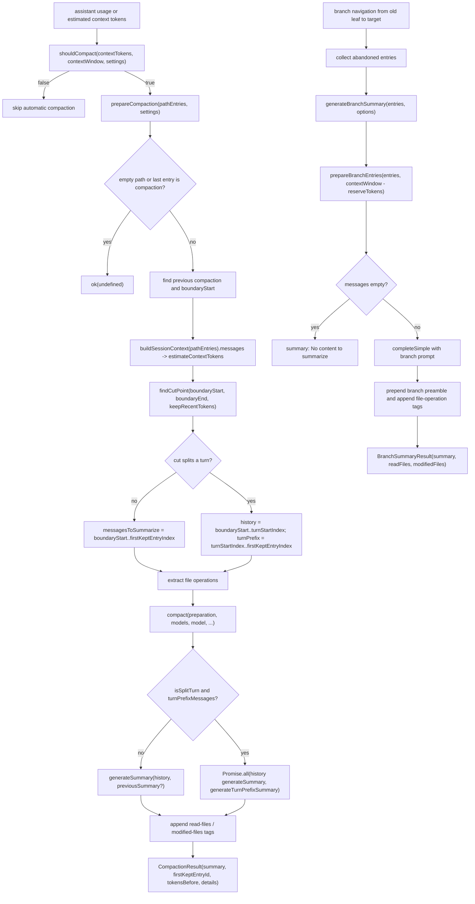

> `spine.compaction-flow` 说明 `pi-agent-core` 的 context compaction 如何从 token threshold 判定,准备 cut point,生成 checkpoint summary,以及 branch navigation 时如何生成 abandoned branch summary。

## 能回答的问题

- `shouldCompact` 的阈值公式是什么,`enabled` 如何短路 automatic compaction?
- `prepareCompaction` 如何找到 previous compaction boundary,并决定哪些 entry 被 summary 替换、哪些 entry 被保留?
- `findCutPoint` / split turn 语义怎样影响 `messagesToSummarize` 和 `turnPrefixMessages`?
- `compact` 何时更新 previous summary,何时额外生成 turn prefix summary?
- `generateBranchSummary` 和 compaction summary 共享哪些 summarization 机制,又在哪些 prompt 和返回值上不同?
- `pi-agent-core` 和产品层在触发、持久化 compaction entry / branch summary entry 上的边界在哪里?

## 端到端步骤

1. `shouldCompact(contextTokens, contextWindow, settings)` 是 automatic compaction 的纯阈值 gate:当 `settings.enabled` 为 false 时直接返回 false,否则比较 `contextTokens > contextWindow - settings.reserveTokens`。[E: packages/agent/src/harness/compaction/compaction.ts:200] [E: packages/agent/src/harness/compaction/compaction.ts:201] [E: packages/agent/src/harness/compaction/compaction.ts:202] 默认设置启用 compaction,为 summary prompt/output 保留 `16384` tokens,并倾向保留最近 `20000` tokens。[E: packages/agent/src/harness/compaction/compaction.ts:111] [E: packages/agent/src/harness/compaction/compaction.ts:112] [E: packages/agent/src/harness/compaction/compaction.ts:113] [E: packages/agent/src/harness/compaction/compaction.ts:114]

2. `prepareCompaction(pathEntries, settings)` 的源码入口只接收一条 session path 和 compaction settings,返回 `CompactionPreparation | undefined`。[E: packages/agent/src/harness/compaction/compaction.ts:545] [E: packages/agent/src/harness/compaction/compaction.ts:546] [E: packages/agent/src/harness/compaction/compaction.ts:547] [E: packages/agent/src/harness/compaction/compaction.ts:548] 函数体内未出现 `shouldCompact`,所以调用者需要先决定是否需要压缩。[I] 如果 path 为空,或最后一个 entry 已经是 `compaction`,准备阶段返回 `ok(undefined)`,避免重复在 compaction entry 后继续压缩。[E: packages/agent/src/harness/compaction/compaction.ts:549] [E: packages/agent/src/harness/compaction/compaction.ts:550]

3. `prepareCompaction` 从 path 尾部向前找最近的 `compaction` entry;找到后把它的 `summary` 作为 `previousSummary`,并把新的可压缩边界设为 previous compaction 的 `firstKeptEntryId` 所在位置,找不到该 id 时退回到 previous compaction 后一项。[E: packages/agent/src/harness/compaction/compaction.ts:554] [E: packages/agent/src/harness/compaction/compaction.ts:555] [E: packages/agent/src/harness/compaction/compaction.ts:564] [E: packages/agent/src/harness/compaction/compaction.ts:565] [E: packages/agent/src/harness/compaction/compaction.ts:566] [E: packages/agent/src/harness/compaction/compaction.ts:567] 这个设计让后续 compaction 是 iterative update,不是每次从 session 起点重新总结。[I]

4. `tokensBefore` 使用 `buildSessionContext(pathEntries).messages` 后再 `estimateContextTokens(...).tokens`,因此它估算的是这条 path 构造成 provider context 后的总量,而不是简单 entry 数或 raw transcript 字节数。[E: packages/agent/src/harness/compaction/compaction.ts:571] `estimateContextTokens` 优先复用最后一个有效 assistant usage 的 total context tokens,并把其后的 trailing messages 用本地 token heuristic 加回去;没有 usage 时才逐条估算所有 messages。[E: packages/agent/src/harness/compaction/compaction.ts:169] [E: packages/agent/src/harness/compaction/compaction.ts:170] [E: packages/agent/src/harness/compaction/compaction.ts:172] [E: packages/agent/src/harness/compaction/compaction.ts:175] [E: packages/agent/src/harness/compaction/compaction.ts:185] [E: packages/agent/src/harness/compaction/compaction.ts:187] [E: packages/agent/src/harness/compaction/compaction.ts:192]

5. `findCutPoint(entries, startIndex, endIndex, keepRecentTokens)` 先收集 valid cut points,然后从 `endIndex - 1` 反向累计 message token,达到 `keepRecentTokens` 后选择第一个不早于当前位置的 cut point。[E: packages/agent/src/harness/compaction/compaction.ts:333] [E: packages/agent/src/harness/compaction/compaction.ts:339] [E: packages/agent/src/harness/compaction/compaction.ts:347] [E: packages/agent/src/harness/compaction/compaction.ts:350] [E: packages/agent/src/harness/compaction/compaction.ts:352] [E: packages/agent/src/harness/compaction/compaction.ts:354] valid cut point 包括 user/assistant/bashExecution/custom/branchSummary/compactionSummary message,以及 `branch_summary` / `custom_message` entry;普通 `toolResult` message 不会成为 cut point。[E: packages/agent/src/harness/compaction/compaction.ts:273] [E: packages/agent/src/harness/compaction/compaction.ts:274] [E: packages/agent/src/harness/compaction/compaction.ts:275] [E: packages/agent/src/harness/compaction/compaction.ts:276] [E: packages/agent/src/harness/compaction/compaction.ts:277] [E: packages/agent/src/harness/compaction/compaction.ts:278] [E: packages/agent/src/harness/compaction/compaction.ts:281] [E: packages/agent/src/harness/compaction/compaction.ts:282] [E: packages/agent/src/harness/compaction/compaction.ts:298] [E: packages/agent/src/harness/compaction/compaction.ts:299]

6. cut point 选出后会向前吸收非 message、非 compaction 的 metadata entries,直到前一项是 `compaction` 或 `message`,以免保留段前面挂着孤立 metadata。[E: packages/agent/src/harness/compaction/compaction.ts:362] [E: packages/agent/src/harness/compaction/compaction.ts:364] [E: packages/agent/src/harness/compaction/compaction.ts:367] [E: packages/agent/src/harness/compaction/compaction.ts:370] 如果 cut entry 不是 user message,`findTurnStartIndex` 会向前找同一 turn 的 user/bashExecution/custom_message/branch_summary 起点;找到则标记 `isSplitTurn`。[E: packages/agent/src/harness/compaction/compaction.ts:307] [E: packages/agent/src/harness/compaction/compaction.ts:309] [E: packages/agent/src/harness/compaction/compaction.ts:314] [E: packages/agent/src/harness/compaction/compaction.ts:372] [E: packages/agent/src/harness/compaction/compaction.ts:373] [E: packages/agent/src/harness/compaction/compaction.ts:374] [E: packages/agent/src/harness/compaction/compaction.ts:379]

7. `prepareCompaction` 把 `firstKeptEntryId` 固定为 cut point 对应 entry id;如果该 entry 没有 id,返回 `invalid_session` 错误。[E: packages/agent/src/harness/compaction/compaction.ts:573] [E: packages/agent/src/harness/compaction/compaction.ts:574] [E: packages/agent/src/harness/compaction/compaction.ts:575] [E: packages/agent/src/harness/compaction/compaction.ts:576] [E: packages/agent/src/harness/compaction/compaction.ts:578] 非 split turn 时,`messagesToSummarize` 覆盖 `boundaryStart..firstKeptEntryIndex`;split turn 时,历史 summary 截到 `turnStartIndex`,而 `turnPrefixMessages` 单独覆盖 `turnStartIndex..firstKeptEntryIndex`。[E: packages/agent/src/harness/compaction/compaction.ts:580] [E: packages/agent/src/harness/compaction/compaction.ts:581] [E: packages/agent/src/harness/compaction/compaction.ts:582] [E: packages/agent/src/harness/compaction/compaction.ts:586] [E: packages/agent/src/harness/compaction/compaction.ts:587] [E: packages/agent/src/harness/compaction/compaction.ts:588]

8. 被 summary 覆盖的 entries 会通过 `getMessageFromEntryForCompaction` 转成 `AgentMessage`;其中历史 `compaction` entry 被跳过,而 `custom_message`、`branch_summary`、`compaction` 在普通 replay helper 中分别可还原为 custom、branch summary、compaction summary message。[E: packages/agent/src/harness/compaction/compaction.ts:81] [E: packages/agent/src/harness/compaction/compaction.ts:82] [E: packages/agent/src/harness/compaction/compaction.ts:85] [E: packages/agent/src/harness/compaction/compaction.ts:63] [E: packages/agent/src/harness/compaction/compaction.ts:72] [E: packages/agent/src/harness/compaction/compaction.ts:75] 文件操作 metadata 来自 `messagesToSummarize`,并在 split turn 时额外纳入 `turnPrefixMessages`。[E: packages/agent/src/harness/compaction/compaction.ts:593] [E: packages/agent/src/harness/compaction/compaction.ts:594] [E: packages/agent/src/harness/compaction/compaction.ts:595] [E: packages/agent/src/harness/compaction/compaction.ts:596]

9. `compact(preparation, models, model, ...)` 只消费准备好的 `CompactionPreparation`;它再次校验 `firstKeptEntryId`,然后根据 `isSplitTurn` 决定一次或两次 summarization request。[E: packages/agent/src/harness/compaction/compaction.ts:630] [E: packages/agent/src/harness/compaction/compaction.ts:638] [E: packages/agent/src/harness/compaction/compaction.ts:649] [E: packages/agent/src/harness/compaction/compaction.ts:655] split turn 且有 prefix messages 时,历史 summary 和 turn prefix summary 用 `Promise.all` 并行生成;没有 prior history 时历史 summary 用 `"No prior history."` 占位。[E: packages/agent/src/harness/compaction/compaction.ts:655] [E: packages/agent/src/harness/compaction/compaction.ts:656] [E: packages/agent/src/harness/compaction/compaction.ts:657] [E: packages/agent/src/harness/compaction/compaction.ts:668] [E: packages/agent/src/harness/compaction/compaction.ts:669]

10. split turn 的最终 summary 是 history summary、分隔线、`Turn Context (split turn)` 和 prefix summary 的拼接;普通 compaction 则只调用 `generateSummary(messagesToSummarize, ..., previousSummary, thinkingLevel)`。[E: packages/agent/src/harness/compaction/compaction.ts:671] [E: packages/agent/src/harness/compaction/compaction.ts:672] [E: packages/agent/src/harness/compaction/compaction.ts:673] [E: packages/agent/src/harness/compaction/compaction.ts:675] [E: packages/agent/src/harness/compaction/compaction.ts:682] [E: packages/agent/src/harness/compaction/compaction.ts:686] `generateSummary` 在有 `previousSummary` 时使用 update prompt,否则使用 fresh summary prompt,并可把 `customInstructions` 追加为 additional focus。[E: packages/agent/src/harness/compaction/compaction.ts:474] [E: packages/agent/src/harness/compaction/compaction.ts:475] [E: packages/agent/src/harness/compaction/compaction.ts:476]

11. `generateSummary` 和 turn prefix summary 都先把 selected `AgentMessage[]` 转成 LLM messages,序列化成 `<conversation>` 文本,再调用 `models.completeSimple`。[E: packages/agent/src/harness/compaction/compaction.ts:478] [E: packages/agent/src/harness/compaction/compaction.ts:479] [E: packages/agent/src/harness/compaction/compaction.ts:480] [E: packages/agent/src/harness/compaction/compaction.ts:499] [E: packages/agent/src/harness/compaction/compaction.ts:711] [E: packages/agent/src/harness/compaction/compaction.ts:712] [E: packages/agent/src/harness/compaction/compaction.ts:713] [E: packages/agent/src/harness/compaction/compaction.ts:722] 如果 model 支持 reasoning 且 `thinkingLevel` 不是 `"off"`,summarization options 会带上 reasoning;否则只带 `maxTokens` 和 `signal`。[E: packages/agent/src/harness/compaction/compaction.ts:494] [E: packages/agent/src/harness/compaction/compaction.ts:495] [E: packages/agent/src/harness/compaction/compaction.ts:496] [E: packages/agent/src/harness/compaction/compaction.ts:725] [E: packages/agent/src/harness/compaction/compaction.ts:726]

12. summarization response 的 `aborted` 和 `error` stopReason 会分别转换成 `CompactionError("aborted")` 或 `CompactionError("summarization_failed")`;成功时只拼接 text content blocks。[E: packages/agent/src/harness/compaction/compaction.ts:504] [E: packages/agent/src/harness/compaction/compaction.ts:507] [E: packages/agent/src/harness/compaction/compaction.ts:516] [E: packages/agent/src/harness/compaction/compaction.ts:517] [E: packages/agent/src/harness/compaction/compaction.ts:521] `compact` 最后追加 file-operation tags,并返回 `summary`、`firstKeptEntryId`、`tokensBefore`、`details.readFiles`、`details.modifiedFiles`;它不在这两个 source 文件内持久化 session entry。[E: packages/agent/src/harness/compaction/compaction.ts:689] [E: packages/agent/src/harness/compaction/compaction.ts:690] [E: packages/agent/src/harness/compaction/compaction.ts:692] [E: packages/agent/src/harness/compaction/compaction.ts:696] [I]

## 分支总结 flow

`collectEntriesForBranchSummary(session, oldLeafId, targetId)` 接收 old leaf 和 target id,返回 `{ entries, commonAncestorId }`;`generateBranchSummary(entries, options)` 接收 `SessionTreeEntry[]` 和 options,返回 `BranchSummaryResult | BranchSummaryError`。[E: packages/agent/src/harness/compaction/branch-summarization.ts:67] [E: packages/agent/src/harness/compaction/branch-summarization.ts:68] [E: packages/agent/src/harness/compaction/branch-summarization.ts:69] [E: packages/agent/src/harness/compaction/branch-summarization.ts:70] [E: packages/agent/src/harness/compaction/branch-summarization.ts:95] [E: packages/agent/src/harness/compaction/branch-summarization.ts:199] [E: packages/agent/src/harness/compaction/branch-summarization.ts:200] [E: packages/agent/src/harness/compaction/branch-summarization.ts:201] [E: packages/agent/src/harness/compaction/branch-summarization.ts:202] `collectEntriesForBranchSummary` 先求 old leaf path 与 target path 的 deepest common ancestor,再从 old leaf 往父链回收到 common ancestor 前并 reverse 成时间顺序。[E: packages/agent/src/harness/compaction/branch-summarization.ts:75] [E: packages/agent/src/harness/compaction/branch-summarization.ts:76] [E: packages/agent/src/harness/compaction/branch-summarization.ts:78] [E: packages/agent/src/harness/compaction/branch-summarization.ts:87] [E: packages/agent/src/harness/compaction/branch-summarization.ts:91] [E: packages/agent/src/harness/compaction/branch-summarization.ts:93]

`generateBranchSummary` 的 token budget 是 `model.contextWindow || 128000` 减去 `reserveTokens`,其中 `reserveTokens` 参数默认 `16384`;随后交给 `prepareBranchEntries` 从 entries 尾部向前选择可放入 summary prompt 的 messages。[E: packages/agent/src/harness/compaction/branch-summarization.ts:203] [E: packages/agent/src/harness/compaction/branch-summarization.ts:204] [E: packages/agent/src/harness/compaction/branch-summarization.ts:205] [E: packages/agent/src/harness/compaction/branch-summarization.ts:207] [E: packages/agent/src/harness/compaction/branch-summarization.ts:140] [E: packages/agent/src/harness/compaction/branch-summarization.ts:157] `prepareBranchEntries` 会跳过 toolResult message,保留 custom_message、branch_summary、compaction 等可 replay 成 message 的 entries,并在超预算时允许 compaction/branch_summary 这类摘要 entry 在 `totalTokens < tokenBudget * 0.9` 时仍进入 prompt。[E: packages/agent/src/harness/compaction/branch-summarization.ts:97] [E: packages/agent/src/harness/compaction/branch-summarization.ts:99] [E: packages/agent/src/harness/compaction/branch-summarization.ts:100] [E: packages/agent/src/harness/compaction/branch-summarization.ts:103] [E: packages/agent/src/harness/compaction/branch-summarization.ts:106] [E: packages/agent/src/harness/compaction/branch-summarization.ts:109] [E: packages/agent/src/harness/compaction/branch-summarization.ts:147] [E: packages/agent/src/harness/compaction/branch-summarization.ts:148] [E: packages/agent/src/harness/compaction/branch-summarization.ts:149]

如果 branch preparation 没有选出 messages,`generateBranchSummary` 返回 `"No content to summarize"` 和空 file lists,不发 LLM 请求。[E: packages/agent/src/harness/compaction/branch-summarization.ts:209] [E: packages/agent/src/harness/compaction/branch-summarization.ts:210] 否则它构造 branch-specific prompt,支持 `replaceInstructions` 完全替换默认 prompt,或把 `customInstructions` 追加为 additional focus。[E: packages/agent/src/harness/compaction/branch-summarization.ts:214] [E: packages/agent/src/harness/compaction/branch-summarization.ts:215] [E: packages/agent/src/harness/compaction/branch-summarization.ts:217] [E: packages/agent/src/harness/compaction/branch-summarization.ts:220] [E: packages/agent/src/harness/compaction/branch-summarization.ts:222]

branch summarization 使用与 compaction 相同的 `SUMMARIZATION_SYSTEM_PROMPT`,但它的 output maxTokens 固定为 `2048`,且成功后会在模型文本前加上 branch preamble,再追加 file-operation tags。[E: packages/agent/src/harness/compaction/branch-summarization.ts:231] [E: packages/agent/src/harness/compaction/branch-summarization.ts:233] [E: packages/agent/src/harness/compaction/branch-summarization.ts:234] [E: packages/agent/src/harness/compaction/branch-summarization.ts:248] [E: packages/agent/src/harness/compaction/branch-summarization.ts:252] [E: packages/agent/src/harness/compaction/branch-summarization.ts:253] [E: packages/agent/src/harness/compaction/branch-summarization.ts:254] 它把 provider `aborted` 映射为 `BranchSummaryError("aborted")`,把 provider `error` 映射为 `BranchSummaryError("summarization_failed")`,成功返回 `summary/readFiles/modifiedFiles`。[E: packages/agent/src/harness/compaction/branch-summarization.ts:236] [E: packages/agent/src/harness/compaction/branch-summarization.ts:239] [E: packages/agent/src/harness/compaction/branch-summarization.ts:256] [E: packages/agent/src/harness/compaction/branch-summarization.ts:258]

## 关键决策点

### threshold gate 和 preparation 分离

`shouldCompact` 独立实现 "当前 context tokens 是否超过阈值" 的判断;`prepareCompaction` 的入口参数是 `pathEntries` 和 `settings`,并用 `settings.keepRecentTokens` 选择 cut point。[E: packages/agent/src/harness/compaction/compaction.ts:200] [E: packages/agent/src/harness/compaction/compaction.ts:201] [E: packages/agent/src/harness/compaction/compaction.ts:202] [E: packages/agent/src/harness/compaction/compaction.ts:545] [E: packages/agent/src/harness/compaction/compaction.ts:546] [E: packages/agent/src/harness/compaction/compaction.ts:547] [E: packages/agent/src/harness/compaction/compaction.ts:573] 因此 automatic compaction 需要在调用 `prepareCompaction` 前额外做 threshold gate;源码中未看到 `prepareCompaction` 读取 model context window 或调用 `shouldCompact`。[I]

### previous summary 是迭代输入

previous compaction entry 的 `summary` 会进入下一次 `generateSummary` 的 `<previous-summary>` 区块,并把 prompt 从 fresh summary 切换为 update summary。[E: packages/agent/src/harness/compaction/compaction.ts:565] [E: packages/agent/src/harness/compaction/compaction.ts:467] [E: packages/agent/src/harness/compaction/compaction.ts:481] [E: packages/agent/src/harness/compaction/compaction.ts:482] [E: packages/agent/src/harness/compaction/compaction.ts:474] 这意味着 compaction entry 不只是历史标记,还是下一轮 summary 的状态输入。[I]

### split turn 保留 suffix,压缩 prefix

当 cut point 落在一个 turn 中间时,`prepareCompaction` 把 turn start 到 cut point 之前的 prefix 单独准备出来,而 cut point 之后的 suffix 仍由 `firstKeptEntryId` 开始保留。[E: packages/agent/src/harness/compaction/compaction.ts:580] [E: packages/agent/src/harness/compaction/compaction.ts:586] [E: packages/agent/src/harness/compaction/compaction.ts:588] [E: packages/agent/src/harness/compaction/compaction.ts:601] `compact` 的 split-turn summary 明确标注 `Turn Context (split turn)`,让保留 suffix 的上下文能读到同一 turn 早期发生了什么。[E: packages/agent/src/harness/compaction/compaction.ts:673]

### branch summary 不是 compaction summary

branch summary 面向 "离开某个 branch 后未来返回" 的上下文恢复,其 prompt 要求描述 explored branch 的 goal、progress、decisions、next steps;compaction summary 面向 "继续当前工作但替换旧 history" 的 checkpoint,额外要求 critical context。[E: packages/agent/src/harness/compaction/branch-summarization.ts:164] [E: packages/agent/src/harness/compaction/branch-summarization.ts:169] [E: packages/agent/src/harness/compaction/branch-summarization.ts:173] [E: packages/agent/src/harness/compaction/branch-summarization.ts:180] [E: packages/agent/src/harness/compaction/branch-summarization.ts:190] [E: packages/agent/src/harness/compaction/branch-summarization.ts:193] [E: packages/agent/src/harness/compaction/compaction.ts:387] [E: packages/agent/src/harness/compaction/compaction.ts:411] [E: packages/agent/src/harness/compaction/compaction.ts:414] 两者共享 system prompt、message conversion 和 conversation serialization,但返回的 error type、preamble、maxTokens 和 result shape 不同。[E: packages/agent/src/harness/compaction/branch-summarization.ts:11] [E: packages/agent/src/harness/compaction/branch-summarization.ts:12] [E: packages/agent/src/harness/compaction/branch-summarization.ts:212] [E: packages/agent/src/harness/compaction/branch-summarization.ts:213] [E: packages/agent/src/harness/compaction/branch-summarization.ts:233] [E: packages/agent/src/harness/compaction/branch-summarization.ts:234] [E: packages/agent/src/harness/compaction/compaction.ts:478] [E: packages/agent/src/harness/compaction/compaction.ts:479] [E: packages/agent/src/harness/compaction/compaction.ts:470] [E: packages/agent/src/harness/compaction/compaction.ts:501] [E: packages/agent/src/harness/compaction/compaction.ts:692]

## 包边界

这两个 source 文件提供 compaction 和 branch-summary 的 harness 函数:`prepareCompaction` 接收 `SessionTreeEntry[]` 与 settings 并返回 `Result<CompactionPreparation | undefined, CompactionError>`,`compact` 接收 preparation、`Models`、`Model`、optional instructions/signal/thinking level 并返回 `Result<CompactionResult, CompactionError>`,`generateBranchSummary` 接收 `SessionTreeEntry[]` 与 options 并返回 `Result<BranchSummaryResult, BranchSummaryError>`。[E: packages/agent/src/harness/compaction/compaction.ts:545] [E: packages/agent/src/harness/compaction/compaction.ts:546] [E: packages/agent/src/harness/compaction/compaction.ts:547] [E: packages/agent/src/harness/compaction/compaction.ts:548] [E: packages/agent/src/harness/compaction/compaction.ts:630] [E: packages/agent/src/harness/compaction/compaction.ts:631] [E: packages/agent/src/harness/compaction/compaction.ts:632] [E: packages/agent/src/harness/compaction/compaction.ts:633] [E: packages/agent/src/harness/compaction/compaction.ts:634] [E: packages/agent/src/harness/compaction/compaction.ts:635] [E: packages/agent/src/harness/compaction/compaction.ts:636] [E: packages/agent/src/harness/compaction/branch-summarization.ts:199] [E: packages/agent/src/harness/compaction/branch-summarization.ts:200] [E: packages/agent/src/harness/compaction/branch-summarization.ts:201] [E: packages/agent/src/harness/compaction/branch-summarization.ts:202] `pi-coding-agent` 产品层应负责何时调用 `shouldCompact`、如何把 `CompactionResult` 写成 `compaction` entry、以及 branch navigation 何时持久化 `BranchSummaryResult`;这些持久化调用不在本节点两个 source 文件内出现。[I]

## 指向 T1/T2 深挖

- `subsys.agent-core.compaction` 应展开 `CompactionSettings`、`CompactionPreparation`、`CompactionResult`、cut point 选择和 split turn edge cases。
- `subsys.agent-core.branch-summary` 应展开 branch collection、common ancestor、branch summary entry 的持久化路径。
- `ref.agent.compaction-config` 应枚举 `enabled`、`reserveTokens`、`keepRecentTokens`、custom instructions、thinking level 等配置和默认值。

## Sources

- packages/agent/src/harness/compaction/compaction.ts
- packages/agent/src/harness/compaction/branch-summarization.ts

## 相关

- subsys.agent-core.compaction
- subsys.agent-core.branch-summary
- ref.agent.compaction-config
