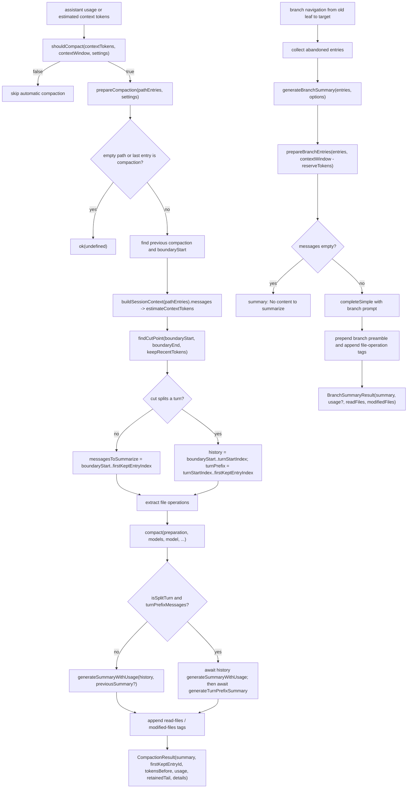

> `spine.compaction-flow` 说明 `pi-agent-core` 的 context compaction 如何从 token threshold 判定,准备 cut point,生成 checkpoint summary,以及 branch navigation 时如何生成 abandoned branch summary。

```mermaid
flowchart TD
  Usage["assistant usage or estimated context tokens"] --> Gate["shouldCompact(contextTokens, contextWindow, settings)"]
  Gate -->|false| Noop["skip automatic compaction"]
  Gate -->|true| Prep["prepareCompaction(pathEntries, settings)"]
  Prep --> Empty{"empty path or last entry is compaction?"}
  Empty -->|yes| NoPrep["ok(undefined)"]
  Empty -->|no| Prev["find previous compaction and boundaryStart"]
  Prev --> Estimate["buildSessionContext(pathEntries).messages -> estimateContextTokens"]
  Estimate --> Cut["findCutPoint(boundaryStart, boundaryEnd, keepRecentTokens)"]
  Cut --> Split{"cut splits a turn?"}
  Split -->|no| Hist["messagesToSummarize = boundaryStart..firstKeptEntryIndex"]
  Split -->|yes| HistSplit["history = boundaryStart..turnStartIndex; turnPrefix = turnStartIndex..firstKeptEntryIndex"]
  Hist --> Ops["extract file operations"]
  HistSplit --> Ops
  Ops --> Compact["compact(preparation, models, model, ...)"]
  Compact --> SplitRun{"isSplitTurn and turnPrefixMessages?"}
  SplitRun -->|no| Gen["generateSummaryWithUsage(history, previousSummary?)"]
  SplitRun -->|yes| Dual["await history generateSummaryWithUsage; then await generateTurnPrefixSummary"]
  Gen --> Files["append read-files / modified-files tags"]
  Dual --> Files
  Files --> Result["CompactionResult(summary, firstKeptEntryId, tokensBefore, usage, retainedTail, details)"]

  BranchNav["branch navigation from old leaf to target"] --> Collect["collect abandoned entries"]
  Collect --> BranchGen["generateBranchSummary(entries, options)"]
  BranchGen --> BranchPrep["prepareBranchEntries(entries, contextWindow - reserveTokens)"]
  BranchPrep --> BranchEmpty{"messages empty?"}
  BranchEmpty -->|yes| BranchNoop["summary: No content to summarize"]
  BranchEmpty -->|no| BranchLLM["completeSimple with branch prompt"]
  BranchLLM --> BranchFiles["prepend branch preamble and append file-operation tags"]
  BranchFiles --> BranchResult["BranchSummaryResult(summary, usage?, readFiles, modifiedFiles)"]
```

## 能回答的问题

- `shouldCompact` 的阈值公式是什么,`enabled` 如何短路 automatic compaction?
- `prepareCompaction` 如何找到 previous compaction boundary,并决定哪些 entry 被 summary 替换、哪些 entry 被保留?
- `findCutPoint` / split turn 语义怎样影响 `messagesToSummarize` 和 `turnPrefixMessages`?
- `compact` 何时更新 previous summary,何时额外生成 turn prefix summary?
- `generateBranchSummary` 和 compaction summary 共享哪些 summarization 机制,又在哪些 prompt 和返回值上不同?
- `pi-agent-core` 和产品层在触发、持久化 compaction entry / branch summary entry 上的边界在哪里?

## 端到端步骤

1. `shouldCompact(contextTokens, contextWindow, settings)` 是 automatic compaction 的纯阈值 gate:当 `settings.enabled` 为 false 时直接返回 false,否则比较 `contextTokens > contextWindow - settings.reserveTokens`。[E: packages/agent/src/harness/compaction/compaction.ts:263] [E: packages/agent/src/harness/compaction/compaction.ts:264] [E: packages/agent/src/harness/compaction/compaction.ts:265] 默认设置启用 compaction,为 summary prompt/output 保留 `16384` tokens,并倾向保留最近 `20000` tokens。[E: packages/agent/src/harness/compaction/compaction.ts:174] [E: packages/agent/src/harness/compaction/compaction.ts:175] [E: packages/agent/src/harness/compaction/compaction.ts:176] [E: packages/agent/src/harness/compaction/compaction.ts:177]

2. `prepareCompaction(pathEntries, settings)` 的源码入口只接收一条 session path 和 compaction settings,返回 `Result<CompactionPreparation | undefined, CompactionError>`。[E: packages/agent/src/harness/compaction/compaction.ts:640] [E: packages/agent/src/harness/compaction/compaction.ts:641] [E: packages/agent/src/harness/compaction/compaction.ts:642] [E: packages/agent/src/harness/compaction/compaction.ts:643] 函数体内未出现 `shouldCompact`,所以调用者需要先决定是否需要压缩。[I] 如果 path 为空,或最后一个 entry 已经是 `compaction`,准备阶段返回 `ok(undefined)`,避免重复在 compaction entry 后继续压缩。[E: packages/agent/src/harness/compaction/compaction.ts:644] [E: packages/agent/src/harness/compaction/compaction.ts:645]

3. `prepareCompaction` 从 path 尾部向前找最近的 `compaction` entry;找到后把它的 `summary` 作为 `previousSummary`,并把新的可压缩边界设为 previous compaction 的 `firstKeptEntryId` 所在位置,找不到该 id 时退回到 previous compaction 后一项。[E: packages/agent/src/harness/compaction/compaction.ts:649] [E: packages/agent/src/harness/compaction/compaction.ts:650] [E: packages/agent/src/harness/compaction/compaction.ts:659] [E: packages/agent/src/harness/compaction/compaction.ts:660] [E: packages/agent/src/harness/compaction/compaction.ts:662] [E: packages/agent/src/harness/compaction/compaction.ts:664] 这个设计让后续 compaction 是 iterative update,不是每次从 session 起点重新总结。[I]

4. `tokensBefore` 使用 `buildSessionContext(pathEntries).messages` 后再 `estimateContextTokens(...).tokens`,因此它估算的是这条 path 构造成 provider context 后的总量,而不是简单 entry 数或 raw transcript 字节数。[E: packages/agent/src/harness/compaction/compaction.ts:668] `estimateContextTokens` 优先复用最后一个有效 assistant usage 的 total context tokens,并把其后的 trailing messages 用本地 token heuristic 加回去;没有 usage 时才逐条估算所有 messages。[E: packages/agent/src/harness/compaction/compaction.ts:232] [E: packages/agent/src/harness/compaction/compaction.ts:233] [E: packages/agent/src/harness/compaction/compaction.ts:235] [E: packages/agent/src/harness/compaction/compaction.ts:238] [E: packages/agent/src/harness/compaction/compaction.ts:248] [E: packages/agent/src/harness/compaction/compaction.ts:250] [E: packages/agent/src/harness/compaction/compaction.ts:255]

5. `findCutPoint(entries, startIndex, endIndex, keepRecentTokens)` 先收集 valid cut points,然后从 `endIndex - 1` 反向累计 message token,达到 `keepRecentTokens` 后选择第一个不早于当前位置的 cut point。[E: packages/agent/src/harness/compaction/compaction.ts:396] [E: packages/agent/src/harness/compaction/compaction.ts:402] [E: packages/agent/src/harness/compaction/compaction.ts:410] [E: packages/agent/src/harness/compaction/compaction.ts:413] [E: packages/agent/src/harness/compaction/compaction.ts:415] [E: packages/agent/src/harness/compaction/compaction.ts:417] valid cut point 包括 user/assistant/bashExecution/custom/branchSummary/compactionSummary message,以及 `branch_summary` / `custom_message` entry;普通 `toolResult` message 不会成为 cut point。[E: packages/agent/src/harness/compaction/compaction.ts:336] [E: packages/agent/src/harness/compaction/compaction.ts:337] [E: packages/agent/src/harness/compaction/compaction.ts:338] [E: packages/agent/src/harness/compaction/compaction.ts:339] [E: packages/agent/src/harness/compaction/compaction.ts:340] [E: packages/agent/src/harness/compaction/compaction.ts:341] [E: packages/agent/src/harness/compaction/compaction.ts:344] [E: packages/agent/src/harness/compaction/compaction.ts:345] [E: packages/agent/src/harness/compaction/compaction.ts:361] [E: packages/agent/src/harness/compaction/compaction.ts:362]

6. cut point 选出后会向前吸收非 message、非 compaction 的 metadata entries,直到前一项是 `compaction` 或 `message`,以免保留段前面挂着孤立 metadata。[E: packages/agent/src/harness/compaction/compaction.ts:425] [E: packages/agent/src/harness/compaction/compaction.ts:427] [E: packages/agent/src/harness/compaction/compaction.ts:430] [E: packages/agent/src/harness/compaction/compaction.ts:433] 如果 cut entry 不是 user message,`findTurnStartIndex` 会向前找同一 turn 的 user/bashExecution/custom_message/branch_summary 起点;找到则标记 `isSplitTurn`。[E: packages/agent/src/harness/compaction/compaction.ts:370] [E: packages/agent/src/harness/compaction/compaction.ts:372] [E: packages/agent/src/harness/compaction/compaction.ts:377] [E: packages/agent/src/harness/compaction/compaction.ts:435] [E: packages/agent/src/harness/compaction/compaction.ts:436] [E: packages/agent/src/harness/compaction/compaction.ts:437] [E: packages/agent/src/harness/compaction/compaction.ts:442]

7. `prepareCompaction` 把 `firstKeptEntryId` 固定为 cut point 对应 entry id;如果该 entry 没有 id,返回 `invalid_session` 错误。[E: packages/agent/src/harness/compaction/compaction.ts:670] [E: packages/agent/src/harness/compaction/compaction.ts:671] [E: packages/agent/src/harness/compaction/compaction.ts:672] [E: packages/agent/src/harness/compaction/compaction.ts:673] [E: packages/agent/src/harness/compaction/compaction.ts:675] 非 split turn 时,`messagesToSummarize` 覆盖 `boundaryStart..firstKeptEntryIndex`;split turn 时,历史 summary 截到 `turnStartIndex`,而 `turnPrefixMessages` 单独覆盖 `turnStartIndex..firstKeptEntryIndex`。[E: packages/agent/src/harness/compaction/compaction.ts:677] [E: packages/agent/src/harness/compaction/compaction.ts:678] [E: packages/agent/src/harness/compaction/compaction.ts:679] [E: packages/agent/src/harness/compaction/compaction.ts:683] [E: packages/agent/src/harness/compaction/compaction.ts:684] [E: packages/agent/src/harness/compaction/compaction.ts:685]

8. 被 summary 覆盖的 entries 会通过 `getMessageFromEntryForCompaction` 转成 `AgentMessage`;其中历史 `compaction` entry 被跳过,而 `custom_message`、`branch_summary`、`compaction` 在普通 replay helper 中分别可还原为 custom、branch summary、compaction summary message。[E: packages/agent/src/harness/compaction/compaction.ts:95] [E: packages/agent/src/harness/compaction/compaction.ts:96] [E: packages/agent/src/harness/compaction/compaction.ts:99] [E: packages/agent/src/harness/compaction/compaction.ts:77] [E: packages/agent/src/harness/compaction/compaction.ts:86] [E: packages/agent/src/harness/compaction/compaction.ts:89] 文件操作 metadata 来自 `messagesToSummarize`,并在 split turn 时额外纳入 `turnPrefixMessages`。[E: packages/agent/src/harness/compaction/compaction.ts:695] [E: packages/agent/src/harness/compaction/compaction.ts:696] [E: packages/agent/src/harness/compaction/compaction.ts:697] [E: packages/agent/src/harness/compaction/compaction.ts:698]

9. `compact(preparation, models, model, ...)` 只消费准备好的 `CompactionPreparation`;它再次校验 `firstKeptEntryId`,然后根据 `isSplitTurn` 决定一次或两次 summarization request。[E: packages/agent/src/harness/compaction/compaction.ts:733] [E: packages/agent/src/harness/compaction/compaction.ts:743] [E: packages/agent/src/harness/compaction/compaction.ts:755] [E: packages/agent/src/harness/compaction/compaction.ts:762] split turn 且有 prefix messages 时，history summary 与 turn-prefix summary 顺序生成；没有 prior history 时 history side 使用 `"No prior history."` 占位 [E: packages/agent/src/harness/compaction/compaction.ts:763] [E: packages/agent/src/harness/compaction/compaction.ts:766] [E: packages/agent/src/harness/compaction/compaction.ts:782]。

10. split turn 的最终 summary 是 history summary、分隔线、`Turn Context (split turn)` 和 prefix summary 的拼接;普通 compaction 则直接调用 `generateSummaryWithUsage(messagesToSummarize, ..., previousSummary, thinkingLevel)`。[E: packages/agent/src/harness/compaction/compaction.ts:778] [E: packages/agent/src/harness/compaction/compaction.ts:792] [E: packages/agent/src/harness/compaction/compaction.ts:793] [E: packages/agent/src/harness/compaction/compaction.ts:798] [E: packages/agent/src/harness/compaction/compaction.ts:805] [E: packages/agent/src/harness/compaction/compaction.ts:811] `generateSummaryWithUsage` 在有 `previousSummary` 时使用 update prompt,否则使用 fresh summary prompt,并可把 `customInstructions` 追加为 additional focus。[E: packages/agent/src/harness/compaction/compaction.ts:567] [E: packages/agent/src/harness/compaction/compaction.ts:568] [E: packages/agent/src/harness/compaction/compaction.ts:569]

11. `generateSummaryWithUsage` 和 turn-prefix summary 都把 selected `AgentMessage[]` 序列化成 `<conversation>` 文本，再调用 `completeSimpleWithRetries`；retry policy 与 callbacks 从 harness 调用层透传 [E: packages/agent/src/harness/compaction/compaction.ts:551] [E: packages/agent/src/harness/compaction/compaction.ts:571] [E: packages/agent/src/harness/compaction/compaction.ts:592] [E: packages/agent/src/harness/compaction/compaction.ts:597] [E: packages/agent/src/harness/compaction/compaction.ts:841] [E: packages/agent/src/harness/compaction/compaction.ts:856] [E: packages/agent/src/harness/compaction/compaction.ts:861]。如果 model 支持 reasoning 且 `thinkingLevel` 不是 `"off"`,summarization options 会带上 reasoning;否则只带 `maxTokens` 和 `signal` [E: packages/agent/src/harness/compaction/compaction.ts:587] [E: packages/agent/src/harness/compaction/compaction.ts:853] [E: packages/agent/src/harness/compaction/compaction.ts:855]。

12. summarization response 的 `aborted` 和 `error` stopReason 会分别转换成 `CompactionError("aborted")` 或 `CompactionError("summarization_failed")`;成功路径保留 text 与 provider usage。[E: packages/agent/src/harness/compaction/compaction.ts:600] [E: packages/agent/src/harness/compaction/compaction.ts:603] [E: packages/agent/src/harness/compaction/compaction.ts:614] split-turn 会合并两次 usage；`compact` 最后返回 `summary`、anchor、`tokensBefore`、`usage`、`retainedTail` 与 file-operation details [E: packages/agent/src/harness/compaction/compaction.ts:794] [E: packages/agent/src/harness/compaction/compaction.ts:818] [E: packages/agent/src/harness/compaction/compaction.ts:822] [E: packages/agent/src/harness/compaction/compaction.ts:824]。

## 分支总结 flow

`collectEntriesForBranchSummary(session, oldLeafId, targetId)` 接收 old leaf 和 target id，返回 `{ entries, commonAncestorId }`；`generateBranchSummary(entries, options)` 接收 `SessionTreeEntry[]` 和 options，返回 `Promise<Result<BranchSummaryResult, BranchSummaryError>>`。[E: packages/agent/src/harness/compaction/branch-summarization.ts:71] [E: packages/agent/src/harness/compaction/branch-summarization.ts:72] [E: packages/agent/src/harness/compaction/branch-summarization.ts:73] [E: packages/agent/src/harness/compaction/branch-summarization.ts:74] [E: packages/agent/src/harness/compaction/branch-summarization.ts:99] [E: packages/agent/src/harness/compaction/branch-summarization.ts:203] [E: packages/agent/src/harness/compaction/branch-summarization.ts:204] [E: packages/agent/src/harness/compaction/branch-summarization.ts:205] [E: packages/agent/src/harness/compaction/branch-summarization.ts:206] `collectEntriesForBranchSummary` 先求 old leaf path 与 target path 的 deepest common ancestor，再从 old leaf 往父链回收到 common ancestor前并 reverse 成时间顺序。[E: packages/agent/src/harness/compaction/branch-summarization.ts:79] [E: packages/agent/src/harness/compaction/branch-summarization.ts:80] [E: packages/agent/src/harness/compaction/branch-summarization.ts:82] [E: packages/agent/src/harness/compaction/branch-summarization.ts:91] [E: packages/agent/src/harness/compaction/branch-summarization.ts:95] [E: packages/agent/src/harness/compaction/branch-summarization.ts:97]

`generateBranchSummary` 的 token budget 是 `model.contextWindow || 128000` 减去 `reserveTokens`,其中 `reserveTokens` 参数默认 `16384`;随后交给 `prepareBranchEntries` 从 entries 尾部向前选择可放入 summary prompt 的 messages。[E: packages/agent/src/harness/compaction/branch-summarization.ts:213] [E: packages/agent/src/harness/compaction/branch-summarization.ts:217] [E: packages/agent/src/harness/compaction/branch-summarization.ts:218] [E: packages/agent/src/harness/compaction/branch-summarization.ts:220] [E: packages/agent/src/harness/compaction/branch-summarization.ts:144] [E: packages/agent/src/harness/compaction/branch-summarization.ts:161] `prepareBranchEntries` 会跳过 toolResult message,保留 custom_message、branch_summary、compaction 等可 replay 成 message 的 entries,并在超预算时允许 compaction/branch_summary 这类摘要 entry 在 `totalTokens < tokenBudget * 0.9` 时仍进入 prompt。[E: packages/agent/src/harness/compaction/branch-summarization.ts:101] [E: packages/agent/src/harness/compaction/branch-summarization.ts:103] [E: packages/agent/src/harness/compaction/branch-summarization.ts:104] [E: packages/agent/src/harness/compaction/branch-summarization.ts:107] [E: packages/agent/src/harness/compaction/branch-summarization.ts:110] [E: packages/agent/src/harness/compaction/branch-summarization.ts:113] [E: packages/agent/src/harness/compaction/branch-summarization.ts:151] [E: packages/agent/src/harness/compaction/branch-summarization.ts:152] [E: packages/agent/src/harness/compaction/branch-summarization.ts:153]

如果 branch preparation 没有选出 messages,`generateBranchSummary` 返回 `"No content to summarize"` 和空 file lists,不发 LLM 请求。[E: packages/agent/src/harness/compaction/branch-summarization.ts:222] [E: packages/agent/src/harness/compaction/branch-summarization.ts:223] 否则它构造 branch-specific prompt,支持 `replaceInstructions` 完全替换默认 prompt,或把 `customInstructions` 追加为 additional focus。[E: packages/agent/src/harness/compaction/branch-summarization.ts:227] [E: packages/agent/src/harness/compaction/branch-summarization.ts:228] [E: packages/agent/src/harness/compaction/branch-summarization.ts:230] [E: packages/agent/src/harness/compaction/branch-summarization.ts:233] [E: packages/agent/src/harness/compaction/branch-summarization.ts:235]

branch summarization 使用与 compaction 相同的 `SUMMARIZATION_SYSTEM_PROMPT`,但它的 output maxTokens 固定为 `2048`,且成功后会在模型文本前加上 branch preamble,再追加 file-operation tags。[E: packages/agent/src/harness/compaction/branch-summarization.ts:244] [E: packages/agent/src/harness/compaction/branch-summarization.ts:247] [E: packages/agent/src/harness/compaction/branch-summarization.ts:248] [E: packages/agent/src/harness/compaction/branch-summarization.ts:264] [E: packages/agent/src/harness/compaction/branch-summarization.ts:265] [E: packages/agent/src/harness/compaction/branch-summarization.ts:266] [E: packages/agent/src/harness/compaction/branch-summarization.ts:267] 它把 provider `aborted` 映射为 `BranchSummaryError("aborted")`,把 provider `error` 映射为 `BranchSummaryError("summarization_failed")`;有 LLM response 的成功路径返回 `summary/usage/readFiles/modifiedFiles`,无可总结消息的 fast path 则省略可选 `usage`。[E: packages/agent/src/harness/compaction/branch-summarization.ts:222] [E: packages/agent/src/harness/compaction/branch-summarization.ts:223] [E: packages/agent/src/harness/compaction/branch-summarization.ts:252] [E: packages/agent/src/harness/compaction/branch-summarization.ts:255] [E: packages/agent/src/harness/compaction/branch-summarization.ts:269] [E: packages/agent/src/harness/compaction/branch-summarization.ts:271] [E: packages/agent/src/harness/compaction/branch-summarization.ts:273]

## 关键决策点

### threshold gate 和 preparation 分离

`shouldCompact` 独立实现 "当前 context tokens 是否超过阈值" 的判断;`prepareCompaction` 的入口参数是 `pathEntries` 和 `settings`,并用 `settings.keepRecentTokens` 选择 cut point。[E: packages/agent/src/harness/compaction/compaction.ts:263] [E: packages/agent/src/harness/compaction/compaction.ts:264] [E: packages/agent/src/harness/compaction/compaction.ts:265] [E: packages/agent/src/harness/compaction/compaction.ts:640] [E: packages/agent/src/harness/compaction/compaction.ts:641] [E: packages/agent/src/harness/compaction/compaction.ts:642] [E: packages/agent/src/harness/compaction/compaction.ts:670] 因此 automatic compaction 需要在调用 `prepareCompaction` 前额外做 threshold gate;源码中未看到 `prepareCompaction` 读取 model context window 或调用 `shouldCompact`。[I]

### previous summary 是迭代输入

previous compaction entry 的 `summary` 会进入下一次 `generateSummaryWithUsage` 的 `<previous-summary>` 区块,并把 prompt 从 fresh summary 切换为 update summary。[E: packages/agent/src/harness/compaction/compaction.ts:660] [E: packages/agent/src/harness/compaction/compaction.ts:558] [E: packages/agent/src/harness/compaction/compaction.ts:574] [E: packages/agent/src/harness/compaction/compaction.ts:575] [E: packages/agent/src/harness/compaction/compaction.ts:567] 这意味着 compaction entry 不只是历史标记,还是下一轮 summary 的状态输入。[I]

### split turn 保留 suffix,压缩 prefix

当 cut point 落在一个 turn 中间时,`prepareCompaction` 把 turn start 到 cut point 之前的 prefix 单独准备出来,而 cut point 之后的 suffix 仍由 `firstKeptEntryId` 开始保留。[E: packages/agent/src/harness/compaction/compaction.ts:677] [E: packages/agent/src/harness/compaction/compaction.ts:683] [E: packages/agent/src/harness/compaction/compaction.ts:685] [E: packages/agent/src/harness/compaction/compaction.ts:703] `compact` 的 split-turn summary 明确标注 `Turn Context (split turn)`,让保留 suffix 的上下文能读到同一 turn 早期发生了什么。[E: packages/agent/src/harness/compaction/compaction.ts:793]

### branch summary 不是 compaction summary

branch summary 面向 "离开某个 branch 后未来返回" 的上下文恢复,其 prompt 要求描述 explored branch 的 goal、progress、decisions、next steps;compaction summary 面向 "继续当前工作但替换旧 history" 的 checkpoint,额外要求 critical context。[E: packages/agent/src/harness/compaction/branch-summarization.ts:168] [E: packages/agent/src/harness/compaction/branch-summarization.ts:173] [E: packages/agent/src/harness/compaction/branch-summarization.ts:177] [E: packages/agent/src/harness/compaction/branch-summarization.ts:184] [E: packages/agent/src/harness/compaction/branch-summarization.ts:194] [E: packages/agent/src/harness/compaction/branch-summarization.ts:197] [E: packages/agent/src/harness/compaction/compaction.ts:450] [E: packages/agent/src/harness/compaction/compaction.ts:474] [E: packages/agent/src/harness/compaction/compaction.ts:477] 两者共享 system prompt、message conversion 和 conversation serialization,但返回的 error type、preamble、maxTokens 和 result shape 不同。[E: packages/agent/src/harness/compaction/branch-summarization.ts:11] [E: packages/agent/src/harness/compaction/branch-summarization.ts:12] [E: packages/agent/src/harness/compaction/branch-summarization.ts:225] [E: packages/agent/src/harness/compaction/branch-summarization.ts:226] [E: packages/agent/src/harness/compaction/branch-summarization.ts:247] [E: packages/agent/src/harness/compaction/branch-summarization.ts:248] [E: packages/agent/src/harness/compaction/compaction.ts:571] [E: packages/agent/src/harness/compaction/compaction.ts:572] [E: packages/agent/src/harness/compaction/compaction.ts:563] [E: packages/agent/src/harness/compaction/compaction.ts:859] [E: packages/agent/src/harness/compaction/compaction.ts:818]

## 包边界

这两个 source 文件提供 compaction 和 branch-summary 的 harness 函数:`prepareCompaction` 接收 `SessionTreeEntry[]` 与 settings 并返回 `Result<CompactionPreparation | undefined, CompactionError>`,`compact` 接收 preparation、`Models`、`Model`、optional instructions/signal/thinking level 并返回 `Result<CompactionResult, CompactionError>`,`generateBranchSummary` 接收 `SessionTreeEntry[]` 与 options 并返回 `Result<BranchSummaryResult, BranchSummaryError>`。[E: packages/agent/src/harness/compaction/compaction.ts:640] [E: packages/agent/src/harness/compaction/compaction.ts:641] [E: packages/agent/src/harness/compaction/compaction.ts:642] [E: packages/agent/src/harness/compaction/compaction.ts:643] [E: packages/agent/src/harness/compaction/compaction.ts:733] [E: packages/agent/src/harness/compaction/compaction.ts:734] [E: packages/agent/src/harness/compaction/compaction.ts:735] [E: packages/agent/src/harness/compaction/compaction.ts:736] [E: packages/agent/src/harness/compaction/compaction.ts:737] [E: packages/agent/src/harness/compaction/compaction.ts:738] [E: packages/agent/src/harness/compaction/compaction.ts:739] [E: packages/agent/src/harness/compaction/branch-summarization.ts:203] [E: packages/agent/src/harness/compaction/branch-summarization.ts:204] [E: packages/agent/src/harness/compaction/branch-summarization.ts:205] [E: packages/agent/src/harness/compaction/branch-summarization.ts:206] `pi-coding-agent` 产品层应负责何时调用 `shouldCompact`、如何把 `CompactionResult` 写成 `compaction` entry、以及 branch navigation 何时持久化 `BranchSummaryResult`;这些持久化调用不在本节点两个 source 文件内出现。[I]

## 指向 T1/T2 深挖

- `subsys.agent-core.compaction` 应展开 `CompactionSettings`、`CompactionPreparation`、`CompactionResult`、cut point 选择和 split turn edge cases。
- `subsys.agent-core.branch-summary` 应展开 branch collection、common ancestor、branch summary entry 的持久化路径。
- `ref.agent.compaction-config` 应枚举 `enabled`、`reserveTokens`、`keepRecentTokens`、custom instructions、thinking level 等配置和默认值。

## Sources

- packages/agent/src/harness/compaction/compaction.ts
- packages/agent/src/harness/compaction/branch-summarization.ts

## 相关

- subsys.agent-core.compaction
- subsys.agent-core.branch-summary
- ref.agent.compaction-config
- [subsys.coding-agent.usage-accounting](../subsystems/coding-agent/usage-accounting.md)
