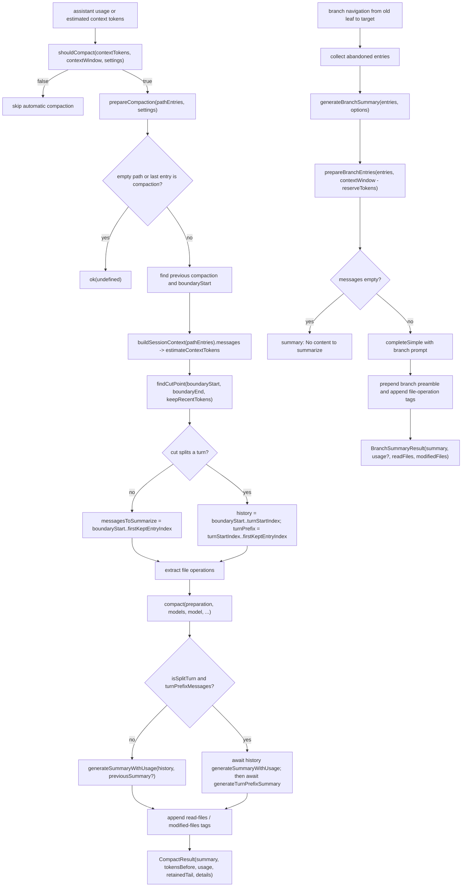

> `spine.compaction-flow` 说明 `pi-agent-core` 的 context compaction 如何从 token threshold 判定,准备 cut point,生成 checkpoint summary,以及 branch navigation 时如何生成 abandoned branch summary。

```mermaid
flowchart TD
  Usage["assistant usage or estimated context tokens"] --> Gate["shouldCompact(contextTokens, contextWindow, settings)"]
  Gate -->|false| Noop["skip automatic compaction"]
  Gate -->|true| Prep["prepareCompaction(pathEntries, settings)"]
  Prep --> Empty{"empty path or last entry is compaction?"}
  Empty -->|yes| NoPrep["ok(undefined)"]
  Empty -->|no| Prev["find previous compaction and boundaryStart"]
  Prev --> Estimate["buildSessionContext(pathEntries).messages -> estimateContextTokens"]
  Estimate --> Cut["findCutPoint(boundaryStart, boundaryEnd, keepRecentTokens)"]
  Cut --> Split{"cut splits a turn?"}
  Split -->|no| Hist["messagesToSummarize = boundaryStart..firstKeptEntryIndex"]
  Split -->|yes| HistSplit["history = boundaryStart..turnStartIndex; turnPrefix = turnStartIndex..firstKeptEntryIndex"]
  Hist --> Ops["extract file operations"]
  HistSplit --> Ops
  Ops --> Compact["compact(preparation, models, model, ...)"]
  Compact --> SplitRun{"isSplitTurn and turnPrefixMessages?"}
  SplitRun -->|no| Gen["generateSummaryWithUsage(history, previousSummary?)"]
  SplitRun -->|yes| Dual["await history generateSummaryWithUsage; then await generateTurnPrefixSummary"]
  Gen --> Files["append read-files / modified-files tags"]
  Dual --> Files
  Files --> Result["CompactResult(summary, tokensBefore, usage, retainedTail, details)"]

  BranchNav["branch navigation from old leaf to target"] --> Collect["collect abandoned entries"]
  Collect --> BranchGen["generateBranchSummary(entries, options)"]
  BranchGen --> BranchPrep["prepareBranchEntries(entries, contextWindow - reserveTokens)"]
  BranchPrep --> BranchEmpty{"messages empty?"}
  BranchEmpty -->|yes| BranchNoop["summary: No content to summarize"]
  BranchEmpty -->|no| BranchLLM["completeSimple with branch prompt"]
  BranchLLM --> BranchFiles["prepend branch preamble and append file-operation tags"]
  BranchFiles --> BranchResult["BranchSummaryResult(summary, usage?, readFiles, modifiedFiles)"]
```

## 能回答的问题

- `shouldCompact` 的阈值公式是什么,`enabled` 如何短路 automatic compaction?
- `prepareCompaction` 如何找到 previous compaction boundary,并决定哪些 entry 被 summary 替换、哪些 entry 被保留?
- `findCutPoint` / split turn 语义怎样影响 `messagesToSummarize` 和 `turnPrefixMessages`?
- `compact` 何时更新 previous summary,何时额外生成 turn prefix summary?
- `generateBranchSummary` 和 compaction summary 共享哪些 summarization 机制,又在哪些 prompt 和返回值上不同?
- `pi-agent-core` 和产品层在触发、持久化 compaction entry / branch summary entry 上的边界在哪里?

## 端到端步骤

1. `shouldCompact(contextTokens, contextWindow, settings)` 是 automatic compaction 的纯阈值 gate:当 `settings.enabled` 为 false 时直接返回 false,否则比较 `contextTokens > contextWindow - settings.reserveTokens`。[E: packages/agent/src/harness/compaction/compaction.ts:246] [E: packages/agent/src/harness/compaction/compaction.ts:247] [E: packages/agent/src/harness/compaction/compaction.ts:248] 默认设置启用 compaction,为 summary prompt/output 保留 `16384` tokens,并倾向保留最近 `20000` tokens。[E: packages/agent/src/harness/compaction/compaction.ts:157] [E: packages/agent/src/harness/compaction/compaction.ts:158] [E: packages/agent/src/harness/compaction/compaction.ts:159] [E: packages/agent/src/harness/compaction/compaction.ts:160]

2. `prepareCompaction(pathEntries, settings)` 的源码入口只接收一条 session path 和 compaction settings,返回 `Result<CompactionPreparation | undefined, CompactionError>`。[E: packages/agent/src/harness/compaction/compaction.ts:634] [E: packages/agent/src/harness/compaction/compaction.ts:659] [E: packages/agent/src/harness/compaction/compaction.ts:636] [E: packages/agent/src/harness/compaction/compaction.ts:637] 函数体内未出现 `shouldCompact`,所以调用者需要先决定是否需要压缩。[I] 如果 path 为空,或最后一个 entry 已经是 `compaction`,准备阶段返回 `ok(undefined)`,避免重复在 compaction entry 后继续压缩。[E: packages/agent/src/harness/compaction/compaction.ts:638] [E: packages/agent/src/harness/compaction/compaction.ts:639]

3. `prepareCompaction` 从 path 尾部向前找最近的 `compaction` entry;找到后把它的 `summary` 作为 `previousSummary`,并用 `prevCompaction.retainedTail` 生成 virtual message entries,再拼上该 compaction 之后的 path entries 作为 `compactableEntries`。[E: packages/agent/src/harness/compaction/compaction.ts:642] [E: packages/agent/src/harness/compaction/compaction.ts:652] [E: packages/agent/src/harness/compaction/compaction.ts:654] [E: packages/agent/src/harness/compaction/compaction.ts:655] [E: packages/agent/src/harness/compaction/compaction.ts:663] 不再按 `firstKeptEntryId` 回查原 path。这个设计让后续 compaction 是 iterative update,不是每次从 session 起点重新总结。[I]

4. `tokensBefore` 使用 `buildSessionContext(pathEntries).messages` 后再 `estimateContextTokens(...).tokens`,因此它估算的是这条 path 构造成 provider context 后的总量,而不是简单 entry 数或 raw transcript 字节数。[E: packages/agent/src/harness/compaction/compaction.ts:667] `estimateContextTokens` 优先复用最后一个有效 assistant usage 的 total context tokens,并把其后的 trailing messages 用本地 token heuristic 加回去;没有 usage 时才逐条估算所有 messages。[E: packages/agent/src/harness/compaction/compaction.ts:215] [E: packages/agent/src/harness/compaction/compaction.ts:216] [E: packages/agent/src/harness/compaction/compaction.ts:218] [E: packages/agent/src/harness/compaction/compaction.ts:221] [E: packages/agent/src/harness/compaction/compaction.ts:231] [E: packages/agent/src/harness/compaction/compaction.ts:233] [E: packages/agent/src/harness/compaction/compaction.ts:238]

5. `findCutPoint(entries, startIndex, endIndex, keepRecentTokens)` 先收集 valid cut points,然后从 `endIndex - 1` 反向累计 message token,达到 `keepRecentTokens` 后选择第一个不早于当前位置的 cut point。[E: packages/agent/src/harness/compaction/compaction.ts:370] [E: packages/agent/src/harness/compaction/compaction.ts:376] [E: packages/agent/src/harness/compaction/compaction.ts:384] [E: packages/agent/src/harness/compaction/compaction.ts:387] [E: packages/agent/src/harness/compaction/compaction.ts:389] [E: packages/agent/src/harness/compaction/compaction.ts:391] valid cut point 包括 `message` role 为 user/assistant/bashExecution/custom/branchSummary/compactionSummary 的条目,以及 `entry.type === "branch_summary"`;`entry.type === "custom"` 不会被加入 cut point;普通 `toolResult` message 也不会。[E: packages/agent/src/harness/compaction/compaction.ts:319] [E: packages/agent/src/harness/compaction/compaction.ts:320] [E: packages/agent/src/harness/compaction/compaction.ts:321] [E: packages/agent/src/harness/compaction/compaction.ts:322] [E: packages/agent/src/harness/compaction/compaction.ts:323] [E: packages/agent/src/harness/compaction/compaction.ts:324] [E: packages/agent/src/harness/compaction/compaction.ts:327] [E: packages/agent/src/harness/compaction/compaction.ts:334] [E: packages/agent/src/harness/compaction/compaction.ts:337]

6. cut point 选出后会向前吸收非 message、非 compaction 的 metadata entries,直到前一项是 `compaction` 或 `message`,以免保留段前面挂着孤立 metadata。[E: packages/agent/src/harness/compaction/compaction.ts:399] [E: packages/agent/src/harness/compaction/compaction.ts:401] [E: packages/agent/src/harness/compaction/compaction.ts:404] [E: packages/agent/src/harness/compaction/compaction.ts:407] 如果 cut entry 不是 user message,`findTurnStartIndex` 会向前找 `entry.type === "branch_summary"` 或 `message` role 为 `user`/`bashExecution` 的起点;它不把 `custom_message` 当 turn start。找到则标记 `isSplitTurn`。[E: packages/agent/src/harness/compaction/compaction.ts:343] [E: packages/agent/src/harness/compaction/compaction.ts:346] [E: packages/agent/src/harness/compaction/compaction.ts:351] [E: packages/agent/src/harness/compaction/compaction.ts:409] [E: packages/agent/src/harness/compaction/compaction.ts:410] [E: packages/agent/src/harness/compaction/compaction.ts:411] [E: packages/agent/src/harness/compaction/compaction.ts:416]

7. `prepareCompaction` 不再把 cut 钉成 `firstKeptEntryId`,也不因缺 id 返回 `invalid_session`。它用 `cutPoint.firstKeptEntryIndex` 切 `compactableEntries`:非 split turn 时 `messagesToSummarize` 覆盖 `[0, historyEnd)`;split turn 时 history 截到 `turnStartIndex`,`turnPrefixMessages` 覆盖 `turnStartIndex..firstKeptEntryIndex`;`retainedTail` 则从 `firstKeptEntryIndex` 收到 boundary 末尾。[E: packages/agent/src/harness/compaction/compaction.ts:671] [E: packages/agent/src/harness/compaction/compaction.ts:672] [E: packages/agent/src/harness/compaction/compaction.ts:679] [E: packages/agent/src/harness/compaction/compaction.ts:685] [E: packages/agent/src/harness/compaction/compaction.ts:697]

8. 被 summary 覆盖的 entries 会通过 `getMessageFromEntryForCompaction` 转成 `AgentMessage`;其中历史 `compaction` entry 被跳过,而 `custom_message`、`branch_summary`、`compaction` 在普通 replay helper 中分别可还原为 custom、branch summary、compaction summary message。[E: packages/agent/src/harness/compaction/compaction.ts:104] [E: packages/agent/src/harness/compaction/compaction.ts:91] [E: packages/agent/src/harness/compaction/compaction.ts:94] [E: packages/agent/src/harness/compaction/compaction.ts:85] [E: packages/agent/src/harness/compaction/compaction.ts:81] [E: packages/agent/src/harness/compaction/compaction.ts:84] 文件操作 metadata 来自 `messagesToSummarize`,并在 split turn 时额外纳入 `turnPrefixMessages`。[E: packages/agent/src/harness/compaction/compaction.ts:690] [E: packages/agent/src/harness/compaction/compaction.ts:691] [E: packages/agent/src/harness/compaction/compaction.ts:692] [E: packages/agent/src/harness/compaction/compaction.ts:693]

9. `compact(preparation, models, model, ...)` 只消费准备好的 `CompactionPreparation`;它不再回查 `firstKeptEntryId`,而是根据 `isSplitTurn` 决定一次或两次 summarization request。[E: packages/agent/src/harness/compaction/compaction.ts:727] [E: packages/agent/src/harness/compaction/compaction.ts:760] [E: packages/agent/src/harness/compaction/compaction.ts:812] split turn 且有 prefix messages 时，history summary 与 turn-prefix summary 顺序生成；没有 prior history 时 history side 使用 `"No prior history."` 占位 [E: packages/agent/src/harness/compaction/compaction.ts:775] [E: packages/agent/src/harness/compaction/compaction.ts:778] [E: packages/agent/src/harness/compaction/compaction.ts:788]。

10. split turn 的最终 summary 是 history summary、分隔线、`Turn Context (split turn)` 和 prefix summary 的拼接;普通 compaction 则直接调用 `generateSummaryWithUsage(messagesToSummarize, ..., previousSummary, thinkingLevel)`。[E: packages/agent/src/harness/compaction/compaction.ts:784] [E: packages/agent/src/harness/compaction/compaction.ts:796] [E: packages/agent/src/harness/compaction/compaction.ts:797] [E: packages/agent/src/harness/compaction/compaction.ts:800] [E: packages/agent/src/harness/compaction/compaction.ts:515] [E: packages/agent/src/harness/compaction/compaction.ts:807] `generateSummaryWithUsage` 在有 `previousSummary` 时使用 update prompt,否则使用 fresh summary prompt,并可把 `customInstructions` 追加为 additional focus。[E: packages/agent/src/harness/compaction/compaction.ts:566] [E: packages/agent/src/harness/compaction/compaction.ts:567] [E: packages/agent/src/harness/compaction/compaction.ts:568]

11. `generateSummaryWithUsage` 和 turn-prefix summary 都把 selected `AgentMessage[]` 序列化成 `<conversation>` 文本，再调用 `completeSimpleWithRetries`；retry policy 与 callbacks 从 harness 调用层透传 [E: packages/agent/src/harness/compaction/compaction.ts:525] [E: packages/agent/src/harness/compaction/compaction.ts:570] [E: packages/agent/src/harness/compaction/compaction.ts:591] [E: packages/agent/src/harness/compaction/compaction.ts:517] [E: packages/agent/src/harness/compaction/compaction.ts:829] [E: packages/agent/src/harness/compaction/compaction.ts:844] [E: packages/agent/src/harness/compaction/compaction.ts:517]。如果 model 支持 reasoning 且 `thinkingLevel` 不是 `"off"`,summarization options 会带上 reasoning;否则只带 `maxTokens` 和 `signal` [E: packages/agent/src/harness/compaction/compaction.ts:586] [E: packages/agent/src/harness/compaction/compaction.ts:841] [E: packages/agent/src/harness/compaction/compaction.ts:843]。

12. summarization response 的 `aborted` 和 `error` stopReason 会分别转换成 `CompactionError("aborted")` 或 `CompactionError("summarization_failed")`;成功路径保留 text 与 provider usage。[E: packages/agent/src/harness/compaction/compaction.ts:596] [E: packages/agent/src/harness/compaction/compaction.ts:599] [E: packages/agent/src/harness/compaction/compaction.ts:610] split-turn 会合并两次 usage；`compact` 最后返回 `summary`、anchor、`tokensBefore`、`usage`、`retainedTail` 与 file-operation details [E: packages/agent/src/harness/compaction/compaction.ts:798] [E: packages/agent/src/harness/compaction/compaction.ts:861] [E: packages/agent/src/harness/compaction/compaction.ts:808] [E: packages/agent/src/harness/compaction/compaction.ts:813]。

## 分支总结 flow

`collectEntriesForBranchSummary(branch, session, oldTipId, targetId, context)` 接收 branch/session 与 old tip、target id，返回 `{ entries, commonAncestorId }`；`generateBranchSummary(entries, options, context)` 接收 `Entry[]`、options 与 `context`，返回 `Promise<Result<BranchSummaryResult, BranchSummaryError>>`。[E: packages/agent/src/harness/compaction/branch-summarization.ts:87] [E: packages/agent/src/harness/compaction/branch-summarization.ts:88] [E: packages/agent/src/harness/compaction/branch-summarization.ts:89] [E: packages/agent/src/harness/compaction/branch-summarization.ts:90] [E: packages/agent/src/harness/compaction/branch-summarization.ts:91] [E: packages/agent/src/harness/compaction/branch-summarization.ts:92] [E: packages/agent/src/harness/compaction/branch-summarization.ts:117] [E: packages/agent/src/harness/compaction/branch-summarization.ts:219] [E: packages/agent/src/harness/compaction/branch-summarization.ts:221] [E: packages/agent/src/harness/compaction/branch-summarization.ts:222] [E: packages/agent/src/harness/compaction/branch-summarization.ts:223] `collectEntriesForBranchSummary` 先求 old tip path 与 target path 的 deepest common ancestor，再从 old tip 往父链回收到 common ancestor 前并 reverse 成时间顺序。[E: packages/agent/src/harness/compaction/branch-summarization.ts:97] [E: packages/agent/src/harness/compaction/branch-summarization.ts:98] [E: packages/agent/src/harness/compaction/branch-summarization.ts:101] [E: packages/agent/src/harness/compaction/branch-summarization.ts:109] [E: packages/agent/src/harness/compaction/branch-summarization.ts:113] [E: packages/agent/src/harness/compaction/branch-summarization.ts:115]

`generateBranchSummary` 的 token budget 是 `model.contextWindow || 128000` 减去 `reserveTokens`,其中 `reserveTokens` 参数默认 `16384`;随后交给 `prepareBranchEntries` 从 entries 尾部向前选择可放入 summary prompt 的 messages。[E: packages/agent/src/harness/compaction/branch-summarization.ts:224] [E: packages/agent/src/harness/compaction/branch-summarization.ts:225] [E: packages/agent/src/harness/compaction/branch-summarization.ts:226] [E: packages/agent/src/harness/compaction/branch-summarization.ts:249] [E: packages/agent/src/harness/compaction/branch-summarization.ts:160] [E: packages/agent/src/harness/compaction/branch-summarization.ts:177] `prepareBranchEntries` 会跳过 toolResult message,以及 `getMessageFromEntry` 返回 `undefined` 的 `entry.type === "custom"`;`branch_summary` 和 `compaction` 可 replay 成 summary message。超预算时允许 compaction/branch_summary 这类摘要 entry 在 `totalTokens < tokenBudget * 0.9` 时仍进入 prompt。[E: packages/agent/src/harness/compaction/branch-summarization.ts:107] [E: packages/agent/src/harness/compaction/branch-summarization.ts:121] [E: packages/agent/src/harness/compaction/branch-summarization.ts:122] [E: packages/agent/src/harness/compaction/branch-summarization.ts:113] [E: packages/agent/src/harness/compaction/branch-summarization.ts:125] [E: packages/agent/src/harness/compaction/branch-summarization.ts:128] [E: packages/agent/src/harness/compaction/branch-summarization.ts:167] [E: packages/agent/src/harness/compaction/branch-summarization.ts:168] [E: packages/agent/src/harness/compaction/branch-summarization.ts:169]

如果 branch preparation 没有选出 messages,`generateBranchSummary` 返回 `"No content to summarize"` 和空 file lists,不发 LLM 请求。[E: packages/agent/src/harness/compaction/branch-summarization.ts:250] [E: packages/agent/src/harness/compaction/branch-summarization.ts:251] 否则它构造 branch-specific prompt,支持 `replaceInstructions` 完全替换默认 prompt,或把 `customInstructions` 追加为 additional focus。[E: packages/agent/src/harness/compaction/branch-summarization.ts:255] [E: packages/agent/src/harness/compaction/branch-summarization.ts:256] [E: packages/agent/src/harness/compaction/branch-summarization.ts:258] [E: packages/agent/src/harness/compaction/branch-summarization.ts:261] [E: packages/agent/src/harness/compaction/branch-summarization.ts:263]

branch summarization 使用与 compaction 相同的 `SUMMARIZATION_SYSTEM_PROMPT`,但它的 output maxTokens 固定为 `2048`,且成功后会在模型文本前加上 branch preamble,再追加 file-operation tags。[E: packages/agent/src/harness/compaction/branch-summarization.ts:272] [E: packages/agent/src/harness/compaction/branch-summarization.ts:273] [E: packages/agent/src/harness/compaction/branch-summarization.ts:274] [E: packages/agent/src/harness/compaction/branch-summarization.ts:289] [E: packages/agent/src/harness/compaction/branch-summarization.ts:290] [E: packages/agent/src/harness/compaction/branch-summarization.ts:291] [E: packages/agent/src/harness/compaction/branch-summarization.ts:292] 它把 provider `aborted` 映射为 `BranchSummaryError("aborted")`,把 provider `error` 映射为 `BranchSummaryError("summarization_failed")`;有 LLM response 的成功路径返回 `summary/usage/readFiles/modifiedFiles`,无可总结消息的 fast path 则省略可选 `usage`。[E: packages/agent/src/harness/compaction/branch-summarization.ts:250] [E: packages/agent/src/harness/compaction/branch-summarization.ts:251] [E: packages/agent/src/harness/compaction/branch-summarization.ts:277] [E: packages/agent/src/harness/compaction/branch-summarization.ts:280] [E: packages/agent/src/harness/compaction/branch-summarization.ts:294] [E: packages/agent/src/harness/compaction/branch-summarization.ts:296] [E: packages/agent/src/harness/compaction/branch-summarization.ts:298]

## 关键决策点

### threshold gate 和 preparation 分离

`shouldCompact` 独立实现 "当前 context tokens 是否超过阈值" 的判断;`prepareCompaction` 的入口参数是 `pathEntries` 和 `settings`,并用 `settings.keepRecentTokens` 选择 cut point。[E: packages/agent/src/harness/compaction/compaction.ts:246] [E: packages/agent/src/harness/compaction/compaction.ts:247] [E: packages/agent/src/harness/compaction/compaction.ts:248] [E: packages/agent/src/harness/compaction/compaction.ts:634] [E: packages/agent/src/harness/compaction/compaction.ts:659] [E: packages/agent/src/harness/compaction/compaction.ts:636] [E: packages/agent/src/harness/compaction/compaction.ts:690] 因此 automatic compaction 需要在调用 `prepareCompaction` 前额外做 threshold gate;源码中未看到 `prepareCompaction` 读取 model context window 或调用 `shouldCompact`。[I]

### previous summary 是迭代输入

previous compaction entry 的 `summary` 会进入下一次 `generateSummaryWithUsage` 的 `<previous-summary>` 区块,并把 prompt 从 fresh summary 切换为 update summary。[E: packages/agent/src/harness/compaction/compaction.ts:654] [E: packages/agent/src/harness/compaction/compaction.ts:550] [E: packages/agent/src/harness/compaction/compaction.ts:573] [E: packages/agent/src/harness/compaction/compaction.ts:574] [E: packages/agent/src/harness/compaction/compaction.ts:566] 这意味着 compaction entry 不只是历史标记,还是下一轮 summary 的状态输入。[I]

### split turn 保留 suffix,压缩 prefix

当 cut point 落在一个 turn 中间时,`prepareCompaction` 把 turn start 到 cut point 之前的 prefix 单独准备出来,而 cut point 之后的 suffix 写入 `retainedTail`。[E: packages/agent/src/harness/compaction/compaction.ts:678] [E: packages/agent/src/harness/compaction/compaction.ts:685] [E: packages/agent/src/harness/compaction/compaction.ts:697] `compact` 的 split-turn summary 明确标注 `Turn Context (split turn)`,让保留 suffix 的上下文能读到同一 turn 早期发生了什么。[E: packages/agent/src/harness/compaction/compaction.ts:797]

### branch summary 不是 compaction summary

branch summary 面向 "离开某个 branch 后未来返回" 的上下文恢复,其 prompt 要求描述 explored branch 的 goal、progress、decisions、next steps;compaction summary 面向 "继续当前工作但替换旧 history" 的 checkpoint,额外要求 critical context。[E: packages/agent/src/harness/compaction/branch-summarization.ts:184] [E: packages/agent/src/harness/compaction/branch-summarization.ts:189] [E: packages/agent/src/harness/compaction/branch-summarization.ts:193] [E: packages/agent/src/harness/compaction/branch-summarization.ts:200] [E: packages/agent/src/harness/compaction/branch-summarization.ts:210] [E: packages/agent/src/harness/compaction/branch-summarization.ts:213] [E: packages/agent/src/harness/compaction/compaction.ts:424] [E: packages/agent/src/harness/compaction/compaction.ts:448] [E: packages/agent/src/harness/compaction/compaction.ts:451] 两者共享 system prompt、message conversion 和 conversation serialization,但返回的 error type、preamble、maxTokens 和 result shape 不同。[E: packages/agent/src/harness/compaction/branch-summarization.ts:11] [E: packages/agent/src/harness/compaction/branch-summarization.ts:22] [E: packages/agent/src/harness/compaction/branch-summarization.ts:253] [E: packages/agent/src/harness/compaction/branch-summarization.ts:254] [E: packages/agent/src/harness/compaction/branch-summarization.ts:273] [E: packages/agent/src/harness/compaction/branch-summarization.ts:274] [E: packages/agent/src/harness/compaction/compaction.ts:570] [E: packages/agent/src/harness/compaction/compaction.ts:571] [E: packages/agent/src/harness/compaction/compaction.ts:562] [E: packages/agent/src/harness/compaction/compaction.ts:845] [E: packages/agent/src/harness/compaction/compaction.ts:861]

## 包边界

这两个 source 文件提供 compaction 和 branch-summary 的 harness 函数:`prepareCompaction` 接收 `Entry[]` 与 settings 并返回 `Result<CompactionPreparation | undefined, CompactionError>`,`compact` 接收 preparation、`Models`、`Model`、`customInstructions`、`thinkingLevel`、`retry`、`callbacks`、`context` 并返回 `Result<CompactResult, CompactionError>`（没有 positional `signal`）,`generateBranchSummary` 接收 `Entry[]`、options 与 `context` 并返回 `Result<BranchSummaryResult, BranchSummaryError>`。[E: packages/agent/src/harness/compaction/compaction.ts:634] [E: packages/agent/src/harness/compaction/compaction.ts:659] [E: packages/agent/src/harness/compaction/compaction.ts:636] [E: packages/agent/src/harness/compaction/compaction.ts:637] [E: packages/agent/src/harness/compaction/compaction.ts:727] [E: packages/agent/src/harness/compaction/compaction.ts:728] [E: packages/agent/src/harness/compaction/compaction.ts:729] [E: packages/agent/src/harness/compaction/compaction.ts:779] [E: packages/agent/src/harness/compaction/compaction.ts:748] [E: packages/agent/src/harness/compaction/compaction.ts:741] [E: packages/agent/src/harness/compaction/compaction.ts:551] [E: packages/agent/src/harness/compaction/branch-summarization.ts:219] [E: packages/agent/src/harness/compaction/branch-summarization.ts:214] [E: packages/agent/src/harness/compaction/branch-summarization.ts:221] [E: packages/agent/src/harness/compaction/branch-summarization.ts:223] `pi-coding-agent` 产品层应负责何时调用 `shouldCompact`、如何把 `CompactResult` 写成 `compaction` entry、以及 branch navigation 何时持久化 `BranchSummaryResult`;这些持久化调用不在 harness 两个 source 文件内出现。[I]

coding-agent `AgentSession` 在调用**产品层** `packages/coding-agent/src/core/compaction/` 的 `shouldCompact` / `prepareCompaction` / `compact`（不是 harness 同名函数）**之前**先跑 `settingsManager.getCompactionSettings(model)`：把 `compaction.modelOverrides["provider/modelId"]` 按字段回退成普通 `enabled`/`reserveTokens`/`keepRecentTokens`。产品层与 harness 的 `CompactionSettings` 都只有这三字段，没有 `modelOverrides`。[E: packages/coding-agent/src/core/agent-session.ts:67] [E: packages/coding-agent/src/core/agent-session.ts:540] [E: packages/coding-agent/src/core/agent-session.ts:1979] [E: packages/coding-agent/src/core/agent-session.ts:2155] [E: packages/coding-agent/src/core/settings-manager.ts:891] [E: packages/coding-agent/src/core/compaction/compaction.ts:126] [E: packages/agent/src/harness/compaction/compaction.ts:147]

产品层时序（不改变本节点 harness `compact()` API）：coding-agent `AgentSession` 把 threshold auto-compaction 挂在 `prepareNextTurnWithContext` 上，因此同一 run 内 tool 执行与下一轮模型请求之间可以插入 compaction；截断 summary 拒绝落盘与 zero-usage estimate 也在产品层 `packages/coding-agent/src/core/compaction/`，不在 harness `compaction.ts`。[I]

## 指向 T1/T2 深挖

- `subsys.agent-core.compaction` 应展开 `CompactionSettings`、`CompactionPreparation`、`CompactResult`、cut point 选择和 split turn edge cases。
- `subsys.agent-core.branch-summary` 应展开 branch collection、common ancestor、branch summary entry 的持久化路径。
- `ref.agent.compaction-config` 应枚举 `enabled`、`reserveTokens`、`keepRecentTokens`、custom instructions、thinking level 等配置和默认值。
- `subsys.coding-agent.agent-session` 应展开 mid-run `prepareNextTurn` compaction、truncated-summary 拒绝落盘、`session_compact_failed`。

## Sources

- packages/agent/src/harness/compaction/compaction.ts
- packages/agent/src/harness/compaction/branch-summarization.ts
- packages/coding-agent/src/core/agent-session.ts
- packages/coding-agent/src/core/settings-manager.ts

## 相关

- subsys.agent-core.compaction
- subsys.agent-core.branch-summary
- ref.agent.compaction-config
- [subsys.coding-agent.usage-accounting](../subsystems/coding-agent/usage-accounting.md)
- [subsys.coding-agent.agent-session](../subsystems/coding-agent/agent-session.md)
