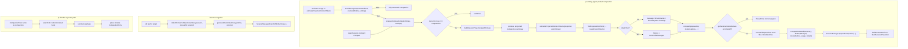

> `spine.compaction-flow` 说明 **pi-coding-agent 产品层**如何做 context compaction：token threshold 判定、按 session projection 选 cut point、生成 checkpoint summary、经 `SessionManager.appendCompaction` 落盘，以及 tree navigation 时如何生成 abandoned branch summary。`pi-agent-core` 1.0 已删除 experimental harness compaction。`pi-durable` 另有 `CompactionTask`（`pi.compaction`），与本页产品路径不共用函数。

## 能回答的问题

- `shouldCompact` 的阈值公式是什么，`enabled` 如何短路 automatic compaction？
- `prepareCompaction` 如何消费 `buildSessionProjection()`，并决定 `firstKeptEntryId`、`messagesToSummarize` 与 `turnPrefixMessages`？
- `findProjectedCutPoint` / split turn / overflow recovery suffix 怎样影响 cut？
- `compact` 何时走 `generateSummaryWithUsage`，何时再生成 turn-prefix summary，`getSummarizationFailure` 何时拒绝落盘？
- `generateBranchSummary` 与 compaction summary 共享哪些机制，prompt / maxTokens / 返回值有何不同？
- 产品层谁调用 `appendCompaction`，retain-none 把磁盘上的 `firstKeptEntryId` 写成什么？
- `context_edit` 如何影响 cut、summary 输入和 `tokensBefore`？
- `pi-durable` 的 `CompactionTask` 与 coding-agent `compact()` 是不是同一条路径？

```mermaid
flowchart TD
  subgraph product ["pi-coding-agent product compaction"]
    Usage["assistant usage or estimateProjectedContextTokens"] --> Gate["shouldCompact(contextTokens, contextWindow, settings)"]
    Gate -->|false| Noop["skip automatic compaction"]
    Gate -->|true| Prep["prepareCompaction(pathEntries, settings)"]
    Manual["AgentSession.compact /compact"] --> Prep
    Prep --> Last{"last entry type === compaction?"}
    Last -->|yes| NoPrep["undefined"]
    Last -->|no| Proj["buildSessionProjection(pathEntries)"]
    Proj --> Prev["previous projected compaction.summary"]
    Prev --> Estimate["estimateProjectedContextTokens(projection, pathEntries)"]
    Estimate --> Cut["findProjectedCutPoint(..., keepRecentTokens)"]
    Cut --> Split{"isSplitTurn?"}
    Split -->|no| Hist["messagesToSummarize = boundaryStart..firstKept"]
    Split -->|yes| DualPrep["history + turnPrefixMessages"]
    Hist --> Compact["compact(preparation, model, apiKey, ...)"]
    DualPrep --> Compact
    Compact --> Fail{"getSummarizationFailure error/length?"}
    Fail -->|yes| Throw["throw Error; do not append"]
    Fail -->|no| Files["formatFileOperations read-files / modified-files"]
    Files --> Result["CompactionResult(summary, firstKeptEntryId, tokensBefore, usage, details)"]
    Result --> Persist["SessionManager.appendCompaction(...)"]
    Persist --> Replay["buildContextEntries + buildSessionProjection"]
  end

  subgraph branchNav ["branch navigation"]
    Nav["old leaf to target"] --> Collect["collectEntriesForBranchSummary(session, oldLeafId, targetId)"]
    Collect --> BGen["generateBranchSummary(entries, options)"]
    BGen --> BPersist["SessionManager.branchWithSummary(...)"]
  end

  subgraph durablePath ["pi-durable separate path"]
    DTask["CompactionTask name pi.compaction"] --> DSelect["selectCut + beforeCompact hook"]
    DSelect --> DSum["summarize phase"]
    DSum --> DPlace["place durable CompactionEntry"]
  end
```

## 端到端步骤

1. 产品 compaction 的公开符号从 `packages/coding-agent/src/core/compaction/index.ts` 再导出：`compaction.ts`、`branch-summarization.ts`、`utils.ts`。[E: packages/coding-agent/src/core/compaction/index.ts:5] [E: packages/coding-agent/src/core/compaction/index.ts:6] [E: packages/coding-agent/src/core/compaction/index.ts:7] `AgentSession` 从该 barrel 引入 `shouldCompact`、`prepareCompaction`、`compact`、`generateBranchSummary`、`estimateProjectedContextTokens`。[E: packages/coding-agent/src/core/agent-session.ts:70] [E: packages/coding-agent/src/core/agent-session.ts:72] [E: packages/coding-agent/src/core/agent-session.ts:76] [E: packages/coding-agent/src/core/agent-session.ts:77] [E: packages/coding-agent/src/core/agent-session.ts:78] `pi-agent-core` 的 `packages/agent/src/` 不再实现 compaction；agent-loop 只在 `lastCompletedTurn` 之后调用 `config.prepareNextTurn`，产品层把 compaction 装进这个 hook。[E: packages/agent/src/agent-loop.ts:186] [I]

2. `shouldCompact(contextTokens, contextWindow, settings)` 是 automatic compaction 的纯阈值 gate：`settings.enabled` 为 false 时直接 false，否则 `contextTokens > contextWindow - settings.reserveTokens`。[E: packages/coding-agent/src/core/compaction/compaction.ts:267] [E: packages/coding-agent/src/core/compaction/compaction.ts:268] [E: packages/coding-agent/src/core/compaction/compaction.ts:269] 算法层 `CompactionSettings` 只有 `enabled` / `reserveTokens` / `keepRecentTokens`；`DEFAULT_COMPACTION_SETTINGS` 为启用、`reserveTokens: 16384`、`keepRecentTokens: 20000`。[E: packages/coding-agent/src/core/compaction/compaction.ts:120] [E: packages/coding-agent/src/core/compaction/compaction.ts:126] [E: packages/coding-agent/src/core/compaction/compaction.ts:127] [E: packages/coding-agent/src/core/compaction/compaction.ts:128] [E: packages/coding-agent/src/core/compaction/compaction.ts:129] 产品 `settings.json` 的 `compaction.modelOverrides` **不是**该三字段 interface 的第四字段；`SettingsManager.getCompactionSettings(model)` 先解析 override / ordinary / 内置默认，再交给这三个字段。[E: packages/coding-agent/src/core/settings-manager.ts:28] [E: packages/coding-agent/src/core/settings-manager.ts:32] [E: packages/coding-agent/src/core/settings-manager.ts:964] [E: packages/coding-agent/src/core/settings-manager.ts:969] [E: packages/coding-agent/src/core/settings-manager.ts:970] [E: packages/coding-agent/src/core/settings-manager.ts:971] [E: packages/coding-agent/src/core/settings-manager.ts:972] `enabled` 走 `getCompactionEnabled()`（`settings.compaction?.enabled ?? true`），不按 model key override。[E: packages/coding-agent/src/core/settings-manager.ts:914] [E: packages/coding-agent/src/core/settings-manager.ts:915] [E: packages/coding-agent/src/core/settings-manager.ts:970]

3. `AgentSession` 在调用 `shouldCompact` / `prepareCompaction` 前先取 `getCompactionSettings(model)`。[E: packages/coding-agent/src/core/agent-session.ts:744] [E: packages/coding-agent/src/core/agent-session.ts:2730] [E: packages/coding-agent/src/core/agent-session.ts:2905] [E: packages/coding-agent/src/core/agent-session.ts:3052] mid-run threshold 挂在 `prepareNextTurnWithContext`：先 `_compactBeforeNextAssistantResponse`，虚拟模型跳过，等 `prepareRequest` 路由到具体 model 后再压。[E: packages/coding-agent/src/core/agent-session.ts:876] [E: packages/coding-agent/src/core/agent-session.ts:877] [E: packages/coding-agent/src/core/agent-session.ts:752] [E: packages/coding-agent/src/core/agent-session.ts:810] [E: packages/coding-agent/src/core/agent-session.ts:811] 跑完 assistant 后 `_checkCompaction` 处理 overflow compact-and-retry 与 threshold；新 prompt 前也会对 last assistant 再检查一次（含 aborted）。[E: packages/coding-agent/src/core/agent-session.ts:1837] [E: packages/coding-agent/src/core/agent-session.ts:2009] [E: packages/coding-agent/src/core/agent-session.ts:2900] [E: packages/coding-agent/src/core/agent-session.ts:2906] `/compact`、RPC、扩展走 `AgentSession.compact()`，与 automatic `_runAutoCompaction()` 分开，但两者都在 hook 之后调用同一套 `compact()`。[E: packages/coding-agent/src/core/agent-session.ts:2717] [E: packages/coding-agent/src/core/agent-session.ts:2782] [E: packages/coding-agent/src/core/agent-session.ts:3050] [E: packages/coding-agent/src/core/agent-session.ts:3115]

4. `prepareCompaction(pathEntries, settings)` 只接收一条 session path 与三字段 settings，返回 `CompactionPreparation | undefined`（不是 `Result`）。[E: packages/coding-agent/src/core/compaction/compaction.ts:872] [E: packages/coding-agent/src/core/compaction/compaction.ts:873] [E: packages/coding-agent/src/core/compaction/compaction.ts:874] [E: packages/coding-agent/src/core/compaction/compaction.ts:875] 函数体内不调用 `shouldCompact`；调用者先做 threshold gate。[I] 若 path 非空且最后一项已是 `compaction`，返回 `undefined`，避免在 compaction entry 后立即再压。[E: packages/coding-agent/src/core/compaction/compaction.ts:876] [E: packages/coding-agent/src/core/compaction/compaction.ts:877]

5. 准备阶段先 `buildSessionProjection(pathEntries)`。canonical projection 把最新 compaction 放在条目首位，其 `summary` 成为 `previousSummary`，`boundaryStart` 为该条目之后。[E: packages/coding-agent/src/core/compaction/compaction.ts:880] [E: packages/coding-agent/src/core/compaction/compaction.ts:885] [E: packages/coding-agent/src/core/compaction/compaction.ts:891] [E: packages/coding-agent/src/core/compaction/compaction.ts:892] [E: packages/coding-agent/src/core/compaction/compaction.ts:894] 后续 compaction 是 iterative update：新 summary 吃 `previousSummary` + compaction 之后的投影消息，而不是从 session 起点重讲。[I]

6. `tokensBefore` 来自 `estimateProjectedContextTokens(projection, pathEntries).tokens`，不是 raw entry 数。[E: packages/coding-agent/src/core/compaction/compaction.ts:897] `estimateProjectedContextTokens` 先按投影 messages 做 `estimateContextTokens`；若复用的 assistant usage 落在更晚的 `context_edit` 或 `compaction` **之前**，丢弃该 usage，改为按当前 system + 非 system 投影消息重估，避免 pre-edit / pre-compaction usage 误触发 compact。[E: packages/coding-agent/src/core/compaction/compaction.ts:227] [E: packages/coding-agent/src/core/compaction/compaction.ts:231] [E: packages/coding-agent/src/core/compaction/compaction.ts:248] [E: packages/coding-agent/src/core/compaction/compaction.ts:253] [E: packages/coding-agent/src/core/compaction/compaction.ts:256] `estimateContextTokens` 有有效 assistant usage 时以该 usage 的 context tokens 为基线，只估算其后 trailing messages；没有 usage 时逐条 `estimateTokens`。[E: packages/coding-agent/src/core/compaction/compaction.ts:196] [E: packages/coding-agent/src/core/compaction/compaction.ts:212] [E: packages/coding-agent/src/core/compaction/compaction.ts:219]

7. cut 由 `findProjectedCutPoint(projectedEntries, boundaryStart, boundaryEnd, settings.keepRecentTokens)` 完成，不是 raw `findCutPoint`（后者仍导出，但 `prepareCompaction` 不调用）。[E: packages/coding-agent/src/core/compaction/compaction.ts:898] [E: packages/coding-agent/src/core/compaction/compaction.ts:446] [E: packages/coding-agent/src/core/compaction/compaction.ts:802] 投影 cut 收集 `sourceEntry.type !== "compaction"` 且 messages 含 `isCutPointMessage` 的下标；从尾部反向累加 `estimateTokens`，达到 `keepRecentTokens` 后取第一个不早于当前位置的 cut。[E: packages/coding-agent/src/core/compaction/compaction.ts:809] [E: packages/coding-agent/src/core/compaction/compaction.ts:811] [E: packages/coding-agent/src/core/compaction/compaction.ts:820] [E: packages/coding-agent/src/core/compaction/compaction.ts:824] [E: packages/coding-agent/src/core/compaction/compaction.ts:826] `isCutPointMessage` 接受 user / assistant / bashExecution / custom / branchSummary / compactionSummary，拒绝 `toolResult`。[E: packages/coding-agent/src/core/compaction/compaction.ts:351] [E: packages/coding-agent/src/core/compaction/compaction.ts:353] [E: packages/coding-agent/src/core/compaction/compaction.ts:360] `isTurnStartMessage` 接受 user / bashExecution / custom / branchSummary / compactionSummary，因此产品层 `custom_message` 投影出的 `custom` role **算** turn start。[E: packages/coding-agent/src/core/compaction/compaction.ts:366] [E: packages/coding-agent/src/core/compaction/compaction.ts:368] [E: packages/coding-agent/src/core/compaction/compaction.ts:370] [E: packages/coding-agent/src/core/session-manager.ts:453]

8. 若已经 exceeded budget，且 cut 后 suffix 是「被省略的 assistant attempt + 使其保持省略的 edits」、没有针对未省略 target 的 replacement，`findProjectedCutPoint` 把 `cutIndex++`，让 over-budget recovered input 进入 summary，同时保留 omission edits。[E: packages/coding-agent/src/core/compaction/compaction.ts:846] [E: packages/coding-agent/src/core/compaction/compaction.ts:856] 然后向前吸收 `messages.length === 0` 且不是 compaction 的 metadata，避免 retained 段前面挂孤立空投影。[E: packages/coding-agent/src/core/compaction/compaction.ts:858] [E: packages/coding-agent/src/core/compaction/compaction.ts:860] [E: packages/coding-agent/src/core/compaction/compaction.ts:861] 若 cut 条目不是 turn start，则 `findProjectedTurnStartIndex` 向前找 turn start 并标 `isSplitTurn`。[E: packages/coding-agent/src/core/compaction/compaction.ts:863] [E: packages/coding-agent/src/core/compaction/compaction.ts:864] [E: packages/coding-agent/src/core/compaction/compaction.ts:868]

9. 选出的 `firstKeptEntry.id` 写入 `CompactionPreparation.firstKeptEntryId`；缺 id 则 `undefined`。[E: packages/coding-agent/src/core/compaction/compaction.ts:900] [E: packages/coding-agent/src/core/compaction/compaction.ts:901] [E: packages/coding-agent/src/core/compaction/compaction.ts:902] 非 split：`messagesToSummarize` 覆盖 `[boundaryStart, firstKeptEntryIndex)`；split：history 截到 `turnStartIndex`，`turnPrefixMessages` 覆盖 `turnStartIndex..firstKeptEntryIndex`。[E: packages/coding-agent/src/core/compaction/compaction.ts:903] [E: packages/coding-agent/src/core/compaction/compaction.ts:905] [E: packages/coding-agent/src/core/compaction/compaction.ts:908] 两边都空则 `undefined`。[E: packages/coding-agent/src/core/compaction/compaction.ts:914] 投影 compaction 不会进入 summary 输入：`getMessagesFromProjectedEntryForCompaction` 对 `sourceEntry.type === "compaction"` 返回 `[]`，并丢掉 system messages（compaction entry 自己 replay prompt/tool state）。[E: packages/coding-agent/src/core/compaction/compaction.ts:98] [E: packages/coding-agent/src/core/compaction/compaction.ts:101] 文件操作用 `extractFileOperations` 从 `messagesToSummarize` 与 previous compaction `details` 收集，split 时再扫 `turnPrefixMessages`。[E: packages/coding-agent/src/core/compaction/compaction.ts:917] [E: packages/coding-agent/src/core/compaction/compaction.ts:920] [E: packages/coding-agent/src/core/compaction/utils.ts:30]

10. `compact(preparation, model, apiKey, ...)` 只消费已准备好的 `CompactionPreparation`，返回 `Promise<CompactionResult>`；失败抛 `Error`，没有 harness 时代的 `Result` / `CompactionError`。[E: packages/coding-agent/src/core/compaction/compaction.ts:965] [E: packages/coding-agent/src/core/compaction/compaction.ts:978] split turn 且有 prefix messages 时：若有 history messages 则 `generateSummaryWithUsage(..., previousSummary)`，否则 history 文本用 `previousSummary ?? "No prior history."`；然后 `generateTurnPrefixSummary`。[E: packages/coding-agent/src/core/compaction/compaction.ts:994] [E: packages/coding-agent/src/core/compaction/compaction.ts:995] [E: packages/coding-agent/src/core/compaction/compaction.ts:997] [E: packages/coding-agent/src/core/compaction/compaction.ts:1017] 最终 summary 为 history、分隔线、`Turn Context (split turn)` 与 prefix 的拼接，usage 经 `combineUsage` 合并。[E: packages/coding-agent/src/core/compaction/compaction.ts:1032] [E: packages/coding-agent/src/core/compaction/compaction.ts:1033] 非 split 只调一次 `generateSummaryWithUsage`。[E: packages/coding-agent/src/core/compaction/compaction.ts:1036]

11. `generateSummaryWithUsage` 在有 `previousSummary` 时用 update prompt，否则用 fresh `SUMMARIZATION_PROMPT`；`customInstructions` 追加为 `Additional focus`。[E: packages/coding-agent/src/core/compaction/compaction.ts:718] [E: packages/coding-agent/src/core/compaction/compaction.ts:719] [E: packages/coding-agent/src/core/compaction/compaction.ts:720] 消息先 `convertToLlm` 再 `serializeConversation`，包进 `<conversation>`；有 previous 时再附 `<previous-summary>`。[E: packages/coding-agent/src/core/compaction/compaction.ts:725] [E: packages/coding-agent/src/core/compaction/compaction.ts:726] [E: packages/coding-agent/src/core/compaction/compaction.ts:729] [E: packages/coding-agent/src/core/compaction/compaction.ts:731] 普通 summary 的 `maxTokens` 是 `min(floor(0.8 * reserveTokens), model.maxTokens 或 Infinity)`；turn-prefix 用 `0.5 * reserveTokens`。[E: packages/coding-agent/src/core/compaction/compaction.ts:712] [E: packages/coding-agent/src/core/compaction/compaction.ts:1090] LLM 调用统一走 `completeSummarization`：`cacheRetention: "none"`，无 sessionId 时发新 `uuidv7()`，经 `retryAssistantCall` 包一层。[E: packages/coding-agent/src/core/compaction/compaction.ts:619] [E: packages/coding-agent/src/core/compaction/compaction.ts:631] [E: packages/coding-agent/src/core/compaction/compaction.ts:632] [E: packages/coding-agent/src/core/compaction/compaction.ts:638] system prompt 是 `utils.ts` 的 `SUMMARIZATION_SYSTEM_PROMPT`。[E: packages/coding-agent/src/core/compaction/utils.ts:161] [E: packages/coding-agent/src/core/compaction/compaction.ts:684] 若 model 支持 reasoning 且 `thinkingLevel` 不是 `"off"`，options 带 `reasoning`。[E: packages/coding-agent/src/core/compaction/compaction.ts:606] [E: packages/coding-agent/src/core/compaction/compaction.ts:607]

12. `getSummarizationFailure` 把 `stopReason === "error"` 与 `"length"` 变成不可落盘的错误文案：length 表示 summary 不完整，不能当 checkpoint。[E: packages/coding-agent/src/core/compaction/compaction.ts:585] [E: packages/coding-agent/src/core/compaction/compaction.ts:586] [E: packages/coding-agent/src/core/compaction/compaction.ts:589] `generateSummaryWithUsage` / turn-prefix 在 failure 或 summary 含 toolCall 时 `throw new Error`。[E: packages/coding-agent/src/core/compaction/compaction.ts:755] [E: packages/coding-agent/src/core/compaction/compaction.ts:759] [E: packages/coding-agent/src/core/compaction/compaction.ts:1108] [E: packages/coding-agent/src/core/compaction/compaction.ts:1111] 成功后 `computeFileLists` + `formatFileOperations` 把只读文件与被 edit/write 的文件写成 `<read-files>` / `<modified-files>` 标签追加到 summary。[E: packages/coding-agent/src/core/compaction/compaction.ts:1057] [E: packages/coding-agent/src/core/compaction/compaction.ts:1058] [E: packages/coding-agent/src/core/compaction/utils.ts:67] [E: packages/coding-agent/src/core/compaction/utils.ts:77] 返回的 `CompactionResult` 含 `summary`、`firstKeptEntryId`、`tokensBefore`、`usage`、`details`；**没有** `retainedTail`。`estimatedTokensAfter` 在类型上可选，`compact()` 本身不填，由 `AgentSession` 在 append 后按新投影估算。[E: packages/coding-agent/src/core/compaction/compaction.ts:105] [E: packages/coding-agent/src/core/compaction/compaction.ts:1064] [E: packages/coding-agent/src/core/compaction/compaction.ts:109] [E: packages/coding-agent/src/core/agent-session.ts:2803]

13. 持久化只发生在 `SessionManager.appendCompaction(summary, firstKeptEntryId, tokensBefore, details?, fromHook?, usage?)`：新 entry `type: "compaction"`，`parentId` 为当前 leaf，并拷贝当前投影的 `systemMessage`。[E: packages/coding-agent/src/core/session-manager.ts:1261] [E: packages/coding-agent/src/core/session-manager.ts:1273] [E: packages/coding-agent/src/core/session-manager.ts:1278] [E: packages/coding-agent/src/core/session-manager.ts:1283] `AgentSession.compact()` 与 `_runAutoCompaction()` 在默认或 extension 提供的 result 之后都调用它。[E: packages/coding-agent/src/core/agent-session.ts:2800] [E: packages/coding-agent/src/core/agent-session.ts:3130] 之后 `buildContextEntries()` 把最新 compaction 放在前面，再从 `firstKeptEntryId` 起到 compaction 之前追加非 system retained entries，最后追加 compaction 之后的 path。[E: packages/coding-agent/src/core/session-manager.ts:499] [E: packages/coding-agent/src/core/session-manager.ts:503] [E: packages/coding-agent/src/core/session-manager.ts:510] `buildSessionProjection()` 再把 retained 范围内每个 target 的最新 `context_edit` 应用到投影；index > 0 的旧 compaction 贡献空 messages。[E: packages/coding-agent/src/core/session-manager.ts:543] [E: packages/coding-agent/src/core/session-manager.ts:551] [E: packages/coding-agent/src/core/session-manager.ts:562]

## 分支总结 flow

`collectEntriesForBranchSummary(session, oldLeafId, targetId)` 接收 `ReadonlySessionManager` 与 old leaf / target id，返回 `{ entries, commonAncestorId }`。[E: packages/coding-agent/src/core/compaction/branch-summarization.ts:108] [E: packages/coding-agent/src/core/compaction/branch-summarization.ts:109] [E: packages/coding-agent/src/core/compaction/branch-summarization.ts:110] [E: packages/coding-agent/src/core/compaction/branch-summarization.ts:111] 无 old leaf 时 entries 为空。[E: packages/coding-agent/src/core/compaction/branch-summarization.ts:114] [E: packages/coding-agent/src/core/compaction/branch-summarization.ts:115] 否则求 old path 与 target path 的 deepest common ancestor，再从 old leaf 沿 `parentId` 收到 ancestor 前并 reverse 成时间序；**不**在 compaction 边界停下，compaction summary 会作为可总结内容。[E: packages/coding-agent/src/core/compaction/branch-summarization.ts:119] [E: packages/coding-agent/src/core/compaction/branch-summarization.ts:126] [E: packages/coding-agent/src/core/compaction/branch-summarization.ts:135] [E: packages/coding-agent/src/core/compaction/branch-summarization.ts:143]

`generateBranchSummary(entries, options)` 的 token budget 是 `(model.contextWindow || 128000) - reserveTokens`，`reserveTokens` 默认 `16384`。[E: packages/coding-agent/src/core/compaction/branch-summarization.ts:293] [E: packages/coding-agent/src/core/compaction/branch-summarization.ts:305] [E: packages/coding-agent/src/core/compaction/branch-summarization.ts:312] [E: packages/coding-agent/src/core/compaction/branch-summarization.ts:313] `prepareBranchEntries` 从 newest 往 oldest 装 messages；`getMessageFromEntry` 跳过 `toolResult`，把 `custom_message` / `branch_summary` / `compaction` 转成可序列化消息，`custom` / `label` 等不进 prompt。[E: packages/coding-agent/src/core/compaction/branch-summarization.ts:156] [E: packages/coding-agent/src/core/compaction/branch-summarization.ts:160] [E: packages/coding-agent/src/core/compaction/branch-summarization.ts:163] [E: packages/coding-agent/src/core/compaction/branch-summarization.ts:169] [E: packages/coding-agent/src/core/compaction/branch-summarization.ts:175] 超预算时，若该条是 `compaction` 或 `branch_summary` 且 `totalTokens < tokenBudget * 0.9`，仍可挤进 prompt。[E: packages/coding-agent/src/core/compaction/branch-summarization.ts:232] [E: packages/coding-agent/src/core/compaction/branch-summarization.ts:233] [E: packages/coding-agent/src/core/compaction/branch-summarization.ts:234]

没有选出 messages 时返回 `{ summary: "No content to summarize" }`，不发 LLM，也没有 `usage`。[E: packages/coding-agent/src/core/compaction/branch-summarization.ts:317] [E: packages/coding-agent/src/core/compaction/branch-summarization.ts:318] 否则同样 `convertToLlm` + `serializeConversation` + `SUMMARIZATION_SYSTEM_PROMPT`；`replaceInstructions` 可整段替换默认 `BRANCH_SUMMARY_PROMPT`，否则 `customInstructions` 追加为 additional focus。[E: packages/coding-agent/src/core/compaction/branch-summarization.ts:323] [E: packages/coding-agent/src/core/compaction/branch-summarization.ts:328] [E: packages/coding-agent/src/core/compaction/branch-summarization.ts:330] [E: packages/coding-agent/src/core/compaction/branch-summarization.ts:351] output `maxTokens` 为 `min(4096, model.maxTokens 或 Infinity)`，经同一 `completeSummarization` 发出。[E: packages/coding-agent/src/core/compaction/branch-summarization.ts:345] [E: packages/coding-agent/src/core/compaction/branch-summarization.ts:353] `stopReason === "aborted"` 返回 `{ aborted: true }`；`getSummarizationFailure` 或 toolCall 返回 `{ error }`。[E: packages/coding-agent/src/core/compaction/branch-summarization.ts:356] [E: packages/coding-agent/src/core/compaction/branch-summarization.ts:359] [E: packages/coding-agent/src/core/compaction/branch-summarization.ts:363] 成功文本前加 branch preamble，再追加 file-operation tags。[E: packages/coding-agent/src/core/compaction/branch-summarization.ts:370] [E: packages/coding-agent/src/core/compaction/branch-summarization.ts:374]

`AgentSession` 在 tree navigation 且 `options.summarize` 时调用 `generateBranchSummary`，`reserveTokens` 来自 `getBranchSummarySettings()`；成功后 `sessionManager.branchWithSummary(newLeafId, summaryText, ...)` 把 `branch_summary` 挂在 **target** leaf，而不是旧分支 tip。[E: packages/coding-agent/src/core/agent-session.ts:4008] [E: packages/coding-agent/src/core/agent-session.ts:4011] [E: packages/coding-agent/src/core/agent-session.ts:4016] [E: packages/coding-agent/src/core/agent-session.ts:4061] [E: packages/coding-agent/src/core/session-manager.ts:1600] [E: packages/coding-agent/src/core/session-manager.ts:1611]

## 关键决策点

### threshold gate 与 preparation 分离

`shouldCompact` 只比较当前 context tokens 与 `contextWindow - reserveTokens`；`prepareCompaction` 入口没有 model context window，只用 `settings.keepRecentTokens` 选 cut。[E: packages/coding-agent/src/core/compaction/compaction.ts:267] [E: packages/coding-agent/src/core/compaction/compaction.ts:872] [E: packages/coding-agent/src/core/compaction/compaction.ts:898] automatic compaction 必须在调用 `prepareCompaction` 之前另做 gate；源码中 `prepareCompaction` 不读取 `shouldCompact`。[I]

### previous summary 是迭代输入

上一次 compaction 的 `summary` 进入 `generateSummaryWithUsage` 的 `<previous-summary>`，并把 prompt 从 fresh 换成 update。[E: packages/coding-agent/src/core/compaction/compaction.ts:892] [E: packages/coding-agent/src/core/compaction/compaction.ts:718] [E: packages/coding-agent/src/core/compaction/compaction.ts:731] compaction entry 不只是历史标记，还是下一轮 summary 的状态输入。[I]

### split turn 保留 suffix，压缩 prefix

cut 落在 turn 中间时，turn start 到 cut 之前单独做 prefix summary，cut 及之后通过 `firstKeptEntryId` 留在投影里。[E: packages/coding-agent/src/core/compaction/compaction.ts:903] [E: packages/coding-agent/src/core/compaction/compaction.ts:908] [E: packages/coding-agent/src/core/compaction/compaction.ts:927] split-turn 文本明确标注 `Turn Context (split turn)`，让 retained suffix 能读到同一 turn 前半段。[E: packages/coding-agent/src/core/compaction/compaction.ts:1032]

### truncated / error summary 不落盘

`getSummarizationFailure` 把 length stop 视为不完整 checkpoint。`compact()` 抛错后 `AgentSession` 不会 `appendCompaction`。[E: packages/coding-agent/src/core/compaction/compaction.ts:589] [E: packages/coding-agent/src/core/compaction/compaction.ts:755] [E: packages/coding-agent/src/core/agent-session.ts:2800] [I]

### branch summary 不是 compaction summary

branch summary 面向「离开某分支后可能返回」：prompt 要 goal / progress / decisions / next steps，成功文本带 branch preamble，`maxTokens` 上限 4096。[E: packages/coding-agent/src/core/compaction/branch-summarization.ts:253] [E: packages/coding-agent/src/core/compaction/branch-summarization.ts:258] [E: packages/coding-agent/src/core/compaction/branch-summarization.ts:345] compaction summary 面向「继续当前工作但替换旧 history」，额外要求 Critical Context，普通 summary 用 `0.8 * reserveTokens`。[E: packages/coding-agent/src/core/compaction/compaction.ts:507] [E: packages/coding-agent/src/core/compaction/compaction.ts:535] [E: packages/coding-agent/src/core/compaction/compaction.ts:712] 两者共享 `SUMMARIZATION_SYSTEM_PROMPT`、`serializeConversation`、`completeSummarization` 与 file-ops tags，但 preamble、prompt、maxTokens、error 形状（throw vs `{ aborted, error }`）不同。[E: packages/coding-agent/src/core/compaction/utils.ts:161] [E: packages/coding-agent/src/core/compaction/branch-summarization.ts:19] [E: packages/coding-agent/src/core/compaction/compaction.ts:746]

## 包边界

产品 compaction **不在** `pi-agent-core`。agent-core 1.0 只保留 `Agent` / loop / proxy / types；compaction 纯函数、cut、summary、file-ops 全部在 `packages/coding-agent/src/core/compaction/`。[E: packages/coding-agent/src/core/compaction/index.ts:5] [E: packages/agent/src/agent-loop.ts:186] [I] `SessionManager.appendCompaction` / `branchWithSummary` / `buildContextEntries` / `buildSessionProjection` 负责 JSONL tree 与发给模型的投影。[E: packages/coding-agent/src/core/session-manager.ts:1261] [E: packages/coding-agent/src/core/session-manager.ts:1600] [E: packages/coding-agent/src/core/session-manager.ts:476] [E: packages/coding-agent/src/core/session-manager.ts:543] `AgentSession` 负责何时 gate、overflow omit、extension `session_before_compact` / `session_before_tree`、以及把 `Compact`/`BranchSummary` 结果写成 entry。[E: packages/coding-agent/src/core/agent-session.ts:2745] [E: packages/coding-agent/src/core/agent-session.ts:3077] [E: packages/coding-agent/src/core/agent-session.ts:3976]

### pi-durable `CompactionTask` 是另一条路径

`@earendil-works/pi-durable` 的内置 task `CompactionTask` 名称为 `"pi.compaction"`，phases 为 `select` / `summarize` / `retry`。[E: packages/durable/src/harness/compaction.ts:102] [E: packages/durable/src/harness/compaction.ts:103] [E: packages/durable/src/harness/compaction.ts:106] 它有自己的 `select` / `summarize` / `retry` checkpoint、`selectCut`、`beforeCompact` hook，以及 durable `CompactionEntry` 的 place 逻辑；**不**调用 coding-agent 的 `prepareCompaction` / `compact` / `appendCompaction`。[E: packages/durable/src/harness/compaction.ts:106] [E: packages/durable/src/harness/compaction.ts:116] [E: packages/durable/src/harness/compaction.ts:128] [E: packages/durable/src/harness/compaction.ts:253] 不要把 durable 的 `head` / `firstKept` / write submission 写进产品 JSONL flow，也不要把产品 `SessionManager` 写成 durable storage 的替身。[I]

### retain-none compaction

`appendCompaction` 的 `firstKeptEntryId` 可为 `null`：写入时 `firstKeptEntryId ?? id`，即 keep boundary 等于 compaction 自己的 id。[E: packages/coding-agent/src/core/session-manager.ts:1263] [E: packages/coding-agent/src/core/session-manager.ts:1278] `buildContextEntries()` 只在 compaction **之前**的 path 上找该 id，找不到则不保留任何前置 entry；模型只看到该 compaction 的 summary/checkpoint（含 replay 的 `systemMessage`）以及之后的新消息。[E: packages/coding-agent/src/core/session-manager.ts:499] [E: packages/coding-agent/src/core/session-manager.ts:503] [E: packages/coding-agent/src/core/session-manager.ts:510] extension boundary draft 同样允许 `firstKeptEntryId: null` 创建 self-retaining compaction。[E: packages/coding-agent/src/core/extensions/types.ts:959] [E: packages/coding-agent/src/core/agent-session.ts:942] 重复 retain-none 时，下一次 `prepareCompaction` 的 previous boundary 就是这条 self-id 记录，summarized span 从它之后开始。[E: packages/coding-agent/src/core/compaction/compaction.ts:894] [I]

### context-edit 与 compaction

产品 cut / summary / `tokensBefore` 都消费 `buildSessionProjection()`，不是 raw transcript。[E: packages/coding-agent/src/core/compaction/compaction.ts:880] [E: packages/coding-agent/src/core/compaction/compaction.ts:897] `context_edit` 本身不产生模型消息；`replacement: null` 让 target 从投影消失，content replacement 只改投影 content。被省略的 raw entries 仍在 JSONL，但不参与 cut、summary 输入或 token 估计。[E: packages/coding-agent/src/core/session-manager.ts:519] [E: packages/coding-agent/src/core/session-manager.ts:523] [E: packages/coding-agent/src/core/session-manager.ts:465] 当 overflow/length 需要 retry（`stopReason !== "stop"`）时，recovery 先 `_omitRecoveryAttempt` → `appendContextEdit(id, null)`，再 `_runAutoCompaction("overflow", willRetry)`，从而不把 abandoned attempt 留在未来 provider context。[E: packages/coding-agent/src/core/agent-session.ts:2964] [E: packages/coding-agent/src/core/agent-session.ts:1208] [E: packages/coding-agent/src/core/agent-session.ts:1219] [E: packages/coding-agent/src/core/agent-session.ts:2996] [E: packages/coding-agent/src/core/agent-session.ts:2997] `stopReason === "stop"` 的 overflow 只 compact、不 omit、不 retry。[E: packages/coding-agent/src/core/agent-session.ts:2968] [E: packages/coding-agent/src/core/agent-session.ts:2969] 对 retained 范围内的 entry，compaction **之后**追加的 `context_edit` 仍作用在投影上。[E: packages/coding-agent/src/core/session-manager.ts:551] [I]

## 指向 T1/T2 深挖

- `subsys.agent-core.compaction` 应展开产品 `CompactionSettings`、`CompactionPreparation`、`CompactionResult`、投影 cut 与 split turn（id 仍叫 agent-core，源已迁到 coding-agent compaction）。
- `subsys.agent-core.branch-summary` 应展开 `collectEntriesForBranchSummary`、common ancestor、`branchWithSummary` 持久化。
- `ref.agent.compaction-config` 应枚举三字段 settings、`DEFAULT_COMPACTION_SETTINGS`、以及 `modelOverrides` 如何被 `getCompactionSettings` 压扁。
- `subsys.coding-agent.session-manager` 应展开 `appendCompaction`、`buildContextEntries`、`buildSessionProjection`、retain-none 与 `context_edit`。
- `subsys.coding-agent.agent-session` 应展开 `prepareNextTurnWithContext` mid-run compaction、overflow omit、truncated-summary 拒绝落盘、`session_compact_failed`。

## Sources

- packages/coding-agent/src/core/compaction/compaction.ts
- packages/coding-agent/src/core/compaction/branch-summarization.ts
- packages/coding-agent/src/core/compaction/utils.ts
- packages/coding-agent/src/core/compaction/index.ts
- packages/coding-agent/src/core/session-manager.ts
- packages/coding-agent/src/core/agent-session.ts
- packages/coding-agent/src/core/settings-manager.ts
- packages/coding-agent/src/core/extensions/types.ts
- packages/durable/src/harness/compaction.ts
- packages/agent/src/agent-loop.ts

## 相关

- [subsys.agent-core.compaction](../subsystems/agent-core/compaction.md)
- [subsys.coding-agent.session-manager](../subsystems/coding-agent/session-manager.md)
- [ref.agent.compaction-config](../reference/compaction-config.md)
- [subsys.agent-core.branch-summary](../subsystems/agent-core/branch-summary.md)
- [subsys.coding-agent.agent-session](../subsystems/coding-agent/agent-session.md)
