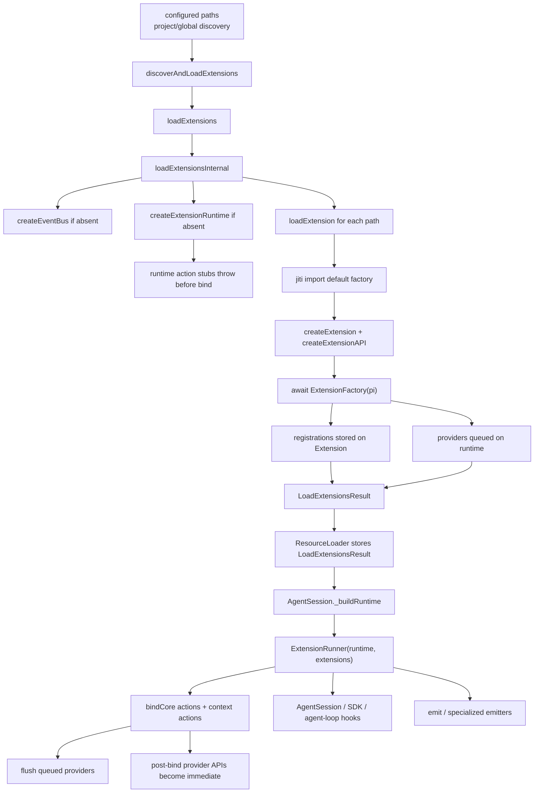

> `spine.extension-lifecycle` 说明 extension loader、shared runtime、runner binding、event dispatch, 以及 resource loader / `AgentSession` / SDK stream hooks 如何把 extension runner 接入产品会话和 agent runtime。

## 能回答的问题

- `discoverAndLoadExtensions` 会从哪些位置发现 extension entry points?
- extension factory load 时哪些 API 会先写入 extension collections, 哪些 action 会因为 runtime 未绑定而报错?
- `ExtensionRuntime` 为什么先由 loader 创建, 再由 `ExtensionRunner.bindCore` 填入真实动作?
- provider registration 为什么有 load 阶段 queue 和 bind 后 immediate 两种行为?
- resource loader 和 `AgentSession` 怎样把 `LoadExtensionsResult` 变成产品会话中的 runner?
- SDK provider/context hooks 与 agent tool lifecycle hooks 怎样接到 runner?
- event handler 的 dispatch 顺序、可修改结果和短路规则是什么?

```mermaid
flowchart TD
  A["configured paths<br/>project/global discovery"] --> B["discoverAndLoadExtensions"]
  B --> C["loadExtensions"]
  C --> D["loadExtensionsInternal"]
  D --> E["createEventBus if absent"]
  D --> F["createExtensionRuntime if absent"]
  F --> G["runtime action stubs throw before bind"]
  D --> H["loadExtension for each path"]
  H --> I["jiti import default factory"]
  I --> J["createExtension + createExtensionAPI"]
  J --> K["await ExtensionFactory(pi)"]
  K --> L["registrations stored on Extension"]
  K --> M["providers queued on runtime"]
  L --> N["LoadExtensionsResult"]
  M --> N
  N --> O["ResourceLoader stores LoadExtensionsResult"]
  O --> P["AgentSession._buildRuntime"]
  P --> Q["ExtensionRunner(runtime, extensions)"]
  Q --> R["bindCore actions + context actions"]
  R --> S["flush queued providers"]
  R --> T["post-bind provider APIs become immediate"]
  Q --> U["AgentSession / SDK / agent-loop hooks"]
  Q --> V["emit / specialized emitters"]
```

## 端到端步骤

1. 标准发现入口 `discoverAndLoadExtensions(configuredPaths, cwd, agentDir, eventBus)` 会解析 `cwd` 与 `agentDir`, 建立 `allPaths` 和 `seen` 去重集合。[E: packages/coding-agent/src/core/extensions/loader.ts:679] [E: packages/coding-agent/src/core/extensions/loader.ts:680] [E: packages/coding-agent/src/core/extensions/loader.ts:681] [E: packages/coding-agent/src/core/extensions/loader.ts:682] 它先扫描项目级 `cwd/${CONFIG_DIR_NAME}/extensions`, 再扫描全局 `agentDir/extensions`, 最后处理显式 configured paths。[E: packages/coding-agent/src/core/extensions/loader.ts:695] [E: packages/coding-agent/src/core/extensions/loader.ts:696] [E: packages/coding-agent/src/core/extensions/loader.ts:699] [E: packages/coding-agent/src/core/extensions/loader.ts:700] [E: packages/coding-agent/src/core/extensions/loader.ts:703]

2. 目录发现规则是 shallow discovery: 直接文件只接受 `.ts` 或 `.js`, 子目录则通过 `package.json` 的 `pi.extensions`、`index.ts` 或 `index.js` 变成 entry points。[E: packages/coding-agent/src/core/extensions/loader.ts:581] [E: packages/coding-agent/src/core/extensions/loader.ts:582] [E: packages/coding-agent/src/core/extensions/loader.ts:598] [E: packages/coding-agent/src/core/extensions/loader.ts:599] [E: packages/coding-agent/src/core/extensions/loader.ts:602] [E: packages/coding-agent/src/core/extensions/loader.ts:614] [E: packages/coding-agent/src/core/extensions/loader.ts:615] [E: packages/coding-agent/src/core/extensions/loader.ts:616] [E: packages/coding-agent/src/core/extensions/loader.ts:619] [E: packages/coding-agent/src/core/extensions/loader.ts:650] [E: packages/coding-agent/src/core/extensions/loader.ts:657]

3. `loadExtensionsInternal` 为一批 paths 创建或复用同一个 `EventBus` 和同一个 `ExtensionRuntime`, 然后逐个调用 `loadExtension` 收集 `extensions` 与 `errors`, 最后返回同一个 `resolvedRuntime`。[E: packages/coding-agent/src/core/extensions/loader.ts:510] [E: packages/coding-agent/src/core/extensions/loader.ts:511] [E: packages/coding-agent/src/core/extensions/loader.ts:514] [E: packages/coding-agent/src/core/extensions/loader.ts:515] [E: packages/coding-agent/src/core/extensions/loader.ts:517] [E: packages/coding-agent/src/core/extensions/loader.ts:522] [E: packages/coding-agent/src/core/extensions/loader.ts:536] [E: packages/coding-agent/src/core/extensions/loader.ts:539] 因此同一次 load 中的 extension API 共享一个 runtime 是由 `resolvedRuntime` 传入每次 `loadExtension` 推出的结构性结论。[I]

4. loader 导入 extension module 时使用 `jiti.import(extensionPath, { default: true })`, 把 default export 当作 `ExtensionFactory`, 并在非函数时返回 load error。[E: packages/coding-agent/src/core/extensions/loader.ts:419] [E: packages/coding-agent/src/core/extensions/loader.ts:420] [E: packages/coding-agent/src/core/extensions/loader.ts:421] [E: packages/coding-agent/src/core/extensions/loader.ts:467] 每个 factory 会拿到 `createExtensionAPI(extension, runtime, cwd, eventBus)` 产生的 `pi` 对象并被 `await factory(api)` 执行; 类型层声明 factory 可 sync 或 async。[E: packages/coding-agent/src/core/extensions/loader.ts:470] [E: packages/coding-agent/src/core/extensions/loader.ts:471] [E: packages/coding-agent/src/core/extensions/loader.ts:472] [E: packages/coding-agent/src/core/extensions/types.ts:1477]

5. `createExtensionRuntime` 在 loader 阶段创建未绑定 runtime: action methods 先指向 `notInitialized`, 该 stub 会抛出“loading 阶段不能调用 action methods”的错误。[E: packages/coding-agent/src/core/extensions/loader.ts:170] [E: packages/coding-agent/src/core/extensions/loader.ts:171] [E: packages/coding-agent/src/core/extensions/loader.ts:172] [E: packages/coding-agent/src/core/extensions/loader.ts:181] [E: packages/coding-agent/src/core/extensions/loader.ts:188] [E: packages/coding-agent/src/core/extensions/loader.ts:193] `registerTool()` 是 load 阶段允许的特例, 因为它写入 `extension.tools` 后只调用此时为 no-op 的 `runtime.refreshTools()`。[E: packages/coding-agent/src/core/extensions/loader.ts:192] [E: packages/coding-agent/src/core/extensions/loader.ts:245] [E: packages/coding-agent/src/core/extensions/loader.ts:247] [E: packages/coding-agent/src/core/extensions/loader.ts:251]

6. 注册 API 在 load 阶段把贡献写进 `Extension` 的 collections: `on` 写 `handlers`, `registerTool` 写 `tools`, `registerCommand` 写 `commands`, `registerShortcut` 写 `shortcuts`, `registerFlag` 写 `flags`, `registerMessageRenderer` 写 `messageRenderers`。[E: packages/coding-agent/src/core/extensions/loader.ts:238] [E: packages/coding-agent/src/core/extensions/loader.ts:242] [E: packages/coding-agent/src/core/extensions/loader.ts:245] [E: packages/coding-agent/src/core/extensions/loader.ts:247] [E: packages/coding-agent/src/core/extensions/loader.ts:254] [E: packages/coding-agent/src/core/extensions/loader.ts:256] [E: packages/coding-agent/src/core/extensions/loader.ts:269] [E: packages/coding-agent/src/core/extensions/loader.ts:271] [E: packages/coding-agent/src/core/extensions/loader.ts:274] [E: packages/coding-agent/src/core/extensions/loader.ts:279] [E: packages/coding-agent/src/core/extensions/loader.ts:285] [E: packages/coding-agent/src/core/extensions/loader.ts:287]

7. Action methods 不在 load 阶段直接实现业务动作, 而是在 `createExtensionAPI` 中先 `assertActive()` 再委托给 shared runtime; 例如 `sendMessage`、`getActiveTools`、`getCommands`、`setModel` 都是这种模式。[E: packages/coding-agent/src/core/extensions/loader.ts:304] [E: packages/coding-agent/src/core/extensions/loader.ts:305] [E: packages/coding-agent/src/core/extensions/loader.ts:306] [E: packages/coding-agent/src/core/extensions/loader.ts:339] [E: packages/coding-agent/src/core/extensions/loader.ts:341] [E: packages/coding-agent/src/core/extensions/loader.ts:354] [E: packages/coding-agent/src/core/extensions/loader.ts:356] [E: packages/coding-agent/src/core/extensions/loader.ts:359] [E: packages/coding-agent/src/core/extensions/loader.ts:361]

8. Provider contribution 是两阶段的: pre-bind 的 `registerProvider` 把 `{ name, config, extensionPath }` 推入 `pendingProviderRegistrations`, `unregisterProvider` 只从 pending queue 移除同名注册。[E: packages/coding-agent/src/core/extensions/loader.ts:208] [E: packages/coding-agent/src/core/extensions/loader.ts:209] [E: packages/coding-agent/src/core/extensions/loader.ts:214] [E: packages/coding-agent/src/core/extensions/loader.ts:215] 类型层在 `ExtensionRuntimeState` 暴露 pending queue 和 register/unregister 函数槽位, bind 前 queue、bind 后直接写 registry 的行为由 loader 与 runner 的实现给出。[E: packages/coding-agent/src/core/extensions/types.ts:1561] [E: packages/coding-agent/src/core/extensions/types.ts:1574] [E: packages/coding-agent/src/core/extensions/types.ts:1576] [I]

9. `ExtensionRunner.bindCore(actions, contextActions, providerActions)` 会把 action implementations 复制到 shared runtime, 例如 `sendMessage`、`sendUserMessage`、tool getters/setters、`getCommands`、`setModel` 和 thinking level accessors。[E: packages/coding-agent/src/core/extensions/runner.ts:311] [E: packages/coding-agent/src/core/extensions/runner.ts:321] [E: packages/coding-agent/src/core/extensions/runner.ts:322] [E: packages/coding-agent/src/core/extensions/runner.ts:327] [E: packages/coding-agent/src/core/extensions/runner.ts:330] [E: packages/coding-agent/src/core/extensions/runner.ts:331] [E: packages/coding-agent/src/core/extensions/runner.ts:332] [E: packages/coding-agent/src/core/extensions/runner.ts:333] [E: packages/coding-agent/src/core/extensions/runner.ts:334] 它同时绑定 context actions, 让 handler context 的 `model`、`isIdle()`、`signal`、`compact()` 等读取当前 runner 状态。[E: packages/coding-agent/src/core/extensions/runner.ts:337] [E: packages/coding-agent/src/core/extensions/runner.ts:338] [E: packages/coding-agent/src/core/extensions/runner.ts:340] [E: packages/coding-agent/src/core/extensions/runner.ts:344] [E: packages/coding-agent/src/core/extensions/runner.ts:345] [E: packages/coding-agent/src/core/extensions/runner.ts:693] [E: packages/coding-agent/src/core/extensions/runner.ts:699] [E: packages/coding-agent/src/core/extensions/runner.ts:705] [E: packages/coding-agent/src/core/extensions/runner.ts:727]

10. `bindCore` 会 flush load 阶段排队的 provider registrations; 有 `providerActions.registerProvider` 时走注入 action, 否则写 `modelRegistry`, 错误则通过 `emitError` 记录。[E: packages/coding-agent/src/core/extensions/runner.ts:350] [E: packages/coding-agent/src/core/extensions/runner.ts:352] [E: packages/coding-agent/src/core/extensions/runner.ts:353] [E: packages/coding-agent/src/core/extensions/runner.ts:355] [E: packages/coding-agent/src/core/extensions/runner.ts:358] flush 后 runtime 的 `registerProvider`/`unregisterProvider` 被替换成立即生效的函数。[E: packages/coding-agent/src/core/extensions/runner.ts:366] [E: packages/coding-agent/src/core/extensions/runner.ts:387] [E: packages/coding-agent/src/core/extensions/runner.ts:389] [E: packages/coding-agent/src/core/extensions/runner.ts:392] [E: packages/coding-agent/src/core/extensions/runner.ts:401] [E: packages/coding-agent/src/core/extensions/runner.ts:403] [E: packages/coding-agent/src/core/extensions/runner.ts:406]

11. Tool contribution 在 runner 层的可见入口是 `getAllRegisteredTools()`: 它按 extension 顺序遍历 `ext.tools.values()`, 对同名 tool 只保留首个注册, 最后返回去重后的 tool 列表。[E: packages/coding-agent/src/core/extensions/runner.ts:447] [E: packages/coding-agent/src/core/extensions/runner.ts:448] [E: packages/coding-agent/src/core/extensions/runner.ts:449] [E: packages/coding-agent/src/core/extensions/runner.ts:450] [E: packages/coding-agent/src/core/extensions/runner.ts:451] [E: packages/coding-agent/src/core/extensions/runner.ts:456]

12. Command contribution 留在 runner 的 registered command surface: `resolveRegisteredCommands` 收集所有 extension commands, 同名命令获得 `name:occurrence` 形式的 `invocationName`, `getRegisteredCommands()` 与 `getCommand(name)` 都从这个解析结果读取。[E: packages/coding-agent/src/core/extensions/runner.ts:595] [E: packages/coding-agent/src/core/extensions/runner.ts:599] [E: packages/coding-agent/src/core/extensions/runner.ts:600] [E: packages/coding-agent/src/core/extensions/runner.ts:602] [E: packages/coding-agent/src/core/extensions/runner.ts:613] [E: packages/coding-agent/src/core/extensions/runner.ts:624] [E: packages/coding-agent/src/core/extensions/runner.ts:635] [E: packages/coding-agent/src/core/extensions/runner.ts:637] [E: packages/coding-agent/src/core/extensions/runner.ts:644] [E: packages/coding-agent/src/core/extensions/runner.ts:645]

13. `ResourceLoader.reload()` 从 package manager 得到 resolved resources 和 CLI extension sources, 抽取 enabled extension paths, 按 `noExtensions` 决定是否只保留 CLI extensions, 再调用 `loadFinalExtensionSet()` 并把结果保存到 `this.extensionsResult`。[E: packages/coding-agent/src/core/resource-loader.ts:354] [E: packages/coding-agent/src/core/resource-loader.ts:355] [E: packages/coding-agent/src/core/resource-loader.ts:376] [E: packages/coding-agent/src/core/resource-loader.ts:395] [E: packages/coding-agent/src/core/resource-loader.ts:400] [E: packages/coding-agent/src/core/resource-loader.ts:402] [E: packages/coding-agent/src/core/resource-loader.ts:404] [E: packages/coding-agent/src/core/resource-loader.ts:413]

14. `loadFinalExtensionSet()` 的主路径调用 `loadExtensionsCached(extensionPaths, cwd, eventBus)`, 再用同一个 runtime 载入 inline factories 并追加 extensions/errors; 有 pre-trust 结果时, remaining paths 也复用 `preTrustExtensions.runtime`, 最后构造新的 `LoadExtensionsResult`。[E: packages/coding-agent/src/core/resource-loader.ts:521] [E: packages/coding-agent/src/core/resource-loader.ts:522] [E: packages/coding-agent/src/core/resource-loader.ts:523] [E: packages/coding-agent/src/core/resource-loader.ts:524] [E: packages/coding-agent/src/core/resource-loader.ts:525] [E: packages/coding-agent/src/core/resource-loader.ts:542] [E: packages/coding-agent/src/core/resource-loader.ts:546] [E: packages/coding-agent/src/core/resource-loader.ts:561] [E: packages/coding-agent/src/core/resource-loader.ts:564]

15. `AgentSession._buildRuntime()` 从 `this._resourceLoader.getExtensions()` 取 `LoadExtensionsResult`, 把 flag values 写回 shared runtime, 用 `extensions` 和 `runtime` 构造 `ExtensionRunner`, 更新 SDK runner ref, 然后调用 `_bindExtensionCore()`、`_applyExtensionBindings()` 和 `_refreshToolRegistry()`。[E: packages/coding-agent/src/core/agent-session.ts:2551] [E: packages/coding-agent/src/core/agent-session.ts:2554] [E: packages/coding-agent/src/core/agent-session.ts:2558] [E: packages/coding-agent/src/core/agent-session.ts:2559] [E: packages/coding-agent/src/core/agent-session.ts:2560] [E: packages/coding-agent/src/core/agent-session.ts:2566] [E: packages/coding-agent/src/core/agent-session.ts:2568] [E: packages/coding-agent/src/core/agent-session.ts:2569] [E: packages/coding-agent/src/core/agent-session.ts:2575]

16. `AgentSession.bindExtensions()` 是产品层绑定入口: 它写入 UI context、mode、command context actions、error listener 等 bindings, 对当前 runner 应用绑定, emit session start, 并触发 extension-discovered resource 扩展路径合入 resource loader。[E: packages/coding-agent/src/core/agent-session.ts:2210] [E: packages/coding-agent/src/core/agent-session.ts:2211] [E: packages/coding-agent/src/core/agent-session.ts:2213] [E: packages/coding-agent/src/core/agent-session.ts:2217] [E: packages/coding-agent/src/core/agent-session.ts:2226] [E: packages/coding-agent/src/core/agent-session.ts:2229] [E: packages/coding-agent/src/core/agent-session.ts:2230] [E: packages/coding-agent/src/core/agent-session.ts:2231] [E: packages/coding-agent/src/core/agent-session.ts:2239] [E: packages/coding-agent/src/core/agent-session.ts:2254]

17. `_bindExtensionCore()` 给 runtime 注入产品动作: `getCommands()` 合并 extension commands、prompt templates 和 skills; core actions 暴露 active/all tools、set active tools、refresh tools; provider actions 写入 `ModelRegistry` 并刷新当前模型。[E: packages/coding-agent/src/core/agent-session.ts:2313] [E: packages/coding-agent/src/core/agent-session.ts:2320] [E: packages/coding-agent/src/core/agent-session.ts:2327] [E: packages/coding-agent/src/core/agent-session.ts:2334] [E: packages/coding-agent/src/core/agent-session.ts:2337] [E: packages/coding-agent/src/core/agent-session.ts:2373] [E: packages/coding-agent/src/core/agent-session.ts:2375] [E: packages/coding-agent/src/core/agent-session.ts:2376] [E: packages/coding-agent/src/core/agent-session.ts:2418] [E: packages/coding-agent/src/core/agent-session.ts:2418] [E: packages/coding-agent/src/core/agent-session.ts:2426] [E: packages/coding-agent/src/core/agent-session.ts:2426]

18. Extension tools 在 `_refreshToolRegistry()` 中与 SDK custom tools 合并, 过滤后写入 tool definitions, 通过 `wrapRegisteredTools()` 包装为 `AgentTool`, 与 builtin tools 一起写入 `_toolRegistry`, 并按 allowlist、include-all 或新增工具规则更新 active tool names。[E: packages/coding-agent/src/core/agent-session.ts:2442] [E: packages/coding-agent/src/core/agent-session.ts:2443] [E: packages/coding-agent/src/core/agent-session.ts:2449] [E: packages/coding-agent/src/core/agent-session.ts:2461] [E: packages/coding-agent/src/core/agent-session.ts:2464] [E: packages/coding-agent/src/core/agent-session.ts:2484] [E: packages/coding-agent/src/core/agent-session.ts:2485] [E: packages/coding-agent/src/core/agent-session.ts:2496] [E: packages/coding-agent/src/core/agent-session.ts:2498] [E: packages/coding-agent/src/core/agent-session.ts:2500] [E: packages/coding-agent/src/core/agent-session.ts:2512] [E: packages/coding-agent/src/core/agent-session.ts:2518] [E: packages/coding-agent/src/core/agent-session.ts:2524]

19. SDK 创建 `extensionRunnerRef`, 在 provider `onPayload` 中调用 runner 的 `before_provider_request`, 在 `onResponse` 中 emit `after_provider_response`, 在 `transformContext` 中调用 `runner.emitContext(messages)`; 创建 `AgentSession` 时同一个 ref 被传入 session, 让 `_buildRuntime()` 更新后的 runner 能被 stream hooks 读取。[E: packages/coding-agent/src/core/sdk.ts:287] [E: packages/coding-agent/src/core/sdk.ts:326] [E: packages/coding-agent/src/core/sdk.ts:328] [E: packages/coding-agent/src/core/sdk.ts:331] [E: packages/coding-agent/src/core/sdk.ts:333] [E: packages/coding-agent/src/core/sdk.ts:338] [E: packages/coding-agent/src/core/sdk.ts:345] [E: packages/coding-agent/src/core/sdk.ts:346] [E: packages/coding-agent/src/core/sdk.ts:348] [E: packages/coding-agent/src/core/sdk.ts:371] [E: packages/coding-agent/src/core/sdk.ts:383]

20. Agent runtime 会把 SDK/provider hooks 和 context transform 传入 loop config, agent loop 在 LLM conversion 前调用 `transformContext()`; 因此 `emitContext()` 位于 agent loop 的 provider request 前置上下文阶段。[E: packages/agent/src/agent.ts:438] [E: packages/agent/src/agent.ts:439] [E: packages/agent/src/agent.ts:444] [E: packages/agent/src/agent.ts:445] [E: packages/agent/src/agent.ts:456] [E: packages/agent/src/agent-loop.ts:289] [E: packages/agent/src/agent-loop.ts:290] [E: packages/agent/src/agent-loop.ts:291] [I]

21. Tool lifecycle hook 的 runner 侧语义可核到 `emitToolCall` 和 `emitToolResult`: `emitToolCall` 遇到 `block` result 会立即返回并阻止后续 handler; `emitToolResult` 的返回值只包含可覆盖的 `content`、`details`、`isError` 字段。[E: packages/coding-agent/src/core/extensions/runner.ts:910] [E: packages/coding-agent/src/core/extensions/runner.ts:919] [E: packages/coding-agent/src/core/extensions/runner.ts:922] [E: packages/coding-agent/src/core/extensions/runner.ts:923] [E: packages/coding-agent/src/core/extensions/runner.ts:924] [E: packages/coding-agent/src/core/extensions/runner.ts:903] [E: packages/coding-agent/src/core/extensions/runner.ts:904] [E: packages/coding-agent/src/core/extensions/runner.ts:905] [E: packages/coding-agent/src/core/extensions/runner.ts:906]

22. `AgentSession._installAgentToolHooks()` 把 `agent.beforeToolCall` 接到 `runner.emitToolCall()`、把 `agent.afterToolCall` 接到 `runner.emitToolResult()`; agent loop config 再传递这两个 hooks, 并在工具执行前后调用它们。[E: packages/coding-agent/src/core/agent-session.ts:450] [E: packages/coding-agent/src/core/agent-session.ts:451] [E: packages/coding-agent/src/core/agent-session.ts:457] [E: packages/coding-agent/src/core/agent-session.ts:471] [E: packages/coding-agent/src/core/agent-session.ts:472] [E: packages/coding-agent/src/core/agent-session.ts:477] [E: packages/coding-agent/src/core/agent-session.ts:491] [E: packages/coding-agent/src/core/agent-session.ts:494] [E: packages/agent/src/agent.ts:444] [E: packages/agent/src/agent.ts:445] [E: packages/agent/src/agent-loop.ts:621] [E: packages/agent/src/agent-loop.ts:622] [E: packages/agent/src/agent-loop.ts:724] [E: packages/agent/src/agent-loop.ts:735]

23. 通用 event dispatch 由 `ExtensionRunner.emit` 顺序遍历 extensions 和同 event type 的 handlers, 每次调用共享 `createContext()` 生成的 context; handler 抛错会转成 `ExtensionError` listener 事件而不直接抛给 caller。[E: packages/coding-agent/src/core/extensions/runner.ts:784] [E: packages/coding-agent/src/core/extensions/runner.ts:785] [E: packages/coding-agent/src/core/extensions/runner.ts:788] [E: packages/coding-agent/src/core/extensions/runner.ts:789] [E: packages/coding-agent/src/core/extensions/runner.ts:792] [E: packages/coding-agent/src/core/extensions/runner.ts:794] [E: packages/coding-agent/src/core/extensions/runner.ts:802] [E: packages/coding-agent/src/core/extensions/runner.ts:805] session-before 类 event 可返回 cancel result, 且 cancel 为 true 时立即短路返回。[E: packages/coding-agent/src/core/extensions/runner.ts:775] [E: packages/coding-agent/src/core/extensions/runner.ts:796] [E: packages/coding-agent/src/core/extensions/runner.ts:798] [E: packages/coding-agent/src/core/extensions/runner.ts:799]

24. 专用 event emitter 负责可变或可聚合事件: `emitMessageEnd` 允许 handler 替换同 role message, `emitToolResult` 允许改 `content`、`details`、`isError`, `emitContext` 把 messages clone 后链式替换, `emitBeforeProviderRequest` 链式替换 provider payload, `emitInput` 可 transform 输入或用 `handled` 短路。[E: packages/coding-agent/src/core/extensions/runner.ts:818] [E: packages/coding-agent/src/core/extensions/runner.ts:829] [E: packages/coding-agent/src/core/extensions/runner.ts:833] [E: packages/coding-agent/src/core/extensions/runner.ts:842] [E: packages/coding-agent/src/core/extensions/runner.ts:860] [E: packages/coding-agent/src/core/extensions/runner.ts:874] [E: packages/coding-agent/src/core/extensions/runner.ts:878] [E: packages/coding-agent/src/core/extensions/runner.ts:882] [E: packages/coding-agent/src/core/extensions/runner.ts:903] [E: packages/coding-agent/src/core/extensions/runner.ts:962] [E: packages/coding-agent/src/core/extensions/runner.ts:964] [E: packages/coding-agent/src/core/extensions/runner.ts:975] [E: packages/coding-agent/src/core/extensions/runner.ts:994] [E: packages/coding-agent/src/core/extensions/runner.ts:1008] [E: packages/coding-agent/src/core/extensions/runner.ts:1009] [E: packages/coding-agent/src/core/extensions/runner.ts:1174] [E: packages/coding-agent/src/core/extensions/runner.ts:1195] [E: packages/coding-agent/src/core/extensions/runner.ts:1197]

25. `before_agent_start` 在 runner 侧接收 prompt、images、system prompt 和 system prompt options; `AgentSession.prompt()` 在构造 user/custom messages 后调用它, 将返回的 custom messages 追加进 messages, 并把返回的 system prompt 写到 agent state。[E: packages/coding-agent/src/core/extensions/runner.ts:1059] [E: packages/coding-agent/src/core/extensions/runner.ts:1083] [E: packages/coding-agent/src/core/extensions/runner.ts:1094] [E: packages/coding-agent/src/core/extensions/runner.ts:1097] [E: packages/coding-agent/src/core/extensions/runner.ts:1098] [E: packages/coding-agent/src/core/extensions/runner.ts:1115] [E: packages/coding-agent/src/core/agent-session.ts:1213] [E: packages/coding-agent/src/core/agent-session.ts:1216] [E: packages/coding-agent/src/core/agent-session.ts:1217] [E: packages/coding-agent/src/core/agent-session.ts:1220] [E: packages/coding-agent/src/core/agent-session.ts:1222] [E: packages/coding-agent/src/core/agent-session.ts:1234] [E: packages/coding-agent/src/core/agent-session.ts:1236]

## 关键决策点

- Extension loading 分成 registration phase 和 bound runtime phase: factory load 期间适合声明 handlers/tools/commands/flags/shortcuts/renderers; action methods 在 `bindCore` 前只是 runtime stub 或 runtime delegation。[E: packages/coding-agent/src/core/extensions/loader.ts:171] [E: packages/coding-agent/src/core/extensions/loader.ts:172] [E: packages/coding-agent/src/core/extensions/loader.ts:236] [E: packages/coding-agent/src/core/extensions/loader.ts:238] [E: packages/coding-agent/src/core/extensions/loader.ts:304] [E: packages/coding-agent/src/core/extensions/runner.ts:311]
- Provider registration 被实现成 pre-bind queue、post-bind immediate; “为什么这样设计”属于从 queue flush 和 bind 后替换函数推导出的结构性解释。[E: packages/coding-agent/src/core/extensions/loader.ts:209] [E: packages/coding-agent/src/core/extensions/runner.ts:350] [E: packages/coding-agent/src/core/extensions/runner.ts:387] [I]
- Extension context 的 getters 和 methods 每次访问都会 `assertActive`, reload 或 session replacement 可让旧 runtime/ctx 变 stale 并阻止继续使用 captured context。[E: packages/coding-agent/src/core/extensions/runner.ts:539] [E: packages/coding-agent/src/core/extensions/runner.ts:544] [E: packages/coding-agent/src/core/extensions/runner.ts:548] [E: packages/coding-agent/src/core/extensions/runner.ts:669] [E: packages/coding-agent/src/core/extensions/runner.ts:705] [E: packages/coding-agent/src/core/extensions/runner.ts:749] [E: packages/coding-agent/src/core/extensions/runner.ts:769]
- 产品层接入点集中在 `ResourceLoader` 持有 `LoadExtensionsResult`, `AgentSession` 构造并绑定 `ExtensionRunner`, SDK/agent loop 转发 provider/context/tool hooks; 本节点把这些额外源码纳入 source 后可闭环到 verified。[E: packages/coding-agent/src/core/resource-loader.ts:413] [E: packages/coding-agent/src/core/agent-session.ts:2558] [E: packages/coding-agent/src/core/sdk.ts:331] [E: packages/agent/src/agent-loop.ts:291] [E: packages/agent/src/agent-loop.ts:622]

## 未证实项

- 无。

## 指向 T1/T2 深挖

- [surface.extensions.api](../surface/extensions/api.md): `ExtensionAPI`, `ExtensionFactory`, `ExtensionContext` 的 public surface 和类型约束。
- [subsys.coding-agent.extension-loader](../subsystems/coding-agent/extension-loader.md): jiti import, cache, manifest discovery, inline factory load 的 loader 细节。
- [subsys.coding-agent.extension-runner](../subsystems/coding-agent/extension-runner.md): `ExtensionRunner` 的 handler dispatch、context construction、error reporting 和 mode/UI binding。
- [ref.coding-agent.extension-events](../reference/extension-events.md): `ExtensionEvent` union 中每个 event type 的 catalog。

## Sources

- packages/coding-agent/src/core/extensions/loader.ts
- packages/coding-agent/src/core/extensions/runner.ts
- packages/coding-agent/src/core/extensions/types.ts
- packages/coding-agent/src/core/resource-loader.ts
- packages/coding-agent/src/core/agent-session.ts
- packages/coding-agent/src/core/sdk.ts
- packages/agent/src/agent.ts
- packages/agent/src/agent-loop.ts

## 相关

- [surface.extensions.api](../surface/extensions/api.md)
- [subsys.coding-agent.extension-loader](../subsystems/coding-agent/extension-loader.md)
- [subsys.coding-agent.extension-runner](../subsystems/coding-agent/extension-runner.md)
- [ref.coding-agent.extension-events](../reference/extension-events.md)
