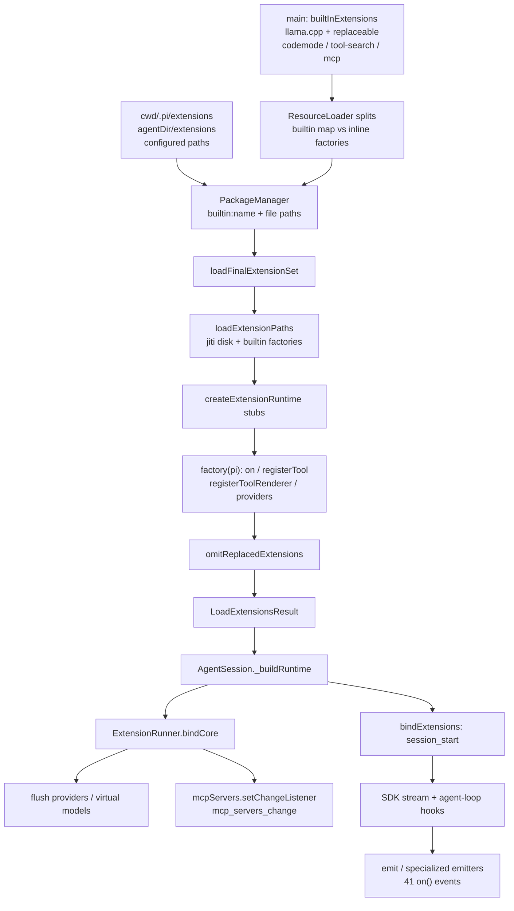

> `spine.extension-lifecycle` 说明 coding-agent 扩展从 `builtInExtensions` / 磁盘发现、shared `ExtensionRuntime`、factory 注册（含 `registerToolRenderer`）、replaceable 内置替换、`ExtensionRunner.bindCore`、`mcp_servers_change`，到 `AgentSession` / SDK / `pi-agent-core` loop hook 的端到端主线。`ExtensionAPI.on` 有 **41** 个 overload。

## 能回答的问题

- CLI 的 `builtInExtensions` 有哪些？哪些 `replaceable`？`builtin:<name>` 怎样进入 `ResourceLoader`？
- `discoverAndLoadExtensions` 会从哪些位置发现 extension entry points？
- factory load 时哪些 API 写入 `Extension` collections，哪些 action 因为 runtime 未绑定而报错？
- `registerToolRenderer`、`registerMcpServer`、provider / virtual-model 注册为什么分 factory-commit 与 `bindCore` 两段？
- `omitReplacedExtensions` 何时丢掉内置 `codemode` / `tool-search` / `mcp`？
- `mcp_servers_change` 何时 emit？没有 handler 时 runner 做什么？
- `ExtensionAPI.on` 的 41 个事件名、通用 `emit` 与专用 emitter 的短路规则是什么？
- SDK provider/context hooks 与 agent-core tool lifecycle hooks 怎样接到 runner？

```mermaid
flowchart TD
  A["main: builtInExtensions<br/>llama.cpp + replaceable<br/>codemode / tool-search / mcp"] --> B["ResourceLoader splits<br/>builtin map vs inline factories"]
  C["cwd/.pi/extensions<br/>agentDir/extensions<br/>configured paths"] --> D["PackageManager<br/>builtin:name + file paths"]
  B --> D
  D --> E["loadFinalExtensionSet"]
  E --> F["loadExtensionPaths<br/>jiti disk + builtin factories"]
  F --> G["createExtensionRuntime stubs"]
  G --> H["factory(pi): on / registerTool<br/>registerToolRenderer / providers"]
  H --> I["omitReplacedExtensions"]
  I --> J["LoadExtensionsResult"]
  J --> K["AgentSession._buildRuntime"]
  K --> L["ExtensionRunner.bindCore"]
  L --> M["flush providers / virtual models"]
  L --> N["mcpServers.setChangeListener<br/>mcp_servers_change"]
  K --> O["bindExtensions: session_start"]
  O --> P["SDK stream + agent-loop hooks"]
  P --> Q["emit / specialized emitters<br/>41 on() events"]
```

## 端到端步骤

1. 产品 CLI 入口 `main()` 把 `builtInExtensions` 与可选 `options.extensionFactories` 拼成 `extensionFactories`，再交给 package/config 命令和 `ResourceLoader`。[E: packages/coding-agent/src/main.ts:575] `builtInExtensions` 是 4 个 `InlineExtension`：不可替换的 `llama.cpp`（`builtin: true`），以及 `replaceable: true` 的 `codemode`、`tool-search`、`mcp`。[E: packages/coding-agent/src/extensions/index.ts:7] [E: packages/coding-agent/src/extensions/index.ts:8] [E: packages/coding-agent/src/extensions/index.ts:11] [E: packages/coding-agent/src/extensions/index.ts:12] [E: packages/coding-agent/src/extensions/index.ts:13] 第三方扩展若注册同名 tool/command/flag（例如 `codemode`、`tool_search`、`/mcp`），`omitReplacedExtensions` 会丢掉对应 replaceable 内置项，而不是并行跑两份。[E: packages/coding-agent/src/core/resource-loader.ts:135]

2. `ResourceLoader` 把 `builtin: true` 的 factory 放进 `builtinExtensions` map，其余（纯 factory 或非 builtin named）留在 `extensionFactories`；`DefaultPackageManager` 收到 builtin 名字列表。[E: packages/coding-agent/src/core/resource-loader.ts:374] [E: packages/coding-agent/src/core/resource-loader.ts:375] [E: packages/coding-agent/src/core/resource-loader.ts:380] Package manager 为每个名字生成 `builtin:<name>` 资源，默认启用，直到 user/project `extensions` 设置用 `-builtin:mcp` 这类 override 关掉。[E: packages/coding-agent/src/core/package-manager.ts:973] [E: packages/coding-agent/src/core/package-manager.ts:974] [E: packages/coding-agent/src/core/source-info.ts:15] `builtin: true` 的扩展以 `builtin:<name>` 资源加载：`loadExtensionPaths` 把它们标 `hidden = true`，预信任扫描滤掉 `builtin:` 路径，因此它们在 project trust 解析之后才进入 runner，不能处理 `project_trust`。[E: packages/coding-agent/src/core/extensions/types.ts:2033] [E: packages/coding-agent/src/core/resource-loader.ts:729] [E: packages/coding-agent/src/core/resource-loader.ts:679]

3. 磁盘发现入口 `discoverAndLoadExtensions(configuredPaths, cwd, agentDir, eventBus)` 解析 `cwd` 与 `agentDir`，用 `allPaths` + `seen` 去重。[E: packages/coding-agent/src/core/extensions/loader.ts:828] [E: packages/coding-agent/src/core/extensions/loader.ts:836] [E: packages/coding-agent/src/core/extensions/loader.ts:837] 顺序是项目 `cwd/${CONFIG_DIR_NAME}/extensions`、全局 `agentDir/extensions`，最后是显式 configured paths。[E: packages/coding-agent/src/core/extensions/loader.ts:850] [E: packages/coding-agent/src/core/extensions/loader.ts:854] [E: packages/coding-agent/src/core/extensions/loader.ts:858] 产品会话通常不直接调用该函数，而是由 `ResourceLoader` / package manager 给出已 enabled 的路径；该函数仍是标准发现语义的权威实现。[I]

4. 目录发现是 shallow discovery：直接文件只接受 `.ts` 或 `.js`；子目录通过 `package.json` 的 `pi.extensions`、`index.ts` 或 `index.js` 变成 entry points，不递归第二层。[E: packages/coding-agent/src/core/extensions/loader.ts:736] [E: packages/coding-agent/src/core/extensions/loader.ts:749] [E: packages/coding-agent/src/core/extensions/loader.ts:753] [E: packages/coding-agent/src/core/extensions/loader.ts:770] [E: packages/coding-agent/src/core/extensions/loader.ts:805] [E: packages/coding-agent/src/core/extensions/loader.ts:812]

5. `loadExtensionsInternal` 为一批 paths 创建或复用同一个 `EventBus` 和同一个 `ExtensionRuntime`，再逐个 `loadExtension`，返回共享的 `resolvedRuntime`。[E: packages/coding-agent/src/core/extensions/loader.ts:688] [E: packages/coding-agent/src/core/extensions/loader.ts:689] [E: packages/coding-agent/src/core/extensions/loader.ts:710] [E: packages/coding-agent/src/core/extensions/loader.ts:714] 同一次 load 里的 `pi` 对象共享 runtime，是由该 `resolvedRuntime` 传入每次 `loadExtension` 推出的结构性结论。[I]

6. 磁盘模块用 `jiti.import(extensionPath, { default: true })` 取 default export，非函数则记 load error。[E: packages/coding-agent/src/core/extensions/loader.ts:581] [E: packages/coding-agent/src/core/extensions/loader.ts:583] [E: packages/coding-agent/src/core/extensions/loader.ts:647] builtin 路径不走 jiti：`loadExtensionPaths` 用 `loadExtensionFromFactory(builtin.factory, ..., path)`，并写 `hidden = true`、`replaceable = builtin.replaceable === true`。[E: packages/coding-agent/src/core/resource-loader.ts:722] [E: packages/coding-agent/src/core/resource-loader.ts:729] [E: packages/coding-agent/src/core/resource-loader.ts:730] factory 类型允许 sync 或 async：`ExtensionFactory = (pi: ExtensionAPI) => void | Promise<void>`。[E: packages/coding-agent/src/core/extensions/types.ts:2004] [E: packages/coding-agent/src/core/extensions/loader.ts:624]

7. `createExtensionRuntime()` 在 loader 阶段创建未绑定 runtime：action methods 先指向 `notInitialized`，调用会抛 “loading 阶段不能调用 action methods”。[E: packages/coding-agent/src/core/extensions/loader.ts:157] [E: packages/coding-agent/src/core/extensions/loader.ts:159] `refreshTools` 是 load 阶段允许的 no-op，因为 `registerTool()` 在 bind 前合法。[E: packages/coding-agent/src/core/extensions/loader.ts:181] runtime 还带 `pendingProviderRegistrations`、`pendingNativeProviderRegistrations`、`pendingVirtualModelRegistrations` 和 `mcpServers: new McpServerRegistry()`。[E: packages/coding-agent/src/core/extensions/loader.ts:187] [E: packages/coding-agent/src/core/extensions/loader.ts:189] [E: packages/coding-agent/src/core/extensions/loader.ts:190]

8. `createExtensionAPI` 把注册写进当前 `Extension`：`on` → `handlers`，`registerTool` → `tools`（`parameters` 必须是非 null、非 array 的 object schema，否则 throw），`registerCommand` → `commands`，`registerShortcut` → `shortcuts`，`registerFlag` → `flags`，`registerMessageRenderer` → `messageRenderers`，`registerToolRenderer` → `extension.toolRenderers` 数组。[E: packages/coding-agent/src/core/extensions/loader.ts:272] [E: packages/coding-agent/src/core/extensions/loader.ts:289] [E: packages/coding-agent/src/core/extensions/loader.ts:291] [E: packages/coding-agent/src/core/extensions/loader.ts:303] [E: packages/coding-agent/src/core/extensions/loader.ts:367] [E: packages/coding-agent/src/core/extensions/loader.ts:370] Action methods 先 `assertActive()` 再委托 shared runtime，例如 `sendMessage`、`getActiveTools`、`getCommands`、`setModel`。[E: packages/coding-agent/src/core/extensions/loader.ts:381] [E: packages/coding-agent/src/core/extensions/loader.ts:416] [E: packages/coding-agent/src/core/extensions/loader.ts:436] [E: packages/coding-agent/src/core/extensions/loader.ts:441]

9. Provider / MCP / virtual-model 写入不在 factory 执行当下立刻打进 registry，而是走 `applyRuntimeChange`：factory 仍在 `"loading"` 时推进 `pendingRuntimeChanges`，`commit()` 成功后才 apply；factory 抛错则 `discard()`，pending 丢弃且 API 变 `"failed"`。[E: packages/coding-agent/src/core/extensions/loader.ts:260] [E: packages/coding-agent/src/core/extensions/loader.ts:532] [E: packages/coding-agent/src/core/extensions/loader.ts:538] [E: packages/coding-agent/src/core/extensions/loader.ts:542] `registerProvider(name, config)` 最终调用 `runtime.registerProvider`（pre-bind 时推进 `pendingProviderRegistrations`）；传入 native `Provider` 对象则走 `registerNativeProvider`。llama.cpp 内置扩展就是 `pi.registerProvider(provider.provider)`。[E: packages/coding-agent/src/core/extensions/loader.ts:214] [E: packages/coding-agent/src/core/extensions/loader.ts:217] [E: packages/coding-agent/src/core/extensions/loader.ts:456] [E: packages/coding-agent/src/core/extensions/loader.ts:463] [E: packages/coding-agent/src/extensions/llama/index.ts:44] `registerVirtualModel` / `registerMcpServer` 同样经 `applyRuntimeChange`；MCP 服务器写入 `runtime.mcpServers`，同名或 namespace（`-`/`_` 折叠）冲突会 throw。[E: packages/coding-agent/src/core/extensions/loader.ts:226] [E: packages/coding-agent/src/core/extensions/loader.ts:471] [E: packages/coding-agent/src/core/extensions/loader.ts:478] [E: packages/coding-agent/src/core/extensions/loader.ts:487]

10. 三个 replaceable 内置 factory 只做贡献点注册：`codemode` 注册工具 `codemode` 且 `defaultActive: false`；`tool-search` 注册 `tool_search` 且 `defaultActive: false`；`mcp` 注册 `/mcp` 命令、MCP 工具渲染器，并订阅 `mcp_servers_change`。[E: packages/coding-agent/src/extensions/codemode/index.ts:33] [E: packages/coding-agent/src/extensions/codemode/index.ts:41] [E: packages/coding-agent/src/extensions/tool-search/index.ts:14] [E: packages/coding-agent/src/extensions/mcp/index.ts:1141] [E: packages/coding-agent/src/extensions/mcp/index.ts:363] [E: packages/coding-agent/src/extensions/mcp/index.ts:1097] `registerToolRenderer` 的类型语义是：解析器按 extension load order 运行，`next()` 返回后续 resolver 或已注册工具的 renderers，因此 MCP 可在 server 尚未连接时为 `mcp__<server>__<tool>` 画出调用。[E: packages/coding-agent/src/core/extensions/types.ts:1683] [E: packages/coding-agent/src/core/extensions/types.ts:655] [E: packages/coding-agent/src/extensions/mcp/index.ts:364]

11. `ResourceLoader.reload()` 从 package manager 取 enabled extension paths 与 CLI `-e` sources；`noExtensions` 时只保留 CLI extensions，再 `loadFinalExtensionSet()` 写入 `this.extensionsResult`。[E: packages/coding-agent/src/core/resource-loader.ts:521] [E: packages/coding-agent/src/core/resource-loader.ts:569] [E: packages/coding-agent/src/core/resource-loader.ts:574] [E: packages/coding-agent/src/core/resource-loader.ts:584] 预信任扫描会滤掉 `builtin:` 路径，因为 builtin 必须等 trust 结束后才能加载，且已加载的扩展不能再卸。[E: packages/coding-agent/src/core/resource-loader.ts:679]

12. `loadFinalExtensionSet()` 复用 pre-trust 的 runtime（若有），对 remaining paths 调用 `loadExtensionPaths`（磁盘 jiti + `builtin:<name>` factory），再加载非 builtin inline factories，按 `extensionPaths` 顺序拼 `orderedExtensions`，最后 `omitReplacedExtensions`。[E: packages/coding-agent/src/core/resource-loader.ts:757] [E: packages/coding-agent/src/core/resource-loader.ts:763] [E: packages/coding-agent/src/core/resource-loader.ts:766] [E: packages/coding-agent/src/core/resource-loader.ts:773] `omitReplacedExtensions` 先收集非 replaceable 扩展已占用的 `tool:` / `command:` / `flag:` 名；replaceable 扩展若撞名则被丢掉。丢掉 builtin 时写入 warning，提示第三方扩展注册了同名 tool/command/flag。[E: packages/coding-agent/src/core/resource-loader.ts:120] [E: packages/coding-agent/src/core/resource-loader.ts:131] [E: packages/coding-agent/src/core/resource-loader.ts:135] [E: packages/coding-agent/src/core/resource-loader.ts:140] `omitReplacedExtensions` 发生在 factory 已经 `loadExtensionFromFactory` 之后，所以被替换的 builtin 仍会跑完 factory；replaceable 扩展应只注册 tools/commands/flags/handlers。[E: packages/coding-agent/src/core/resource-loader.ts:722] [E: packages/coding-agent/src/core/resource-loader.ts:773] [I]

13. `AgentSession._buildRuntime()` 从 `_resourceLoader.getExtensions()` 取 `LoadExtensionsResult`，把 flag values 写回 shared runtime，用 `extensions` + `runtime` 构造 `ExtensionRunner`，更新 SDK `extensionRunnerRef.current`，再 `_bindExtensionCore()`、`_applyExtensionBindings()`、`_refreshToolRegistry()`。[E: packages/coding-agent/src/core/agent-session.ts:3582] [E: packages/coding-agent/src/core/agent-session.ts:3589] [E: packages/coding-agent/src/core/agent-session.ts:3597] [E: packages/coding-agent/src/core/agent-session.ts:3599] [E: packages/coding-agent/src/core/agent-session.ts:3606]

14. `ExtensionRunner.bindCore(actions, contextActions, providerActions)` 把 action implementations 复制到 shared runtime（`sendMessage`、tool getters/setters、`getCommands`、`setModel`、thinking accessors、`createContext`）。[E: packages/coding-agent/src/core/extensions/runner.ts:410] [E: packages/coding-agent/src/core/extensions/runner.ts:422] [E: packages/coding-agent/src/core/extensions/runner.ts:437] 同时绑定 context actions，让 handler context 的 `model`、`isIdle()`、`signal`、`compact()` 等读当前 runner 状态。[E: packages/coding-agent/src/core/extensions/runner.ts:440] [E: packages/coding-agent/src/core/extensions/runner.ts:442] [E: packages/coding-agent/src/core/extensions/runner.ts:906] [E: packages/coding-agent/src/core/extensions/runner.ts:920] [E: packages/coding-agent/src/core/extensions/runner.ts:946] 绑定当下立刻给 `runtime.mcpServers` 安装 change listener：之后的 register/unregister 会 `emit({ type: "mcp_servers_change", servers })` 并 `reportUnhandledMcpServers()`；load 阶段登记的 server 则等 `session_start` 再被 MCP 扩展读取。[E: packages/coding-agent/src/core/extensions/runner.ts:458] [E: packages/coding-agent/src/core/extensions/runner.ts:459] [E: packages/coding-agent/src/core/mcp-servers.ts:316] [E: packages/coding-agent/src/core/extensions/types.ts:721]

15. `bindCore` 先 flush `pendingProviderRegistrations`，再 flush `pendingNativeProviderRegistrations`，再 flush `pendingVirtualModelRegistrations`；有 `providerActions` 时走注入 action，否则写 `modelRegistry`，错误 `emitError`。[E: packages/coding-agent/src/core/extensions/runner.ts:464] [E: packages/coding-agent/src/core/extensions/runner.ts:481] [E: packages/coding-agent/src/core/extensions/runner.ts:502] flush 后 `registerProvider` / `registerNativeProvider` / `unregisterProvider` / virtual-model APIs 被替换成立即生效的函数。[E: packages/coding-agent/src/core/extensions/runner.ts:518] [E: packages/coding-agent/src/core/extensions/runner.ts:539] `AgentSession._bindExtensionCore` 注入的 provider actions 写 `ModelRuntime` 并刷新当前模型；`getCommands()` 合并 extension commands、prompt templates 和 skills。[E: packages/coding-agent/src/core/agent-session.ts:3315] [E: packages/coding-agent/src/core/agent-session.ts:3336] [E: packages/coding-agent/src/core/agent-session.ts:3424] [E: packages/coding-agent/src/core/agent-session.ts:3428]

16. Tool / command / renderer 在 runner 层的可见入口：`getAllRegisteredTools()` 按 extension 顺序遍历，同名 tool 只保留首个。[E: packages/coding-agent/src/core/extensions/runner.ts:630] [E: packages/coding-agent/src/core/extensions/runner.ts:634] `resolveRegisteredCommands` 给同名命令 `name:occurrence` 形式的 `invocationName`。[E: packages/coding-agent/src/core/extensions/runner.ts:807] [E: packages/coding-agent/src/core/extensions/runner.ts:825] `resolveToolRenderers(toolName, base)` 按 load order 把各扩展的 `toolRenderers` 链成 `next()`。[E: packages/coding-agent/src/core/extensions/runner.ts:790] [E: packages/coding-agent/src/core/extensions/runner.ts:793]

17. `AgentSession.bindExtensions()` 写入 UI / mode / command context / error listener，对当前 runner `_applyExtensionBindings`，emit `session_start`，然后 `reportUnhandledMcpServers()`，再把 `resources_discover` 贡献的 skill/prompt/theme 路径合入 resource loader。[E: packages/coding-agent/src/core/agent-session.ts:3211] [E: packages/coding-agent/src/core/agent-session.ts:3231] [E: packages/coding-agent/src/core/agent-session.ts:3232] [E: packages/coding-agent/src/core/agent-session.ts:3233] [E: packages/coding-agent/src/core/agent-session.ts:3234] 若没有任何扩展处理 `mcp_servers_change`（典型：第三方扩展替换了内置 `mcp` 却不连接服务器），`reportUnhandledMcpServers` 对每个已注册 server `emitError`。[E: packages/coding-agent/src/core/extensions/runner.ts:752] [E: packages/coding-agent/src/core/extensions/runner.ts:753] [E: packages/coding-agent/src/core/extensions/runner.ts:760]

18. `_refreshToolRegistry()` 把 extension tools 与 SDK `customTools` 合并进 definition registry，用 `wrapRegisteredTools(..., runner)` 包成 `AgentTool`，与 builtin tools 一起写入 `_toolRegistry`，再按 allowlist、`includeAllExtensionTools` 或“新注册且 `defaultActive !== false`”规则更新 active names。[E: packages/coding-agent/src/core/agent-session.ts:3457] [E: packages/coding-agent/src/core/agent-session.ts:3500] [E: packages/coding-agent/src/core/agent-session.ts:3513] [E: packages/coding-agent/src/core/agent-session.ts:3530] [E: packages/coding-agent/src/core/agent-session.ts:3554] `codemode` / `tool_search` 因 `defaultActive: false` 不会在注册时自动进入模型 tool list，需 `--tools`、`defaultTools`、`setActiveTools()`，或 MCP 扩展按 exposure 主动激活。[E: packages/coding-agent/src/extensions/codemode/index.ts:41] [I]

19. SDK 创建 `extensionRunnerRef`，在 `onPayload` 里调用 `emitBeforeProviderRequest`，`onResponse` emit `after_provider_response`，`onProviderStreamEvent` emit `provider_stream_event`，`transformHeaders` 走 `emitBeforeProviderHeaders`，`transformContext` 调用 `runner.emitContext(messages)`；创建 `AgentSession` 时把同一个 ref 传入，让 `_buildRuntime()` 更新后的 runner 被 stream hooks 读到。[E: packages/coding-agent/src/core/sdk.ts:309] [E: packages/coding-agent/src/core/sdk.ts:358] [E: packages/coding-agent/src/core/sdk.ts:408] [E: packages/coding-agent/src/core/sdk.ts:412] [E: packages/coding-agent/src/core/sdk.ts:415] [E: packages/coding-agent/src/core/sdk.ts:451]

20. `pi-agent-core` 的 `Agent.createLoopConfig()` 把 `beforeToolCall` / `afterToolCall` / `transformContext` 传给 loop；`runAgentLoop` 在 LLM conversion 前调用 `transformContext()`，因此 `emitContext()` 位于 provider request 前置上下文阶段。[E: packages/agent/src/agent.ts:480] [E: packages/agent/src/agent.ts:494] [E: packages/agent/src/agent-loop.ts:390] `emitContext()` 先跑看不见 system messages 的 `context` handlers，再跑拥有完整 transcript 的 `context_with_system` handlers。[E: packages/coding-agent/src/core/extensions/runner.ts:1298] [E: packages/coding-agent/src/core/extensions/runner.ts:1305] [E: packages/coding-agent/src/core/extensions/runner.ts:1329] `AgentSession._installAgentToolHooks()` 把 `agent.beforeToolCall` 接到 `runner.emitToolCall()`、`agent.afterToolCall` 接到 `runner.emitToolResult()`；agent loop 在工具执行前后调用这两个 hooks。[E: packages/coding-agent/src/core/agent-session.ts:624] [E: packages/coding-agent/src/core/agent-session.ts:640] [E: packages/coding-agent/src/core/agent-session.ts:662] [E: packages/agent/src/agent-loop.ts:727] [E: packages/agent/src/agent-loop.ts:864]

21. 通用 `ExtensionRunner.emit` 按 `snapshotEventHandlers` 顺序遍历 handler；session-before 类事件（`session_before_switch` / `fork` / `compact` / `tree`）若返回 `cancel: true` 立即短路。[E: packages/coding-agent/src/core/extensions/runner.ts:1089] [E: packages/coding-agent/src/core/extensions/runner.ts:1093] [E: packages/coding-agent/src/core/extensions/runner.ts:1080] [E: packages/coding-agent/src/core/extensions/runner.ts:1100] handler 抛错转成 `ExtensionError` listener 事件，不直接抛给 caller。[E: packages/coding-agent/src/core/extensions/runner.ts:1104] 专用 emitter 负责可变或可聚合事件：`emitToolCall` 遇到 `block` 立即返回并阻止后续 handler；`emitToolResult` overlay `content` / `details` / `structuredContent` / `isError` / `usage`（替换 `content` 且未给新 `structuredContent` 时删除旧 structured）；`emitMessageEnd` 只允许同 role 替换；`emitBoundary` 分发可行动的 `turn_end` / `agent_before_settle`；`emitBeforeProviderRequest` 链式替换 payload；`emitInput` 可 transform 或 `handled` 短路。[E: packages/coding-agent/src/core/extensions/runner.ts:1252] [E: packages/coding-agent/src/core/extensions/runner.ts:1183] [E: packages/coding-agent/src/core/extensions/runner.ts:1194] [E: packages/coding-agent/src/core/extensions/runner.ts:1204] [E: packages/coding-agent/src/core/extensions/runner.ts:1144] [E: packages/coding-agent/src/core/extensions/runner.ts:1029] [E: packages/coding-agent/src/core/extensions/runner.ts:1361] [E: packages/coding-agent/src/core/extensions/runner.ts:1541]

22. `ExtensionAPI.on` 从 `project_trust` 到 `input` 共 **41** 个 overload，每个返回 unsubscribe `() => void`。事件名按声明顺序：`project_trust`、`resources_discover`、`session_start`、`session_info_changed`、`session_before_switch`、`session_before_fork`、`session_before_compact`、`session_compact`、`session_compact_failed`、`session_shutdown`、**`mcp_servers_change`**、`session_before_tree`、`session_tree`、`context`、`context_with_system`、`cache_warming_decision`、`before_provider_request`、`before_provider_headers`、`after_provider_response`、`provider_stream_event`、`before_agent_start`、`agent_start`、`agent_end`、`agent_before_settle`、`agent_settled`、`ui_prompt_start`、`ui_prompt_end`、`turn_start`、`turn_end`、`message_start`、`message_update`、`message_end`、`tool_execution_start`、`tool_execution_update`、`tool_execution_end`、`model_select`、`thinking_level_select`、`tool_call`、`tool_result`、`user_bash`、`input`。[E: packages/coding-agent/src/core/extensions/types.ts:1556] [E: packages/coding-agent/src/core/extensions/types.ts:1578] [E: packages/coding-agent/src/core/extensions/types.ts:1623] `mcp_servers_change` 的 payload 是当前全部 `RegisteredMcpServer`；处理该事件等于宣称“我负责连接已注册 MCP 服务器”。[E: packages/coding-agent/src/core/extensions/types.ts:721] [E: packages/coding-agent/src/core/extensions/types.ts:1578] 内置 MCP 扩展在 `sessionActive` 时用该事件连接新 server、关闭被移除的 server。[E: packages/coding-agent/src/extensions/mcp/index.ts:1097] 逐事件字段与返回值由 [ref.coding-agent.extension-events](../reference/extension-events.md) 覆盖。

23. `before_agent_start` 在 runner 侧接收 prompt、images、system prompt 和 system prompt options；handler 返回的 `message` 被收集，`systemPrompt` 写成 `forceSystemPrompt`。[E: packages/coding-agent/src/core/extensions/runner.ts:1420] [E: packages/coding-agent/src/core/extensions/runner.ts:1453] [E: packages/coding-agent/src/core/extensions/runner.ts:1455] `AgentSession.prompt()` 在构造 user messages **之前**调用它，随后把返回的 custom messages 追加进 messages，并用返回的 `systemPromptOptions` 准备 prompt/tool loadout。[E: packages/coding-agent/src/core/agent-session.ts:2015] [E: packages/coding-agent/src/core/agent-session.ts:2032] [E: packages/coding-agent/src/core/agent-session.ts:2047] [E: packages/coding-agent/src/core/agent-session.ts:2058]

## 关键决策点

- 扩展加载分成 registration phase 和 bound runtime phase：factory 适合声明 handlers / tools / commands / flags / shortcuts / renderers（含 `registerToolRenderer`）；action methods 在 `bindCore` 前是 runtime stub。[E: packages/coding-agent/src/core/extensions/loader.ts:157] [E: packages/coding-agent/src/core/extensions/loader.ts:367] [E: packages/coding-agent/src/core/extensions/runner.ts:410]
- 内置扩展是资源而不是永远强制的 inline factory：`llama.cpp` 不可替换；`codemode` / `tool-search` / `mcp` 可被同名 tool/command/flag 的第三方扩展替换。`omitReplacedExtensions` 在 factory 跑完后丢掉 replaceable 那一份。[E: packages/coding-agent/src/extensions/index.ts:8] [E: packages/coding-agent/src/core/resource-loader.ts:135]
- Provider / virtual-model 是两条（加 virtual 第三条）pre-bind queue + post-bind immediate；MCP 服务器登记在 `McpServerRegistry`，bind 后靠 `mcp_servers_change` 通知连接方，而不是 loader 自己去连。[E: packages/coding-agent/src/core/extensions/runner.ts:459] [E: packages/coding-agent/src/core/mcp-servers.ts:316] 这是从 queue flush、change listener 和 registry 只 `register`/`list` 推出的结构性解释。[I]
- Extension context 的 getters/methods 每次访问都 `assertActive`；reload 或 session replacement 会 `invalidate` 旧 runtime/ctx，阻止继续使用 captured `pi` 或 command ctx。[E: packages/coding-agent/src/core/extensions/runner.ts:722] [E: packages/coding-agent/src/core/extensions/runner.ts:731] [E: packages/coding-agent/src/core/extensions/runner.ts:882]
- 产品层接入点：`ResourceLoader` 持有 `LoadExtensionsResult`，`AgentSession` 构造并绑定 `ExtensionRunner`，SDK/`pi-agent-core` loop 转发 provider/context/tool hooks。可复用 session/harness 不在 agent-core，而在 `pi-durable`；本节点不经过那条路径。[E: packages/coding-agent/src/core/resource-loader.ts:584] [E: packages/coding-agent/src/core/agent-session.ts:3589] [E: packages/coding-agent/src/core/sdk.ts:412] [E: packages/agent/src/agent-loop.ts:390]

## 未证实项

- 无。

## 指向 T1/T2 深挖

- [surface.extensions.api](../surface/extensions/api.md): `ExtensionAPI`、`ExtensionFactory`、`ExtensionContext` 的 public surface。
- [surface.extensions.contribution-points](../surface/extensions/contribution-points.md): `registerTool` / `registerCommand` / `registerToolRenderer` 等贡献点。
- [surface.extensions.events](../surface/extensions/events.md): 事件订阅与专用 emitter 的产品面。
- [ref.coding-agent.extension-events](../reference/extension-events.md): 41 个 `on()` 事件的逐实例 catalog。
- [subsys.coding-agent.extension-loader](../subsystems/coding-agent/extension-loader.md): jiti import、cache、manifest discovery、inline/builtin factory load。
- [subsys.coding-agent.extension-runner](../subsystems/coding-agent/extension-runner.md): handler dispatch、context、error reporting、mode/UI binding。
- [surface.mcp.overview](../surface/mcp/overview.md): `/mcp`、`.pi/mcp.json`、exposure 的用户可见面。
- [subsys.coding-agent.mcp](../subsystems/coding-agent/mcp.md): 内置 replaceable `mcp` 扩展与 `McpServerRegistry`。
- [surface.codemode.overview](../surface/codemode/overview.md): `codemode` 工具与 settings。
- [subsys.coding-agent.codemode](../subsystems/coding-agent/codemode.md): 内置 replaceable `codemode` 与 `tool-search` 协作。

## Sources

- packages/coding-agent/src/extensions/index.ts
- packages/coding-agent/src/extensions/llama/index.ts
- packages/coding-agent/src/extensions/codemode/index.ts
- packages/coding-agent/src/extensions/tool-search/index.ts
- packages/coding-agent/src/extensions/mcp/index.ts
- packages/coding-agent/src/core/extensions/loader.ts
- packages/coding-agent/src/core/extensions/runner.ts
- packages/coding-agent/src/core/extensions/types.ts
- packages/coding-agent/src/core/mcp-servers.ts
- packages/coding-agent/src/core/source-info.ts
- packages/coding-agent/src/core/package-manager.ts
- packages/coding-agent/src/core/resource-loader.ts
- packages/coding-agent/src/core/agent-session.ts
- packages/coding-agent/src/core/sdk.ts
- packages/coding-agent/src/main.ts
- packages/agent/src/agent.ts
- packages/agent/src/agent-loop.ts

## 相关

- [surface.extensions.api](../surface/extensions/api.md)
- [surface.extensions.contribution-points](../surface/extensions/contribution-points.md)
- [surface.extensions.events](../surface/extensions/events.md)
- [subsys.coding-agent.extension-loader](../subsystems/coding-agent/extension-loader.md)
- [subsys.coding-agent.extension-runner](../subsystems/coding-agent/extension-runner.md)
- [ref.coding-agent.extension-events](../reference/extension-events.md)
- [surface.mcp.overview](../surface/mcp/overview.md)
- [surface.codemode.overview](../surface/codemode/overview.md)
- [subsys.coding-agent.mcp](../subsystems/coding-agent/mcp.md)
- [subsys.coding-agent.codemode](../subsystems/coding-agent/codemode.md)
