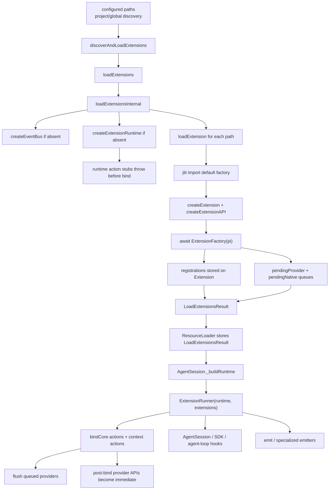

> `spine.extension-lifecycle` 说明 extension loader、shared runtime、runner binding、event dispatch, 以及 resource loader / `AgentSession` / SDK stream hooks 如何把 extension runner 接入产品会话和 agent runtime。

## 能回答的问题

- `discoverAndLoadExtensions` 会从哪些位置发现 extension entry points?
- extension factory load 时哪些 API 会先写入 extension collections, 哪些 action 会因为 runtime 未绑定而报错?
- `ExtensionRuntime` 为什么先由 loader 创建, 再由 `ExtensionRunner.bindCore` 填入真实动作?
- provider registration 为什么有 load 阶段 queue 和 bind 后 immediate 两种行为?
- resource loader 和 `AgentSession` 怎样把 `LoadExtensionsResult` 变成产品会话中的 runner?
- SDK provider/context hooks 与 agent tool lifecycle hooks 怎样接到 runner?
- event handler 的 dispatch 顺序、可修改结果和短路规则是什么?

```mermaid
flowchart TD
  A["configured paths<br/>project/global discovery"] --> B["discoverAndLoadExtensions"]
  B --> C["loadExtensions"]
  C --> D["loadExtensionsInternal"]
  D --> E["createEventBus if absent"]
  D --> F["createExtensionRuntime if absent"]
  F --> G["runtime action stubs throw before bind"]
  D --> H["loadExtension for each path"]
  H --> I["jiti import default factory"]
  I --> J["createExtension + createExtensionAPI"]
  J --> K["await ExtensionFactory(pi)"]
  K --> L["registrations stored on Extension"]
  K --> M["pendingProvider + pendingNative queues"]
  L --> N["LoadExtensionsResult"]
  M --> N
  N --> O["ResourceLoader stores LoadExtensionsResult"]
  O --> P["AgentSession._buildRuntime"]
  P --> Q["ExtensionRunner(runtime, extensions)"]
  Q --> R["bindCore actions + context actions"]
  R --> S["flush queued providers"]
  R --> T["post-bind provider APIs become immediate"]
  Q --> U["AgentSession / SDK / agent-loop hooks"]
  Q --> V["emit / specialized emitters"]
```

## 端到端步骤

1. 标准发现入口 `discoverAndLoadExtensions(configuredPaths, cwd, agentDir, eventBus)` 会解析 `cwd` 与 `agentDir`, 建立 `allPaths` 和 `seen` 去重集合。[E: packages/coding-agent/src/core/extensions/loader.ts:757] [E: packages/coding-agent/src/core/extensions/loader.ts:758] [E: packages/coding-agent/src/core/extensions/loader.ts:759] [E: packages/coding-agent/src/core/extensions/loader.ts:760] 它先扫描项目级 `cwd/${CONFIG_DIR_NAME}/extensions`, 再扫描全局 `agentDir/extensions`, 最后处理显式 configured paths。[E: packages/coding-agent/src/core/extensions/loader.ts:778] [E: packages/coding-agent/src/core/extensions/loader.ts:774] [E: packages/coding-agent/src/core/extensions/loader.ts:777] [E: packages/coding-agent/src/core/extensions/loader.ts:778] [E: packages/coding-agent/src/core/extensions/loader.ts:781]

2. 目录发现规则是 shallow discovery: 直接文件只接受 `.ts` 或 `.js`, 子目录则通过 `package.json` 的 `pi.extensions`、`index.ts` 或 `index.js` 变成 entry points。[E: packages/coding-agent/src/core/extensions/loader.ts:659] [E: packages/coding-agent/src/core/extensions/loader.ts:660] [E: packages/coding-agent/src/core/extensions/loader.ts:676] [E: packages/coding-agent/src/core/extensions/loader.ts:677] [E: packages/coding-agent/src/core/extensions/loader.ts:680] [E: packages/coding-agent/src/core/extensions/loader.ts:697] [E: packages/coding-agent/src/core/extensions/loader.ts:693] [E: packages/coding-agent/src/core/extensions/loader.ts:694] [E: packages/coding-agent/src/core/extensions/loader.ts:697] [E: packages/coding-agent/src/core/extensions/loader.ts:728] [E: packages/coding-agent/src/core/extensions/loader.ts:735]

3. `loadExtensionsInternal` 为一批 paths 创建或复用同一个 `EventBus` 和同一个 `ExtensionRuntime`, 然后逐个调用 `loadExtension` 收集 `extensions` 与 `errors`, 最后返回同一个 `resolvedRuntime`。[E: packages/coding-agent/src/core/extensions/loader.ts:612] [E: packages/coding-agent/src/core/extensions/loader.ts:607] [E: packages/coding-agent/src/core/extensions/loader.ts:611] [E: packages/coding-agent/src/core/extensions/loader.ts:612] [E: packages/coding-agent/src/core/extensions/loader.ts:619] [E: packages/coding-agent/src/core/extensions/loader.ts:619] [E: packages/coding-agent/src/core/extensions/loader.ts:633] [E: packages/coding-agent/src/core/extensions/loader.ts:637] 因此同一次 load 中的 extension API 共享一个 runtime 是由 `resolvedRuntime` 传入每次 `loadExtension` 推出的结构性结论。[I]

4. loader 导入 extension module 时使用 `jiti.import(extensionPath, { default: true })`, 把 default export 当作 `ExtensionFactory`, 并在非函数时返回 load error。[E: packages/coding-agent/src/core/extensions/loader.ts:501] [E: packages/coding-agent/src/core/extensions/loader.ts:502] [E: packages/coding-agent/src/core/extensions/loader.ts:503] [E: packages/coding-agent/src/core/extensions/loader.ts:570] 每个 factory 会拿到 `createExtensionAPI(extension, runtime, cwd, eventBus)` 产生的 `pi` 对象并被 `await factory(api)` 执行; 类型层声明 factory 可 sync 或 async。[E: packages/coding-agent/src/core/extensions/loader.ts:544] [E: packages/coding-agent/src/core/extensions/loader.ts:545] [E: packages/coding-agent/src/core/extensions/loader.ts:547] [E: packages/coding-agent/src/core/extensions/types.ts:1762]

5. `createExtensionRuntime` 在 loader 阶段创建未绑定 runtime: action methods 先指向 `notInitialized`, 该 stub 会抛出“loading 阶段不能调用 action methods”的错误。[E: packages/coding-agent/src/core/extensions/loader.ts:153] [E: packages/coding-agent/src/core/extensions/loader.ts:154] [E: packages/coding-agent/src/core/extensions/loader.ts:155] [E: packages/coding-agent/src/core/extensions/loader.ts:165] [E: packages/coding-agent/src/core/extensions/loader.ts:172] [E: packages/coding-agent/src/core/extensions/loader.ts:177] `registerTool()` 是 load 阶段允许的特例:它要求 `tool.parameters` 是非 null、非 array 的 object schema,否则 load 时 throw;写入 `extension.tools` 后只调用此时为 no-op 的 `runtime.refreshTools()`。[E: packages/coding-agent/src/core/extensions/loader.ts:176] [E: packages/coding-agent/src/core/extensions/loader.ts:273] [E: packages/coding-agent/src/core/extensions/loader.ts:280] [E: packages/coding-agent/src/core/extensions/loader.ts:280] [E: packages/coding-agent/src/core/extensions/loader.ts:289]

6. 注册 API 在 load 阶段把贡献写进 `Extension` 的 collections: `on` 写 `handlers`, `registerTool` 写 `tools`, `registerCommand` 写 `commands`, `registerShortcut` 写 `shortcuts`, `registerFlag` 写 `flags`, `registerMessageRenderer` 写 `messageRenderers`。[E: packages/coding-agent/src/core/extensions/loader.ts:280] [E: packages/coding-agent/src/core/extensions/loader.ts:261] [E: packages/coding-agent/src/core/extensions/loader.ts:273] [E: packages/coding-agent/src/core/extensions/loader.ts:280] [E: packages/coding-agent/src/core/extensions/loader.ts:287] [E: packages/coding-agent/src/core/extensions/loader.ts:289] [E: packages/coding-agent/src/core/extensions/loader.ts:307] [E: packages/coding-agent/src/core/extensions/loader.ts:304] [E: packages/coding-agent/src/core/extensions/loader.ts:307] [E: packages/coding-agent/src/core/extensions/loader.ts:317] [E: packages/coding-agent/src/core/extensions/loader.ts:327] [E: packages/coding-agent/src/core/extensions/loader.ts:329]

7. Action methods 不在 load 阶段直接实现业务动作, 而是在 `createExtensionAPI` 中先 `assertActive()` 再委托给 shared runtime; 例如 `sendMessage`、`getActiveTools`、`getCommands`、`setModel` 都是这种模式。[E: packages/coding-agent/src/core/extensions/loader.ts:351] [E: packages/coding-agent/src/core/extensions/loader.ts:242] [E: packages/coding-agent/src/core/extensions/loader.ts:353] [E: packages/coding-agent/src/core/extensions/loader.ts:386] [E: packages/coding-agent/src/core/extensions/loader.ts:388] [E: packages/coding-agent/src/core/extensions/loader.ts:406] [E: packages/coding-agent/src/core/extensions/loader.ts:408] [E: packages/coding-agent/src/core/extensions/loader.ts:406] [E: packages/coding-agent/src/core/extensions/loader.ts:408]

8. Provider contribution 是两阶段、两条 queue: pre-bind 的 `registerProvider(name, config)` 把 `{ name, config, extensionPath }` 推入 `pendingProviderRegistrations`；传入 native `Provider` 对象（llama.cpp 的 `pi.registerProvider(provider.provider)`）则走 `registerNativeProvider`，把 `{ provider, extensionPath }` 推入 `pendingNativeProviderRegistrations`。[E: packages/coding-agent/src/core/extensions/loader.ts:206] [E: packages/coding-agent/src/core/extensions/loader.ts:207] [E: packages/coding-agent/src/core/extensions/loader.ts:209] [E: packages/coding-agent/src/core/extensions/loader.ts:210] [E: packages/coding-agent/src/core/extensions/loader.ts:428] [E: packages/coding-agent/src/extensions/llama/index.ts:44] `unregisterProvider` 同时从两条 pending queue 移除同名/同 id 注册。[E: packages/coding-agent/src/core/extensions/loader.ts:212] [E: packages/coding-agent/src/core/extensions/loader.ts:213] [E: packages/coding-agent/src/core/extensions/loader.ts:214] 类型层在 `ExtensionRuntimeState` 暴露这两条 pending queue 和 register/unregister 槽位, bind 前 queue、bind 后直接写 registry。[E: packages/coding-agent/src/core/extensions/types.ts:1846] [E: packages/coding-agent/src/core/extensions/types.ts:1848] [E: packages/coding-agent/src/core/extensions/types.ts:1861] [E: packages/coding-agent/src/core/extensions/types.ts:1862] [I]

9. `ExtensionRunner.bindCore(actions, contextActions, providerActions)` 会把 action implementations 复制到 shared runtime, 例如 `sendMessage`、`sendUserMessage`、tool getters/setters、`getCommands`、`setModel` 和 thinking level accessors。[E: packages/coding-agent/src/core/extensions/runner.ts:402] [E: packages/coding-agent/src/core/extensions/runner.ts:412] [E: packages/coding-agent/src/core/extensions/runner.ts:413] [E: packages/coding-agent/src/core/extensions/runner.ts:418] [E: packages/coding-agent/src/core/extensions/runner.ts:421] [E: packages/coding-agent/src/core/extensions/runner.ts:422] [E: packages/coding-agent/src/core/extensions/runner.ts:423] [E: packages/coding-agent/src/core/extensions/runner.ts:424] [E: packages/coding-agent/src/core/extensions/runner.ts:425] 它同时绑定 context actions, 让 handler context 的 `model`、`isIdle()`、`signal`、`compact()` 等读取当前 runner 状态。[E: packages/coding-agent/src/core/extensions/runner.ts:428] [E: packages/coding-agent/src/core/extensions/runner.ts:430] [E: packages/coding-agent/src/core/extensions/runner.ts:432] [E: packages/coding-agent/src/core/extensions/runner.ts:436] [E: packages/coding-agent/src/core/extensions/runner.ts:437] [E: packages/coding-agent/src/core/extensions/runner.ts:838] [E: packages/coding-agent/src/core/extensions/runner.ts:852] [E: packages/coding-agent/src/core/extensions/runner.ts:858] [E: packages/coding-agent/src/core/extensions/runner.ts:880]

10. `bindCore` 先 flush `pendingProviderRegistrations`, 再 flush `pendingNativeProviderRegistrations`; 有对应 `providerActions` 时走注入 action, 否则写 `modelRegistry`, 错误则 `emitError`。[E: packages/coding-agent/src/core/extensions/runner.ts:443] [E: packages/coding-agent/src/core/extensions/runner.ts:445] [E: packages/coding-agent/src/core/extensions/runner.ts:448] [E: packages/coding-agent/src/core/extensions/runner.ts:460] [E: packages/coding-agent/src/core/extensions/runner.ts:462] [E: packages/coding-agent/src/core/extensions/runner.ts:465] flush 后 runtime 的 `registerProvider` / `registerNativeProvider` / `unregisterProvider` 被替换成立即生效的函数。[E: packages/coding-agent/src/core/extensions/runner.ts:480] [E: packages/coding-agent/src/core/extensions/runner.ts:487] [E: packages/coding-agent/src/core/extensions/runner.ts:494]

11. Tool contribution 在 runner 层的可见入口是 `getAllRegisteredTools()`: 它按 extension 顺序遍历 `ext.tools.values()`, 对同名 tool 只保留首个注册, 最后返回去重后的 tool 列表。[E: packages/coding-agent/src/core/extensions/runner.ts:587] [E: packages/coding-agent/src/core/extensions/runner.ts:588] [E: packages/coding-agent/src/core/extensions/runner.ts:589] [E: packages/coding-agent/src/core/extensions/runner.ts:590] [E: packages/coding-agent/src/core/extensions/runner.ts:591] [E: packages/coding-agent/src/core/extensions/runner.ts:596]

12. Command contribution 留在 runner 的 registered command surface: `resolveRegisteredCommands` 收集所有 extension commands, 同名命令获得 `name:occurrence` 形式的 `invocationName`, `getRegisteredCommands()` 与 `getCommand(name)` 都从这个解析结果读取。[E: packages/coding-agent/src/core/extensions/runner.ts:739] [E: packages/coding-agent/src/core/extensions/runner.ts:743] [E: packages/coding-agent/src/core/extensions/runner.ts:744] [E: packages/coding-agent/src/core/extensions/runner.ts:746] [E: packages/coding-agent/src/core/extensions/runner.ts:757] [E: packages/coding-agent/src/core/extensions/runner.ts:768] [E: packages/coding-agent/src/core/extensions/runner.ts:779] [E: packages/coding-agent/src/core/extensions/runner.ts:781] [E: packages/coding-agent/src/core/extensions/runner.ts:788] [E: packages/coding-agent/src/core/extensions/runner.ts:789]

13. `ResourceLoader.reload()` 从 package manager 得到 resolved resources 和 CLI extension sources, 抽取 enabled extension paths, 按 `noExtensions` 决定是否只保留 CLI extensions, 再调用 `loadFinalExtensionSet()` 并把结果保存到 `this.extensionsResult`。[E: packages/coding-agent/src/core/resource-loader.ts:460] [E: packages/coding-agent/src/core/resource-loader.ts:461] [E: packages/coding-agent/src/core/resource-loader.ts:484] [E: packages/coding-agent/src/core/resource-loader.ts:503] [E: packages/coding-agent/src/core/resource-loader.ts:508] [E: packages/coding-agent/src/core/resource-loader.ts:510] [E: packages/coding-agent/src/core/resource-loader.ts:513] [E: packages/coding-agent/src/core/resource-loader.ts:523]

14. `loadFinalExtensionSet()` 的主路径调用 `loadExtensionsCached(extensionPaths, cwd, eventBus)`, 再用同一个 runtime 载入 inline factories 并追加 extensions/errors; 有 pre-trust 结果时, remaining paths 也复用 `preTrustExtensions.runtime`, 最后构造新的 `LoadExtensionsResult`。[E: packages/coding-agent/src/core/resource-loader.ts:644] [E: packages/coding-agent/src/core/resource-loader.ts:645] [E: packages/coding-agent/src/core/resource-loader.ts:646] [E: packages/coding-agent/src/core/resource-loader.ts:647] [E: packages/coding-agent/src/core/resource-loader.ts:648] [E: packages/coding-agent/src/core/resource-loader.ts:665] [E: packages/coding-agent/src/core/resource-loader.ts:669] [E: packages/coding-agent/src/core/resource-loader.ts:684] [E: packages/coding-agent/src/core/resource-loader.ts:688]

15. `AgentSession._buildRuntime()` 从 `this._resourceLoader.getExtensions()` 取 `LoadExtensionsResult`, 把 flag values 写回 shared runtime, 用 `extensions` 和 `runtime` 构造 `ExtensionRunner`, 更新 SDK runner ref, 然后调用 `_bindExtensionCore()`、`_applyExtensionBindings()` 和 `_refreshToolRegistry()`。[E: packages/coding-agent/src/core/agent-session.ts:3261] [E: packages/coding-agent/src/core/agent-session.ts:3264] [E: packages/coding-agent/src/core/agent-session.ts:3268] [E: packages/coding-agent/src/core/agent-session.ts:3269] [E: packages/coding-agent/src/core/agent-session.ts:3270] [E: packages/coding-agent/src/core/agent-session.ts:3276] [E: packages/coding-agent/src/core/agent-session.ts:3278] [E: packages/coding-agent/src/core/agent-session.ts:3279] [E: packages/coding-agent/src/core/agent-session.ts:3285]

16. `AgentSession.bindExtensions()` 是产品层绑定入口: 它写入 UI context、mode、command context actions、error listener 等 bindings, 对当前 runner 应用绑定, emit session start, 并触发 extension-discovered resource 扩展路径合入 resource loader。[E: packages/coding-agent/src/core/agent-session.ts:2920] [E: packages/coding-agent/src/core/agent-session.ts:2921] [E: packages/coding-agent/src/core/agent-session.ts:2923] [E: packages/coding-agent/src/core/agent-session.ts:2927] [E: packages/coding-agent/src/core/agent-session.ts:2936] [E: packages/coding-agent/src/core/agent-session.ts:2939] [E: packages/coding-agent/src/core/agent-session.ts:2940] [E: packages/coding-agent/src/core/agent-session.ts:2964] [E: packages/coding-agent/src/core/agent-session.ts:2949] [E: packages/coding-agent/src/core/agent-session.ts:2964]

17. `_bindExtensionCore()` 给 runtime 注入产品动作: `getCommands()` 合并 extension commands、prompt templates 和 skills; core actions 暴露 active/all tools、set active tools、refresh tools; provider actions 写入 `ModelRegistry` 并刷新当前模型。[E: packages/coding-agent/src/core/agent-session.ts:3022] [E: packages/coding-agent/src/core/agent-session.ts:3029] [E: packages/coding-agent/src/core/agent-session.ts:3036] [E: packages/coding-agent/src/core/agent-session.ts:3043] [E: packages/coding-agent/src/core/agent-session.ts:3046] [E: packages/coding-agent/src/core/agent-session.ts:3082] [E: packages/coding-agent/src/core/agent-session.ts:3084] [E: packages/coding-agent/src/core/agent-session.ts:3085] [E: packages/coding-agent/src/core/agent-session.ts:3128] [E: packages/coding-agent/src/core/agent-session.ts:3128] [E: packages/coding-agent/src/core/agent-session.ts:3159] [E: packages/coding-agent/src/core/agent-session.ts:3136]

18. Extension tools 在 `_refreshToolRegistry()` 中与 SDK custom tools 合并, 过滤后写入 tool definitions, 通过 `wrapRegisteredTools()` 包装为 `AgentTool`, 与 builtin tools 一起写入 `_toolRegistry`, 并按 allowlist、include-all 或新增工具规则更新 active tool names。[E: packages/coding-agent/src/core/agent-session.ts:3152] [E: packages/coding-agent/src/core/agent-session.ts:3153] [E: packages/coding-agent/src/core/agent-session.ts:3159] [E: packages/coding-agent/src/core/agent-session.ts:3194] [E: packages/coding-agent/src/core/agent-session.ts:3174] [E: packages/coding-agent/src/core/agent-session.ts:3194] [E: packages/coding-agent/src/core/agent-session.ts:3195] [E: packages/coding-agent/src/core/agent-session.ts:3206] [E: packages/coding-agent/src/core/agent-session.ts:3208] [E: packages/coding-agent/src/core/agent-session.ts:3210] [E: packages/coding-agent/src/core/agent-session.ts:3222] [E: packages/coding-agent/src/core/agent-session.ts:3228] [E: packages/coding-agent/src/core/agent-session.ts:3234]

19. SDK 创建 `extensionRunnerRef`, 在 provider `onPayload` 中调用 runner 的 `before_provider_request`, 在 `onResponse` 中 emit `after_provider_response`, 在 `onProviderStreamEvent` 中 emit `provider_stream_event`, 在 `transformContext` 中调用 `runner.emitContext(messages)`; 创建 `AgentSession` 时同一个 ref 被传入 session, 让 `_buildRuntime()` 更新后的 runner 能被 stream hooks 读取。[E: packages/coding-agent/src/core/sdk.ts:304] [E: packages/coding-agent/src/core/sdk.ts:351] [E: packages/coding-agent/src/core/sdk.ts:356] [E: packages/coding-agent/src/core/sdk.ts:365] [E: packages/coding-agent/src/core/sdk.ts:401] [E: packages/coding-agent/src/core/sdk.ts:402] [E: packages/coding-agent/src/core/sdk.ts:403] [E: packages/coding-agent/src/core/sdk.ts:405] [E: packages/coding-agent/src/core/sdk.ts:408] [E: packages/coding-agent/src/core/sdk.ts:430] [E: packages/coding-agent/src/core/sdk.ts:443]

20. Agent runtime 会把 SDK/provider hooks 和 context transform 传入 loop config, agent loop 在 LLM conversion 前调用 `transformContext()`; 因此 `emitContext()` 位于 agent loop 的 provider request 前置上下文阶段。`emitContext()` 先跑看不见 system messages 的 `context` handlers,再跑拥有完整 transcript 的 `context_with_system` handlers。[E: packages/agent/src/agent.ts:473] [E: packages/agent/src/agent.ts:474] [E: packages/agent/src/agent.ts:475] [E: packages/agent/src/agent.ts:494] [E: packages/agent/src/agent-loop.ts:388] [E: packages/agent/src/agent-loop.ts:390] [E: packages/coding-agent/src/core/extensions/runner.ts:1190] [E: packages/coding-agent/src/core/extensions/runner.ts:1197] [E: packages/coding-agent/src/core/extensions/runner.ts:1221] [I]

21. Tool lifecycle hook 的 runner 侧语义可核到 `emitToolCall` 和 `emitToolResult`: `emitToolCall` 遇到 `block` result 会立即返回并阻止后续 handler; `emitToolResult` 把 handler 返回的 `content`、`details`、`isError`、`usage` overlay 到当前 event,有修改时返回这四个字段。[E: packages/coding-agent/src/core/extensions/runner.ts:1134] [E: packages/coding-agent/src/core/extensions/runner.ts:1140] [E: packages/coding-agent/src/core/extensions/runner.ts:1082] [E: packages/coding-agent/src/core/extensions/runner.ts:1093] [E: packages/coding-agent/src/core/extensions/runner.ts:1105] [E: packages/coding-agent/src/core/extensions/runner.ts:1126] [E: packages/coding-agent/src/core/extensions/runner.ts:1130] [E: packages/coding-agent/src/core/agent-session.ts:554] [E: packages/coding-agent/src/core/agent-session.ts:581]

22. `AgentSession._installAgentToolHooks()` 把 `agent.beforeToolCall` 接到 `runner.emitToolCall()`、把 `agent.afterToolCall` 接到 `runner.emitToolResult()`; agent loop config 再传递这两个 hooks, 并在工具执行前后调用它们。[E: packages/coding-agent/src/core/agent-session.ts:533] [E: packages/coding-agent/src/core/agent-session.ts:534] [E: packages/coding-agent/src/core/agent-session.ts:540] [E: packages/coding-agent/src/core/agent-session.ts:554] [E: packages/coding-agent/src/core/agent-session.ts:555] [E: packages/coding-agent/src/core/agent-session.ts:555] [E: packages/coding-agent/src/core/agent-session.ts:577] [E: packages/coding-agent/src/core/agent-session.ts:577] [E: packages/agent/src/agent.ts:480] [E: packages/agent/src/agent.ts:481] [E: packages/agent/src/agent-loop.ts:722] [E: packages/agent/src/agent-loop.ts:723] [E: packages/agent/src/agent-loop.ts:827] [E: packages/agent/src/agent-loop.ts:829]

23. 通用 event dispatch 由 `ExtensionRunner.emit` 顺序遍历 snapshot 后的 handlers, 每次调用共享 `createContext()` 生成的 context; handler 抛错会转成 `ExtensionError` listener 事件而不直接抛给 caller。[E: packages/coding-agent/src/core/extensions/runner.ts:988] [E: packages/coding-agent/src/core/extensions/runner.ts:989] [E: packages/coding-agent/src/core/extensions/runner.ts:265] [E: packages/coding-agent/src/core/extensions/runner.ts:992] [E: packages/coding-agent/src/core/extensions/runner.ts:995] [E: packages/coding-agent/src/core/extensions/runner.ts:1003] [E: packages/coding-agent/src/core/extensions/runner.ts:1006] session-before 类 event 可返回 cancel result, 且 cancel 为 true 时立即短路返回。[E: packages/coding-agent/src/core/extensions/runner.ts:979] [E: packages/coding-agent/src/core/extensions/runner.ts:997] [E: packages/coding-agent/src/core/extensions/runner.ts:999] [E: packages/coding-agent/src/core/extensions/runner.ts:1000]

24. 专用 event emitter 负责可变或可聚合事件: `emitMessageEnd` 允许 handler 替换同 role message, `emitToolResult` 允许改 `content`、`details`、`isError`、`usage`, `AgentSession.afterToolCall` 把 `hookResult.usage` 一并转回 agent, `emitContext` 先过滤 system messages 再跑 `context_with_system`, `emitBoundary` 分发可行动的 `turn_end` / `agent_before_settle`, `emitBeforeProviderRequest` 链式替换 provider payload, `emitInput` 可 transform 输入或用 `handled` 短路。[E: packages/coding-agent/src/core/extensions/runner.ts:1043] [E: packages/coding-agent/src/core/extensions/runner.ts:1055] [E: packages/coding-agent/src/core/extensions/runner.ts:1082] [E: packages/coding-agent/src/core/extensions/runner.ts:1130] [E: packages/coding-agent/src/core/agent-session.ts:554] [E: packages/coding-agent/src/core/agent-session.ts:585] [E: packages/coding-agent/src/core/extensions/runner.ts:1190] [E: packages/coding-agent/src/core/extensions/runner.ts:1197] [E: packages/coding-agent/src/core/extensions/runner.ts:1221] [E: packages/coding-agent/src/core/extensions/runner.ts:928] [E: packages/coding-agent/src/core/extensions/runner.ts:1253] [E: packages/coding-agent/src/core/extensions/runner.ts:1265] [E: packages/coding-agent/src/core/extensions/runner.ts:1412] [E: packages/coding-agent/src/core/extensions/runner.ts:1433]

25. `before_agent_start` 在 runner 侧接收 prompt、images、system prompt 和 system prompt options; `AgentSession.prompt()` 在构造 user messages **之前**调用它, 将返回的 custom messages 追加进 messages, 并把返回的 `systemPrompt` 写成 `forceSystemPrompt`。[E: packages/coding-agent/src/core/extensions/runner.ts:1312] [E: packages/coding-agent/src/core/extensions/runner.ts:1332] [E: packages/coding-agent/src/core/extensions/runner.ts:1346] [E: packages/coding-agent/src/core/agent-session.ts:1703] [E: packages/coding-agent/src/core/agent-session.ts:1720] [E: packages/coding-agent/src/core/agent-session.ts:1736]

## 关键决策点

- Extension loading 分成 registration phase 和 bound runtime phase: factory load 期间适合声明 handlers/tools/commands/flags/shortcuts/renderers; action methods 在 `bindCore` 前只是 runtime stub 或 runtime delegation。[E: packages/coding-agent/src/core/extensions/loader.ts:154] [E: packages/coding-agent/src/core/extensions/loader.ts:155] [E: packages/coding-agent/src/core/extensions/loader.ts:254] [E: packages/coding-agent/src/core/extensions/loader.ts:280] [E: packages/coding-agent/src/core/extensions/loader.ts:351] [E: packages/coding-agent/src/core/extensions/runner.ts:402]
- Provider registration 被实现成两条 pre-bind queue（config / native）加 post-bind immediate; “为什么这样设计”属于从 queue flush 和 bind 后替换函数推导出的结构性解释。[E: packages/coding-agent/src/core/extensions/loader.ts:207] [E: packages/coding-agent/src/core/extensions/loader.ts:210] [E: packages/coding-agent/src/core/extensions/runner.ts:443] [E: packages/coding-agent/src/core/extensions/runner.ts:460] [E: packages/coding-agent/src/core/extensions/runner.ts:480] [I]
- Extension context 的 getters 和 methods 每次访问都会 `assertActive`, reload 或 session replacement 可让旧 runtime/ctx 变 stale 并阻止继续使用 captured context。[E: packages/coding-agent/src/core/extensions/runner.ts:679] [E: packages/coding-agent/src/core/extensions/runner.ts:684] [E: packages/coding-agent/src/core/extensions/runner.ts:688] [E: packages/coding-agent/src/core/extensions/runner.ts:814] [E: packages/coding-agent/src/core/extensions/runner.ts:858] [E: packages/coding-agent/src/core/extensions/runner.ts:902] [E: packages/coding-agent/src/core/extensions/runner.ts:922]
- 产品层接入点集中在 `ResourceLoader` 持有 `LoadExtensionsResult`, `AgentSession` 构造并绑定 `ExtensionRunner`, SDK/agent loop 转发 provider/context/tool hooks; 本节点把这些额外源码纳入 source 后可闭环到 verified。[E: packages/coding-agent/src/core/resource-loader.ts:523] [E: packages/coding-agent/src/core/agent-session.ts:3268] [E: packages/coding-agent/src/core/sdk.ts:401] [E: packages/agent/src/agent-loop.ts:390] [E: packages/agent/src/agent-loop.ts:723]

## 未证实项

- 无。

## 指向 T1/T2 深挖

- [surface.extensions.api](../surface/extensions/api.md): `ExtensionAPI`, `ExtensionFactory`, `ExtensionContext` 的 public surface 和类型约束。
- [subsys.coding-agent.extension-loader](../subsystems/coding-agent/extension-loader.md): jiti import, cache, manifest discovery, inline factory load 的 loader 细节。
- [subsys.coding-agent.extension-runner](../subsystems/coding-agent/extension-runner.md): `ExtensionRunner` 的 handler dispatch、context construction、error reporting 和 mode/UI binding。
- [ref.coding-agent.extension-events](../reference/extension-events.md): `ExtensionEvent` union 中每个 event type 的 catalog。

## Sources

- packages/coding-agent/src/core/extensions/loader.ts
- packages/coding-agent/src/core/extensions/runner.ts
- packages/coding-agent/src/core/extensions/types.ts
- packages/coding-agent/src/extensions/llama/index.ts
- packages/coding-agent/src/core/resource-loader.ts
- packages/coding-agent/src/core/agent-session.ts
- packages/coding-agent/src/core/sdk.ts
- packages/agent/src/agent.ts
- packages/agent/src/agent-loop.ts

## 相关

- [surface.extensions.api](../surface/extensions/api.md)
- [subsys.coding-agent.extension-loader](../subsystems/coding-agent/extension-loader.md)
- [subsys.coding-agent.extension-runner](../subsystems/coding-agent/extension-runner.md)
- [ref.coding-agent.extension-events](../reference/extension-events.md)
