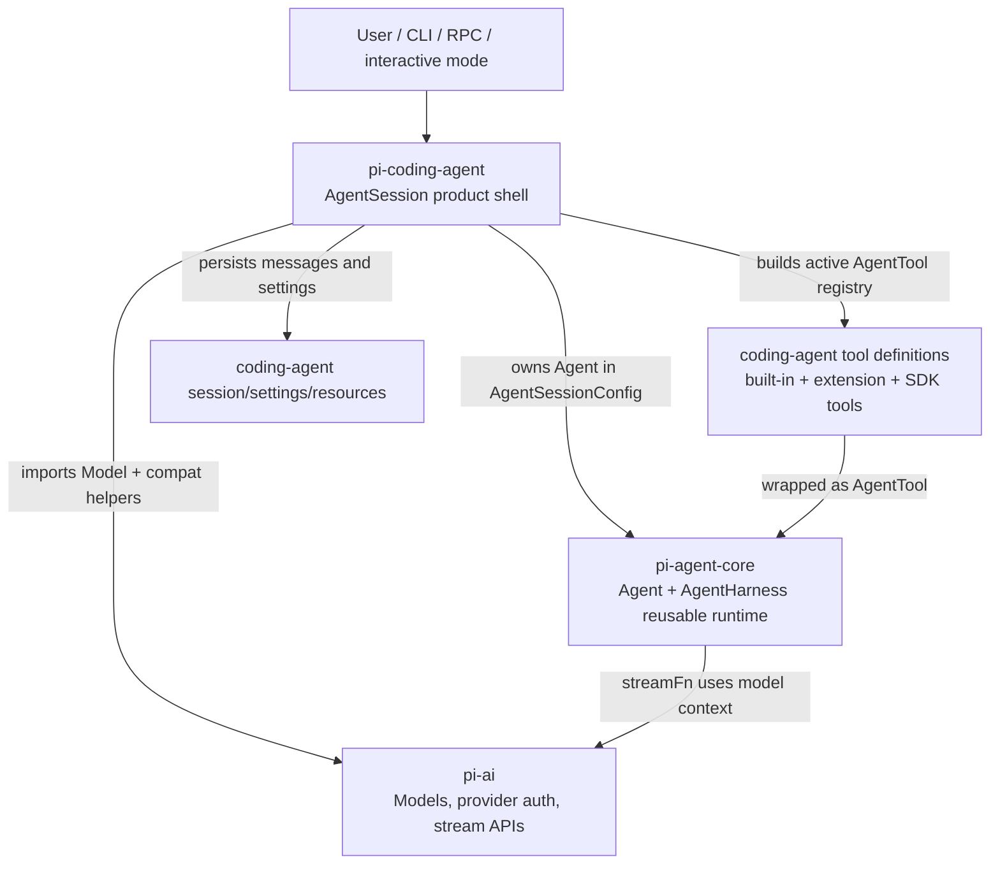

> Pi 的主线分层是 `pi-ai` 提供 provider/model API，`pi-agent-core` 提供可复用 agent runtime，`pi-coding-agent` 把 runtime 装配成 coding-agent CLI 产品；`AgentSession` 是产品层和 core runtime 的主要边界对象。[E: packages/ai/package.json:2][E: packages/ai/package.json:4][E: packages/agent/package.json:2][E: packages/agent/package.json:4][E: packages/coding-agent/package.json:2][E: packages/coding-agent/package.json:4][E: packages/coding-agent/src/core/agent-session.ts:160][E: packages/coding-agent/src/core/agent-session.ts:161]

## 能回答的问题

- `pi-ai`、`pi-agent-core`、`pi-coding-agent` 三个包各自负责什么？
- `pi-agent-core` 哪些能力是可复用 runtime，哪些能力被 `pi-coding-agent` 产品化？
- `AgentSession` 为什么属于 `pi-coding-agent`，但又持有 `pi-agent-core` 的 `Agent`？
- 内置工具、扩展工具、SDK custom tools 在哪一层被装配进 agent runtime？
- `Models` / provider 逻辑和 `Agent` / tool loop 的边界在哪里？
- 相关深挖节点 `spine.agent-loop`、`subsys.coding-agent.agent-session`、`ref.package-index` 应该分别解释什么？

## 分层总览

`@earendil-works/pi-ai` 是 LLM API 层；`packages/ai/package.json` 把它命名为 `@earendil-works/pi-ai` 并描述为带 model discovery 和 provider configuration 的 unified LLM API。[E: packages/ai/package.json:2][E: packages/ai/package.json:4] `packages/ai/src/index.ts` 的 public entrypoint 导出 API lazy loader、auth context/helpers、`models.ts` 和 provider faux 支持，所以 `Models` 相关能力属于 `pi-ai` 包边界。[E: packages/ai/src/index.ts:15][E: packages/ai/src/index.ts:20][E: packages/ai/src/index.ts:22][E: packages/ai/src/index.ts:25][E: packages/ai/src/index.ts:26]

`@earendil-works/pi-agent-core` 是可复用 runtime 层；`packages/agent/package.json` 把它命名为 `@earendil-works/pi-agent-core` 并描述为带 transport abstraction、state management 和 attachment support 的 general-purpose agent。[E: packages/agent/package.json:2][E: packages/agent/package.json:4] `packages/agent/src/index.ts` 从 public entrypoint 导出 `agent.ts`、`agent-loop.ts`、`harness/agent-harness.ts`、session repo、skills、system prompt、types 和 proxy，所以 `Agent` 与 `AgentHarness` 是 core 层对外暴露的 runtime/harness 符号。[E: packages/agent/src/index.ts:2][E: packages/agent/src/index.ts:4][E: packages/agent/src/index.ts:5][E: packages/agent/src/index.ts:30][E: packages/agent/src/index.ts:35][E: packages/agent/src/index.ts:36][E: packages/agent/src/index.ts:38]

`@earendil-works/pi-coding-agent` 是 coding-agent CLI 产品层；`packages/coding-agent/package.json` 把它命名为 `@earendil-works/pi-coding-agent`，描述为带 read、bash、edit、write tools 与 session management 的 coding agent CLI，并声明 `pi` 可执行入口。[E: packages/coding-agent/package.json:2][E: packages/coding-agent/package.json:4][E: packages/coding-agent/package.json:9] `AgentSessionConfig` 把 core `Agent`、`SessionManager`、`SettingsManager`、`ResourceLoader`、SDK custom tools、`ModelRegistry` 和工具 allow/deny list 聚在一个产品会话配置里，因此 `AgentSession` 不是纯 runtime，而是 coding-agent 的产品装配对象。[E: packages/coding-agent/src/core/agent-session.ts:160][E: packages/coding-agent/src/core/agent-session.ts:161][E: packages/coding-agent/src/core/agent-session.ts:162][E: packages/coding-agent/src/core/agent-session.ts:163][E: packages/coding-agent/src/core/agent-session.ts:168][E: packages/coding-agent/src/core/agent-session.ts:170][E: packages/coding-agent/src/core/agent-session.ts:172][E: packages/coding-agent/src/core/agent-session.ts:176][E: packages/coding-agent/src/core/agent-session.ts:178]

## pi-agent-core 可复用边界

`pi-agent-core` 的可复用边界是 `Agent`、agent loop、`AgentHarness`、session repo、compaction、skills、system prompt、types 和 proxy utilities 的 export surface；这些 exports 不携带 `pi-coding-agent` 的 CLI mode、settings manager、resource loader 或 extension runner 实体名。[E: packages/agent/src/index.ts:2][E: packages/agent/src/index.ts:4][E: packages/agent/src/index.ts:5][E: packages/agent/src/index.ts:16][E: packages/agent/src/index.ts:30][E: packages/agent/src/index.ts:31][E: packages/agent/src/index.ts:33][E: packages/agent/src/index.ts:35][E: packages/agent/src/index.ts:36][E: packages/agent/src/index.ts:42][I]

`pi-coding-agent` 在配置、session event、状态 getter 和工具切换中直接使用 core 的 `Agent`、`AgentEvent`、`AgentMessage`、`AgentState`、`AgentTool` 和 `ThinkingLevel`，说明产品层依赖 core runtime 的状态、事件和工具抽象，而不是把 coding-agent UI 逻辑放回 core 包。[E: packages/coding-agent/src/core/agent-session.ts:161][E: packages/coding-agent/src/core/agent-session.ts:128][E: packages/coding-agent/src/core/agent-session.ts:131][E: packages/coding-agent/src/core/agent-session.ts:141][E: packages/coding-agent/src/core/agent-session.ts:779][E: packages/coding-agent/src/core/agent-session.ts:840]

`AgentSession` 构造时接收一个已经创建好的 core `Agent`，保存到 `this.agent`，订阅 core agent event，并安装 tool hook；这让 `pi-coding-agent` 可以围绕同一个 reusable `Agent` 增加 session persistence、extensions、auto-compaction 和 retry handling。[E: packages/coding-agent/src/core/agent-session.ts:337][E: packages/coding-agent/src/core/agent-session.ts:338][E: packages/coding-agent/src/core/agent-session.ts:355][E: packages/coding-agent/src/core/agent-session.ts:357][E: packages/coding-agent/src/core/agent-session.ts:538][E: packages/coding-agent/src/core/agent-session.ts:560][I]

## pi-coding-agent 产品边界

`AgentSession` 的产品职责由字段和方法实现体现：它持有 session/settings/resource/model 依赖，暴露 model/thinking state 管理，负责事件持久化、compaction、bash execution、session tree navigation 和工具/扩展装配。[E: packages/coding-agent/src/core/agent-session.ts:269][E: packages/coding-agent/src/core/agent-session.ts:270][E: packages/coding-agent/src/core/agent-session.ts:305][E: packages/coding-agent/src/core/agent-session.ts:324][E: packages/coding-agent/src/core/agent-session.ts:784][E: packages/coding-agent/src/core/agent-session.ts:789][E: packages/coding-agent/src/core/agent-session.ts:1477][E: packages/coding-agent/src/core/agent-session.ts:1570][E: packages/coding-agent/src/core/agent-session.ts:560][E: packages/coding-agent/src/core/agent-session.ts:1676][E: packages/coding-agent/src/core/agent-session.ts:2611][E: packages/coding-agent/src/core/agent-session.ts:2735][E: packages/coding-agent/src/core/agent-session.ts:2426]

`AgentSession._handleAgentEvent` 把 core event 转成 extension event、listener event 和 session persistence：`message_end` 上的 custom message 走 `appendCustomMessageEntry`，普通 user/assistant/toolResult message 走 `sessionManager.appendMessage`。[E: packages/coding-agent/src/core/agent-session.ts:538][E: packages/coding-agent/src/core/agent-session.ts:541][E: packages/coding-agent/src/core/agent-session.ts:548][E: packages/coding-agent/src/core/agent-session.ts:560]

`AgentSession.prompt()` 先处理 extension command、input hook、skill command、prompt template、streaming queue、model/auth preflight 和 extension `before_agent_start`，然后才把 messages 交给 `_runAgentPrompt()`；这条路径说明用户输入产品语义在 `pi-coding-agent` 层完成，再进入 core `Agent`。[E: packages/coding-agent/src/core/agent-session.ts:1033][E: packages/coding-agent/src/core/agent-session.ts:1046][E: packages/coding-agent/src/core/agent-session.ts:1065][E: packages/coding-agent/src/core/agent-session.ts:1066][E: packages/coding-agent/src/core/agent-session.ts:1070][E: packages/coding-agent/src/core/agent-session.ts:1089][E: packages/coding-agent/src/core/agent-session.ts:1093][E: packages/coding-agent/src/core/agent-session.ts:1133][E: packages/coding-agent/src/core/agent-session.ts:1171]

`AgentSession._runAgentPrompt()` 是产品层进入 reusable runtime 的窄口：它调用 `this.agent.prompt(messages)`，在 post-run 需要 retry、compaction 或 queued message 时继续调用 `this.agent.continue()`。[E: packages/coding-agent/src/core/agent-session.ts:974][E: packages/coding-agent/src/core/agent-session.ts:976][E: packages/coding-agent/src/core/agent-session.ts:977][E: packages/coding-agent/src/core/agent-session.ts:978][E: packages/coding-agent/src/core/agent-session.ts:993][E: packages/coding-agent/src/core/agent-session.ts:1007][E: packages/coding-agent/src/core/agent-session.ts:1013]

## 工具与扩展装配

`AgentSession._buildRuntime()` 在 `pi-coding-agent` 层读取 settings 的 image auto-resize、shell command prefix 和 shell path，然后用这些产品设置创建内置工具定义；当 `baseToolsOverride` 存在时，`AgentSession` 会把外部传入的 `AgentTool` 转成 `ToolDefinition`，否则调用 `createAllToolDefinitions()` 创建 coding-agent 内置工具。[E: packages/coding-agent/src/core/agent-session.ts:2431][E: packages/coding-agent/src/core/agent-session.ts:2432][E: packages/coding-agent/src/core/agent-session.ts:2433][E: packages/coding-agent/src/core/agent-session.ts:2434][E: packages/coding-agent/src/core/agent-session.ts:2438][E: packages/coding-agent/src/core/agent-session.ts:2441]

`AgentSession._buildRuntime()` 还创建 `ExtensionRunner`，把扩展绑定到当前 cwd、session manager 和 model registry，再刷新 active tool registry；这说明 extension runtime 和工具可见性是 `pi-coding-agent` 产品层的装配责任。[E: packages/coding-agent/src/core/agent-session.ts:2450][E: packages/coding-agent/src/core/agent-session.ts:2457][E: packages/coding-agent/src/core/agent-session.ts:2460][E: packages/coding-agent/src/core/agent-session.ts:2461][E: packages/coding-agent/src/core/agent-session.ts:2462][E: packages/coding-agent/src/core/agent-session.ts:2467][E: packages/coding-agent/src/core/agent-session.ts:2474]

`AgentSession._refreshToolRegistry()` 把 built-in tools、extension registered tools 和 SDK custom tools 合成 `_toolDefinitions` 与 `_toolRegistry`，再用 `setActiveToolsByName()` 写回 core `Agent` 的 active tools；因此工具定义来源在产品层聚合，工具执行抽象以 `AgentTool` 形式交给 core runtime。[E: packages/coding-agent/src/core/agent-session.ts:2343][E: packages/coding-agent/src/core/agent-session.ts:2344][E: packages/coding-agent/src/core/agent-session.ts:2349][E: packages/coding-agent/src/core/agent-session.ts:2384][E: packages/coding-agent/src/core/agent-session.ts:2385][E: packages/coding-agent/src/core/agent-session.ts:2395][E: packages/coding-agent/src/core/agent-session.ts:2399][E: packages/coding-agent/src/core/agent-session.ts:2423]

## 模型与 provider 边界

`pi-ai` 的 public entrypoint 导出 auth、models、session resources、diagnostics、event stream、overflow、retry 和 validation utilities；这些 exports 是 LLM/provider 基础设施，不包含 `AgentSession`、`ExtensionRunner` 或 coding-agent tool factory。[E: packages/ai/src/index.ts:20][E: packages/ai/src/index.ts:25][E: packages/ai/src/index.ts:27][E: packages/ai/src/index.ts:29][E: packages/ai/src/index.ts:30][E: packages/ai/src/index.ts:45][E: packages/ai/src/index.ts:46][E: packages/ai/src/index.ts:48][I]

`AgentSession` 通过 `ModelRegistry` 做 API key/auth preflight，管理当前 model/thinking level，并在 compaction、overflow/retry 和 reload 路径调用 provider/model helpers；所以 `pi-coding-agent` 选择和校验模型，但 provider stream 语义来自 `pi-ai`。[E: packages/coding-agent/src/core/agent-session.ts:375][E: packages/coding-agent/src/core/agent-session.ts:402][E: packages/coding-agent/src/core/agent-session.ts:1093][E: packages/coding-agent/src/core/agent-session.ts:1572][E: packages/coding-agent/src/core/agent-session.ts:1616][E: packages/coding-agent/src/core/agent-session.ts:1637][E: packages/coding-agent/src/core/agent-session.ts:1870][E: packages/coding-agent/src/core/agent-session.ts:1946][E: packages/coding-agent/src/core/agent-session.ts:2485][E: packages/coding-agent/src/core/agent-session.ts:2515][E: packages/coding-agent/src/core/agent-session.ts:2516]

## 端到端步骤

1. `AgentSessionConfig` 要求外部传入 core `Agent`、`SessionManager`、`SettingsManager`、cwd、`ResourceLoader` 和 `ModelRegistry`，`AgentSession` 构造器再接收这份配置并保存产品依赖。[E: packages/coding-agent/src/core/agent-session.ts:160][E: packages/coding-agent/src/core/agent-session.ts:161][E: packages/coding-agent/src/core/agent-session.ts:162][E: packages/coding-agent/src/core/agent-session.ts:163][E: packages/coding-agent/src/core/agent-session.ts:164][E: packages/coding-agent/src/core/agent-session.ts:168][E: packages/coding-agent/src/core/agent-session.ts:172][E: packages/coding-agent/src/core/agent-session.ts:337][E: packages/coding-agent/src/core/agent-session.ts:338][E: packages/coding-agent/src/core/agent-session.ts:339][E: packages/coding-agent/src/core/agent-session.ts:340][E: packages/coding-agent/src/core/agent-session.ts:342][E: packages/coding-agent/src/core/agent-session.ts:345]
2. `AgentSession` 构造器保存 product dependencies、订阅 core `Agent` event、安装 tool hooks，并立即调用 `_buildRuntime()` 装配工具和扩展运行时。[E: packages/coding-agent/src/core/agent-session.ts:337][E: packages/coding-agent/src/core/agent-session.ts:338][E: packages/coding-agent/src/core/agent-session.ts:339][E: packages/coding-agent/src/core/agent-session.ts:340][E: packages/coding-agent/src/core/agent-session.ts:355][E: packages/coding-agent/src/core/agent-session.ts:357][E: packages/coding-agent/src/core/agent-session.ts:359]
3. `_buildRuntime()` 从 settings/resource loader/model registry 创建工具定义、`ExtensionRunner` 和 active tool registry，再通过 `setActiveToolsByName()` 更新 core `Agent.state.tools` 和 system prompt。[E: packages/coding-agent/src/core/agent-session.ts:2441][E: packages/coding-agent/src/core/agent-session.ts:2457][E: packages/coding-agent/src/core/agent-session.ts:2474][E: packages/coding-agent/src/core/agent-session.ts:849][E: packages/coding-agent/src/core/agent-session.ts:852][E: packages/coding-agent/src/core/agent-session.ts:853]
4. 用户输入进入 `AgentSession.prompt()`，产品层先处理 extension command、input hook、skill/template expansion、streaming queue 和 model/auth preflight。[E: packages/coding-agent/src/core/agent-session.ts:1033][E: packages/coding-agent/src/core/agent-session.ts:1046][E: packages/coding-agent/src/core/agent-session.ts:1065][E: packages/coding-agent/src/core/agent-session.ts:1070][E: packages/coding-agent/src/core/agent-session.ts:1089][E: packages/coding-agent/src/core/agent-session.ts:1093]
5. `AgentSession.prompt()` 生成 user message 和 extension custom messages，应用 extension-modified system prompt 或 base prompt，然后调用 `_runAgentPrompt(messages)`。[E: packages/coding-agent/src/core/agent-session.ts:1113][E: packages/coding-agent/src/core/agent-session.ts:1120][E: packages/coding-agent/src/core/agent-session.ts:1133][E: packages/coding-agent/src/core/agent-session.ts:1142][E: packages/coding-agent/src/core/agent-session.ts:1155][E: packages/coding-agent/src/core/agent-session.ts:1159][E: packages/coding-agent/src/core/agent-session.ts:1171]
6. `_runAgentPrompt()` 调用 core `Agent.prompt()` 和 `Agent.continue()`，core `Agent` event 再回到 `AgentSession._handleAgentEvent()` 做 extension dispatch、listener emit 和 session persistence。[E: packages/coding-agent/src/core/agent-session.ts:976][E: packages/coding-agent/src/core/agent-session.ts:978][E: packages/coding-agent/src/core/agent-session.ts:538][E: packages/coding-agent/src/core/agent-session.ts:541][E: packages/coding-agent/src/core/agent-session.ts:548][E: packages/coding-agent/src/core/agent-session.ts:560]

## 关键决策点

- 如果代码只需要 LLM provider/model/auth/stream 能力，应依赖 `pi-ai` 的 `Models` / provider API，而不是依赖 `AgentSession`。[E: packages/ai/src/index.ts:25][E: packages/coding-agent/src/core/agent-session.ts:172][I]
- 如果代码需要 agent loop、tool abstraction、state/messages 和 reusable harness，应依赖 `pi-agent-core` 的 `Agent` / `AgentHarness` exports，而不是引入 coding-agent 的 settings、extensions 或 CLI modes。[E: packages/agent/src/index.ts:2][E: packages/agent/src/index.ts:5][E: packages/agent/src/index.ts:38][I]
- 如果代码需要 built-in coding tools、extension commands、resource loading、session files、settings persistence 或 bash command execution，应放在 `pi-coding-agent`，因为这些实体由 `AgentSession` 和周边 core modules 装配。[E: packages/coding-agent/src/core/agent-session.ts:2441][E: packages/coding-agent/src/core/agent-session.ts:2472][E: packages/coding-agent/src/core/agent-session.ts:1034][E: packages/coding-agent/src/core/agent-session.ts:2234][E: packages/coding-agent/src/core/agent-session.ts:2450][E: packages/coding-agent/src/core/agent-session.ts:560][E: packages/coding-agent/src/core/agent-session.ts:2431][E: packages/coding-agent/src/core/agent-session.ts:2611][I]

## 指向 T1/T2 深挖

- `spine.overview` 应给出整个 Pi repo 的一屏总览，并把 `pi-ai`、`pi-agent-core`、`pi-coding-agent`、`pi-tui` 放进同一张地图。[I]
- `spine.agent-loop` 应沿 core `Agent.prompt()` / `Agent.continue()` 解释 turn、tool call 和 assistant message 的真实执行路径；本节点只说明产品层在哪里进入 core runtime。[E: packages/coding-agent/src/core/agent-session.ts:976][E: packages/coding-agent/src/core/agent-session.ts:978]
- `subsys.coding-agent.agent-session` 应详写 `AgentSession` 的方法级职责，包括 prompt、reload、extension binding、compaction、bash execution、tree navigation 和 model registry access；本节点只钉清 `AgentSession` 位于 `pi-coding-agent` 产品边界。[E: packages/coding-agent/src/core/agent-session.ts:366][E: packages/coding-agent/src/core/agent-session.ts:1025][E: packages/coding-agent/src/core/agent-session.ts:1676][E: packages/coding-agent/src/core/agent-session.ts:2467][E: packages/coding-agent/src/core/agent-session.ts:2480][E: packages/coding-agent/src/core/agent-session.ts:2611][E: packages/coding-agent/src/core/agent-session.ts:2735]
- `ref.package-index` 应作为 package catalog，逐包列出 public package name、源码目录、职责和主要 exports；本节点只覆盖分层关系和调用方向。[E: README.md:26][E: README.md:30][E: README.md:31][E: README.md:32][E: README.md:33]

## Sources

- README.md
- packages/agent/src/index.ts
- packages/coding-agent/src/core/agent-session.ts
- packages/ai/src/index.ts
- packages/ai/package.json
- packages/agent/package.json
- packages/coding-agent/package.json

## 相关

- `spine.overview`: Pi repo 总览节点，负责把本分层图嵌入全仓库地图。
- `spine.agent-loop`: agent turn/tool loop 走读节点，负责解释 core runtime 的内部执行。
- `subsys.coding-agent.agent-session`: `AgentSession` 子系统节点，负责解释产品会话外壳的字段和方法。
- `ref.package-index`: package catalog 节点，负责列出每个 package 的目录、exports 和职责。
