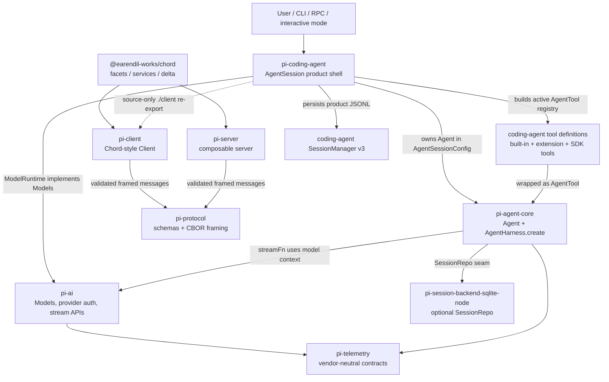

> Pi 0.85.1（wiki target `bbb61e34aa`；包版本与根 `build` 顺序未变）的主线分层从独立 `@earendil-works/chord` 开始：`pi-ai` 提供 provider / model API，`pi-agent-core` 提供可复用 agent runtime，`pi-coding-agent` 把 runtime 装配成 coding-agent CLI 产品；`AgentSession` 是产品层和 core runtime 的主要边界对象。远程 `pi-protocol` / Chord 风格 `pi-client` `Client` / `pi-server` 是 composable remote-session 栈，不等于本地 RPC mode，也不等于已删除的 coding-agent `RemoteSession`。

## 能回答的问题

- `@earendil-works/chord` 在分层里处于哪一层，为什么它不依赖其它 Pi workspace 包？
- `pi-ai`、`pi-agent-core`、`pi-coding-agent` 三个包各自负责什么？
- `pi-agent-core` 哪些能力是可复用 runtime，哪些能力被 `pi-coding-agent` 产品化？
- `AgentSession` 为什么属于 `pi-coding-agent`，但又持有 `pi-agent-core` 的 `Agent`？
- 内置工具、扩展工具、SDK custom tools 在哪一层被装配进 agent runtime？
- `Models` / provider 逻辑和 `Agent` / tool loop 的边界在哪里？
- `pi-protocol` / Chord 风格 `Client` / composable `pi-server` 如何与本地 RPC mode 分开？
- `pi-telemetry` 与 `pi-session-backend-sqlite-node` 分别插在哪一层？

```mermaid
flowchart TD
  User["User / CLI / RPC / interactive mode"]
  Coding["pi-coding-agent<br/>AgentSession product shell"]
  Core["pi-agent-core<br/>Agent + AgentHarness.create"]
  AI["pi-ai<br/>Models, provider auth, stream APIs"]
  Chord["@earendil-works/chord<br/>facets / services / delta"]
  Telemetry["pi-telemetry<br/>vendor-neutral contracts"]
  Protocol["pi-protocol<br/>schemas + CBOR framing"]
  Client["pi-client<br/>Chord-style Client"]
  Server["pi-server<br/>composable server"]
  Backend["pi-session-backend-sqlite-node<br/>optional SessionRepo"]
  Tools["coding-agent tool definitions<br/>built-in + extension + SDK tools"]
  Sessions["coding-agent SessionManager v3"]

  User --> Coding
  Coding -->|owns Agent in AgentSessionConfig| Core
  Coding -->|ModelRuntime implements Models| AI
  Coding -->|builds active AgentTool registry| Tools
  Coding -->|persists product JSONL| Sessions
  Core -->|streamFn uses model context| AI
  Tools -->|wrapped as AgentTool| Core
  AI --> Telemetry
  Core --> Telemetry
  Core -->|SessionRepo seam| Backend
  Chord --> Client
  Chord --> Server
  Client -->|validated framed messages| Protocol
  Server -->|validated framed messages| Protocol
  Coding -.->|source-only ./client re-export| Client
```

## 分层总览

根 `build` 顺序把源码包钉成 10 个：**chord → tui → telemetry → ai → agent → sqlite-node → protocol → client → server → coding-agent**。[E: package.json:16] 这是 chord + 原 9 个源码包。根 `workspaces` 另有 `packages/*` 下的 private `pi-evals`，以及五个显式 listed extension examples；不要发明额外产品。[E: package.json:5] [E: package.json:7] [E: packages/evals/package.json:3] 即将存在的节点 `subsys.chord.runtime` / `subsys.chord.delta` 将展开 Chord facets / services 与 replicated-state delta；本页只钉清分层位置。

`@earendil-works/chord` 是独立 application-composition runtime（facets / services / replicated state / RPC / plugins）。版本 `0.85.1`；`dependencies` 只有 `esbuild`，**不依赖任何其它 Pi workspace 包**。[E: packages/chord/package.json:2] [E: packages/chord/package.json:3] [E: packages/chord/package.json:4] [E: packages/chord/package.json:65] 公开入口导出 `defineFacet` / `defineService` / `replicatedState` / `createFacetHost`。[E: packages/chord/src/index.ts:8] [E: packages/chord/src/index.ts:11]

`@earendil-works/pi-ai` 是 LLM API 层；`packages/ai/package.json` 把它命名为 `@earendil-works/pi-ai` 并描述为带 model discovery 和 provider configuration 的 unified LLM API。[E: packages/ai/package.json:2] [E: packages/ai/package.json:4] `packages/ai/src/index.ts` 的 public entrypoint 导出 lazy API loader、auth helpers、`models.ts` 和 provider faux 支持，所以 `Models` 相关能力属于 `pi-ai` 包边界。[E: packages/ai/src/index.ts:15] [E: packages/ai/src/index.ts:34]

`@earendil-works/pi-agent-core` 是可复用 runtime 层；`packages/agent/package.json` 把它命名为 `@earendil-works/pi-agent-core` 并描述为带 transport abstraction、state management 和 attachment support 的 general-purpose agent。[E: packages/agent/package.json:2] [E: packages/agent/package.json:4] `packages/agent/src/index.ts` 从 public entrypoint 导出 `agent.ts`、`agent-loop.ts`、`harness/agent-harness.ts`、session、skills、system prompt、types 和 proxy，所以 `Agent` 与 `AgentHarness` 是 core 层对外暴露的 runtime / harness 符号。[E: packages/agent/src/index.ts:41] [E: packages/agent/src/index.ts:42] [E: packages/agent/src/index.ts:41] [E: packages/agent/src/index.ts:79]

`@earendil-works/pi-coding-agent` 是 coding-agent CLI 产品层；`packages/coding-agent/package.json` 把它命名为 `@earendil-works/pi-coding-agent`，描述为带 read、bash、edit、write tools 与 session management 的 coding agent CLI，并声明 `pi` 可执行入口。[E: packages/coding-agent/package.json:2] [E: packages/coding-agent/package.json:4] [E: packages/coding-agent/package.json:10] `AgentSessionConfig` 把 core `Agent`、`SessionManager`、`SettingsManager`、`ResourceLoader`、SDK custom tools、canonical `ModelRuntime` 和工具 allow / deny list 聚在一个产品会话配置里，因此 `AgentSession` 不是纯 runtime，而是 coding-agent 的产品装配对象。[E: packages/coding-agent/src/core/agent-session.ts:200] [E: packages/coding-agent/src/core/agent-session.ts:201] [E: packages/coding-agent/src/core/agent-session.ts:212]

`@earendil-works/pi-protocol` 只定义 remote-session DTO / schema / codec。[E: packages/protocol/package.json:2] [E: packages/protocol/package.json:4] `@earendil-works/pi-client` 依赖 `chord` 与 `protocol`，公开面是 `Client` + `createClientServiceTransport`，另导出 `./unix`。[E: packages/client/package.json:2] [E: packages/client/package.json:13] [E: packages/client/package.json:50] [E: packages/client/src/index.ts:1] [E: packages/client/src/client.ts:62] [E: packages/client/src/client.ts:448] `pi-coding-agent` 的 `./client` 只 re-export `@earendil-works/pi-client`，且 `exports` 只声明 `source`；`files` 排除 `dist/client` / `dist/experimental` / `dist/cli/experimental`，因此 experimental remote 面是 **source-only**，不要写成 shipped `RemoteSession`。[E: packages/coding-agent/src/client/index.ts:1] [E: packages/coding-agent/package.json:22] [E: packages/coding-agent/package.json:31] [E: packages/coding-agent/package.json:52]

`@earendil-works/pi-server` 是 experimental composable protocol server：根入口 re-export errors / listener / server / types，exports 仅有 `.`、`./testing`、`./unix`。包不再提供 `server` binary，也不再导出 legacy JSONL IPC / supervisor / Radius。[E: packages/server/package.json:4] [E: packages/server/package.json:8] [E: packages/server/src/index.ts:1] [E: packages/server/src/index.ts:3] 运行依赖是 `chord`、`pi-agent-core` 与 `pi-protocol`，不依赖 `pi-coding-agent`。[E: packages/server/package.json:52] [E: packages/server/package.json:52] [E: packages/server/package.json:52] 应用必须自己提供 server service；这与本地 `runRpcMode` JSONL stdin RPC 不是同一条路径。[I]

`@earendil-works/pi-telemetry` 是 vendor-neutral telemetry contracts：`TelemetryContext` / `TelemetrySpan` 与 typed schema helpers。`pi-ai` 与 `pi-agent-core` 都依赖该包。[E: packages/telemetry/package.json:2] [E: packages/telemetry/package.json:4] [E: packages/telemetry/src/index.ts:14] [E: packages/ai/package.json:69] [E: packages/agent/package.json:60]

`@earendil-works/pi-session-backend-sqlite-node` 是可选的 Node `node:sqlite` session backend，描述为给 `pi-agent-core` sessions 用；它依赖 `pi-agent-core`，不进入 coding-agent 默认 CLI 路径。[E: packages/session-backends/sqlite-node/package.json:2] [E: packages/session-backends/sqlite-node/package.json:4] [E: packages/session-backends/sqlite-node/package.json:39]

`@earendil-works/pi-evals` 是最外侧的 `private: true` 评测消费者，通过 devDependencies 使用 `pi-ai` 与 `pi-coding-agent`，不进入 publish。[E: packages/evals/package.json:2] [E: packages/evals/package.json:3] [E: packages/evals/package.json:12] [E: packages/evals/package.json:13]

`scripts/release-packages.mjs` 的 `getPublicWorkspacePackages()` 过滤 `private !== true`，因此 `pi-evals` 不进 public publish 集合。[E: scripts/release-packages.mjs:5] [E: scripts/release-packages.mjs:11] `scripts/publish.mjs` 消费该清单。[E: scripts/publish.mjs:6]

## pi-agent-core 可复用边界

`pi-agent-core` 的可复用边界是 `Agent`、agent loop、`AgentHarness`、v4 session（`Session` / `SessionRepo`）、compaction、skills、system prompt、types 和 proxy utilities 的 export surface；这些 exports 不携带 `pi-coding-agent` 的 CLI mode、settings manager、resource loader 或 extension runner 实体名。[E: packages/agent/src/index.ts:41] [E: packages/agent/src/index.ts:41] [E: packages/agent/src/index.ts:79] [I]

`AgentHarness` 通过 `AgentHarness.create` 附着到一份 durable `Session`；`AgentHarnessOptions.session` 是构造输入，`AgentLane` 再暴露 prompt / resume / steer 等 lane API。这是 reusable harness 的会话入口，不是 `AgentSession`。[E: packages/agent/src/harness/agent-harness.ts:519] [E: packages/agent/src/harness/agent-harness.ts:615] [E: packages/agent/src/harness/agent-harness.ts:622]

agent-core 也公开依赖 `ExecutionEnv` 的 bash / read / edit / write execution-tool factories，但调用方必须显式安装；coding-agent 仍拥有八工具 registry（`read`/`bash`/`powershell`/`edit`/`write`/`grep`/`find`/`ls`）、产品 settings、extension / TUI integration 等产品语义。[E: packages/agent/src/harness/tools/index.ts:7] [E: packages/agent/src/harness/tools/index.ts:10] [E: packages/agent/src/harness/tools/index.ts:15] [E: packages/agent/src/harness/tools/index.ts:23] [E: packages/coding-agent/src/core/tools/index.ts:95] [E: packages/coding-agent/src/core/tools/index.ts:182]

`pi-coding-agent` 在配置、session event、状态 getter 和工具切换中直接使用 core 的 `Agent`，说明产品层依赖 core runtime 的状态、事件和工具抽象，而不是把 coding-agent UI 逻辑放回 core 包。[E: packages/coding-agent/src/core/agent-session.ts:200] [E: packages/coding-agent/src/core/agent-session.ts:307]

`AgentSession` 构造时接收一个已经创建好的 core `Agent`，保存到 `this.agent`，订阅 core agent event，并安装 tool hook；这让 `pi-coding-agent` 可以围绕同一个 reusable `Agent` 增加 session persistence、extensions、auto-compaction 和 retry handling。[E: packages/coding-agent/src/core/agent-session.ts:380] [E: packages/coding-agent/src/core/agent-session.ts:380] [E: packages/coding-agent/src/core/agent-session.ts:398] [E: packages/coding-agent/src/core/agent-session.ts:398]

## pi-coding-agent 产品边界

`AgentSession` 的产品职责由字段和方法实现体现：它持有 session / settings / resource / model 依赖，暴露 model / thinking state 管理，负责事件持久化、compaction、bash execution、session tree navigation 和工具 / 扩展装配。[E: packages/coding-agent/src/core/agent-session.ts:307] [E: packages/coding-agent/src/core/agent-session.ts:308] [E: packages/coding-agent/src/core/agent-session.ts:367]

`AgentSession` 把 core event 转成 extension event、listener event 和 session persistence：`message_end` 上的 custom message 走 `appendCustomMessageEntry`，普通 user / assistant / toolResult message 走 `sessionManager.appendMessage`。[E: packages/coding-agent/src/core/agent-session.ts:673] [E: packages/coding-agent/src/core/agent-session.ts:685]

`AgentSession.prompt()` 先处理 extension command、input hook、skill command、prompt template，然后才把 messages 交给 `_runAgentPrompt()`；这条路径说明用户输入产品语义在 `pi-coding-agent` 层完成，再进入 core `Agent`。[E: packages/coding-agent/src/core/agent-session.ts:1175] [E: packages/coding-agent/src/core/agent-session.ts:1183] [E: packages/coding-agent/src/core/agent-session.ts:1201] [E: packages/coding-agent/src/core/agent-session.ts:1214]

`AgentSession._runAgentPrompt()` 是产品层进入 reusable runtime 的窄口：它调用 `this.agent.prompt(messages)`，在 post-run 需要 retry、compaction 或 queued message 时继续调用 `this.agent.continue()`。[E: packages/coding-agent/src/core/agent-session.ts:1101] [E: packages/coding-agent/src/core/agent-session.ts:1104] [E: packages/coding-agent/src/core/agent-session.ts:1106]

## 工具与扩展装配

`AgentSession._buildRuntime()` 在 `pi-coding-agent` 层读取 settings 的 image auto-resize、shell command prefix 和 shell path，然后用这些产品设置创建内置工具定义；当 `baseToolsOverride` 存在时，`AgentSession` 会把外部传入的 `AgentTool` 转成 `ToolDefinition`，否则调用 `createAllToolDefinitions()` 创建 coding-agent 内置工具。[E: packages/coding-agent/src/core/agent-session.ts:2792] [E: packages/coding-agent/src/core/agent-session.ts:2802] [E: packages/coding-agent/src/core/agent-session.ts:2802]

`AgentSession._buildRuntime()` 还创建 `ExtensionRunner`，把扩展绑定到当前 cwd、session manager 和 `ModelRegistry` facade，再刷新 active tool registry；这说明 extension runtime 和工具可见性是 `pi-coding-agent` 产品层的装配责任。[E: packages/coding-agent/src/core/agent-session.ts:2818] [E: packages/coding-agent/src/core/agent-session.ts:2835] [E: packages/coding-agent/src/core/agent-session.ts:2835]

`AgentSession._refreshToolRegistry()` 把 built-in tools、extension registered tools 和 SDK custom tools 合成 `_toolDefinitions` 与 `_toolRegistry`，再用 `setActiveToolsByName()` 写回 core `Agent` 的 active tools；因此工具定义来源在产品层聚合，工具执行抽象以 `AgentTool` 形式交给 core runtime。[E: packages/coding-agent/src/core/agent-session.ts:2694] [E: packages/coding-agent/src/core/agent-session.ts:2702] [E: packages/coding-agent/src/core/agent-session.ts:2756] [E: packages/coding-agent/src/core/agent-session.ts:2784]

内置全集仍是 8 个：`read`、`bash`、`powershell`、`edit`、`write`、`grep`、`find`、`ls`。`createCodingToolDefinitions()` / `createReadOnlyToolDefinitions()` **仍不含** `powershell`。[E: packages/coding-agent/src/core/tools/index.ts:95] [E: packages/coding-agent/src/core/tools/index.ts:164] [E: packages/coding-agent/src/core/tools/index.ts:173] [E: packages/coding-agent/src/core/tools/index.ts:182]

## 模型与 provider 边界

`pi-ai` 的 public entrypoint 导出 auth、models、session resources、diagnostics、event stream、overflow、retry 和 validation utilities；这些 exports 是 LLM / provider 基础设施，不包含 `AgentSession`、`ExtensionRunner` 或 coding-agent tool factory。[E: packages/ai/src/index.ts:21] [E: packages/ai/src/index.ts:34] [E: packages/ai/src/index.ts:40] [I]

`AgentSession` 保存 canonical `ModelRuntime`，通过 `_modelRuntime.getAuth()` 做 API key / auth preflight，并用它负责 model / provider / auth / stream 路径。所以 `pi-coding-agent` 选择和校验模型，但 provider stream 语义来自 `pi-ai`。[E: packages/coding-agent/src/core/agent-session.ts:367] [E: packages/coding-agent/src/core/agent-session.ts:388] [E: packages/coding-agent/src/core/agent-session.ts:420]

`ModelRegistry` 仍在 `_buildRuntime()` 中临时包裹 `ModelRuntime`，但只作为 extension API 的 compatibility facade 传给 `ExtensionRunner`；它不再是 `AgentSessionConfig` 的 canonical model / auth dependency。[E: packages/coding-agent/src/core/agent-session.ts:2823]

## 端到端步骤

1. `AgentSessionConfig` 要求外部传入 core `Agent`、`SessionManager`、`SettingsManager`、cwd、`ResourceLoader` 和 `ModelRuntime`，`AgentSession` 构造器再接收这份配置并保存产品依赖。[E: packages/coding-agent/src/core/agent-session.ts:201] [E: packages/coding-agent/src/core/agent-session.ts:380]
2. `AgentSession` 构造器保存 product dependencies、订阅 core `Agent` event、安装 tool hooks，并立即调用 `_buildRuntime()` 装配工具和扩展运行时。[E: packages/coding-agent/src/core/agent-session.ts:398] [E: packages/coding-agent/src/core/agent-session.ts:398] [E: packages/coding-agent/src/core/agent-session.ts:398]
3. `_buildRuntime()` 从 settings / resource loader 与 `ModelRuntime` compatibility facade 创建工具定义、`ExtensionRunner` 和 active tool registry，再通过 `setActiveToolsByName()` 更新 core `Agent`。[E: packages/coding-agent/src/core/agent-session.ts:2802] [E: packages/coding-agent/src/core/agent-session.ts:2818] [E: packages/coding-agent/src/core/agent-session.ts:2835]
4. 用户输入进入 `AgentSession.prompt()`，产品层先处理 extension command、input hook、skill / template expansion。[E: packages/coding-agent/src/core/agent-session.ts:1175] [E: packages/coding-agent/src/core/agent-session.ts:1183] [E: packages/coding-agent/src/core/agent-session.ts:1214]
5. `_runAgentPrompt()` 调用 core `Agent.prompt()` 和 `Agent.continue()`，core `Agent` event 再回到 `AgentSession` 做 extension dispatch、listener emit 和 session persistence。[E: packages/coding-agent/src/core/agent-session.ts:1104] [E: packages/coding-agent/src/core/agent-session.ts:1106] [E: packages/coding-agent/src/core/agent-session.ts:673]

## 关键决策点

- 如果代码只需要 LLM provider / model / auth / stream 能力，应依赖 `pi-ai` 的 `Models` / provider API，而不是依赖 `AgentSession`。[E: packages/ai/src/index.ts:34] [I]
- 如果代码需要 agent loop、tool abstraction、state / messages 和 reusable harness，应依赖 `pi-agent-core` 的 `Agent` / `AgentHarness.create` exports，而不是引入 coding-agent 的 settings、extensions 或 CLI modes。[E: packages/agent/src/index.ts:41] [E: packages/agent/src/index.ts:41] [I]
- 如果代码需要 coding-agent 产品工具语义、八工具 registry、extension commands、resource loading、session files、settings persistence 或 TUI integration，应放在 `pi-coding-agent`；只需要抽象环境上的四个基础 execution tools 时可直接使用 agent-core factories。[E: packages/coding-agent/src/core/tools/index.ts:95] [E: packages/coding-agent/src/core/agent-session.ts:2802] [E: packages/agent/src/harness/tools/index.ts:23] [I]
- 如果代码需要远程会话，应走 `pi-protocol` + Chord 风格 `Client` + composable `pi-server`；不要把它和本地 RPC mode、已删除的 `PiClient`/`PiSessionHandle`、或已删除的 coding-agent `RemoteSession` 混为一谈。[E: packages/client/src/index.ts:1] [E: packages/server/src/index.ts:3] [E: packages/coding-agent/src/client/index.ts:1] [I]
- 如果代码需要 application composition（facets / services / replicated state），应依赖独立的 `@earendil-works/chord`，不要从 `pi-coding-agent` 反查。[E: packages/chord/package.json:4] [I]
- 如果代码需要 durable harness session 且不想用 JSONL，应实现 `SessionRepo` 或使用 `@earendil-works/pi-session-backend-sqlite-node`；coding-agent CLI 默认仍用产品 `SessionManager`。[E: packages/session-backends/sqlite-node/package.json:4] [I]

## 指向 T1/T2 深挖

- `spine.overview` 应给出整个 Pi repo 的一屏总览，并把 `chord`、`pi-ai`、`pi-agent-core`、`pi-coding-agent`、`pi-tui` 放进同一张地图。[I]
- `spine.agent-loop` 应沿 core `Agent.prompt()` / `Agent.continue()` 解释 turn、tool call 和 assistant message 的真实执行路径；本节点只说明产品层在哪里进入 core runtime。[E: packages/coding-agent/src/core/agent-session.ts:1104]
- `spine.session-state-model` 应对比 harness v4 `Session` 与 coding-agent `SessionManager`。[I]
- `subsys.coding-agent.agent-session` 应详写 `AgentSession` 的方法级职责；本节点只钉清 `AgentSession` 位于 `pi-coding-agent` 产品边界。[E: packages/coding-agent/src/core/agent-session.ts:306]
- `subsys.client.remote-session-client` 应改写为 Chord 风格 `Client`；本节点只钉清公开面不再是 `PiClient`。[E: packages/client/src/index.ts:1]
- `subsys.server.session-server` 应详写 composable server；本节点只钉清它不再包含 legacy IPC。[E: packages/server/src/index.ts:3]
- `subsys.telemetry.contracts` 应详写 `TelemetryContext` / schema helpers。[E: packages/telemetry/src/index.ts:14]
- `subsys.session-backends.sqlite-node` 应详写 SQLite `SessionRepo` 实现。[E: packages/session-backends/sqlite-node/package.json:2]
- `ref.package-index` 应作为 package catalog，逐包列出 public package name、源码目录、职责和主要 exports。[I]
- 即将存在的 `subsys.chord.runtime` / `subsys.chord.delta` 将分别覆盖 facets/services/host 与 delta tracking。[I]

## Sources

- package.json
- scripts/publish.mjs
- scripts/release-packages.mjs
- packages/chord/package.json
- packages/chord/src/index.ts
- packages/agent/src/index.ts
- packages/agent/src/harness/tools/index.ts
- packages/agent/src/harness/agent-harness.ts
- packages/coding-agent/src/core/agent-session.ts
- packages/coding-agent/src/core/tools/index.ts
- packages/coding-agent/src/client/index.ts
- packages/ai/src/index.ts
- packages/ai/package.json
- packages/agent/package.json
- packages/protocol/package.json
- packages/client/package.json
- packages/client/src/index.ts
- packages/client/src/client.ts
- packages/coding-agent/package.json
- packages/tui/package.json
- packages/session-backends/sqlite-node/package.json
- packages/telemetry/package.json
- packages/telemetry/src/index.ts
- packages/server/package.json
- packages/server/src/index.ts
- packages/evals/package.json

## 相关

- [spine.overview](overview.md) - Pi repo 总览，把本分层图嵌入全仓库地图。
- [spine.agent-loop](agent-loop.md) - agent turn / tool loop 走读。
- [spine.session-state-model](session-state-model.md) - harness v4 Session 与产品 SessionManager。
- [subsys.coding-agent.agent-session](../subsystems/coding-agent/agent-session.md) - `AgentSession` 产品外壳。
- [subsys.agent-core.execution-tools](../subsystems/agent-core/execution-tools.md) - agent-core 四个 execution-tool factories。
- [subsys.protocol.wire-protocol](../subsystems/protocol/wire-protocol.md) - remote-session schemas / CBOR。
- [subsys.client.remote-session-client](../subsystems/client/remote-session-client.md) - transport-neutral Chord 风格 `Client`。
- [subsys.server.session-server](../subsystems/server/session-server.md) - composable `pi-server`。
- [subsys.session-backends.sqlite-node](../subsystems/session-backends/sqlite-node.md) - Node SQLite `SessionRepo` backend。
- [subsys.telemetry.contracts](../subsystems/telemetry/contracts.md) - vendor-neutral telemetry contracts。
- [subsys.evals.pi-harness](../subsystems/evals/pi-harness.md) - private eval consumer。
- [ref.package-index](../reference/package-index.md) - 逐包 catalog。
