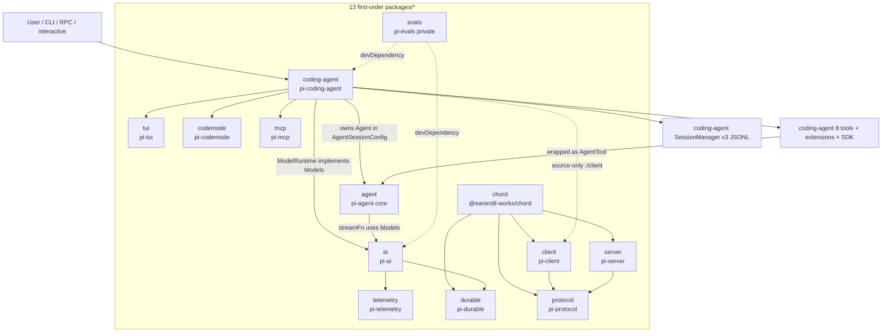
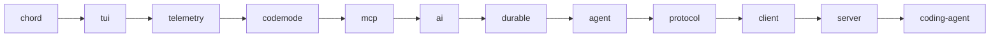

> Pi **1.0.1**（wiki target `4c6fb7cfe8`）是分层 monorepo：独立 `@earendil-works/chord` 做 application composition；`pi-codemode` / `pi-mcp` 是无 Pi 依赖的 sandbox 与 MCP client；`pi-ai` 提供 provider / `Models`；`pi-durable` 才是 1.0 可复用 session/`Harness`；`pi-agent-core` 只剩可复用 `Agent` loop；`pi-coding-agent` 把 `Agent` 装配成 CLI 产品（`AgentSession` + `SessionManager` JSONL）。一阶 `packages/*` 共 **13** 个。不存在 `packages/session-backends` 或 sqlite-node 包。远程 `pi-protocol` / Chord 风格 `pi-client` `Client` / `pi-server` `Server` 不等于本地 RPC mode。

## 能回答的问题

- `@earendil-works/chord` 在分层里处于哪一层，为什么它不依赖其它 Pi workspace 包？
- 一阶 `packages/*` 是哪 13 个目录，根 `build` 顺序把谁插在 `telemetry` 与 `ai` 之间？
- `pi-durable` 插在哪一层，它和 coding-agent `SessionManager` JSONL、`pi-agent-core` `Agent` 分别是什么关系？
- 1.0 可复用 harness 是哪个包的哪个符号，`pi-agent-core` 还提供 session/harness 吗？
- `pi-ai`、`pi-agent-core`、`pi-coding-agent` 三个包各自负责什么？
- `AgentSession` 为什么属于 `pi-coding-agent`，但又持有 `pi-agent-core` 的 `Agent`？
- `@earendil-works/pi-codemode` 与 `@earendil-works/pi-mcp` 是独立包还是 coding-agent 内部模块？产品怎么把它们接进来？
- 内置工具、扩展工具、SDK custom tools 在哪一层被装配进 agent runtime？
- `Models` / provider 逻辑和 `Agent` / tool loop 的边界在哪里？
- `pi-protocol` / Chord 风格 `Client` / composable `pi-server` 如何与本地 RPC mode 分开？
- `pi-telemetry` 插在哪一层？SQLite 持久化现在落在哪个包？

```mermaid
flowchart TD
  subgraph pkgs["13 first-order packages/*"]
    Chord["chord<br/>@earendil-works/chord"]
    Tui["tui<br/>pi-tui"]
    Telemetry["telemetry<br/>pi-telemetry"]
    Codemode["codemode<br/>pi-codemode"]
    Mcp["mcp<br/>pi-mcp"]
    AI["ai<br/>pi-ai"]
    Durable["durable<br/>pi-durable"]
    Agent["agent<br/>pi-agent-core"]
    Protocol["protocol<br/>pi-protocol"]
    ClientPkg["client<br/>pi-client"]
    ServerPkg["server<br/>pi-server"]
    Coding["coding-agent<br/>pi-coding-agent"]
    Evals["evals<br/>pi-evals private"]
  end

  User["User / CLI / RPC / interactive"]
  Tools["coding-agent 8 tools + extensions + SDK"]
  Sessions["coding-agent SessionManager v3 JSONL"]

  User --> Coding
  Coding -->|owns Agent in AgentSessionConfig| Agent
  Coding -->|ModelRuntime implements Models| AI
  Coding --> Tui
  Coding --> Codemode
  Coding --> Mcp
  Coding --> Tools
  Coding --> Sessions
  Agent -->|streamFn uses Models| AI
  Tools -->|wrapped as AgentTool| Agent
  AI --> Telemetry
  Chord --> Durable
  AI --> Durable
  Chord --> Protocol
  Chord --> ClientPkg
  Chord --> ServerPkg
  ClientPkg --> Protocol
  ServerPkg --> Protocol
  Coding -.->|source-only ./client| ClientPkg
  Evals -.->|devDependency| Coding
  Evals -.->|devDependency| AI
```

```mermaid
flowchart LR
  chord --> tui --> telemetry --> codemode --> mcp --> ai --> durable --> agent --> protocol --> client --> server --> codingAgent["coding-agent"]
```

根 `build` 不编译 `evals`。图中没有 sqlite-node：SQLite 是 `pi-durable` 的 `./storage/sqlite` 适配器。

## 分层总览

根 `workspaces` 以 `packages/*` 收一阶源码包，并显式列出五个 coding-agent extension examples。[E: package.json:6] 一阶目录是 **13** 个：`agent`、`ai`、`chord`、`client`、`codemode`、`coding-agent`、`durable`、`evals`、`mcp`、`protocol`、`server`、`telemetry`、`tui`。没有 `packages/session-backends`。公开包版本均为 **1.0.1**。

根 `build` 顺序把可发布源码包钉成：**chord → tui → telemetry → codemode → mcp → ai → durable → agent → protocol → client → server → coding-agent**。[E: package.json:15] `evals` 不进这条链；它是 `private: true`。[E: packages/evals/package.json:4]

| 目录 | npm name | 分层角色 |
|---|---|---|
| `chord` | `@earendil-works/chord` | 独立 application-composition runtime |
| `tui` | `@earendil-works/pi-tui` | 差分渲染 TUI 库 |
| `telemetry` | `@earendil-works/pi-telemetry` | vendor-neutral telemetry contracts |
| `codemode` | `@earendil-works/pi-codemode` | QuickJS WASM sandbox，无 Pi 依赖 |
| `mcp` | `@earendil-works/pi-mcp` | 独立 MCP client，无官方 MCP SDK |
| `ai` | `@earendil-works/pi-ai` | unified LLM / `Models` / provider API |
| `durable` | `@earendil-works/pi-durable` | 1.0 可复用 session + `Harness` |
| `agent` | `@earendil-works/pi-agent-core` | 可复用 `Agent` loop（无 session/harness） |
| `protocol` | `@earendil-works/pi-protocol` | remote-session DTO / CBOR |
| `client` | `@earendil-works/pi-client` | Chord 风格 transport-neutral `Client` |
| `server` | `@earendil-works/pi-server` | experimental composable `Server` |
| `coding-agent` | `@earendil-works/pi-coding-agent` | `pi` CLI 产品 |
| `evals` | `@earendil-works/pi-evals` | `private: true` 评测消费者 |

wiki 节点 `pkg` 取值含 `chord`、`durable`、`codemode`、`mcp`；本页跨层，标 `pkg: cross`。逐包 catalog 见 [ref.package-index](../reference/package-index.md)。

`scripts/release-packages.mjs` 的 `getPublicWorkspacePackages()` 过滤 `private !== true`，因此 `pi-evals` 不进 public publish 集合。[E: scripts/release-packages.mjs:5] [E: scripts/release-packages.mjs:11] `scripts/publish.mjs` 消费该清单。[E: scripts/publish.mjs:6]

## 独立底座：chord / tui / telemetry / codemode / mcp

`@earendil-works/chord` 版本 `1.0.1`，描述为 services / replicated state / RPC / plugins 的 application composition runtime。[E: packages/chord/package.json:2] [E: packages/chord/package.json:3] [E: packages/chord/package.json:4] `dependencies` 只有 `esbuild`，**不依赖任何其它 Pi workspace 包**。[E: packages/chord/package.json:66] 公开入口导出 `defineFacet` / `defineService` / `replicatedState` / `createFacetHost`。[E: packages/chord/src/index.ts:6] [E: packages/chord/src/index.ts:9] [E: packages/chord/src/index.ts:10] [E: packages/chord/src/index.ts:11] 深挖见 [subsys.chord.runtime](../subsystems/chord/runtime.md) 与 [subsys.chord.delta](../subsystems/chord/delta.md)。

`@earendil-works/pi-tui` 是差分渲染 TUI 库，版本 `1.0.1`；运行依赖是 `get-east-asian-width` 与 `marked`，没有 Pi workspace 包。[E: packages/tui/package.json:2] [E: packages/tui/package.json:4] [E: packages/tui/package.json:55] `pi-coding-agent` 把它当渲染层依赖，不把 TUI 逻辑放进 `pi-agent-core`。[E: packages/coding-agent/package.json:55]

`@earendil-works/pi-telemetry` 是 vendor-neutral telemetry contracts：`TelemetryContext` / `TelemetrySpan` 与 typed schema helpers。[E: packages/telemetry/package.json:2] [E: packages/telemetry/package.json:4] [E: packages/telemetry/src/index.ts:14] `pi-ai` 依赖该包。[E: packages/ai/package.json:72] `pi-agent-core` 1.0 **不再**依赖 telemetry。[E: packages/agent/package.json:26]

`@earendil-works/pi-codemode` 版本 `1.0.1`，描述为「唯一能力是调用注入 tools 的 sandboxed JavaScript」。[E: packages/codemode/package.json:2] [E: packages/codemode/package.json:4] 运行依赖只有 `quickjs-wasi`，**无 Pi 包依赖**。[E: packages/codemode/package.json:58] 公开入口导出 `CodemodeSandbox` 与输出上限 `MAX_OUTPUT_CHARS` / `MAX_OUTPUT_ITEMS`。[E: packages/codemode/src/index.ts:13] [E: packages/codemode/src/index.ts:15] [E: packages/codemode/src/index.ts:16] `CodemodeSandbox.execute()` 在独立 worker + QuickJS WASM VM 里跑脚本。[E: packages/codemode/src/runtime/host.ts:285] [E: packages/codemode/src/runtime/host.ts:339] 包层细节见 [subsys.codemode.runtime](../subsystems/codemode/runtime.md)；产品工具面见 [surface.codemode.overview](../surface/codemode/overview.md)。

`@earendil-works/pi-mcp` 版本 `1.0.1`，描述为 standalone Model Context Protocol client。[E: packages/mcp/package.json:2] [E: packages/mcp/package.json:4] 运行依赖只有 `cross-spawn`，**不依赖官方 MCP SDK，也不依赖其它 Pi 包**。[E: packages/mcp/package.json:54] 根入口导出 `McpClient`、`StdioTransport`、`StreamableHttpTransport`。[E: packages/mcp/src/index.ts:2] [E: packages/mcp/src/index.ts:58] [E: packages/mcp/src/index.ts:63] `McpClient` 是该包的 client 类型。[E: packages/mcp/src/client.ts:153] in-memory transport 从 `./testing` 导出，供测试成对连接。[E: packages/mcp/src/testing/index.ts:1] 包层细节见 [subsys.mcp.client](../subsystems/mcp/client.md)；产品 `/mcp`、`.pi/mcp.json` 见 [surface.mcp.overview](../surface/mcp/overview.md)。

## LLM 层：pi-ai

`@earendil-works/pi-ai` 是 unified LLM API，带 model discovery 与 provider configuration，版本 `1.0.1`。[E: packages/ai/package.json:2] [E: packages/ai/package.json:4] 根入口导出 lazy API loader、auth helpers、`models.ts` 和 provider faux 支持。[E: packages/ai/src/index.ts:15] [E: packages/ai/src/index.ts:33] `Models` 接口定义 provider / chat / image / classifier 读取面，属于 `pi-ai` 包边界。[E: packages/ai/src/models.ts:244] 这些 exports 不含 `AgentSession`、`ExtensionRunner` 或 coding-agent tool factory。

## 可复用 durable 层：pi-durable

`@earendil-works/pi-durable` 是 durable conversation / task / document runtime，版本 `1.0.1`。[E: packages/durable/package.json:2] [E: packages/durable/package.json:4] 运行依赖 chord 与 `pi-ai`，**没有** `pi-agent-core`。[E: packages/durable/package.json:103] [E: packages/durable/package.json:104] 根入口导出 `Harness`、`createSession`、`MemoryStorage`、`defineTask`、`defineTool`、`createRegistry`、`ROOT_CONVERSATION_ID`。[E: packages/durable/src/index.ts:24] [E: packages/durable/src/index.ts:38] [E: packages/durable/src/index.ts:41] [E: packages/durable/src/index.ts:98] [E: packages/durable/src/index.ts:99] [E: packages/durable/src/index.ts:100] [E: packages/durable/src/index.ts:181]

`createSession(storage)` 打开一份 durable `Session` kernel。[E: packages/durable/src/session/session.ts:49] `Harness.open(storage, options, context)` 在同一份 Storage 上打开 1.0 可复用 agent harness。[E: packages/durable/src/harness/harness.ts:407] [E: packages/durable/src/harness/harness.ts:409] `defineTask` 定义可注册任务；`defineTool` 给 tool 做类型身份；`createRegistry()` 得到只含内置 Generation/Tool/Compaction tasks 的 registry。[E: packages/durable/src/tasks.ts:4] [E: packages/durable/src/harness/define.ts:13] [E: packages/durable/src/harness/registry.ts:112]

`exports` 另有 `./tools`（`CodingTools`：read / write / edit / bash，**不会自动安装**）、`./env`、`./storage/memory`、`./storage/jsonl`、`./storage/sqlite` 与 `./storage/sqlite/node`。[E: packages/durable/package.json:27] [E: packages/durable/package.json:51] [E: packages/durable/package.json:57] [E: packages/durable/src/tools/index.ts:19] SQLite facade 的 `exec` / `run` / `get` / `all` / `transaction` 全部返回 `Promise`，适配器可在 harness runtime 外执行。[E: packages/durable/src/storage/sqlite/database.ts:12] [E: packages/durable/src/storage/sqlite/database.ts:36] Node 入口是 `openNodeSqliteStorage()`。[E: packages/durable/src/storage/sqlite/node.ts:205] `MemoryStorage` 实现同一 `Storage` 契约。[E: packages/durable/src/storage/memory.ts:219]

`pi-durable` 在 build 图上位于 `ai` 之后、`agent` 之前，但 `pi-agent-core` 运行依赖只有 `pi-ai`，默认 `pi-coding-agent` 运行依赖是 chord / agent-core / ai / codemode / mcp / tui，两边都 **没有** `pi-durable`。[E: packages/agent/package.json:26] [E: packages/coding-agent/package.json:50] [E: packages/coding-agent/package.json:53] [I] 深挖见 [subsys.durable.runtime](../subsystems/durable/runtime.md)、[subsys.durable.storage](../subsystems/durable/storage.md)、[subsys.durable.harness](../subsystems/durable/harness.md)。

## 可复用 loop 层：pi-agent-core

`@earendil-works/pi-agent-core` 版本 `1.0.1`，描述仍是 general-purpose agent，但 1.0 的公开面已经收成 loop。[E: packages/agent/package.json:2] [E: packages/agent/package.json:4] `exports` 只有 `.` 与 `./package.json`，没有 `./harness/*`、`./node` 或 pico 子路径。[E: packages/agent/package.json:9] [E: packages/agent/package.json:13] 运行依赖是 `pi-ai` 与 `typebox`，没有 chord / telemetry / durable。[E: packages/agent/package.json:26] [E: packages/agent/package.json:27]

`packages/agent/src/index.ts` 只 re-export `agent.ts`、`agent-loop.ts`、`proxy.ts`、`setDefaultStreamFn` 和 `types.ts`。[E: packages/agent/src/index.ts:1] [E: packages/agent/src/index.ts:2] [E: packages/agent/src/index.ts:3] [E: packages/agent/src/index.ts:4] [E: packages/agent/src/index.ts:5] `Agent` 拥有 transcript、lifecycle events、tool 执行和 steer / follow-up 队列。[E: packages/agent/src/agent.ts:188] 这是可复用 runtime 边界：任何 app 都可以持有一个 `Agent`。它 **不是** session 包，也 **不是** harness 包。

## 产品层：pi-coding-agent

`@earendil-works/pi-coding-agent` 是 coding-agent CLI 产品，描述为带 read / bash / edit / write tools 与 session management 的 coding agent CLI，并声明 `pi` 可执行入口 `dist/bundle/cli.js`。[E: packages/coding-agent/package.json:2] [E: packages/coding-agent/package.json:4] [E: packages/coding-agent/package.json:10] 默认 CLI 从 `cli.ts` 进入 `main()`，这条路径不打开 `pi-durable` `Harness`。[E: packages/coding-agent/src/cli.ts:6]

运行依赖是 chord、`pi-agent-core`、`pi-ai`、`pi-codemode`、`pi-mcp`、`pi-tui`。[E: packages/coding-agent/package.json:50] [E: packages/coding-agent/package.json:51] [E: packages/coding-agent/package.json:52] [E: packages/coding-agent/package.json:53] [E: packages/coding-agent/package.json:54] [E: packages/coding-agent/package.json:55] `pi-protocol` / `pi-client` / `pi-server` 只在 `devDependencies`。[E: packages/coding-agent/package.json:78] [E: packages/coding-agent/package.json:79] [E: packages/coding-agent/package.json:80]

`AgentSessionConfig` 把 core `Agent`、`SessionManager`、`SettingsManager`、`ResourceLoader`、SDK custom tools、canonical `ModelRuntime` 和工具 allow / deny list 聚在一个产品会话配置里，因此 `AgentSession` 不是纯 runtime，而是 coding-agent 的产品装配对象。[E: packages/coding-agent/src/core/agent-session.ts:246] [E: packages/coding-agent/src/core/agent-session.ts:247] [E: packages/coding-agent/src/core/agent-session.ts:258]

内置 replaceable 扩展是 `codemode`、`tool-search`、`mcp`（另有不可替换 `llama.cpp`）。[E: packages/coding-agent/src/extensions/index.ts:8] [E: packages/coding-agent/src/extensions/index.ts:11] [E: packages/coding-agent/src/extensions/index.ts:12] [E: packages/coding-agent/src/extensions/index.ts:13] MCP 默认 exposure 是 `"codemode"`；`"codemode-deferred"` 是该值的别名。[E: packages/coding-agent/src/core/mcp-servers.ts:22] [E: packages/coding-agent/src/core/mcp-servers.ts:214] 产品装配见 [subsys.coding-agent.mcp](../subsystems/coding-agent/mcp.md) 与 [subsys.coding-agent.codemode](../subsystems/coding-agent/codemode.md)。

`pi-durable` 只出现在 coding-agent 的 **experimental** 树：`src/experimental/session-worker.ts` 才 import `Harness` 与 `openNodeSqliteStorage`。[E: packages/coding-agent/src/experimental/session-worker.ts:15] [E: packages/coding-agent/src/experimental/session-worker.ts:16] `files` 排除 `dist/experimental` / `dist/cli/experimental` / `dist/client`，因此 experimental durable TUI / remote 面不是默认 `pi` CLI，也不要写成 shipped `RemoteSession`。[E: packages/coding-agent/package.json:31] [E: packages/coding-agent/package.json:32] [E: packages/coding-agent/package.json:33] 实验 CLI 见 [subsys.coding-agent.experimental-cli](../subsystems/coding-agent/experimental-cli.md)。

`./client` 只 re-export `@earendil-works/pi-client`，且 `exports` 只声明 `source`。[E: packages/coding-agent/src/client/index.ts:1] [E: packages/coding-agent/package.json:22]

## 远程栈：protocol / client / server

`@earendil-works/pi-protocol` 只定义 remote-session DTO / schema / codec，版本 `1.0.1`。[E: packages/protocol/package.json:2] [E: packages/protocol/package.json:4] `PROTOCOL_VERSION` 仍为 **8**。[E: packages/protocol/src/protocol.ts:5]

`@earendil-works/pi-client` 依赖 `chord` 与 `protocol`，公开面是 `Client` + `createClientServiceTransport`，另导出 `./unix`。[E: packages/client/package.json:2] [E: packages/client/package.json:13] [E: packages/client/package.json:50] [E: packages/client/src/index.ts:1] [E: packages/client/src/client.ts:62] [E: packages/client/src/client.ts:448]

`@earendil-works/pi-server` 是 experimental composable protocol server：根入口 re-export errors / listener / server / types，公开类型是 `Server`。[E: packages/server/package.json:4] [E: packages/server/src/index.ts:1] [E: packages/server/src/index.ts:3] [E: packages/server/src/server.ts:46] 运行依赖是 `chord` 与 `pi-protocol`，不依赖 `pi-agent-core` 或 `pi-coding-agent`。[E: packages/server/package.json:50] [E: packages/server/package.json:51] 应用必须自己提供 server service；这与本地 `runRpcMode` JSONL stdin RPC 不是同一条路径。[I]

## 最外层：pi-evals

`@earendil-works/pi-evals` 是 `private: true` 评测消费者，通过 devDependencies 使用 `pi-ai` 与 `pi-coding-agent`，不进入 publish。[E: packages/evals/package.json:2] [E: packages/evals/package.json:4] [E: packages/evals/package.json:14] [E: packages/evals/package.json:15] 深挖见 [subsys.evals.pi-harness](../subsystems/evals/pi-harness.md)。

## agent vs coding-agent vs durable harness

三条边界不要合并：

1. **`pi-agent-core` = 可复用 loop。** 调用方拿到 `Agent`、agent-loop、proxy stream 和 types。没有 session 文件、没有 `Harness`、没有内置 execution tools、没有 compaction/skills/prompt helpers。产品层通过 `AgentSessionConfig.agent` 注入一个已经构造好的 `Agent`。[E: packages/agent/src/index.ts:1] [E: packages/coding-agent/src/core/agent-session.ts:247] [E: packages/coding-agent/src/core/agent-session.ts:463]
2. **`pi-durable` = 1.0 可复用 session/harness。** `createSession` + `Harness.open` + `defineTask` / `defineTool` / `./tools` / Memory·JSONL·SQLite `Storage`。它自己跑 generation / tool / compaction tasks，**不**调用 `pi-agent-core` 的 `Agent` loop。[E: packages/durable/src/harness/harness.ts:409] [E: packages/durable/package.json:104]
3. **`pi-coding-agent` = 产品外壳。** `AgentSession` 持有 `Agent` 与 `SessionManager`（`CURRENT_SESSION_VERSION = 3`）JSONL；在产品层做 settings、extensions、八工具 registry、auto-compaction、retry。[E: packages/coding-agent/src/core/session-manager.ts:41] [E: packages/coding-agent/src/core/agent-session.ts:362] [E: packages/coding-agent/src/core/agent-session.ts:364]

`AgentSession` 构造器保存产品依赖、订阅 core `Agent` event、安装 tool hook，并立即调用 `_buildRuntime()`。[E: packages/coding-agent/src/core/agent-session.ts:485] [E: packages/coding-agent/src/core/agent-session.ts:493] 用户输入的产品语义（extension command、input hook、skill / template）在 `AgentSession.prompt()` 完成，再进入 `_runAgentPrompt()` → `this.agent.prompt()` / `this.agent.continue()`。[E: packages/coding-agent/src/core/agent-session.ts:1921] [E: packages/coding-agent/src/core/agent-session.ts:1930] [E: packages/coding-agent/src/core/agent-session.ts:1946] [E: packages/coding-agent/src/core/agent-session.ts:1775] [E: packages/coding-agent/src/core/agent-session.ts:1785] [E: packages/coding-agent/src/core/agent-session.ts:1789]

core event 回到 `AgentSession` 做 persistence：custom message 走 `appendCustomMessageEntry`，普通 user / assistant / toolResult 走 `sessionManager.appendMessage`。[E: packages/coding-agent/src/core/agent-session.ts:1120] [E: packages/coding-agent/src/core/agent-session.ts:1133] JSONL 文件在第一条 user 或 assistant 消息时才创建；只有 setup entries 不会落盘。[E: packages/coding-agent/src/core/session-manager.ts:1166] [E: packages/coding-agent/src/core/session-manager.ts:1176]

同名 `Session` / `Storage` / JSONL / SQLite 出现在 durable 与 coding-agent 两套 API 上，**不要当成一份实现**。durable 的 SQLite 不是已删除的 `pi-session-backend-sqlite-node`。

## 工具与扩展装配

`AgentSession._buildRuntime()` 在 `pi-coding-agent` 层读取 settings 的 image auto-resize、shell command prefix 和 shell path，然后用这些产品设置创建内置工具定义；当 `baseToolsOverride` 存在时，把外部传入的 `AgentTool` 转成 `ToolDefinition`，否则调用 `createAllToolDefinitions()`。[E: packages/coding-agent/src/core/agent-session.ts:3558] [E: packages/coding-agent/src/core/agent-session.ts:3573]

`_buildRuntime()` 还创建 `ExtensionRunner`，把扩展绑定到当前 cwd、session manager 和 `ModelRegistry` facade（包一层 `ModelRuntime`），再刷新 active tool registry。[E: packages/coding-agent/src/core/agent-session.ts:3589] [E: packages/coding-agent/src/core/agent-session.ts:3594] [E: packages/coding-agent/src/core/agent-session.ts:3606]

`AgentSession._refreshToolRegistry()` 把 built-in tools、extension registered tools 和 SDK custom tools 合成 `_toolDefinitions` 与 `_toolRegistry`，再经 `_setActiveTools()` → `_applyToolLoadout()` 写回 `this.agent.state.tools`。工具定义来源在产品层聚合，执行抽象以 `AgentTool` 形式交给 core `Agent`。[E: packages/coding-agent/src/core/agent-session.ts:3448] [E: packages/coding-agent/src/core/agent-session.ts:3457] [E: packages/coding-agent/src/core/agent-session.ts:3517] [E: packages/coding-agent/src/core/agent-session.ts:1570] [E: packages/coding-agent/src/core/agent-session.ts:1488]

内置全集仍是 8 个：`read`、`bash`、`powershell`、`edit`、`write`、`grep`、`find`、`ls`。[E: packages/coding-agent/src/core/tools/index.ts:95] `createCodingToolDefinitions()` / `createReadOnlyToolDefinitions()` **仍不含** `powershell`。[E: packages/coding-agent/src/core/tools/index.ts:164] [E: packages/coding-agent/src/core/tools/index.ts:173] `createAllToolDefinitions()` 才含 powershell。[E: packages/coding-agent/src/core/tools/index.ts:182]

durable `./tools` 是另一套四工具 `CodingTools`（read/write/edit/bash），给 `Harness` 调用方显式安装，不是 coding-agent 的八工具 registry。[E: packages/durable/src/tools/index.ts:19]

## 模型与 provider 边界

`pi-ai` 的 public entrypoint 导出 auth、models、session resources、diagnostics、event stream、overflow、retry 和 validation utilities；这些是 LLM / provider 基础设施。[E: packages/ai/src/index.ts:21] [E: packages/ai/src/index.ts:33] [E: packages/ai/src/index.ts:39] [I]

`AgentSession` 保存 canonical `ModelRuntime`，通过 `_modelRuntime` 做 API key / auth preflight 和 model / provider / stream 路径。`pi-coding-agent` 选择和校验模型，provider stream 语义来自 `pi-ai`。[E: packages/coding-agent/src/core/agent-session.ts:445] [E: packages/coding-agent/src/core/agent-session.ts:470]

`ModelRegistry` 仍在 `_buildRuntime()` 中临时包裹 `ModelRuntime`，但只作为 extension API 的 compatibility facade 传给 `ExtensionRunner`；它不是 `AgentSessionConfig` 的 canonical model / auth dependency。[E: packages/coding-agent/src/core/agent-session.ts:3594]

## 端到端步骤

1. `AgentSessionConfig` 要求外部传入 core `Agent`、`SessionManager`、`SettingsManager`、cwd、`ResourceLoader` 和 `ModelRuntime`，`AgentSession` 构造器再接收这份配置并保存产品依赖。[E: packages/coding-agent/src/core/agent-session.ts:247] [E: packages/coding-agent/src/core/agent-session.ts:462]
2. 构造器订阅 core `Agent` event、安装 tool hooks，并立即调用 `_buildRuntime()` 装配工具和扩展运行时。[E: packages/coding-agent/src/core/agent-session.ts:485] [E: packages/coding-agent/src/core/agent-session.ts:493]
3. `_buildRuntime()` 从 settings 与 `ModelRuntime` compatibility facade 创建工具定义、`ExtensionRunner` 和 active tool registry，再写回 core `Agent.state.tools`。[E: packages/coding-agent/src/core/agent-session.ts:3573] [E: packages/coding-agent/src/core/agent-session.ts:3589] [E: packages/coding-agent/src/core/agent-session.ts:1570]
4. 用户输入进入 `AgentSession.prompt()`，产品层先处理 extension command、input hook、skill / template expansion。[E: packages/coding-agent/src/core/agent-session.ts:1921] [E: packages/coding-agent/src/core/agent-session.ts:1930] [E: packages/coding-agent/src/core/agent-session.ts:1946]
5. `_runAgentPrompt()` 调用 core `Agent.prompt()` 和 `Agent.continue()`，core event 再回到 `AgentSession` 做 extension dispatch、listener emit 和 `SessionManager` JSONL persistence。[E: packages/coding-agent/src/core/agent-session.ts:1785] [E: packages/coding-agent/src/core/agent-session.ts:1789] [E: packages/coding-agent/src/core/agent-session.ts:1133]

独立于这条产品路径：需要 durable conversation/task 的调用方走 `Harness.open()`，不要从 `AgentSession` 进入。需要远程会话的调用方走 `pi-protocol` + `Client` + `Server`，不要和本地 RPC mode 混用。

## 关键决策点

- 如果代码只需要 LLM provider / model / auth / stream 能力，应依赖 `pi-ai` 的 `Models` / provider API，而不是依赖 `AgentSession`。[E: packages/ai/src/models.ts:244] [I]
- 如果代码需要 agent loop、tool abstraction、state / messages，应依赖 `pi-agent-core` 的 `Agent` exports，而不是引入 coding-agent 的 settings、extensions 或 CLI modes。[E: packages/agent/src/index.ts:1] [E: packages/agent/src/agent.ts:188] [I]
- 如果代码需要可复用 durable session / harness（`createSession`、`Harness.open`、document tokens、Memory/JSONL/SQLite `Storage`、durable `./tools`），应依赖 `@earendil-works/pi-durable`；不要把它当成 coding-agent `SessionManager` 的替换，也不要从 `pi-agent-core` 找 harness。[E: packages/durable/src/harness/harness.ts:409] [I]
- 如果代码需要 coding-agent 产品工具语义、八工具 registry、extension commands、resource loading、session files、settings persistence 或 TUI integration，应放在 `pi-coding-agent`。[E: packages/coding-agent/src/core/tools/index.ts:95] [E: packages/coding-agent/src/core/agent-session.ts:3573] [I]
- 如果代码需要 QuickJS 沙箱执行注入 tools 的脚本，应依赖 `@earendil-works/pi-codemode` 的 `CodemodeSandbox`；coding-agent 只是把它包装成 replaceable 内置扩展。[E: packages/codemode/src/runtime/host.ts:285] [E: packages/coding-agent/src/extensions/index.ts:11] [I]
- 如果代码需要独立 MCP client（stdio / Streamable HTTP / in-memory + OAuth），应依赖 `@earendil-works/pi-mcp`；`.pi/mcp.json`、`/mcp`、exposure 是 coding-agent 产品层。[E: packages/mcp/src/client.ts:153] [E: packages/coding-agent/src/extensions/index.ts:13] [I]
- 如果代码需要远程会话，应走 `pi-protocol` + Chord 风格 `Client` + composable `Server`；不要把它和本地 RPC mode 或 experimental coding-agent `./client` 混为一谈。[E: packages/client/src/index.ts:1] [E: packages/server/src/server.ts:46] [I]
- 如果代码需要 application composition（facets / services / replicated state），应依赖独立的 `@earendil-works/chord`，不要从 `pi-coding-agent` 反查。[E: packages/chord/package.json:4] [I]
- 不要把 experimental durable TUI / `session-worker` 写成默认 `pi` CLI。[E: packages/coding-agent/package.json:10] [E: packages/coding-agent/src/cli.ts:6] [I]

## 指向 T1/T2 深挖

- `spine.overview` 给出整个 Pi repo 的一屏总览，并把 `chord`、`codemode`、`mcp`、`pi-durable`、`pi-ai`、`pi-agent-core`、`pi-coding-agent`、`pi-tui` 放进同一张地图。[I]
- `spine.agent-loop` 沿 core `Agent.prompt()` / `Agent.continue()` 解释 turn、tool call 和 assistant message；本节点只说明产品层在哪里进入 core runtime。[E: packages/coding-agent/src/core/agent-session.ts:1785]
- `spine.session-state-model` 应对比 durable `Session` 与 coding-agent `SessionManager`，不要再描述已删除的 agent-core harness session。[I]
- `subsys.durable.harness` 详写 `Harness.open` / tasks / `CodingTools` / registry。[E: packages/durable/src/harness/harness.ts:409]
- `subsys.durable.runtime` 详写 `createSession` / document tokens / Chord `Context`。[E: packages/durable/src/session/session.ts:49]
- `subsys.durable.storage` 详写 Memory / JSONL / SQLite 与 Node 子路径。[E: packages/durable/src/storage/sqlite/node.ts:205]
- `subsys.mcp.client` 详写 `McpClient` / transports / OAuth。[E: packages/mcp/src/client.ts:153]
- `subsys.codemode.runtime` 详写 `CodemodeSandbox` / worker / 输出上限。[E: packages/codemode/src/runtime/host.ts:339]
- `surface.mcp.overview` / `subsys.coding-agent.mcp` 写产品 MCP 扩展与 `.pi/mcp.json`。[E: packages/coding-agent/src/extensions/index.ts:13]
- `surface.codemode.overview` / `subsys.coding-agent.codemode` 写产品 codemode 工具与 `tool-search`。[E: packages/coding-agent/src/extensions/index.ts:11]
- `subsys.coding-agent.agent-session` 详写 `AgentSession` 的方法级职责；本节点只钉清它位于 `pi-coding-agent` 产品边界。[E: packages/coding-agent/src/core/agent-session.ts:362]
- `subsys.client.remote-session-client` 写 Chord 风格 `Client`。[E: packages/client/src/index.ts:1]
- `subsys.server.session-server` 写 composable `Server`。[E: packages/server/src/server.ts:46]
- `subsys.telemetry.contracts` 写 `TelemetryContext` / schema helpers。[E: packages/telemetry/src/index.ts:14]
- `ref.package-index` 逐包列出 public package name、源码目录、职责和主要 exports。[I]

## Sources

- package.json
- scripts/publish.mjs
- scripts/release-packages.mjs
- packages/chord/package.json
- packages/chord/src/index.ts
- packages/tui/package.json
- packages/telemetry/package.json
- packages/telemetry/src/index.ts
- packages/codemode/package.json
- packages/codemode/src/index.ts
- packages/codemode/src/runtime/host.ts
- packages/mcp/package.json
- packages/mcp/src/index.ts
- packages/mcp/src/client.ts
- packages/mcp/src/testing/index.ts
- packages/ai/package.json
- packages/ai/src/index.ts
- packages/ai/src/models.ts
- packages/durable/package.json
- packages/durable/src/index.ts
- packages/durable/src/session/session.ts
- packages/durable/src/tasks.ts
- packages/durable/src/types.ts
- packages/durable/src/harness/harness.ts
- packages/durable/src/harness/define.ts
- packages/durable/src/harness/registry.ts
- packages/durable/src/tools/index.ts
- packages/durable/src/storage/memory.ts
- packages/durable/src/storage/sqlite/database.ts
- packages/durable/src/storage/sqlite/node.ts
- packages/agent/package.json
- packages/agent/src/index.ts
- packages/agent/src/agent.ts
- packages/protocol/package.json
- packages/protocol/src/protocol.ts
- packages/client/package.json
- packages/client/src/index.ts
- packages/client/src/client.ts
- packages/server/package.json
- packages/server/src/index.ts
- packages/server/src/server.ts
- packages/coding-agent/package.json
- packages/coding-agent/src/cli.ts
- packages/coding-agent/src/client/index.ts
- packages/coding-agent/src/core/agent-session.ts
- packages/coding-agent/src/core/tools/index.ts
- packages/coding-agent/src/core/session-manager.ts
- packages/coding-agent/src/core/mcp-servers.ts
- packages/coding-agent/src/extensions/index.ts
- packages/coding-agent/src/experimental/session-worker.ts
- packages/evals/package.json

## 相关

- [spine.overview](overview.md) - Pi repo 总览，把本分层图嵌入全仓库地图。
- [spine.agent-loop](agent-loop.md) - agent turn / tool loop 走读。
- [spine.session-state-model](session-state-model.md) - durable Session 与产品 SessionManager。
- [subsys.chord.runtime](../subsystems/chord/runtime.md) - facets / services / host。
- [subsys.chord.delta](../subsystems/chord/delta.md) - delta tracking。
- [subsys.durable.runtime](../subsystems/durable/runtime.md) - `createSession` / document tokens。
- [subsys.durable.storage](../subsystems/durable/storage.md) - Memory / JSONL / SQLite backends。
- [subsys.durable.harness](../subsystems/durable/harness.md) - 1.0 可复用 `Harness` / tasks / `./tools`。
- [surface.mcp.overview](../surface/mcp/overview.md) - 用户可见 MCP：`/mcp`、`.pi/mcp.json`、exposure。
- [surface.codemode.overview](../surface/codemode/overview.md) - 用户可见 codemode 工具与 settings。
- [subsys.mcp.client](../subsystems/mcp/client.md) - 独立 `@earendil-works/pi-mcp` client / transports / OAuth。
- [subsys.codemode.runtime](../subsystems/codemode/runtime.md) - 独立 `@earendil-works/pi-codemode` QuickJS WASM sandbox。
- [subsys.coding-agent.mcp](../subsystems/coding-agent/mcp.md) - 内置 replaceable `mcp` 扩展。
- [subsys.coding-agent.codemode](../subsystems/coding-agent/codemode.md) - 内置 replaceable `codemode` 与 `tool-search`。
- [subsys.coding-agent.agent-session](../subsystems/coding-agent/agent-session.md) - `AgentSession` 产品外壳。
- [subsys.coding-agent.session-manager](../subsystems/coding-agent/session-manager.md) - 产品 JSONL `SessionManager`。
- [subsys.coding-agent.experimental-cli](../subsystems/coding-agent/experimental-cli.md) - experimental durable TUI / remote，不是默认 `pi` CLI。
- [subsys.protocol.wire-protocol](../subsystems/protocol/wire-protocol.md) - remote-session schemas / CBOR。
- [subsys.client.remote-session-client](../subsystems/client/remote-session-client.md) - transport-neutral Chord 风格 `Client`。
- [subsys.server.session-server](../subsystems/server/session-server.md) - composable `pi-server`。
- [subsys.telemetry.contracts](../subsystems/telemetry/contracts.md) - vendor-neutral telemetry contracts。
- [subsys.evals.pi-harness](../subsystems/evals/pi-harness.md) - private eval consumer。
- [ref.package-index](../reference/package-index.md) - 逐包 catalog。
