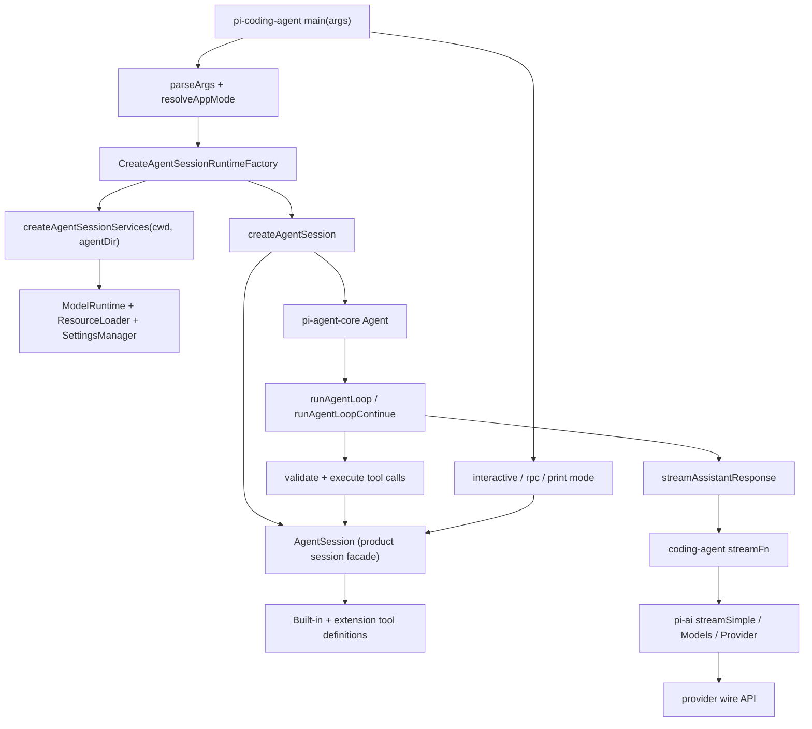

> `spine.overview` 描述 Pi monorepo 从 CLI 产品入口到 reusable agent harness、再到 multi-provider LLM streaming 的端到端主路径。

## 能回答的问题

- Pi monorepo 的九个源码 workspace package 分别承担什么职责，五个 extension-example workspace 如何归类？
- `main()` 怎样把 argv、settings、session、trust 和 mode 组装成一次可运行的 coding agent session？
- `pi-agent-core` 的 `Agent` / `runAgentLoop` 与 `pi-coding-agent` 的 `AgentSession` 边界在哪里？
- 模型与 provider streaming 在 `pi-ai`、`ModelRuntime` 和 `Agent` stream function 之间怎样交接？
- 内置工具、slash commands、RPC protocol 这些产品能力的 ground truth 文件在哪里？

## 总览图

```mermaid
flowchart TD
  CLI["pi-coding-agent main(args)"] --> Parse["parseArgs + resolveAppMode"]
  Parse --> RuntimeFactory["CreateAgentSessionRuntimeFactory"]
  RuntimeFactory --> Services["createAgentSessionServices(cwd, agentDir)"]
  Services --> Registry["ModelRuntime + ResourceLoader + SettingsManager"]
  RuntimeFactory --> SDK["createAgentSession"]
  SDK --> Session["AgentSession (product session facade)"]
  SDK --> CoreAgent["pi-agent-core Agent"]
  Session --> ToolDefs["Built-in + extension tool definitions"]
  CoreAgent --> Loop["runAgentLoop / runAgentLoopContinue"]
  Loop --> LLM["streamAssistantResponse"]
  LLM --> StreamFn["coding-agent streamFn"]
  StreamFn --> PiAI["pi-ai streamSimple / Models / Provider"]
  PiAI --> Wire["provider wire API"]
  Loop --> ToolExec["validate + execute tool calls"]
  ToolExec --> Session
  CLI --> Modes["interactive / rpc / print mode"]
  Modes --> Session
```

## 端到端主路径

1. `README.md` 把 Pi 定义为 Pi agent harness 项目，并在 package 表中列出 `pi-ai`、`pi-agent-core`、`pi-coding-agent`、`pi-tui` 的职责。[E: README.md:13] [E: README.md:15] [E: README.md:30] [E: README.md:31] [E: README.md:32] [E: README.md:33]
2. `main(args)` 是 `pi-coding-agent` 的 exported CLI entry point；它解析 argv，并把解析结果继续用于 mode、session、runtime 和 session option 装配。[E: packages/coding-agent/src/main.ts:521] [E: packages/coding-agent/src/main.ts:561] [E: packages/coding-agent/src/main.ts:592] [E: packages/coding-agent/src/main.ts:630] [E: packages/coding-agent/src/main.ts:667] [E: packages/coding-agent/src/main.ts:769]
3. `main(args)` 先解析 app mode：`rpc` 和 `json` 显式选择对应 mode，`--print` 或非 TTY stdin/stdout 进入 print mode，其余情况进入 interactive mode。[E: packages/coding-agent/src/main.ts:109] [E: packages/coding-agent/src/main.ts:110] [E: packages/coding-agent/src/main.ts:113] [E: packages/coding-agent/src/main.ts:116] [E: packages/coding-agent/src/main.ts:119]
4. session 选择由 `createSessionManager()` 处理：`--no-session`、help、list models 走 in-memory session；`--fork`、`--session`、`--resume`、`--continue`、`--session-id` 分别走 fork/open/select/continue/create 的分支。[E: packages/coding-agent/src/main.ts:312] [E: packages/coding-agent/src/main.ts:318] [E: packages/coding-agent/src/main.ts:322] [E: packages/coding-agent/src/main.ts:345] [E: packages/coding-agent/src/main.ts:369] [E: packages/coding-agent/src/main.ts:386] [E: packages/coding-agent/src/main.ts:390] [E: packages/coding-agent/src/main.ts:402]
5. `main(args)` 创建 `CreateAgentSessionRuntimeFactory`，该 factory 在目标 cwd 下创建 `SettingsManager`、`ModelRuntime`、`ResourceLoader` 等 cwd-bound services，再把 model、thinking、scoped models、tool allow/deny list 和 custom tools 传给 `createAgentSessionFromServices()`。[E: packages/coding-agent/src/main.ts:667] [E: packages/coding-agent/src/main.ts:685] [E: packages/coding-agent/src/main.ts:686] [E: packages/coding-agent/src/main.ts:730] [E: packages/coding-agent/src/main.ts:741] [E: packages/coding-agent/src/main.ts:743] [E: packages/coding-agent/src/main.ts:769] [E: packages/coding-agent/src/main.ts:773] [E: packages/coding-agent/src/main.ts:774] [E: packages/coding-agent/src/main.ts:775] [E: packages/coding-agent/src/main.ts:776] [E: packages/coding-agent/src/main.ts:777] [E: packages/coding-agent/src/main.ts:778] [E: packages/coding-agent/src/main.ts:779]
6. `createAgentSessionRuntime()` 创建 `AgentSessionRuntime`，该 runtime 保存当前 `AgentSession` 与 cwd-bound services；`switchSession()`、`newSession()`、`fork()`、`importFromJsonl()` 都通过保存的 `createRuntime` 重建并替换当前 runtime。[E: packages/coding-agent/src/core/agent-session-runtime.ts:74] [E: packages/coding-agent/src/core/agent-session-runtime.ts:97] [E: packages/coding-agent/src/core/agent-session-runtime.ts:101] [E: packages/coding-agent/src/core/agent-session-runtime.ts:196] [E: packages/coding-agent/src/core/agent-session-runtime.ts:226] [E: packages/coding-agent/src/core/agent-session-runtime.ts:262] [E: packages/coding-agent/src/core/agent-session-runtime.ts:361] [E: packages/coding-agent/src/core/agent-session-runtime.ts:414] [E: packages/coding-agent/src/core/agent-session-runtime.ts:424] [E: packages/coding-agent/src/core/agent-session-runtime.ts:425]
7. `createAgentSession()` 创建 core `Agent`，注入 coding-agent 的 `convertToLlm` wrapper、provider `streamFn`、extension hooks、queue mode、transport、thinking budgets，然后创建 `AgentSession` facade。[E: packages/coding-agent/src/core/sdk.ts:169] [E: packages/coding-agent/src/core/sdk.ts:294] [E: packages/coding-agent/src/core/sdk.ts:301] [E: packages/coding-agent/src/core/sdk.ts:302] [E: packages/coding-agent/src/core/sdk.ts:331] [E: packages/coding-agent/src/core/sdk.ts:338] [E: packages/coding-agent/src/core/sdk.ts:350] [E: packages/coding-agent/src/core/sdk.ts:355] [E: packages/coding-agent/src/core/sdk.ts:357] [E: packages/coding-agent/src/core/sdk.ts:358] [E: packages/coding-agent/src/core/sdk.ts:376]
8. `Agent.prompt()` / `Agent.continue()` 是 stateful wrapper 到 loop 的调用点：`prompt()` 规范化输入后进入 `runAgentLoop()`，`continue()` 进入 `runAgentLoopContinue()`，两者都传入 context snapshot、loop config、event processor 和 `streamFn`。[E: packages/agent/src/agent.ts:344] [E: packages/agent/src/agent.ts:357] [E: packages/agent/src/agent.ts:409] [E: packages/agent/src/agent.ts:410] [E: packages/agent/src/agent.ts:416] [E: packages/agent/src/agent.ts:422] [E: packages/agent/src/agent.ts:423] [E: packages/agent/src/agent.ts:428]
9. `runAgentLoop()` 将 prompt 追加到 context，emit `agent_start`、`turn_start`、message start/end，然后进入 `runLoop()`；`runLoop()` 负责 assistant streaming、tool call detection、tool execution、turn end、prepare-next-turn、stop condition、steering/follow-up polling。[E: packages/agent/src/agent-loop.ts:95] [E: packages/agent/src/agent-loop.ts:103] [E: packages/agent/src/agent-loop.ts:106] [E: packages/agent/src/agent-loop.ts:109] [E: packages/agent/src/agent-loop.ts:110] [E: packages/agent/src/agent-loop.ts:112] [E: packages/agent/src/agent-loop.ts:113] [E: packages/agent/src/agent-loop.ts:116] [E: packages/agent/src/agent-loop.ts:155] [E: packages/agent/src/agent-loop.ts:193] [E: packages/agent/src/agent-loop.ts:203] [E: packages/agent/src/agent-loop.ts:214] [E: packages/agent/src/agent-loop.ts:224] [E: packages/agent/src/agent-loop.ts:232] [E: packages/agent/src/agent-loop.ts:247] [E: packages/agent/src/agent-loop.ts:259] [E: packages/agent/src/agent-loop.ts:263]
10. `runAgentLoop()` 先用显式 `streamFn`，缺省时调用 `getDefaultStreamFn()`；`streamAssistantResponse()` 再把 AgentMessage 转成 LLM Message、构造 `Context`，并调用已经解析好的 `streamFunction`。`pi-coding-agent` 在产品装配层把兼容 `streamSimple` 安装为全局默认值，`pi-agent-core` 本身没有直接退回 provider 实现。[E: packages/agent/src/agent-loop.ts:116] [E: packages/agent/src/agent-loop.ts:289] [E: packages/agent/src/agent-loop.ts:295] [E: packages/agent/src/agent-loop.ts:298] [E: packages/agent/src/agent-loop.ts:308] [E: packages/coding-agent/src/core/sdk.ts:36]
11. tool execution 仍在 `pi-agent-core` loop 内按 generic contract 执行：loop 从 assistant message content 中筛出 `toolCall`，若配置或工具要求 sequential 就串行，否则并行执行；执行前做 tool lookup、argument preparation、schema validation 和 `beforeToolCall` hook，执行后应用 `afterToolCall` hook 并生成 `toolResult` message。[E: packages/agent/src/agent-loop.ts:411] [E: packages/agent/src/agent-loop.ts:418] [E: packages/agent/src/agent-loop.ts:422] [E: packages/agent/src/agent-loop.ts:423] [E: packages/agent/src/agent-loop.ts:425] [E: packages/agent/src/agent-loop.ts:489] [E: packages/agent/src/agent-loop.ts:600] [E: packages/agent/src/agent-loop.ts:607] [E: packages/agent/src/agent-loop.ts:617] [E: packages/agent/src/agent-loop.ts:618] [E: packages/agent/src/agent-loop.ts:619] [E: packages/agent/src/agent-loop.ts:675] [E: packages/agent/src/agent-loop.ts:720] [E: packages/agent/src/agent-loop.ts:773]
12. `main(args)` 最后按 app mode 派发：RPC mode 调 `runRpcMode(runtime)`，interactive mode 创建 `InteractiveMode(runtime)` 并 `run()`，print/json mode 调 `runPrintMode(runtime, ...)`。[E: packages/coding-agent/src/main.ts:868] [E: packages/coding-agent/src/main.ts:870] [E: packages/coding-agent/src/main.ts:871] [E: packages/coding-agent/src/main.ts:872] [E: packages/coding-agent/src/main.ts:901] [E: packages/coding-agent/src/main.ts:904]

## 包边界

`pi-agent-core` 是可复用 runtime harness：`Agent` 是 stateful wrapper，拥有 transcript、lifecycle listener、steering/follow-up queue、stream function 和 tool hooks；底层 `runAgentLoop` / `runAgentLoopContinue` 消费 context、loop config、event sink 和 optional `StreamFn`。[E: packages/agent/src/agent.ts:173] [E: packages/agent/src/agent.ts:175] [E: packages/agent/src/agent.ts:176] [E: packages/agent/src/agent.ts:177] [E: packages/agent/src/agent.ts:179] [E: packages/agent/src/agent.ts:181] [E: packages/agent/src/agent.ts:185] [E: packages/agent/src/agent.ts:189] [E: packages/agent/src/agent-loop.ts:95] [E: packages/agent/src/agent-loop.ts:120]

`pi-coding-agent` 是产品装配层：`main()` 管 argv parsing、settings、session selection、project trust、runtime creation、mode dispatch；`createAgentSessionFromServices()` 把 cwd-bound services 和 session options 转给 `createAgentSession()`，后者把 `Agent`、`SessionManager`、`SettingsManager`、`ResourceLoader`、`ModelRuntime`、tool/filter 选项包成 `AgentSession`。[E: packages/coding-agent/src/main.ts:521] [E: packages/coding-agent/src/main.ts:561] [E: packages/coding-agent/src/main.ts:610] [E: packages/coding-agent/src/main.ts:630] [E: packages/coding-agent/src/main.ts:654] [E: packages/coding-agent/src/main.ts:793] [E: packages/coding-agent/src/main.ts:868] [E: packages/coding-agent/src/core/agent-session-services.ts:200] [E: packages/coding-agent/src/core/agent-session-services.ts:203] [E: packages/coding-agent/src/core/agent-session-services.ts:206] [E: packages/coding-agent/src/core/sdk.ts:376] [E: packages/coding-agent/src/core/sdk.ts:384]。`spine.layered-architecture` 应继续细化这个 `pi-agent-core` reusable harness 与 `pi-coding-agent` product assembly 的边界。[I]

`pi-ai` 是 provider/runtime LLM API 层：`Provider` 拥有 provider id/name/base metadata、auth、model listing 和 stream behavior；`Models` 是 provider collection，负责 auth application 和把 stream request 委派给拥有该 model 的 provider；built-in provider 集合由 `builtinProviders()` / `builtinModels()` 构造。[E: packages/ai/src/models.ts:75] [E: packages/ai/src/models.ts:76] [E: packages/ai/src/models.ts:77] [E: packages/ai/src/models.ts:79] [E: packages/ai/src/models.ts:89] [E: packages/ai/src/models.ts:97] [E: packages/ai/src/models.ts:113] [E: packages/ai/src/models.ts:119] [E: packages/ai/src/models.ts:127] [E: packages/ai/src/models.ts:215] [E: packages/ai/src/models.ts:489] [E: packages/ai/src/models.ts:278] [E: packages/ai/src/providers/all.ts:88] [E: packages/ai/src/providers/all.ts:133] [E: packages/ai/src/providers/all.ts:135]

`pi-tui` 是 terminal UI library，README 把它描述为 differential rendering 的 terminal UI package。[E: README.md:33] 在本 overview 覆盖的主路径中，interactive mode 创建 `InteractiveMode(runtime)` 并 `run()`；具体 TUI 渲染组件不在本节点展开。[E: packages/coding-agent/src/main.ts:872] [E: packages/coding-agent/src/main.ts:901] `spine.process-lifecycle` 和 TUI surface/subsystem 节点应覆盖交互模式渲染细节。[I]

本轮新增三类外围边界：agent-core 顶层公开可复用的 bash/read/edit/write execution tool factories；`pi-storage-sqlite-node` 是可选发布的 agent-core session backend；private `pi-evals` 以真实 coding-agent session 做行为评测。实验性 `pi-server` 则把 coding-agent RPC 子进程封装成多实例 IPC server。[E: packages/agent/src/harness/tools/index.ts:1] [E: packages/agent/src/harness/tools/index.ts:23] [E: packages/storage/sqlite-node/package.json:2] [E: packages/storage/sqlite-node/package.json:4] [E: packages/evals/package.json:2] [E: packages/evals/package.json:4] [E: packages/server/package.json:2] [E: packages/server/package.json:4] [I]

## 关键决策点

`CreateAgentSessionRuntimeFactory` 把 process-global inputs 与 cwd-bound services 分开：`main()` 创建的 factory 接受 cwd、agentDir、sessionManager、sessionStartEvent、projectTrustContext；`createAgentSessionServices()` 在 effective cwd 下创建/接收 `ModelRuntime`、`SettingsManager`、`DefaultResourceLoader`，reload resources，并把 extension provider registrations 写入 runtime。[E: packages/coding-agent/src/main.ts:667] [E: packages/coding-agent/src/main.ts:668] [E: packages/coding-agent/src/main.ts:669] [E: packages/coding-agent/src/main.ts:670] [E: packages/coding-agent/src/main.ts:671] [E: packages/coding-agent/src/main.ts:672] [E: packages/coding-agent/src/main.ts:685] [E: packages/coding-agent/src/main.ts:686] [E: packages/coding-agent/src/core/agent-session-services.ts:134] [E: packages/coding-agent/src/core/agent-session-services.ts:137] [E: packages/coding-agent/src/core/agent-session-services.ts:139] [E: packages/coding-agent/src/core/agent-session-services.ts:141] [E: packages/coding-agent/src/core/agent-session-services.ts:145] [E: packages/coding-agent/src/core/agent-session-services.ts:146] [E: packages/coding-agent/src/core/agent-session-services.ts:152] [E: packages/coding-agent/src/core/agent-session-services.ts:156] [E: packages/coding-agent/src/core/agent-session-services.ts:158]

`AgentSession._buildRuntime()` 是产品工具和 extension runtime 的重装点：它创建 built-in tool definitions、构造 `ExtensionRunner`、绑定 extension core/UI，并把默认 active built-in tools 设为 `read`、`bash`、`edit`、`write`；完整 built-in tool name set 在 tools index 中是 `read`、`bash`、`edit`、`write`、`grep`、`find`、`ls`。[E: packages/coding-agent/src/core/agent-session.ts:2559] [E: packages/coding-agent/src/core/agent-session.ts:2574] [E: packages/coding-agent/src/core/agent-session.ts:2590] [E: packages/coding-agent/src/core/agent-session.ts:2600] [E: packages/coding-agent/src/core/agent-session.ts:2601] [E: packages/coding-agent/src/core/agent-session.ts:2603] [E: packages/coding-agent/src/core/agent-session.ts:2607] [E: packages/coding-agent/src/core/tools/index.ts:83] [E: packages/coding-agent/src/core/tools/index.ts:84] [E: packages/coding-agent/src/core/tools/index.ts:156]

`ModelRuntime` 是 `pi-coding-agent` 对 `pi-ai` provider/model layer 的产品侧运行时：`main()` 从 services 取得 runtime，用它解析 model scope/session options；runtime 加载 built-ins 与 `models.json`，合成 extension provider，提供 lookup/availability/auth resolution，并负责 authenticated stream dispatch [E: packages/coding-agent/src/main.ts:730] [E: packages/coding-agent/src/main.ts:741] [E: packages/coding-agent/src/main.ts:743] [E: packages/coding-agent/src/main.ts:752] [E: packages/coding-agent/src/core/model-runtime.ts:98] [E: packages/coding-agent/src/core/model-runtime.ts:134] [E: packages/coding-agent/src/core/model-runtime.ts:138] [E: packages/coding-agent/src/core/model-runtime.ts:149] [E: packages/coding-agent/src/core/model-runtime.ts:205] [E: packages/coding-agent/src/core/model-runtime.ts:220] [E: packages/coding-agent/src/core/model-runtime.ts:319] [E: packages/coding-agent/src/core/model-runtime.ts:331] [E: packages/coding-agent/src/core/model-runtime.ts:394] [E: packages/coding-agent/src/core/model-runtime.ts:484] [E: packages/coding-agent/src/core/model-runtime.ts:570]。`ModelRegistry` 仅保留 extension compatibility facade [E: packages/coding-agent/src/core/model-registry.ts:29] [E: packages/coding-agent/src/core/model-registry.ts:32] [E: packages/coding-agent/src/core/model-registry.ts:33]。

`StreamFn` 的类型边界在 `pi-agent-core` 声明；`streamAssistantResponse()` 接收 optional `streamFn`，未提供时回退到 `streamSimple`，随后调用 stream function。coding-agent 注入的 `streamFn` 直接调用 `ModelRuntime.streamSimple()`；runtime 在 provider dispatch 前统一完成 auth/baseUrl/header/env 准备。若该 async wrapper 抛错，`Agent.runWithLifecycle()` 会走 failure message 路径 [E: packages/agent/src/types.ts:28] [E: packages/agent/src/agent-loop.ts:281] [E: packages/agent/src/agent-loop.ts:286] [E: packages/agent/src/agent-loop.ts:308] [E: packages/agent/src/agent-loop.ts:308] [E: packages/coding-agent/src/core/sdk.ts:302] [E: packages/coding-agent/src/core/sdk.ts:308] [E: packages/coding-agent/src/core/sdk.ts:312] [E: packages/coding-agent/src/core/model-runtime.ts:456] [E: packages/coding-agent/src/core/model-runtime.ts:462] [E: packages/coding-agent/src/core/model-runtime.ts:474] [E: packages/coding-agent/src/core/model-runtime.ts:510] [E: packages/coding-agent/src/core/model-runtime.ts:513] [E: packages/agent/src/agent.ts:482] [E: packages/agent/src/agent.ts:498] [E: packages/agent/src/agent.ts:500] [E: packages/agent/src/agent.ts:507]

## Ground Truth 索引

内置工具集的 ground truth 是 `packages/coding-agent/src/core/tools/index.ts`：`ToolName` / `allToolNames` 列出 `read`、`bash`、`edit`、`write`、`grep`、`find`、`ls`，`createAllToolDefinitions()` 返回同一组 tool definitions。[E: packages/coding-agent/src/core/tools/index.ts:83] [E: packages/coding-agent/src/core/tools/index.ts:84] [E: packages/coding-agent/src/core/tools/index.ts:156] [E: packages/coding-agent/src/core/tools/index.ts:157]

provider 集的 ground truth 是 `packages/ai/src/providers/all.ts`：`builtinProviders()` freshly constructs provider factories，`builtinModels()` 创建 `Models` collection 并逐个 `setProvider()`。[E: packages/ai/src/providers/all.ts:88] [E: packages/ai/src/providers/all.ts:89] [E: packages/ai/src/providers/all.ts:133] [E: packages/ai/src/providers/all.ts:134] [E: packages/ai/src/providers/all.ts:135] [E: packages/ai/src/providers/all.ts:136]

slash command 的 built-in ground truth 是 `BUILTIN_SLASH_COMMANDS`；RPC command union 在 `rpc-types.ts`，RPC mode 通过 JSONL stdin 读取 command，在 `switch (command.type)` 内 dispatch，并在 session replacement 后 rebind runtime session。[E: packages/coding-agent/src/core/slash-commands.ts:19] [E: packages/coding-agent/src/core/slash-commands.ts:20] [E: packages/coding-agent/src/core/slash-commands.ts:41] [E: packages/coding-agent/src/modes/rpc/rpc-types.ts:20] [E: packages/coding-agent/src/modes/rpc/rpc-types.ts:22] [E: packages/coding-agent/src/modes/rpc/rpc-types.ts:73] [E: packages/coding-agent/src/modes/rpc/rpc-mode.ts:53] [E: packages/coding-agent/src/modes/rpc/rpc-mode.ts:312] [E: packages/coding-agent/src/modes/rpc/rpc-mode.ts:388] [E: packages/coding-agent/src/modes/rpc/rpc-mode.ts:393] [E: packages/coding-agent/src/modes/rpc/rpc-mode.ts:600] [E: packages/coding-agent/src/modes/rpc/rpc-mode.ts:608] [E: packages/coding-agent/src/modes/rpc/rpc-mode.ts:677] [E: packages/coding-agent/src/modes/rpc/rpc-mode.ts:805]

## 指向 T1/T2 深挖

`spine.layered-architecture` 应从 package-level 角度解释 `pi-ai`、`pi-agent-core`、`pi-coding-agent`、`pi-tui` 的依赖方向和可复用边界；本节点只给端到端鸟瞰。[I]

`spine.process-lifecycle` 应从 `main(args)` 展开 argv parsing、session selection、project trust、runtime creation、mode dispatch；本节点只保留关键分支和锚点。[I]

`spine.agent-loop` 应从 `Agent.prompt()` / `runAgentLoop()` 展开 one turn 内 assistant streaming、tool calls、steering、follow-up、termination；本节点只描述 loop 责任和主要事件。[I]

`spine.provider-stream` 应从 `ModelRuntime`、`streamFn`、`pi-ai` provider dispatch、wire API 展开 provider request/response normalization；本节点只定位边界。[I]

`ref.package-index` 应列出 monorepo 包、build/test/toolchain 和 package metadata；本节点只引用 README 中的 package description。[I]

## Sources

- README.md
- packages/coding-agent/src/main.ts
- packages/coding-agent/src/core/agent-session-runtime.ts
- packages/coding-agent/src/core/agent-session-services.ts
- packages/coding-agent/src/core/sdk.ts
- packages/coding-agent/src/core/agent-session.ts
- packages/coding-agent/src/core/model-registry.ts
- packages/coding-agent/src/core/tools/index.ts
- packages/coding-agent/src/core/slash-commands.ts
- packages/coding-agent/src/modes/rpc/rpc-types.ts
- packages/coding-agent/src/modes/rpc/rpc-mode.ts
- packages/agent/src/agent.ts
- packages/agent/src/agent-loop.ts
- packages/agent/src/types.ts
- packages/agent/src/harness/tools/index.ts
- packages/ai/src/models.ts
- packages/ai/src/providers/all.ts
- packages/storage/sqlite-node/package.json
- packages/evals/package.json
- packages/server/package.json

## 相关

- [spine.layered-architecture](layered-architecture.md) - 分层架构与包边界。
- [spine.process-lifecycle](process-lifecycle.md) - 进程生命周期(argv->mode->session)。
- [spine.agent-loop](agent-loop.md) - agent 回合循环(一次 turn)。
- [spine.provider-stream](provider-stream.md) - provider 流式调用(统一->wire->归一)。
- [ref.package-index](../reference/package-index.md) - monorepo 包索引与工具链。
