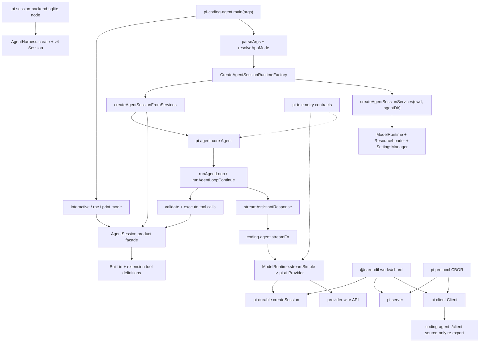

> `spine.overview` 描述 Pi monorepo（产品版本 **0.87.1** + `[Unreleased]`，wiki target SHA `ff72faba28`）从 `pi-coding-agent` CLI 产品入口，经 reusable `pi-agent-core` harness，再到 multi-provider `pi-ai` streaming 的端到端主路径。一阶源码包 **11** 个（原 10 个 + `packages/durable`）。`@earendil-works/pi-durable` 是 durable conversation/task/document runtime，插在根 `build` 的 `ai` 与 `agent` 之间，但 **不是** coding-agent `SessionManager` JSONL 的替代。`@earendil-works/chord` 是独立 application-composition runtime；远程 `protocol` / Chord 风格 `pi-client` `Client` / `pi-server` 是另一条 composable session 栈，不等于本地 RPC mode。

## 能回答的问题

- Pi monorepo 当前 workspace 如何组成：11 个一阶源码包（+`durable`）+ `session-backends` + 5 个 extension-example？
- 根 `build` 顺序为什么从 `@earendil-works/chord` 开始，`durable` 插在哪，chord 是否依赖其它 Pi workspace 包？
- `main()` 怎样把 argv、settings、session、trust 和 mode 组装成一次可运行的 coding agent session？
- `pi-agent-core` 的 `Agent` / `runAgentLoop` 与 `pi-coding-agent` 的 `AgentSession` 边界在哪里？
- 模型与 provider streaming 在 `pi-ai`、`ModelRuntime` 和 `Agent` stream function 之间怎样交接？
- 内置工具、slash commands、RPC protocol、telemetry、session-backends、durable 这些能力的 ground truth 文件在哪里？

## 总览图

```mermaid
flowchart TD
  CLI["pi-coding-agent main(args)"] --> Parse["parseArgs + resolveAppMode"]
  Parse --> RuntimeFactory["CreateAgentSessionRuntimeFactory"]
  RuntimeFactory --> Services["createAgentSessionServices(cwd, agentDir)"]
  Services --> Registry["ModelRuntime + ResourceLoader + SettingsManager"]
  RuntimeFactory --> SDK["createAgentSessionFromServices"]
  SDK --> Session["AgentSession product facade"]
  SDK --> CoreAgent["pi-agent-core Agent"]
  Session --> ToolDefs["Built-in + extension tool definitions"]
  CoreAgent --> Loop["runAgentLoop / runAgentLoopContinue"]
  Loop --> LLM["streamAssistantResponse"]
  LLM --> StreamFn["coding-agent streamFn"]
  StreamFn --> PiAI["ModelRuntime.streamSimple -> pi-ai Provider"]
  PiAI --> Wire["provider wire API"]
  Loop --> ToolExec["validate + execute tool calls"]
  ToolExec --> Session
  CLI --> Modes["interactive / rpc / print mode"]
  Modes --> Session
  Telemetry["pi-telemetry contracts"] -.-> CoreAgent
  Telemetry -.-> PiAI
  SQLite["pi-session-backend-sqlite-node"] -.-> Harness["AgentHarness.create + v4 Session"]
  Chord["@earendil-works/chord"] --> Client["pi-client Client"]
  Chord --> Server["pi-server"]
  Chord --> Durable["pi-durable createSession"]
  PiAI --> Durable
  Protocol["pi-protocol CBOR"] --> Client
  Protocol --> Server
  Client -.-> Reexport["coding-agent ./client source-only re-export"]
```

## 端到端主路径

1. `README.md` 把 Pi 定义为 Pi agent harness 项目；产品入口是 `@earendil-works/pi-coding-agent`，runtime 是 `@earendil-works/pi-agent-core`，LLM API 是 `@earendil-works/pi-ai`。All Packages 表现在列出 chord、telemetry、ai、**durable**、agent-core、coding-agent、tui。[E: README.md:13] [E: README.md:15] [E: README.md:30] [E: README.md:33] [E: README.md:34] [E: README.md:35] [E: README.md:36]
2. 根 `workspaces` 是 `packages/*`、`packages/session-backends/*`，再显式列入五个 coding-agent extension examples（`with-deps`、`custom-provider-anthropic`、`custom-provider-gitlab-duo`、`sandbox`、`gondolin`）。[E: package.json:5] [E: package.json:6] [E: package.json:7] [E: package.json:8] [E: package.json:9] [E: package.json:10] [E: package.json:11] [E: package.json:12] `packages/*` 下一层是 **11** 个一阶源码目录：`ai`、`agent`、`chord`、`client`、`coding-agent`、`durable`、`evals`、`protocol`、`server`、`telemetry`、`tui`。根 `build` 顺序是 **chord → tui → telemetry → ai → durable → agent → sqlite-node → protocol → client → server → coding-agent**；`evals` 不在根 `build` 脚本里。[E: package.json:16] [E: packages/evals/package.json:2] [E: packages/evals/package.json:4]
3. `@earendil-works/chord` 版本 `0.87.1`，描述为 services / replicated state / RPC / plugins 的 application-composition runtime；`dependencies` 只有 `esbuild`，**不依赖任何其它 Pi workspace 包**。[E: packages/chord/package.json:2] [E: packages/chord/package.json:3] [E: packages/chord/package.json:4] [E: packages/chord/package.json:65] 公开入口导出 `defineFacet` / `defineService` / `replicatedState` / `createFacetHost` 等。[E: packages/chord/src/index.ts:6] [E: packages/chord/src/index.ts:9] [E: packages/chord/src/index.ts:10] [E: packages/chord/src/index.ts:11]
4. `@earendil-works/pi-durable` 版本 `0.87.1`；根入口导出 `createSession`、`MemoryStorage`、`ROOT_CONVERSATION_ID`、`defineDoc` / `defineDocFamily`。运行依赖 chord 与 `pi-ai`。[E: packages/durable/package.json:2] [E: packages/durable/package.json:3] [E: packages/durable/src/index.ts:1] [E: packages/durable/src/index.ts:3] [E: packages/durable/src/index.ts:62] [E: packages/durable/package.json:87] [E: packages/durable/package.json:88] `pi-agent-core` / `pi-coding-agent` **不**依赖本包（agent runtime deps 是 chord / `pi-ai` / `pi-telemetry`）；CLI 默认会话仍是 `SessionManager` v3 JSONL。[E: packages/agent/package.json:62] [E: packages/agent/package.json:63] [E: packages/agent/package.json:64] [E: packages/coding-agent/package.json:52] [E: packages/coding-agent/src/core/session-manager.ts:41]
5. `main(args)` 是 `pi-coding-agent` 的 exported CLI entry point：先处理 auth / package / config 子命令，再 `parseArgs(args)` 进入 session 与 runtime 装配。[E: packages/coding-agent/src/main.ts:566] [E: packages/coding-agent/src/main.ts:575] [E: packages/coding-agent/src/main.ts:590] [E: packages/coding-agent/src/main.ts:603] [E: packages/coding-agent/src/main.ts:607]
6. `resolveAppMode()` 决定 app mode：`rpc` 与 `json` 走显式 mode；`--print` 或非 TTY stdin/stdout 进入 print mode；其余进入 interactive mode。[E: packages/coding-agent/src/main.ts:111] [E: packages/coding-agent/src/main.ts:112] [E: packages/coding-agent/src/main.ts:115] [E: packages/coding-agent/src/main.ts:118] [E: packages/coding-agent/src/main.ts:121]
7. `createSessionManager()` 选择产品级 `SessionManager`：`--no-session` / help / list models 走 in-memory；`--fork` / `--session` / `--resume` / `--continue` / `--session-id` 分别 fork、open、select、continue 或 create。[E: packages/coding-agent/src/main.ts:357] [E: packages/coding-agent/src/main.ts:363] [E: packages/coding-agent/src/main.ts:367] [E: packages/coding-agent/src/main.ts:390] [E: packages/coding-agent/src/main.ts:414] [E: packages/coding-agent/src/main.ts:431] [E: packages/coding-agent/src/main.ts:435] [E: packages/coding-agent/src/main.ts:447]
8. `main(args)` 创建 `CreateAgentSessionRuntimeFactory`：在目标 cwd 下调用 `createAgentSessionServices()` 得到 `SettingsManager`、`ModelRuntime`、`ResourceLoader`，再把 model / thinking / scoped models / tool allow-deny / custom tools 交给 `createAgentSessionFromServices()`。[E: packages/coding-agent/src/main.ts:717] [E: packages/coding-agent/src/main.ts:736] [E: packages/coding-agent/src/main.ts:825]
9. `createAgentSessionRuntime()` 用该 factory 构造 `AgentSessionRuntime`；`switchSession()` / `newSession()` / `fork()` / `importFromJsonl()` 都通过保存的 `createRuntime` 重建并替换当前 runtime。[E: packages/coding-agent/src/core/agent-session-runtime.ts:75] [E: packages/coding-agent/src/core/agent-session-runtime.ts:196] [E: packages/coding-agent/src/core/agent-session-runtime.ts:226] [E: packages/coding-agent/src/core/agent-session-runtime.ts:262] [E: packages/coding-agent/src/core/agent-session-runtime.ts:359] [E: packages/coding-agent/src/core/agent-session-runtime.ts:420]
10. `createAgentSession()` 创建 core `Agent`，注入 coding-agent 的 `convertToLlm` wrapper、provider `streamFn`（内部 `ModelRuntime.streamSimple()`）、extension hooks、queue mode、transport、thinking budgets，以及 `CacheWarmer`，然后创建 `AgentSession` facade。[E: packages/coding-agent/src/core/sdk.ts:175] [E: packages/coding-agent/src/core/sdk.ts:306] [E: packages/coding-agent/src/core/sdk.ts:380] [E: packages/coding-agent/src/core/sdk.ts:399] [E: packages/coding-agent/src/core/sdk.ts:430]
11. `Agent.prompt()` / `Agent.continue()` 是 stateful wrapper 到 loop 的调用点：`prompt()` 规范化输入后走 `runPromptMessages()` → `runAgentLoop()`；`continue()` 在 last message 不是 assistant 时走 `runContinuation()` → `runAgentLoopContinue()`，若 last 是 assistant 且 steering / follow-up 队列非空则改走 `runPromptMessages()`。两条 loop 入口都传入 context snapshot、loop config、event processor 和 `streamFunction`。[E: packages/agent/src/agent.ts:373] [E: packages/agent/src/agent.ts:384] [E: packages/agent/src/agent.ts:397] [E: packages/agent/src/agent.ts:403] [E: packages/agent/src/agent.ts:437] [E: packages/agent/src/agent.ts:450]
12. `runAgentLoop()` 将 prompt 追加到 context，emit `agent_start` / `turn_start` / message start-end，然后进入 `runLoop()`；`runLoop()` 负责 assistant streaming、tool call detection、tool execution、`finishTurn`、`turn_end`、steering / follow-up polling。[E: packages/agent/src/agent-loop.ts:101] [E: packages/agent/src/agent-loop.ts:116] [E: packages/agent/src/agent-loop.ts:123] [E: packages/agent/src/agent-loop.ts:241] [E: packages/agent/src/agent-loop.ts:258] [E: packages/agent/src/agent-loop.ts:285] [E: packages/agent/src/agent-loop.ts:286]
13. `runAgentLoop()` 把 `streamFn ?? getDefaultStreamFn()` 交给 `runLoop()`；`getDefaultStreamFn()` 在未安装时抛错，`pi-agent-core` 本身不绑定 provider。`pi-coding-agent` 在 SDK 模块顶层调用 `setDefaultStreamFn(streamSimple)`；产品装配的 `streamFn` 则直接调 `ModelRuntime.streamSimple()`。[E: packages/agent/src/agent-loop.ts:123] [E: packages/agent/src/stream-fn.ts:11] [E: packages/agent/src/stream-fn.ts:15] [E: packages/coding-agent/src/core/sdk.ts:39] [E: packages/coding-agent/src/core/sdk.ts:399]
14. `streamAssistantResponse()` 先跑 `transformContext`，再 `convertToLlm` 把 `AgentMessage[]` 转成 LLM `Message[]`，`normalizeContext()` 折成 `TranscriptContext`，然后调用已经解析好的 `streamFunction`。[E: packages/agent/src/agent-loop.ts:388] [E: packages/agent/src/agent-loop.ts:394] [E: packages/agent/src/agent-loop.ts:396] [E: packages/ai/src/utils/transcript.ts:30] [E: packages/agent/src/types.ts:33]
15. tool execution 在 `pi-agent-core` loop 内按 generic contract 执行：从 assistant content 筛出 `toolCall`；若 `toolExecution === "sequential"` 或任一工具 `executionMode === "sequential"` 则串行，否则并行。[E: packages/agent/src/agent-loop.ts:505] [E: packages/agent/src/agent-loop.ts:512] [E: packages/agent/src/agent-loop.ts:516]
16. `main(args)` 最后按 app mode 派发：RPC mode 调 `runRpcMode(runtime)`，`appMode === "interactive"` 时创建 `InteractiveMode(runtime)` 并 `run()`，print / json mode 调 `runPrintMode(runtime, ...)`。[E: packages/coding-agent/src/main.ts:934] [E: packages/coding-agent/src/main.ts:936] [E: packages/coding-agent/src/main.ts:937] [E: packages/coding-agent/src/main.ts:969] [E: packages/coding-agent/src/main.ts:972]

## 包边界

`@earendil-works/chord` 是独立 application-composition runtime：facets / services / replicated state / remote service boundary。它不依赖 `pi-ai` / `pi-agent-core` / `pi-coding-agent`。[E: packages/chord/package.json:4] [E: packages/chord/package.json:65] `pi-client` 与 `pi-server` 依赖 chord；`pi-agent-core` 与 `pi-coding-agent` 也把 chord 列为 runtime dependency，但 CLI 默认路径仍是本地 `AgentSession`，不是 remote session 产品。[E: packages/client/package.json:50] [E: packages/server/package.json:50] [E: packages/agent/package.json:62] [E: packages/coding-agent/package.json:52]

`@earendil-works/pi-durable` 提供 `createSession(storage)` Session kernel、document tokens 与 Memory/JSONL/SQLite `Storage`。根导出 runtime-neutral；Node 文件后端走 `storage/jsonl/node` 与 `storage/sqlite/node`。它 **不是** coding-agent 会话 JSONL，也 **不是** `pi-session-backend-sqlite-node`。[E: packages/durable/package.json:4] [E: packages/durable/src/index.ts:3] 深挖见 [subsys.durable.runtime](../subsystems/durable/runtime.md) 与 [subsys.durable.storage](../subsystems/durable/storage.md)。

`pi-agent-core` 是可复用 runtime harness：`Agent` 持有 transcript、lifecycle listener、steering / follow-up queue、`streamFunction` 和 tool hooks；底层 `runAgentLoop` / `runAgentLoopContinue` 消费 context、loop config、event sink 和 `StreamFn`。[E: packages/agent/src/agent.ts:188] [E: packages/agent/src/agent.ts:196] [E: packages/agent/src/agent-loop.ts:101] [E: packages/agent/src/agent-loop.ts:127] `AgentHarness` 是另一条可复用入口：`AgentHarness.create` 绑定 agent-core v4 `Session`（`AgentHarnessOptions.session`），**不是** `@earendil-works/pi-durable` 的 `createSession()`。实现在 `harness/runtime/harness.ts`，不是 CLI 产品默认路径。[E: packages/agent/src/harness/agent-harness.ts:519] [E: packages/agent/src/harness/agent-harness.ts:615] [E: packages/agent/src/harness/agent-harness.ts:622]

`pi-coding-agent` 是产品装配层：`main()` 管 argv parsing、settings、session selection、project trust、runtime creation、mode dispatch；`createAgentSessionFromServices()` 把 cwd-bound services 转给 `createAgentSession()`，后者把 `Agent`、`SessionManager`、`SettingsManager`、`ResourceLoader`、`ModelRuntime` 包成 `AgentSession`。[E: packages/coding-agent/src/main.ts:566] [E: packages/coding-agent/src/core/agent-session-services.ts:202] [E: packages/coding-agent/src/core/sdk.ts:430] 产品会话文件由 `SessionManager`（`CURRENT_SESSION_VERSION = 3`）管理，与 harness v4 `Session`、pi-durable `Session` 都不是同一套 API。[E: packages/coding-agent/src/core/session-manager.ts:41] [E: packages/coding-agent/src/core/session-manager.ts:987] `spine.session-state-model` 展开前两套状态模型。[I]

`pi-ai` 是 provider / runtime LLM API 层：`Provider` 拥有 id / name / auth / model listing / stream；`Models` 是 provider collection，负责 auth application 并把 stream request 委派给拥有该 model 的 provider；built-in 集合由 `builtinProviders()` / `builtinModels()` 构造。[E: packages/ai/src/models.ts:143] [E: packages/ai/src/models.ts:243] [E: packages/ai/src/providers/all.ts:136] [E: packages/ai/src/providers/all.ts:184]

`pi-tui` 是 differential rendering 的 terminal UI library。[E: README.md:36] 本 overview 的主路径里，interactive mode 只创建 `InteractiveMode(runtime)` 并 `run()`；TUI 组件细节不在本节点展开。[E: packages/coding-agent/src/main.ts:938] [E: packages/coding-agent/src/main.ts:969]

`@earendil-works/pi-telemetry` 提供 vendor-neutral telemetry contracts。[E: packages/telemetry/package.json:2] [E: packages/telemetry/package.json:4] `@earendil-works/pi-session-backend-sqlite-node` 是可选的 Node `node:sqlite` session backend，实现 agent-core 的 `SessionRepo` seam。[E: packages/session-backends/sqlite-node/package.json:2] [E: packages/session-backends/sqlite-node/package.json:4] `pi-evals` 是 `private: true` 的评测消费者，脚本是 `eval:host` + `eval:docs`。[E: packages/evals/package.json:2] [E: packages/evals/package.json:4] [E: packages/evals/package.json:8]

`pi-protocol` / `pi-client` / `pi-server` 组成 transport-neutral remote-session 栈。`pi-client` 现行公开面是 Chord 风格的 `Client` + `createClientServiceTransport`，不是已删除的 `PiClient` / `PiSessionHandle` session-lease API。[E: packages/client/src/index.ts:1] [E: packages/client/src/client.ts:62] [E: packages/client/src/client.ts:448] `pi-coding-agent` 的 `./client` 只 `export * from "@earendil-works/pi-client"`，且 `exports` 只声明 `source`；`files` 排除 `dist/client`、`dist/experimental`、`dist/cli/experimental`，因此这是 **source-only** 面，不是 shipped npm `RemoteSession`。[E: packages/coding-agent/src/client/index.ts:1] [E: packages/coding-agent/package.json:22] [E: packages/coding-agent/package.json:31] [E: packages/coding-agent/package.json:32] [E: packages/coding-agent/package.json:33] `pi-server` 只导出 composable server（`.` / `./testing` / `./unix`），没有 `server` binary。[E: packages/server/package.json:8] [E: packages/server/src/index.ts:1] 这条 remote 栈不等于 `pi-coding-agent` 本地 RPC mode（`runRpcMode` 读 JSONL stdin 的 `RpcCommand`）。[E: packages/coding-agent/src/modes/rpc/rpc-mode.ts:54] [E: packages/coding-agent/src/modes/rpc/rpc-types.ts:20]

## 关键决策点

`CreateAgentSessionRuntimeFactory` 把 process-global inputs 与 cwd-bound services 分开：factory 接受 cwd、agentDir、sessionManager、sessionStartEvent、projectTrustContext；`createAgentSessionServices()` 在 effective cwd 下创建 `ModelRuntime`、`SettingsManager`、`DefaultResourceLoader`，reload resources，并把 extension provider registrations 写入 runtime。[E: packages/coding-agent/src/main.ts:717] [E: packages/coding-agent/src/core/agent-session-services.ts:135] [E: packages/coding-agent/src/core/agent-session-services.ts:158]

`AgentSession._buildRuntime()` 是产品工具和 extension runtime 的重装点：默认用 `createAllToolDefinitions()` 创建内置工具，再构造 `ExtensionRunner`；默认 active built-in tools 是 `read`、`bash`、`edit`、`write`。完整 built-in name set 在 tools index 中是 `read`、`bash`、`powershell`、`edit`、`write`、`grep`、`find`、`ls`。[E: packages/coding-agent/src/core/agent-session.ts:3237] [E: packages/coding-agent/src/core/agent-session.ts:3252] [E: packages/coding-agent/src/core/agent-session.ts:3268] [E: packages/coding-agent/src/core/agent-session.ts:3283] [E: packages/coding-agent/src/core/tools/index.ts:95] [E: packages/coding-agent/src/core/tools/index.ts:96] [E: packages/coding-agent/src/core/tools/index.ts:182]

`read` / `bash` / `powershell` / `edit` / `write` 默认带 `constrainedSampling: { type: "json_schema", strict: "prefer" }`，**不再**要求 `PI_EXPERIMENTAL`。`powershell` 经 `createShellToolDefinition()` 继承同一字段；测试锁在 `builtin-tool-strict-mode.test.ts`，且 `grep` / `find` / `ls` 没有该字段。[E: packages/coding-agent/src/core/tools/bash.ts:243] [E: packages/coding-agent/src/core/tools/read.ts:80] [E: packages/coding-agent/test/builtin-tool-strict-mode.test.ts:13] [E: packages/coding-agent/test/builtin-tool-strict-mode.test.ts:23] [E: packages/coding-agent/test/builtin-tool-strict-mode.test.ts:27]

`ModelRuntime` 是 `pi-coding-agent` 对 `pi-ai` 的产品侧运行时：实现 `Models`，加载 built-ins 与 `models.json`，合成 extension provider，提供 lookup / availability / auth，并在 dispatch 前完成 auth / baseUrl / header / env 准备。[E: packages/coding-agent/src/core/model-runtime.ts:153] [E: packages/coding-agent/src/core/model-runtime.ts:665] [E: packages/coding-agent/src/core/model-runtime.ts:689] `ModelRegistry` 只是传给 extension 的同步 compatibility facade。[E: packages/coding-agent/src/core/model-registry.ts:34]

`StreamFn` 的类型边界在 `pi-agent-core`：参数是 `TranscriptContext`，必须返回 assistant event stream，失败走 stream 内 `stopReason "error" | "aborted"`，不能靠抛异常表达 provider 失败。[E: packages/agent/src/types.ts:33] [E: packages/agent/src/types.ts:35] coding-agent 注入的 wrapper 调用 `ModelRuntime.streamSimple()`。[E: packages/coding-agent/src/core/sdk.ts:399]

根工具链使用 TypeScript **7.0.2**（`tsc --noEmit` 在 `check` 里）；公开包 `engines.node` 仍是 `>=22.19.0`。[E: package.json:21] [E: package.json:64] [E: package.json:67] coding-agent `[Unreleased]` changelog 把这次切换写成 TypeScript 7.0 + ES2024 target，并用 Node type stripping 替代 `tsx`。[E: packages/coding-agent/CHANGELOG.md:16]

## Ground Truth 索引

内置工具集的 ground truth 是 `packages/coding-agent/src/core/tools/index.ts`：`ToolName` / `allToolNames` 列出 `read`、`bash`、`powershell`、`edit`、`write`、`grep`、`find`、`ls`（仍是 8 个），`createAllToolDefinitions()` 返回同一组 definitions。[E: packages/coding-agent/src/core/tools/index.ts:95] [E: packages/coding-agent/src/core/tools/index.ts:96] [E: packages/coding-agent/src/core/tools/index.ts:182] `createCodingToolDefinitions()` 仍只返回 `read`/`bash`/`edit`/`write`；`createReadOnlyToolDefinitions()` 仍只返回 `read`/`grep`/`find`/`ls`；两个 preset **都不含** `powershell`。[E: packages/coding-agent/src/core/tools/index.ts:164] [E: packages/coding-agent/src/core/tools/index.ts:173]

provider 集的 ground truth 是 `packages/ai/src/providers/all.ts`：`builtinProviders()` freshly constructs provider factories，`builtinModels()` 创建 `Models` collection 并逐个 `setProvider()`。[E: packages/ai/src/providers/all.ts:136] [E: packages/ai/src/providers/all.ts:184] [E: packages/ai/src/providers/all.ts:187]

slash command 的 built-in ground truth 是 `BUILTIN_SLASH_COMMANDS`（含 `/bug`）；RPC command union 在 `rpc-types.ts`，RPC mode 在 `switch (command.type)` 内 dispatch。[E: packages/coding-agent/src/core/slash-commands.ts:19] [E: packages/coding-agent/src/core/slash-commands.ts:28] [E: packages/coding-agent/src/modes/rpc/rpc-types.ts:20] [E: packages/coding-agent/src/modes/rpc/rpc-mode.ts:389]

agent-core 还公开依赖 `ExecutionEnv` 的 `createBashTool` / `createReadTool` / `createEditTool` / `createWriteTool` factories；调用方必须显式安装，它们不是 coding-agent 八工具 registry。[E: packages/agent/src/harness/tools/index.ts:7] [E: packages/agent/src/harness/tools/index.ts:10] [E: packages/agent/src/harness/tools/index.ts:15] [E: packages/agent/src/harness/tools/index.ts:23]

durable 的 ground truth 是 `packages/durable/src/index.ts`（`createSession` / `MemoryStorage` / `ROOT_CONVERSATION_ID`）与 `packages/durable/src/types.ts`。[E: packages/durable/src/index.ts:3] [E: packages/durable/src/index.ts:4] [E: packages/durable/src/index.ts:62]

## 指向 T1/T2 深挖

`spine.layered-architecture` 应从 package-level 解释 `chord`、`pi-durable`、`pi-ai`、`pi-agent-core`、`pi-coding-agent`、`pi-tui`、remote 栈、`pi-telemetry` 与 `session-backends` 的依赖方向。[I]

`spine.process-lifecycle` 应从 `main(args)` 展开 argv parsing、session selection、project trust、runtime creation、mode dispatch。[I]

`spine.agent-loop` 应从 `Agent.prompt()` / `runAgentLoop()` 展开 one turn 内 assistant streaming、tool calls、`finishTurn`、steering、follow-up、termination。[I]

`spine.provider-stream` 应从 `ModelRuntime`、`streamFn`、`TranscriptContext`、`pi-ai` provider dispatch、wire API 展开 request / response normalization。[I]

`spine.session-state-model` 应对比 harness v4 `Session` / lane-based entries 与 coding-agent `SessionManager` v3；不要把 pi-durable `Session` 写进那两套产品路径。[I]

`ref.package-index` 应列出 monorepo 包、build / test / publish 与 package metadata。[I]

`subsys.durable.runtime` / `subsys.durable.storage` 展开 `createSession`、document tokens 与 Memory/JSONL/SQLite backends。[I]

`subsys.chord.runtime` / `subsys.chord.delta` 展开 Chord facets / services 与 delta tracking。[I]

## Sources

- README.md
- package.json
- packages/chord/package.json
- packages/chord/src/index.ts
- packages/durable/package.json
- packages/durable/src/index.ts
- packages/coding-agent/src/main.ts
- packages/coding-agent/src/core/agent-session-runtime.ts
- packages/coding-agent/src/core/agent-session-services.ts
- packages/coding-agent/src/core/sdk.ts
- packages/coding-agent/src/core/agent-session.ts
- packages/coding-agent/src/core/model-runtime.ts
- packages/coding-agent/src/core/model-registry.ts
- packages/coding-agent/src/core/tools/index.ts
- packages/coding-agent/src/core/tools/bash.ts
- packages/coding-agent/src/core/slash-commands.ts
- packages/coding-agent/src/core/session-manager.ts
- packages/coding-agent/src/modes/rpc/rpc-types.ts
- packages/coding-agent/src/modes/rpc/rpc-mode.ts
- packages/coding-agent/src/client/index.ts
- packages/coding-agent/package.json
- packages/coding-agent/CHANGELOG.md
- packages/coding-agent/test/builtin-tool-strict-mode.test.ts
- packages/agent/src/agent.ts
- packages/agent/src/agent-loop.ts
- packages/agent/src/stream-fn.ts
- packages/agent/src/types.ts
- packages/agent/src/harness/agent-harness.ts
- packages/agent/src/harness/tools/index.ts
- packages/agent/package.json
- packages/ai/src/models.ts
- packages/ai/src/providers/all.ts
- packages/ai/src/utils/transcript.ts
- packages/client/src/index.ts
- packages/client/src/client.ts
- packages/session-backends/sqlite-node/package.json
- packages/telemetry/package.json
- packages/evals/package.json
- packages/server/package.json
- packages/server/src/index.ts

## 相关

- [spine.layered-architecture](layered-architecture.md) - 分层架构与包边界。
- [spine.process-lifecycle](process-lifecycle.md) - 进程生命周期（argv → mode → session）。
- [spine.agent-loop](agent-loop.md) - agent 回合循环（一次 turn）。
- [spine.provider-stream](provider-stream.md) - provider 流式调用（统一 → wire → 归一）。
- [spine.session-state-model](session-state-model.md) - harness v4 Session 与产品 SessionManager。
- [subsys.durable.runtime](../subsystems/durable/runtime.md) - `createSession` / document tokens / Chord `Context`。
- [subsys.durable.storage](../subsystems/durable/storage.md) - Memory / JSONL / SQLite backends。
- [ref.package-index](../reference/package-index.md) - monorepo 包索引与工具链。
