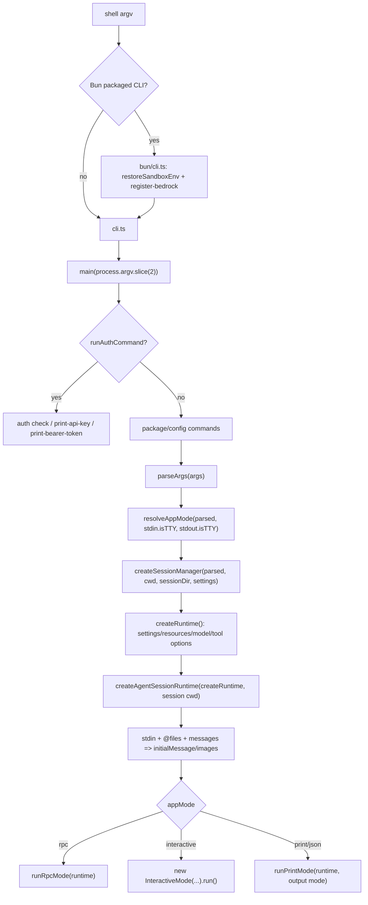

> `spine.process-lifecycle` 描述 `pi-coding-agent` 从 shell `argv` 进入进程、解析 CLI、选择 app mode、绑定 session/runtime，最后进入 interactive/RPC/print 的真实生命周期。

```mermaid
flowchart TD
  Shell["shell argv"] --> Bun{"Bun packaged CLI?"}
  Bun -->|yes| BunShim["bun/cli.ts: restoreSandboxEnv + register-bedrock"]
  Bun -->|no| NodeCli["cli.ts"]
  BunShim --> NodeCli
  NodeCli --> Main["main(process.argv.slice(2))"]
  Main --> Auth{"runAuthCommand?"}
  Auth -->|yes| AuthExit["auth check / print-api-key / print-bearer-token"]
  Auth -->|no| Early["package/config commands"]
  Early --> Parse["parseArgs(args)"]
  Parse --> Mode["resolveAppMode(parsed, stdin.isTTY, stdout.isTTY)"]
  Mode --> Session["createSessionManager(parsed, cwd, sessionDir, settings)"]
  Session --> RuntimeFactory["createRuntime(): settings/resources/model/tool options"]
  RuntimeFactory --> Runtime["createAgentSessionRuntime(createRuntime, session cwd)"]
  Runtime --> Input["stdin + @files + messages => initialMessage/images"]
  Input --> Dispatch{"appMode"}
  Dispatch -->|rpc| Rpc["runRpcMode(runtime)"]
  Dispatch -->|interactive| Interactive["new InteractiveMode(...).run()"]
  Dispatch -->|print/json| Print["runPrintMode(runtime, output mode)"]
```

## 能回答的问题

- `pi` 命令从 `process.argv` 到 `main(args)` 经过哪些入口文件？
- `parseArgs` 如何把普通消息、`@file`、内置 flag 和扩展未知 flag 分流？
- `resolveAppMode` 如何在 `rpc`、`json`、`print`、`interactive` 之间做优先级判断？
- 为什么 `help` / `listModels` 也会先创建 runtime，再打印并退出？
- `pi auth check` 在哪个入口拦截，为什么不走 agent session？
- `--use-theme` 和 `--tui-mode` 在 parseArgs 后怎样进入 interactive？
- session 是在 mode dispatch 之前如何被创建、恢复、fork 或改到另一个 cwd 的？
- Bun CLI 与 Node CLI 的生命周期差别在哪里？

## 入口启动 argv

Node 入口 `packages/coding-agent/src/cli.ts` 是产品层 CLI 的普通入口：它设置 `process.title = APP_NAME`，标记 `process.env.PI_CODING_AGENT = "true"`，吞掉 `process.emitWarning`，先配置一次 HTTP dispatcher，然后把 `process.argv.slice(2)` 传给 `main` [E: packages/coding-agent/src/cli.ts:12] [E: packages/coding-agent/src/cli.ts:13] [E: packages/coding-agent/src/cli.ts:15] [E: packages/coding-agent/src/cli.ts:19] [E: packages/coding-agent/src/cli.ts:21]。

Bun 打包入口 `packages/coding-agent/src/bun/cli.ts` 不是另一套 CLI 逻辑；它设置 title、禁用 warning、恢复 sandbox env、注册 Bedrock，然后动态 import `../cli.ts`，因此最终仍会走 Node 入口的 `main(process.argv.slice(2))` [E: packages/coding-agent/src/bun/cli.ts:5] [E: packages/coding-agent/src/bun/cli.ts:6] [E: packages/coding-agent/src/bun/cli.ts:12] [E: packages/coding-agent/src/bun/cli.ts:14] [E: packages/coding-agent/src/bun/cli.ts:15]。

## main(args) 的早期分叉

`main(args)` 一开始重置 timings，并把 `--offline` 或 `PI_OFFLINE` 归一为 `PI_OFFLINE=1` 与 `PI_SKIP_VERSION_CHECK=1`，这是比 `parseArgs` 更早的环境分叉 [E: packages/coding-agent/src/main.ts:561] [E: packages/coding-agent/src/main.ts:562] [E: packages/coding-agent/src/main.ts:564] [E: packages/coding-agent/src/main.ts:566] [E: packages/coding-agent/src/main.ts:567]。

`runAuthCommand(args)` 是比 package/config 更早的 bootstrap 入口: `args[0] === "auth"` 时解析 `check` / `print-api-key` / `print-bearer-token`, 不创建 `AgentSession` [E: packages/coding-agent/src/main.ts:570] [E: packages/coding-agent/src/main.ts:131] [E: packages/coding-agent/src/cli/auth-command.ts:48] [E: packages/coding-agent/src/cli/auth-command.ts:51] [E: packages/coding-agent/src/cli/auth-command.ts:52]。`auth check` 要求 `--provider` 或 `--model`, 默认会 refresh 过期 OAuth, `--no-refresh` 改用 `ReadOnlyAuthStorage`;stdout 打印 `ready` / `not_ready` / JSON, exit code 0/1/2 [E: packages/coding-agent/src/cli/auth-command.ts:108] [E: packages/coding-agent/src/cli/auth-command.ts:110] [E: packages/coding-agent/src/main.ts:178] [E: packages/coding-agent/src/main.ts:179] [E: packages/coding-agent/src/main.ts:180] [E: packages/coding-agent/src/main.ts:196] [E: packages/coding-agent/src/main.ts:200]。

在正式解析通用 CLI 之前，`main` 再处理 package manager 子命令和 config TUI：`handlePackageCommand(args, ...)` 命中时按 exit code 退出，`handleConfigCommand(args, ...)` 命中时直接返回 [E: packages/coding-agent/src/main.ts:585] [E: packages/coding-agent/src/main.ts:594] [E: packages/coding-agent/src/main.ts:598] [E: packages/coding-agent/src/main.ts:599]。因此 `auth` / `install/remove/update/list/config` 这类命令位于通用 `parseArgs` 之前，属于 CLI bootstrap 分支，而不是 agent session 分支 [I]。

## parseArgs 的输入模型

`parseArgs(args)` 从空 `Args` 开始，至少初始化 `messages`、`fileArgs`、`unknownFlags` 和 `diagnostics`，然后线性扫描 argv [E: packages/coding-agent/src/cli/args.ts:71] [E: packages/coding-agent/src/cli/args.ts:72] [E: packages/coding-agent/src/cli/args.ts:73] [E: packages/coding-agent/src/cli/args.ts:74] [E: packages/coding-agent/src/cli/args.ts:75] [E: packages/coding-agent/src/cli/args.ts:76] [E: packages/coding-agent/src/cli/args.ts:79]。

模式相关 flag 中，`--mode` 只接受 `text`、`json`、`rpc`，`--print/-p` 会设置 `print = true`，并且可把紧随其后的非 flag、非 `@file` 参数作为 message 收入 `messages` [E: packages/coding-agent/src/cli/args.ts:95] [E: packages/coding-agent/src/cli/args.ts:97] [E: packages/coding-agent/src/cli/args.ts:98] [E: packages/coding-agent/src/cli/args.ts:157] [E: packages/coding-agent/src/cli/args.ts:158] [E: packages/coding-agent/src/cli/args.ts:160] [E: packages/coding-agent/src/cli/args.ts:161]。`--use-theme <name[/name]>` 写入 `Args.useTheme`，缺参数时报 error diagnostic；`--tui-mode` 只接受 `regular` 或 `fullscreen` [E: packages/coding-agent/src/cli/args.ts:45] [E: packages/coding-agent/src/cli/args.ts:50] [E: packages/coding-agent/src/cli/args.ts:180] [E: packages/coding-agent/src/cli/args.ts:183] [E: packages/coding-agent/src/cli/args.ts:185] [E: packages/coding-agent/src/cli/args.ts:203] [E: packages/coding-agent/src/cli/args.ts:205] [E: packages/coding-agent/src/cli/args.ts:206] [E: packages/coding-agent/src/cli/args.ts:214]。

输入内容被拆成两条通道：以 `@` 开头的参数去掉前缀后进入 `fileArgs`，普通非 flag 参数进入 `messages` [E: packages/coding-agent/src/cli/args.ts:225] [E: packages/coding-agent/src/cli/args.ts:226] [E: packages/coding-agent/src/cli/args.ts:243] [E: packages/coding-agent/src/cli/args.ts:244]。未知长 flag 不直接报错，而是进入 `unknownFlags`，支持 `--name=value`、`--name value` 和布尔开关三种形式，这使扩展注册的 CLI flags 可以在 runtime 创建时消费 [E: packages/coding-agent/src/cli/args.ts:227] [E: packages/coding-agent/src/cli/args.ts:230] [E: packages/coding-agent/src/cli/args.ts:235] [E: packages/coding-agent/src/cli/args.ts:238] [E: packages/coding-agent/src/main.ts:736]。

解析完后，`main` 会打印 `parsed.diagnostics`，只要存在 error 级诊断就 `process.exit(1)`；warning 级诊断只打印，不阻断后续生命周期 [E: packages/coding-agent/src/main.ts:602] [E: packages/coding-agent/src/main.ts:603] [E: packages/coding-agent/src/main.ts:606] [E: packages/coding-agent/src/main.ts:608] [E: packages/coding-agent/src/main.ts:609]。

## resolveAppMode 模式选择

`resolveAppMode(parsed, stdinIsTTY, stdoutIsTTY)` 的优先级是显式 `--mode rpc` 最高，其次显式 `--mode json`，再由 `--print` 或任一 stdio 非 TTY 进入 `print`，最后才是 `interactive` [E: packages/coding-agent/src/main.ts:110] [E: packages/coding-agent/src/main.ts:111] [E: packages/coding-agent/src/main.ts:114] [E: packages/coding-agent/src/main.ts:117] [E: packages/coding-agent/src/main.ts:120]。

`json` 在 app mode 层是独立模式，但进入 print executor 前会被 `toPrintOutputMode` 映射成 print mode 的 `json` 输出；其他非 RPC mode 映射为 `text` [E: packages/coding-agent/src/main.ts:123] [E: packages/coding-agent/src/main.ts:124] [E: packages/coding-agent/src/main.ts:965] [E: packages/coding-agent/src/main.ts:966]。

`main` 在 mode 选择后会对非 interactive 且非纯 metadata 命令接管 stdout，并禁止 RPC mode 使用 `@file` 参数 [E: packages/coding-agent/src/main.ts:633] [E: packages/coding-agent/src/main.ts:634] [E: packages/coding-agent/src/main.ts:636] [E: packages/coding-agent/src/main.ts:639] [E: packages/coding-agent/src/main.ts:640] [E: packages/coding-agent/src/main.ts:641]。这里的 metadata 命令定义为未设置 `--print`、未设置 `--mode`、且是 `--help` 或 `--list-models` [E: packages/coding-agent/src/main.ts:127] [E: packages/coding-agent/src/main.ts:128]。

## session 选择与 cwd 固定

mode 选定后还不会立刻进入 UI 或 RPC；`main` 先校验 `--fork`、`--session-id` 的互斥关系，再运行迁移、创建 startup settings manager，然后才解析 session dir 与 session manager [E: packages/coding-agent/src/main.ts:644] [E: packages/coding-agent/src/main.ts:645] [E: packages/coding-agent/src/main.ts:648] [E: packages/coding-agent/src/main.ts:651] [E: packages/coding-agent/src/main.ts:670] [E: packages/coding-agent/src/main.ts:675]。

`createSessionManager` 对无会话场景使用 in-memory session：`--no-session`、`--help`、`--list-models` 都不会创建普通持久 session [E: packages/coding-agent/src/main.ts:352] [E: packages/coding-agent/src/main.ts:358] [E: packages/coding-agent/src/main.ts:359]。持久 session 分支按优先级处理 `--fork`、`--session`、`--resume`、`--continue`、`--session-id`，最后才创建新 session [E: packages/coding-agent/src/main.ts:362] [E: packages/coding-agent/src/main.ts:385] [E: packages/coding-agent/src/main.ts:409] [E: packages/coding-agent/src/main.ts:426] [E: packages/coding-agent/src/main.ts:430] [E: packages/coding-agent/src/main.ts:442]。

当恢复的 session 缺失 cwd 时，interactive 会提示用户选择 fallback cwd，非 interactive 则打印 `MissingSessionCwdError` 并退出；这说明 session cwd 是 runtime 服务创建前必须稳定下来的输入 [E: packages/coding-agent/src/main.ts:676] [E: packages/coding-agent/src/main.ts:678] [E: packages/coding-agent/src/main.ts:679] [E: packages/coding-agent/src/main.ts:683] [E: packages/coding-agent/src/main.ts:684] [E: packages/coding-agent/src/main.ts:685] [E: packages/coding-agent/src/main.ts:686] [E: packages/coding-agent/src/main.ts:840]。

## runtime 与 AgentSession 装配

`createRuntime` 是 `main` 内部闭包，它以最终 cwd、agentDir、authStorage、settingsManager、extension flag values 和 resource loader options 创建 cwd-bound services [E: packages/coding-agent/src/main.ts:712] [E: packages/coding-agent/src/main.ts:730] [E: packages/coding-agent/src/main.ts:731] [E: packages/coding-agent/src/main.ts:732] [E: packages/coding-agent/src/main.ts:733] [E: packages/coding-agent/src/main.ts:729] [E: packages/coding-agent/src/main.ts:734] [E: packages/coding-agent/src/main.ts:736] [E: packages/coding-agent/src/main.ts:761]。

CLI 的模型、thinking、tool allowlist/denylist 在 `buildSessionOptions` 中汇总成 `CreateAgentSessionOptions`；`--api-key` 会在已有目标 model 时写入 runtime auth storage [E: packages/coding-agent/src/main.ts:445] [E: packages/coding-agent/src/main.ts:456] [E: packages/coding-agent/src/main.ts:463] [E: packages/coding-agent/src/main.ts:510] [E: packages/coding-agent/src/main.ts:528] [E: packages/coding-agent/src/main.ts:533] [E: packages/coding-agent/src/main.ts:536] [E: packages/coding-agent/src/main.ts:805] [E: packages/coding-agent/src/main.ts:806] [E: packages/coding-agent/src/main.ts:757]。

真正的 session 实例由 `createAgentSessionFromServices` 产出；`main` 把 model、thinkingLevel、scopedModels、tools、excludeTools、noTools 和 customTools 传入，然后 `createAgentSessionRuntime(createRuntime, ...)` 包装成 runtime [E: packages/coding-agent/src/main.ts:816] [E: packages/coding-agent/src/main.ts:820] [E: packages/coding-agent/src/main.ts:821] [E: packages/coding-agent/src/main.ts:822] [E: packages/coding-agent/src/main.ts:823] [E: packages/coding-agent/src/main.ts:824] [E: packages/coding-agent/src/main.ts:825] [E: packages/coding-agent/src/main.ts:826] [E: packages/coding-agent/src/main.ts:840]。

`help` 与 `listModels` 虽然是一次性命令，但它们在 runtime 创建之后才执行：help 需要从 loaded extensions 汇总 extension flags，listModels 需要 modelRegistry [E: packages/coding-agent/src/main.ts:840] [E: packages/coding-agent/src/main.ts:852] [E: packages/coding-agent/src/main.ts:856] [E: packages/coding-agent/src/main.ts:857] [E: packages/coding-agent/src/main.ts:861] [E: packages/coding-agent/src/main.ts:858]。

## 初始输入与 mode dispatch

RPC mode 不进入 piped stdin 读取分支；只有非 RPC mode 会调用 `readPipedStdin`，如果读到了 stdin 内容且当前仍是 interactive，就把 app mode 改成 print [E: packages/coding-agent/src/main.ts:870] [E: packages/coding-agent/src/main.ts:871] [E: packages/coding-agent/src/main.ts:872] [E: packages/coding-agent/src/main.ts:873]。

`prepareInitialMessage` 把 `fileArgs`、图片自动缩放设置与 stdinContent 交给 file processor / initial-message builder；无 `@file` 时直接基于 parsed 和 stdin 构造初始消息 [E: packages/coding-agent/src/main.ts:209] [E: packages/coding-agent/src/main.ts:217] [E: packages/coding-agent/src/main.ts:218] [E: packages/coding-agent/src/main.ts:221] [E: packages/coding-agent/src/main.ts:878] [E: packages/coding-agent/src/main.ts:880] [E: packages/coding-agent/src/main.ts:881]。

最终 dispatch 是单点三分支：`rpc` 打印 timings 后 `runRpcMode(runtime)`；`interactive` 创建 `InteractiveMode`，传入迁移提示、model fallback、auto trust reload cwd、initialMessage、initialImages、initialMessages、verbose、`tuiMode` 和 per-run `initialThemeSetting: parsed.useTheme`，再 `run()`；其余 print/json 分支调用 `runPrintMode(runtime, ...)`，随后停止 theme watcher、恢复 stdout，并把非零 exitCode 写入 `process.exitCode` [E: packages/coding-agent/src/main.ts:927] [E: packages/coding-agent/src/main.ts:928] [E: packages/coding-agent/src/main.ts:929] [E: packages/coding-agent/src/main.ts:930] [E: packages/coding-agent/src/main.ts:931] [E: packages/coding-agent/src/main.ts:940] [E: packages/coding-agent/src/main.ts:941] [E: packages/coding-agent/src/main.ts:962] [E: packages/coding-agent/src/main.ts:965] [E: packages/coding-agent/src/main.ts:971] [E: packages/coding-agent/src/main.ts:972] [E: packages/coding-agent/src/main.ts:974]。interactive 且提供 `--use-theme` 时，`main` 还会在 session cwd 固定前对 startup settings 做 `applyOverrides({ theme: parsed.useTheme })` [E: packages/coding-agent/src/main.ts:661] [E: packages/coding-agent/src/main.ts:662]。

## 关键决策点

- `auth` / `package/config` 子命令早于通用 `parseArgs`，所以它们不共享普通 agent session 生命周期 [E: packages/coding-agent/src/main.ts:570] [E: packages/coding-agent/src/main.ts:585] [E: packages/coding-agent/src/main.ts:598] [I]。
- `resolveAppMode` 只看 parsed mode、`--print` 和 stdio TTY 状态；piped stdin 的实际内容稍后才可能把 interactive 降级为 print [E: packages/coding-agent/src/main.ts:110] [E: packages/coding-agent/src/main.ts:117] [E: packages/coding-agent/src/main.ts:870] [E: packages/coding-agent/src/main.ts:873]。
- `help/listModels` 使用 in-memory session，但仍创建 runtime，以便 help 展示扩展 flags、listModels 使用 runtime 的 model registry [E: packages/coding-agent/src/main.ts:358] [E: packages/coding-agent/src/main.ts:852] [E: packages/coding-agent/src/main.ts:858]。
- Bun 入口只做运行时环境恢复和 Bedrock 注册，生命周期权威仍落在 `cli.ts` 与 `main.ts` [E: packages/coding-agent/src/bun/cli.ts:12] [E: packages/coding-agent/src/bun/cli.ts:14] [E: packages/coding-agent/src/bun/cli.ts:15] [I]。

## 指向 T1/T2 深挖

- `surface.cli.overview`：详细列出 CLI flags、参数归类、help 文案和用户可见调用面。
- `surface.modes.interactive`：展开 `InteractiveMode` 如何接管 TUI、处理初始 prompt 与后续 turn。
- `surface.modes.rpc`：展开 `runRpcMode(runtime)` 的 JSONL/RPC 协议和无头会话控制。
- `spine.overview`：把本页的 coding-agent 入口放回 `ai`、`agent`、`coding-agent`、`tui` 的整体包边界。

## Sources

- packages/coding-agent/src/main.ts
- packages/coding-agent/src/cli.ts
- packages/coding-agent/src/cli/args.ts
- packages/coding-agent/src/cli/auth-command.ts
- packages/coding-agent/src/bun/cli.ts

## 相关

- [spine.overview](overview.md)
- [surface.cli.overview](../surface/cli/overview.md)
- [surface.modes.interactive](../surface/modes/interactive.md)
- [surface.modes.rpc](../surface/modes/rpc.md)
