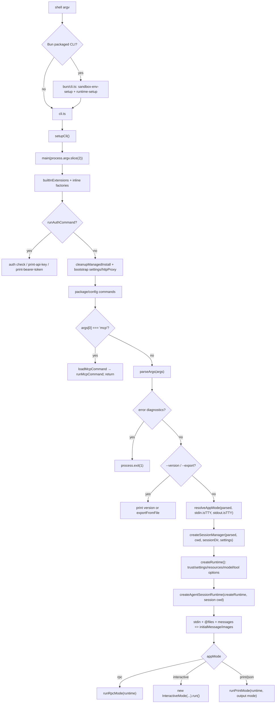

> `spine.process-lifecycle` 描述 `pi-coding-agent` 从 shell `argv` 进入进程、解析 CLI、选择 app mode、绑定 session/runtime，最后进入 interactive/RPC/print 的真实生命周期。`pi mcp` 是 `parseArgs` 之前的独立 short-circuit，不创建 `AgentSession`。

```mermaid
flowchart TD
  Shell["shell argv"] --> Bun{"Bun packaged CLI?"}
  Bun -->|yes| BunShim["bun/cli.ts: sandbox-env-setup + runtime-setup"]
  Bun -->|no| NodeCli["cli.ts"]
  BunShim --> NodeCli
  NodeCli --> Setup["setupCli()"]
  Setup --> Main["main(process.argv.slice(2))"]
  Main --> Ext["builtInExtensions + inline factories"]
  Ext --> Auth{"runAuthCommand?"}
  Auth -->|yes| AuthExit["auth check / print-api-key / print-bearer-token"]
  Auth -->|no| Bootstrap["cleanupManagedInstall + bootstrap settings/httpProxy"]
  Bootstrap --> Early["package/config commands"]
  Early --> Mcp{"args[0] === 'mcp'?"}
  Mcp -->|yes| McpExit["loadMcpCommand → runMcpCommand; return"]
  Mcp -->|no| Parse["parseArgs(args)"]
  Parse --> Diag{"error diagnostics?"}
  Diag -->|yes| Exit1["process.exit(1)"]
  Diag -->|no| Meta{"--version / --export?"}
  Meta -->|yes| MetaExit["print version or exportFromFile"]
  Meta -->|no| Mode["resolveAppMode(parsed, stdin.isTTY, stdout.isTTY)"]
  Mode --> Session["createSessionManager(parsed, cwd, sessionDir, settings)"]
  Session --> RuntimeFactory["createRuntime(): trust/settings/resources/model/tool options"]
  RuntimeFactory --> Runtime["createAgentSessionRuntime(createRuntime, session cwd)"]
  Runtime --> Input["stdin + @files + messages => initialMessage/images"]
  Input --> Dispatch{"appMode"}
  Dispatch -->|rpc| Rpc["runRpcMode(runtime)"]
  Dispatch -->|interactive| Interactive["new InteractiveMode(...).run()"]
  Dispatch -->|print/json| Print["runPrintMode(runtime, output mode)"]
```

## 能回答的问题

- `pi` 命令从 `process.argv` 到 `main(args)` 经过哪些入口文件？
- `pi mcp` 在哪个入口拦截，为什么不走 `parseArgs` / `AgentSession`？
- `parseArgs` 如何把普通消息、`@file`、内置 flag 和扩展未知 flag 分流？
- `resolveAppMode` 如何在 `rpc`、`json`、`print`、`interactive` 之间做优先级判断？
- 为什么 `help` / `listModels` 也会先创建 runtime，再打印并退出？
- `pi auth check` 在哪个入口拦截，为什么不走 agent session？
- `--use-theme` 和 `--tui-mode` 在 parseArgs 后怎样进入 interactive？
- `--mode` 非法值为什么会在进入 session 之前退出？
- session **manager** 是在 mode dispatch 之前如何被创建、恢复、fork 的,session **文件** 又在何时真正落盘？
- Bun CLI 与 Node CLI 的生命周期差别在哪里？

## 入口启动 argv

Node 入口 `packages/coding-agent/src/cli.ts` 只做两件事：`setupCli()`，然后 `main(process.argv.slice(2))`。[E: packages/coding-agent/src/cli.ts:5] [E: packages/coding-agent/src/cli.ts:6] `process.title`、`PI_CODING_AGENT="true"`、`AI_AGENT="pi"`、吞掉 `process.emitWarning`、以及 HTTP dispatcher 都在 `cli/setup.ts`。[E: packages/coding-agent/src/cli/setup.ts:5] [E: packages/coding-agent/src/cli/setup.ts:6] [E: packages/coding-agent/src/cli/setup.ts:7] [E: packages/coding-agent/src/cli/setup.ts:8] [E: packages/coding-agent/src/cli/setup.ts:12]

Bun 打包入口 `packages/coding-agent/src/bun/cli.ts` 静态 import `./sandbox-env-setup.ts`、`./runtime-setup.ts` 和 `../cli.ts`，不是动态 import `../cli.ts`；随后仍走 Node 入口的 `setupCli()` + `main(process.argv.slice(2))`。[E: packages/coding-agent/src/bun/cli.ts:2] [E: packages/coding-agent/src/bun/cli.ts:3] [E: packages/coding-agent/src/bun/cli.ts:4]

## main(args) 的早期分叉

`main(args)` 一开始重置 timings，立刻把 `builtInExtensions` 与 `options.extensionFactories` 展开成 `extensionFactories`，然后才把 `--offline` 或 `PI_OFFLINE` 归一为 `PI_OFFLINE=1` 与 `PI_SKIP_VERSION_CHECK=1`；扩展展开早于 offline/auth。[E: packages/coding-agent/src/main.ts:574] [E: packages/coding-agent/src/main.ts:575] [E: packages/coding-agent/src/main.ts:576] [E: packages/coding-agent/src/main.ts:578] [E: packages/coding-agent/src/main.ts:579]

`runAuthCommand(args)` 是比 package/config 更早的 bootstrap 入口：`args[0] === "auth"` 时解析 `check` / `print-api-key` / `print-bearer-token`，不创建 `AgentSession`。[E: packages/coding-agent/src/main.ts:582] [E: packages/coding-agent/src/main.ts:133] [E: packages/coding-agent/src/cli/auth-command.ts:48] [E: packages/coding-agent/src/cli/auth-command.ts:51] [E: packages/coding-agent/src/cli/auth-command.ts:52] `auth check` 要求 `--provider` 或 `--model`，默认会 refresh 过期 OAuth，`--no-refresh` 改用 `ReadOnlyAuthStorage`。`--json` 时 stdout 是 JSON（可含 `credentials`）；否则打印 credential（当 `--credentials` 且 status ready）或 `result.status`（`ready` / `not_ready` / `invalid`）。exit code 0/1/2。[E: packages/coding-agent/src/cli/auth-command.ts:108] [E: packages/coding-agent/src/cli/auth-command.ts:110] [E: packages/coding-agent/src/main.ts:180] [E: packages/coding-agent/src/main.ts:198] [E: packages/coding-agent/src/main.ts:201] [E: packages/coding-agent/src/main.ts:202]

auth 之后、package/config 之前，`main` 在 win32 上清理 self-update quarantine，再 `cleanupManagedInstall()`，并用 startup cwd 建一个 `projectTrusted: false` 的 bootstrap `SettingsManager` 来应用 `httpProxy`、重配 HTTP dispatcher。[E: packages/coding-agent/src/main.ts:586] [E: packages/coding-agent/src/main.ts:589] [E: packages/coding-agent/src/main.ts:593] [E: packages/coding-agent/src/main.ts:594] [E: packages/coding-agent/src/main.ts:595]

在正式解析通用 CLI 之前，`main` 再处理 package manager 子命令和 config TUI：`handlePackageCommand(args, ...)` 命中时按 exit code 退出，`handleConfigCommand(args, ...)` 命中时直接返回。[E: packages/coding-agent/src/main.ts:597] [E: packages/coding-agent/src/main.ts:606] [E: packages/coding-agent/src/main.ts:610] [E: packages/coding-agent/src/main.ts:611]

`args[0] === "mcp"` 是下一个 short-circuit：懒加载 `extensions/mcp/cli.ts`，把 `args.slice(1)` 交给 `runMcpCommand`，把返回值写入 `process.exitCode` 后 `return`。这条路径不调用 `parseArgs`，也不创建 session/runtime。[E: packages/coding-agent/src/main.ts:614] [E: packages/coding-agent/src/main.ts:615] [E: packages/coding-agent/src/main.ts:616] [E: packages/coding-agent/src/main.ts:617] [E: packages/coding-agent/src/extensions/mcp/cli.lazy.ts:2] [E: packages/coding-agent/src/extensions/mcp/cli.ts:185] 因此 `auth` / `install/remove/update/list/config` / `mcp` 位于通用 `parseArgs` 之前，属于 CLI bootstrap 分支，而不是 agent session 分支。[I]

## parseArgs 的输入模型

`parseArgs(args)` 从空 `Args` 开始，至少初始化 `messages`、`fileArgs`、`unknownFlags` 和 `diagnostics`，然后线性扫描 argv。[E: packages/coding-agent/src/cli/args.ts:71] [E: packages/coding-agent/src/cli/args.ts:72] [E: packages/coding-agent/src/cli/args.ts:73] [E: packages/coding-agent/src/cli/args.ts:74] [E: packages/coding-agent/src/cli/args.ts:75] [E: packages/coding-agent/src/cli/args.ts:76] [E: packages/coding-agent/src/cli/args.ts:79]

模式相关 flag 中，`--mode` 只接受 `text`、`json`、`rpc`。缺值或后一项以 `-` 开头时报 error diagnostic `"--mode requires text, json, or rpc"`；非法值报 `Invalid mode "<value>". Valid values: text, json, rpc`。`main` 打印 diagnostics 后，只要存在 error 级诊断就 `process.exit(1)`，所以 `--mode html` 这类非法值不会进入 session/runtime。[E: packages/coding-agent/src/cli/args.ts:95] [E: packages/coding-agent/src/cli/args.ts:97] [E: packages/coding-agent/src/cli/args.ts:98] [E: packages/coding-agent/src/cli/args.ts:102] [E: packages/coding-agent/src/cli/args.ts:105] [E: packages/coding-agent/src/main.ts:620] [E: packages/coding-agent/src/main.ts:626] [E: packages/coding-agent/src/main.ts:627] `--print/-p` 会设置 `print = true`，并且可把紧随其后的非 flag、非 `@file` 参数作为 message 收入 `messages`。[E: packages/coding-agent/src/cli/args.ts:170] [E: packages/coding-agent/src/cli/args.ts:171] [E: packages/coding-agent/src/cli/args.ts:173] [E: packages/coding-agent/src/cli/args.ts:174] `--use-theme <name[/name]>` 写入 `Args.useTheme`，缺参数时报 error diagnostic；`--tui-mode` 只接受 `regular` 或 `fullscreen`。[E: packages/coding-agent/src/cli/args.ts:45] [E: packages/coding-agent/src/cli/args.ts:50] [E: packages/coding-agent/src/cli/args.ts:193] [E: packages/coding-agent/src/cli/args.ts:196] [E: packages/coding-agent/src/cli/args.ts:198] [E: packages/coding-agent/src/cli/args.ts:216] [E: packages/coding-agent/src/cli/args.ts:218] [E: packages/coding-agent/src/cli/args.ts:227]

输入内容被拆成两条通道：以 `@` 开头的参数去掉前缀后进入 `fileArgs`，普通非 flag 参数进入 `messages`。[E: packages/coding-agent/src/cli/args.ts:238] [E: packages/coding-agent/src/cli/args.ts:239] [E: packages/coding-agent/src/cli/args.ts:256] [E: packages/coding-agent/src/cli/args.ts:257] 未知长 flag 不直接报错，而是进入 `unknownFlags`，支持 `--name=value`、`--name value` 和布尔开关三种形式，这使扩展注册的 CLI flags 可以在 runtime 创建时消费。[E: packages/coding-agent/src/cli/args.ts:240] [E: packages/coding-agent/src/cli/args.ts:243] [E: packages/coding-agent/src/cli/args.ts:248] [E: packages/coding-agent/src/cli/args.ts:251] [E: packages/coding-agent/src/main.ts:754]

解析完后，`main` 会打印 `parsed.diagnostics`，只要存在 error 级诊断就 `process.exit(1)`；warning 级诊断只打印，不阻断后续生命周期。[E: packages/coding-agent/src/main.ts:620] [E: packages/coding-agent/src/main.ts:621] [E: packages/coding-agent/src/main.ts:624] [E: packages/coding-agent/src/main.ts:626] [E: packages/coding-agent/src/main.ts:627] 无 error 时，`--version/-v` 打印 `VERSION` 并 `process.exit(0)`；`--export` 走 `exportFromFile`，成功后打印路径并退出。[E: packages/coding-agent/src/main.ts:632] [E: packages/coding-agent/src/main.ts:634] [E: packages/coding-agent/src/main.ts:637] [E: packages/coding-agent/src/main.ts:641]

## resolveAppMode 模式选择

`resolveAppMode(parsed, stdinIsTTY, stdoutIsTTY)` 的优先级是显式 `--mode rpc` 最高，其次显式 `--mode json`，再由 `--print` 或任一 stdio 非 TTY 进入 `print`，最后才是 `interactive`。[E: packages/coding-agent/src/main.ts:112] [E: packages/coding-agent/src/main.ts:113] [E: packages/coding-agent/src/main.ts:116] [E: packages/coding-agent/src/main.ts:119] [E: packages/coding-agent/src/main.ts:122]

`json` 在 app mode 层是独立模式，但进入 print executor 前会被 `toPrintOutputMode` 映射成 print mode 的 `json` 输出；其他非 RPC mode 映射为 `text`。[E: packages/coding-agent/src/main.ts:125] [E: packages/coding-agent/src/main.ts:126] [E: packages/coding-agent/src/main.ts:985] [E: packages/coding-agent/src/main.ts:986]

`main` 在 mode 选择后会对非 interactive 且非纯 metadata 命令接管 stdout，并禁止 RPC mode 使用 `@file` 参数。[E: packages/coding-agent/src/main.ts:651] [E: packages/coding-agent/src/main.ts:652] [E: packages/coding-agent/src/main.ts:654] [E: packages/coding-agent/src/main.ts:657] [E: packages/coding-agent/src/main.ts:658] [E: packages/coding-agent/src/main.ts:659] 这里的 metadata 命令定义为未设置 `--print`、未设置 `--mode`、且是 `--help` 或 `--list-models`。[E: packages/coding-agent/src/main.ts:129] [E: packages/coding-agent/src/main.ts:130]

## session 选择与 cwd 固定

mode 选定后还不会立刻进入 UI 或 RPC；`main` 先校验 `--fork`、`--session-id` 的互斥关系，再运行迁移、创建 startup settings manager，然后才解析 session dir 与 session manager。[E: packages/coding-agent/src/main.ts:662] [E: packages/coding-agent/src/main.ts:663] [E: packages/coding-agent/src/main.ts:666] [E: packages/coding-agent/src/main.ts:669] [E: packages/coding-agent/src/main.ts:688] [E: packages/coding-agent/src/main.ts:693] interactive 且未带 help/list-models 时，可能先跑 first-time setup；`--use-theme` 会在 session cwd 固定前对 startup settings 做 `applyOverrides({ theme: parsed.useTheme })`。[E: packages/coding-agent/src/main.ts:674] [E: packages/coding-agent/src/main.ts:679] [E: packages/coding-agent/src/main.ts:680]

`createSessionManager` 对无会话场景使用 in-memory session：`--no-session`、`--help`、`--list-models` 都不会创建普通持久 session。[E: packages/coding-agent/src/main.ts:358] [E: packages/coding-agent/src/main.ts:364] [E: packages/coding-agent/src/main.ts:365] 持久 session 分支按优先级处理 `--fork`、`--session`、`--resume`、`--continue`、`--session-id`，最后才 `SessionManager.create()` 得到新 manager。[E: packages/coding-agent/src/main.ts:368] [E: packages/coding-agent/src/main.ts:391] [E: packages/coding-agent/src/main.ts:415] [E: packages/coding-agent/src/main.ts:432] [E: packages/coding-agent/src/main.ts:436] [E: packages/coding-agent/src/main.ts:448] 新 persist session **此时还不写 JSONL 文件**；`SessionManager._persist()` 要等到出现 user 或 assistant message 才 `openSync(..., "wx")`(#10000)。见 [surface.sessions.management](../surface/sessions/management.md)。[E: packages/coding-agent/src/core/session-manager.ts:1166] [E: packages/coding-agent/src/core/session-manager.ts:1172] [E: packages/coding-agent/src/core/session-manager.ts:1176] [E: packages/coding-agent/src/core/session-manager.ts:1177]

当恢复的 session 缺失 cwd 时，interactive 会提示用户选择 fallback cwd，非 interactive 则打印 `MissingSessionCwdError` 并退出；这说明 session cwd 是 runtime 服务创建前必须稳定下来的输入。[E: packages/coding-agent/src/main.ts:694] [E: packages/coding-agent/src/main.ts:696] [E: packages/coding-agent/src/main.ts:697] [E: packages/coding-agent/src/main.ts:701] [E: packages/coding-agent/src/main.ts:702] [E: packages/coding-agent/src/main.ts:703] [E: packages/coding-agent/src/main.ts:704] [E: packages/coding-agent/src/main.ts:862]

## runtime 与 AgentSession 装配

`createRuntime` 是 `main` 内部闭包，它以最终 cwd、agentDir、settingsManager、modelRuntimeSignal、extension flag values 和 resource loader options 创建 cwd-bound services。`createAgentSessionServices` 不接收 `authStorage`；缺省 `ModelRuntime.create({ authPath: join(agentDir, "auth.json"), modelsPath: join(agentDir, "models.json"), signal })`。[E: packages/coding-agent/src/main.ts:730] [E: packages/coding-agent/src/core/agent-session-services.ts:135] [E: packages/coding-agent/src/core/agent-session-services.ts:142] factory 在创建 settings 前会解析 project trust：无 `--approve/--no-approve` 且 cwd 有需信任资源时，先以 `projectTrusted: false` 建 settings，再经 `resolveProjectTrusted` 回调补信任决策。[E: packages/coding-agent/src/main.ts:742] [E: packages/coding-agent/src/main.ts:743] [E: packages/coding-agent/src/main.ts:748] [E: packages/coding-agent/src/main.ts:758]

CLI 的模型、thinking、tool allowlist/denylist 在 `buildSessionOptions` 中汇总成 `CreateAgentSessionOptions`；`--api-key` 会在已有目标 model 时写入 runtime auth storage。[E: packages/coding-agent/src/main.ts:451] [E: packages/coding-agent/src/main.ts:475] [E: packages/coding-agent/src/main.ts:522] [E: packages/coding-agent/src/main.ts:540] [E: packages/coding-agent/src/main.ts:545] [E: packages/coding-agent/src/main.ts:548] [E: packages/coding-agent/src/main.ts:827] [E: packages/coding-agent/src/main.ts:834]

真正的 session 实例由 `createAgentSessionFromServices` 产出；`main` 把 model、thinkingLevel、scopedModels、tools、excludeTools、noTools 和 customTools 传入，然后 `createAgentSessionRuntime(createRuntime, ...)` 包装成 runtime。[E: packages/coding-agent/src/main.ts:838] [E: packages/coding-agent/src/main.ts:842] [E: packages/coding-agent/src/main.ts:843] [E: packages/coding-agent/src/main.ts:844] [E: packages/coding-agent/src/main.ts:845] [E: packages/coding-agent/src/main.ts:846] [E: packages/coding-agent/src/main.ts:847] [E: packages/coding-agent/src/main.ts:848] [E: packages/coding-agent/src/main.ts:862]

`help` 与 `listModels` 虽然是一次性命令，但它们在 runtime 创建之后才执行：help 需要从 loaded extensions 汇总 extension flags，listModels 需要 modelRegistry。[E: packages/coding-agent/src/main.ts:862] [E: packages/coding-agent/src/main.ts:874] [E: packages/coding-agent/src/main.ts:878] [E: packages/coding-agent/src/main.ts:879] [E: packages/coding-agent/src/main.ts:883]

## 初始输入与 mode dispatch

RPC mode 不进入 piped stdin 读取分支；只有非 RPC mode 会调用 `readPipedStdin`，如果读到了 stdin 内容且当前仍是 interactive，就把 app mode 改成 print。[E: packages/coding-agent/src/main.ts:892] [E: packages/coding-agent/src/main.ts:893] [E: packages/coding-agent/src/main.ts:894] [E: packages/coding-agent/src/main.ts:895]

`prepareInitialMessage` 把 `fileArgs`、图片自动缩放设置与 stdinContent 交给 file processor / initial-message builder；无 `@file` 时直接基于 parsed 和 stdin 构造初始消息。[E: packages/coding-agent/src/main.ts:211] [E: packages/coding-agent/src/main.ts:218] [E: packages/coding-agent/src/main.ts:219] [E: packages/coding-agent/src/main.ts:223] [E: packages/coding-agent/src/main.ts:900]

runtime 有 error diagnostics 时一律 `process.exit(1)`。非 interactive 且没有可用 model 也会退出。`PI_STARTUP_BENCHMARK` 只允许 interactive，且只跑 `interactiveMode.init()` 后返回，不进入 `run()`。[E: packages/coding-agent/src/main.ts:918] [E: packages/coding-agent/src/main.ts:926] [E: packages/coding-agent/src/main.ts:932] [E: packages/coding-agent/src/main.ts:964] [E: packages/coding-agent/src/main.ts:978] RPC 在非 offline 时后台 `modelRuntime.refresh()`。[E: packages/coding-agent/src/main.ts:938] [E: packages/coding-agent/src/main.ts:942]

最终 dispatch 是单点三分支：`rpc` 打印 timings 后 `runRpcMode(runtime)`；`interactive` 创建 `InteractiveMode`，传入迁移提示、model fallback、auto trust reload cwd、initialMessage、initialImages、initialMessages、verbose、`tuiMode` 和 per-run `initialThemeSetting: parsed.useTheme`，再 `run()`；其余 print/json 分支调用 `runPrintMode(runtime, ...)`，随后停止 theme watcher、恢复 stdout，并把非零 exitCode 写入 `process.exitCode`。[E: packages/coding-agent/src/main.ts:947] [E: packages/coding-agent/src/main.ts:949] [E: packages/coding-agent/src/main.ts:950] [E: packages/coding-agent/src/main.ts:951] [E: packages/coding-agent/src/main.ts:960] [E: packages/coding-agent/src/main.ts:961] [E: packages/coding-agent/src/main.ts:982] [E: packages/coding-agent/src/main.ts:985] [E: packages/coding-agent/src/main.ts:991] [E: packages/coding-agent/src/main.ts:992] [E: packages/coding-agent/src/main.ts:994]

## 关键决策点

- `pi mcp` 是 parse-time 之前的 **subcommand short-circuit**：懒加载 MCP CLI，退出码来自 `runMcpCommand`，不进入 session/runtime。[E: packages/coding-agent/src/main.ts:614] [E: packages/coding-agent/src/main.ts:616] [E: packages/coding-agent/src/extensions/mcp/cli.ts:185]
- `--mode` 非法值是 parse-time **error**，不是 warning，会在 `createSessionManager` 之前 `process.exit(1)`。[E: packages/coding-agent/src/cli/args.ts:102] [E: packages/coding-agent/src/main.ts:626] [E: packages/coding-agent/src/main.ts:627]
- `auth` / `package/config` / `mcp` 子命令早于通用 `parseArgs`，所以它们不共享普通 agent session 生命周期。[E: packages/coding-agent/src/main.ts:582] [E: packages/coding-agent/src/main.ts:597] [E: packages/coding-agent/src/main.ts:610] [E: packages/coding-agent/src/main.ts:614] [I]
- `resolveAppMode` 只看 parsed mode、`--print` 和 stdio TTY 状态；piped stdin 的实际内容稍后才可能把 interactive 降级为 print。[E: packages/coding-agent/src/main.ts:112] [E: packages/coding-agent/src/main.ts:119] [E: packages/coding-agent/src/main.ts:892] [E: packages/coding-agent/src/main.ts:895]
- `help/listModels` 使用 in-memory session，但仍创建 runtime，以便 help 展示扩展 flags、listModels 使用 runtime 的 model registry。[E: packages/coding-agent/src/main.ts:364] [E: packages/coding-agent/src/main.ts:874] [E: packages/coding-agent/src/main.ts:883]
- Bun 入口只静态拉起 sandbox-env / runtime-setup 再进入 `cli.ts`，生命周期权威仍落在 `setupCli` 与 `main.ts`。[E: packages/coding-agent/src/bun/cli.ts:2] [E: packages/coding-agent/src/bun/cli.ts:3] [E: packages/coding-agent/src/bun/cli.ts:4] [I]

## 指向 T1/T2 深挖

- `surface.cli.overview`：详细列出 CLI flags、参数归类、help 文案和用户可见调用面。
- `surface.mcp.overview`：`pi mcp` 子命令、`.pi/mcp.json`、`/mcp` 与 OAuth 的用户面；本页只钉死 `main()` 的 short-circuit。
- `surface.modes.interactive`：展开 `InteractiveMode` 如何接管 TUI、处理初始 prompt 与后续 turn。
- `surface.modes.rpc`：展开 `runRpcMode(runtime)` 的 JSONL/RPC 协议和无头会话控制。
- `spine.overview`：把本页的 coding-agent 入口放回 `ai`、`agent`、`coding-agent`、`tui` 的整体包边界。

## Sources

- packages/coding-agent/src/main.ts
- packages/coding-agent/src/cli.ts
- packages/coding-agent/src/cli/setup.ts
- packages/coding-agent/src/cli/args.ts
- packages/coding-agent/src/cli/auth-command.ts
- packages/coding-agent/src/bun/cli.ts
- packages/coding-agent/src/core/session-manager.ts
- packages/coding-agent/src/extensions/mcp/cli.lazy.ts
- packages/coding-agent/src/extensions/mcp/cli.ts
- packages/coding-agent/src/core/agent-session-services.ts

## 相关

- [spine.overview](overview.md) - 把本页 CLI 入口放回 monorepo 分层栈。
- [surface.cli.overview](../surface/cli/overview.md) - 用户可见 CLI flags 与子命令面。
- [surface.modes.interactive](../surface/modes/interactive.md) - TUI interactive mode 的可见面。
- [surface.modes.rpc](../surface/modes/rpc.md) - 无头 RPC mode 的命令面。
- [surface.sessions.management](../surface/sessions/management.md) - 产品 JSONL session 选择、fork、落盘。
- [surface.mcp.overview](../surface/mcp/overview.md) - `pi mcp` / `/mcp` / `.pi/mcp.json` 用户面。
