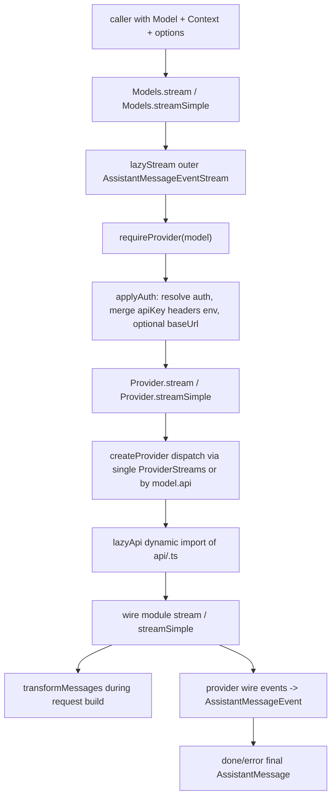

> `spine.provider-stream` 描述 `pi-ai` 中一次 LLM provider streaming call 如何从统一 `Models.stream` / `streamSimple` 入口,经过 provider/API dispatch 与 lazy loading,转成 provider wire request,再归一为 `AssistantMessageEventStream` 事件协议。

## 能回答的问题

- `Models.stream` 和 `Models.streamSimple` 各自在哪一层做 auth,在哪一层进入 provider wire implementation?
- `model.api` 如何选择 `packages/ai/src/api/<name>.ts` 的 `ProviderStreams`?
- `lazyStream` / `lazyApi` 为什么能同步返回 stream,同时把 setup failure 编码成 stream error?
- `transformMessages` 在统一消息到 wire payload 之前处理哪些跨 provider 兼容问题?
- API implementation 如何把 Anthropic/OpenAI 等 provider-specific streaming event 归一成 `AssistantMessageEventStream`?

## 端到端步骤

1. 入口对象是 `ModelsImpl`,它持有 `Provider` map; `Models.stream` 调用 `lazyStream(model, async () => ...)`,由 `lazyStream` 同步构造并返回 outer `AssistantMessageEventStream`,真正的 provider lookup 和 auth resolution 在异步 setup 内执行。[E: packages/ai/src/models.ts:143][E: packages/ai/src/models.ts:263][E: packages/ai/src/api/lazy.ts:43][E: packages/ai/src/api/lazy.ts:55][E: packages/ai/src/models.ts:264][E: packages/ai/src/models.ts:265]
2. `Models.stream` 的 async setup 先 `requireProvider(model)`,再 `applyAuth(model, options)`,最后调用 `provider.stream(requestModel, context, requestOptions)`; `streamSimple` 使用同一模式,但最终调用 `provider.streamSimple(requestModel, context, requestOptions)`。[E: packages/ai/src/models.ts:264][E: packages/ai/src/models.ts:265][E: packages/ai/src/models.ts:266][E: packages/ai/src/models.ts:279][E: packages/ai/src/models.ts:280][E: packages/ai/src/models.ts:281][E: packages/ai/src/models.ts:282]
3. `applyAuth` 使用 `resolveProviderAuth` 取回 provider/model 的 request auth,把 auth `baseUrl` 写入 `requestModel`,并按字段合并 `apiKey`、`headers`、`env`;显式请求 options 对 `apiKey` 优先,`headers` 和 `env` 按 key 合并。[E: packages/ai/src/models.ts:234][E: packages/ai/src/models.ts:247][E: packages/ai/src/models.ts:250][E: packages/ai/src/models.ts:251][E: packages/ai/src/models.ts:252]
4. `createProvider` 把 provider 配置里的 `api` 归一成两种 dispatch:单一 `ProviderStreams` 直接复用,或者 `Partial<Record<api, ProviderStreams>>` 按 `model.api` 查找;没有匹配 API implementation 时返回一个 lazy stream error,不是同步 throw。[E: packages/ai/src/models.ts:327][E: packages/ai/src/models.ts:328][E: packages/ai/src/models.ts:329][E: packages/ai/src/models.ts:331][E: packages/ai/src/models.ts:337][E: packages/ai/src/models.ts:339][E: packages/ai/src/models.ts:340][E: packages/ai/src/api/lazy.ts:49][E: packages/ai/src/api/lazy.ts:51]
5. `Provider.stream` 和 `Provider.streamSimple` 都只负责把 `model/context/options` 交给 dispatch 选中的 `ProviderStreams.stream` 或 `ProviderStreams.streamSimple`;`ProviderStreams` contract 要求 API implementation 暴露这两个函数并返回 `AssistantMessageEventStream`。[E: packages/ai/src/models.ts:365][E: packages/ai/src/models.ts:366][E: packages/ai/src/models.ts:367][E: packages/ai/src/types.ts:222][E: packages/ai/src/types.ts:223][E: packages/ai/src/types.ts:224]
6. `builtinModels()` 创建 `Models` collection 后遍历 `builtinProviders()` 并 `setProvider(provider)`;内置 provider factory 再把 provider 的 `api` 字段接到 lazy API wrapper,如 OpenAI -> `openAIResponsesApi()`、Anthropic -> `anthropicMessagesApi()`、GitHub Copilot -> `anthropic-messages` / `openai-completions` / `openai-responses` 的 per-API map。[E: packages/ai/src/providers/all.ts:70][E: packages/ai/src/providers/all.ts:71][E: packages/ai/src/providers/all.ts:74][E: packages/ai/src/providers/all.ts:93][E: packages/ai/src/providers/all.ts:111][E: packages/ai/src/providers/all.ts:112][E: packages/ai/src/providers/all.ts:113][E: packages/ai/src/providers/all.ts:114][E: packages/ai/src/providers/openai.ts:6][E: packages/ai/src/providers/openai.ts:13][E: packages/ai/src/providers/anthropic.ts:7][E: packages/ai/src/providers/anthropic.ts:18][E: packages/ai/src/providers/github-copilot.ts:9][E: packages/ai/src/providers/github-copilot.ts:19][E: packages/ai/src/providers/github-copilot.ts:20][E: packages/ai/src/providers/github-copilot.ts:21][E: packages/ai/src/providers/github-copilot.ts:22]
7. `lazyApi(load)` 本身实现为 `ProviderStreams`:它的 `stream` 和 `streamSimple` 分别调用 `lazyStream(model, async () => (await load()).stream(...))` 和 `lazyStream(model, async () => (await load()).streamSimple(...))`;dynamic import failure 会落入 `lazyStream` 的 catch,变成 `error` event 和 final error message。[E: packages/ai/src/api/lazy.ts:63][E: packages/ai/src/api/lazy.ts:65][E: packages/ai/src/api/lazy.ts:66][E: packages/ai/src/api/lazy.ts:67][E: packages/ai/src/api/lazy.ts:68][E: packages/ai/src/api/lazy.ts:49][E: packages/ai/src/api/lazy.ts:50][E: packages/ai/src/api/lazy.ts:51][E: packages/ai/src/api/lazy.ts:52]
8. lazy wrapper 到 wire module 的绑定是逐 API 显式 dynamic import:`openAIResponsesApi()`、`anthropicMessagesApi()` 和 `openAICompletionsApi()` 都返回 `lazyApi(() => import("./<api>.ts"))`。[E: packages/ai/src/api/openai-responses.lazy.ts:4][E: packages/ai/src/api/anthropic-messages.lazy.ts:4][E: packages/ai/src/api/openai-completions.lazy.ts:4]
9. 具体 wire module 的 `streamSimple` 会把统一 `reasoning` 收窄成 provider-specific options:OpenAI Responses/Completions clamp 后传 `reasoningEffort`,Anthropic 无 reasoning 时显式禁用 thinking,adaptive thinking 时传 `effort`,非 adaptive thinking 时计算 `thinkingBudgetTokens`。[E: packages/ai/src/api/openai-responses.ts:172][E: packages/ai/src/api/openai-responses.ts:173][E: packages/ai/src/api/openai-responses.ts:174][E: packages/ai/src/api/openai-responses.ts:176][E: packages/ai/src/api/openai-responses.ts:178][E: packages/ai/src/api/openai-completions.ts:491][E: packages/ai/src/api/openai-completions.ts:492][E: packages/ai/src/api/openai-completions.ts:493][E: packages/ai/src/api/openai-completions.ts:496][E: packages/ai/src/api/openai-completions.ts:498][E: packages/ai/src/api/anthropic-messages.ts:774][E: packages/ai/src/api/anthropic-messages.ts:775][E: packages/ai/src/api/anthropic-messages.ts:776][E: packages/ai/src/api/anthropic-messages.ts:781][E: packages/ai/src/api/anthropic-messages.ts:782][E: packages/ai/src/api/anthropic-messages.ts:785][E: packages/ai/src/api/anthropic-messages.ts:786][E: packages/ai/src/api/anthropic-messages.ts:792][E: packages/ai/src/api/anthropic-messages.ts:799][E: packages/ai/src/api/anthropic-messages.ts:801][E: packages/ai/src/api/anthropic-messages.ts:804][E: packages/ai/src/api/anthropic-messages.ts:805]

## 统一消息到 wire payload

`transformMessages(messages, model, normalizeToolCallId?)` 是进入 provider-specific request builder 前的跨 provider normalization:它先按目标 model 的 `input` 能力把 unsupported image blocks 替换为文本 placeholder,再处理 assistant 历史消息里的 thinking blocks、tool call id、errored/aborted turns 和 orphaned tool calls。[E: packages/ai/src/api/transform-messages.ts:35][E: packages/ai/src/api/transform-messages.ts:36][E: packages/ai/src/api/transform-messages.ts:44][E: packages/ai/src/api/transform-messages.ts:51][E: packages/ai/src/api/transform-messages.ts:71][E: packages/ai/src/api/transform-messages.ts:98][E: packages/ai/src/api/transform-messages.ts:133][E: packages/ai/src/api/transform-messages.ts:160][E: packages/ai/src/api/transform-messages.ts:161][E: packages/ai/src/api/transform-messages.ts:164][E: packages/ai/src/api/transform-messages.ts:192][E: packages/ai/src/api/transform-messages.ts:217]

`transformMessages` 的 tool-call normalization 维护 assistant/tool-result 一致性:assistant `toolCall.id` 可被 `normalizeToolCallId` 重写并记录到 `toolCallIdMap`,后续 `toolResult.toolCallId` 会按同一映射改写,避免历史消息跨 API replay 时出现不匹配的 tool result。[E: packages/ai/src/api/transform-messages.ts:82][E: packages/ai/src/api/transform-messages.ts:84][E: packages/ai/src/api/transform-messages.ts:134][E: packages/ai/src/api/transform-messages.ts:136][E: packages/ai/src/api/transform-messages.ts:137]

多个 wire builders 在生成 provider payload 前显式调用 `transformMessages`,但传入的 tool-call id normalizer 按 API 约束不同:OpenAI Responses 处理 `callId|itemId` 并确保 item id 以 `fc_` 开头,OpenAI Completions 提取/截断 call id,Anthropic 把 id 限定为字母数字 `_` `-` 且最多 64 字符。[E: packages/ai/src/api/openai-responses-shared.ts:110][E: packages/ai/src/api/openai-responses-shared.ts:113][E: packages/ai/src/api/openai-responses-shared.ts:115][E: packages/ai/src/api/openai-responses-shared.ts:117][E: packages/ai/src/api/openai-responses-shared.ts:118][E: packages/ai/src/api/openai-responses-shared.ts:120][E: packages/ai/src/api/openai-responses-shared.ts:123][E: packages/ai/src/api/openai-completions.ts:860][E: packages/ai/src/api/openai-completions.ts:861][E: packages/ai/src/api/openai-completions.ts:863][E: packages/ai/src/api/openai-completions.ts:866][E: packages/ai/src/api/openai-completions.ts:867][E: packages/ai/src/api/openai-completions.ts:870][E: packages/ai/src/api/anthropic-messages.ts:1007][E: packages/ai/src/api/anthropic-messages.ts:1008][E: packages/ai/src/api/anthropic-messages.ts:1021]

## wire 到归一化事件

`AssistantMessageEventStream` 是 `EventStream<AssistantMessageEvent, AssistantMessage>` 的 specialization;它把 `done` event 的 `message` 或 `error` event 的 `error` 解析为 `.result()` 的 final `AssistantMessage`。[E: packages/ai/src/utils/event-stream.ts:69][E: packages/ai/src/utils/event-stream.ts:72][E: packages/ai/src/utils/event-stream.ts:74][E: packages/ai/src/utils/event-stream.ts:75][E: packages/ai/src/utils/event-stream.ts:76][E: packages/ai/src/utils/event-stream.ts:77]

`EventStream.push` 在遇到 complete event 时标记 done 并 resolve final result,否则把 event 交给等待中的 consumer 或排进 queue;`end(result?)` 会关闭 stream 并唤醒所有等待中的 async iterator consumer。[E: packages/ai/src/utils/event-stream.ts:21][E: packages/ai/src/utils/event-stream.ts:24][E: packages/ai/src/utils/event-stream.ts:26][E: packages/ai/src/utils/event-stream.ts:31][E: packages/ai/src/utils/event-stream.ts:38][E: packages/ai/src/utils/event-stream.ts:44]

`AssistantMessageEvent` 类型把 normalized stream 限定为 start/text/thinking/toolcall/done/error 事件集合,其中 `done` 携带 final `message`,`error` 携带 final `error`;`StreamFunction` contract 的返回类型同样是 `AssistantMessageEventStream`。[E: packages/ai/src/types.ts:453][E: packages/ai/src/types.ts:454][E: packages/ai/src/types.ts:456][E: packages/ai/src/types.ts:459][E: packages/ai/src/types.ts:463][E: packages/ai/src/types.ts:464][E: packages/ai/src/types.ts:465][E: packages/ai/src/types.ts:304][E: packages/ai/src/types.ts:305][E: packages/ai/src/types.ts:308]

OpenAI Responses wire implementation 先创建 `AssistantMessageEventStream`,HTTP stream 建立后 push `start`,再由 `processResponsesStream` 将 Responses output item / delta / done events 归一为 `thinking_*`、`text_*`、`toolcall_*`,最后按 final `output.stopReason` push `done` 或 catch 中 push `error`。[E: packages/ai/src/api/openai-responses.ts:92][E: packages/ai/src/api/openai-responses.ts:130][E: packages/ai/src/api/openai-responses.ts:132][E: packages/ai/src/api/openai-responses.ts:134][E: packages/ai/src/api/openai-responses.ts:147][E: packages/ai/src/api/openai-responses.ts:157][E: packages/ai/src/api/openai-responses-shared.ts:311][E: packages/ai/src/api/openai-responses-shared.ts:321][E: packages/ai/src/api/openai-responses-shared.ts:329][E: packages/ai/src/api/openai-responses-shared.ts:347][E: packages/ai/src/api/openai-responses-shared.ts:398][E: packages/ai/src/api/openai-responses-shared.ts:428][E: packages/ai/src/api/openai-responses-shared.ts:449][E: packages/ai/src/api/openai-responses-shared.ts:482][E: packages/ai/src/api/openai-responses-shared.ts:492][E: packages/ai/src/api/openai-responses-shared.ts:504]

Anthropic Messages wire implementation 同样创建 `AssistantMessageEventStream`,在 `messages.create(...stream: true)` 后 push `start`,再把 Anthropic `content_block_start` 映射到 text/thinking/toolcall start,`content_block_delta` 映射到 text/thinking/toolcall delta,`content_block_stop` 映射到 corresponding end,最后 push `done` 或 catch 中 push `error`。[E: packages/ai/src/api/anthropic-messages.ts:473][E: packages/ai/src/api/anthropic-messages.ts:539][E: packages/ai/src/api/anthropic-messages.ts:541][E: packages/ai/src/api/anthropic-messages.ts:560][E: packages/ai/src/api/anthropic-messages.ts:568][E: packages/ai/src/api/anthropic-messages.ts:577][E: packages/ai/src/api/anthropic-messages.ts:600][E: packages/ai/src/api/anthropic-messages.ts:602][E: packages/ai/src/api/anthropic-messages.ts:608][E: packages/ai/src/api/anthropic-messages.ts:620][E: packages/ai/src/api/anthropic-messages.ts:633][E: packages/ai/src/api/anthropic-messages.ts:648][E: packages/ai/src/api/anthropic-messages.ts:654][E: packages/ai/src/api/anthropic-messages.ts:661][E: packages/ai/src/api/anthropic-messages.ts:672][E: packages/ai/src/api/anthropic-messages.ts:725][E: packages/ai/src/api/anthropic-messages.ts:735]

## 关键决策点

- `Models.stream` / `streamSimple` 是统一入口和 auth boundary;provider-specific wire choices 不在 caller 侧展开,而是在 provider 的 `api` 配置与 `model.api` dispatch 中展开。[E: packages/ai/src/models.ts:114][E: packages/ai/src/models.ts:126][E: packages/ai/src/models.ts:265][E: packages/ai/src/models.ts:281][E: packages/ai/src/models.ts:331][E: packages/ai/src/models.ts:365]
- `lazyStream` 把 async setup failure 转为符合 assistant event protocol 的 `error` terminal message,这让 caller 只需要消费一个 async iterable/result promise surface。[E: packages/ai/src/api/lazy.ts:39][E: packages/ai/src/api/lazy.ts:43][E: packages/ai/src/api/lazy.ts:49][E: packages/ai/src/api/lazy.ts:51][E: packages/ai/src/api/lazy.ts:52][E: packages/ai/src/api/lazy.ts:55]
- `transformMessages` 是 replay compatibility layer,不是 wire serializer:它返回仍然是 `Message[]`。[E: packages/ai/src/api/transform-messages.ts:64][E: packages/ai/src/api/transform-messages.ts:219] provider-specific builders 再把这些 message 转成 Responses `input`、Chat Completions `messages` 或 Anthropic `messages` payload shape。[E: packages/ai/src/api/openai-responses.ts:220][E: packages/ai/src/api/openai-responses.ts:221][E: packages/ai/src/api/openai-responses.ts:225][E: packages/ai/src/api/openai-responses.ts:227][E: packages/ai/src/api/openai-completions.ts:547][E: packages/ai/src/api/openai-completions.ts:550][E: packages/ai/src/api/openai-completions.ts:552][E: packages/ai/src/api/anthropic-messages.ts:909][E: packages/ai/src/api/anthropic-messages.ts:911]

## 指向 T1/T2 深挖

- `subsys.ai.wire-protocol-dispatch` 应展开每个 `api/<name>.lazy.ts` 和 provider `api` map 的完整表;本页只描述 `createProvider` 的 dispatch spine。
- `subsys.ai.event-stream` 应展开 `EventStream` queue/waiter/result 语义、extension factory 和 async iterator edge cases;本页只描述 provider streaming 相关的 event protocol。
- `ref.ai.core-types` 应覆盖 `Model`、`Context`、`Message`、`AssistantMessageEvent`、`StreamOptions`、`SimpleStreamOptions` 的字段级含义;本页只引用这些类型在 stream path 里的角色。
- `spine.agent-loop` 是 `pi-agent-core` 消费 `AssistantMessageEventStream` 的上游 loop;本页停在 `pi-ai` 归一化事件输出边界。

## Sources

- packages/ai/src/models.ts
- packages/ai/src/types.ts
- packages/ai/src/providers/all.ts
- packages/ai/src/providers/openai.ts
- packages/ai/src/providers/anthropic.ts
- packages/ai/src/providers/github-copilot.ts
- packages/ai/src/api/lazy.ts
- packages/ai/src/api/openai-responses.lazy.ts
- packages/ai/src/api/anthropic-messages.lazy.ts
- packages/ai/src/api/openai-completions.lazy.ts
- packages/ai/src/api/openai-responses.ts
- packages/ai/src/api/openai-responses-shared.ts
- packages/ai/src/api/openai-completions.ts
- packages/ai/src/api/anthropic-messages.ts
- packages/ai/src/utils/event-stream.ts
- packages/ai/src/api/transform-messages.ts

## 相关

- [spine.agent-loop](../spine/agent-loop.md) - `pi-agent-core` 如何消费 normalized assistant stream 并推进 agent loop。
- [subsys.ai.wire-protocol-dispatch](../subsystems/ai/wire-protocol-dispatch.md) - `model.api` 到 `api/<name>.ts` implementation 的完整派发表。
- [subsys.ai.event-stream](../subsystems/ai/event-stream.md) - `EventStream` / `AssistantMessageEventStream` 的数据结构和消费语义。
- [ref.ai.core-types](../reference/core-types.md) - `Model`、`Context`、`Message`、`AssistantMessageEvent` 等核心类型清单。
