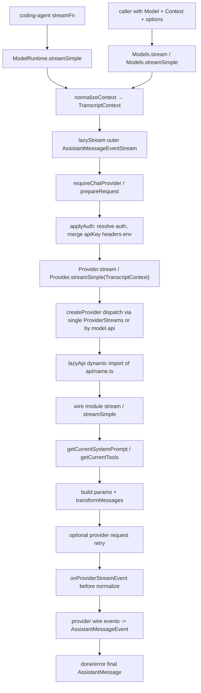

> `spine.provider-stream` 描述 `pi-ai` 中一次 LLM provider streaming call 如何从统一 `Models.stream` / `streamSimple` 入口（`Context`），`normalizeContext()` 成 `TranscriptContext`，经过 provider/API dispatch 与 lazy loading，转成 provider wire request，再归一为 `AssistantMessageEventStream` 事件协议。产品侧 `ModelRuntime.streamSimple()` 与 coding-agent `streamFn` 走同一条 spine。

```mermaid
flowchart TD
  Caller["caller with Model + Context + options"] --> Models["Models.stream / Models.streamSimple"]
  Product["coding-agent streamFn"] --> MR["ModelRuntime.streamSimple"]
  MR --> Norm
  Models --> Norm["normalizeContext → TranscriptContext"]
  Norm --> LazyOuter["lazyStream outer AssistantMessageEventStream"]
  LazyOuter --> ProviderLookup["requireChatProvider / prepareRequest"]
  ProviderLookup --> Auth["applyAuth: resolve auth, merge apiKey headers env"]
  Auth --> Provider["Provider.stream / Provider.streamSimple(TranscriptContext)"]
  Provider --> Dispatch["createProvider dispatch via single ProviderStreams or by model.api"]
  Dispatch --> LazyApi["lazyApi dynamic import of api/name.ts"]
  LazyApi --> Wire["wire module stream / streamSimple"]
  Wire --> Tools["getCurrentSystemPrompt / getCurrentTools"]
  Tools --> Transform["build params + transformMessages"]
  Transform --> Retry["optional provider request retry"]
  Retry --> Observe["onProviderStreamEvent before normalize"]
  Observe --> Normalize["provider wire events -> AssistantMessageEvent"]
  Normalize --> Result["done/error final AssistantMessage"]
```

## 能回答的问题

- `Models.stream` 和 `Models.streamSimple` 各自在哪一层做 auth，在哪一层把 `Context` 收成 `TranscriptContext`？
- 产品侧 `ModelRuntime.streamSimple` 与 `pi-ai` `Models.streamSimple` 差在哪里？
- custom / builtin provider 的 `stream` 输入为什么必须读 `getCurrentSystemPrompt` / `getCurrentTools`？
- `model.api` 如何选择 `packages/ai/src/api/<name>.ts` 的 `ProviderStreams`？
- `onProviderStreamEvent` 在归一化之前观察什么？
- `lazyStream` / `lazyApi` 为什么能同步返回 stream，同时把 setup failure 编码成 stream error？
- API implementation 如何把 Anthropic/OpenAI 等 provider-specific streaming event 归一成 `AssistantMessageEventStream`？

## 端到端步骤

1. 入口对象是 `ModelsImpl`，它持有 `Provider` map。公开 `Models.stream(model, context: Context, options?)` 先 `const transcript = normalizeContext(context)`，再 `lazyStream(model, async () => ...)` 同步构造并返回 outer `AssistantMessageEventStream`。`complete()` 只是 `this.stream(...).result()`。真正的 provider lookup 和 auth resolution 在异步 setup 内执行。[E: packages/ai/src/models.ts:871] [E: packages/ai/src/models.ts:876] [E: packages/ai/src/models.ts:877] [E: packages/ai/src/models.ts:892] [E: packages/ai/src/api/lazy.ts:46] [E: packages/ai/src/api/lazy.ts:60] [E: packages/ai/src/utils/transcript.ts:30]
2. `normalizeContext` 把 `Context.systemPrompt` / `Context.tools` 折成 leading system message（`toolsAdded`），产出带 brand 的 `TranscriptContext`。这是唯一生产该类型的入口；provider 与 `api/<name>.ts` 只接收 `messages`。[E: packages/ai/src/utils/transcript.ts:20] [E: packages/ai/src/utils/transcript.ts:30] [E: packages/ai/src/utils/transcript.ts:33] [E: packages/ai/src/types.ts:732] [E: packages/ai/src/types.ts:746]
3. setup 回调先 `requireChatProvider(model)`，再 `applyAuth(model, options)`，最后调用 `provider.stream(requestModel, transcript, requestOptions)`。`streamSimple` 同样先 `normalizeContext`，最终调用 `provider.streamSimple(requestModel, transcript, requestOptions)`。[E: packages/ai/src/models.ts:878] [E: packages/ai/src/models.ts:883] [E: packages/ai/src/models.ts:895] [E: packages/ai/src/models.ts:896] [E: packages/ai/src/models.ts:900]
4. 产品侧 `pi-coding-agent` 把 loop 的 `streamFn` 接到 `ModelRuntime.streamSimple()`。`ModelRuntime.streamSimple` 同样先 `normalizeContext`，虚拟 model 会 `resolveModel` 后再递归 `streamSimple`；普通 chat model 走 `prepareRequest` 后 `provider.streamSimple`。[E: packages/coding-agent/src/core/sdk.ts:396] [E: packages/coding-agent/src/core/sdk.ts:406] [E: packages/coding-agent/src/core/model-runtime.ts:715] [E: packages/coding-agent/src/core/model-runtime.ts:716] [E: packages/coding-agent/src/core/model-runtime.ts:717] [E: packages/coding-agent/src/core/model-runtime.ts:736] [E: packages/coding-agent/src/core/model-runtime.ts:739]
5. `Provider.stream` / `ProviderStreams.stream` 的 context 参数是 `TranscriptContext`。wire module 用 `getCurrentSystemPrompt(messages)` / `getCurrentTools(messages)`（或 `getInitialSystemMessage` / `resolveTranscriptTools`）读 prompt 与当前工具，而不是 `context.systemPrompt` / `context.tools`。[E: packages/ai/src/models.ts:204] [E: packages/ai/src/types.ts:287] [E: packages/ai/src/utils/transcript.ts:58] [E: packages/ai/src/utils/transcript.ts:99] [E: packages/ai/src/api/anthropic-messages.ts:578] [E: packages/ai/src/api/openai-completions.ts:808]
6. `applyAuth` 使用 `getAuth` 取回 provider/model 的 request auth，把 auth `baseUrl` 写入 `requestModel`，并按字段合并 `apiKey`、`headers`、`env`；显式请求 options 对 `apiKey` 优先，`headers` 按 key 合并。[E: packages/ai/src/models.ts:837] [E: packages/ai/src/models.ts:848] [E: packages/ai/src/models.ts:859] [E: packages/ai/src/models.ts:860]
7. `createProvider` 把 provider 配置里的 `api` 归一成两种 chat dispatch：单一 `ProviderStreams` 直接复用，或者 `Partial<Record<api, ProviderStreams>>` 按 `model.api` 查找。没有匹配 API implementation 时 `dispatch` **同步返回** `lazyStream`，throw 发生在 setup 回调里，因此调用方拿到的是 stream error，不是同步 throw。[E: packages/ai/src/models.ts:1034] [E: packages/ai/src/models.ts:1035] [E: packages/ai/src/models.ts:1063] [E: packages/ai/src/models.ts:1069] [E: packages/ai/src/models.ts:1071] [E: packages/ai/src/models.ts:1072] [E: packages/ai/src/api/lazy.ts:54] `createProvider` 还可以挂 `images` / `classifiers` map；chat spine 只走 `api`。[E: packages/ai/src/models.ts:1021] [E: packages/ai/src/models.ts:1023]
8. `Provider.stream` 和 `Provider.streamSimple` 都只负责把 `model/context/options` 交给 dispatch 选中的 `ProviderStreams.stream` 或 `ProviderStreams.streamSimple`。[E: packages/ai/src/models.ts:1116] [E: packages/ai/src/models.ts:1117] [E: packages/ai/src/types.ts:287] [E: packages/ai/src/types.ts:288]
9. `builtinModels()` 创建 `Models` collection 后遍历 `builtinProviders()` 并 `setProvider(provider)`；内置 provider factory 再把 provider 的 `api` 字段接到 lazy API wrapper，如 OpenAI -> `openAIResponsesApi()`、Anthropic -> `anthropicMessagesApi()`、GitHub Copilot -> `anthropic-messages` / `openai-completions` / `openai-responses` 的 per-API map。[E: packages/ai/src/providers/all.ts:136] [E: packages/ai/src/providers/all.ts:184] [E: packages/ai/src/providers/all.ts:186] [E: packages/ai/src/providers/openai.ts:7] [E: packages/ai/src/providers/openai.ts:22] [E: packages/ai/src/providers/anthropic.ts:74] [E: packages/ai/src/providers/anthropic.ts:88] [E: packages/ai/src/providers/github-copilot.ts:9] [E: packages/ai/src/providers/github-copilot.ts:29] [E: packages/ai/src/providers/github-copilot.ts:30] [E: packages/ai/src/providers/github-copilot.ts:31]
 OpenCode Zen / Go 在 chat dispatch 前用 `withOpenCodeSessionHeader()` 包住各 API：有 `sessionId` 就写 `x-opencode-session`，不看 `cacheRetention`。Zen 四条 chat API（另有 `classifiers: typesafe-system-one`），Go 三条（无 `google-generative-ai`）。[E: packages/ai/src/providers/opencode-headers.ts:10] [E: packages/ai/src/providers/opencode-headers.ts:14] [E: packages/ai/src/providers/opencode-headers.ts:19] [E: packages/ai/src/providers/opencode.ts:20] [E: packages/ai/src/providers/opencode.ts:23] [E: packages/ai/src/providers/opencode.ts:26] [E: packages/ai/src/providers/opencode-go.ts:16] [E: packages/ai/src/providers/opencode-go.ts:18]
10. `lazyApi(load)` 本身实现为 `ProviderStreams`：它的 `stream` 和 `streamSimple` 分别调用 `lazyStream(model, async () => (await load()).stream(...))`。可选 `fetchDeferred` / `cancelDeferred` 同样包在 lazy load 后面，不是本页 chat spine 的主路径。[E: packages/ai/src/api/lazy.ts:73] [E: packages/ai/src/api/lazy.ts:75] [E: packages/ai/src/api/lazy.ts:76] [E: packages/ai/src/api/lazy.ts:77] [E: packages/ai/src/api/lazy.ts:81]
11. lazy wrapper 到 wire module 的绑定是逐 API 显式 dynamic import：`openAIResponsesApi()`、`anthropicMessagesApi()` 和 `openAICompletionsApi()` 都返回 `lazyApi(() => import("./<api>.ts"))`。[E: packages/ai/src/api/openai-responses.lazy.ts:4] [E: packages/ai/src/api/anthropic-messages.lazy.ts:4] [E: packages/ai/src/api/openai-completions.lazy.ts:4]
12. 具体 wire module 的 `streamSimple` 会把统一 `reasoning` 收窄成 provider-specific options：OpenAI Responses/Completions clamp 后传 `reasoningEffort`，Anthropic 无 reasoning 时显式禁用 thinking。[E: packages/ai/src/api/openai-responses.ts:238] [E: packages/ai/src/api/openai-responses.ts:250] [E: packages/ai/src/api/openai-completions.ts:731] [E: packages/ai/src/api/anthropic-messages.ts:928] [E: packages/ai/src/api/anthropic-messages.ts:941]
13. `SimpleStreamOptions.maxRetries` / `maxRetryDelayMs` 经 shared option adapter 进入 provider request，并转发 `onProviderStreamEvent`。[E: packages/ai/src/api/simple-options.ts:41] [E: packages/ai/src/api/simple-options.ts:44] 使用共享 helper 的 wire path 会在请求尚未建立成功时按 status/headers 与 server delay 做可取消重试；默认 `maxRetries` 为 0。[E: packages/ai/src/utils/provider-retry.ts:105] [E: packages/ai/src/utils/provider-retry.ts:109] [I]

## `onProviderStreamEvent`

`StreamOptions.onProviderStreamEvent` 在 adapter 把解析后的 provider event 归一成 `AssistantMessageEvent` **之前**调用。event data 是 adapter-owned，必须当只读；不保证是原始 HTTP/SSE bytes。adapter 显式支持才会 invoke。[E: packages/ai/src/types.ts:198]

代表性调用点：Anthropic 在 `iterateAnthropicEvents` 循环里；OpenAI Completions 在 `for await (const chunk of openaiStream)` 里；OpenAI Responses shared processor 在 `for await (const event of openaiStream)` 里；Codex 在 `mapCodexEvents` yield 之前。[E: packages/ai/src/api/anthropic-messages.ts:664] [E: packages/ai/src/api/openai-completions.ts:554] [E: packages/ai/src/api/openai-responses-shared.ts:600] [E: packages/ai/src/api/openai-codex-responses.ts:751]

## 统一消息到 wire payload

`transformMessages(messages, model, normalizeToolCallId?)` 是进入 provider-specific request builder 前的跨 provider normalization：它先按目标 model 的 `input` 能力把 unsupported image blocks 替换为文本 placeholder，再处理 assistant 历史消息里的 thinking blocks、tool call id、errored/aborted turns 和 orphaned tool calls。[E: packages/ai/src/api/transform-messages.ts:64] [E: packages/ai/src/api/transform-messages.ts:74]

`transformMessages` 的 tool-call normalization 维护 assistant/tool-result 一致性：assistant `toolCall.id` 可被 `normalizeToolCallId` 重写并记录到 `toolCallIdMap`，后续 `toolResult.toolCallId` 会按同一映射改写。[E: packages/ai/src/api/transform-messages.ts:70]

多个 wire builders 在生成 provider payload 前显式调用 `transformMessages`，但传入的 tool-call id normalizer 按 API 约束不同：OpenAI Responses 处理 `callId|itemId` 并确保 item id 以 `fc_` 开头，OpenAI Completions 提取/截断 call id，Anthropic 把 id 交给 `normalizeToolCallId` 后再 build params。[E: packages/ai/src/api/openai-responses-shared.ts:179] [E: packages/ai/src/api/openai-completions.ts:1220] [E: packages/ai/src/api/anthropic-messages.ts:1134]

## wire 到归一化事件

`AssistantMessageEventStream` 是 `EventStream<AssistantMessageEvent, AssistantMessage>` 的 specialization；它把 `done` event 的 `message` 或 `error` event 的 `error` 解析为 `.result()` 的 final `AssistantMessage`。[E: packages/ai/src/utils/event-stream.ts:91] [E: packages/ai/src/utils/event-stream.ts:94] [E: packages/ai/src/utils/event-stream.ts:96] [E: packages/ai/src/utils/event-stream.ts:99]

`AssistantMessageEvent` 类型把 normalized stream 限定为 start/text/thinking/toolcall/done/error 事件集合；`StreamFunction` contract 的返回类型同样是 `AssistantMessageEventStream`，输入是 `TranscriptContext`。[E: packages/ai/src/types.ts:371] [E: packages/ai/src/types.ts:373] [E: packages/ai/src/types.ts:767]

OpenAI Responses wire implementation 先创建 `AssistantMessageEventStream`，HTTP stream 建立后 push `start`，再由 `processResponsesStream` 将 Responses output item / delta / done events 归一为 thinking/text/toolcall events。[E: packages/ai/src/api/openai-responses.ts:127] [E: packages/ai/src/api/openai-responses.ts:192] [E: packages/ai/src/api/openai-responses.ts:194] [E: packages/ai/src/api/openai-responses-shared.ts:433]

Anthropic Messages wire implementation 同样创建 `AssistantMessageEventStream`，在 `messages.create` 后 push `start`，再把 Anthropic `content_block_start` / `content_block_delta` / `content_block_stop` 映射到 text/thinking/toolcall 生命周期。[E: packages/ai/src/api/anthropic-messages.ts:571] [E: packages/ai/src/api/anthropic-messages.ts:658] [E: packages/ai/src/api/anthropic-messages.ts:689]

## 关键决策点

- `Models.stream` / `streamSimple` 是统一入口、auth boundary 和 `Context` → `TranscriptContext` 归一边界；provider-specific wire 不再看见 `systemPrompt`/`tools` 顶层字段。[E: packages/ai/src/models.ts:871] [E: packages/ai/src/models.ts:876] [E: packages/ai/src/types.ts:746]
- 产品 `ModelRuntime.streamSimple` 在同一归一边界上多一层 virtual-model routing 与 `prepareRequest`；coding-agent loop 的 `streamFn` 调它，而不是直接调 `Models.streamSimple`。[E: packages/coding-agent/src/core/model-runtime.ts:715] [E: packages/coding-agent/src/core/sdk.ts:406]
- `lazyStream` 把 async setup failure 转为符合 assistant event protocol 的 `error` terminal message。[E: packages/ai/src/api/lazy.ts:46] [E: packages/ai/src/api/lazy.ts:54] [E: packages/ai/src/api/lazy.ts:56]
- `transformMessages` 是 replay compatibility layer，不是 wire serializer：它返回仍然是 `Message[]`。[E: packages/ai/src/api/transform-messages.ts:64]

## 指向 T1/T2 深挖

- `subsys.ai.wire-protocol-dispatch` 应展开每个 `api/<name>.lazy.ts` 和 provider `api` map 的完整表；本页只描述 `createProvider` 的 dispatch spine。
- `subsys.ai.event-stream` 应展开 `EventStream` queue/waiter/result 语义；本页只描述 provider streaming 相关的 event protocol。
- `ref.ai.core-types` 应覆盖 `Model`、`Context`、`TranscriptContext`、`Message`、`AssistantMessageEvent`、`StreamOptions` 的字段级含义。
- `subsys.ai.provider-retry` 区分 request-level backoff 与完整 assistant-call retry。
- `spine.agent-loop` 是 `pi-agent-core` 消费 `AssistantMessageEventStream` 的上游 loop；本页停在 `pi-ai` 归一化事件输出边界。

## Sources

- packages/ai/src/models.ts
- packages/ai/src/types.ts
- packages/ai/src/utils/transcript.ts
- packages/ai/src/providers/all.ts
- packages/ai/src/providers/openai.ts
- packages/ai/src/providers/anthropic.ts
- packages/ai/src/providers/github-copilot.ts
- packages/ai/src/providers/opencode.ts
- packages/ai/src/providers/opencode-go.ts
- packages/ai/src/providers/opencode-headers.ts
- packages/ai/src/api/lazy.ts
- packages/ai/src/api/openai-responses.lazy.ts
- packages/ai/src/api/anthropic-messages.lazy.ts
- packages/ai/src/api/openai-completions.lazy.ts
- packages/ai/src/api/openai-responses.ts
- packages/ai/src/api/openai-responses-shared.ts
- packages/ai/src/api/openai-completions.ts
- packages/ai/src/api/anthropic-messages.ts
- packages/ai/src/api/openai-codex-responses.ts
- packages/ai/src/utils/event-stream.ts
- packages/ai/src/api/transform-messages.ts
- packages/ai/src/api/simple-options.ts
- packages/ai/src/utils/provider-retry.ts
- packages/coding-agent/src/core/model-runtime.ts
- packages/coding-agent/src/core/sdk.ts

## 相关

- [spine.agent-loop](../spine/agent-loop.md) - `pi-agent-core` 如何消费 normalized assistant stream 并推进 agent loop。
- [subsys.ai.wire-protocol-dispatch](../subsystems/ai/wire-protocol-dispatch.md) - `model.api` 到 `api/<name>.ts` implementation 的完整派发表。
- [subsys.ai.event-stream](../subsystems/ai/event-stream.md) - `EventStream` / `AssistantMessageEventStream` 的数据结构和消费语义。
- [ref.ai.core-types](../reference/core-types.md) - `Model`、`Context`、`TranscriptContext`、`Message`、`AssistantMessageEvent` 等核心类型清单。
- [subsys.ai.provider-retry](../subsystems/ai/provider-retry.md) - provider request 与 assistant message 两层 retry 的触发、预算和 backoff。
